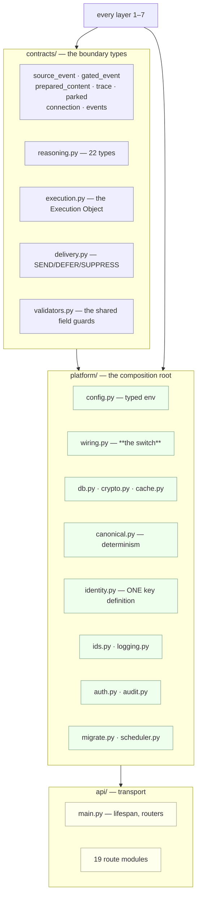

[Folder map](README.md) · [System Design index](../README.md)

---

# Cross-Cutting — `contracts/` · `platform/` · `api/`

Three packages sit **outside** the layer ordering. They are not layers; they are the substrate
every layer stands on.

```python
CROSS_CUTTING: frozenset[str] = frozenset({"contracts", "platform", "api"})
```

| Package | Role | Import rule |
|---|---|---|
| `contracts/` | the types that cross a boundary | may import **nothing but `platform`** and stdlib |
| `platform/` | config · db · crypto · wiring — **the composition root** | may import anything |
| `api/` | transport — the top-level composition surface | may import anything |

---

## §0 · At a glance

| | |
|---|---|
| **`contracts/`** | 12 files · ~2,190 lines |
| **`platform/`** | 14 files · ~1,200 lines |
| **`api/`** | 19 files · ~6,060 lines · **~190 endpoints** |
| **Enforced by** | `tests/test_layer_topology.py` |

---

---

## §1 · What was supposed to be built

From the layer map:

> Cross-cutting (outside the ordering): `contracts/` (boundary types; imports platform only),
> `platform/` (config/db/crypto/wiring — the composition root), `api/` (transport surface).
>
> **The rule that matters:** a lower layer never imports a higher one. Cross-layer needs are met
> by **injection** (platform/wiring resolves and passes values down) or by **data** (a table
> written above, read below).

Which implies three requirements:

1. **A boundary type must be usable by both sides of the boundary** — so it cannot live in either.
2. **Real-vs-dev must be a configuration switch, never a code change.**
3. **The transport surface must never contain business logic** — it composes, it does not decide.

---

---

## §2 · What exists



---

---

## §7 · Strategies

### S1 · A contract belongs to neither side

If a type crosses a boundary, it lives outside both.

### S2 · One switch, one file

`wiring.py` is the only module that knows both the real and the fake implementation of anything.

### S3 · Lazy imports make the dependency graph configurable

A dev run does not import `psycopg`. A test does not import `composio`.

### S4 · One definition of identity, imported downward

`platform/identity.py` exists because two definitions produced two people from one human.

### S5 · Infrastructure fails open; configuration fails closed

Redis degrades to a miss. Audit never raises. **But** a bad migration crashes the boot, and a
degraded delivery preference is refused at the door.

### S6 · Migrations are immutable and checksummed

Ship the next number. Never edit in place.

### S7 · `org_id` is resolved server-side, always

Never from a body, never from a path.

### S8 · The heartbeat belongs to no layer

Which is exactly why it lives in `api/`.

---
