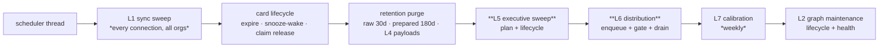

← [platform/ — the composition root](02-Platform.md) · [Folder map](README.md) · → [The Topology Ratchet](04-The-Topology-Ratchet.md)

---

# api/ — the transport surface

---

## §5 · `api/` — the transport surface

### 5.1 · Nineteen route modules, ~190 endpoints

| Module | Surface |
|---|---|
| `routes.py` | the core: health, connections, ingest, sync, parked, coverage, graph, cards, digest, signals, integrations, webhooks — **and `run_maintenance_sweep`** |
| `auth_routes.py` · `account_routes.py` · `workspace_routes.py` | identity, org profile, members, seats |
| `upload_routes.py` · `knowledge_routes.py` | Layer 1's deliberate doors |
| `identity_routes.py` · `situation_routes.py` | Layer 2's merge queue, situations, health, projections |
| `expertise_routes.py` · `usermodel_routes.py` · `policy_routes.py` | Layer 3's four brains |
| `intelligence_routes.py` | Layer 4's query + explain surface |
| `executive_routes.py` | Layer 5's commitments |
| `channel_routes.py` · `delivery_routes.py` · `approval_routes.py` | Layer 6 |
| `agent_mgmt_routes.py` · `audit_routes.py` | agents and the audit read side |

### 5.2 · `run_maintenance_sweep` — the one place the whole system runs

The heartbeat lives in `api/routes.py` because **it is a composition, not a layer**: it calls
into every layer in order and belongs to none of them.

Two ordering decisions are stated inline:

- **Executive before distribution** — *a reminder decided in this tick should leave in the same
  tick rather than waiting a whole interval for the next one.*
- **Graph maintenance last, and not in the L2 drain** — *both are O(graph), not O(event): running
  them per event would make every email pay for a whole-tenant scan.*

**Every stage is individually guarded.** A crashed calibration must not stop card expiry;
a failing org must not stop the others.

### 5.3 · What the API is not allowed to do

The routes **compose**; they do not decide. Where a route looked like it was deciding, the logic
moved down — `deliver/router.py` delegating ownership to `executive/assignment.py` is the same
correction one layer lower.

Two known violations of that principle are recorded honestly:

- `_MATURITY` / `_DISPLAY` in `expertise_routes.py` — pack display metadata hardcoded outside the
  pack.
- `_DEAL_REASON_CODES` in `intelligence_routes.py` — **byte-identical to the sales pack's
  `signal_vocab`**, hand-copied.

Both are noted in [Layer 3 §6](../Layer-3-Domain-Expertise/00-Overview.md).

---
