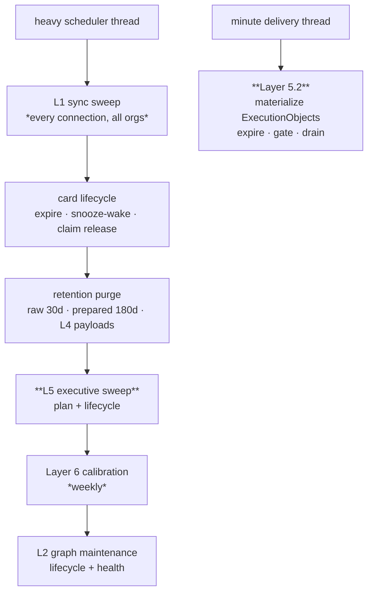

← [platform/ — the composition root](02-Platform.md) · [Folder map](README.md) · → [The Topology Ratchet](04-The-Topology-Ratchet.md)

---

# api/ — the transport surface

---

## §5 · `api/` — the transport surface

### 5.1 · Nineteen route modules, ~190 endpoints

| Module | Surface |
|---|---|
| `routes.py` | the core: health, connections, ingest, sync, parked, coverage, graph, cards, digest, signals, integrations, webhooks — **and `run_maintenance_sweep`** |
| `auth_routes.py` · `account_routes.py` · `workspace_routes.py` | identity, org profile, members, seats |
| `upload_routes.py` · `knowledge_routes.py` | Layer 1's deliberate doors |
| `identity_routes.py` · `situation_routes.py` | Layer 2's merge queue, situations, health, projections |
| `expertise_routes.py` · `usermodel_routes.py` · `policy_routes.py` | Layer 3's four brains |
| `intelligence_routes.py` | Layer 4's query + explain surface |
| `executive_routes.py` | Layer 5's commitments |
| `channel_routes.py` · `delivery_routes.py` · `approval_routes.py` | Layer 5.2 |
| `agent_mgmt_routes.py` · `audit_routes.py` | agents and the audit read side |

### 5.2 · Two heartbeats — heavy maintenance and minute delivery

Both composition entry points live in `api/routes.py` because they coordinate layers and belong to
none of them. `platform/scheduler.py` gives them independent clocks.

The heavy path runs Layer 5 before it returns; the separate delivery thread then materializes any
new commitment/reminder on its next short tick. Retry, quiet-hour, quota and claim-expiry clocks are
therefore measured in minutes, independently of connector sync.

Two ordering decisions remain explicit:

- **Executive owns commitment creation; distribution owns transport** — raw cards and the former
  synchronous agent fan-out cannot create outward rows. Only persisted `ExecutionObject`s enter
  the minute delivery heartbeat.
- **Graph maintenance last, and not in the L2 drain** — *both are O(graph), not O(event): running
  them per event would make every email pay for a whole-tenant scan.*

**Every stage is individually guarded.** A crashed calibration must not stop card expiry;
a failing org must not stop the others.

### 5.3 · What the API is not allowed to do

The routes **compose**; they do not decide. Layer 5.2 routes expose preferences, leased context,
encrypted channel configuration, typed results/inboxes, lifecycle receipts, attempts,
dead letters, replay, capabilities and analytics. Audience, route, priority, timing and retry
remain deterministic engine decisions below the transport surface.

Two known violations of that principle are recorded honestly:

- `_MATURITY` / `_DISPLAY` in `expertise_routes.py` — pack display metadata hardcoded outside the
  pack.
- `_DEAL_REASON_CODES` in `intelligence_routes.py` — **byte-identical to the sales pack's
  `signal_vocab`**, hand-copied.

Both are noted in [Layer 3 §6](../Layer-3-Domain-Expertise/00-Overview.md).

### 5.4 · Destructive account operations are the tenant lock authority

`account_routes.py` begins reset and full deletion with `orgs FOR UPDATE`, then locks graph/pack
authority before retiring or deleting children. All normal tenant-child mutations—including Layer
6 runs, expiry, policy/memory, review/rollback and dashboard/intelligence feedback—first take the
compatible tenant `FOR SHARE` root. Feedback then follows tenant → graph → card; Layer 6 follows
tenant → policy → object/memory/subject locks.

This is an API/platform concurrency contract, not endpoint-local business logic. A discovery query
does not authorize a mutation; the route must re-read/recheck after canonical locks. Real reset/
delete contention on populated PostgreSQL is still required before production erasure claims.
Layer 6's `learning_object_evaluations` also carries its own direct
`org_id → orgs(id) ON DELETE CASCADE` constraint, so audit erasure does not depend only on an
indirect run/object cascade.

---
