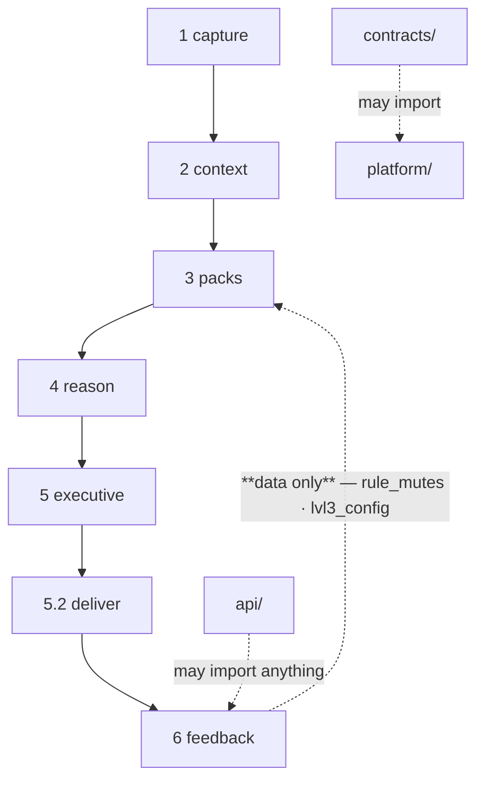

← [api/ — the transport surface](03-API-and-The-Heartbeat.md) · [Folder map](README.md) · → [Gaps and the Map](05-Gaps.md)

---

# The Topology Ratchet

---

## §6 · The topology ratchet

`tests/test_layer_topology.py` reads `genios_engine/LAYERS.py` and walks every import in the
package.

**Rules:**

1. A package may import **same-or-lower import ranks** only.
2. `contracts/` may import **only `platform`** and stdlib.
3. `platform/` and `api/` may import anything.
4. Anything else is **a build failure, not a review nit.**

> It is the mechanism that keeps **domain knowledge out of the engine** and **context out of
> expertise.**

Three places in this codebase exist *because* of that rule, and each is better for it:

| Situation | Resolution |
|---|---|
| Layer 5 must request delivery, but may not import Layer 5.2 | Layer 5 persists one `ExecutionObject`; Layer 5.2 materializes it into its own durable outbox. **The send has one owner, not two** |
| Layer 6 Learning must retune Layer 3/4 | it writes **rows**; the merge reads them. *The consumer stays free to change its mind about what it wants to learn* |
| Layer 5.2 needs a work-owner seed and live authority | it reads the persisted Layer 5 execution and current directory as data, then resolves the current delivery recipient without changing ownership |

---
