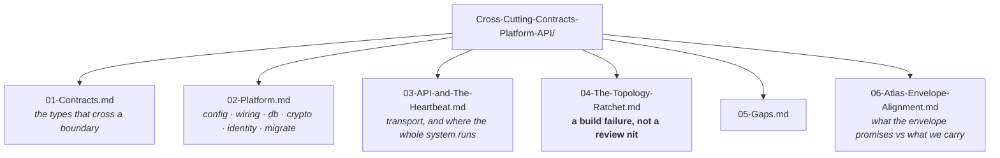

# Cross-Cutting · contracts, platform, api — the folder map

**This folder is the live truth of `contracts/ · platform/ · api/`.** It is the source consulted before any action,
update or improvement to this layer. If a document and the code disagree, the document is wrong —
fix it in the same change that moved the code.

Start at **[00-Overview.md](00-Overview.md)** for the layer in one sitting. Use this page when you
already know what you are looking for.

---

## The one question this layer answers

> **What crosses a boundary, what composes the system, and what enforces the rule?**

---

## The documents

| # | Document | Answers |
|---|---|---|
| 00 | [Overview](00-Overview.md) | Why three packages sit outside the layer ordering |
| 01 | [contracts/](01-Contracts.md) | Why a boundary type belongs to neither side, and the pattern all of them share |
| 02 | [platform/](02-Platform.md) | One switch file, one identity definition, one connection budget |
| 03 | [api/ and the heartbeat](03-API-and-The-Heartbeat.md) | ~190 endpoints, and the one function where the whole system runs in order |
| 04 | [The topology ratchet](04-The-Topology-Ratchet.md) | The four rules, and the three places the codebase is better for them |
| 05 | [Gaps and the map](05-Gaps.md) | Where transport still holds business logic, and the env surface |
| 06 | [Atlas envelope alignment](06-Atlas-Envelope-Alignment.md) | Which of the Atlas's four envelope fields we actually carry, and the one we do not |

---

## Where this layer sits

| | |
|---|---|
| **Package** | `contracts/ · platform/ · api/` |
| **Layer number** | — outside the ordering — `genios_engine/LAYERS.py` |
| **Reads from** | everything |
| **Hands to** | everything |
| **May import** | `contracts/` may import **only `platform`**; `platform/` and `api/` may import anything |
| **LLM calls** | Zero (the API surfaces other layers' calls) |

[← System Design index](../README.md)
