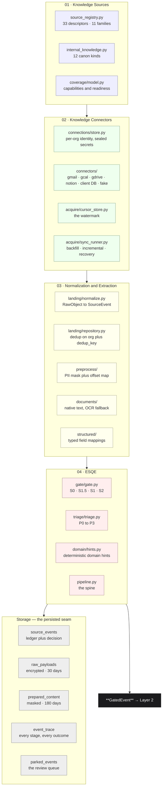
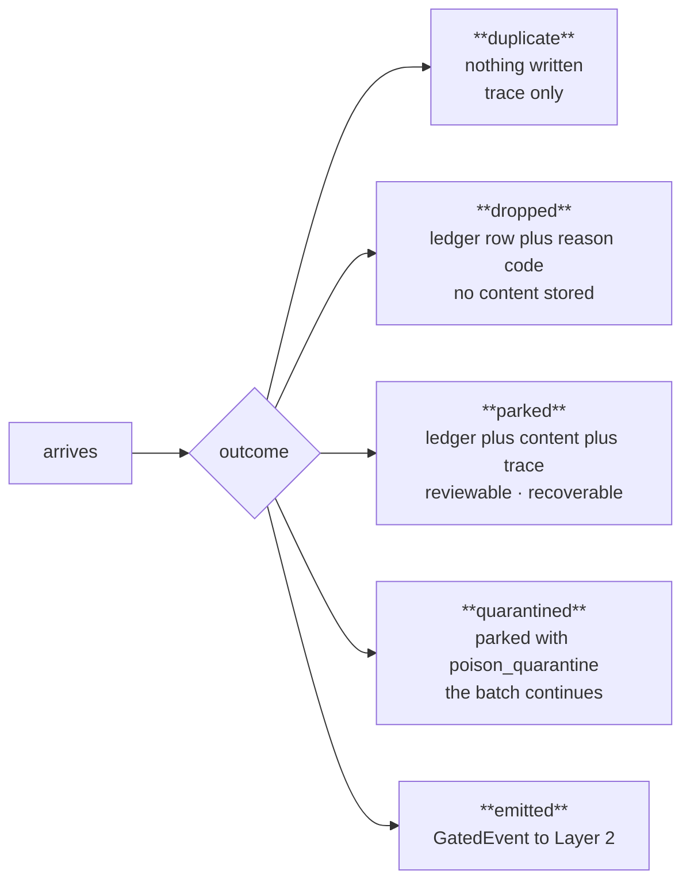

# Layer 1 — The Knowledge Layer (`capture/`)

*The border post. Everything that enters GeniOS arrives here.*

> **The one question this layer answers: "What happened?"**
>
> It collects and qualifies. **It never interprets, never correlates, never decides.** Its only
> promise: everything that leaves it is worth looking at, and everything that does not leave it
> left a written reason why.

Emails, calendar invites, Drive files, Notion pages, rows in the customer's own database,
uploaded PDFs, notes someone typed, actions an AI agent completed — all of it arrives here, and
here it is normalised, deduplicated, cleaned, judged, and either handed to Layer 2 or stopped
with a reason code.

**Layer 1 does not reason.** It never asks *"is this important to the business?"* It asks only
*"is this real, is it new, is it safe to pass on, and how urgently should it be worked?"* The
moment a decision requires knowing anything about the company, it belongs to Layer 2 or above.

---

## §0 · At a glance

| | |
|---|---|
| **Package** | `genios_engine/capture/` |
| **Layer number** | 1 — `genios_engine/LAYERS.py` |
| **Size** | 55 files · ~3,380 lines |
| **Input** | provider APIs via Composio, a client's Postgres/MySQL, HTTP uploads, typed notes, agent callbacks |
| **Output** | `GatedEvent` → Layer 2 *(the spec calls this a `QualifiedEnterpriseSignal`)* |
| **May import** | `contracts/`, `platform/` only |
| **LLM calls** | **Zero. By design, and structurally — there is no model client in this package.** |
| **Tables** | `connections` · `source_events` · `raw_payloads` · `prepared_content` · `event_trace` · `parked_events` · `document_jobs` · `sync_cursors` · `l1_sync_runs` · `agent_registry` · `agent_events` · `human_events` · `source_coverage` |
| **Migrations** | `0002_l1_tables.sql` · `0027_l1_seam.sql` · `0035_l1_internal_knowledge.sql` |

---

## §1 · How to read this folder

The architecture spec divides Layer 1 into four stages. This folder follows that division, and
each sub-folder documents **what the code actually does** at that stage.

| # | Sub-folder | Spec name | Code it documents |
|---|---|---|---|
| 01 | [**Knowledge Sources**](01-Knowledge-Sources/00-Overview.md) | Enterprise Sources | `source_registry.py` · `source_families.py` · `internal_knowledge.py` · `coverage/` |
| 02 | [**Knowledge Connectors**](02-Knowledge-Connectors/00-Overview.md) | Knowledge Connectors | `connectors/` · `connections/` · `acquire/` · `platform/wiring.py` |
| 03 | [**Normalization & Extraction**](03-Normalization-and-Extraction/00-Overview.md) | Content + Event Pipelines | `landing/` · `preprocess/` · `documents/` · `structured/` · the persisted seam |
| 04 | [**ESQE**](04-ESQE/00-Overview.md) | Enterprise Signal Qualification Engine | `gate/` · `triage/` · `domain/` · `pipeline.py` |

Each sub-folder has its own `00-Overview.md` and several leaf documents. Start at a sub-folder
overview; it indexes its own leaves.

---

## §1.1 · Every file in Layer 1, and which stage owns it

**A folder name is not a definition.** This is the complete inventory of `genios_engine/capture/`
— 55 files, ~3,380 lines — assigned to the stage that owns it, with what each file actually does
and the document that opens it up.

### Stage 01 · Knowledge Sources — *what a source is, and what each gives us*

| File | Lines | What it does | Doc |
|---|---|---|---|
| [`source_registry.py`](../../genios_engine/capture/source_registry.py) | 186 | `SourceDescriptor` + 33 descriptors. The single source of truth. Generates the four views that used to drift | [01](01-Knowledge-Sources/01-The-Source-Registry.md) |
| [`source_families.py`](../../genios_engine/capture/source_families.py) | 23 | Re-export shim over the registry, so nothing that imported the old names had to change | [02](01-Knowledge-Sources/02-Source-Families.md) |
| [`internal_knowledge.py`](../../genios_engine/capture/internal_knowledge.py) | 128 | The 12 canon kinds, the alias table, `authority_rank_for`, `is_anchoring` | [06](01-Knowledge-Sources/06-Deliberate-Intake-Sources.md) |
| [`intake.py`](../../genios_engine/capture/intake.py) | 133 | **The one door.** `ingest_manual` · `ingest_internal_knowledge` · `ingest_human_event` · `ingest_agent_event` | [06](01-Knowledge-Sources/06-Deliberate-Intake-Sources.md) |
| [`events_store.py`](../../genios_engine/capture/events_store.py) | 123 | Human + agent event stores, agent registry, `hash_key` | [06](01-Knowledge-Sources/06-Deliberate-Intake-Sources.md) |
| [`coverage/model.py`](../../genios_engine/capture/coverage/model.py) | 63 | `PACK_REQUIREMENTS` · `compute_coverage` · the readiness predicates | [07](01-Knowledge-Sources/07-Coverage-and-Readiness.md) |

### Stage 02 · Knowledge Connectors — *connect, authenticate, remember position, pull*

| File | Lines | What it does | Doc |
|---|---|---|---|
| [`connectors/base.py`](../../genios_engine/capture/connectors/base.py) | 51 | `RawObject` · `SourceBatch` · the `SourceConnector` Protocol | [01](02-Knowledge-Connectors/01-The-Connector-Contract.md) |
| [`connectors/composio_base.py`](../../genios_engine/capture/connectors/composio_base.py) | 27 | `ComposioExec` — the shared lazy client + `execute` | [01](02-Knowledge-Connectors/01-The-Connector-Contract.md) |
| [`connections/store.py`](../../genios_engine/capture/connections/store.py) | 135 | Per-org connections + **secret sealing** with the `enc:` prefix | [02](02-Knowledge-Connectors/02-Connections-and-Secrets.md) |
| [`connectors/composio.py`](../../genios_engine/capture/connectors/composio.py) | 328 | **Gmail.** MIME walk, full-fetch rule, attachments-as-events, the mimetype speed fix | [04](02-Knowledge-Connectors/04-Gmail-Connector.md) |
| [`connectors/calendar.py`](../../genios_engine/capture/connectors/calendar.py) | 87 | Google Calendar. Structured; `content_version` from `ev.updated` so a reschedule re-lands | [05](02-Knowledge-Connectors/05-Calendar-and-Drive-Connectors.md) |
| [`connectors/drive.py`](../../genios_engine/capture/connectors/drive.py) | 90 | Google Drive. Download + native text extraction + provenance dict | [05](02-Knowledge-Connectors/05-Calendar-and-Drive-Connectors.md) |
| [`connectors/notion.py`](../../genios_engine/capture/connectors/notion.py) | 86 | Notion pages → markdown. The `since` filter applied **before** fetching content | [06](02-Knowledge-Connectors/06-Notion-and-Database-Connectors.md) |
| [`connectors/database.py`](../../genios_engine/capture/connectors/database.py) | 81 | The client's own DB, read-only. `_IDENT` / `_safe_ident` SQL-injection defence | [06](02-Knowledge-Connectors/06-Notion-and-Database-Connectors.md) |
| [`connectors/fake.py`](../../genios_engine/capture/connectors/fake.py) | 47 | Deterministic fake — the whole spine runs with no network | [08](02-Knowledge-Connectors/08-The-Fake-Connector.md) |
| [`acquire/cursor_store.py`](../../genios_engine/capture/acquire/cursor_store.py) | 70 | `Cursor` + the per-connection watermark. The no-miss backbone | [07](02-Knowledge-Connectors/07-Acquisition-and-Sync.md) |
| [`acquire/sync_runner.py`](../../genios_engine/capture/acquire/sync_runner.py) | 151 | `run_sync` — 3 modes, pagination, 3-worker pool, poison quarantine, run ledger | [07](02-Knowledge-Connectors/07-Acquisition-and-Sync.md) |

### Stage 03 · Normalization & Extraction — *raw bytes → one envelope, cleaned, masked, typed*

| File | Lines | What it does | Doc |
|---|---|---|---|
| [`landing/normalize.py`](../../genios_engine/capture/landing/normalize.py) | 47 | `to_source_event` — the deterministic envelope + the family-promotion rule | [01](03-Normalization-and-Extraction/01-Landing-and-Deduplication.md) |
| [`landing/repository.py`](../../genios_engine/capture/landing/repository.py) | 42 | The storage seam Protocol + the in-memory implementation | [01](03-Normalization-and-Extraction/01-Landing-and-Deduplication.md) |
| [`landing/pg_repository.py`](../../genios_engine/capture/landing/pg_repository.py) | 64 | Postgres impl. `on conflict (org_id, dedup_key) do nothing` — dedup is a DB index | [01](03-Normalization-and-Extraction/01-Landing-and-Deduplication.md) |
| [`preprocess/pii.py`](../../genios_engine/capture/preprocess/pii.py) | 91 | 5 detectors, Luhn on cards, overlap resolution, **mask + offset map** | [02](03-Normalization-and-Extraction/02-Preprocessing-and-PII.md) |
| [`preprocess/text.py`](../../genios_engine/capture/preprocess/text.py) | 47 | `detect_language` (en/hi/hinglish) + `protected_line_spans` | [02](03-Normalization-and-Extraction/02-Preprocessing-and-PII.md) |
| [`preprocess/preprocess.py`](../../genios_engine/capture/preprocess/preprocess.py) | 25 | Assembles `PreparedContent` | [02](03-Normalization-and-Extraction/02-Preprocessing-and-PII.md) |
| [`documents/base.py`](../../genios_engine/capture/documents/base.py) | 42 | `DocumentInput` · `OcrResult` · `DocumentResult` · `OCR_MIN_CONFIDENCE = 0.75` | [03](03-Normalization-and-Extraction/03-Documents-and-OCR.md) |
| [`documents/native.py`](../../genios_engine/capture/documents/native.py) | 89 | `extract_native_text` — txt/md/html/docx/pdf. **Never raises** | [03](03-Normalization-and-Extraction/03-Documents-and-OCR.md) |
| [`documents/router.py`](../../genios_engine/capture/documents/router.py) | 34 | native → OCR → unsupported, and where low-confidence OCR parks | [03](03-Normalization-and-Extraction/03-Documents-and-OCR.md) |
| [`documents/tesseract.py`](../../genios_engine/capture/documents/tesseract.py) | 26 | `TesseractOcr` behind the Protocol, lazy import | [03](03-Normalization-and-Extraction/03-Documents-and-OCR.md) |
| [`documents/fake.py`](../../genios_engine/capture/documents/fake.py) | 16 | `FakeOcr` — outcome encoded in the ref (`good:` / `weak:`) | [03](03-Normalization-and-Extraction/03-Documents-and-OCR.md) |
| [`documents/store.py`](../../genios_engine/capture/documents/store.py) | 40 | `document_jobs` — parse provenance + the OCR review queue | [03](03-Normalization-and-Extraction/03-Documents-and-OCR.md) |
| [`structured/registry.py`](../../genios_engine/capture/structured/registry.py) | 108 | `FieldMap` · `RelationMap` · `StructuredMapping` + the 4 shipped mappings | [04](03-Normalization-and-Extraction/04-Structured-Mappings.md) |
| [`structured/apply.py`](../../genios_engine/capture/structured/apply.py) | 61 | `apply_mapping` · `apply_relations` — **the cross-tool bridge** | [04](03-Normalization-and-Extraction/04-Structured-Mappings.md) |
| [`payload_store.py`](../../genios_engine/capture/payload_store.py) | 67 | Raw bodies: encrypted, 30-day TTL, **kept-only**, `purge_expired` | [05](03-Normalization-and-Extraction/05-The-Persisted-Seam.md) |
| [`prepared_store.py`](../../genios_engine/capture/prepared_store.py) | 80 | Masked replayable text + offset map, 180-day TTL | [05](03-Normalization-and-Extraction/05-The-Persisted-Seam.md) |

### Stage 04 · ESQE — *the qualification funnel and everything it refuses*

**There is no module called `esqe/`.** The spec's Enterprise Signal Qualification Engine is these
nine files. This is what is inside it and what each one does.

| File | Lines | What it does | Doc |
|---|---|---|---|
| [`gate/__init__.py`](../../genios_engine/capture/gate/__init__.py) | 6 | The docstring that states the contract: *S0 scope → S1 hard rules + whitelist → S1.5 structured short-circuit → route*, every stage recording its decision | [00](04-ESQE/00-Overview.md) |
| [`gate/context.py`](../../genios_engine/capture/gate/context.py) | 27 | `GateContext` — everything the gate is allowed to look at (event, prepared text, raw dict, `is_structured`, `sender_known`, `in_scope`). `GateResult` — action, reason code, route, whitelist code | [01](04-ESQE/01-The-Gate.md) |
| [`gate/gate.py`](../../genios_engine/capture/gate/gate.py) | 54 | `run_gate` — the four stages in order. **The whole file is 54 lines and it is the layer's decision point** | [01](04-ESQE/01-The-Gate.md) |
| [`gate/rules.py`](../../genios_engine/capture/gate/rules.py) | 93 | `whitelist()` → W-01…W-05 · `hard_rule()` → DOC-02, DOC-04, N-01…N-10 · `REASON_LABELS` · the `_NOREPLY` and `_OOO` regexes | [02](04-ESQE/02-Reason-Codes.md) |
| [`gate/relevance.py`](../../genios_engine/capture/gate/relevance.py) | 51 | The `RelevanceClassifier` Protocol — **the swappable LLM slot** — plus today's deterministic implementation and the `_BUSINESS` regex | [03](04-ESQE/03-Relevance-and-Domain-Hints.md) |
| [`domain/hints.py`](../../genios_engine/capture/domain/hints.py) | 32 | `_SOURCE_PRIOR` · 3 keyword regexes · `domain_hints()` → `DomainHint(domain, source)` | [03](04-ESQE/03-Relevance-and-Domain-Hints.md) |
| [`triage/triage.py`](../../genios_engine/capture/triage/triage.py) | 43 | `triage_lane()` — urgent 45 · deadline 25 · known sender 15 · question 10 · structured floor 30 → **P0/P1/P2/P3** | [04](04-ESQE/04-Triage-Lanes.md) |
| [`pipeline.py`](../../genios_engine/capture/pipeline.py) | 227 | **The spine.** `land_raw_object` · `capture_event` · `_linkage_hints` · `_build_gated_event` · `_finish`. Everything above is called from here, in one order | [05](04-ESQE/05-The-Capture-Pipeline.md) |
| [`parked/store.py`](../../genios_engine/capture/parked/store.py) | 96 | The review queue. `ParkedStore` + `parked_from_trace` + the status vocabulary | [06](04-ESQE/06-Outcomes-Traces-and-Parked.md) |
| [`trace_store.py`](../../genios_engine/capture/trace_store.py) | 52 | `event_trace` — one row per stage, written for **every** outcome including drops | [06](04-ESQE/06-Outcomes-Traces-and-Parked.md) |

**Contracts these four stages exchange** *(they live in `contracts/`, outside the layer ordering)*

| File | Lines | Crosses |
|---|---|---|
| [`contracts/connection.py`](../../genios_engine/contracts/connection.py) | 25 | config → connector factory |
| [`contracts/source_event.py`](../../genios_engine/contracts/source_event.py) | 57 | landing → the ledger. `compute_dedup_key` lives here |
| [`contracts/prepared_content.py`](../../genios_engine/contracts/prepared_content.py) | 48 | preprocess → the seam → Layer 2. `to_source_offset` lives here |
| [`contracts/trace.py`](../../genios_engine/contracts/trace.py) | 49 | every stage → `event_trace` |
| [`contracts/parked.py`](../../genios_engine/contracts/parked.py) | 19 | the gate → the review queue |
| [`contracts/gated_event.py`](../../genios_engine/contracts/gated_event.py) | 39 | **Layer 1 → Layer 2.** The spec's `QualifiedEnterpriseSignal` |

> **A note on names.** The spec and the code disagree on vocabulary in three places, and the code
> wins because the code is what runs. Layer 1 is `capture/`, not `knowledge/`. Its output is a
> `GatedEvent`, not a `QualifiedEnterpriseSignal`. There is no module called `esqe/` — the
> qualification funnel is `gate/` plus `triage/` plus `domain/`, orchestrated by `pipeline.py`.
> Each sub-folder states its own mapping once and then uses the code's names.

---

## §2 · The pipeline, end to end

---

## §3 · The thirteen things the spec required

Everything in the sub-folders is measured against this list.

| # | Required | Status | Where |
|---|---|---|---|
| 1 | Ten source families | ✅ eleven, including the honest `unclassified` | [Sources · Families](01-Knowledge-Sources/02-Source-Families.md) |
| 2 | Internal Sources | ✅ 12 kinds, canon at authority rank 4 | [Sources · Deliberate Intake](01-Knowledge-Sources/06-Deliberate-Intake-Sources.md) |
| 3 | One immutable envelope | ✅ `SourceEvent` v3, append-only | [Norm · Landing](03-Normalization-and-Extraction/01-Landing-and-Deduplication.md) |
| 4 | No-miss ingestion | ✅ watermark + overlap + dedup + recovery mode | [Connectors · Acquisition](02-Knowledge-Connectors/07-Acquisition-and-Sync.md) |
| 5 | A deterministic gate | ✅ S0/S1.5/S1/S2, zero LLM calls | [ESQE · The Gate](04-ESQE/01-The-Gate.md) |
| 6 | Park, never delete | ✅ with content, recoverable | [ESQE · Outcomes](04-ESQE/06-Outcomes-Traces-and-Parked.md) |
| 7 | Full traceability | ✅ `event_trace`, every stage, every outcome | [ESQE · Outcomes](04-ESQE/06-Outcomes-Traces-and-Parked.md) |
| 8 | PII never reaches a model | ✅ masked, with a reversible offset map | [Norm · Preprocessing](03-Normalization-and-Extraction/02-Preprocessing-and-PII.md) |
| 9 | Documents & OCR | ⚠️ works — but the **upload** path is not wired to OCR | [Norm · Documents](03-Normalization-and-Extraction/03-Documents-and-OCR.md) |
| 10 | Structured short-circuit | ✅ 4 mappings, relations included | [Norm · Structured](03-Normalization-and-Extraction/04-Structured-Mappings.md) |
| 11 | Triage lanes | ✅ P0–P3, and the drain honours them | [ESQE · Triage](04-ESQE/04-Triage-Lanes.md) |
| 12 | A filter, not a warehouse | ✅ dropped noise stores no content; TTLs enforced | [Norm · The Seam](03-Normalization-and-Extraction/05-The-Persisted-Seam.md) |
| 13 | Coverage / readiness | ⚠️ works for apps; does not yet count written knowledge | [Sources · Coverage](01-Knowledge-Sources/07-Coverage-and-Readiness.md) |

**And one the spec did not ask for, which turned out to matter most:** every rejection carries a
**named reason code**, recorded in `event_trace`, for every outcome including drops.

---

## §4 · The nine strategies

The decisions that shaped this layer, each argued in full in the sub-folder that owns it.

### S1 · Heavy at ingestion, light at runtime

Every deterministic thing Layer 1 can compute is computed **once, at ingest, and persisted** —
the gate route, the triage lane, the domain hints, the linkage hints, and the PII-masked prepared
text with its offset map.

> Before migration `0027_l1_seam.sql`, Layer 1 computed all of that and **threw it all away** —
> the real handoff was a SQL query over `source_events` joined to `raw_payloads`, and Layer 2
> re-derived clean text itself. That inverted the principle and made `[start, end]` evidence
> offsets impossible.

### S2 · Every rejection has a name

There is no anonymous filtering. Every drop, park and short-circuit carries a reason code with a
human-readable label. You can always answer: *what came in, which stage filtered it, and why.*

### S3 · Park, never delete

Ambiguity parks. Poison quarantines. Neither disappears. The only things that hard-drop are
very-high-certainty noise signals — a provider's own spam label, an unsubscribe header, a machine
acknowledgement.

### S4 · The vendor is behind the interface

Composio provides auth and data delivery. It does not own the acquisition loop, the envelope, the
gate, or the graph. **Any connector can be swapped for a native implementation without a
downstream change.**

### S5 · Data over code

The source registry, the structured mappings, the dispatch tables, the pack requirements — all
data structures, all inspectable, all testable. **Adding a source is adding a descriptor.** This
is what makes the drift-detection tests possible at all.

### S6 · Absence is not evidence

Coverage readiness predicates exist so that *"the calendar is not connected"* can never be
mistaken downstream for *"no meeting was booked."*

### S7 · Provenance is Layer 1's to know

Authority is a property of provenance, and provenance is what capture knows. Layer 1 sets
`internal_kind`; **Layer 2 honours it rather than re-deriving it from the source name.**

### S8 · Fail one object, not the batch

Bounded retries, poison quarantine, per-connection error isolation, per-org isolation in the
sweep, and a ledger write that can never fail a sync. **One stuck tenant does not become an
outage.**

### S9 · Privacy as a storage property

High-risk PII is masked before anything leaves the layer. Raw bodies are encrypted, TTL'd to 30
days, and **stored only for kept events**. Dropped noise is never stored at all. Secrets inside
connection configs are sealed at rest.

---

## §5 · Where an event can end its life

**Five terminal states, all of them visible.** There is no sixth state in which an event silently
disappears.

---

## §6 · Gaps — what is still broken

### Confirmed defects

| # | Problem | Severity |
|---|---|---|
| 1 | **Big uploads are silently truncated.** The limit is 60 chunks × 2,000 chars ≈ **50 pages**. A 200-page handbook is read to page 50, the rest thrown away, and the API reports **"indexed"**. *The danger is not the limit — it is that it reports success.* | **worst** |
| 2 | **Text is cut at arbitrary 2,000-character points** — mid-sentence, mid-word, mid-table. Neither half of a split fact means anything alone. This quietly degrades everything extracted from every document. | high |
| 3 | **Scanned PDFs work by email but not by upload.** The upload path was never wired to the OCR that already exists and already works. | high |
| 4 | **Uploading the same file twice creates two copies.** No content-level "seen this document" check. *Mitigated:* a content cache means the AI cost does not double. | medium |
| 5 | **Written knowledge cannot be listed or deleted.** Only an add endpoint exists. Uploads have list + delete; this door does not. | medium |
| 6 | **Only four provider tools can be connected** — Gmail, Google Calendar, Notion, Google Drive, plus the client's own database. | structural |

### Planned work

| Step | What | Why it matters |
|---|---|---|
| 3 | Source-type-aware filters | The noise gate only understands email. **For every other source type it does nothing at all.** |
| **4** | **One generic handler for any Composio tool** | **The big one.** The live-event webhook is hardcoded for Gmail. Until this is done, *"add more sources later"* means *"write a new connector every time."* |
| 5 | Mappings into config files | Adding a mapping should not mean editing Python. |
| 6 | Add 2–3 tools to prove it | If step 4 is right, this needs **zero** pipeline code. |

### Deliberately not done

**Company knowledge is not counted in the coverage dashboard.** That dashboard computes readiness
from *connected apps*. Written knowledge is not an app, so it has no connection record. Adding it
now would make it show **"not connected" forever** — even after you upload every document you own.
*That is a new wrong answer replacing an old one.*

**N-11 / N-12 / N-20 are not in the gate.** They require entity linkage and relevance, which
require graph knowledge. Layer 1 must not reach upward for it.

**Company Memory is not an internal knowledge kind.** Memory is derived from what the graph has
already seen; re-ingesting it as a source would launder yesterday's inference into today's
evidence. Memory belongs to Layer 2.

---

## §7 · The map

### Files, by concern

| Concern | Files |
|---|---|
| Registry & families | `source_registry.py` · `source_families.py` · `coverage/model.py` |
| Connections | `connections/store.py` · `contracts/connection.py` · `platform/wiring.py` |
| Connectors | `connectors/{base,composio,composio_base,calendar,drive,notion,database,fake}.py` |
| Acquisition | `acquire/{cursor_store,sync_runner}.py` |
| Landing | `landing/{normalize,repository,pg_repository}.py` |
| Preprocess | `preprocess/{pii,text,preprocess}.py` |
| Documents | `documents/{base,native,router,store,tesseract,fake}.py` |
| Gate | `gate/{context,gate,rules,relevance}.py` |
| Triage | `triage/triage.py` |
| Structured | `structured/{registry,apply}.py` |
| Domain hints | `domain/hints.py` |
| Stores | `payload_store.py` · `prepared_store.py` · `trace_store.py` · `parked/store.py` · `events_store.py` |
| Intake | `intake.py` · `internal_knowledge.py` |
| The spine | `pipeline.py` |

### The HTTP surface

| Endpoint | Purpose |
|---|---|
| `POST /connections` · `GET /connections` | register / list a tenant's sources |
| `POST /ingest/all` | cross-org cron sweep — **internal-only**, so a tenant cannot trigger a cross-org run or learn which orgs exist |
| `POST /sync/{connection_id}` | one connection, on demand |
| `GET /parked` · `POST /parked/{event_id}/recover` | the review queue |
| `GET /coverage` | capability status + readiness predicates |
| `POST /webhooks/composio` | live push events |
| `GET /auth/{tool}/connect` · `POST /integrations/{tool}/disconnect` · `GET /integrations/status` | connection lifecycle |
| `POST /api/org/{org}/upload` · `GET`/`DELETE`/`PATCH .../uploads/...` | files |
| `POST /api/org/{org}/knowledge` · `GET .../knowledge/kinds` | write company canon |
| `POST /human-events` · `POST /agent-events` · `POST /agents/register` | the deliberate doors |

### Tests

`test_source_registry.py` · `test_l1_seam.py` · `test_gate.py` · `test_preprocess.py` ·
`test_documents.py` · `test_structured.py` · `test_structured_dedup.py` · `test_sync.py` ·
`test_events_parked.py` · `test_intake_one_door.py` · `test_internal_knowledge.py` ·
`test_domain_coverage.py`

---

## §8 · The one thing to fix first

**Silent truncation on upload.** Everything downstream inherits the quality of Layer 1's evidence,
and a system that reports `"indexed"` while holding a quarter of a document is the one failure
mode that cannot be detected from any layer above.
