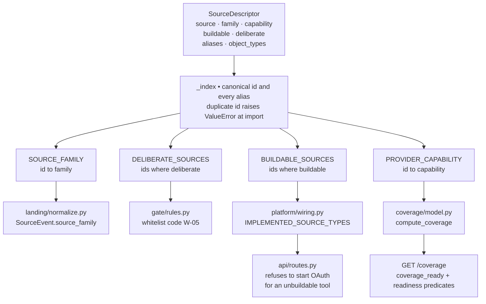

# Knowledge Sources — Overview

*Layer 1 · `genios_engine/capture/` · where a source is described, once*

> **What is "a source" in this codebase, and what stops the four things we know about it
> from disagreeing with each other?**

| | |
|---|---|
| **Files** | [source_registry.py](../../../genios_engine/capture/source_registry.py) · 186 lines — the whole subsystem |
| | [source_families.py](../../../genios_engine/capture/source_families.py) · 23 lines — a re-export shim |
| | [internal_knowledge.py](../../../genios_engine/capture/internal_knowledge.py) · 128 lines — the `internal` source's vocabulary |
| | [coverage/model.py](../../../genios_engine/capture/coverage/model.py) · 63 lines — capabilities → pack readiness |
| **Owns** | The taxonomy of families, the descriptor of every source, and the four views derived from it |
| **Emits** | Nothing at runtime. It is *declared data* every other L1 unit reads |
| **Declared today** | **33 descriptors · 37 accepted ids · 11 families · 7 capabilities · 11 buildable ids** |
| **Consumed by** | [landing/normalize.py](../../../genios_engine/capture/landing/normalize.py) · [gate/rules.py](../../../genios_engine/capture/gate/rules.py) · [platform/wiring.py](../../../genios_engine/platform/wiring.py) · [coverage/model.py](../../../genios_engine/capture/coverage/model.py) · [api/routes.py](../../../genios_engine/api/routes.py) |
| **Tests** | [tests/test_source_registry.py](../../../tests/test_source_registry.py) — 12 tests, each named after the drift it prevents |
| **LLM calls** | Zero. This is a table of constants |

---

## 1 · What "a source" means here

A **source** is a vendor-or-door identity: `gmail`, `notion`, `postgres`, `upload`, `human`.
It is *not* a connection (that is one org's authorised account) and *not* an object type
(that is `message`, `deal`, `calendar_event`). One source, many connections, several object
types.

Four different questions get asked about a source, at four different moments in the engine:

| Question | Asked by | Answered by |
|---|---|---|
| What **kind of reality** did this come from? | [landing/normalize.py](../../../genios_engine/capture/landing/normalize.py), at envelope time | `family` |
| Can we actually **build a connector** for it? | [api/routes.py](../../../genios_engine/api/routes.py), before starting an OAuth flow | `buildable` |
| What **capability** does it give a domain pack? | [coverage/model.py](../../../genios_engine/capture/coverage/model.py), at the coverage dashboard | `capability` |
| Did a person **deliberately hand it to us**? | [gate/rules.py](../../../genios_engine/capture/gate/rules.py), before the noise codes run | `deliberate` |

**All four answers now come from one `SourceDescriptor`.** That sentence is the entire point
of this subsystem, and it is a recent repair, not the original design.

---

## 2 · The four lists that drifted

The module docstring states the problem in its own words:

> A source used to be described in four independent places that nothing checked against
> each other:
>
>   * its family              — source_families.SOURCE_FAMILY
>   * whether it can be built — platform.wiring.IMPLEMENTED_SOURCE_TYPES
>   * which coverage capability it satisfies — coverage.model.PROVIDER_CAPABILITY
>   * its object mappings     — structured.registry

Four hand-maintained lists in four files, edited by whoever was touching that file that day.
Nothing compared them. Nothing *could* compare them — there was no shared object to compare
against. They drifted, and the drift was invisible because each list was individually correct
by its own lights.

---

## 3 · The three defects the drift produced

These are quoted from the code, not reconstructed. Two of them are named in the module
docstring; the third is named in the tests.

### 3.1 Six invisible sources

> `stripe`, `razorpay`, `zendesk`, `intercom`, `mscal`, `mixpanel` carried a coverage
> capability but NO family — so every event from them landed as `unclassified`, and a
> `stripe.subscription.v1` structured mapping existed for a source the taxonomy did
> not know. (No live impact yet: none of them is buildable.)

Six sources appeared in `PROVIDER_CAPABILITY` and were absent from `SOURCE_FAMILY`. Because
`family_of()` returns `"unclassified"` for anything it does not know — the correct, honest
behaviour for a genuinely unknown source — the omission could not announce itself. Worse,
[structured/registry.py](../../../genios_engine/capture/structured/registry.py) carried a
complete, working field mapping (`stripe.subscription.v1`) pointing at a source the taxonomy
had never heard of.

The parenthetical is the honest part: **no live impact, because none of the six is buildable.**
The defect was latent, waiting for the first Stripe connector.

### 3.2 Under-reported calendar and Drive coverage

From [coverage/model.py](../../../genios_engine/capture/coverage/model.py):

> Derived from the source registry, not hand-listed: this list drifting from the family
> taxonomy is why `stripe` had a capability but no family. Alias ids resolve too, so a
> connection stored as source_type='google_calendar' now counts toward `calendar`
> coverage — hand-listing only the canonical id silently under-reported it.

`gcal` has two aliases, `calendar` and `google_calendar`. `gdrive` has `drive` and
`google_drive`. The hand-written `PROVIDER_CAPABILITY` dict held only the canonical ids. A
connection row written as `source_type='google_calendar'` therefore contributed **nothing** to
calendar coverage — the org had its calendar connected and the dashboard said it did not, which
in turn switched off the `can_evaluate_no_meeting` readiness predicate downstream. Detail in
[07 · Coverage and Readiness](07-Coverage-and-Readiness.md).

### 3.3 A domain that could never be ready, with nothing able to say so

> `hubspot` advertises the `crm` capability that the `sales` pack REQUIRES, while no
> connector can be built for it — so `sales` can never be coverage_ready, and nothing
> in the codebase could say so.

`PACK_REQUIREMENTS["sales"]["required"]` is `["communication", "crm"]`. Only `hubspot` and
`salesforce` carry `capability="crm"`, and neither is `buildable`. The arithmetic was always
decidable — required capabilities minus capabilities of buildable sources — but no single
place held both halves, so nobody could do the subtraction.

It is now a test, and it is a **ratchet, not a waiver**:

```python
KNOWN_UNSATISFIABLE_CAPABILITIES = frozenset({"crm", "support_desk", "finance"})
```

> This is a ratchet, not a waiver: adding a new unsatisfiable requirement fails, and so
> does closing one of these without deleting its line.

Three of GeniOS's three domain packs — `sales`, `support`, `admin` — each require at least one
capability on that list. **As shipped, no pack can reach `coverage_ready`.** That is now a
written fact with a failing test guarding it, rather than a silent property of the system.

---

## 4 · One descriptor, four derived views



The four names on the right of the fan-out are the **old** names. That is deliberate:

> Adding a source is now one descriptor here. The four old names are derived views over
> this module, so no call site changed.

Nothing that imported `SOURCE_FAMILY` or `IMPLEMENTED_SOURCE_TYPES` had to be touched. The
repair was structural and invisible to callers — which is why it was possible to do at all.

---

## 5 · The census

What is actually declared today, counted from
[source_registry.py](../../../genios_engine/capture/source_registry.py):

| | Count | Detail |
|---|---|---|
| Descriptors | **33** | `SOURCES` tuple |
| Accepted ids | **37** | 33 canonical + 4 aliases: `calendar`, `google_calendar`, `drive`, `google_drive` |
| Families declared | **11** | see [02 · The Source Families](02-Source-Families.md) |
| Families with at least one source | **8** | `external` and `live_event` are declared and empty; `unclassified` is a fallback, never assigned |
| Capabilities | **7** | `communication` · `calendar` · `document_store` · `crm` · `finance` · `support_desk` · `product_usage` |
| Sources with a capability | 19 ids | 15 canonical + 4 aliases |
| Buildable ids | **11** | `gmail` · `gcal`+2 aliases · `notion` · `gdrive`+2 aliases · `postgres` · `database` · `mysql` |
| Deliberate ids | **4** | `upload` · `internal` · `human` · `agent` |
| Sources with enumerated object types | **9** | the other 24 declare `()` — *not enumerated*, not *none* |
| Structured mappings | 4 | `hubspot.deal.v1` · `stripe.subscription.v1` · `gcal.event.v1` · `postgres.customer_accounts.v1` |

The gap between **19 sources with a capability** and **11 buildable ids** is the shape of the
product's current honesty problem: most of what the taxonomy can describe, the engine cannot
yet connect to. The registry makes that gap countable.

---

## 6 · The documents in this folder

| # | Document | Answers |
|---|---|---|
| **00** | **Overview** *(this page)* | What a source is, and why one description replaced four |
| 01 | [The Source Registry](01-The-Source-Registry.md) | `SourceDescriptor` field by field, `_index()`, the four derived views, the 12 invariant tests, and how to add a source |
| 02 | [The Source Families](02-Source-Families.md) | All eleven families, why `unclassified` is honest, how family reaches the database, and the `internal` promotion rule |
| 03 | [Communication Sources](03-Communication-Sources.md) | The ten `communication` descriptors — which can actually be connected, and what survives of a Gmail message or a calendar event |
| 04 | *Knowledge Sources* | `notion` · `gdrive` · `confluence` · `upload` — the `knowledge` family. **Not yet written** |
| 05 | [Enterprise System Sources](05-Enterprise-System-Sources.md) | The eleven systems of record, and the structured route a changed row takes |
| 06 | [Deliberate Intake](06-Deliberate-Intake-Sources.md) | `internal` · `human` · `agent` · `upload` — the one door, canon authority, and W-05 |
| 07 | [Coverage and Readiness](07-Coverage-and-Readiness.md) | `PACK_REQUIREMENTS`, `compute_coverage`, and what a layer above must refuse to conclude from absent data |

Upwards: [Layer 1 Overview](../00-Overview.md).

---

## 7 · Gaps

Verified against the code, not assumed.

| # | Gap | Evidence |
|---|---|---|
| 1 | **`GatedEvent` does not carry `source_family`.** `source_families.py` says *"Every SourceEvent carries a family so downstream layers can reason about the KIND of reality an event came from"* — and it does, on the envelope and in the `source_events` column. But the L1→L2 contract object has no `source_family` field, and no file under `context/` reads the column. The family's only runtime consumer today is L1's own `whitelist()` | [gated_event.py](../../../genios_engine/contracts/gated_event.py) has no such field; `grep source_family` finds no hit in `context/` |
| 2 | **The 0027 backfill is narrower than the taxonomy it claims to mirror.** Its comment says *"same mapping as capture/source_families.py"*, but the `CASE` has no `operational` branch — historical `github` / `gitlab` / `jira` / `linear` rows backfilled to `'unclassified'`, as did all six of the sources from §3.1 | [0027_l1_seam.sql](../../../migrations/0027_l1_seam.sql) lines 17–26 |
| 3 | **Two families are declared and empty.** `external` and `live_event` have no descriptor. The taxonomy is declared ahead of the sources, which is defensible — but nothing today can produce an event in either | `SOURCES` contains no descriptor with those families |
| 4 | **`imap` and `inkbox` connect outside the registry's `buildable` gate.** [workspace_routes.py](../../../genios_engine/api/workspace_routes.py) has its own connect path writing to `workspace_accounts`, which `_connected_capabilities()` never reads. Both descriptors also carry `capability=None`, so a customer's real IMAP mailbox contributes zero `communication` coverage even once it ingests | `_sync_workspace_account` verifies liveness only — *"Full message ingestion into L1 for these custom sources is the connector build"* |
| 5 | **Deliberate intake is not counted in coverage.** `upload`, `internal`, `human` and `agent` have no capability, by design — a typed policy is not a CRM. But it means an org that has told GeniOS a great deal about itself still reads as uncovered | no `capability=` on any of the four descriptors |

---

## 8 · Map

| Kind | Path |
|---|---|
| Registry | [capture/source_registry.py](../../../genios_engine/capture/source_registry.py) |
| Family shim | [capture/source_families.py](../../../genios_engine/capture/source_families.py) |
| Internal kinds | [capture/internal_knowledge.py](../../../genios_engine/capture/internal_knowledge.py) |
| Coverage | [capture/coverage/model.py](../../../genios_engine/capture/coverage/model.py) |
| Structured mappings | [capture/structured/registry.py](../../../genios_engine/capture/structured/registry.py) |
| Connector dispatch | [platform/wiring.py](../../../genios_engine/platform/wiring.py) |
| Envelope | [contracts/source_event.py](../../../genios_engine/contracts/source_event.py) |
| L1→L2 contract | [contracts/gated_event.py](../../../genios_engine/contracts/gated_event.py) |
| Family assignment | [capture/landing/normalize.py](../../../genios_engine/capture/landing/normalize.py) |
| Deliberate bypass | [capture/gate/rules.py](../../../genios_engine/capture/gate/rules.py) |
| Migration | [migrations/0027_l1_seam.sql](../../../migrations/0027_l1_seam.sql) |
| Tests | [tests/test_source_registry.py](../../../tests/test_source_registry.py) · [tests/test_internal_knowledge.py](../../../tests/test_internal_knowledge.py) · [tests/test_l1_seam.py](../../../tests/test_l1_seam.py) |
| Endpoints | `GET /coverage` · `POST /connect/initiate` · `GET /auth/{tool}/connect` — all in [api/routes.py](../../../genios_engine/api/routes.py) |
