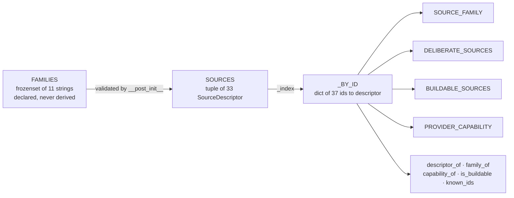

# The Source Registry

*Layer 1 · [capture/source_registry.py](../../../genios_engine/capture/source_registry.py) · 186 lines, one dataclass, one tuple, four derived dicts*

> **If I add a new source tomorrow, what exactly do I have to write, and what will fail if
> I get it half right?**

| | |
|---|---|
| **File** | [capture/source_registry.py](../../../genios_engine/capture/source_registry.py) |
| **Owns** | `FAMILIES`, `DELIBERATE_FAMILIES`, `SourceDescriptor`, `SOURCES`, and the four derived views |
| **Imports** | `capture.internal_knowledge.INTERNAL_KINDS` — nothing else. No I/O, no config, no clock |
| **Emits** | Module-level constants, built at import |
| **Fails at** | **import time**, on an unknown family or a duplicate id — never at runtime |
| **Tests** | [tests/test_source_registry.py](../../../tests/test_source_registry.py) — 12 tests |

---

## 1 · The shape

Three declarations and four derivations, in that order:



Everything below the `SOURCES` tuple is a projection of it. There is no state, no
registration function, no plugin hook. **A source that is not in that tuple does not exist to
Layer 1**, and the failure mode when you ask about one is defined rather than accidental.

---

## 2 · `SourceDescriptor`, field by field

```python
@dataclass(frozen=True, slots=True)
class SourceDescriptor:
    """Everything Layer 1 knows about one source, in one place."""

    source: str
    family: str
    capability: str | None = None
    buildable: bool = False
    deliberate: bool = False
    aliases: tuple[str, ...] = ()
    # () means NOT ENUMERATED (tenant-defined, e.g. client DB tables) — never "none".
    object_types: tuple[str, ...] = ()
```

`frozen=True` makes a descriptor hashable and prevents a caller mutating shared taxonomy at
runtime. `slots=True` is the cheap-object choice for something instantiated 33 times at import
and read on every event.

### `source` — the canonical id

The string a connector puts in `RawObject.source` and that lands in `source_events.source`.
Lower-case by convention; `descriptor_of()` lower-cases its *argument* but `_index()` does not
lower-case the *declared* key, so a descriptor written with a capital letter would be
permanently unreachable. Nothing enforces that today.

### `family` — what kind of reality this is

Validated on construction:

```python
def __post_init__(self) -> None:
    if self.family not in FAMILIES:
        raise ValueError(f"{self.source}: unknown family {self.family!r}")
```

**A typo in a family name is an ImportError, not a mystery.** The module cannot load with a
bad descriptor, so the whole engine refuses to start rather than quietly classifying a source
into a family that does not exist. The taxonomy itself carries the reason it is a literal
frozenset:

> The ten families of the vision's Layer 1, plus the honest fallback. This IS the
> taxonomy — it is declared, never derived.

Detail in [02 · The Source Families](02-Source-Families.md).

### `capability` — what a pack gets from it

Not a vendor name. From [coverage/model.py](../../../genios_engine/capture/coverage/model.py):

> Packs declare CAPABILITIES (not vendor names); providers satisfy capabilities.

`PACK_REQUIREMENTS["sales"]` asks for `communication` and `crm`; it never asks for Gmail or
HubSpot. That indirection is what lets a customer swap Outlook for Gmail without touching a
pack. `None` is the common case — 18 of the 33 descriptors provide no capability, either
because nothing consumes them yet or because they are deliberate intake rather than a system
of record.

The seven capabilities in use:

| Capability | Provided by | Unlocks *(from `_READINESS`)* |
|---|---|---|
| `communication` | `gmail` · `outlook` · `slack` | `can_evaluate_no_reply` |
| `calendar` | `gcal` *(+2 aliases)* · `mscal` | `can_evaluate_no_meeting` |
| `document_store` | `notion` · `gdrive` *(+2 aliases)* | — |
| `crm` | `hubspot` · `salesforce` | — |
| `finance` | `stripe` · `razorpay` | `can_evaluate_payment_state` |
| `support_desk` | `zendesk` · `intercom` | — |
| `product_usage` | `mixpanel` · `postgres` | `can_evaluate_usage_drop` |

The readiness column matters because of the rule at the top of `coverage/model.py`:

> Coverage / context-readiness. Absence of data must never be read as negative
> evidence — downstream layers get explicit readiness predicates instead.

No calendar connection does not mean "no meetings happened". It means `can_evaluate_no_meeting`
is `False`, and the rule that would have fired stays silent instead of firing wrongly.

### `buildable` — can `make_connector_for` actually construct this

The module docstring is precise about what the word means:

> `buildable` means "make_connector_for can construct this" — with Composio as the broker
> that is "a Composio payload mapper is wired", not "we hand-wrote a connector".

And [platform/wiring.py](../../../genios_engine/platform/wiring.py) says why anyone cares:

> Source types make_connector_for can actually build. The integrations UI reads this
> so a "Connect" button never starts an OAuth flow that ends in a 502 — advertising a
> connector that raises ValueError was a customer-visible lie.

Two API routes enforce it. `POST /connect/initiate`:

```python
if body.source_type not in IMPLEMENTED_SOURCE_TYPES:
    raise HTTPException(400, f"'{body.source_type}' is not available yet — no connector is "
                             "implemented for it. Connecting would authorize data GeniOS "
                             "cannot ingest.")
```

and `GET /auth/{tool}/connect`, whose comment names the failure it prevents:

> Stop the 502 lie: never START an OAuth flow for a source make_connector_for can't
> build — the user would grant real data access and every later sync would crash.

**`buildable` is the only field with a user-visible consequence for being wrong in either
direction**, which is why it has a dedicated test — see §5.1.

### `deliberate` — a human or an agent handed this to us on purpose

Four ids carry it: `upload`, `internal`, `human`, `agent`. It is the input to gate whitelist
code **W-05**, from [gate/rules.py](../../../genios_engine/capture/gate/rules.py):

```python
if (ctx.event.source in DELIBERATE_SOURCES
        or ctx.event.source_family in DELIBERATE_FAMILIES):
    return "W-05"                            # a human/agent deliberately handed us this —
                                             # N-codes exist for inbox firehoses, not for it
```

Note the `or`: a source can be deliberate, or its *family* can be. With today's data the
second arm is **redundant** — `human` and `agent` are the only descriptors in `human_input`
and `ai_generated`, and both already set `deliberate=True`. It is a standing guard for a
future descriptor added to one of those families without the flag. See
[02 · The Source Families](02-Source-Families.md) §3.

### `aliases` — other ids that mean the same source

Only two descriptors use them:

| Canonical | Aliases |
|---|---|
| `gcal` | `calendar`, `google_calendar` |
| `gdrive` | `drive`, `google_drive` |

They exist because `connections.source_type` is written by several code paths and by Composio
toolkit slugs, and the strings historically differed. Aliases are indexed alongside canonical
ids, so **every** derived view resolves them — which is exactly the fix for defect 3.2 in the
[Overview](00-Overview.md).

### `object_types` — what this source produces, when we can say

```python
# () means NOT ENUMERATED (tenant-defined, e.g. client DB tables) — never "none".
object_types: tuple[str, ...] = ()
```

This distinction is load-bearing and easy to get backwards. An empty tuple is **not** a claim
that the source produces nothing; it is a refusal to claim anything. The `postgres` descriptor
makes the reason concrete:

```python
# The client's own database. Object types are the tenant's tables — unenumerable here.
SourceDescriptor("postgres", "enterprise_system", capability="product_usage",
                 buildable=True),
```

A tenant's tables are named by the tenant. Enumerating them in engine source is impossible,
so the field says so, and the validation test skips exactly those descriptors (§4.5).

The nine sources that *do* enumerate:

| Source | `object_types` |
|---|---|
| `gmail` | `message` |
| `gcal` | `calendar_event` |
| `notion` | `page` |
| `gdrive` | `file` |
| `upload` | `document_chunk` |
| `hubspot` | `deal` |
| `stripe` | `subscription` |
| `agent` | `action` |
| `internal` | `tuple(sorted(INTERNAL_KINDS))` — 12 kinds, imported, not retyped |

That last row is the only computed value in the tuple, and
[tests/test_internal_knowledge.py](../../../tests/test_internal_knowledge.py) pins its intent:

> One vocabulary, not two: the `internal` source's object types ARE the kinds.

---

## 3 · `_index()` and the duplicate-id error

```python
def _index() -> dict[str, SourceDescriptor]:
    """source id and every alias → descriptor. Collisions are a definition error."""
    index: dict[str, SourceDescriptor] = {}
    for descriptor in SOURCES:
        for key in (descriptor.source, *descriptor.aliases):
            held = index.get(key)
            if held is not None:
                raise ValueError(
                    f"duplicate source id {key!r}: {held.source} and {descriptor.source}")
            index[key] = descriptor
    return index


_BY_ID: dict[str, SourceDescriptor] = _index()
```

The natural implementation — `index[key] = descriptor` with no check — would let a second
descriptor silently shadow the first, and the shadowing would be **order-dependent on the
tuple**. If someone added a `SourceDescriptor("calendar", "operational", ...)` intending a
different product, the `gcal` alias would vanish and calendar coverage would move to whichever
declaration came second. Raising instead makes it a definition error caught at import.

`_BY_ID` is built once, at module load. Everything downstream is a dict lookup.

### The accessors

```python
def descriptor_of(source: str) -> SourceDescriptor | None:
    return _BY_ID.get((source or "").lower())

def family_of(source: str) -> str:
    descriptor = descriptor_of(source)
    return descriptor.family if descriptor is not None else "unclassified"

def capability_of(source: str) -> str | None:
    descriptor = descriptor_of(source)
    return descriptor.capability if descriptor is not None else None

def is_buildable(source: str) -> bool:
    descriptor = descriptor_of(source)
    return descriptor is not None and descriptor.buildable

def known_ids() -> frozenset[str]:
    """Every accepted source id, canonical and alias."""
    return frozenset(_BY_ID)
```

Each one has a defined answer for an unknown source, and the four answers differ deliberately:

| Function | Unknown source returns | Why that answer |
|---|---|---|
| `descriptor_of` | `None` | "I have no description" — the caller decides |
| `family_of` | `"unclassified"` | The event still has to land. A missing family must not drop it |
| `capability_of` | `None` | It contributes no coverage. Never a guess |
| `is_buildable` | `False` | Fail closed. An unknown source must never start an OAuth flow |

`(source or "").lower()` also makes `descriptor_of(None)` safe, which matters because
`connections.source_type` is nullable in practice.

---

## 4 · The four derived views

```python
SOURCE_FAMILY: dict[str, str] = {key: d.family for key, d in _BY_ID.items()}

DELIBERATE_SOURCES: frozenset[str] = frozenset(
    key for key, d in _BY_ID.items() if d.deliberate)

BUILDABLE_SOURCES: frozenset[str] = frozenset(
    key for key, d in _BY_ID.items() if d.buildable)

PROVIDER_CAPABILITY: dict[str, str] = {
    key: d.capability for key, d in _BY_ID.items() if d.capability is not None}
```

Four one-liners over `_BY_ID`. Three properties follow that could not hold before:

1. **They are keyed by `_BY_ID`, so aliases are in all four.** `BUILDABLE_SOURCES` has 11
   members from 7 buildable descriptors; `PROVIDER_CAPABILITY` has 19 keys from 15 descriptors.
2. **They cannot contradict each other**, because none of them is written by hand.
3. **They kept their old names**, so `source_families.py` and `platform/wiring.py` became
   two-line re-exports rather than rewrites:

```python
# platform/wiring.py
IMPLEMENTED_SOURCE_TYPES: frozenset[str] = BUILDABLE_SOURCES
```

```python
# coverage/model.py
PROVIDER_CAPABILITY: dict[str, str] = _REGISTRY_CAPABILITY
```

---

## 5 · What the tests actually assert

[tests/test_source_registry.py](../../../tests/test_source_registry.py) opens with its own
statement of purpose:

> A source used to be described in four independent lists that nothing compared, so they
> drifted silently. These tests are the comparison. Each one names the drift it prevents.

| # | Test | What it catches |
|---|---|---|
| 1 | `test_every_family_is_declared` | A family string outside `FAMILIES`. Belt-and-braces on `__post_init__` |
| 2 | `test_source_ids_and_aliases_are_unique` | *"pins the count so a silently shadowed alias — two sources claiming 'calendar' — cannot slip through"*. Also asserts the flat id list equals `known_ids()` |
| 3 | `test_aliases_resolve_to_their_canonical_descriptor` | `descriptor_of(alias) is descriptor` — identity, not equality |
| 4 | `test_no_family_was_lost_in_the_move_to_the_registry` | A 30-entry frozen copy of the pre-registry `SOURCE_FAMILY`. *"Nothing may be lost in the move; new entries are fine, silent removals are not."* |
| 5 | `test_unknown_source_is_unclassified_not_an_error` | `family_of("weird_new_thing") == "unclassified"` and `descriptor_of(...) is None`. The fallback is a contract |
| 6 | `test_buildable_matches_the_connector_dispatch` | `DIRECT_SOURCE_TYPES \| COMPOSIO_SOURCE_TYPES == BUILDABLE_SOURCES == IMPLEMENTED_SOURCE_TYPES` |
| 7 | `test_structured_mappings_reference_known_sources` | *"A mapping for a source the taxonomy does not know lands its events as `unclassified` — which is how stripe.subscription.v1 sat unnoticed."* |
| 8 | `test_structured_mapping_object_types_are_declared` | A mapping's `object_type` must be in the descriptor's `object_types` — *unless* the tuple is empty |
| 9 | `test_capability_implies_a_real_family` | The exact §3.1 defect: capability present, family `unclassified` |
| 10 | `test_capability_lookup_resolves_aliases` | `capability_of("google_calendar") == "calendar"`, `capability_of("drive") == "document_store"` |
| 11 | `test_deliberate_sources_are_known` | `DELIBERATE_SOURCES <= known_ids()` and `{"human", "agent", "upload"} <= DELIBERATE_SOURCES` |
| 12 | `test_required_pack_capabilities_are_satisfiable` | The ratchet on `KNOWN_UNSATISFIABLE_CAPABILITIES` |

### 5.1 Test 6, and why the dispatch table exists as data

`make_connector_for` cannot simply be called in a test, and `wiring.py` says why:

> In dev (no Composio key) the function falls back to a fake connector for every source_type,
> so a test cannot discover the real dispatch by calling it — these two names make the
> agreement checkable instead of hopeful.

So the `if` branches inside `make_connector_for` are mirrored as two frozensets,
`DIRECT_SOURCE_TYPES` (3 ids) and `COMPOSIO_SOURCE_TYPES` (8 ids), and the test compares their
union with `BUILDABLE_SOURCES`. It is a mirror, and a mirror can go stale — but a stale mirror
fails the test, whereas a stale `if` chain used to fail a customer.

The test spells out both directions of the asymmetry:

> Flipping buildable without wiring a branch advertises a Connect button that ends in
> 'no connector wired'; wiring a branch without flipping buildable hides a working
> integration from the UI.

### 5.2 Test 12, the ratchet

```python
satisfiable = {capability_of(source) for source in BUILDABLE_SOURCES} - {None}
required = {cap for reqs in PACK_REQUIREMENTS.values() for cap in reqs["required"]}
unsatisfiable = required - satisfiable
assert unsatisfiable == KNOWN_UNSATISFIABLE_CAPABILITIES, (
    "pack capability coverage changed — add the new gap to "
    "KNOWN_UNSATISFIABLE_CAPABILITIES, or delete the line you just closed")
```

Working it through with today's data: buildable ids yield
`{communication, calendar, document_store, product_usage}` — `database` and `mysql` contribute
`None`. Required across all three packs is `{communication, crm, support_desk, finance}`.
The difference is `{crm, support_desk, finance}`, exactly the allowlist.

**Equality, not subset.** Closing a gap fails the test just as loudly as opening one, which
forces the person who ships the HubSpot connector to delete the `crm` line and thereby notice
that `sales` has become satisfiable.

---

## 6 · Worked example — making `hubspot` buildable

The Sales pack has been unsatisfiable since it shipped. Suppose you wire the Composio HubSpot
mapper. Here is every file that has to change, and the test that fires if you stop early.

### Step 0 — the starting state

```python
SourceDescriptor("hubspot", "enterprise_system", capability="crm",
                 object_types=("deal",)),
```

`buildable` defaults to `False`. `GET /auth/hubspot/connect` returns
`400 'hubspot' is not available yet`. `compute_coverage("sales", ...)` can never return
`coverage_ready: True`.

### Step 1 — flip the flag, and nothing else

```python
SourceDescriptor("hubspot", "enterprise_system", capability="crm",
                 buildable=True, object_types=("deal",)),
```

**Test 6 fails immediately.** `BUILDABLE_SOURCES` now contains `hubspot`;
`DIRECT_SOURCE_TYPES | COMPOSIO_SOURCE_TYPES` does not. The engine is now advertising a
Connect button whose OAuth callback would reach `raise ValueError(f"no connector wired for
source_type={st!r}")`. This is the exact customer-visible lie the flag exists to prevent, and
it is caught before the branch is merged.

### Step 2 — wire the dispatch

In [platform/wiring.py](../../../genios_engine/platform/wiring.py), add the id to the mirror
**and** the branch to the function:

```python
COMPOSIO_SOURCE_TYPES: frozenset[str] = frozenset({
    "gmail", "gcal", "calendar", "google_calendar", "notion",
    "gdrive", "drive", "google_drive", "hubspot",
})
...
    if st == "hubspot":
        from genios_engine.capture.connectors.hubspot import ComposioHubspotConnector
        return ComposioHubspotConnector(api_key=key, user_id=uid)
```

Test 6 passes. **Test 12 now fails**, with its own error message:

```
pack capability coverage changed — add the new gap to
KNOWN_UNSATISFIABLE_CAPABILITIES, or delete the line you just closed
```

`crm` has become satisfiable, so the allowlist no longer matches. Delete `"crm"` from
`KNOWN_UNSATISFIABLE_CAPABILITIES` — and in doing so, record deliberately that `sales` can now
reach `coverage_ready` with a mailbox plus a HubSpot connection.

### Step 3 — the mapping is already correct

`hubspot.deal.v1` in
[structured/registry.py](../../../genios_engine/capture/structured/registry.py) declares
`object_type="deal"`, which is already in the descriptor's `object_types`, so tests 7 and 8
pass untouched. Had you invented `object_type="company"` in the connector without adding it to
the descriptor, test 8 would name the offending `mapping_id`.

### The result

| | Before | After |
|---|---|---|
| `is_buildable("hubspot")` | `False` | `True` |
| `GET /auth/hubspot/connect` | `400 not available yet` | 302 to Composio consent |
| `capability_of("hubspot")` | `"crm"` | `"crm"` — unchanged |
| `compute_coverage("sales", ...)` | `missing_required: ["crm"]` forever | `coverage_ready: True` once connected |
| `KNOWN_UNSATISFIABLE_CAPABILITIES` | `{crm, support_desk, finance}` | `{support_desk, finance}` |

Three edits, in three files, each one forced by a named failing test. That is the whole
argument for the registry: **the compiler of last resort is a test suite that knows what the
four lists are supposed to say about each other.**

---

## 7 · Gaps

- **`_index()` does not normalise the declared key.** `descriptor_of()` lower-cases the
  argument, but a descriptor written as `SourceDescriptor("HubSpot", ...)` would sit in
  `_BY_ID` under `"HubSpot"` and never be found. No test covers it.
- **`is_buildable()` has no caller.** Both API routes use `IMPLEMENTED_SOURCE_TYPES` — the
  frozenset — directly. The function is correct and unused.
- **`object_types` is only enforced against structured mappings.** An unstructured connector
  can emit any `object_type` it likes; nothing compares `RawObject.object_type` to the
  descriptor.
- **`SOURCES` is a Python tuple, not data.**
  [structured/registry.py](../../../genios_engine/capture/structured/registry.py) carries the
  note *"DATA — new source = new entry here, or load YAML/DB later"*; the registry has no
  equivalent escape hatch, so a tenant cannot add a source without a deploy.
- **No test asserts a descriptor exists for every family.** `external` and `live_event` are
  declared and unused, and will stay that way silently.

---

## 8 · Map

| Kind | Path |
|---|---|
| Source | [capture/source_registry.py](../../../genios_engine/capture/source_registry.py) |
| Re-export shim | [capture/source_families.py](../../../genios_engine/capture/source_families.py) |
| Object-type vocabulary for `internal` | [capture/internal_knowledge.py](../../../genios_engine/capture/internal_knowledge.py) |
| Capability consumer | [capture/coverage/model.py](../../../genios_engine/capture/coverage/model.py) |
| Buildable consumer | [platform/wiring.py](../../../genios_engine/platform/wiring.py) · [api/routes.py](../../../genios_engine/api/routes.py) |
| Deliberate consumer | [capture/gate/rules.py](../../../genios_engine/capture/gate/rules.py) |
| Mapping consumer | [capture/structured/registry.py](../../../genios_engine/capture/structured/registry.py) |
| Tests | [tests/test_source_registry.py](../../../tests/test_source_registry.py) · [tests/test_internal_knowledge.py](../../../tests/test_internal_knowledge.py) |
| Siblings | [00 · Overview](00-Overview.md) · [02 · The Source Families](02-Source-Families.md) |
