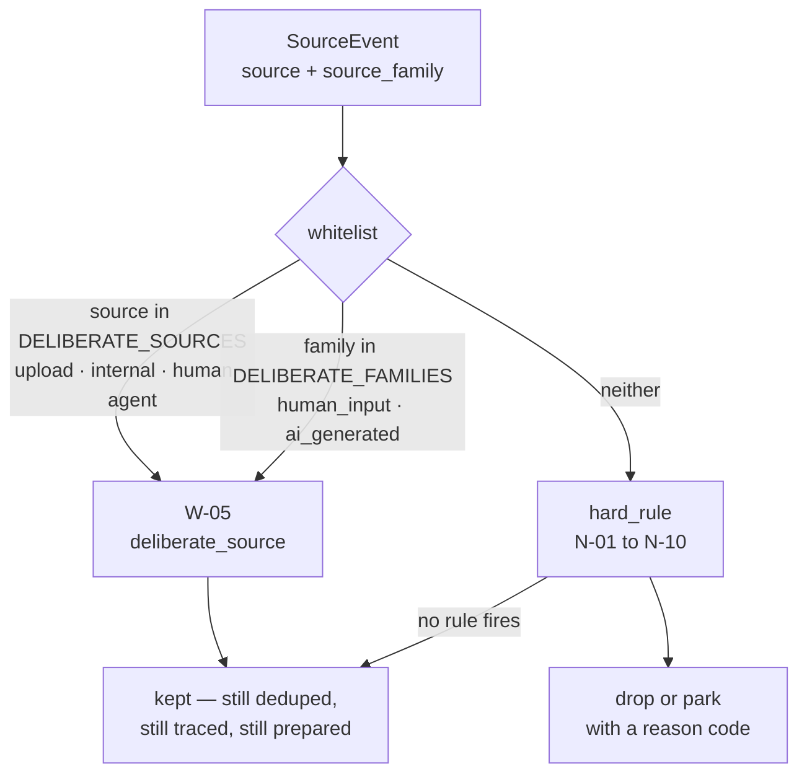
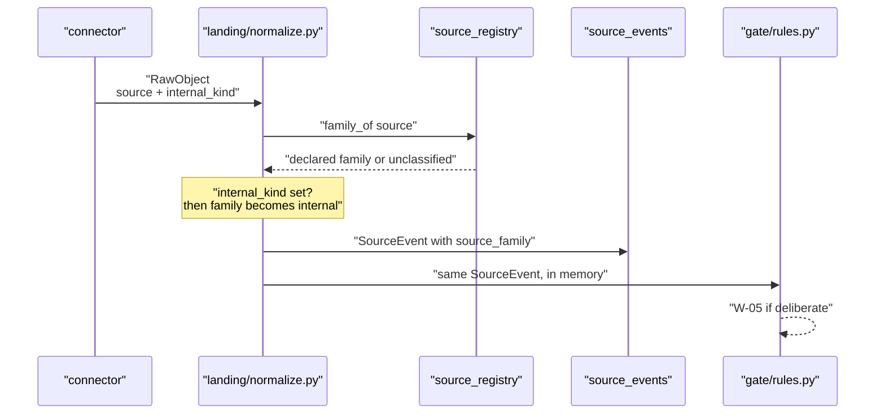
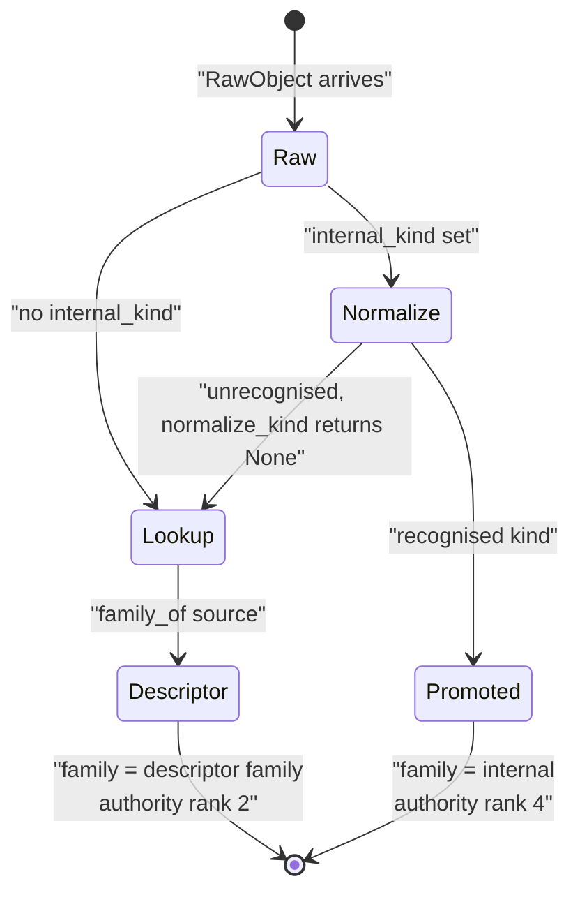

# The Source Families

*Layer 1 · [capture/source_families.py](../../../genios_engine/capture/source_families.py) · the taxonomy, and the one rule that overrides it*

> **What kind of reality did this event come from, who decides, and what changes downstream
> because of the answer?**

| | |
|---|---|
| **Declared in** | [capture/source_registry.py](../../../genios_engine/capture/source_registry.py) — `FAMILIES`, `DELIBERATE_FAMILIES` |
| **Re-exported by** | [capture/source_families.py](../../../genios_engine/capture/source_families.py) — 23 lines, no logic |
| **Assigned in** | [capture/landing/normalize.py](../../../genios_engine/capture/landing/normalize.py) — one expression, line 35 |
| **Carried on** | `SourceEvent.source_family` → `source_events.source_family` *(text, added by [0027_l1_seam.sql](../../../migrations/0027_l1_seam.sql))* |
| **Read by** | [capture/gate/rules.py](../../../genios_engine/capture/gate/rules.py) — whitelist code **W-05**. That is the only runtime reader |
| **Count** | 11 declared · 8 populated · 2 declared-and-empty · 1 fallback |
| **Tests** | [tests/test_source_registry.py](../../../tests/test_source_registry.py) · [tests/test_l1_seam.py](../../../tests/test_l1_seam.py) · [tests/test_internal_knowledge.py](../../../tests/test_internal_knowledge.py) |

---

## 1 · Why a family at all

From the module docstring:

> Every SourceEvent carries a family so downstream layers can reason about the KIND of
> reality an event came from without matching on source names. The pipeline never
> branches on family (capture stays reasoning-free).

The load-bearing phrase is **"without matching on source names"**. A rule that wants to know
"did this come from a system of record?" should not have to enumerate
`hubspot | salesforce | pipedrive | stripe | ...` and then be wrong the day someone adds
Freshsales. It asks for `enterprise_system`.

The second sentence describes an intent that the code very nearly keeps — §6 records where it
does not.

The whole of `source_families.py` is now a shim:

> The taxonomy and the per-source descriptors moved to `capture.source_registry`, which
> is the one place a source is described. This module keeps its public names so nothing
> that imports it had to change; adding a source means adding a descriptor there, not a
> line here.

---

## 2 · The eleven families

Each family carries its meaning as an inline comment in the source. They are reproduced
verbatim below, with the descriptors that actually sit in each.

```python
FAMILIES: frozenset[str] = frozenset({
    "internal",           # the company's own records: policies, SOPs, pricing, KPIs
    "external",           # the public world: websites, news, filings
    "human_input",        # a person typed / uploaded / decided it
    "ai_generated",       # an AI agent produced it
    "enterprise_system",  # CRM / ERP / billing / client databases (systems of record)
    "communication",      # mail, chat, meetings, calendar
    "knowledge",          # docs, pages, files
    "operational",        # GitHub / Jira / CI
    "live_event",         # webhook-pushed happenings
    "intelligence",       # judgments arriving from OUTSIDE the engine
    "unclassified",       # a source we have not described yet
})
```

| Family | Meaning *(the comment above)* | Sources declared in it | n |
|---|---|---|---|
| `communication` | mail, chat, meetings, calendar | `gmail` · `outlook` · `imap` · `inkbox` · `slack` · `teams` · `whatsapp` · `sms` · `gcal` · `mscal` | 10 |
| `enterprise_system` | CRM / ERP / billing / client databases | `hubspot` · `salesforce` · `pipedrive` · `stripe` · `razorpay` · `zendesk` · `intercom` · `mixpanel` · `postgres` · `database` · `mysql` | 11 |
| `knowledge` | docs, pages, files | `notion` · `gdrive` · `confluence` · `upload` | 4 |
| `operational` | GitHub / Jira / CI | `github` · `gitlab` · `jira` · `linear` | 4 |
| `internal` | the company's own records | `internal` | 1 |
| `human_input` | a person typed / uploaded / decided it | `human` | 1 |
| `ai_generated` | an AI agent produced it | `agent` | 1 |
| `intelligence` | judgments arriving from OUTSIDE the engine | `genios` | 1 |
| `external` | the public world: websites, news, filings | **none** | 0 |
| `live_event` | webhook-pushed happenings | **none** | 0 |
| `unclassified` | a source we have not described yet | **never assigned to a descriptor** | 0 |

Three of the eleven are worth pausing on.

### `intelligence` — one source, and it is us

`genios` is the only member. Its section comment says what it is for:

```python
# ── GeniOS's own outputs re-entering as evidence ─────────────────────────────
SourceDescriptor("genios", "intelligence"),
```

The word *OUTSIDE* in the family comment is doing precise work: this is the family for
judgments the engine did not compute in this run. A GeniOS conclusion that re-enters as an
observed signal is not a fresh observation, and the family is what marks it. The same instinct
appears in [internal_knowledge.py](../../../genios_engine/capture/internal_knowledge.py), on
why Company Memory is excluded from the internal kinds:

> memory is derived from what the graph has already seen, so re-ingesting it as a source
> would launder yesterday's inference into today's evidence.

### `external` and `live_event` — declared, empty

Both are declared by the vision and have no descriptor. Nothing today produces an event in
either. That is a taxonomy declared slightly ahead of the connectors, which is defensible —
but no test notices, and nothing tells a reader that these two are aspirational.

### `unclassified` — the honest fallback

```python
def family_of(source: str) -> str:
    descriptor = descriptor_of(source)
    return descriptor.family if descriptor is not None else "unclassified"
```

The taxonomy comment calls it *"plus the honest fallback"*, and the family comment says
*"a source we have not described yet"*. Both phrasings are careful: it is a statement about
**our description**, not about the event.

It is a contract, pinned by two tests:

```python
def test_unknown_source_is_unclassified_not_an_error() -> None:
    assert family_of("weird_new_thing") == "unclassified"
    assert descriptor_of("weird_new_thing") is None
```

**The alternative designs are both worse.** Raising would mean an undescribed source drops
customer data on the floor at envelope time — a taxonomy gap turned into data loss. Guessing
from the string would produce a confident wrong family that no one ever audits. Returning a
value that literally means *"we have not described this"* keeps the event, keeps it landable,
and keeps the gap visible.

`unclassified` is also the *signature* of the drift described in the
[Overview](00-Overview.md) §3.1 — six sources with a capability silently resolving to it — so
two tests now treat its appearance in specific places as a failure:

```python
def test_capability_implies_a_real_family() -> None:
    for descriptor in SOURCES:
        if descriptor.capability is not None:
            assert descriptor.family != "unclassified", descriptor.source
```

and, for structured mappings:

> A mapping for a source the taxonomy does not know lands its events as
> `unclassified` — which is how stripe.subscription.v1 sat unnoticed.

The fallback is honest *for an unknown source*. It is a bug *for a source we claim to know*.

---

## 3 · `DELIBERATE_FAMILIES` and the noise-gate bypass

```python
# Families a human or an agent DELIBERATELY handed us. The noise gate's N-codes exist
# for inbox firehoses; deliberately-provided material bypasses them (it still lands, is
# traced, and is deduped like everything else).
DELIBERATE_FAMILIES: frozenset[str] = frozenset({"human_input", "ai_generated"})
```

Two families out of eleven. The parenthetical is the important half: **bypass means "skip the
N-codes", not "skip the pipeline"**. From [intake.py](../../../genios_engine/capture/intake.py):

> Everything a person or an AI deliberately hands GeniOS becomes a SourceEvent
> through the SAME capture_event pipeline as a connector sync: deduped, traced, gated
> (W-05 keeps it from noise-drops), payload+prepared persisted, then drained by L2.

The check itself, in [gate/rules.py](../../../genios_engine/capture/gate/rules.py):

```python
if (ctx.event.source in DELIBERATE_SOURCES
        or ctx.event.source_family in DELIBERATE_FAMILIES):
    return "W-05"                            # a human/agent deliberately handed us this —
                                             # N-codes exist for inbox firehoses, not for it
```

Why the reasoning holds: the N-codes are heuristics tuned for a mailbox —
`N-03 no_reply_sender`, `N-04 bulk_precedence`, `N-05 out_of_office`,
`N-10 empty_no_attachment`. Every one of them assumes the sender did not intend the message
for us specifically. A note a founder typed into GeniOS violates that assumption completely,
and a short one could plausibly trip `N-10`.

Note the `or`, and note that the two arms do not currently do different work.
`DELIBERATE_SOURCES` covers the four ids whose descriptors set `deliberate=True` — `upload`,
`internal`, `human`, `agent`. `DELIBERATE_FAMILIES` covers anything whose *family* is
`human_input` or `ai_generated` — and the only descriptors in those two families are `human`
and `agent`, which the first arm already catches. **The family arm is redundant today**; it is
a standing guard for a descriptor added to either family without the flag.

`internal` is deliberately **not** in `DELIBERATE_FAMILIES`, and the promotion rule in §5 does
not need it to be: promotion changes the family to `internal` but leaves `source` alone, and
the two doors that set `internal_kind` today — *"a person writing directly […] and an upload
tagged with one of these kinds"* — arrive as `internal` and `upload`, both already in
`DELIBERATE_SOURCES`. An uploaded price list is whitelisted for being an upload, not for
having become canon. Nothing stops a connector setting `internal_kind` on some other source;
that event would be promoted and would *not* be whitelisted.



---

## 4 · How family reaches the database

Assigned once, at the raw → envelope step, and never recomputed:

```python
source_family="internal" if kind else family_of(raw.source),
```

Persisted by [landing/pg_repository.py](../../../genios_engine/capture/landing/pg_repository.py),
whose docstring names the column set:

> Persists the full seam: envelope v3 (source_family, internal_kind) + the gate/triage
> outputs

The column arrived with [0027_l1_seam.sql](../../../migrations/0027_l1_seam.sql), the migration
that turned L1's discarded decisions into a persisted seam:

> Before this, L1 computed PreparedContent […] then threw them ALL away, because the real
> L1→L2 handoff was a SQL query over source_events joined to raw_payloads […] That
> inverted "heavy at ingestion, light at runtime"

```sql
alter table source_events add column if not exists source_family text;

-- backfill family for existing rows (same mapping as capture/source_families.py)
update source_events set source_family = case
    when source in ('gmail','outlook','imap','inkbox','slack','teams','whatsapp','sms',
                    'gcal','calendar','google_calendar') then 'communication'
    when source in ('notion','gdrive','drive','google_drive','confluence','upload') then 'knowledge'
    when source in ('hubspot','salesforce','pipedrive','database','postgres','mysql') then 'enterprise_system'
    when source = 'human' then 'human_input'
    when source = 'agent' then 'ai_generated'
    when source = 'genios' then 'intelligence'
    else 'unclassified' end
where source_family is null;
```

**The comment claims parity with `source_families.py`, and the `CASE` does not have it.** There
is no `operational` branch, so historical `github`, `gitlab`, `jira` and `linear` rows
backfilled to `'unclassified'`, even though the Python taxonomy has classified them all along —
`_LEGACY_SOURCE_FAMILY` in the test lists all four as `operational`. The six sources from the
Overview's §3.1 backfilled to `'unclassified'` too, correctly at the time and wrongly now.

The live impact is nil — none of those sources is buildable, so no rows exist — but the
backfill is **frozen at migration time and never re-run**. Rows written before a source is
described keep whatever the `CASE` gave them. Fixing a descriptor does not retro-classify
history.



---

## 5 · The promotion rule: a declared `internal_kind` beats the descriptor

This is the one place the family is not simply looked up. The comment above it is the best
statement of the reasoning in the file, so it is worth in full:

> A declared internal_kind PROMOTES the family to `internal`. Family answers "what
> kind of reality is this", and a policy the company wrote is its own record no
> matter which door it came through — classifying an uploaded pricing sheet as
> `knowledge` would file it beside a customer's shared doc, which is the exact
> conflation this step exists to end. The descriptor's family stays the DEFAULT.
> An unrecognised tag normalises to None and changes nothing.

```python
kind = normalize_kind(raw.internal_kind)
return SourceEvent(
    ...
    source_family="internal" if kind else family_of(raw.source),
    internal_kind=kind,
```

### Why the conflation was real

The `upload` descriptor declares `family="knowledge"` — correct for the door. Someone uploads a
PDF. Two uploads, same door, same MIME type:

| | Our own rate card, tagged `pricing` | A prospect's shared architecture doc, untagged |
|---|---|---|
| Source | `upload` | `upload` |
| Descriptor family | `knowledge` | `knowledge` |
| `internal_kind` | `pricing` | `None` |
| **Family on the envelope** | **`internal`** | `knowledge` |
| Authority rank | 4 — `CANON_AUTHORITY_RANK` | 2 — `OBSERVED_AUTHORITY_RANK` |

Without the promotion, both land as `knowledge`. The family — the field whose whole purpose is
"what kind of reality is this" — would say the company's own price list and a stranger's
document are the same kind of thing. They are not: one is what the company *asserts*, the
other is what the company *received*.

The authority gap this belongs to is set out in
[internal_knowledge.py](../../../genios_engine/capture/internal_knowledge.py):

> Before this, everything unstructured landed at authority_rank=2. So an uploaded pricing
> sheet carried EXACTLY the authority of a stranger's email mentioning a price, and since
> system-of-record facts land at rank 3, a Stripe row would BEAT the company's own written
> policy.

Family and authority move together, and they move on the same trigger: a `kind` that
`normalize_kind()` recognises.

### Two properties that stop it being a guess

**The descriptor's family stays the default.** Promotion is additive. Untagged traffic through
the same door is unaffected —
[tests/test_internal_knowledge.py](../../../tests/test_internal_knowledge.py) asserts both
directions:

```python
def test_a_canon_tag_promotes_the_family() -> None:
    """An uploaded price list is the company's own record, whichever door it came
    through. Leaving it in `knowledge` would file it beside a customer's shared doc."""
    event = to_source_event(_raw(internal_kind="pricing"), org_id="o1", connection_id="upload")
    assert event.source_family == "internal"
    assert event.internal_kind == "pricing"


def test_an_untagged_upload_is_unchanged() -> None:
    """Back-compat: the descriptor's family stays the default for observed traffic."""
    event = to_source_event(_raw(), org_id="o1", connection_id="upload")
    assert event.source_family == "knowledge"
    assert event.internal_kind is None
```

**An unrecognised tag changes nothing.** `normalize_kind()` returns `None` for anything that is
neither an `INTERNAL_KIND` nor one of the ~40 aliases in `_ALIASES`, and its docstring says why
that is the right answer:

> None is the honest answer for an unrecognised tag: it stays an ordinary tagged
> document at observed authority. Guessing here would hand rank 4 to a typo.

The alias table exists precisely because promotion must not be brittle:

> The upload `tag` field has always been free text, so these keep existing tags meaningful
> instead of silently demoting them to non-canon.

So `"price_list"`, `"rate_card"`, `"prices"` all reach `pricing` and get promoted;
`"pricng"` does not, and lands as an ordinary `knowledge` document. Tolerant on the way in,
strict about what counts.



---

## 6 · Gaps

- **"The pipeline never branches on family" is not quite true.** `whitelist()` reads
  `ctx.event.source_family in DELIBERATE_FAMILIES` and returns W-05. It is a provenance
  branch, not a reasoning branch, and it is arguably within the spirit of the claim — but the
  docstring states the stronger version, and a reader checking it will find the counterexample
  in the very next module.
- **Nothing above Layer 1 reads the family.** `GatedEvent` — the L1→L2 contract — has no
  `source_family` field, and no file in `context/` queries the column. The docstring's
  justification is *"so downstream layers can reason about the KIND of reality an event came
  from"*; today the column is written on every row and read by nobody downstream. `internal_kind`
  *is* on `GatedEvent`, so the authority half of the promotion crosses the seam while the family
  half does not.
- **`source_events.source_family` is untyped and unconstrained.** It is plain `text` with no
  check constraint and no enum. Nothing at the database level stops a value outside `FAMILIES`;
  the only guard is `__post_init__`, and that guards descriptors, not rows.
- **The 0027 backfill has no `operational` branch** despite claiming parity with
  `source_families.py`. See §4.
- **`external` and `live_event` are declared with no descriptor and no test.** A family can sit
  empty indefinitely without anything noticing.
- **Promotion is one-way.** Nothing demotes a family. A tag applied by mistake makes the event
  canon at rank 4 permanently, and the only remedy is the supersede path — re-asserting the
  same key with new content, which is documented for corrections, not for de-classification.

---

## 7 · Map

| Kind | Path |
|---|---|
| Taxonomy | [capture/source_registry.py](../../../genios_engine/capture/source_registry.py) — `FAMILIES`, `DELIBERATE_FAMILIES` |
| Shim | [capture/source_families.py](../../../genios_engine/capture/source_families.py) |
| Assignment | [capture/landing/normalize.py](../../../genios_engine/capture/landing/normalize.py) |
| Persistence | [capture/landing/pg_repository.py](../../../genios_engine/capture/landing/pg_repository.py) |
| Kinds + authority | [capture/internal_knowledge.py](../../../genios_engine/capture/internal_knowledge.py) |
| Deliberate doors | [capture/intake.py](../../../genios_engine/capture/intake.py) |
| The only reader | [capture/gate/rules.py](../../../genios_engine/capture/gate/rules.py) |
| Envelope | [contracts/source_event.py](../../../genios_engine/contracts/source_event.py) |
| Migration | [migrations/0027_l1_seam.sql](../../../migrations/0027_l1_seam.sql) |
| Tests | [tests/test_source_registry.py](../../../tests/test_source_registry.py) · [tests/test_l1_seam.py](../../../tests/test_l1_seam.py) · [tests/test_internal_knowledge.py](../../../tests/test_internal_knowledge.py) |
| Siblings | [00 · Overview](00-Overview.md) · [01 · The Source Registry](01-The-Source-Registry.md) |
