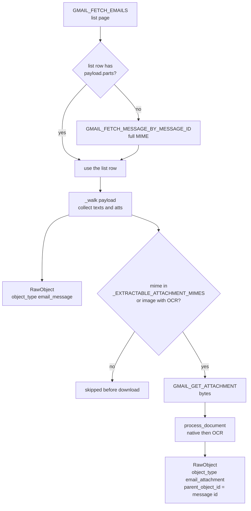
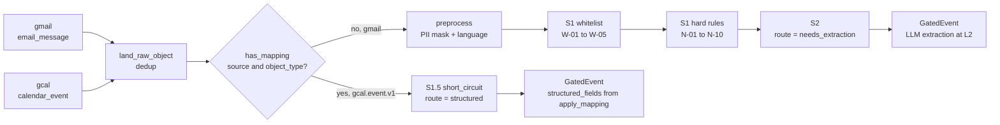
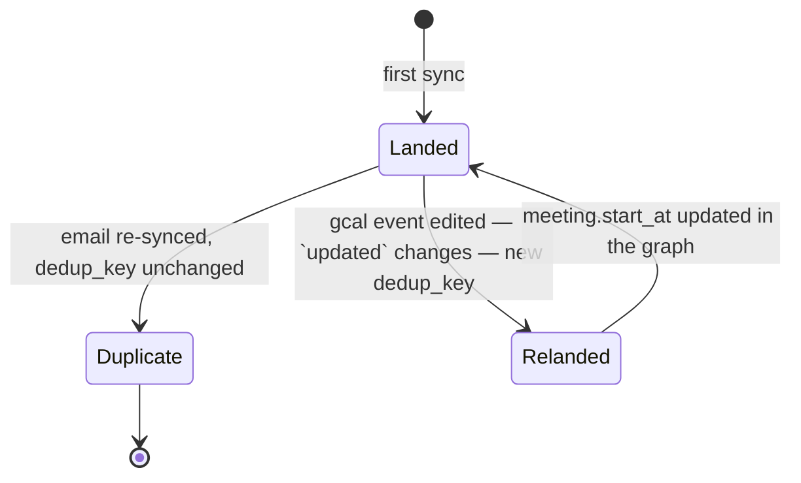

# Communication Sources

*Layer 1 · Knowledge Sources · the `communication` family in [source_registry.py](../../../genios_engine/capture/source_registry.py)*

> Which communication systems does GeniOS claim to know about, which of them can actually be connected today, and exactly which fields of a Gmail message or a Google Calendar event survive into the graph?

| | |
|---|---|
| **Declared in** | [source_registry.py](../../../genios_engine/capture/source_registry.py) — 186 lines, one `SourceDescriptor` per source |
| **How many** | 10 of the 31 descriptors carry `family="communication"` |
| **Buildable today** | 2 of 10 — `gmail` and `gcal` |
| **Connectors** | [composio.py](../../../genios_engine/capture/connectors/composio.py) — 328 lines · [calendar.py](../../../genios_engine/capture/connectors/calendar.py) — 87 lines |
| **Emits** | `RawObject` ([base.py](../../../genios_engine/capture/connectors/base.py)) with `object_type` ∈ `email_message`, `email_attachment`, `calendar_event` |
| **Capabilities advertised** | `communication` — gmail, outlook, slack · `calendar` — gcal, mscal |
| **Structured mapping** | `gcal.event.v1` only. Email has none, so it takes the LLM extraction lane at L2 |
| **Tests** | [test_source_registry.py](../../../tests/test_source_registry.py) · [test_email_edges.py](../../../tests/test_email_edges.py) |

---

## 1. What a "source" is, in code

There is exactly one description of a source, and it is a frozen dataclass. The module docstring explains why:

> A source used to be described in four independent places that nothing checked against each other:
>
>   * its family — `source_families.SOURCE_FAMILY`
>   * whether it can be built — `platform.wiring.IMPLEMENTED_SOURCE_TYPES`
>   * which coverage capability it satisfies — `coverage.model.PROVIDER_CAPABILITY`
>   * its object mappings — `structured.registry`
>
> Four hand-maintained lists drift […] Adding a source is now one descriptor here. The four old names are derived views over this module, so no call site changed.

```python
@dataclass(frozen=True, slots=True)
class SourceDescriptor:
    """Everything Layer 1 knows about one source, in one place."""

    source: str
    family: str
    capability: str | None = None
    buildable: bool = False
    deliberate: bool = False
    aliases: tuple[str, ...] = ()
    # () means NOT ENUMERATED (tenant-defined, e.g. client DB tables) — never "none".
    object_types: tuple[str, ...] = ()
```

`buildable` has a precise, narrow meaning, stated at the bottom of the docstring:

> `buildable` means "make_connector_for can construct this" — with Composio as the broker that is "a Composio payload mapper is wired", not "we hand-wrote a connector".

**A descriptor is a claim about the world, not a promise of data.** Nine of the ten communication descriptors below exist so the taxonomy, the coverage model and the integrations UI can *reason about their absence* — not because anything is being ingested from them.

---

## 2. The ten communication descriptors

Verbatim from `SOURCES` in [source_registry.py](../../../genios_engine/capture/source_registry.py) lines 76–88. `buildable` is `False` and `aliases`/`object_types` are empty unless shown.

| # | `source` | `capability` | `buildable` | `aliases` | `object_types` | Reality today |
|---|---|---|---|---|---|---|
| 1 | `gmail` | `communication` | **True** | — | `("message",)` | Live. Composio-brokered, emits `email_message` + `email_attachment` |
| 2 | `outlook` | `communication` | False | — | — | Name only |
| 3 | `imap` | *none* | False | — | — | Credentials can be stored + liveness-checked; no ingestion |
| 4 | `inkbox` | *none* | False | — | — | Hosted-inbox credentials can be stored; no ingestion |
| 5 | `slack` | `communication` | False | — | — | Name only in L1 — Slack is an **output** channel at Layer 5.2 |
| 6 | `teams` | *none* | False | — | — | Name only |
| 7 | `whatsapp` | *none* | False | — | — | Name only |
| 8 | `sms` | *none* | False | — | — | Name only |
| 9 | `gcal` | `calendar` | **True** | `calendar`, `google_calendar` | `("calendar_event",)` | Live. Structured lane, no LLM |
| 10 | `mscal` | `calendar` | False | — | — | Name only. Called out in the docstring as one of the sources that used to carry a capability with **no family** |

Three of these are worth a sentence each.

**`slack` is not a Slack connector.** The only Slack code in the engine is delivery: [deliver/channels/slack.py](../../../genios_engine/deliver/channels/slack.py). The descriptor reserves the id and the `communication` capability so that if a Slack *reader* ever lands, the family and coverage wiring already agree.

**`imap` and `inkbox` are half-built and honest about it.** [workspace_routes.py](../../../genios_engine/api/workspace_routes.py) exposes `POST /api/org/{org_id}/integrations/imap/accounts` and `.../inkbox/accounts`, Fernet-encrypts the credentials, and a sync button really does log into the IMAP server. It just does not read any mail:

> Full message ingestion into L1 for these custom sources is the connector build (tracked separately) — this keeps the button truthful (success / auth_failed / unreachable), never a fake 'synced'.

**Aliases are first-class.** `gcal` answers to `calendar` and `google_calendar`, and `descriptor_of` lowercases before lookup:

```python
def descriptor_of(source: str) -> SourceDescriptor | None:
    return _BY_ID.get((source or "").lower())
```

The alias index is built by `_index()`, which raises on a collision — *"duplicate source id … Collisions are a definition error."* [test_source_registry.py](../../../tests/test_source_registry.py) pins why this matters: a connection row stored with `source_type='google_calendar'` must still count toward `calendar` coverage, and the old hand-listed dict *"held only the canonical id and under-reported it"*.

### What the family and capability actually buy you

`family` lands on every `SourceEvent` as `source_family` ([normalize.py](../../../genios_engine/capture/landing/normalize.py)) so downstream layers can reason about the *kind* of reality without matching source names. `capability` feeds [coverage/model.py](../../../genios_engine/capture/coverage/model.py), where packs declare what they need:

```python
PACK_REQUIREMENTS: dict[str, dict[str, list[str]]] = {
    "sales":   {"required": ["communication", "crm"],
                "recommended": ["calendar", "product_usage", "document_store"]},
    ...
}
```

`communication` unlocks the readiness predicate `can_evaluate_no_reply`; `calendar` unlocks `can_evaluate_no_meeting`. **Absence of a connection is never read as negative evidence** — the predicate simply goes false.

---

## 3. `gmail` — deep

`ComposioGmailConnector` in [composio.py](../../../genios_engine/capture/connectors/composio.py). Built by `make_connector_for` in [wiring.py](../../../genios_engine/platform/wiring.py) when `source_type == "gmail"`, with an `OcrEngine` attached only if `settings.enable_ocr` (default `False`).

The file's own framing of the Composio dependency:

> Composio sits BEHIND this interface — auth + Gmail data delivery only. Our contract, gate, graph, and acquisition orchestration stay ours; swappable for native.

### The three Composio tool calls

| Slug | Called from | Why |
|---|---|---|
| `GMAIL_FETCH_EMAILS` | `_fetch` | The list page — `max_results`, `query`, `page_token` |
| `GMAIL_FETCH_MESSAGE_BY_MESSAGE_ID` | `fetch_content` → `_full_message` | The full MIME message, when the list row is not already complete |
| `GMAIL_GET_ATTACHMENT` | `_attachment_bytes` | One round-trip **per attachment**, hence the mime pre-filter |

### The backfill window

```python
# First-ever backfill window on a fresh connect. Kept SHORT (1 month) so onboarding is fast — a
# Composio list page (~100 emails) is ~26s, so fewer days = fewer pages = quicker first sync.
# Steady-state incremental sync resumes from the watermark and only pulls new mail regardless.
_BACKFILL_WINDOW = "newer_than:30d"
```

`incremental_changes` turns a stored watermark into a Gmail search query, and the comment explains the deliberate imprecision:

> Resume from the stored watermark (date-granular → a natural overlap that the dedup ledger de-dups) so nothing at the boundary is missed.

```python
query = f"after:{since.strftime('%Y/%m/%d')}" if since else _BACKFILL_WINDOW
```

### Why the connector re-fetches the full message

`_to_objects` decides between the list row and a second network call using one predicate — `need_full = not (list_payload and list_payload.get("parts"))`. The reasoning is the longest comment in the file and it is worth quoting in full:

> Pull the FULL MIME message UNLESS the list row already carries a complete MIME structure (payload.parts, walked below). A flat body string of ANY length may be Gmail's clipped preview — and for deep extraction a signal (competitor, pricing, legal, budget) can sit anywhere in the body, so we never feed the LLM a possibly-truncated body. Full-fetch is one extra call for exactly the at-risk emails; if it fails we fall back to the list row (safe).
> (Was: only fetched full when body < 400 chars → a 500-char clip of a 2,000-char email slipped through truncated → the LLM missed everything past the clip.)

`_walk` then recurses the MIME tree collecting `text/plain` and `text/html` bodies into `texts` and any part with a `filename` into `atts`. `text/plain` wins over `text/html`; if neither exists the flat `list_body` is used.

### `object_type: email_message` — the exact raw dict

```python
objs = [RawObject(
    source="gmail", object_type="email_message", source_object_id=mid,
    occurred_at=occurred, actor_email=sender_email, actor_type="external_contact",
    parent_object_id=thread,
    raw={
        "subject": subject,
        "body": body,                 # FULL text now → preprocess → L2
        "snippet": snippet,
        "labelIds": labels,
        "to": to_emails, "cc": cc_emails,
        "has_attachment": bool(atts),  # keeps attachment-only emails out of the N-10 drop
    },
)]
```

Seven keys. Where each comes from, and who reads it:

| Raw key | Derived by | Read by |
|---|---|---|
| `subject` | `pick("subject")` → `_header(src, "Subject")` → `_header(m, "Subject")` | `pipeline.py` prepends it to the body **before** PII masking; `rules.py` OOO regex |
| `body` | `_walk` → `text/plain` else `text/html`, base64url-decoded, `utf-8/replace` | `pipeline.py` → `extract_native_text(mime="text/html")` → `preprocess` → `prepared_content` |
| `snippet` | provider `preview`/`snippet` if ≥20 non-space chars, else `body[:280]` | `rules.py` and `triage.py` as the fallback when there is no `PreparedContent` |
| `labelIds` | `pick("labelIds", "labels") or []` | `rules.py` W-02/N-06/N-07/N-09; `context/runner.py` for direction |
| `to` | `_extract_emails` over `m["to"]`, `m["toRecipients"]`, To headers | `context/runner.py` — sender↔recipient correspondence edges |
| `cc` | same, over the Cc variants | same |
| `has_attachment` | `bool(atts)` | `rules.py` N-10 only |

`_extract_emails` is order-preserving and de-duplicating *"so L2 can build one edge per recipient"*, and handles `"Name <addr>"`, comma lists, and list/tuple header values.

`occurred_at` comes from `_parse_ts`, which tries `internalDate`, `messageTimestamp`, `timestamp`, `date` — as epoch ms or s, int or digit-string, or ISO 8601 — then the RFC-2822 `Date` header, then `now()`.

**`content_version` is deliberately left `None` for email.** From [source_event.py](../../../genios_engine/contracts/source_event.py):

> Email/message pass no version → the immutable object never re-lands.

### `object_type: email_attachment`

Each attachment becomes its own document event, mirroring the Drive connector:

> each attachment → its own DOCUMENT event (mirrors the Drive connector): download bytes, extract text natively/OCR, gate + L2 it. "PDF me file hai usse bhi banke aana chahiye."

Before the per-file download there is a mime allowlist, and this is the L1 speed fix:

```python
_EXTRACTABLE_ATTACHMENT_MIMES = {
    "application/pdf",
    "application/vnd.openxmlformats-officedocument.wordprocessingml.document",    # docx
    "application/vnd.openxmlformats-officedocument.spreadsheetml.sheet",           # xlsx
    "application/vnd.openxmlformats-officedocument.presentationml.presentation",   # pptx
    "text/plain", "text/markdown",
}
```

> Attachment mimetypes worth DOWNLOADING (we can extract text from these). Everything else — calendar invites (invite.ics), vcards, signatures, images without OCR — is skipped BEFORE the per-file GMAIL_GET_ATTACHMENT network call. That call, not any LLM, is what made L1 slow: one round-trip per attachment, mostly for invite.ics that gets dropped anyway.

`worth = mime in _EXTRACTABLE_ATTACHMENT_MIMES or (self._ocr and mime.startswith("image/"))`. Images therefore pass the filter **only** when an OCR engine is attached.

The attachment's raw dict has seven keys — `subject` (the filename, or the literal `"attachment"`), `body` (extracted text), `mime`, `has_attachment` (`bool(r.text)`), `document` (the provenance dict — see [Knowledge and Document Sources](04-Knowledge-and-Document-Sources.md)), plus `to` and `cc` copied from the parent email. `source_object_id` is `f"{mid}::{attachmentId or filename or index}"` and `parent_object_id` is the message id, *"links the file back to its email"*.

---

## 4. `gcal` — deep

`ComposioCalendarConnector` in [calendar.py](../../../genios_engine/capture/connectors/calendar.py). 87 lines, and the header states the design choice:

> Google Calendar via Composio. Events are STRUCTURED — they carry the gcal.calendar_event mapping, so the gate short-circuits them (no LLM extraction needed).

### The list window

```python
# window: from the watermark, or the last 365 days on a first run (+ all future). A year
# back so a fresh connect captures real history, not just the last month.
tmin = since or (datetime.now(timezone.utc) - timedelta(days=365))
args: dict[str, Any] = {"calendarId": self._cal, "maxResults": max_results,
                        "singleEvents": True, "orderBy": "startTime",
                        "timeMin": tmin.astimezone(timezone.utc).isoformat()}
```

`singleEvents=True` expands recurring series into instances, so each occurrence is its own object with its own id. Note the asymmetry with Gmail: **calendar backfills a year, mail backfills a month.**

### `object_type: calendar_event` — the exact raw dict

```python
return RawObject(
    source="gcal", object_type="calendar_event", source_object_id=str(eid),
    occurred_at=_parse_start(ev), actor_email=organizer, actor_type="internal_user",
    # `updated` changes whenever the event is edited (rescheduled, status change) →
    # a reschedule re-lands and updates meeting.start_at instead of being deduped away.
    content_version=str(ev.get("updated")) if ev.get("updated") else None,
    raw={  # structured fields the gcal.calendar_event mapping reads
        "summary": ev.get("summary"),
        "start": (ev.get("start") or {}).get("dateTime") or (ev.get("start") or {}).get("date"),
        "end": (ev.get("end") or {}).get("dateTime") or (ev.get("end") or {}).get("date"),
        "status": ev.get("status"),
        "attendees": attendees,
        "hangoutLink": ev.get("hangoutLink"),
        # agenda/notes + where — real relevant info that was being dropped (only summary was kept)
        "description": ev.get("description"),
        "location": ev.get("location"),
    },
)
```

`start`/`end` collapse Google's timed (`dateTime`) and all-day (`date`) shapes into one string. `attendees` is flattened to a list of email strings — `[a.get("email") for a in (ev.get("attendees") or []) if a.get("email")]`. `actor_email` is the **organiser**, typed `internal_user`.

`content_version` is the load-bearing difference from email. `compute_dedup_key` folds it in:

```python
base = f"{source}:{object_type}:{source_object_id}"
return f"{base}:{content_version}" if content_version else base
```

> For a MUTABLE structured object the connector passes a content_version (updatedAt/etag/watermark); a genuine change then yields a NEW key so the edit lands and updates the graph, while an unchanged re-sync still dedups.

### The mapping that reads it

`gcal.event.v1` in [structured/registry.py](../../../genios_engine/capture/structured/registry.py):

```python
register(StructuredMapping(
    mapping_id="gcal.event.v1", source="gcal", object_type="calendar_event",
    identity_field="id", node_type="meeting",
    fields=[FieldMap("summary", "meeting.title", "string"),
            FieldMap("start", "meeting.start_at", "timestamp"),
            FieldMap("end", "meeting.end_at", "timestamp"),
            FieldMap("status", "meeting.status", "enum"),
            FieldMap("description", "meeting.description", "string"),
            FieldMap("location", "meeting.location", "string")],
    intent="scheduling_move", name_field="meeting.title",
    relations=[RelationMap("attendees", "person", "attended", "in", "email")],
    emit_on_change=["start", "status"]))
```

Because a mapping exists, `capture_event` auto-detects the event as structured and the gate short-circuits it:

```python
if not is_structured and has_mapping(event.source, event.object_type):
    is_structured = True
```

```python
# S1.5 — structured short-circuit (already typed; skips email N-codes)
if ctx.is_structured:
    if has_mapping(ctx.event.source, ctx.event.object_type):
        trace.record("S1.5", "short_circuit", reason_code="structured_mapped")
        return GateResult(action="short_circuit", route="structured")
    trace.record("S1.5", "park", reason_code="mapping_missing")
    return GateResult(action="park", reason_code="mapping_missing")
```

A calendar event therefore never sees an N-code, is never preprocessed, and never reaches an LLM. `apply_relations` turns `attendees` into `person` edges keyed on the lowercased email *"so attendee-persons MERGE with pipeline-created persons"*.

---

## 5. What we consume vs what the provider offers

Provider-side columns list fields the connector demonstrably *touches* in the response and either keeps or discards. Anything the provider returns that the connector never names is simply absent from the `RawObject` and is not stored.

### Gmail

| Provider field | Captured as | Consumed by |
|---|---|---|
| `messageId` / `id` / `message_id` | `source_object_id` | dedup key, attachment parent link |
| `threadId` / `thread_id` | `parent_object_id` | `_linkage_hints` thread hint; L2 `thread_id` |
| `payload.headers[From]`, `sender`, `from` | `actor_email` via `_extract_email` | L2 sender identity, `_company_domain` |
| `payload.headers[To]`, `to`, `toRecipients` | `raw["to"]` | L2 correspondence edges |
| `payload.headers[Cc]`, `cc`, `ccRecipients` | `raw["cc"]` | L2 correspondence edges |
| `payload.headers[Subject]`, `subject` | `raw["subject"]` | prepared text, OOO check |
| `payload.parts[*].body.data` | `raw["body"]` | prepared text → L2 extraction |
| `snippet` / `preview` | `raw["snippet"]` | gate + triage fallback text |
| `labelIds` / `labels` | `raw["labelIds"]` | gate W-02/N-06/N-07/N-09, L2 direction |
| `internalDate` / `Date` | `occurred_at` | ordering, watermark |
| `payload.parts[*]` with `filename` | separate `email_attachment` objects | document extraction |
| `nextPageToken` / `next_page_token` | `SourceBatch.next_cursor` | paging |
| Everything else — `historyId`, `sizeEstimate`, `Message-ID`, `References`, `In-Reply-To`, raw MIME headers | **not captured** | — |

Two consequences worth naming. `raw["headers"]` is read by the gate for `Auto-Submitted`, `Precedence` and `List-Unsubscribe` (N-01, N-04, N-02) — **but the Gmail connector never populates it**, so those three N-codes cannot fire on Composio-sourced mail. And `sender_blocked`, `approved_sender`, `important_attachment` are read by `rules.py` but written by no connector.

### Google Calendar

| Provider field | Captured as | Consumed by |
|---|---|---|
| `id` | `source_object_id` | dedup key, `meeting` node identity |
| `updated` | `content_version` | dedup key — a reschedule re-lands |
| `summary` | `raw["summary"]` | `meeting.title` + node display name |
| `start.dateTime` \| `start.date` | `raw["start"]` | `meeting.start_at`, and `occurred_at` |
| `end.dateTime` \| `end.date` | `raw["end"]` | `meeting.end_at` |
| `status` | `raw["status"]` | `meeting.status` |
| `description` | `raw["description"]` | `meeting.description` |
| `location` | `raw["location"]` | `meeting.location` |
| `attendees[*].email` | `raw["attendees"]` | `person` → `attended` → `meeting` edges |
| `organizer.email` | `actor_email` | actor on the event |
| `hangoutLink` | `raw["hangoutLink"]` | **nothing** — captured, mapped nowhere |
| `nextPageToken` | `SourceBatch.next_cursor` | paging |
| Everything else — `creator`, `recurringEventId`, `attendees[*].responseStatus`, `conferenceData`, `visibility`, `iCalUID`, `reminders`, `created` | **not captured** | — |

`attendees[*].responseStatus` is the notable omission: we know who was invited, not who accepted.

---

## 6. Diagrams

### Gmail: one message, two kinds of object



### The two live communication lanes diverge at the gate



### A rescheduled meeting re-lands; an email never does



---

## 7. Worked example — one Gmail message becoming `RawObject`s

The shape below is the fixture in [test_email_edges.py](../../../tests/test_email_edges.py), which exists to lock *"the DETERMINISTIC inputs to the email relationship graph + content completeness"*.

**Input** — one item from the `GMAIL_FETCH_EMAILS` page, already carrying `payload.parts` (so `need_full` is `False` and no second call is made):

```python
{
  "messageId": "m1",
  "threadId": "t1",
  "labelIds": ["INBOX"],
  "payload": {
    "headers": [
      {"name": "From",    "value": "Piyush Sharma <piyush@3one4capital.com>"},
      {"name": "To",      "value": "Rohit <rohit@genios.ai>"},
      {"name": "Cc",      "value": "partner@3one4capital.com, rohit@genios.ai"},
      {"name": "Subject", "value": "Our deck"},
    ],
    "parts": [
      {"mimeType": "text/plain", "body": {"data": "<base64url of the prose>"}},
      {"filename": "deck.txt", "mimeType": "text/plain",
       "body": {"attachmentId": "att1", "data": "<base64url of the file>"}},
    ],
  },
}
```

**Step 1 — `_walk`.** Recurses `payload.parts`. The first part has no `filename` and a `text/plain` mime with data → `texts`. The second has a `filename` → `atts`. Result: `plain = b"Hi Rohit, sharing our deck. …"`, `atts = [{"filename": "deck.txt", "mime": "text/plain", "attachmentId": "att1", "data": …}]`.

**Step 2 — headers.** `sender_email = "piyush@3one4capital.com"`. `to_emails = ["rohit@genios.ai"]`. `cc_emails = ["partner@3one4capital.com", "rohit@genios.ai"]` — note `rohit@genios.ai` appears in both To and Cc and is **not** de-duplicated across the two fields, because `_extract_emails` is called once per field.

**Step 3 — `occurred_at`.** No `internalDate` and no `Date` header in this fixture, so `_parse_ts` falls through to `datetime.now(timezone.utc)`.

**Step 4 — object 1:**

```python
RawObject(
    source="gmail", object_type="email_message", source_object_id="m1",
    occurred_at=<now>, actor_email="piyush@3one4capital.com",
    actor_type="external_contact", parent_object_id="t1",
    raw={"subject": "Our deck",
         "body": "Hi Rohit, sharing our deck. We think it's slightly early, "
                 "we'll wait this round out and re-engage once you have traction.",
         "snippet": "Hi Rohit, sharing our deck. We think it's slightly early, …",
         "labelIds": ["INBOX"],
         "to": ["rohit@genios.ai"],
         "cc": ["partner@3one4capital.com", "rohit@genios.ai"],
         "has_attachment": True},
)
```

`snippet` here is `body[:280]` because the fixture supplies no provider `preview`.

**Step 5 — object 2.** `text/plain` is in `_EXTRACTABLE_ATTACHMENT_MIMES`, and the part carries inline `data`, so `_attachment_bytes` — and the `GMAIL_GET_ATTACHMENT` round-trip — is skipped entirely. `process_document(mime="text/plain", …)` takes the `text/plain` branch of `extract_native_text`, returns the string unchanged, and `route_document` sees a 51-character text layer ≥ `_MIN_NATIVE_CHARS` = 20 → `native_parse_used=True`, `status="accepted"`.

```python
RawObject(
    source="gmail", object_type="email_attachment",
    source_object_id="m1::att1", occurred_at=<same as the email>,
    actor_email="piyush@3one4capital.com", actor_type="external_contact",
    parent_object_id="m1",
    raw={"subject": "deck.txt",
         "body": "Valuation ask: 20cr. Stage: Series A. Sector: SaaS.",
         "mime": "text/plain", "has_attachment": True,
         "document": {"native_parse_used": True, "ocr_used": False, "ocr_engine": None,
                      "ocr_pages": 0, "avg_confidence": None, "status": "accepted"},
         "to": ["rohit@genios.ai"],
         "cc": ["partner@3one4capital.com", "rohit@genios.ai"]},
)
```

**Step 6 — through the pipeline.** Each object runs `capture_event` independently (the sync runner captures a page concurrently across `GENIOS_L1_WORKERS`, default 3).

For the email:

| Stage | Outcome |
|---|---|
| `land_raw_object` | `dedup_key = "gmail:email_message:m1"` — no `content_version` |
| `has_mapping("gmail", "email_message")` | `False` → unstructured lane |
| `preprocess` | input is `"Our deck\n\nHi Rohit, sharing our deck. …"` — **subject prepended and masked with the body** |
| Gate S0 | pass, `in_scope` |
| Gate S1 whitelist | `W-01` if `sender_resolver` says Piyush is known; otherwise no W-code. `labelIds` has no `STARRED` |
| Gate S1 hard rules | no `document` dict, no SPAM/TRASH/PROMOTIONS/SOCIAL label, no `headers` dict to trigger N-01/N-02/N-04, body is non-empty → **no drop** |
| Gate S2 | `route = "needs_extraction"` |
| `domain_hints` | `body` matches the `sales` keyword pattern on "deck"? No — the pattern is `deal\|pricing\|proposal\|contract\|quote\|demo\|budget\|renewal`, so **no domain hint from this text** |
| `_linkage_hints` | `{"type": "company_domain", "value": "3one4capital.com", "from": "sender"}` and `{"type": "thread", "value": "t1"}` |
| `triage_lane` | no urgent word, no deadline word, no `?`, sender unknown → score 0 → **`P3`** |
| Emitted | `GatedEvent(route="needs_extraction", triage_lane="P3")` |

For the attachment: same path, `dedup_key = "gmail:email_attachment:m1::att1"`, and the `document` dict with `status="accepted"` clears the DOC-02/DOC-04 park checks. It is also written to `document_jobs` via `DocumentJobStore.put(..., fmt=raw.raw.get("mime"))`.

**The point of the second object:** without it, "Valuation ask: 20cr. Stage: Series A." lives in a `.txt` file that nothing ever reads. With it, that sentence is a separate gated event, attributed to the same sender, linked by `parent_object_id` back to the email that carried it.

---

## 8. Gaps — what the descriptors claim that the code does not do

**1. `gmail`'s declared `object_types` is wrong.** The descriptor says `object_types=("message",)`. Nothing in the engine ever emits `object_type="message"` — the connector emits `email_message` and `email_attachment`, and the fake connector, `test_landing.py`, `test_pipeline.py` and `test_email_edges.py` all use `email_message`. The invariant test only checks object types **that a structured mapping names**:

```python
def test_structured_mapping_object_types_are_declared() -> None:
    """If a source enumerates its object types, a mapping must use one of them. An empty
    tuple means 'tenant-defined' (client DB tables) and is not checked."""
```

Gmail has no structured mapping, so nothing compares its declared types to the ones its connector produces. This is exactly the class of drift the registry was built to end, surviving inside the registry.

**2. Three N-codes cannot fire on Composio mail.** `hard_rule` reads `ctx.raw.get("headers")` for `Auto-Submitted` (N-01), `Precedence` (N-04) and `List-Unsubscribe` (N-02). `ComposioGmailConnector` never writes a `headers` key. The Gmail-label rules (N-06/N-07/N-09) and the no-reply regex (N-03) do work.

**3. Whitelist inputs with no writer.** `approved_sender` (W-02), `important_attachment` (W-04) and `sender_blocked` (N-08) are read by `rules.py` and set by no connector or route in the repo.

**4. `hangoutLink` is captured and never used.** It is in the calendar `RawObject` but appears nowhere else in `genios_engine` or `tests`. There is no `meeting.conference_url` target in `gcal.event.v1`.

**5. Four `StructuredMapping` fields are declared and never read.** `identity_field`, `intent`, `tags` and `emit_on_change` are set on every mapping including `gcal.event.v1`, but no code reads them — `context/runner.py` uses `mapping.name_field`, `mapping.node_type`, `apply_mapping` and `apply_relations`, and identity comes from `row.source_object_id`, not `identity_field`.

**6. Eight of ten communication sources have no connector.** `outlook`, `imap`, `inkbox`, `slack`, `teams`, `whatsapp`, `sms`, `mscal`. `imap` and `inkbox` can store credentials and prove liveness; the rest are names in a taxonomy. `test_buildable_matches_the_connector_dispatch` guarantees the UI cannot offer a Connect button for any of them.

**7. Attendee response status is not captured**, so `can_evaluate_no_meeting` reasoning can see that a meeting exists and who was invited, but not whether anyone accepted.

**8. No OCR by default.** `settings.enable_ocr` defaults to `False`, so image attachments are skipped before download and scanned PDFs produce `status="unsupported"` → DOC-02 park.

---

## 9. Map

**Source files**

| File | What it holds |
|---|---|
| [source_registry.py](../../../genios_engine/capture/source_registry.py) | `SourceDescriptor`, `SOURCES`, `FAMILIES`, `descriptor_of`, `family_of`, `capability_of`, `is_buildable`, and the four derived views |
| [source_families.py](../../../genios_engine/capture/source_families.py) | Back-compat re-export of the taxonomy names |
| [connectors/base.py](../../../genios_engine/capture/connectors/base.py) | `RawObject`, `SourceBatch`, the `SourceConnector` protocol |
| [connectors/composio.py](../../../genios_engine/capture/connectors/composio.py) | `ComposioGmailConnector`, `_walk`, `_b64url`, `_extract_emails`, `_parse_ts`, `_EXTRACTABLE_ATTACHMENT_MIMES`, `_BACKFILL_WINDOW` |
| [connectors/calendar.py](../../../genios_engine/capture/connectors/calendar.py) | `ComposioCalendarConnector`, `_parse_start` |
| [connectors/composio_base.py](../../../genios_engine/capture/connectors/composio_base.py) | `ComposioExec` — shared client + `execute` |
| [structured/registry.py](../../../genios_engine/capture/structured/registry.py) | `gcal.event.v1` and the other three mappings |
| [structured/apply.py](../../../genios_engine/capture/structured/apply.py) | `apply_mapping`, `apply_relations`, `_emails_from` |
| [gate/rules.py](../../../genios_engine/capture/gate/rules.py) | `whitelist`, `hard_rule`, `REASON_LABELS` |
| [platform/wiring.py](../../../genios_engine/platform/wiring.py) | `make_connector_for`, `COMPOSIO_SOURCE_TYPES`, `DIRECT_SOURCE_TYPES` |
| [acquire/sync_runner.py](../../../genios_engine/capture/acquire/sync_runner.py) | `run_sync`, watermark handling, `_CAPTURE_WORKERS` |
| [api/workspace_routes.py](../../../genios_engine/api/workspace_routes.py) | The `imap` / `inkbox` credential routes and `_sync_workspace_account` |

**Constants worth remembering**

| Name | Value | File |
|---|---|---|
| `_BACKFILL_WINDOW` | `"newer_than:30d"` | composio.py |
| Calendar first-run window | `timedelta(days=365)` | calendar.py |
| `_CAPTURE_WORKERS` | `int(os.environ.get("GENIOS_L1_WORKERS", "3"))` | sync_runner.py |
| `sync_interval_hours` | `6.0` | platform/config.py |
| `enable_ocr` | `False` | platform/config.py |
| Snippet fallback length | `body[:280]`, provider preview used if ≥ 20 chars | composio.py |

**Tests**

| Test | What it pins |
|---|---|
| [test_source_registry.py](../../../tests/test_source_registry.py) | Family/alias/capability/buildable invariants; `DIRECT ∪ COMPOSIO == BUILDABLE` |
| [test_email_edges.py](../../../tests/test_email_edges.py) | To/Cc capture, full body from MIME, attachment → its own event |
| [test_structured.py](../../../tests/test_structured.py) | `apply_mapping` ignores unknown fields; unmapped structured object parks |
| [test_structured_dedup.py](../../../tests/test_structured_dedup.py) | `content_version` in the dedup key |
| [test_gate.py](../../../tests/test_gate.py) | Gate stage outcomes for `email_message` |
| [test_landing.py](../../../tests/test_landing.py) | `dedup_key == "gmail:email_message:msg_18c4a9e2f7"` |

**Sibling document** — [Knowledge and Document Sources](04-Knowledge-and-Document-Sources.md) covers `notion`, `gdrive`, `confluence` and `upload`, and the document-extraction path that Gmail attachments share.
