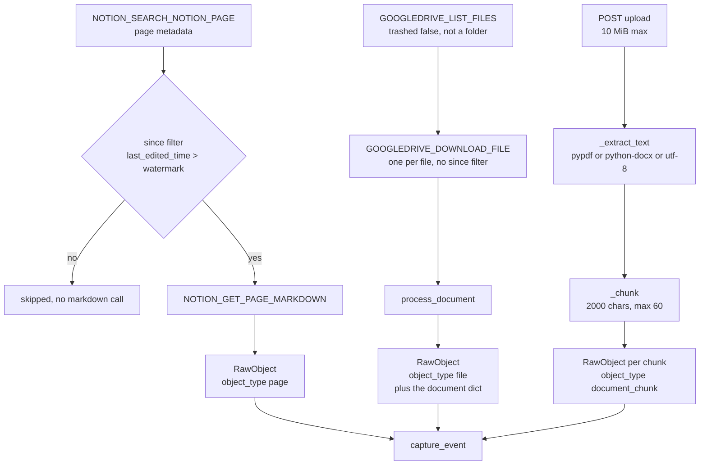
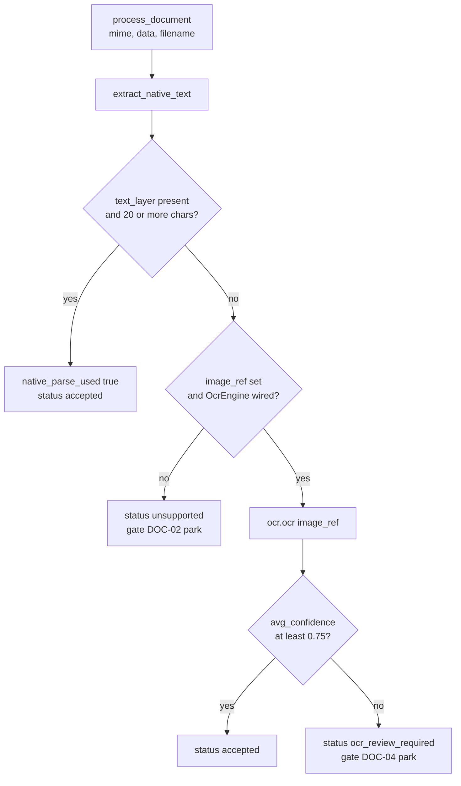
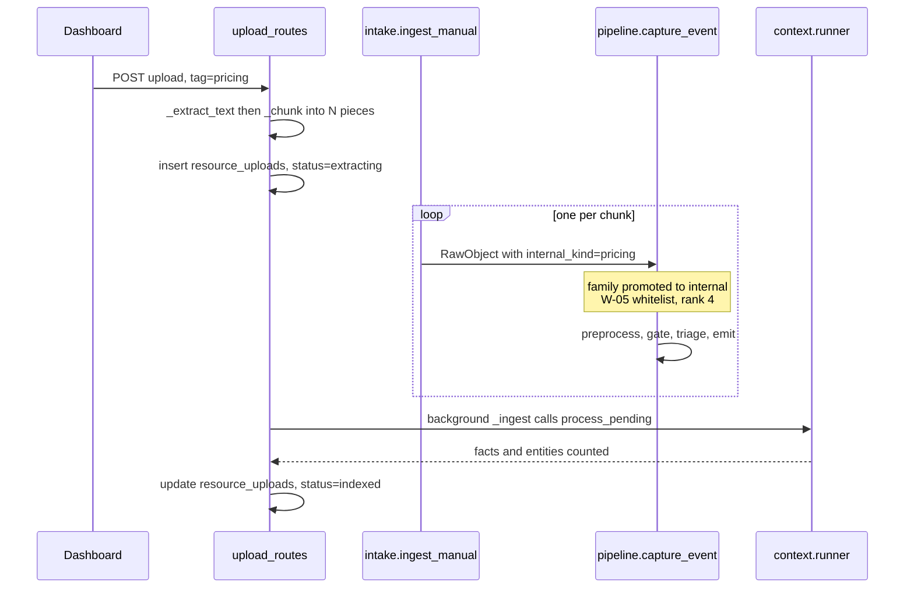

# Knowledge and Document Sources

*Layer 1 · Knowledge Sources · the `knowledge` family in [source_registry.py](../../../genios_engine/capture/source_registry.py), and the document lane every file in the system shares*

> Where does a Notion page, a Drive file, or a file a human drags into the dashboard actually go — and which document formats does the engine genuinely read versus merely list?

| | |
|---|---|
| **Declared in** | [source_registry.py](../../../genios_engine/capture/source_registry.py) lines 91–97 — four descriptors |
| **Buildable today** | 2 of 4 — `notion` and `gdrive`. `upload` needs no connector; `confluence` is a name |
| **Connectors** | [notion.py](../../../genios_engine/capture/connectors/notion.py) — 86 lines · [drive.py](../../../genios_engine/capture/connectors/drive.py) — 90 lines |
| **Upload door** | [upload_routes.py](../../../genios_engine/api/upload_routes.py) — 296 lines, via [intake.py](../../../genios_engine/capture/intake.py) |
| **Document lane** | [documents/native.py](../../../genios_engine/capture/documents/native.py) · [documents/router.py](../../../genios_engine/capture/documents/router.py) · [documents/base.py](../../../genios_engine/capture/documents/base.py) |
| **Emits** | `object_type` ∈ `page`, `file`, `document_chunk` — plus `email_attachment`, which is a Gmail source but the same lane |
| **Capability** | `document_store` — carried by `notion` and `gdrive` only |
| **Tables** | `document_jobs` ([0002_l1_tables.sql](../../../migrations/0002_l1_tables.sql)) · `resource_uploads` ([0020_resource_uploads.sql](../../../migrations/0020_resource_uploads.sql)) |

---

## 1. The four knowledge descriptors

Verbatim from `SOURCES`:

```python
# ── knowledge ────────────────────────────────────────────────────────────────
SourceDescriptor("notion", "knowledge", capability="document_store", buildable=True,
                 object_types=("page",)),
SourceDescriptor("gdrive", "knowledge", capability="document_store", buildable=True,
                 aliases=("drive", "google_drive"), object_types=("file",)),
SourceDescriptor("confluence", "knowledge"),
SourceDescriptor("upload", "knowledge", deliberate=True,
                 object_types=("document_chunk",)),
```

| `source` | `capability` | `buildable` | `deliberate` | `aliases` | `object_types` | What it yields |
|---|---|---|---|---|---|---|
| `notion` | `document_store` | **True** | False | — | `page` | One `RawObject` per page, body = the page's full markdown |
| `gdrive` | `document_store` | **True** | False | `drive`, `google_drive` | `file` | One `RawObject` per non-folder, non-trashed file, body = extracted text |
| `confluence` | *none* | False | False | — | — | Nothing. A reserved id with a family and no capability |
| `upload` | *none* | False | **True** | — | `document_chunk` | One `RawObject` per 2 000-character slice of an uploaded file |

Two asymmetries are deliberate and worth stating.

**`confluence` carries no `document_store` capability**, unlike its two live siblings. `capability` drives [coverage/model.py](../../../genios_engine/capture/coverage/model.py), where `document_store` is a *recommended* capability for the `sales` and `admin` packs. Advertising it for a source with no connector would inflate the recommended-coverage number for nothing.

**`upload` is `deliberate=True`**, and that single flag changes its behaviour at the gate. `DELIBERATE_FAMILIES` is `{"human_input", "ai_generated"}` — `knowledge` is not one of them — so `upload` earns its bypass through `DELIBERATE_SOURCES`, the per-source flag:

```python
if (ctx.event.source in DELIBERATE_SOURCES
        or ctx.event.source_family in DELIBERATE_FAMILIES):
    return "W-05"                            # a human/agent deliberately handed us this —
                                             # N-codes exist for inbox firehoses, not for it
```

The registry states the principle at the top of the file:

> Families a human or an agent DELIBERATELY handed us. The noise gate's N-codes exist for inbox firehoses; deliberately-provided material bypasses them (it still lands, is traced, and is deduped like everything else).

---

## 2. `notion` — pages as unstructured markdown

`ComposioNotionConnector` in [notion.py](../../../genios_engine/capture/connectors/notion.py). Its header states the routing decision:

> Notion via Composio. Pages are UNSTRUCTURED text → they go through the normal gate and on to L2 for relevance + extraction.

Two Composio tool calls, and the split between them is the whole story of this connector:

| Slug | Cost | Returns |
|---|---|---|
| `NOTION_SEARCH_NOTION_PAGE` | one call **per page of results** | page metadata — `id`, `properties`, `last_edited_time`, `last_edited_by`, `url` |
| `NOTION_GET_PAGE_MARKDOWN` | one call **per page object** | the page body as markdown |

### The `RawObject`

```python
return RawObject(
    source="notion", object_type="page", source_object_id=str(pid),
    occurred_at=_parse_ts(page.get("last_edited_time")),
    actor_email=((page.get("last_edited_by") or {}).get("email")),
    actor_type="internal_user",
    raw={"subject": _title(page), "body": body, "url": page.get("url")},
)
```

Three keys. `subject` comes from `_title`, which walks `page["properties"]` for the property whose `type` is `"title"` and concatenates its `plain_text` runs, falling back to `page["title"]`. `body` is the markdown string from `_markdown`, which accepts any of `markdown`, `content` or `text` in the response and coerces a non-string to `""`.

There is **no `content_version`**, so `dedup_key` is `notion:page:{page_id}` and stays stable forever. A Notion page that is edited after first capture therefore lands as a `duplicate` — the edit never reaches the graph.

### The since-filter, and what it fixed

`_to_batch` takes an optional `since`, and `incremental_changes` is the only caller that passes it:

```python
def _to_batch(self, data: dict, since: datetime | None = None) -> SourceBatch:
    results = data.get("results") or data.get("pages") or []
    if since is not None:
        # honour the watermark BEFORE fetching content: _to_raw pulls each page's
        # full markdown, so filtering here is what stops every 6-hourly sweep from
        # re-downloading the whole workspace (`since` was previously ignored).
        # Metadata-only compare; dedup_key/content_version are untouched.
        results = [p for p in results if isinstance(p, dict)
                   and _parse_ts(p.get("last_edited_time")) > since]
    objs = [self._to_raw(p) for p in results if isinstance(p, dict)]
    cursor = data.get("next_cursor") if data.get("has_more") else None
    return SourceBatch(objects=[o for o in objs if o], next_cursor=cursor)
```

**The filter has to run between the search and the markdown pull, and that ordering is the entire fix.** `_to_raw` calls `_markdown(pid)` unconditionally, so an unfiltered page list means one `NOTION_GET_PAGE_MARKDOWN` round-trip per page in the workspace — on every sweep. The scheduler's cadence is `sync_interval_hours = 6.0` in [config.py](../../../genios_engine/platform/config.py), which is where "every 6-hourly sweep" in the comment comes from. `since` arrives from `run_sync`, which reads it from the cursor store:

```python
elif cursor_store is not None and mode != "backfill":
    saved = cursor_store.get(org_id, connection_id, source)
    if saved is not None:
        cursor = cursor or saved.cursor
        since = saved.watermark
```

The watermark itself is the max `occurred_at` over the captured page — for Notion, the max `last_edited_time`.

Note what the filter is *not*: `initial_snapshot` calls `_to_batch` with no `since`, so a backfill still pulls every page's markdown. That is correct — a backfill is meant to.

---

## 3. `gdrive` — files as extracted text

`ComposioDriveConnector` in [drive.py](../../../genios_engine/capture/connectors/drive.py). Its header:

> Google Drive via Composio. Files are DOCUMENTS → download, extract text NATIVELY (HTML/docx/pdf/txt — no OCR), and hand the text to the gate/L2. Scanned images with no text layer would need OCR (Tesseract), wired separately.

### The listing

```python
args: dict[str, Any] = {"pageSize": limit,
                        "q": "trashed = false and mimeType != 'application/vnd.google-apps.folder'"}
```

Two exclusions and nothing else — no `modifiedTime` clause, no `orderBy`.

### The `RawObject`

```python
def _to_raw(self, f: dict) -> RawObject | None:
    fid = f.get("id")
    if not fid:
        return None
    mime, name = f.get("mimeType") or "", f.get("name") or ""
    dl = self._x.execute("GOOGLEDRIVE_DOWNLOAD_FILE", {"file_id": str(fid)})
    r = process_document(mime=mime, data=_raw_bytes(dl), filename=name, ocr=self._ocr)
    return RawObject(
        source="gdrive", object_type="file", source_object_id=str(fid),
        occurred_at=_parse_ts(f.get("modifiedTime")),
        actor_email=((f.get("lastModifyingUser") or {}).get("emailAddress")),
        actor_type="internal_user",
        raw={"subject": name, "body": r.text, "mime": mime, "has_attachment": bool(r.text),
             "document": {"native_parse_used": r.native_parse_used, "ocr_used": r.ocr_used,
                          "ocr_engine": r.ocr_engine, "ocr_pages": r.ocr_pages,
                          "avg_confidence": r.avg_confidence, "status": r.status}},
    )
```

**A Drive file is downloaded inside the mapping function.** `_to_batch` calls `_to_raw` for every listed file, so listing a page of 50 files is 1 list call + 50 download calls, synchronously, before a single object reaches the gate.

`_raw_bytes` is explicitly best-effort and says so:

```python
def _raw_bytes(dl: dict) -> bytes | str:
    """Best-effort: pull file content out of the download response (text or base64)."""
    for k in ("content", "text", "data", "file", "body"):
        v = dl.get(k)
        if isinstance(v, str) and v:
            try:
                return base64.b64decode(v, validate=True)
            except Exception:
                return v
        if isinstance(v, (bytes, bytearray)):
            return bytes(v)
    return ""
```

The base64-ness of a string response is *guessed* by attempting a strict decode and falling back to the string on failure.

### The document provenance dict

Every file-shaped event carries a `raw["document"]` sub-dict with six keys, copied straight off `DocumentResult`:

| Key | Type | Meaning |
|---|---|---|
| `native_parse_used` | bool | The format had a text layer and it was long enough |
| `ocr_used` | bool | Tesseract or another `OcrEngine` produced the text |
| `ocr_engine` | str \| None | `"tesseract-eng"`, `"fake-ocr"`, or `None` |
| `ocr_pages` | int | Pages OCR'd; `0` on the native path |
| `avg_confidence` | float \| None | Mean per-word confidence, 0–1; `None` on the native path |
| `status` | str | `accepted` \| `ocr_review_required` \| `unsupported` |

It is read in two places. The gate parks on the bad statuses — **never a silent drop**:

```python
# Documents: unparseable / low-confidence OCR → park (reviewable, never silent drop).
doc = ctx.raw.get("document") or {}
if doc.get("status") == "unsupported":
    return ("DOC-02", "park")
if doc.get("status") == "ocr_review_required":
    return ("DOC-04", "park")
```

And [pipeline.py](../../../genios_engine/capture/pipeline.py) persists it:

```python
# document provenance (native vs OCR + status) for any file-type event
doc = raw.raw.get("document")
if doc and document_job_store is not None:
    document_job_store.put(org_id=org_id, event_id=event.event_id, doc=doc,
                           fmt=raw.raw.get("mime"))
```

`PostgresDocumentJobStore` writes one `document_jobs` row per document event. Its protocol docstring states what the table is for:

> Records how each document was parsed (native vs OCR) + status — provenance for L2 and a review queue for ocr_review_required / unsupported files.

`has_attachment` is set to `bool(r.text)` on a Drive file — not because a file has attachments, but because the key is what saves it from the N-10 `empty_no_attachment` drop when extraction yields nothing… except it does not, because `bool("")` is `False`. A file that extracts to no text has `status="unsupported"`, which parks at DOC-02 *before* N-10 is reached.

---

## 4. `upload` — the deliberate door

An uploaded file is not a connector. `POST /api/org/{org_id}/upload` in [upload_routes.py](../../../genios_engine/api/upload_routes.py) does the work synchronously in the request:

```
read bytes → size check → _extract_text → _chunk → write to disk → insert resource_uploads
           → one _emit_chunk per chunk → background _ingest
```

| Constant | Value | Meaning |
|---|---|---|
| `MAX_BYTES` | `10 * 1024 * 1024` | 10 MiB hard limit; `413` above it |
| `CHUNK_CHARS` | `2000` | Characters per chunk |
| `MAX_CHUNKS` | `60` | *"cap per file so one upload can't runaway"* — 120 000 characters, and the rest is silently discarded |
| `UPLOAD_DIR` | `<repo>/uploads/` | Where the original bytes land |
| `_PROGRESS` | `queued 10, extracting 55, indexed 100, failed 0` | UI percentages |

Each chunk goes through `ingest_manual`, and the docstring names exactly what that buys:

> One upload chunk → THE ONE DOOR (capture_event via intake): deduped, traced, W-05-whitelisted, payload + prepared text persisted — identical to a connector sync. (Was a hand-rolled SQL insert that skipped the gate, the trace and the seam.)
> source/object_type ('upload','document_chunk') miss the structured registry, so the chunk takes the LLM extraction lane.

```python
ingest_manual(org_id=org_id, source="upload", object_type="document_chunk",
              source_object_id=f"{file_id}:chunk_{idx}", body=body, subject=subject,
              actor_type="internal_user", actor_email=uploader_email,
              internal_kind=internal_kind, ...)
```

`subject` is the **file name**, repeated on every chunk. `dedup_key` is therefore `upload:document_chunk:{file_id}:chunk_{i}` — pinned by [test_dedup_key_golden.py](../../../tests/test_dedup_key_golden.py) and [test_intake_one_door.py](../../../tests/test_intake_one_door.py).

### A tag can promote the whole file to company canon

`normalize_kind(tag)` maps the upload's tag onto `INTERNAL_KINDS` ([internal_knowledge.py](../../../genios_engine/capture/internal_knowledge.py)). When it matches, `RawObject.internal_kind` is set, and `to_source_event` **changes the family**:

```python
source_family="internal" if kind else family_of(raw.source),
```

with the reasoning stated in place:

> A declared internal_kind PROMOTES the family to `internal`. Family answers "what kind of reality is this", and a policy the company wrote is its own record no matter which door it came through — classifying an uploaded pricing sheet as `knowledge` would file it beside a customer's shared doc, which is the exact conflation this step exists to end.

Canon lands at `CANON_AUTHORITY_RANK = 4`, above system-of-record (3) and extraction (2). The `raw_extra` carries one more thing, and the comment explains why it is keyed on the file rather than the chunk:

> One canon node per FILE, not per chunk. Keying on the event would give a 30-chunk pricing PDF thirty separate "Pricing" entities, each holding a slice of one document — the graph would look like thirty price lists.

An unrecognised tag normalises to `None` and changes nothing: the chunk stays `knowledge` family at observed authority.

### Deletion is a real erasure

`DELETE /api/org/{org_id}/uploads/{file_id}` finds every `source_events` row matching either dedup shape, bumps the tenant graph version *in the same transaction*, then deletes `graph_facts`, `graph_observations`, `raw_payloads`, `prepared_content` and `source_events` for those event ids, and finally the file from disk. Shared `graph_nodes` are deliberately left alone — *"they may be referenced by other sources"*.

---

## 5. The document extraction lane

Four object types share one code path: `gdrive.file`, `gmail.email_attachment`, and — with an important exception noted below — anything else that calls `process_document`.

```python
def process_document(*, mime: str, data: bytes | str, filename: str = "",
                     image_ref: str | None = None,
                     ocr: OcrEngine | None = None) -> DocumentResult:
    """Full path: native text if the format has it, else OCR (if wired), else unsupported."""
    text = extract_native_text(mime=mime, data=data, filename=filename)
    doc = DocumentInput(mime=mime, filename=filename, text_layer=text, image_ref=image_ref)
    return route_document(doc, ocr=ocr)
```

`extract_native_text` matches on **mime OR filename extension**, and *"Never raises"* — any parser exception returns `None`:

```python
if mime in ("text/plain", "text/markdown") or name.endswith((".txt", ".md")):
    return txt
if mime == "text/html" or name.endswith((".html", ".htm")):
    return _html_to_text(txt)
if mime == _DOCX or name.endswith(".docx"):
    return _docx_to_text(raw)
if mime == "application/pdf" or name.endswith(".pdf"):
    return _pdf_to_text(raw)
```

`route_document` then decides the outcome against two constants — `_MIN_NATIVE_CHARS = 20` and `OCR_MIN_CONFIDENCE = 0.75`:

```python
def route_document(doc: DocumentInput, ocr: OcrEngine | None = None) -> DocumentResult:
    """Native text if usable; else OCR (if an engine is given); low-quality OCR parks."""
```

### Format table — native, OCR, or unsupported

| Format | mime | Extension trigger | Extractor | Result |
|---|---|---|---|---|
| Plain text | `text/plain` | `.txt` | returned as-is | **native** — `accepted` if ≥ 20 chars |
| Markdown | `text/markdown` | `.md` | returned as-is | **native** |
| HTML | `text/html` | `.html`, `.htm` | `_HTMLText` — an `HTMLParser` that skips `script`, `style`, `head` | **native** |
| Word | `…wordprocessingml.document` | `.docx` | `python-docx` — paragraphs **plus every table cell** | **native** |
| PDF, digital | `application/pdf` | `.pdf` | `pypdf.PdfReader`, `extract_text()` per page | **native** if the text layer is ≥ 20 chars |
| PDF, scanned | `application/pdf` | `.pdf` | text layer < 20 chars → OCR branch | **needs OCR** — see the gap below |
| Images | `image/*` | — | no native branch at all | **needs OCR** |
| Excel | `…spreadsheetml.sheet` | `.xlsx` | **no branch** | **unsupported** → DOC-02 park |
| PowerPoint | `…presentationml.presentation` | `.pptx` | **no branch** | **unsupported** → DOC-02 park |
| Google Docs / Sheets / Slides | `application/vnd.google-apps.*` | none | **no branch** | **unsupported** → DOC-02 park |
| Anything else | — | — | falls off the end, returns `None` | **unsupported** → DOC-02 park |

The last three rows are the interesting ones. `router.py` declares a set that disagrees with the extractor:

```python
# Formats we can parse natively (no OCR).
_NATIVE_MIMES = {
    "text/plain", "text/html", "application/pdf", "text/markdown",
    "application/vnd.openxmlformats-officedocument.wordprocessingml.document",  # docx
    "application/vnd.openxmlformats-officedocument.spreadsheetml.sheet",        # xlsx
    "application/vnd.openxmlformats-officedocument.presentationml.presentation",  # pptx
}
```

`_NATIVE_MIMES` names xlsx and pptx, `extract_native_text` has no branch for either — and `_NATIVE_MIMES` is **referenced by nothing**: it is defined in `router.py` and never read, there or anywhere else. `_EXTRACTABLE_ATTACHMENT_MIMES` in [composio.py](../../../genios_engine/capture/connectors/composio.py) contains the same two mimes, so an emailed spreadsheet **is** downloaded — paying the `GMAIL_GET_ATTACHMENT` round-trip the filter exists to avoid — and then parks at DOC-02 every time.

### The OCR path, and why nothing reaches it

The OCR branch is fully built: an `OcrEngine` protocol, a real `TesseractOcr` (*"Runs server-side, and in production as an ASYNC worker — never in the API request thread"*), a `FakeOcr` for tests, a confidence threshold, an `ocr_review_required` status, and a DOC-04 park with a `document_jobs` review row.

It is also unreachable from any ingestion path. `route_document`'s OCR branch requires `doc.image_ref is not None`:

```python
# OCR path (scanned / image-only / insufficient text)
if doc.image_ref is not None and ocr is not None:
```

**No caller of `process_document` ever passes `image_ref`.** `drive.py` and `composio.py` both call it with `mime`, `data`, `filename` and `ocr` only; the parameter defaults to `None`. The only places `image_ref` is set in the entire repo are the four cases in [test_documents.py](../../../tests/test_documents.py). So a scanned PDF or an image attachment always takes the third branch:

```python
# can't parse (unsupported binary, or scanned with no OCR engine wired)
return DocumentResult(text="", native_parse_used=False, ocr_used=False,
                      ocr_engine=None, ocr_pages=0, avg_confidence=None,
                      status="unsupported")
```

The behaviour is safe — it parks, it is reviewable, nothing is silently lost — but `enable_ocr=True` today buys only one thing: it lets image attachments past the Gmail mime pre-filter, so they are downloaded and then parked.

---

## 6. Diagrams

### The three knowledge doors



### The document decision, exactly as `route_document` makes it



### An uploaded pricing PDF, tagged



---

## 7. Worked example — a Drive proposal PDF

**Input** — one item from `GOOGLEDRIVE_LIST_FILES`:

```python
{"id": "1AbCdEf", "name": "Acme pilot proposal.pdf",
 "mimeType": "application/pdf",
 "modifiedTime": "2026-07-30T09:27:19Z",
 "lastModifyingUser": {"emailAddress": "rohit@genios.ai"}}
```

**Step 1 — download.** `_to_raw` immediately calls `GOOGLEDRIVE_DOWNLOAD_FILE` with `file_id="1AbCdEf"`. `_raw_bytes` walks `content`, `text`, `data`, `file`, `body`, finds a base64 string under one of them, and `base64.b64decode(v, validate=True)` succeeds → `bytes`.

**Step 2 — extract.** `extract_native_text(mime="application/pdf", data=<bytes>, filename="Acme pilot proposal.pdf")` takes the PDF branch: `PdfReader` → `"\n".join(page.extract_text() …).strip()` → about 4 000 characters of prose.

**Step 3 — route.** 4 000 ≥ `_MIN_NATIVE_CHARS`, so:

```python
DocumentResult(text=<4000 chars>, native_parse_used=True, ocr_used=False,
               ocr_engine=None, ocr_pages=0, avg_confidence=None, status="accepted")
```

**Step 4 — the `RawObject`:**

```python
RawObject(
    source="gdrive", object_type="file", source_object_id="1AbCdEf",
    occurred_at=datetime(2026, 7, 30, 9, 27, 19, tzinfo=timezone.utc),
    actor_email="rohit@genios.ai", actor_type="internal_user",
    raw={"subject": "Acme pilot proposal.pdf",
         "body": "<4000 chars>",
         "mime": "application/pdf",
         "has_attachment": True,
         "document": {"native_parse_used": True, "ocr_used": False, "ocr_engine": None,
                      "ocr_pages": 0, "avg_confidence": None, "status": "accepted"}},
)
```

**Step 5 — the pipeline:**

| Stage | Outcome |
|---|---|
| `land_raw_object` | `dedup_key = "gdrive:file:1AbCdEf"` — no `content_version` |
| `has_mapping("gdrive", "file")` | `False` → unstructured lane |
| `preprocess` | on `"Acme pilot proposal.pdf\n\n<4000 chars>"`, HTML-stripped first, PII-masked, offset map built |
| Gate S1 whitelist | `W-05`? No — `gdrive` is not in `DELIBERATE_SOURCES` and `knowledge` is not a deliberate family. So the N-codes **do** apply to Drive files |
| Gate S1 hard rules | `document.status == "accepted"` → no DOC park; no labels; `actor_email` does not match `_NOREPLY`; body non-empty → no drop |
| Gate S2 | `route = "needs_extraction"` |
| `domain_hints` | body matches the `sales` keyword pattern on "proposal" → `DomainHint(domain="sales", source="keyword")` |
| `_linkage_hints` | `{"type": "company_domain", "value": "genios.ai", "from": "sender"}` — the *uploader's* domain, not a customer's |
| `triage_lane` | depends on the prose; a proposal with no urgency word and no `?` scores 0 → `P3` |
| Persisted | `source_events` row, `raw_payloads` blob, `prepared_content` row, **and** a `document_jobs` row with `format='application/pdf'`, `native_parse_used=true`, `status='accepted'` |

**Step 6 — the second sweep, six hours later.** `run_sync` reads the watermark and calls `incremental_changes(cursor, limit, since=<watermark>)`. Drive's implementation is:

```python
def incremental_changes(self, cursor: str | None = None, limit: int = 50,
                        since: datetime | None = None) -> SourceBatch:
    return self._to_batch(self._list(limit=limit, page_token=cursor))
```

`since` is accepted and discarded. The same file is listed, **downloaded again**, parsed again, and only then does `repo.exists(org_id, "gdrive:file:1AbCdEf")` return `True` and the event drop as `duplicate`. This is precisely the waste the Notion connector's filter eliminates, still present in Drive.

---

## 8. Gaps — what is missing, and what is deliberately not done

**1. OCR is complete and unreachable.** No caller of `process_document` passes `image_ref`, so `route_document`'s OCR branch cannot be entered outside `tests/test_documents.py`. Scanned PDFs and images therefore always return `status="unsupported"` and park at DOC-02. `enable_ocr=True` changes only the Gmail attachment mime pre-filter.

**2. Drive ignores its watermark.** `ComposioDriveConnector.incremental_changes` takes `since` and does not use it, and `_list` has no `modifiedTime` clause. Every sweep re-lists and re-downloads the same files before the dedup ledger discards them. This is the Notion bug, unfixed.

**3. Neither Notion nor Drive sets `content_version`,** so an edited page or file never re-lands and its change never reaches the graph. Compare `gcal.calendar_event`, which sets `content_version=str(ev.get("updated"))` for exactly this reason, and `ingest_internal_knowledge`, which uses a `semantic_hash` of title+body.

**4. `_NATIVE_MIMES` is dead and wrong.** Defined in `router.py`, referenced nowhere, and it claims xlsx and pptx are natively parseable when `extract_native_text` has no branch for either. `_EXTRACTABLE_ATTACHMENT_MIMES` repeats the claim, so emailed spreadsheets and decks are downloaded and then always parked.

**5. There are two text extractors.** `upload_routes._extract_text` is an independent implementation — pdf via `pypdf`, docx via `python-docx`, everything else `data.decode("utf-8", errors="ignore")`. It does not call `process_document`, so an upload produces **no `document` provenance dict**, writes **no `document_jobs` row**, and can never park at DOC-02/DOC-04. It also handles HTML differently: `native.py` strips tags, `upload_routes` keeps them as text.

**6. Notion's `url` is captured and never read.** `raw["url"]` appears only where it is written. L2's unstructured lane reads `body`, `snippet`, `subject`, `labelIds`, `to` and `cc`; `url` is in none of them.

**7. Google-native files park.** The Drive list query excludes only folders, so Google Docs, Sheets and Slides are listed and downloaded. `extract_native_text` has no `application/vnd.google-apps.*` branch and those files have no filename extension, so unless the download response arrives with an exported mime the result is `unsupported` → DOC-02.

**8. `MAX_CHUNKS = 60` silently truncates.** A file longer than 120 000 characters loses the tail with no error, no flag on the `resource_uploads` row, and no trace record.

**9. `confluence` is a name.** No connector, no capability, no object types. `test_buildable_matches_the_connector_dispatch` guarantees the UI cannot offer it.

**10. Drive and Notion are not deliberate sources.** Only `upload` carries `deliberate=True` in this family. A Drive file therefore runs the full N-code gauntlet — including N-03 if `lastModifyingUser.emailAddress` happens to look like a notification address.

---

## 9. Map

**Source files**

| File | What it holds |
|---|---|
| [source_registry.py](../../../genios_engine/capture/source_registry.py) | The four `knowledge` descriptors, `DELIBERATE_SOURCES`, `DELIBERATE_FAMILIES` |
| [connectors/notion.py](../../../genios_engine/capture/connectors/notion.py) | `ComposioNotionConnector`, `_title`, `_markdown`, the `since` filter in `_to_batch` |
| [connectors/drive.py](../../../genios_engine/capture/connectors/drive.py) | `ComposioDriveConnector`, `_raw_bytes`, `_parse_ts` |
| [documents/base.py](../../../genios_engine/capture/documents/base.py) | `OCR_MIN_CONFIDENCE`, `DocumentInput`, `DocumentResult`, `OcrResult`, `OcrEngine` |
| [documents/native.py](../../../genios_engine/capture/documents/native.py) | `extract_native_text`, `process_document`, `_HTMLText`, `_docx_to_text`, `_pdf_to_text` |
| [documents/router.py](../../../genios_engine/capture/documents/router.py) | `route_document`, `_NATIVE_MIMES`, `_MIN_NATIVE_CHARS` |
| [documents/tesseract.py](../../../genios_engine/capture/documents/tesseract.py) | `TesseractOcr` — `name = "tesseract-eng"`, confidence averaged over words |
| [documents/fake.py](../../../genios_engine/capture/documents/fake.py) | `FakeOcr` — `good:` → 0.91, `weak:` → 0.42 |
| [documents/store.py](../../../genios_engine/capture/documents/store.py) | `DocumentJobStore`, `InMemoryDocumentJobStore`, `PostgresDocumentJobStore` |
| [intake.py](../../../genios_engine/capture/intake.py) | `ingest_manual`, `ingest_internal_knowledge`, `_slug` |
| [internal_knowledge.py](../../../genios_engine/capture/internal_knowledge.py) | `INTERNAL_KINDS`, `ANCHORING_KINDS`, `CANON_AUTHORITY_RANK = 4` |
| [api/upload_routes.py](../../../genios_engine/api/upload_routes.py) | Upload, list, delete, retag; `_extract_text`, `_chunk`, `_emit_chunk`, `_ingest` |
| [gate/rules.py](../../../genios_engine/capture/gate/rules.py) | DOC-02 / DOC-04 / W-05 |

**Constants**

| Name | Value | File |
|---|---|---|
| `OCR_MIN_CONFIDENCE` | `0.75` | documents/base.py |
| `_MIN_NATIVE_CHARS` | `20` | documents/router.py |
| `MAX_BYTES` | `10 * 1024 * 1024` | api/upload_routes.py |
| `CHUNK_CHARS` | `2000` | api/upload_routes.py |
| `MAX_CHUNKS` | `60` | api/upload_routes.py |
| `CANON_AUTHORITY_RANK` | `4` | capture/internal_knowledge.py |
| `sync_interval_hours` | `6.0` | platform/config.py |

**Tables**

| Table | Migration | Written by |
|---|---|---|
| `document_jobs` | [0002_l1_tables.sql](../../../migrations/0002_l1_tables.sql) | `PostgresDocumentJobStore.put` from `pipeline.capture_event` |
| `resource_uploads` | [0020_resource_uploads.sql](../../../migrations/0020_resource_uploads.sql) | `upload_resource`, `_ingest`, `retag_upload` |
| `source_events`, `raw_payloads`, `prepared_content` | 0002 / 0027 | the shared pipeline |

**Endpoints**

| Method | Path | Does |
|---|---|---|
| `POST` | `/api/org/{org_id}/upload` | multipart file + optional `tag`; returns `{file_id, status, chunks}` |
| `GET` | `/api/org/{org_id}/uploads` | list, with `authority`, `internal_kind`, `is_canon` per row |
| `DELETE` | `/api/org/{org_id}/uploads/{file_id}` | erases the file's facts, observations, payloads, prepared text, events, row and bytes |
| `PATCH` | `/api/org/{org_id}/uploads/{file_id}/tag` | retag — **does not re-ingest**, so the authority of already-landed chunks is unchanged |

**Tests**

| Test | What it pins |
|---|---|
| [test_documents.py](../../../tests/test_documents.py) | The four `route_document` outcomes — native, good OCR, low-confidence OCR, no engine |
| [test_source_registry.py](../../../tests/test_source_registry.py) | `{"human", "agent", "upload"} <= DELIBERATE_SOURCES`; buildable ↔ dispatch |
| [test_intake_one_door.py](../../../tests/test_intake_one_door.py) | `dedup_key == "upload:document_chunk:up_9:chunk_0"` |
| [test_dedup_key_golden.py](../../../tests/test_dedup_key_golden.py) | The upload dedup key shape |
| [test_internal_knowledge.py](../../../tests/test_internal_knowledge.py) | The registry publishes `INTERNAL_KINDS` as the `internal` source's object types |
| [test_l1_seam.py](../../../tests/test_l1_seam.py) | `("upload", "document_chunk")` survives the seam |

**Sibling document** — [Communication Sources](03-Communication-Sources.md) covers `gmail` and `gcal`, and the `email_attachment` object that shares this document lane.
