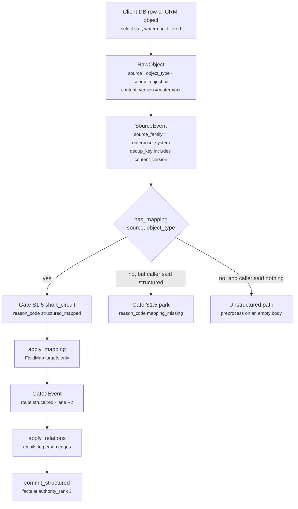
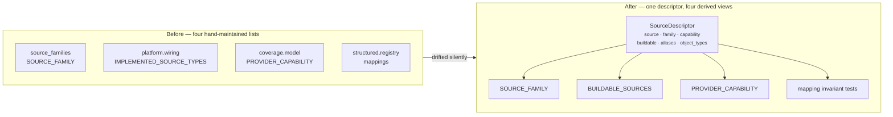

# Enterprise System Sources

*Layer 1 · `genios_engine/capture/` · the `enterprise_system` family — CRM, billing, support desk, product analytics, and the client's own database.*

> When a system of record changes a row, what does Layer 1 actually turn that row into — and which of these eleven sources can we connect to at all?

| | |
|---|---|
| **Descriptors** | [source_registry.py](../../../genios_engine/capture/source_registry.py) — 11 of the 33 entries in `SOURCES` carry `family="enterprise_system"` |
| **Connector** | [connectors/database.py](../../../genios_engine/capture/connectors/database.py) — 82 lines, the only one of the eleven with code behind it |
| **Mappings** | [structured/registry.py](../../../genios_engine/capture/structured/registry.py) — `hubspot.deal.v1`, `stripe.subscription.v1`, `postgres.customer_accounts.v1` |
| **Mapper** | [structured/apply.py](../../../genios_engine/capture/structured/apply.py) — `apply_mapping`, `apply_relations` |
| **Buildable** | `postgres`, `database`, `mysql` — and nothing else |
| **Emits** | `GatedEvent` with `route="structured"` and populated `structured_fields` — **zero LLM calls** |
| **Tests** | [test_structured.py](../../../tests/test_structured.py), [test_identity_parity.py](../../../tests/test_identity_parity.py), [test_source_registry.py](../../../tests/test_source_registry.py) |

---

## 1 · What this family is for

The registry declares eleven families of reality. This one is described in a single comment line:

> `"enterprise_system",  # CRM / ERP / billing / client databases (systems of record)`

The distinguishing property is not the vendor — it is that **the object arrives already typed**. A HubSpot deal is not prose that might mean a stage change; it is a row with a `dealstage` column. That single fact is what lets these sources bypass the entire unstructured path: no preprocessing, no PII masking pass, no noise codes, and — critically — no model call. The gate short-circuits them:

```python
# S1.5 — structured short-circuit (already typed; skips email N-codes)
if ctx.is_structured:
    if has_mapping(ctx.event.source, ctx.event.object_type):
        trace.record("S1.5", "short_circuit", reason_code="structured_mapped")
        return GateResult(action="short_circuit", route="structured")
    trace.record("S1.5", "park", reason_code="mapping_missing")
    return GateResult(action="park", reason_code="mapping_missing")
```
— [gate/gate.py](../../../genios_engine/capture/gate/gate.py)

The package docstring for the lane states the design rule plainly:

> Structured short-circuit — CRM / DB / calendar / billing events whose meaning is already typed. Mapped to fields WITHOUT an LLM. Mappings are DATA (a registry), not per-source logic hardcoded in the pipeline — add a source = add a mapping.

---

## 2 · The eleven descriptors, exactly as declared

Every value in this table is read straight from `SOURCES` in [source_registry.py](../../../genios_engine/capture/source_registry.py). None of the eleven declares an alias, and none is `deliberate`.

| `source` | `capability` | `buildable` | `object_types` | Has a mapping? |
|---|---|---|---|---|
| `hubspot` | `crm` | **no** | `("deal",)` | `hubspot.deal.v1` |
| `salesforce` | `crm` | **no** | `()` | — |
| `pipedrive` | *none* | **no** | `()` | — |
| `stripe` | `finance` | **no** | `("subscription",)` | `stripe.subscription.v1` |
| `razorpay` | `finance` | **no** | `()` | — |
| `zendesk` | `support_desk` | **no** | `()` | — |
| `intercom` | `support_desk` | **no** | `()` | — |
| `mixpanel` | `product_usage` | **no** | `()` | — |
| `postgres` | `product_usage` | **yes** | `()` | `postgres.customer_accounts.v1` |
| `database` | *none* | **yes** | `()` | — |
| `mysql` | *none* | **yes** | `()` | — |

An empty `object_types` tuple is not "this source has no objects". The dataclass says what it means:

> `# () means NOT ENUMERATED (tenant-defined, e.g. client DB tables) — never "none".`

That is honest for `postgres`/`database`/`mysql`, where the object type genuinely *is* whatever table the tenant pointed us at. For `salesforce`, `zendesk`, `pipedrive` and the rest it means something duller: **nobody has described them yet.** The two readings share one encoding, which is worth knowing before you rely on the field.

### 2.1 `buildable` means one specific thing

The docstring pins it:

> `buildable` means "make_connector_for can construct this" — with Composio as the broker that is "a Composio payload mapper is wired", not "we hand-wrote a connector".

And [platform/wiring.py](../../../genios_engine/platform/wiring.py) explains why the flag is not decorative:

> Source types make_connector_for can actually build. The integrations UI reads this so a "Connect" button never starts an OAuth flow that ends in a 502 — advertising a connector that raises ValueError was a customer-visible lie.

`IMPLEMENTED_SOURCE_TYPES` is now literally `BUILDABLE_SOURCES`, and a test compares the flag against the dispatch table so the two cannot drift:

```python
DIRECT_SOURCE_TYPES: frozenset[str] = frozenset({"postgres", "database", "mysql"})
```

Of the eleven enterprise-system sources, **only that trio appears in any dispatch branch.** `make_connector_for` ends in `raise ValueError(f"no connector wired for source_type={st!r}")` for the other eight.

---

## 3 · What an unbacked capability costs

Eight of the eleven sources advertise a `capability` that no code can deliver. That is not a cosmetic inconsistency — `capability` is the currency the coverage model spends. The registry's own docstring names the consequence:

> `hubspot` advertises the `crm` capability that the `sales` pack REQUIRES, while no connector can be built for it — so `sales` can never be coverage_ready, and nothing in the codebase could say so.

**The fix was not to build a CRM connector; it was to make the impossibility fail a test.** [tests/test_source_registry.py](../../../tests/test_source_registry.py) writes the debt down:

```python
KNOWN_UNSATISFIABLE_CAPABILITIES = frozenset({"crm", "support_desk", "finance"})
```

> Capabilities a pack REQUIRES that no buildable source can satisfy today. Every entry is a domain that can never become coverage_ready — `sales` needs a CRM, and with Composio as the broker that means a HubSpot/Salesforce payload mapper.
>
> This is a ratchet, not a waiver: adding a new unsatisfiable requirement fails, and so does closing one of these without deleting its line.

Trace it through the three enterprise capabilities:

| Capability | Advertised by | Buildable provider | Pack that **requires** it | Consequence |
|---|---|---|---|---|
| `crm` | `hubspot`, `salesforce` | none | `sales` | `sales` is permanently `coverage_ready=False` |
| `support_desk` | `zendesk`, `intercom` | none | `support` | `support` is permanently `coverage_ready=False` |
| `finance` | `stripe`, `razorpay` | none | `admin` | `admin` is permanently `coverage_ready=False` |
| `product_usage` | `mixpanel`, **`postgres`** | `postgres` | — *(recommended only)* | satisfiable via the client's own DB |

`product_usage` is the interesting one: it is the only enterprise capability a tenant can actually satisfy today, and they satisfy it by pointing us at their own Postgres rather than at a vendor. See [Coverage and Readiness](07-Coverage-and-Readiness.md) for what the packs do with these.

### 3.1 The trap inside the buildable trio

`postgres` carries `capability="product_usage"`. `database` and `mysql` carry **no capability at all**. A tenant who connects their production MySQL — a real, working, buildable connection — contributes **nothing** to any coverage number. There is no comment acknowledging this and no test pinning it; it falls out of the descriptor list.

---

## 4 · The structured mappings

A mapping is data, not code. Four are registered in [structured/registry.py](../../../genios_engine/capture/structured/registry.py); three belong to this family. The registry's own header names the ambition:

> Built-in mappings (DATA — new source = new entry here, or load YAML/DB later). The same lane serves CRM, billing, calendar, and the client's own database.

### 4.1 `hubspot.deal.v1`

| Property | Value |
|---|---|
| `source` / `object_type` | `hubspot` / `deal` |
| `identity_field` | `id` |
| `node_type` | `deal` |
| `name_field` | `deal.title` |
| `intent` | `pipeline_update` |
| `tags` | `["stage_change"]` |
| `emit_on_change` | `["dealstage", "amount"]` |

**Field maps** — every one, with its declared `value_type`:

| `source_field` | `target` | `value_type` | `authority` |
|---|---|---|---|
| `dealname` | `deal.title` | `string` | `source_of_record` |
| `dealstage` | `deal.stage` | `enum` | `source_of_record` |
| `amount` | `deal.amount` | `number` | `source_of_record` |
| `closedate` | `deal.close_date` | `timestamp` | `source_of_record` |

**Relation maps** — both target `person`, both by email, both inbound:

```python
relations=[RelationMap("contact_email", "person", "involves", "in", "email"),
           RelationMap("contacts", "person", "involves", "in", "email")],
```

This is the most load-bearing pair of lines in the file, and the comment above them says why:

> THE CROSS-TOOL BRIDGE. Without these, a CRM deal was an ISLAND — zero edges to any person — so every neighbor rule (cooling_deal, competitor_in_live_deal, deal_sentiment_negative) was structurally unable to fire across tools, and single_threaded_deal fired on EVERY deal (edge_count 0). Contact emails, when present in the payload (either field shape), become person edges whose canonical keys MERGE with email/calendar-derived persons. Absent field = no-op.

Two source fields exist because HubSpot payloads arrive in two shapes — a scalar `contact_email` and an associations-style `contacts` list. `apply_relations` deduplicates by `(edge_type, email)`, so a payload carrying both does not produce two identical edges.

### 4.2 `stripe.subscription.v1`

| Property | Value |
|---|---|
| `source` / `object_type` | `stripe` / `subscription` |
| `identity_field` | `id` |
| `node_type` | `subscription` |
| `name_field` | *none* |
| `intent` | `invoice_event` |
| `tags` | `["subscription_change"]` |
| `emit_on_change` | `["status"]` |
| `relations` | *none* |

| `source_field` | `target` | `value_type` |
|---|---|---|
| `status` | `subscription.status` | `enum` |
| `current_period_end` | `subscription.current_period_end` | `timestamp` |

A `stripe` connection cannot be built, so this mapping has never fired in production. It is also the mapping that exposed the drift the registry was built to end — it existed for a source the family taxonomy did not know, and a test now forbids that:

```python
def test_structured_mappings_reference_known_sources() -> None:
    """A mapping for a source the taxonomy does not know lands its events as
    `unclassified` — which is how stripe.subscription.v1 sat unnoticed."""
```

Note also what is missing: **no relations.** A subscription therefore has no edge to a person or a company. It is exactly the island `hubspot.deal.v1` stopped being.

### 4.3 `postgres.customer_accounts.v1`

> Client's own database — same mechanism, customer-defined table. (Example row shape.)

| Property | Value |
|---|---|
| `source` / `object_type` | `postgres` / `public.customer_accounts` |
| `identity_field` | `account_id` |
| `node_type` | `product_account` |
| `name_field` | *none* |
| `intent` | `pipeline_update` |
| `emit_on_change` | `["plan", "status"]` |
| `relations` | *none* |

| `source_field` | `target` | `value_type` | `authority` |
|---|---|---|---|
| `plan` | `product_account.plan` | `enum` | `source_of_record` |
| `status` | `product_account.status` | `enum` | `source_of_record` |
| `seats_used` | `product_account.seats_used` | `number` | **`direct_observation`** |

`seats_used` is the only field in the whole registry that overrides `authority`. The `FieldMap` comment explains the intent:

> `authority: str = "source_of_record"        # per-field (not every source is SoR for every field)`

The reasoning is sound — a seat count the product itself measured is an observation, not a declaration. **The reasoning is also currently unused:** see §7.

Note `object_type` is the *fully qualified* `public.customer_accounts`, because `ClientDatabaseConnector` sets `object_type=self._table` from config verbatim. Configure `table` as `customer_accounts` (no schema) and the lookup key becomes `("postgres", "customer_accounts")`, which is not registered.

### 4.4 The mapper itself

Both functions are eight-to-twenty lines and refuse to guess:

```python
def apply_mapping(mapping: StructuredMapping, raw_fields: dict[str, Any]) -> dict[str, Any]:
    """Map a structured source object's fields to target fields per the mapping.
    Deterministic, no LLM. Unknown source fields are ignored (never guessed)."""
    out: dict[str, Any] = {}
    for fm in mapping.fields:
        if fm.source_field in raw_fields:
            out[fm.target] = raw_fields[fm.source_field]
    return out
```

`apply_relations` normalises three payload shapes — a bare string, a list of strings, a list of `{email, displayName}` dicts — and mints the person key through the one shared normaliser:

> Person identity is the lowercased email so attendee-persons MERGE with pipeline-created persons.

That merge is the point. [test_identity_parity.py](../../../tests/test_identity_parity.py) opens with the failure it prevents:

> Identity parity — the substrate of cross-intelligence. The same human via gmail, calendar, CRM and a typed note must mint ONE canonical person key, byte-identical, from every writer. If two writers normalize differently, the graph reasons about strangers and every cross-tool rule dies quietly.

---

## 5 · The client-database connector

[connectors/database.py](../../../genios_engine/capture/connectors/database.py) is the only enterprise-system connector that exists. Its header is the specification:

> Read-only pull from a CLIENT's OWN database. Rows are STRUCTURED → they short-circuit the gate (no LLM). We never copy the DB — we read changed rows via a watermark column and emit only the mapped signal. The LLM never gets DB/SQL access. Table/column names are interpolated into SQL, so they are STRICTLY validated as identifiers (defense against a hostile /connections config being used for SQL injection).

### 5.1 What it reads

Constructed from the connection's `config` dict in `make_connector_for`:

```python
return ClientDatabaseConnector(
    database_url=cfg["db_url"], table=cfg["table"],
    identity_field=cfg["identity_field"],
    watermark_col=cfg.get("watermark_col", "updated_at"), source=st)
```

Three of those four are validated as SQL identifiers before they ever reach a query string:

```python
# schema.table or bare table; letters/digits/underscore only, one optional dotted qualifier
_IDENT = re.compile(r"^[A-Za-z_][A-Za-z0-9_]*(\.[A-Za-z_][A-Za-z0-9_]*)?$")
```

`db_url` is not validated here — it is encrypted at rest instead. `_SECRET_FIELDS` in [connections/store.py](../../../genios_engine/capture/connections/store.py) includes `db_url`:

> Secret fields inside a connection's config (client DB password, OAuth tokens) are ENCRYPTED at rest with the engine's Fernet key — a leaked connections table / backup no longer exposes every client's production DB password in clear.

The read is one statement, assembled in `_rows`:

```python
q = f"select * from {self._table}"    # table = trusted config, not user input
params: dict[str, Any] = {"lim": limit}
if since is not None:
    q += f" where {self._wm} > :since"
    params["since"] = since
q += f" order by {self._wm} limit :lim"
```

Row → `RawObject` carries one subtlety worth reading twice:

```python
return RawObject(source=self.source, object_type=self._table,
                 source_object_id=str(rid), occurred_at=occurred,
                 # the watermark value IS the row's content version — a CRM deal that
                 # moves proposal→won gets a new updated_at → re-lands → deal.stage updates.
                 content_version=str(wm) if wm is not None else None,
                 actor_type="system", raw=dict(row))
```

`content_version` folds into `compute_dedup_key`, so an unchanged re-sync dedups and a genuine edit re-lands. Without it, per the `RawObject` comment, *"deal.stage froze at its first-seen value forever."*

### 5.2 What it deliberately never does

| Never | Where you can see it |
|---|---|
| **Writes.** No `insert`, `update`, `delete`, or DDL appears anywhere in the file. | four `text(...)` calls, all `select` |
| **Copies the database.** Only rows past the watermark, capped by `limit`. | `_rows(since=…, limit=…)` |
| **Hands the LLM SQL or a connection.** The connector's output is a `RawObject`; the mapping turns it into fields. No model is reachable from `capture/`. | module comment; L1 makes zero LLM calls |
| **Trusts an identifier.** A table/column that fails `_IDENT` raises `ValueError` at construction, not at query time. | `_safe_ident` in `__init__` |
| **Emits an identity-less row.** `_to_raw` returns `None` when the identity column is null; `_to_batch` filters those out silently. | `objs = [self._to_raw(r) for r in rows]` |
| **Paginate itself.** `next_cursor` is always `None` and both `cursor` arguments are ignored. Continuation is the stored watermark, supplied by `run_sync`, not a cursor. | `SourceBatch(objects=…, next_cursor=None)` |

One honest tension: `raw=dict(row)` carries **the whole row**, and `capture_event` writes that whole row to `raw_payloads` for every kept event. "We emit only the mapped signal" is true of the *graph* — only `FieldMap` targets become facts — but the unmapped columns do transit and are stored, encrypted with a short TTL.

---

## 6 · Diagrams

### 6.1 One enterprise row, end to end



The two right-hand branches are the ones that bite. `is_structured` is auto-detected — no production caller ever passes it:

```python
# auto-detect structured sources (CRM/calendar/DB): a registry mapping means the
# object is typed → structured route (gate short-circuit), no LLM extraction.
if not is_structured and has_mapping(event.source, event.object_type):
    is_structured = True
```

So an unmapped DB row does **not** reach the `mapping_missing` park. It falls into the unstructured path with `body` and `snippet` both absent, and the gate's last hard rule drops it:

```python
if not body.strip() and not ctx.raw.get("has_attachment"):
    return ("N-10", "drop")                  # empty, no attachment
```

**A `mysql` connection, or a `postgres` table other than `public.customer_accounts`, syncs successfully and every row is dropped as `N-10 empty_no_attachment`.** The trace is honest — it says `N-10` — but the reason code names the wrong cause.

### 6.2 The four descriptions of a source, before and after



---

## 7 · Worked example — one HubSpot deal row

Take a payload with one field of every declared type, one contact email in the scalar shape, and one column nobody mapped.

```python
RawObject(
    source="hubspot", object_type="deal", source_object_id="deal_9912",
    occurred_at=datetime(2026, 7, 28, 9, 14, tzinfo=timezone.utc),
    content_version="2026-07-28T09:14:00Z",
    actor_type="system",
    raw={"id": "deal_9912",
         "dealname": "Meridian Pilot",
         "dealstage": "proposal",
         "amount": 800000,
         "closedate": "2026-08-30",
         "contact_email": "Rakesh+crm@meridian.io",
         "hs_object_source": "IMPORT"},          # unmapped — ignored, never guessed
)
```

**Step 1 — `to_source_event`.** `family_of("hubspot")` returns `enterprise_system`. `internal_kind` is `None`, so the family is not promoted. The dedup key is built from four parts:

```
dedup_key = "hubspot:deal:deal_9912:2026-07-28T09:14:00Z"
```

Move the deal to `won` and HubSpot stamps a new `updatedAt`; the key changes; the row re-lands. Re-sync the same version and `repo.exists` short-circuits at landing with `reason_code="duplicate"`.

**Step 2 — structured auto-detect.** `has_mapping("hubspot", "deal")` is `True`, so `is_structured` flips. `prepared` stays `None` — **no preprocessing, no PII masking, no `prepared_content` row.**

**Step 3 — gate.** `S0 pass` (in scope), then `S1.5 short_circuit` with `reason_code="structured_mapped"`, `route="structured"`. The N-codes are never consulted.

**Step 4 — triage.** `prepared` is `None` and `raw["snippet"]` is absent, so the scoring text is `""` and both regexes miss. The structured floor applies:

```python
if ctx.is_structured:
    score = max(score, 30)          # structured business events: at least normal
```

`30` lands in the `>= 15` band → **lane `P2`**. Every structured event scores exactly 30 unless the payload happens to carry a `snippet`, so in practice the whole family is P2.

**Step 5 — hints.** `domain_hints("hubspot", None)` consults `_SOURCE_PRIOR` and returns one hint; the text branch is skipped because the text is `None`:

```
domain_hints = [DomainHint(domain="sales", source="scope")]
linkage_hints = []          # actor.email is None, parent_object_id is None
```

**Step 6 — persistence.** `payload_ref = new_id("pay")`; the *entire* `raw` dict, including `hs_object_source`, is JSON-encoded and written to `raw_payloads` encrypted. The `source_events` row records `outcome="emitted"`, `route="structured"`, `triage_lane="P2"`, and the hints.

**Step 7 — `apply_mapping`.** Four of the seven payload keys are declared targets:

| in | out |
|---|---|
| `dealname: "Meridian Pilot"` | `deal.title: "Meridian Pilot"` |
| `dealstage: "proposal"` | `deal.stage: "proposal"` |
| `amount: 800000` | `deal.amount: 800000` |
| `closedate: "2026-08-30"` | `deal.close_date: "2026-08-30"` |
| `id`, `contact_email`, `hs_object_source` | *not field-mapped* |

**Step 8 — the `GatedEvent` handed to Layer 2** (the spec calls this object a `QualifiedEnterpriseSignal`; the code name is used everywhere below):

```python
GatedEvent(
    source="hubspot", object_type="deal",
    route="structured",
    structured_fields={"deal.title": "Meridian Pilot", "deal.stage": "proposal",
                       "deal.amount": 800000, "deal.close_date": "2026-08-30"},
    domain_hints=[DomainHint(domain="sales", source="scope")],
    linkage_hints=[], triage_lane="P2",
    prepared_content_ref=None,
    coverage_ready=None,                 # never populated — see §8
    versions={"preprocessor": None, "gate_rules": "gate-1"},
)
```

**Step 9 — Layer 2's structured lane.** [context/runner.py](../../../genios_engine/context/runner.py) re-reads the mapping from the same registry, then adds the two things `GatedEvent` does not carry — the display name and the edges:

```python
mapping = get_mapping(row.source, row.object_type)
if mapping is not None:                          # structured lane (B1, no LLM)
    fields = apply_mapping(mapping, raw)
    display_name = fields.get(mapping.name_field) if mapping.name_field else None
    relations = apply_relations(mapping, raw)    # attendees/participants → graph edges
```

`apply_relations` finds `contact_email` (the `contacts` relation is a no-op — the field is absent) and normalises it:

```python
[{"node_type": "person", "canonical_key": "rakesh@meridian.io",
  "display_name": "rakesh@meridian.io", "edge_type": "involves", "direction": "in"}]
```

`Rakesh+crm@meridian.io` → `rakesh@meridian.io`. The plus-tag strips and the case folds, so this key is **byte-identical** to the one the Gmail lane mints for the same human. That is the whole reason the mapping declares relations at all.

**Step 10 — `commit_structured`.** One deal node keyed `hubspot:deal_9912` with `display_name="Meridian Pilot"`, four facts at `confidence=1.0` and `authority_rank=3`, one person node keyed `rakesh@meridian.io`, and one edge `person --involves--> deal` (direction `"in"` means related → this node).

> relationships → graph edges (person→attended→meeting, deal→about→company, …). The related node is find-or-created by its own canonical_key (email for people) so it MERGES with the same entity seen elsewhere, turning the graph from a scatter of nodes into a real network.

The deal then anchors a situation in its own right, per the correlation comment:

> The event's OWN node anchors when it is a business object (a deal); otherwise the counterparties do (a meeting is not a situation — it is evidence within one).

---

## 8 · Gaps — what is declared but not honoured

Each of these is a field or a table that exists in the source and is read by nothing.

| Gap | Evidence |
|---|---|
| **`emit_on_change` is dead.** Declared on all four mappings; grep finds it only in `registry.py`. Nothing suppresses a re-land whose changed columns are outside the list, and nothing amplifies one inside it. Every changed row is treated identically. | `emit_on_change=["dealstage", "amount"]` and no reader |
| **`intent` and `tags` are dead.** `intent="pipeline_update"`, `tags=["stage_change"]`. Neither reaches the `GatedEvent`, the graph, or any downstream selector. (`.tags` hits elsewhere in the repo are `Play.tags` in Layer 4, unrelated.) | same |
| **`FieldMap.value_type` is ignored at commit.** `deal.amount` is declared `number` and `deal.close_date` `timestamp`, but `commit_structured` hardcodes `value_type="string"` on every `write_fact`. The declared types are documentation. | [context/structured.py](../../../genios_engine/context/structured.py) |
| **`FieldMap.authority` is ignored at commit.** `seats_used` declares `direct_observation`; every fact is written with `authority_rank=3` regardless. The per-field authority idea is designed and not wired. | same |
| **`RelationMap.identity` supports exactly one value.** `apply_relations` runs `if rel.identity == "email":` and silently produces nothing for any other identity scheme. No mapping uses another, so nothing is broken — but the field reads as more general than it is. | [structured/apply.py](../../../genios_engine/capture/structured/apply.py) |
| **`GatedEvent.coverage_ready` is never set.** `_build_gated_event` populates thirteen fields; this is not one of them. The seam always carries `None`, so Layer 2 cannot see readiness on an event. | [pipeline.py](../../../genios_engine/capture/pipeline.py) |
| **`stripe.subscription.v1` has no relations.** A subscription is an island — no person, no company. Exactly the defect `hubspot.deal.v1` was fixed for, still present here. Moot while `stripe` is unbuildable. | [structured/registry.py](../../../genios_engine/capture/structured/registry.py) |
| **`mysql` / `database` rows are dropped as `N-10`.** No mapping is keyed to those source ids, so `is_structured` never flips and the empty-body rule fires. The connector works; the pipeline discards its output with a misleading reason code. | §6.1 |

### Deliberately not done

The registry docstring is explicit that unbuildable descriptors are a *description of intent*, not a bug to be raced:

> Adding a source is now one descriptor here. The four old names are derived views over this module, so no call site changed.

Keeping `salesforce`, `zendesk`, `razorpay` and the rest in `SOURCES` with `buildable=False` is what makes the coverage ratchet able to say "sales can never be ready" out loud. Deleting them would make the gap invisible again, which is precisely the failure the registry was built to end.

---

## 9 · Map

**Source files**

| File | What it owns here |
|---|---|
| [capture/source_registry.py](../../../genios_engine/capture/source_registry.py) | the 11 `enterprise_system` descriptors; `FAMILIES`; the four derived views |
| [capture/structured/registry.py](../../../genios_engine/capture/structured/registry.py) | `FieldMap`, `RelationMap`, `StructuredMapping`, the four registered mappings |
| [capture/structured/apply.py](../../../genios_engine/capture/structured/apply.py) | `apply_mapping`, `apply_relations`, `_emails_from`, and `_PERSONAL_DOMAINS` — which is unused here but imported by [context/pipeline.py](../../../genios_engine/context/pipeline.py) to stop a free-mail domain being read as a company |
| [capture/connectors/database.py](../../../genios_engine/capture/connectors/database.py) | `ClientDatabaseConnector`, `_IDENT`, `_safe_ident` |
| [capture/connectors/base.py](../../../genios_engine/capture/connectors/base.py) | `RawObject`, `SourceBatch`, the `SourceConnector` protocol |
| [capture/gate/gate.py](../../../genios_engine/capture/gate/gate.py) | S1.5 short-circuit / `mapping_missing` park |
| [capture/pipeline.py](../../../genios_engine/capture/pipeline.py) | structured auto-detect, `_build_gated_event` |
| [platform/wiring.py](../../../genios_engine/platform/wiring.py) | `DIRECT_SOURCE_TYPES`, `make_connector_for` |
| [context/structured.py](../../../genios_engine/context/structured.py) | `commit_structured` — the L2 side of this lane |

**Tests**

| Test | Pins |
|---|---|
| [tests/test_structured.py](../../../tests/test_structured.py) | `hubspot.deal.v1` mapping output; `postgres.customer_accounts` registration; end-to-end `route="structured"`; `mapping_missing` park |
| [tests/test_identity_parity.py](../../../tests/test_identity_parity.py) | the deal→person bridge, both payload shapes, plus-tag stripping, absent-field no-op |
| [tests/test_source_registry.py](../../../tests/test_source_registry.py) | buildable ↔ dispatch agreement; mappings reference known sources; declared `object_types`; the unsatisfiable-capability ratchet |

**Endpoints** — `POST /sync/{connection_id}` runs the L1 sync for one connection; `GET /coverage` is documented in [Coverage and Readiness](07-Coverage-and-Readiness.md).

**Related** — [Layer 1 Overview](../00-Overview.md) · [The Source Registry](01-The-Source-Registry.md) · [Source Families](02-Source-Families.md) · [Coverage and Readiness](07-Coverage-and-Readiness.md)
