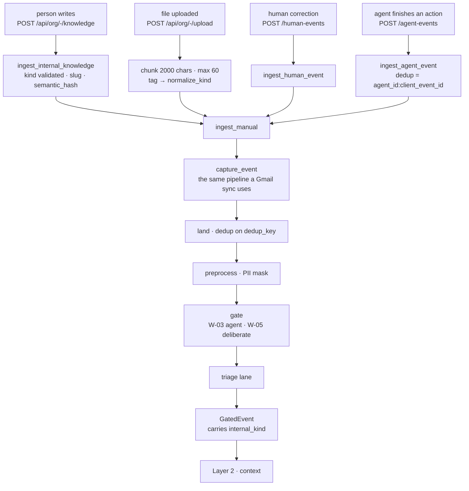
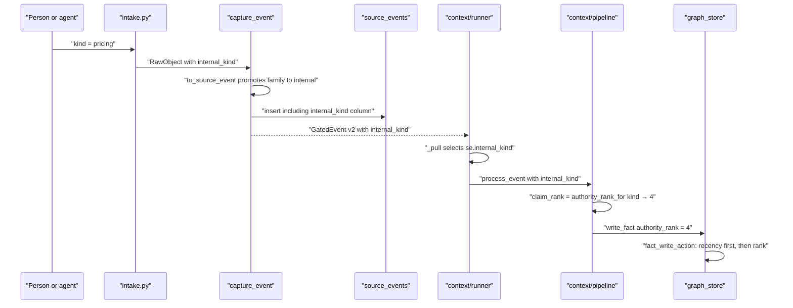
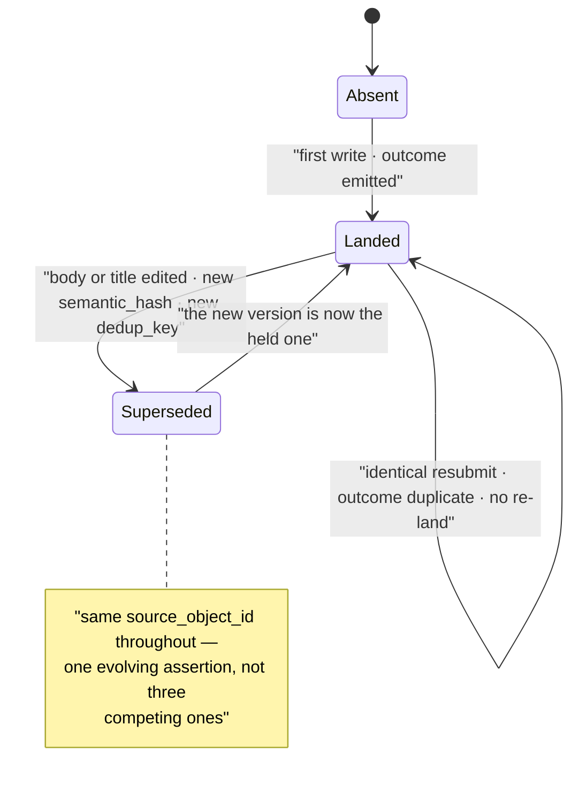

# Deliberate Intake — Internal, Human and Agent Sources

*Layer 1 · Knowledge Sources · the three sources that have no connector.*

> **When nobody synced it — when a person typed it, uploaded it, or an agent finished doing it — how does it get into the graph, and what is it worth once it is there?**

| | |
|---|---|
| **Files** | [internal_knowledge.py](../../../genios_engine/capture/internal_knowledge.py) · 128 lines — the vocabulary and the authority rule<br/>[intake.py](../../../genios_engine/capture/intake.py) · 133 lines — the four ingest functions<br/>[events.py](../../../genios_engine/contracts/events.py) · 60 lines — `HumanEvent`, `AgentEvent`<br/>[events_store.py](../../../genios_engine/capture/events_store.py) · 123 lines — the side ledgers |
| **HTTP doors** | [knowledge_routes.py](../../../genios_engine/api/knowledge_routes.py) · 86 lines<br/>[upload_routes.py](../../../genios_engine/api/upload_routes.py) · 296 lines<br/>`POST /human-events`, `POST /agent-events` in [routes.py](../../../genios_engine/api/routes.py) |
| **Sources owned** | `internal` *(family `internal`)* · `human` *(family `human_input`)* · `agent` *(family `ai_generated`)* — plus `upload`, which crosses into `internal` when tagged |
| **Object types** | `internal` → the 12 `INTERNAL_KINDS` · `agent` → `action` · `human` → not enumerated in the registry |
| **Emits** | `GatedEvent` carrying `internal_kind` — the same envelope a Gmail sync emits |
| **Constants** | `CANON_AUTHORITY_RANK = 4` · `OBSERVED_AUTHORITY_RANK = 2` · `ANCHORING_KINDS = {"project"}` |
| **Migration** | [0035_l1_internal_knowledge.sql](../../../migrations/0035_l1_internal_knowledge.sql) — `source_events.internal_kind`, `SourceEvent` → schema v3 |
| **Tests** | [test_internal_knowledge.py](../../../tests/test_internal_knowledge.py) · 220 lines<br/>[test_intake_one_door.py](../../../tests/test_intake_one_door.py) · 67 lines<br/>[test_canon_correlation.py](../../../tests/test_canon_correlation.py) · 212 lines |
| **LLM calls** | Zero, like the rest of [Layer 1](../00-Overview.md) |

---

## 1 · What this is

Every other source in [the registry](02-Source-Families.md) is *observed*: a connector reaches
into a mailbox, a CRM or a Drive folder and reports what it found. Three sources have no
connector at all, because there is nothing to reach into — the material only exists because a
human or an agent handed it over on purpose.

```python
    # ── deliberate intake (the one door) ─────────────────────────────────────────
    # The company stating something about ITSELF. No connector: the door is a person
    # writing, or an upload tagged with one of these kinds. Enters at authority rank 4
    # (see capture.internal_knowledge) — above system-of-record.
    SourceDescriptor("internal", "internal", deliberate=True,
                     object_types=tuple(sorted(INTERNAL_KINDS))),
    SourceDescriptor("human", "human_input", deliberate=True),
    SourceDescriptor("agent", "ai_generated", deliberate=True, object_types=("action",)),
```

A fourth descriptor, `upload`, sits in the `knowledge` family and is also `deliberate=True`.
It is not a deliberate *source* in the same sense — a shared customer PDF is not company
canon — but it becomes one the moment its tag names a canon kind. §7 covers that crossing.

`deliberate=True` is not decoration. It is read in exactly one place, and it is the reason
these events are never silently dropped:

```python
# Families a human or an agent DELIBERATELY handed us. The noise gate's N-codes exist
# for inbox firehoses; deliberately-provided material bypasses them (it still lands, is
# traced, and is deduped like everything else).
DELIBERATE_FAMILIES: frozenset[str] = frozenset({"human_input", "ai_generated"})
```

**`DELIBERATE_SOURCES` is the derived set `{internal, human, agent, upload}`, and the gate's
whitelist checks it before any destructive drop fires** ([rules.py](../../../genios_engine/capture/gate/rules.py)):

```python
    if (ctx.event.source in DELIBERATE_SOURCES
            or ctx.event.source_family in DELIBERATE_FAMILIES):
        return "W-05"                            # a human/agent deliberately handed us this —
                                                 # N-codes exist for inbox firehoses, not for it
```

Note that the check is `source` **or** `family`. That `or` is load-bearing: a canon-tagged
upload has its family promoted to `internal`, which is *not* in `DELIBERATE_FAMILIES`. Only
the source-id half of the test keeps it whitelisted. Agent events never reach W-05 at all —
they are caught two lines earlier by `W-03` on `actor.type == "agent"`.

---

## 2 · The authority gap — why any of this exists

This is the best-argued docstring in the capture package, and it is the whole reason the
module was written. Quoted at length from [internal_knowledge.py](../../../genios_engine/capture/internal_knowledge.py):

> **WHY THIS EXISTS — the authority gap**
>
> Before this, everything unstructured landed at authority_rank=2. So an uploaded pricing
> sheet carried EXACTLY the authority of a stranger's email mentioning a price, and since
> system-of-record facts land at rank 3, a Stripe row would BEAT the company's own written
> policy. `contracts.events` already described a human correction as "the strongest
> correction signal" — that was aspirational; FACT_CONF_BY_RANK already had a rank-4 tier
> that nothing ever wrote to.

That last clause is the tell. `FACT_CONF_BY_RANK` in
[context/pipeline.py](../../../genios_engine/context/pipeline.py) reads
`{4: 1.00, 3: 0.90, 2: 0.85, 1: 0.40}` — the top tier had a confidence and no writer.

### The three ranks

| Rank | Written by | Confidence | Meaning |
|---|---|---|---|
| **4** | `authority_rank_for(internal_kind)` when the kind is canon | `1.00` | The company deliberately asserted this about itself |
| **3** | [context/structured.py](../../../genios_engine/context/structured.py), hardcoded on the structured lane | `0.90` | A system of record — a CRM deal, a calendar event, a DB row |
| **2** | every other extracted claim | `0.85` | Observed traffic — grounded in an event we saw, not asserted by the org |
| **1** | *(nothing writes it)* | `0.40` | — |

### The three reasons canon sits on top

> Company canon enters at rank 4, above system-of-record, because:
>
>   * The two rarely describe the same FIELD. Canon says list price and refund window;
>     Stripe says what a specific customer was charged. Different facts, no contest.
>   * When they DO collide on one field, a deliberate written statement by the org should
>     win over a third party's inference — and the loss is not silent: graph_store records
>     a discrepancy, so the conflict stays visible instead of being resolved by luck.
>   * It makes an explicit human correction finally outrank the connector it corrects.

### Freshness before authority

Rank 4 does not mean permanent. The ordering of checks inside `fact_write_action`
([context/graph_store.py](../../../genios_engine/context/graph_store.py)) decides recency
*first*:

```python
    if ho is not None and no is not None and no < ho:
        return "historical"                       # out-of-order → record, never overwrite
    if replay:
        return "historical"                       # replay may fill gaps, never flip state
    if held_rank is not None and new_rank < held_rank:
        return "discrepancy"                      # lower authority disagrees → flag, keep held
    return "supersede"
```

> Freshness still comes first: `fact_write_action` decides recency BEFORE authority, so a
> rank-4 statement from last year does not pin a field against this morning's rank-3 fact.
> Canon is authoritative, not immortal.

---

## 3 · The twelve kinds

`INTERNAL_KINDS` is the declared vocabulary. It is a `frozenset`, and the `internal`
descriptor's `object_types` is literally `tuple(sorted(INTERNAL_KINDS))` — **one vocabulary,
not two**, pinned by `test_the_registry_publishes_the_kinds_as_object_types`.

> The twelve things a company can assert about itself. Declared, never derived —
> `capture.source_registry` publishes these as the `internal` source's object types.

| Kind | Comment in the code | Class |
|---|---|---|
| `policy` | *rules the company binds itself to — refunds, leave, security* | reference |
| `sop` | *how a process is run, step by step* | reference |
| `product` | *what we sell and what it does* | reference |
| `pricing` | *list price, tiers, discount rules* | reference |
| `goal` | *a target the company has set itself* | reference |
| `kpi` | *a metric the company measures itself by* | reference |
| `org_structure` | *teams, reporting lines, ownership* | reference |
| `employee_profile` | *who someone is, what they own* | reference |
| `project` | *a named body of work* | **anchoring** |
| `task` | *a unit of work with an owner* | reference *(for now — see §4)* |
| `asset` | *a resource the company holds — tools, licences, accounts* | reference |
| `wiki` | *internal reference prose that is none of the above* | reference |

### Why Company Memory is deliberately excluded

The specification's Internal Sources list has a thirteenth subpart. It is not here, on purpose:

> The kind vocabulary is the doc's Internal Sources subparts, with Company Memory
> deliberately EXCLUDED: memory is derived from what the graph has already seen, so
> re-ingesting it as a source would launder yesterday's inference into today's evidence.
> Memory belongs to Layer 2.

`test_company_memory_is_not_an_internal_kind` asserts both halves — `"memory" not in
INTERNAL_KINDS` **and** `normalize_kind("memory") is None` — so it cannot creep back in
through the alias table either.

---

## 4 · Anchoring vs reference — and why `task` is not there yet

```python
ANCHORING_KINDS: frozenset[str] = frozenset({"project"})
```

An *anchor* is the subject a business situation is built around. Layer 2's correlation
groups signals under anchors; Layer 4 reasons per situation. The question this constant
answers is not "is this important" but "should other signals cluster under it":

> Kinds that describe WORK IN FLIGHT, and can therefore anchor a business situation:
> other signals — a Slack thread, a commit, a meeting — legitimately group under them.
>
> Everything else is REFERENCE — knowledge to be consulted, not a situation to act on.
> A refund policy is true continuously; it is not something happening. Letting every
> policy, price list and wiki page open its own situation would bury the handful that
> need attention under a filing cabinet, which is the opposite of the point.

And the honest note about the one kind that looks like it belongs:

> `task` is deliberately NOT here yet. A task per situation would be one situation per
> to-do item, and nothing downstream is ready to rank at that granularity — it would
> swamp the same list. Add it when something consumes it.

Layer 2 does not restate the list. `context/correlation.py` derives its anchor priority from
it — `("deal", *sorted(ANCHORING_KINDS), "company", "person")` — and
`test_the_anchor_list_is_derived_not_restated` inspects the source to prove it, because *"a
second hand-written list in Layer 2 is how the source registry drifted before it was
unified."*

---

## 5 · The vocabulary functions

Four small functions, all pure, all in `internal_knowledge.py`. Everything else in the system
asks them rather than pattern-matching on source names.

### `normalize_kind(value)` and the alias table

The upload `tag` field has always been free text. Existing tenants had already tagged files
`SOPs`, `Price List`, `OKRs`. Demoting those to non-canon would have been a silent regression,
so there is a tolerant front door:

```python
    key = str(value).strip().lower().replace(" ", "_").replace("-", "_")
    if key in INTERNAL_KINDS:
        return key
    return _ALIASES.get(key)
```

| Canonical kind | Accepted aliases |
|---|---|
| `sop` | `sops`, `process`, `procedure`, `runbook`, `playbook` |
| `policy` | `policies` |
| `product` | `products`, `product_info`, `productinfo` |
| `pricing` | `price`, `prices`, `pricelist`, `price_list`, `rate_card` |
| `goal` | `goals`, `okr`, `okrs`, `objective` |
| `kpi` | `kpis`, `metric`, `metrics` |
| `org_structure` | `org`, `org_chart`, `orgchart`, `team`, `teams`, `structure` |
| `employee_profile` | `employee`, `employees`, `people`, `profile` |
| `project` | `projects` |
| `task` | `tasks` |
| `asset` | `assets`, `resource`, `resources` |
| `wiki` | `wiki_page`, `handbook`, `docs`, `documentation` |

Because the key is lowercased and both spaces and hyphens fold to `_`, `"Price List"`,
`"price-list"` and `"PRICE_LIST"` are one input. The tolerance stops there:

> None is the honest answer for an unrecognised tag: it stays an ordinary tagged
> document at observed authority. Guessing here would hand rank 4 to a typo.

### `is_canon`, `authority_rank_for`, `is_anchoring`

```python
def authority_rank_for(kind: str | None) -> int:
    """The authority an event carries into the graph. L1 owns this: authority is a
    property of PROVENANCE, and provenance is what capture knows. L2 honours it rather
    than re-deriving it from the source name."""
    return CANON_AUTHORITY_RANK if is_canon(kind) else OBSERVED_AUTHORITY_RANK
```

That docstring is the architectural claim: **authority is decided in Layer 1 because Layer 1
is the layer that knows where a thing came from.** Layer 2 imports this function and calls it
once — `claim_rank = authority_rank_for(internal_kind)` — rather than inferring rank from the
source string.

`is_anchoring` is the correlation half, and its docstring is worth keeping whole:

> True for work in flight (a project), false for standing reference (a policy). The
> distinction is not about importance — a pricing policy may matter more than any one
> project — it is about whether other signals should GROUP under it. Emails cluster
> around a project; they do not cluster around a refund policy.

---

## 6 · The four intake functions

[intake.py](../../../genios_engine/capture/intake.py) opens with the reason it exists:

> The ONE door for manual intake — human notes/edits, agent outcome events, upload
> chunks. Everything a person or an AI deliberately hands GeniOS becomes a SourceEvent
> through the SAME capture_event pipeline as a connector sync: deduped, traced, gated
> (W-05 keeps it from noise-drops), payload+prepared persisted, then drained by L2.
>
> Before this, each intake path wrote around the pipeline (uploads did their own SQL
> insert; human/agent events landed in side tables L2 never read) — so the twin simply
> never learned what users explicitly told it.

### `ingest_manual` — the primitive

Everything else is a call to this. It builds a `RawObject` and hands it to `capture_event`;
there is no second path.

| Parameter | Purpose |
|---|---|
| `source`, `object_type`, `source_object_id` | the three components of the dedup key |
| `content_version` | folded into the dedup key — the supersede mechanism |
| `internal_kind` | promotes the family to `internal` and the rank to 4 |
| `actor_type` | defaults to `internal_user`; `agent` triggers W-03 |
| `connection_id` | defaults to `"manual"`; the callers pass `knowledge`, `human`, `upload`, or the agent id |
| `raw_extra` | merged into `raw` alongside `body` and `subject` |

### `ingest_internal_knowledge` — supersede, not append

This is the canon door. Three things happen that do not happen anywhere else.

**One — a bad kind is refused, not demoted.**

```python
    canonical = normalize_kind(kind)
    if canonical is None:
        raise ValueError(
            f"unknown internal knowledge kind {kind!r}; expected one of "
            f"{', '.join(sorted(INTERNAL_KINDS))}")
```

> the caller asked for canon and a typo would quietly hand it observed authority instead.

An empty body is refused too — *"an empty assertion is not canon"*.

**Two — identity is the slug, not the content.** `source_object_id` is `f"{canonical}:{slug}"`,
where `_slug` collapses case and punctuation:

```python
def _slug(text: str) -> str:
    """Title → a stable identity for the assertion. Case and punctuation must not fork
    one policy into two ('Refund policy' and 'refund-policy' are the same statement)."""
    return re.sub(r"[^a-z0-9]+", "-", text.lower()).strip("-")[:80] or "untitled"
```

**Three — the content hash rides on top of that identity as `content_version`:**

```python
        content_version=semantic_hash({"title": subject, "body": body}),
```

`semantic_hash` is `sha256(canonical_dumps(value))` from
[platform/canonical.py](../../../genios_engine/platform/canonical.py) — sorted keys, tight
separators, so the hash is a property of the values and not of dict ordering. It folds into
the dedup key via `compute_dedup_key`, giving the behaviour the docstring promises:

> SUPERSEDES, not append. The dedup key is (key, semantic hash of the content):
>
>   * re-submitting identical content       → same key → duplicate, no re-land
>   * editing the policy and re-submitting  → new hash → new key → it re-lands and
>     the graph updates, exactly like a CRM deal whose stage changed

The title is hashed *with* the body deliberately. `test_an_explicit_key_survives_a_retitle`
explains why: *"the title is prepended into the prepared text L2 extracts from, so renaming a
document genuinely changes what the graph is asked to read. Hashing the body alone would let a
retitle silently never take effect."*

### `ingest_human_event`

Takes a `HumanEvent` from [contracts/events.py](../../../genios_engine/contracts/events.py) —
one of eight declared types (`human.fact_edit`, `human.card_wrong`, `human.merge_confirm`,
`human.merge_undo`, `human.scope_change`, `human.park_recover`,
`human.classification_relabel`, `human.manual_context`) — and turns it into a `SourceEvent`:

- `source="human"`, so `family_of` gives `human_input`
- `object_type = ev.type.replace("human.", "")` → `manual_context`, `fact_edit`, …
- `source_object_id = f"{ev.actor_id}:{ev.type}:{ev.occurred_at.isoformat()}"`
- body is `detail["text"]` or `detail["note"]`, falling back to a JSON rendering of
  `{target, detail}` — *"the LLM reads prose"*

### `ingest_agent_event` — dedup on the agent's own idempotency key

```python
    """An agent's completed action enters the graph's world — so GeniOS never
    recommends what an agent already did, and outcomes become learnable.
    Dedup key rides the agent's own idempotency key."""
```

`source_object_id` is `ev.idempotency_key`, which `AgentEvent` defines as
`f"{self.agent_id}:{self.client_event_id}"`. `object_type` is the single declared type
`action`; `action_taken` must be one of the seven in `AGENT_ACTIONS` (`email_sent`,
`meeting_booked`, `ticket_resolved`, `crm_field_changed`, `invoice_reminder_sent`,
`document_generated`, `approval_requested`) — *"unknown actions are rejected, never guessed"* —
though that check lives in the route, not in intake.

`connection_id` is the agent's own id, so a per-agent view of what landed is a plain filter.

---

## 7 · The doors

### `POST /api/org/{org_id}/knowledge` — writing

[knowledge_routes.py](../../../genios_engine/api/knowledge_routes.py) states the split:

> The upload door (upload_routes) takes a file the company already has. This one takes
> what is only in someone's head: the refund policy, how onboarding actually runs, what
> the Q3 goal is.

A companion `GET /api/org/{org_id}/knowledge/kinds` serves `sorted(INTERNAL_KINDS)` — *"served
from the same constant capture validates against, so the UI cannot drift into offering a kind
the door refuses."*

The response deliberately reports a duplicate as success:

```python
    # `duplicate` is a SUCCESS: the org re-submitted content it had already asserted, so
    # the graph already holds it. Reporting it as an error would push users to edit text
    # meaninglessly just to make the button work.
    return {"kind": kind, "outcome": result.outcome, "event_id": result.event.event_id,
            "unchanged": result.outcome == "duplicate"}
```

### `POST /api/org/{org_id}/upload` — tagging a file into canon

A file is stored, parsed (`pdf` → pypdf, `docx` → python-docx, else utf-8), cut into 2 000-char
chunks capped at 60, and each chunk goes through `ingest_manual`. One line decides its
authority:

```python
    kind = normalize_kind(tag)          # a canon tag promotes the whole file to rank 4
```

The chunk emitter carries the subtlest decision in the file:

```python
                  # One canon node per FILE, not per chunk. Keying on the event would give
                  # a 30-chunk pricing PDF thirty separate "Pricing" entities, each holding
                  # a slice of one document — the graph would look like thirty price lists.
                  raw_extra=({"knowledge_key": file_id, "title": subject}
                             if internal_kind else None),
```

### `POST /human-events` and `POST /agent-events`

Both are in [routes.py](../../../genios_engine/api/routes.py) with no router prefix. Both write
**twice**: to the side ledger *and* through the one door.

```python
    _human_events.add(ev)               # the correction ledger (kept — audit/undo reads it)
    # ONE DOOR: the event also enters the graph's world as a SourceEvent, so L2 actually
    # learns what the human said (before: side table only, the twin never saw it).
```

The ledgers were not deleted because they do other jobs: `human_events` backs audit and undo,
and `agent_events` carries the unique index `agent_events_idem on (org_id, agent_id,
client_event_id)` that makes the HTTP response's `duplicate` flag authoritative independent of
capture's dedup.

---

## 8 · Diagrams

### The four paths into the one pipeline



### How authority crosses the seam



### Canon lifecycle — one assertion over time



---

## 9 · A worked example — writing the refund policy twice

Run against `InMemorySourceEventRepository`, org `org_demo`. Every value below is the real
output of the real code.

### Write 1 — the first assertion

```python
ingest_internal_knowledge(org_id="org_demo", kind="policy", title="Refund Policy",
                          body="Refunds are accepted within 30 days of purchase.",
                          author_email="ops@acme.io", repo=repo, ...)
```

| Field | Value |
|---|---|
| `source` | `internal` |
| `source_family` | `internal` — promoted by `to_source_event`, not by the descriptor |
| `internal_kind` | `policy` |
| `object_type` | `policy` |
| `source_object_id` | `policy:refund-policy` |
| `content_version` | `884427ae8883851ace1f1ea9c1a6d1386c575cc9268e84fb0e9bba60cdc30695` |
| `dedup_key` | `internal:policy:policy:refund-policy:884427ae…30695` |
| `connection_id` | `knowledge` |
| `actor.type` | `internal_user` |
| **outcome** | `emitted` |

The trace, verbatim from `EventTrace.records`:

| Stage | Action | Detail |
|---|---|---|
| `landing` | pass | `object_type=policy` |
| `preprocess` | pass | `language=en · masked=0 · protected=1` |
| `S0` | pass | — |
| `S1` | pass | `whitelist=W-05` |
| `S2` | pass | `route=needs_extraction` |
| `triage` | pass | `lane=P3` |
| `emit` | emit | `route=needs_extraction · lane=P3` |

The `GatedEvent` carries `internal_kind="policy"` at `schema_version=2`. Layer 2 registers the
canon node `internal:policy:refund-policy` — the `<source>:<object id>` shape of the structured
lane, *"because canon IS a system of record, and the company is the system"* — and every
extracted claim writes at `authority_rank=4`, `confidence=1.00`, with
`evidence["internal_kind"]="policy"`.

### Write 2 — identical content

Same title, same body, submitted again. The dedup key is byte-identical, so:

| Stage | Action | Detail |
|---|---|---|
| `landing` | **drop** | `reason_code=duplicate` |

`outcome = "duplicate"`, `gated = None`. No payload written, no prepared text written, no LLM
call, no graph version bump. The API returns `{"outcome": "duplicate", "unchanged": true}` with
HTTP 200 — a success, by the reasoning quoted in §7.

### Write 3 — edited to 14 days

```python
body="Refunds are accepted within 14 days of purchase."
```

| Field | Value |
|---|---|
| `source_object_id` | `policy:refund-policy` — **unchanged** |
| `content_version` | `c6e4491fb6d978466c955ab740cbdbeac2c1c64a325481449471f87442027abc` |
| `dedup_key` | `internal:policy:policy:refund-policy:c6e4491f…27abc` — **new** |
| **outcome** | `emitted` |

The persisted prepared text is `"Refund Policy\n\nRefunds are accepted within 14 days of
purchase."` — title prepended and masked with the body, which is why the title is inside the
hash.

Because the identity is unchanged, Layer 2 resolves the same canon node and the same field.
`fact_write_action` sees a newer `occurred_at` and an equal rank, returns `supersede`, and the
30-day value is stamped superseded rather than left competing.
`test_editing_canon_supersedes_it` pins exactly this:

```python
    assert first.event.dedup_key != second.event.dedup_key
    # ...but it is the SAME assertion, not a competing one: identity is the key, and the
    # content hash rides on top of it.
    assert first.event.source_object_id == second.event.source_object_id == "policy:refund-policy"
```

### For contrast — the other two deliberate sources

| | Human note | Agent action |
|---|---|---|
| call | `ingest_human_event(HumanEvent(type="human.manual_context", actor_id="rohit", detail={"text": …}))` | `ingest_agent_event(AgentEvent(agent_id="sdr-1", client_event_id="c-42", action_taken="email_sent"))` |
| `dedup_key` | `human:manual_context:rohit:human.manual_context:2026-08-01T12:00:00+00:00` | `agent:action:sdr-1:c-42` |
| `source_family` | `human_input` | `ai_generated` |
| whitelist | `W-05` | `W-03` *(actor type wins first)* |
| `internal_kind` | `None` → rank 2 | `None` → rank 2 |
| second identical call | new timestamp → new key → lands again | `duplicate` |

---

## 10 · Gaps

**1 · A human correction still lands at rank 2.** `internal_knowledge.py` argues that rank 4
*"makes an explicit human correction finally outrank the connector it corrects"* — but
`ingest_human_event` passes no `internal_kind`, so a `human.fact_edit` reaches
`process_event` with `internal_kind=None` and `claim_rank = 2`. The promise holds only for
material routed through the *canon* door. `contracts/events.py` still calls human events *"the
strongest correction signal"*; in the graph they are the weakest tier that anything writes.

**2 · Retagging an upload changes the label, not the authority.**
`PATCH /api/org/{org_id}/uploads/{file_id}/tag` executes a single `update resource_uploads set
tag=…`. It does not re-emit chunks, and `source_events.internal_kind` on the already-landed
rows is untouched. Meanwhile `_row` computes `"authority": authority_rank_for(r.tag)` from the
*current* tag — so after a retag the list endpoint reports authority 4 while the graph still
holds rank 2. That is the same class of bug the comment beside it was written to fix:

> Reported, not asserted. This was a hardcoded 1.0 on every row while the facts
> underneath all landed at rank 2 — the UI claimed an authority the graph did not
> honour.

**3 · Re-uploading an edited file forks the canon node.** The writing door keys an assertion on
a title slug; the upload door keys it on `file_id`, which is a fresh `new_id("upl")` on every
upload. Upload `pricing-2026.pdf`, edit it, upload again, and the graph holds two canon nodes —
`internal:pricing:upl_a…` and `internal:pricing:upl_b…` — where the writing door would have
superseded. There is no `key` parameter on the upload form.

**4 · The upload door sets no `content_version`.** Chunk dedup keys are
`upload:document_chunk:{file_id}:chunk_{i}`, with no hash. Within one `file_id` a chunk can
therefore never re-land, which is correct given (3) but means the supersede mechanism is
canon-door-only.

**5 · `task` cannot anchor.** Documented as deliberate, not an oversight — *"Add it when
something consumes it."*

**6 · The `human` descriptor enumerates no object types.** `object_types=()` is documented in
`SourceDescriptor` as *"NOT ENUMERATED (tenant-defined, e.g. client DB tables)"*, but human
object types are perfectly enumerable — they are `_HUMAN_TYPES` with the `human.` prefix
stripped. The two vocabularies are maintained independently and nothing checks them against
each other, which is precisely the drift the source registry was built to end.

**7 · Written knowledge earns no coverage credit.** `internal`, `human`, `agent` and `upload`
carry `capability=None`, and `PROVIDER_CAPABILITY` is derived from that field. A tenant can
write every policy, SOP and price list it owns and `compute_coverage` will still report the
`sales` pack as not coverage-ready. See [Coverage and Readiness](07-Coverage-and-Readiness.md).

**8 · `AGENT_ACTIONS` is enforced at the route, not at intake.** Calling `ingest_agent_event`
directly with an unlisted `action_taken` lands it. The validation is real for HTTP traffic and
absent for in-process callers.

---

## 11 · Map

### Source files

| File | Role |
|---|---|
| [capture/internal_knowledge.py](../../../genios_engine/capture/internal_knowledge.py) | Kinds, aliases, ranks, `normalize_kind` / `is_canon` / `authority_rank_for` / `is_anchoring` |
| [capture/intake.py](../../../genios_engine/capture/intake.py) | `ingest_manual`, `ingest_internal_knowledge`, `ingest_human_event`, `ingest_agent_event`, `_slug`, `_dict_text` |
| [capture/source_registry.py](../../../genios_engine/capture/source_registry.py) | The `internal` / `human` / `agent` / `upload` descriptors, `DELIBERATE_SOURCES` |
| [capture/landing/normalize.py](../../../genios_engine/capture/landing/normalize.py) | Family promotion when `internal_kind` is set |
| [capture/gate/rules.py](../../../genios_engine/capture/gate/rules.py) | `W-03`, `W-05` |
| [capture/events_store.py](../../../genios_engine/capture/events_store.py) | `human_events` / `agent_events` ledgers, agent registry |
| [contracts/events.py](../../../genios_engine/contracts/events.py) | `HumanEvent`, `AgentEvent`, `AGENT_ACTIONS` |
| [context/canon.py](../../../genios_engine/context/canon.py) | Layer 2's consumer: canon nodes, `canon_key`, `anchors_situations` |

### Endpoints

| Method | Path | Auth | Emits |
|---|---|---|---|
| `GET` | `/api/org/{org_id}/knowledge/kinds` | org credential | — |
| `POST` | `/api/org/{org_id}/knowledge` | org credential | one canon `SourceEvent` |
| `POST` | `/api/org/{org_id}/upload` | org credential | one `SourceEvent` per chunk, max 60 |
| `PATCH` | `/api/org/{org_id}/uploads/{file_id}/tag` | org credential | nothing — metadata only |
| `DELETE` | `/api/org/{org_id}/uploads/{file_id}` | org credential | erases facts, payloads, prepared, events |
| `POST` | `/human-events` | owner session | one `human_input` `SourceEvent` + ledger row |
| `POST` | `/agent-events` | `X-Agent-Key` header | one `ai_generated` `SourceEvent` + ledger row |

### Tables

| Table | Migration | Note |
|---|---|---|
| `source_events.internal_kind` | [0035](../../../migrations/0035_l1_internal_knowledge.sql) | *"the carrier of AUTHORITY across the L1→L2 seam"* |
| `idx_source_events_internal_kind` | 0035 | partial index, `where internal_kind is not null` |
| `resource_uploads` | [0020](../../../migrations/0020_resource_uploads.sql) | per-file record: `tag`, `status`, counts, `source_item_prefix` |
| `human_events` | [0002](../../../migrations/0002_l1_tables.sql) | correction ledger, read by audit/undo |
| `agent_events` | 0002 | unique `(org_id, agent_id, client_event_id)` |
| `agent_registry` | 0002, extended by 0017/0019 | `key_hash` + `allowed_actions`, `status='archived'` revokes |

### Tests

| Test file | Pins |
|---|---|
| [test_internal_knowledge.py](../../../tests/test_internal_knowledge.py) | vocabulary → landing → the seam → the graph write; both halves of the round trip |
| [test_intake_one_door.py](../../../tests/test_intake_one_door.py) | human/agent/upload all become `SourceEvent`s; agent idempotency; W-05 |
| [test_canon_correlation.py](../../../tests/test_canon_correlation.py) | anchoring vs reference; canon node identity; the derived anchor list |

### Related documents

- [Knowledge Sources — Overview](00-Overview.md)
- [Source Families](02-Source-Families.md)
- [Coverage and Readiness](07-Coverage-and-Readiness.md)
- [Landing and Deduplication](../03-Normalization-and-Extraction/01-Landing-and-Deduplication.md)
- [The Persisted Seam](../03-Normalization-and-Extraction/05-The-Persisted-Seam.md)
- [ESQE — The Gate](../04-ESQE/01-The-Gate.md)
- [Layer 1 Overview](../00-Overview.md)
