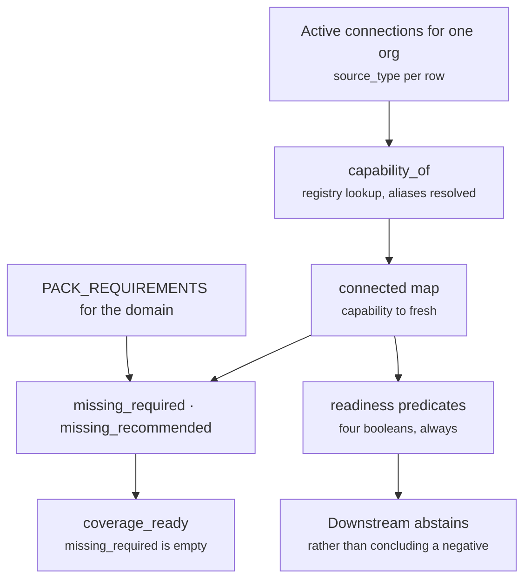

# Coverage and Readiness

*Layer 1 · [capture/coverage/model.py](../../../genios_engine/capture/coverage/model.py) — 63 lines, no state, no I/O.*

> A domain pack needs certain kinds of data to reason at all. Which of them does this tenant actually have connected — and what must downstream layers refuse to conclude about the ones they do not?

| | |
|---|---|
| **Module** | [capture/coverage/model.py](../../../genios_engine/capture/coverage/model.py) — `PACK_REQUIREMENTS`, `PROVIDER_CAPABILITY`, `_READINESS`, `compute_coverage`, `capability_of` |
| **Upstream** | [source_registry.py](../../../genios_engine/capture/source_registry.py) — `PROVIDER_CAPABILITY` is imported, not declared |
| **Endpoint** | `GET /coverage?domain=sales` → [api/routes.py](../../../genios_engine/api/routes.py) |
| **Domains** | `sales`, `support`, `admin` |
| **Capabilities in play** | 7 provided · 8 referenced by packs · 4 with a readiness predicate |
| **Satisfiable today** | `communication`, `calendar`, `document_store`, `product_usage` — and no more |
| **Tests** | [test_domain_coverage.py](../../../tests/test_domain_coverage.py) · [test_source_registry.py](../../../tests/test_source_registry.py) |

---

## 1 · The idea in one comment

The module opens with three lines that contain the entire design:

> Coverage / context-readiness. Absence of data must never be read as negative evidence — downstream layers get explicit readiness predicates instead.
> Packs declare CAPABILITIES (not vendor names); providers satisfy capabilities.

Two decisions live in there.

**Packs name capabilities, never vendors.** The sales pack does not require HubSpot; it requires `crm`. Swapping HubSpot for Pipedrive is then a registry edit, not a pack rewrite, and a tenant on Salesforce is not second-class. The indirection also means the question "can this domain ever work?" has a computable answer — §5.

**Absence is not a fact.** This is the load-bearing one, and §4 is about nothing else.

---

## 2 · `PACK_REQUIREMENTS`

Three domains, each with a required set and a recommended set, verbatim:

```python
PACK_REQUIREMENTS: dict[str, dict[str, list[str]]] = {
    "sales":   {"required": ["communication", "crm"],
                "recommended": ["calendar", "product_usage", "document_store"]},
    "support": {"required": ["support_desk", "communication"],
                "recommended": ["product_usage", "incident"]},
    "admin":   {"required": ["finance", "communication"],
                "recommended": ["document_store"]},
}
```

| Domain | Required | Recommended | Can it ever be `coverage_ready`? |
|---|---|---|---|
| `sales` | `communication`, **`crm`** | `calendar`, `product_usage`, `document_store` | **No** — no CRM is buildable |
| `support` | **`support_desk`**, `communication` | `product_usage`, **`incident`** | **No** — no support desk is buildable |
| `admin` | **`finance`**, `communication` | `document_store` | **No** — no finance source is buildable |

`communication` is required by all three and is the only required capability with a buildable provider (`gmail`). Every domain's readiness therefore hinges on exactly one missing thing, and it is a different missing thing each time.

`incident` deserves a footnote: **no descriptor anywhere declares `capability="incident"`.** It is referenced by the support pack and provided by nothing. Because it sits in `recommended`, the ratchet test in §5 — which inspects `required` only — does not see it.

---

## 3 · `compute_coverage` — the whole function

There is no database access, no caching, and no hidden state. It is a pure function of `(domain, connected)`.

```python
def compute_coverage(domain: str, connected: dict[str, str]) -> dict[str, Any]:
    """connected = {capability: status}, status ∈ fresh|stale|not_connected.
    Returns capability status, missing lists, coverage_ready, readiness predicates."""
    reqs = PACK_REQUIREMENTS.get(domain, {"required": [], "recommended": []})

    def status_of(cap: str) -> str:
        return connected.get(cap, "not_connected")

    missing_required = [c for c in reqs["required"] if status_of(c) != "fresh"]
    missing_recommended = [c for c in reqs["recommended"] if status_of(c) != "fresh"]
```

Four properties fall out of those six lines:

1. **An unknown domain is empty, not an error.** `PACK_REQUIREMENTS.get(domain, …)` returns empty lists, so `missing_required` is `[]` and `coverage_ready` is `True`. `GET /coverage?domain=nonsense` answers *ready*. That is a defensible default only because nothing consumes the flag yet.
2. **Only `fresh` counts.** `status_of(c) != "fresh"` — `stale` is treated exactly like `not_connected` for readiness purposes. Stale data does not partially qualify.
3. **The default is `not_connected`.** A capability absent from `connected` is not unknown; it is explicitly reported as absent.
4. **Order is preserved from the pack, not from the input.** `missing_required` follows the declaration order in `PACK_REQUIREMENTS`, so the output is stable.

The return shape:

```python
    return {
        "domain": domain,
        "capabilities": {c: status_of(c) for c in set(reqs["required"] + reqs["recommended"])},
        "missing_required": missing_required,
        "missing_recommended": missing_recommended,
        "coverage_ready": len(missing_required) == 0,
        "readiness": readiness,
    }
```

| Key | Meaning |
|---|---|
| `domain` | echoed back |
| `capabilities` | every capability this pack mentions, required or recommended, mapped to `fresh` / `stale` / `not_connected` |
| `missing_required` | required capabilities not `fresh` — non-empty means the pack is blind on something it cannot work without |
| `missing_recommended` | not `fresh`, but the pack still functions |
| `coverage_ready` | `len(missing_required) == 0`, nothing more |
| `readiness` | the predicate map — see §4 |

`capabilities` is built from a `set`, so its **key order is not deterministic across runs**. Nothing depends on it today; do not start.

### 3.1 Where `connected` comes from

The one production caller derives it from this org's live connection rows:

```python
def _connected_capabilities(org_id: str) -> dict[str, str]:
    """Derive coverage from THIS org's DB connections — no in-memory state, survives restart."""
    out: dict[str, str] = {}
    for c in _connections.list_active():
        if c.org_id == org_id and (cap := capability_of(c.source_type)):
            out[cap] = "fresh"
    return out
```
— [api/routes.py](../../../genios_engine/api/routes.py), feeding `GET /coverage`

**`"fresh"` is a literal.** Nothing in the engine ever produces the `"stale"` status the docstring describes. An active connection that has not synced in three weeks reports `fresh`; a connection whose last sync failed reports `fresh`. The three-value vocabulary is designed; only two values are reachable, and the reachable pair is `fresh` / `not_connected`.

A connection whose `source_type` has no capability — `mysql`, `database`, `pipedrive`, `github`, `jira` — contributes nothing here. The walrus simply skips it.

---

## 4 · The governing principle: absence is not negative evidence

```python
# Which readiness predicate each capability unlocks (absence ≠ negative fact).
_READINESS = {
    "communication": ["can_evaluate_no_reply"],
    "calendar": ["can_evaluate_no_meeting"],
    "finance": ["can_evaluate_payment_state"],
    "product_usage": ["can_evaluate_usage_drop"],
}
```

```python
    readiness: dict[str, bool] = {}
    for cap, preds in _READINESS.items():
        fresh = status_of(cap) == "fresh"
        for p in preds:
            readiness[p] = fresh
```

Each predicate names a **question the engine is permitted to ask**, and each is `True` only while the capability that would answer it is fresh.

| Capability | Predicate | The question it licenses |
|---|---|---|
| `communication` | `can_evaluate_no_reply` | "nobody replied to this" |
| `calendar` | `can_evaluate_no_meeting` | "no meeting was booked" |
| `finance` | `can_evaluate_payment_state` | "this has not been paid" |
| `product_usage` | `can_evaluate_usage_drop` | "usage fell off" |

### 4.1 Why this exists — a concrete failure

Every one of those four questions is phrased as a **negative**, and that is not a coincidence. A negative conclusion is drawn from the *absence of a record*, and absence has two causes that look identical from downstream: the thing did not happen, or we were never watching.

Take the sales pack with Gmail connected and no calendar. A cooling-deal rule wants to know whether the prospect ever got a meeting.

**Without the predicate.** The engine queries the graph for a meeting node linked to the deal. There is none — there is no calendar connector, so there has never been a meeting node for any deal in this tenant. The rule reads zero as *"no meeting was booked"*, fires, and the founder gets a card saying **"Meridian went quiet and never took a meeting — chase them."** The prospect met the founder twice last week. The engine did not just miss a meeting; it asserted a fact about the world it had no instrument to observe, and it did so with the same confidence it would have had if the calendar were connected and genuinely empty. The founder now distrusts the next card too.

**With the predicate.** `compute_coverage("sales", {"communication": "fresh"})` returns `can_evaluate_no_meeting=False`, and the rule abstains. The deal may still surface on the reply evidence — `can_evaluate_no_reply` is `True`, because Gmail *is* connected and a silent thread there is a real observation. **The engine says less, and everything it says is still true.**

The test in [test_domain_coverage.py](../../../tests/test_domain_coverage.py) pins exactly this pair, and its comment is the shortest statement of the principle in the codebase:

```python
def test_coverage_not_ready_and_absence_not_negative():
    # calendar not connected → can_evaluate_no_meeting is False (don't conclude "no meeting")
    cov = compute_coverage("sales", {"communication": "fresh"})   # crm missing
    assert cov["coverage_ready"] is False
    assert "crm" in cov["missing_required"]
    assert cov["readiness"]["can_evaluate_no_meeting"] is False
```

The same instinct recurs throughout Layer 2, phrased locally each time — worth reading together, because it is one idea defended in four places:

> An entity with no dated evidence is not stale — we simply cannot tell. It stays active.
> — [context/health.py](../../../genios_engine/context/health.py)

> `known=False` when nothing is dated. That is NOT staleness — it is an absence of information.
> — [context/situations.py](../../../genios_engine/context/situations.py)

### 4.2 Two properties of the loop that surprise people

**Readiness is domain-independent.** The loop iterates all of `_READINESS`, not the requested pack's capabilities. So a `sales` response always carries `can_evaluate_payment_state` even though `finance` appears nowhere in the sales pack. The map is always four keys, in the same order, for every domain. That is arguably right — a predicate is a statement about the tenant's instruments, not about the pack asking — but it is not what the pack-shaped signature suggests.

**Three capabilities have no predicate at all.** `crm`, `support_desk` and `document_store` unlock nothing. There is no `can_evaluate_stage_stalled`, no `can_evaluate_no_ticket`. A rule that wants to conclude "this deal has not moved stage" has no readiness flag to consult and must reach the same conclusion some other way — or, more likely, not notice that it should have asked.



---

## 5 · Why `PROVIDER_CAPABILITY` is now derived

The module no longer declares the provider table. It imports one:

```python
from genios_engine.capture.source_registry import PROVIDER_CAPABILITY as _REGISTRY_CAPABILITY

# Derived from the source registry, not hand-listed: this list drifting from the family
# taxonomy is why `stripe` had a capability but no family. Alias ids resolve too, so a
# connection stored as source_type='google_calendar' now counts toward `calendar`
# coverage — hand-listing only the canonical id silently under-reported it.
PROVIDER_CAPABILITY: dict[str, str] = _REGISTRY_CAPABILITY
```

In the registry it is one comprehension over the alias index:

```python
PROVIDER_CAPABILITY: dict[str, str] = {
    key: d.capability for key, d in _BY_ID.items() if d.capability is not None}
```

`_BY_ID` holds **every canonical id and every alias**, which is the whole trick. The resulting 19 keys across 7 capabilities:

| Capability | Provider ids, aliases included | Any buildable? |
|---|---|---|
| `communication` | `gmail`, `outlook`, `slack` | **yes** — `gmail` |
| `calendar` | `gcal`, `calendar`, `google_calendar`, `mscal` | **yes** — `gcal` |
| `document_store` | `notion`, `gdrive`, `drive`, `google_drive` | **yes** — `notion`, `gdrive` |
| `product_usage` | `mixpanel`, `postgres` | **yes** — `postgres` |
| `crm` | `hubspot`, `salesforce` | no |
| `finance` | `stripe`, `razorpay` | no |
| `support_desk` | `zendesk`, `intercom` | no |

### 5.1 The bug alias resolution fixed

`gcal` declares `aliases=("calendar", "google_calendar")`; `gdrive` declares `aliases=("drive", "google_drive")`. Both alias sets exist because connection rows in the wild carry the provider's own naming, not ours — a Composio-brokered Google Calendar connection can land as `source_type="google_calendar"`.

The old hand-maintained dict held only the canonical id. `_connected_capabilities` calls `capability_of(c.source_type)` with whatever string is in the row, so:

| Stored `source_type` | Old lookup | Now |
|---|---|---|
| `gcal` | `calendar` | `calendar` |
| `calendar` | **`None`** | `calendar` |
| `google_calendar` | **`None`** | `calendar` |
| `gdrive` | `document_store` | `document_store` |
| `drive` | **`None`** | `document_store` |
| `google_drive` | **`None`** | `document_store` |

The legacy Layer 1 write-up states the user-visible symptom bluntly:

> **Under-reported coverage.** A connection saved as `google_calendar` instead of `gcal` did not count as calendar coverage. Same for `drive` vs `gdrive`. You could have your calendar connected and GeniOS would still say "no calendar data".

And it was worse than a wrong dashboard: `can_evaluate_no_meeting` would have been `False` for a tenant whose calendar was fully connected and syncing. The engine would have abstained from every meeting-shaped conclusion it was perfectly equipped to make — a false negative caused by a naming mismatch, silent in both directions.

The regression test names the failure it prevents:

```python
def test_capability_lookup_resolves_aliases() -> None:
    """A connection stored as 'google_calendar' must count toward `calendar` coverage;
    the old hand-listed dict held only the canonical id and under-reported it."""
    assert capability_of("google_calendar") == "calendar"
    assert capability_of("gcal") == "calendar"
    assert capability_of("drive") == "document_store"
    assert capability_of("nothing_like_this") is None
```

The last assertion matters as much as the first three: an unknown source returns `None`, never a guess.

---

## 6 · The known gaps: CRM, support desk, finance

`{capability_of(s) for s in BUILDABLE_SOURCES}` evaluates to `{communication, calendar, document_store, product_usage}`. Every capability any pack *requires* that is not in that set is a domain that cannot be made ready by any tenant, however diligently they connect things.

```python
def test_required_pack_capabilities_are_satisfiable() -> None:
    """A pack requiring a capability no buildable source provides can never become
    coverage_ready. The allowlist is the current, deliberate debt."""
    satisfiable = {capability_of(source) for source in BUILDABLE_SOURCES} - {None}
    required = {cap for reqs in PACK_REQUIREMENTS.values() for cap in reqs["required"]}
    unsatisfiable = required - satisfiable
    assert unsatisfiable == KNOWN_UNSATISFIABLE_CAPABILITIES, (
        "pack capability coverage changed — add the new gap to "
        "KNOWN_UNSATISFIABLE_CAPABILITIES, or delete the line you just closed")
```

```python
KNOWN_UNSATISFIABLE_CAPABILITIES = frozenset({"crm", "support_desk", "finance"})
```

> This is a ratchet, not a waiver: adding a new unsatisfiable requirement fails, and so does closing one of these without deleting its line.

**The equality assertion is what makes it a ratchet.** A subset check would let new gaps accumulate; a superset check would let a fixed gap rot in the list. Equality forces the set to be edited in both directions, deliberately, by whoever changed the situation.

| Gap | Blocks | What would close it |
|---|---|---|
| `crm` | `sales` | a Composio payload mapper for HubSpot or Salesforce, plus `buildable=True` on the descriptor and a branch in `make_connector_for` |
| `support_desk` | `support` | the same for Zendesk or Intercom — plus a `zendesk.ticket.v1` mapping, which does not exist |
| `finance` | `admin` | the same for Stripe or Razorpay — `stripe.subscription.v1` already exists and has never fired |

The registry docstring states the CRM consequence as the reason the whole registry was built:

> `hubspot` advertises the `crm` capability that the `sales` pack REQUIRES, while no connector can be built for it — so `sales` can never be coverage_ready, and **nothing in the codebase could say so.**

The gaps were always there. What changed is that a test now says them out loud, in one place, with a name.

---

## 7 · The deliberate omission: written company knowledge

A tenant can upload their pricing sheet, their refund policy, every SOP they own, and type a dozen notes through `POST /api/org/{org}/knowledge`. All of it lands through the same `capture_event` pipeline as a connector sync, at authority rank 4 — **above** system-of-record — because:

> a deliberate written statement by the org should win over a third party's inference
> — [capture/internal_knowledge.py](../../../genios_engine/capture/internal_knowledge.py)

**None of it moves a single coverage number.** The `internal`, `human`, `agent` and `upload` descriptors all declare `capability=None`, so `capability_of` returns `None` for every one and `_connected_capabilities` skips them.

This is a choice, not an oversight, and the reasoning is written down:

> **Company knowledge is not counted in the coverage dashboard.** That dashboard computes readiness from *connected apps*. Written knowledge is not an app, so it has no connection record. Adding it now would make it show **"not connected"** forever — even after you upload every document you own. That is a new wrong answer replacing an old one. The dashboard needs to accept non-app evidence first; that is its own piece of work.

Follow the mechanics and the argument holds. `_connected_capabilities` iterates `_connections.list_active()`. Uploads and typed notes create **no connection row** — there is nothing to authenticate, no cursor, no sync. So inventing a `company_knowledge` capability and adding it to `PACK_REQUIREMENTS` would produce a capability that is structurally incapable of ever reporting `fresh`, and every domain that listed it would drop to `coverage_ready=False` permanently.

**The failure mode would be worse than the one it replaced**, because it is the mirror image of the alias bug in §5.1. There, a real capability read as missing because of a naming mismatch. Here, a real capability would read as missing because coverage counts *connections* and canon does not have one. Both are false negatives; the second would be unfixable by any action the tenant can take. Telling a founder who has uploaded their entire policy library that they have no company knowledge is not a smaller lie than saying nothing.

The honest fix is upstream of this module: coverage must learn to accept evidence that is not an app — a count of `internal_kind` events, say, with its own freshness rule — and *then* a capability can be declared. Until that exists, canon stays out.

The same restraint appears one level up, in what canon is allowed to *be*:

> The kind vocabulary is the doc's Internal Sources subparts, with Company Memory deliberately EXCLUDED: memory is derived from what the graph has already seen, so re-ingesting it as a source would launder yesterday's inference into today's evidence. Memory belongs to Layer 2.

---

## 8 · Worked example — one org, three answers

A tenant with Gmail and Notion connected. Both rows are active; both `source_type`s resolve.

**Step 1 — `_connected_capabilities`.** `capability_of("gmail")` → `communication`. `capability_of("notion")` → `document_store`. Result:

```python
{"communication": "fresh", "document_store": "fresh"}
```

**Step 2 — `GET /coverage?domain=sales`:**

```python
{"domain": "sales",
 "capabilities": {"communication": "fresh", "document_store": "fresh",
                  "crm": "not_connected", "calendar": "not_connected",
                  "product_usage": "not_connected"},
 "missing_required": ["crm"],
 "missing_recommended": ["calendar", "product_usage"],
 "coverage_ready": False,
 "readiness": {"can_evaluate_no_reply": True,
               "can_evaluate_no_meeting": False,
               "can_evaluate_payment_state": False,
               "can_evaluate_usage_drop": False}}
```

`document_store` is recommended and fresh, so it is absent from `missing_recommended`. `crm` is the only required gap — and it is the one gap this tenant can do nothing about, because no CRM connector can be built.

**Step 3 — `?domain=admin`.** `finance` is required and missing, so `coverage_ready=False`; `document_store` is recommended and fresh, so `missing_recommended` is `[]`. The readiness map is byte-identical to the sales one — four keys, same values — because the loop does not consult the pack.

**Step 4 — what a rule may conclude.** `can_evaluate_no_reply` is `True`, so a silent inbound thread is real evidence and an unanswered-email rule may fire. Every other negative question is closed. The tenant sees fewer cards than a fully connected tenant would, and that is the design working: **the number of things the engine will assert is bounded by the number of things it can observe.**

---

## 9 · Gaps in this module

| Gap | Evidence |
|---|---|
| **`"stale"` is unreachable.** The docstring promises `fresh\|stale\|not_connected`; the only producer hardcodes `"fresh"`. No freshness or last-sync check exists anywhere in the coverage path, so a connection that last synced in March still reports fresh. | `out[cap] = "fresh"` in [api/routes.py](../../../genios_engine/api/routes.py) |
| **The `source_coverage` table is unused.** [migrations/0002_l1_tables.sql](../../../migrations/0002_l1_tables.sql) creates it with `org_id`, `domain`, `required`, `connected`, `freshness`, `coverage_ready`. Nothing writes it and nothing reads it — the only other mention is the tenant-delete cascade list in [account_routes.py](../../../genios_engine/api/account_routes.py). Coverage is recomputed live on every request. | grep for `source_coverage` returns three hits, none of them a query |
| **`GatedEvent.coverage_ready` is never populated.** The contract declares it as an optional boolean defaulting to `None`; `_build_gated_event` does not set it. Layer 2 receives `None` on every event and must call the endpoint if it wants to know. | [contracts/gated_event.py](../../../genios_engine/contracts/gated_event.py), [capture/pipeline.py](../../../genios_engine/capture/pipeline.py) |
| **Nothing consumes `coverage_ready`.** Outside its own tests, the flag is computed and returned to an HTTP caller. No pack, reasoner or gate branches on it. The readiness *predicates* are the part with a designed consumer; `coverage_ready` is currently a dashboard number. | grep across `genios_engine/` |
| **`incident` has no provider.** Recommended by the support pack, declared by no descriptor. Permanently `not_connected`, and invisible to the ratchet because the ratchet only inspects `required`. | `PACK_REQUIREMENTS["support"]["recommended"]` |
| **`crm`, `support_desk` and `document_store` unlock no predicate.** `_READINESS` covers four of the seven provided capabilities. A rule wanting to conclude "no ticket was raised" has no flag to check. | `_READINESS` |
| **Unknown domains report ready.** `PACK_REQUIREMENTS.get(domain, {"required": [], "recommended": []})` makes `coverage_ready=True` for any typo. Harmless while nothing consumes the flag; a trap the moment something does. | `compute_coverage` |
| **`capabilities` key order is nondeterministic.** Built from a `set`. Fine for a JSON object; not fine to snapshot-test or diff. | `compute_coverage` |

---

## 10 · Map

**Source files**

| File | What it owns |
|---|---|
| [capture/coverage/model.py](../../../genios_engine/capture/coverage/model.py) | `PACK_REQUIREMENTS`, `_READINESS`, `compute_coverage`, `capability_of` |
| [capture/source_registry.py](../../../genios_engine/capture/source_registry.py) | `SourceDescriptor.capability`, the `_BY_ID` alias index, the derived `PROVIDER_CAPABILITY` |
| [platform/wiring.py](../../../genios_engine/platform/wiring.py) | `IMPLEMENTED_SOURCE_TYPES` = `BUILDABLE_SOURCES` — the "satisfiable" half of the ratchet |
| [api/routes.py](../../../genios_engine/api/routes.py) | `_connected_capabilities`, `GET /coverage` |
| [capture/internal_knowledge.py](../../../genios_engine/capture/internal_knowledge.py) | `INTERNAL_KINDS` — the canon that coverage deliberately does not count |

**Tables**

| Table | Status |
|---|---|
| `connections` | read, via `list_active()` — the real input to coverage |
| `source_coverage` | created in `0002_l1_tables.sql`, **never read or written** |

**Tests**

| Test | Pins |
|---|---|
| [tests/test_domain_coverage.py](../../../tests/test_domain_coverage.py) | `coverage_ready` true when required are fresh; `crm` in `missing_required`; **`can_evaluate_no_meeting` false when calendar is absent** |
| [tests/test_source_registry.py](../../../tests/test_source_registry.py) | alias-resolving `capability_of`; capability implies a real family; the `KNOWN_UNSATISFIABLE_CAPABILITIES` ratchet |

**Endpoints** — `GET /coverage?domain=sales` returns `compute_coverage` verbatim, scoped to the authenticated org.

**Related** — [Layer 1 Overview](../00-Overview.md) · [The Source Registry](01-The-Source-Registry.md) · [Enterprise System Sources](05-Enterprise-System-Sources.md) · [Deliberate Intake Sources](06-Deliberate-Intake-Sources.md)
