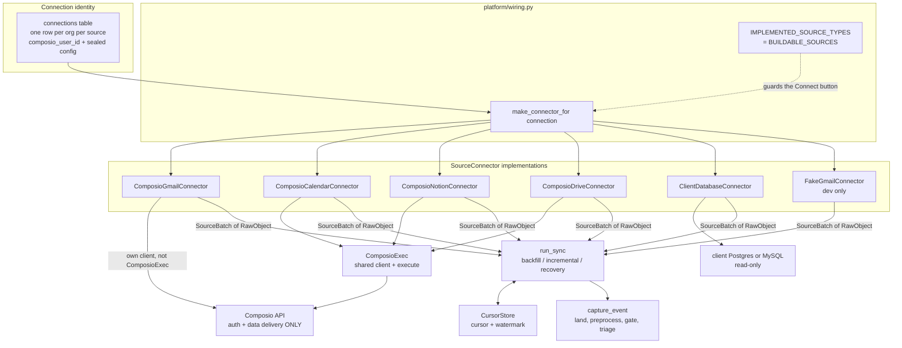
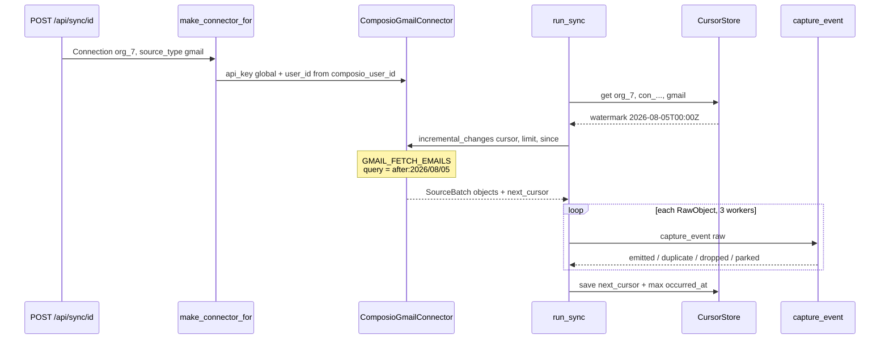

# Knowledge Connectors — Overview

*Layer 1 · Knowledge Layer · sub-layer 2 — `genios_engine/capture/connectors/`, `capture/connections/`, `capture/acquire/`, `platform/wiring.py`*

> How does one startup's Gmail account become a stream of `RawObject`s — and who, downstream, is allowed to know that it was Composio that fetched them?

| | |
|---|---|
| **Packages** | [connectors/](../../../genios_engine/capture/connectors/) · [connections/store.py](../../../genios_engine/capture/connections/store.py) · [acquire/](../../../genios_engine/capture/acquire/) · [platform/wiring.py](../../../genios_engine/platform/wiring.py) |
| **Lines** | 797 across the eight modules in `connectors/` + 135 (connection store) + 221 (cursor store + sync runner) + 233 (wiring) |
| **Owns** | connect · authenticate · remember position · pull |
| **Emits** | `RawObject` inside a `SourceBatch` — *nothing else* |
| **Consumes** | one `Connection` row (per org, per source) |
| **Contract file** | [connectors/base.py](../../../genios_engine/capture/connectors/base.py) — 51 lines, and the whole boundary |
| **Connector classes shipped** | 5 real (`ComposioGmailConnector`, `ComposioCalendarConnector`, `ComposioNotionConnector`, `ComposioDriveConnector`, `ClientDatabaseConnector`) + 1 fake |
| **Accepted `source_type` strings** | 11 (see §4) |
| **Sources *described* in the registry** | 33 |
| **LLM calls** | zero — and the connectors are the layer's outermost edge, so this is where that property is easiest to break |

---

## 1 · What this sub-layer owns

Four verbs, and deliberately no fifth:

| Verb | Where it lives | What it is |
|---|---|---|
| **Connect** | `make_connector_for` in [wiring.py](../../../genios_engine/platform/wiring.py) | build the right client object for one org's one source |
| **Authenticate** | `Connection.composio_user_id` + the global `GENIOS_COMPOSIO_API_KEY` | per-org identity from the DB, never from `.env` |
| **Remember position** | `CursorStore` in [acquire/cursor_store.py](../../../genios_engine/capture/acquire/cursor_store.py) | `cursor` (provider page token) + `watermark` (latest `occurred_at`) |
| **Pull** | `run_sync` in [acquire/sync_runner.py](../../../genios_engine/capture/acquire/sync_runner.py) | drain pages, hand each object to `capture_event` |

The fifth verb a connector must not have is *decide*. It does not judge relevance, does not resolve identity, does not write to the graph. Those belong to the ESQE gate ([capture/gate/](../../../genios_engine/capture/gate/)) and to Layer 2.

---

## 2 · The governing strategy — Composio sits behind our interface

This is stated in the code itself, twice, in the two places that would be tempting to shortcut. From [base.py](../../../genios_engine/capture/connectors/base.py):

> One interface, every source implements. Composio sits BEHIND this (auth +
> data delivery only); a native adapter can replace any one connector without
> changing landing/gate/graph. Our contract stays ours.

and from [composio_base.py](../../../genios_engine/capture/connectors/composio_base.py):

> Shared Composio client + execute for every source connector. Composio sits
> BEHIND our SourceConnector interface (auth + data delivery only).

**Composio is a read primitive. It is not the architecture.** What that buys, concretely:

- The acquisition loop is ours. `run_sync` decides backfill vs incremental vs recovery, how many pages to drain, how many objects to capture in parallel, what happens to a poison object. Composio has no opinion on any of it.
- The envelope is ours. Every connector produces `RawObject`, which [landing/normalize.py](../../../genios_engine/capture/landing/normalize.py) turns into the immutable `SourceEvent`. A Composio response shape never travels past the connector module that parsed it.
- The dedup key is ours (`compute_dedup_key` in [contracts/source_event.py](../../../genios_engine/contracts/source_event.py)), so *what counts as the same object* is a GeniOS decision, not a provider's.
- The gate and the graph never see a provider name they did not ask for.

The price is honest too: for the four Composio-brokered sources, the field paths inside `_to_raw` are Composio's response shape, and the code says so —

> NOTE: the Gmail response field paths below are defensive and may need a small tweak
> against the real payload on the first live run (the "spike"). Only this mapping
> changes — nothing downstream.

That last clause is the whole point of the boundary.

---

## 3 · The connector plane

The two things worth reading twice in that picture:

1. **`ComposioGmailConnector` does not use `ComposioExec`.** It carries its own `_client_()` and `_execute()` because it needs the full response envelope rather than the `data` dict that `ComposioExec.execute` unwraps. The shared client is used by calendar, Notion and Drive only. See [01 · The Connector Contract](01-The-Connector-Contract.md) §6.
2. **`ClientDatabaseConnector` never touches Composio at all** and is dispatched *before* the Composio-availability check, which is why a client database works in a dev environment that has no Composio key. See [03 · The Connector Factory](03-The-Connector-Factory.md) §2.

---

## 4 · The honest count

The registry in [source_registry.py](../../../genios_engine/capture/source_registry.py) describes **33 sources**. Exactly **seven descriptors** carry `buildable=True`, which expand — with aliases — into **eleven accepted `source_type` strings**:

| Descriptor | Aliases | Family | Capability | Connector class | Route |
|---|---|---|---|---|---|
| `gmail` | — | `communication` | `communication` | `ComposioGmailConnector` | unstructured (+ attachments as documents) |
| `gcal` | `calendar`, `google_calendar` | `communication` | `calendar` | `ComposioCalendarConnector` | structured — `gcal.event.v1` |
| `notion` | — | `knowledge` | `document_store` | `ComposioNotionConnector` | unstructured |
| `gdrive` | `drive`, `google_drive` | `knowledge` | `document_store` | `ComposioDriveConnector` | document → text, then unstructured |
| `postgres` | — | `enterprise_system` | `product_usage` | `ClientDatabaseConnector` | structured — tenant-defined mapping |
| `database` | — | `enterprise_system` | — | `ClientDatabaseConnector` | structured |
| `mysql` | — | `enterprise_system` | — | `ClientDatabaseConnector` | structured |

**Four provider connectors plus the client's own database. That is the entire buildable surface today.** Everything else in the registry — Slack, HubSpot, Salesforce, Stripe, Jira, Zendesk, Outlook, Confluence, Linear and the rest — is *described* (family, capability, sometimes a structured mapping) but has no connector, and the API refuses to start an OAuth flow for it.

The registry docstring is blunt about what that costs:

> `hubspot` advertises the `crm` capability that the `sales` pack REQUIRES, while no
> connector can be built for it — so `sales` can never be coverage_ready, and nothing
> in the codebase could say so.

`tests/test_source_registry.py` now makes that failure loud rather than silent: `KNOWN_UNSATISFIABLE_CAPABILITIES = frozenset({"crm", "support_desk", "finance"})` is a ratchet — closing one of those gaps without deleting its line fails the test, and adding a new one fails too.

---

## 5 · One pull, end to end

A single incremental sync for `org_7`'s Gmail, with nothing invented:

The overlap at the boundary is deliberate. From the connector:

> Resume from the stored watermark (date-granular → a natural overlap that the
> dedup ledger de-dups) so nothing at the boundary is missed.

and from `run_sync`:

> No-miss: resume from the stored watermark (incremental only). The dedup ledger
> drops the boundary overlap, so nothing is missed and nothing double-processed.

---

## 6 · The documents in this folder

| # | Document | Answers |
|---|---|---|
| **00** | **Overview** *(this page)* | What the sub-layer owns, the Composio-behind-the-interface strategy, and how much of the world is actually reachable |
| 01 | [The Connector Contract](01-The-Connector-Contract.md) | The four methods, `RawObject` field by field, `content_version` and dedup, cursor semantics, and how to write a new connector |
| 02 | [Connections and Secrets](02-Connections-and-Secrets.md) | Per-org identity in the DB, the `connections` table, and the `enc:` sealing of `db_url` / tokens / passwords |
| 03 | [The Connector Factory](03-The-Connector-Factory.md) | `make_connector_for` branch by branch, why the dispatch table is exported as data, and what a `Connect` button is allowed to promise |
| 04 | [The Gmail Connector](04-Gmail-Connector.md) | MIME walking, full-message fetch, attachments as their own document events |
| 05 | [The Calendar and Drive Connectors](05-Calendar-and-Drive-Connectors.md) | Structured events vs downloaded documents — and why only one of the two carries a `content_version` |
| 06 | [The Notion and Client-Database Connectors](06-Notion-and-Database-Connectors.md) | An API we do not control, and a SQL connection into a customer's production database |
| 07 | [Acquisition and Sync](07-Acquisition-and-Sync.md) | `run_sync`, cursors, watermarks, poison isolation — the loop that owns the connector |
| 08 | [The Fake Connector](08-The-Fake-Connector.md) | Forty-seven lines that let the whole spine run with no credentials |

---

## 7 · Gaps — what this sub-layer does not do

| Gap | Where | Consequence |
|---|---|---|
| **Notion and Drive set no `content_version`** | [notion.py](../../../genios_engine/capture/connectors/notion.py), [drive.py](../../../genios_engine/capture/connectors/drive.py) `_to_raw` | An **edited** page or file re-lands with an identical `dedup_key` and is dropped as a duplicate. Only the first version of any Notion page or Drive file ever reaches the graph. `gcal` and the client DB do set it; Gmail correctly does not need it. |
| **`ComposioDriveConnector.incremental_changes` ignores `since`** | [drive.py](../../../genios_engine/capture/connectors/drive.py) | Every sweep re-lists from the top *and* calls `GOOGLEDRIVE_DOWNLOAD_FILE` per file before the dedup check, so the whole Drive is re-downloaded each cycle for objects that will be discarded. Notion fixed exactly this bug in `_to_batch`; Drive has not. |
| **No webhook/push path** | — | Everything is pull. `live_event` is a declared family with no connector behind it; freshness is bounded by `sync_interval_hours` (default 6.0). |
| **No write-back** | all connectors | Every method is a read. Nothing in this sub-layer can send an email, move a deal, or create an event. |
| **No retry/backoff inside a connector** | all connectors | Resilience lives one level up: `_capture_bounded` retries the *capture*, not the fetch. A provider 500 loses the page. |
| **`ownership_type`, `external_account_id`, `granted_scopes`, `encrypted_secret_ref`, `expires_at`** | [0002_l1_tables.sql](../../../migrations/0002_l1_tables.sql) vs [connections/store.py](../../../genios_engine/capture/connections/store.py) | Five columns exist in the table and are never written by `PostgresConnectionStore`. See [02 · Connections and Secrets](02-Connections-and-Secrets.md) §2. |

---

## 8 · Map

**Source files**

| File | Lines | Role |
|---|---|---|
| [connectors/base.py](../../../genios_engine/capture/connectors/base.py) | 51 | `RawObject`, `SourceBatch`, `SourceConnector` |
| [connectors/composio_base.py](../../../genios_engine/capture/connectors/composio_base.py) | 27 | `ComposioExec` |
| [connectors/composio.py](../../../genios_engine/capture/connectors/composio.py) | 328 | Gmail — the largest connector, because of MIME walking + attachments |
| [connectors/calendar.py](../../../genios_engine/capture/connectors/calendar.py) | 87 | Google Calendar |
| [connectors/notion.py](../../../genios_engine/capture/connectors/notion.py) | 86 | Notion |
| [connectors/drive.py](../../../genios_engine/capture/connectors/drive.py) | 90 | Google Drive |
| [connectors/database.py](../../../genios_engine/capture/connectors/database.py) | 81 | the client's own Postgres/MySQL |
| [connectors/fake.py](../../../genios_engine/capture/connectors/fake.py) | 47 | deterministic dev fake |
| [contracts/connection.py](../../../genios_engine/contracts/connection.py) | 25 | the `Connection` model |
| [connections/store.py](../../../genios_engine/capture/connections/store.py) | 135 | store protocol + secret sealing |
| [acquire/cursor_store.py](../../../genios_engine/capture/acquire/cursor_store.py) | 70 | `Cursor` = provider token + watermark |
| [acquire/sync_runner.py](../../../genios_engine/capture/acquire/sync_runner.py) | 151 | `run_sync` — the acquisition loop |
| [platform/wiring.py](../../../genios_engine/platform/wiring.py) | 233 | `make_connector_for` and every other `make_*` |
| [source_registry.py](../../../genios_engine/capture/source_registry.py) | 186 | one descriptor per source; `BUILDABLE_SOURCES` |

**Tables** — `connections`, `sync_cursors` ([0001_initial.sql](../../../migrations/0001_initial.sql)), `l1_sync_runs` ([0027_l1_seam.sql](../../../migrations/0027_l1_seam.sql))

**Endpoints** — `POST /api/connections`, `GET /api/connections`, `POST /api/connections/{connection_id}/{action}`, `POST /api/connect/initiate`, `GET /api/auth/{tool}/connect`, `POST /api/integrations/{tool}/disconnect` — all in [api/routes.py](../../../genios_engine/api/routes.py)

**Tests** — [tests/test_connections.py](../../../tests/test_connections.py) (30 orgs, 30 rows; paused excluded), [tests/test_source_registry.py](../../../tests/test_source_registry.py) (`test_buildable_matches_the_connector_dispatch`)

**Scripts** — [scripts/gmail_l1.py](../../../scripts/gmail_l1.py), [scripts/restore_reingest.py](../../../scripts/restore_reingest.py)

---

*Up: [Layer 1 Overview](../00-Overview.md) · Next: [The Connector Contract](01-The-Connector-Contract.md)*
