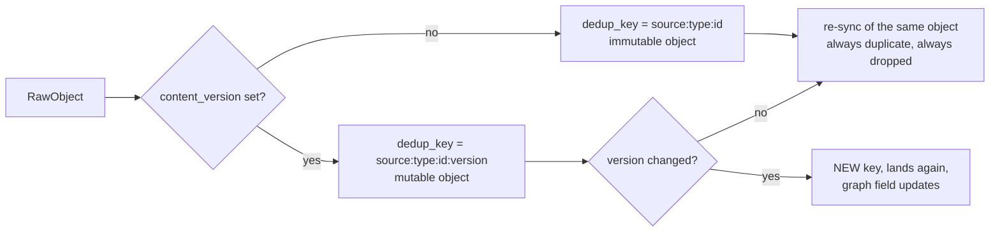

# The Connector Contract

*Layer 1 · Knowledge Layer · sub-layer 2 — `genios_engine/capture/connectors/base.py` and `composio_base.py`*

> What must a piece of code do to be allowed to feed the engine — and what is it forbidden from doing once it is?

| | |
|---|---|
| **Files** | [base.py](../../../genios_engine/capture/connectors/base.py) · 51 lines · [composio_base.py](../../../genios_engine/capture/connectors/composio_base.py) · 27 lines |
| **Defines** | `RawObject`, `SourceBatch`, `SourceConnector` (a `@runtime_checkable` `Protocol`) |
| **Methods on the protocol** | 4 — `validate_connection`, `initial_snapshot`, `incremental_changes`, `fetch_content` |
| **Class attribute required** | `source: str` |
| **Emits into** | `to_source_event` in [landing/normalize.py](../../../genios_engine/capture/landing/normalize.py) |
| **Implementations** | 5 real + 1 fake |
| **Inheritance** | none — the protocol is structural; no connector subclasses anything |

---

## 1 · The protocol, in full

That is the entire boundary. Fifty-one lines, one of which is the docstring that explains why it exists.

```python
@runtime_checkable
class SourceConnector(Protocol):
    """One interface, every source implements. Composio sits BEHIND this (auth +
    data delivery only); a native adapter can replace any one connector without
    changing landing/gate/graph. Our contract stays ours."""

    source: str

    def validate_connection(self) -> bool: ...
    def initial_snapshot(self, cursor: str | None, limit: int) -> SourceBatch: ...
    def incremental_changes(self, cursor: str | None, limit: int,
                            since: Optional[datetime] = None) -> SourceBatch: ...
    def fetch_content(self, object_ref: str) -> dict[str, Any]: ...
```

**It is a `Protocol`, not a base class, and that is load-bearing.** No connector in the tree inherits from anything — `ComposioGmailConnector`, `ClientDatabaseConnector` and `FakeGmailConnector` are all plain classes that happen to have the right shape. A native Gmail adapter written from scratch, with no import from `capture/` at all, would satisfy the contract by construction. `@runtime_checkable` means `isinstance(x, SourceConnector)` works for the method names at runtime (though not their signatures).

### The four promises

| Method | Promise | Used by |
|---|---|---|
| `validate_connection() -> bool` | *this credential can read this source right now.* Every implementation performs a real single-item read and returns `True`; failure surfaces as the provider's exception, not `False`. | [scripts/restore_reingest.py](../../../scripts/restore_reingest.py) — `ok = make_connector_for(c).validate_connection()` |
| `initial_snapshot(cursor, limit) -> SourceBatch` | *the first-ever pull for a fresh connection.* Bounded by the connector's own backfill window, not by `since`. | `run_sync(..., mode="backfill")` |
| `incremental_changes(cursor, limit, since) -> SourceBatch` | *everything that happened after `since`.* `since` is the stored watermark. `None` means there is no watermark yet, and each connector chooses its own first-run window. | `run_sync` in every other mode |
| `fetch_content(object_ref) -> dict` | *the full body of one object by id.* A point read, not a listing. | `ComposioGmailConnector._full_message` internally; no external caller today |

`fetch_content` is the one method with no production caller outside the Gmail connector's own internals. It is the recovery/replay hook, and it is honest to say it is currently unexercised for calendar, Notion, Drive and the client DB.

---

## 2 · `RawObject`, field by field

```python
@dataclass
class RawObject:
    """A raw object returned by a source (via Composio or native), pre-normalization.
    Connectors differ only in how they produce this; downstream is source-agnostic."""
```

| Field | Type | Default | What it is |
|---|---|---|---|
| `source` | `str` | required | the registry id — `gmail`, `gcal`, `notion`, `gdrive`, or for the client DB whatever `source_type` the connection carried (`postgres` / `database` / `mysql`) |
| `object_type` | `str` | required | `email_message`, `email_attachment`, `calendar_event`, `page`, `file`, or — for the client DB — **the table name itself**, e.g. `public.customer_accounts` |
| `source_object_id` | `str` | required | the provider's id. Gmail attachments synthesise `f"{mid}::{attachment_id or filename or i}"` |
| `occurred_at` | `datetime` | required | **world time**, never capture time. `SourceEvent` keeps `captured_at` separately and the two are never merged |
| `actor_email` | `str \| None` | `None` | sender / organiser / last editor. Feeds `Actor.email` and the sender-known whitelist |
| `actor_type` | `str` | `"external_contact"` | one of `internal_user`, `external_contact`, `agent`, `system`, `human` |
| `parent_object_id` | `str \| None` | `None` | Gmail thread id; for an attachment, its parent message id. Becomes a `thread` linkage hint in `_linkage_hints` |
| `content_version` | `str \| None` | `None` | **see §3** |
| `internal_kind` | `str \| None` | `None` | **see §4** |
| `raw` | `dict[str, Any]` | `{}` | the payload. Conventional keys the pipeline reads: `subject`, `body`, `snippet`, `mime`, `has_attachment`, `document`, `to`, `cc` |

`raw` is not schema'd, and that is deliberate — for a structured source it is the row/event as it arrived, and `apply_mapping` reads it through a `StructuredMapping`; for an unstructured source `capture_event` reads `raw["body"] or raw["snippet"]` and `raw["subject"]`.

### One provider object is not one `RawObject`

`ComposioGmailConnector._to_objects` returns a **list**: the email, plus one `email_attachment` per extractable file.

> each attachment → its own DOCUMENT event (mirrors the Drive connector): download bytes,
> extract text natively/OCR, gate + L2 it.

So the batch is a flat list of `RawObject`, and the fan-out from provider object to envelope is the connector's business, not the loop's.

---

## 3 · `content_version` — the field that unfroze `deal.stage`

The comment on the field is the clearest statement of the problem in the package:

> For MUTABLE structured objects (CRM deal, calendar event, DB row) a connector sets a
> content version (updatedAt / etag / watermark). It folds into dedup_key so a CHANGED
> object re-lands and updates the graph. Email/message leave it None → stable dedup (an
> email never edits). **Without this, deal.stage froze at its first-seen value forever.**

The mechanism is four lines in [contracts/source_event.py](../../../genios_engine/contracts/source_event.py):

```python
def compute_dedup_key(source: str, object_type: str, source_object_id: str,
                      content_version: str | None = None) -> str:
    base = f"{source}:{object_type}:{source_object_id}"
    return f"{base}:{content_version}" if content_version else base
```

`source_events` carries `create unique index source_events_dedup on source_events (org_id, dedup_key)`, and `land_raw_object` checks `repo.exists(org_id, event.dedup_key)` before anything else. So:



Who sets what, in the shipped code:

| Connector | `content_version` source | Effect |
|---|---|---|
| `ComposioCalendarConnector` | `str(ev["updated"])` | *"a reschedule re-lands and updates meeting.start_at instead of being deduped away"* |
| `ClientDatabaseConnector` | `str(row[watermark_col])` | *"a CRM deal that moves proposal→won gets a new updated_at → re-lands → deal.stage updates"* |
| `ComposioGmailConnector` | **not set** — correct | an email never edits |
| `ComposioNotionConnector` | **not set** — a gap | `last_edited_time` is read into `occurred_at` only |
| `ComposioDriveConnector` | **not set** — a gap | `modifiedTime` is read into `occurred_at` only |

**A Notion page or a Drive file that is edited after first capture never updates the graph.** Its `dedup_key` is unchanged, so `land_raw_object` records `reason_code="duplicate"` and the pipeline terminates there. The one-line fix is symmetric with calendar — pass `content_version=str(page["last_edited_time"])` and `str(f["modifiedTime"])` respectively — but it is not in the code today.

---

## 4 · `internal_kind` — why authority is a connector-visible field

> Set ONLY when the company is deliberately asserting something about itself (a
> written policy, an upload tagged `pricing`). One of internal_knowledge.INTERNAL_KINDS.
> It promotes the event's family to `internal` and its facts to authority rank 4 —
> so company canon outranks a third-party system of record. None for observed traffic.

It sits on `RawObject` — rather than being inferred later — because provenance is the one thing only the acquisition edge knows. `to_source_event` acts on it immediately:

```python
kind = normalize_kind(raw.internal_kind)
return SourceEvent(
    ...
    source_family="internal" if kind else family_of(raw.source),
    internal_kind=kind,
```

with the reasoning in the same file:

> A declared internal_kind PROMOTES the family to `internal`. Family answers "what
> kind of reality is this", and a policy the company wrote is its own record no
> matter which door it came through — classifying an uploaded pricing sheet as
> `knowledge` would file it beside a customer's shared doc, which is the exact
> conflation this step exists to end.

**No shipped connector sets `internal_kind`.** It is populated by the deliberate-intake doors — `POST /api/org/{org}/knowledge` and a tagged upload — which build a `RawObject` by hand and run it through the same `capture_event`. `normalize_kind` returns `None` for anything it does not recognise, so a typo silently loses rank 4 rather than fabricating it: *"Guessing here would hand rank 4 to a typo."*

---

## 5 · `SourceBatch` and cursor semantics

```python
@dataclass
class SourceBatch:
    objects: list[RawObject]
    next_cursor: str | None = None
```

`next_cursor` is **the provider's opaque page token, verbatim** — `nextPageToken` for Gmail/Calendar/Drive, `next_cursor` for Notion, and always `None` for the client DB (which paginates by watermark instead). GeniOS never parses it.

Position is actually two values, held in `Cursor` ([acquire/cursor_store.py](../../../genios_engine/capture/acquire/cursor_store.py)):

```python
@dataclass
class Cursor:
    cursor: str | None = None            # provider pagination token
    watermark: datetime | None = None    # latest occurred_at seen — resume point
    last_object_id: str | None = None
```

> Per-connection sync position. Combined with a small overlap + the dedup ledger,
> this is the no-miss backbone: next run resumes from the watermark, re-scans the
> boundary, and duplicates are dropped by dedup — nothing slips through the gap.

Three rules the loop enforces on the connector's behalf, in `run_sync`:

1. **The watermark is `max(occurred_at)` over the objects captured**, not the wall clock — `if watermark is None or raw.occurred_at > watermark`. Order-independent, so the concurrent capture pool cannot corrupt it.
2. **Draining stops on `if not page_cursor or not batch.objects`**, bounded by `max_pages` (the API passes `max_pages=20`).
3. **`mode="recovery"` never writes the cursor** — `if cursor_store is not None and mode != "recovery"`. A recovery re-scan of the last `reconcile_days` (default 7) must not regress the primary position.

A connector therefore does not need to be idempotent, ordered, or exactly-once. It needs to be *complete over the window it was asked for*.

---

## 6 · `ComposioExec` — the shared client

```python
class ComposioExec:
    """Shared Composio client + execute for every source connector. Composio sits
    BEHIND our SourceConnector interface (auth + data delivery only). Returns the
    `data` dict of the tool response. Version check skipped for the trial (TODO: pin)."""

    def execute(self, slug: str, arguments: dict[str, Any]) -> dict:
        res = self._c().tools.execute(slug, arguments, user_id=self._user_id,
                                      dangerously_skip_version_check=True)
        if isinstance(res, dict):
            return res.get("data", {}) if isinstance(res.get("data"), dict) else res
        return {}
```

Three properties worth naming:

- **The import is lazy** — `from composio import Composio` happens inside `_c()`, *"lazy: only on real runs"*. The test suite and any in-memory dev run never import the SDK.
- **It unwraps `data`** and returns `{}` for a non-dict response, so a connector's `_to_batch` can assume a dict.
- **`dangerously_skip_version_check=True`** with an explicit TODO to pin toolkit versions in production. It is duplicated verbatim in the Gmail connector's own `_execute`, with a matching comment: *"Composio 0.18 requires an explicit toolkit version for manual execution. Trial: skip (uses latest). TODO(prod): pin toolkit_versions={"gmail": "<ver>"}."*

**Gmail does not use `ComposioExec`.** `ComposioGmailConnector` reimplements `_client_()` and `_execute()` because it wants the *envelope*, not the unwrapped `data` — it does its own `r.get("data", r)` in `_full_message` and `_attachment_bytes`. That is a real duplication of ~12 lines and one more place where the version-pin TODO must be applied.

---

## 7 · Which methods are meaningfully implemented

Every implementation defines all four. That is not the same as all four doing work.

| Connector | `validate_connection` | `initial_snapshot` | `incremental_changes` | `fetch_content` |
|---|---|---|---|---|
| `ComposioGmailConnector` | real — `_fetch(max_results=1)` | `query="newer_than:30d"`, `page_token=cursor` | **honours `since`** → `after:%Y/%m/%d`; falls back to the 30-day window | real — `GMAIL_FETCH_MESSAGE_BY_MESSAGE_ID`, and used internally on nearly every message |
| `ComposioCalendarConnector` | real — `_fetch(max_results=1, since=None)` | `timeMin = now − 365d` | **honours `since`** → `timeMin` | real — `GOOGLECALENDAR_EVENTS_GET` |
| `ComposioNotionConnector` | real — `_search(limit=1)` | `NOTION_SEARCH_NOTION_PAGE` | **honours `since`** — but *client-side*, filtering `last_edited_time` in `_to_batch` before content fetch | real — returns `{"body": markdown}` |
| `ComposioDriveConnector` | real — `_list(limit=1)` | `GOOGLEDRIVE_LIST_FILES`, `q="trashed = false and mimeType != folder"` | **ignores `since`** — identical to `initial_snapshot` | real — `GOOGLEDRIVE_DOWNLOAD_FILE` |
| `ClientDatabaseConnector` | real — `select 1 from <table> limit 1` | `since=None` → whole table, ordered by watermark | **honours `since`** → `where <wm> > :since` | real — `select * where <id> = :id limit 1` |
| `FakeGmailConnector` | `return True` | one hard-coded message | the same message | one hard-coded body |

The Notion filter is worth quoting because it names the bug it fixed:

> honour the watermark BEFORE fetching content: _to_raw pulls each page's
> full markdown, so filtering here is what stops every 6-hourly sweep from
> re-downloading the whole workspace (`since` was previously ignored).
> Metadata-only compare; dedup_key/content_version are untouched.

**Drive still has the bug Notion fixed.** `_to_raw` calls `GOOGLEDRIVE_DOWNLOAD_FILE` for every listed file, and `since` never reaches `_list`, so a six-hourly sweep re-downloads and re-extracts the entire Drive to produce objects that `land_raw_object` will drop as duplicates.

---

## 8 · What a connector may do, and what it must never do

**May**

- talk to its provider, paginate, and decode provider-specific encodings — Gmail's `_b64url` is *"Tolerant of missing padding and of a standard-base64 fallback; never raises — returns b'' on anything unparseable"*
- walk a MIME tree, pick the best body part, synthesise ids for sub-objects
- decide its own first-run window (30 days for Gmail, 365 for calendar) and say why
- extract document text — Gmail and Drive both call `process_document(mime=..., data=..., filename=..., ocr=...)` from [documents/native.py](../../../genios_engine/capture/documents/native.py) and put the result in `raw["body"]` plus a `raw["document"]` provenance block
- skip work before an expensive call. Gmail's `_EXTRACTABLE_ATTACHMENT_MIMES` gate exists for exactly this: *"That call, not any LLM, is what made L1 slow: one round-trip per attachment, mostly for invite.ics that gets dropped anyway."*
- swallow its own errors defensively, per object — `_full_message` and `_attachment_bytes` both return empty on any exception, *"never let one message abort the batch"*

**Must never**

| Prohibition | Why | Enforced by |
|---|---|---|
| call an LLM | Layer 1 makes zero model calls; the gate is deterministic | convention + absence of any client in `capture/` |
| write to the provider | there is no write method on the protocol, in either direction | the contract |
| decide relevance, lane, or route | that is `run_gate` / `triage_lane`, downstream of the envelope | pipeline ordering |
| write to `source_events`, `raw_payloads`, or the graph | the connector returns data; `capture_event` persists | `run_sync` owns every store |
| read a secret from `.env` | per-org identity is a DB row; only the *global* Composio key is env | `Connection.composio_user_id` |
| build its own dedup key | `compute_dedup_key` is the single definition of object identity | `to_source_event` |
| interpolate untrusted text into SQL | `ClientDatabaseConnector` validates every identifier against `_IDENT` first | `_safe_ident` |

That last one is the sharpest, since the client DB connector is the only one that builds SQL:

> Table/column names are interpolated into SQL, so they are STRICTLY validated as
> identifiers (defense against a hostile /connections config being used for SQL injection).

```python
_IDENT = re.compile(r"^[A-Za-z_][A-Za-z0-9_]*(\.[A-Za-z_][A-Za-z0-9_]*)?$")

def _safe_ident(name: str, what: str) -> str:
    if not isinstance(name, str) or not _IDENT.match(name):
        raise ValueError(f"unsafe {what} identifier: {name!r}")
    return name
```

Values are always bound (`:since`, `:lim`, `:id`); only `table`, `identity_field` and `watermark_col` are interpolated, and all three pass `_safe_ident` in `__init__`.

---

## 9 · Worked example — one Gmail message with a PDF

Input: a Composio `GMAIL_FETCH_EMAILS` row for message `18c4a9e2f7ab`, from `priya@acme.com`, subject *Revised contract*, with `contract.pdf` attached.

1. `_to_objects` finds `mid = "18c4a9e2f7ab"`.
2. The list row carries no `payload.parts`, so `need_full` is `True` → `GMAIL_FETCH_MESSAGE_BY_MESSAGE_ID`. The reason is spelled out in the code:

   > A flat body string of ANY length may be Gmail's clipped preview — and for deep extraction a
   > signal (competitor, pricing, legal, budget) can sit anywhere in the body, so we never feed the
   > LLM a possibly-truncated body. […] (Was: only fetched full when body < 400 chars → a 500-char
   > clip of a 2,000-char email slipped through truncated → the LLM missed everything past the clip.)

3. `_walk` collects `("text/plain", b"...")` and one attachment part `{"filename": "contract.pdf", "mime": "application/pdf", "attachmentId": "ANGjdJ..."}`.
4. `_extract_emails` pulls all `To`/`Cc` addresses, order-preserving-deduped, *"so L2 can build one edge per recipient"*.
5. Object 1:

```python
RawObject(source="gmail", object_type="email_message",
          source_object_id="18c4a9e2f7ab",
          occurred_at=datetime(2026, 7, 28, 9, 14, 22, tzinfo=timezone.utc),
          actor_email="priya@acme.com", actor_type="external_contact",
          parent_object_id="thread_18c4a",
          raw={"subject": "Revised contract", "body": "<full text>",
               "snippet": "...", "labelIds": ["INBOX"],
               "to": ["rohit@genios.ai"], "cc": [],
               "has_attachment": True})
```

6. `application/pdf` is in `_EXTRACTABLE_ATTACHMENT_MIMES` → download → `process_document` → object 2, `object_type="email_attachment"`, `source_object_id="18c4a9e2f7ab::ANGjdJ..."`, `parent_object_id="18c4a9e2f7ab"` (*"links the file back to its email"*), with a `raw["document"]` block carrying `native_parse_used`, `ocr_used`, `ocr_engine`, `ocr_pages`, `avg_confidence`, `status`.
7. Both are returned in one `SourceBatch`. `to_source_event` gives them dedup keys `gmail:email_message:18c4a9e2f7ab` and `gmail:email_attachment:18c4a9e2f7ab::ANGjdJ...` — no `content_version`, so both are permanently immutable.

Note `has_attachment` on the *email*: it *"keeps attachment-only emails out of the N-10 drop"* — a connector-set flag whose only consumer is a gate rule.

---

## 10 · Template for a new connector

The conventions every shipped implementation follows, in the order they follow them:

```python
from __future__ import annotations

from datetime import datetime, timezone
from typing import Any

from .base import RawObject, SourceBatch
from .composio_base import ComposioExec


class ComposioLinearConnector:                 # no base class — the Protocol is structural
    source = "linear"                          # MUST match the source_registry descriptor id

    def __init__(self, *, api_key: str, user_id: str) -> None:
        self._x = ComposioExec(api_key=api_key, user_id=user_id)

    # ── provider I/O, one private method per tool slug ───────────────────────
    def _list(self, *, limit: int, since: datetime | None, page_token: str | None) -> dict:
        args: dict[str, Any] = {"first": limit}
        if since is not None:
            args["updatedAfter"] = since.astimezone(timezone.utc).isoformat()
        if page_token:
            args["after"] = page_token
        return self._x.execute("LINEAR_LIST_ISSUES", args)

    # ── mapping: provider shape → OUR envelope. Defensive on every field ─────
    def _to_raw(self, issue: dict) -> RawObject | None:
        iid = issue.get("id")
        if not iid:
            return None                        # never raise on one bad object
        return RawObject(
            source="linear", object_type="issue", source_object_id=str(iid),
            occurred_at=_parse_ts(issue.get("createdAt")),
            actor_email=((issue.get("creator") or {}).get("email")),
            actor_type="internal_user",
            # MUTABLE object → set a content_version or the graph freezes at v1
            content_version=str(issue.get("updatedAt")) if issue.get("updatedAt") else None,
            raw={"subject": issue.get("title"), "body": issue.get("description"),
                 "state": (issue.get("state") or {}).get("name")},
        )

    def _to_batch(self, data: dict) -> SourceBatch:
        items = data.get("nodes") or []
        objs = [self._to_raw(i) for i in items if isinstance(i, dict)]
        page = data.get("pageInfo") or {}
        return SourceBatch(objects=[o for o in objs if o],
                           next_cursor=page.get("endCursor") if page.get("hasNextPage") else None)

    # ── the four contract methods, thin ──────────────────────────────────────
    def validate_connection(self) -> bool:
        self._list(limit=1, since=None, page_token=None)
        return True

    def initial_snapshot(self, cursor: str | None = None, limit: int = 50) -> SourceBatch:
        return self._to_batch(self._list(limit=limit, since=None, page_token=cursor))

    def incremental_changes(self, cursor: str | None = None, limit: int = 50,
                            since: datetime | None = None) -> SourceBatch:
        return self._to_batch(self._list(limit=limit, since=since, page_token=cursor))

    def fetch_content(self, object_ref: str) -> dict[str, Any]:
        return self._x.execute("LINEAR_GET_ISSUE", {"issueId": object_ref})
```

Writing the class is roughly half the work. The rest is registration, and the test suite checks it:

1. **Add or flip the descriptor** in [source_registry.py](../../../genios_engine/capture/source_registry.py) — `SourceDescriptor("linear", "operational", buildable=True, object_types=("issue",))`. `__post_init__` rejects an unknown family; `_index()` rejects a colliding alias.
2. **Add the branch** to `make_connector_for` *and* the id to `COMPOSIO_SOURCE_TYPES` (or `DIRECT_SOURCE_TYPES`) in [wiring.py](../../../genios_engine/platform/wiring.py). `test_buildable_matches_the_connector_dispatch` asserts `DIRECT_SOURCE_TYPES | COMPOSIO_SOURCE_TYPES == BUILDABLE_SOURCES`.
3. **If the source is structured**, register a `StructuredMapping` in [structured/registry.py](../../../genios_engine/capture/structured/registry.py). `has_mapping(source, object_type)` is what flips `capture_event` onto the no-LLM route, and `test_structured_mapping_object_types_are_declared` requires the `object_type` to be one the descriptor declares.
4. **Add the toolkit slug** to `_TOOLKIT_SLUGS` and `_SLUG_TO_SOURCE` in [api/routes.py](../../../genios_engine/api/routes.py) so connect / status / disconnect all resolve to the same id.

> Adding a connector means flipping `buildable` on its descriptor AND wiring the branch
> in make_connector_for below — tests/test_source_registry.py asserts those two agree.

---

## 11 · Gaps

| Gap | Detail |
|---|---|
| **No `content_version` on Notion or Drive** | edits never re-land — §3 |
| **`ComposioDriveConnector` ignores `since`** | full re-list + full re-download every sweep — §7 |
| **Gmail duplicates `ComposioExec`** | its own `_client_`/`_execute`; two places carry the unpinned-version TODO — §6 |
| **`fetch_content` has no external caller** | four of five implementations are untested against a real recovery path |
| **No signature enforcement** | `@runtime_checkable` checks method *names* only; a connector with the wrong argument order type-checks at runtime |
| **`validate_connection` never returns `False`** | it either returns `True` or raises. Callers that branch on the boolean can only ever see the happy path |
| **No connector-level retry** | `_capture_bounded` retries capture, not fetch. A provider error loses the page and the run advances no watermark for it |

---

## 12 · Map

| Thing | Where |
|---|---|
| `RawObject`, `SourceBatch`, `SourceConnector` | [connectors/base.py](../../../genios_engine/capture/connectors/base.py) |
| `ComposioExec` | [connectors/composio_base.py](../../../genios_engine/capture/connectors/composio_base.py) |
| `compute_dedup_key`, `SourceEvent`, `Actor`, `SyncMode` | [contracts/source_event.py](../../../genios_engine/contracts/source_event.py) |
| `to_source_event` | [landing/normalize.py](../../../genios_engine/capture/landing/normalize.py) |
| `INTERNAL_KINDS`, `normalize_kind`, `authority_rank_for` | [capture/internal_knowledge.py](../../../genios_engine/capture/internal_knowledge.py) |
| `run_sync`, `SyncSummary`, `_capture_bounded` | [acquire/sync_runner.py](../../../genios_engine/capture/acquire/sync_runner.py) |
| `Cursor`, `CursorStore` | [acquire/cursor_store.py](../../../genios_engine/capture/acquire/cursor_store.py) |
| `capture_event`, `land_raw_object` | [capture/pipeline.py](../../../genios_engine/capture/pipeline.py) |
| `StructuredMapping`, `gcal.event.v1`, `postgres.customer_accounts.v1` | [structured/registry.py](../../../genios_engine/capture/structured/registry.py) |
| `source_events` + its unique dedup index | [0001_initial.sql](../../../migrations/0001_initial.sql) |
| dispatch agreement test | [tests/test_source_registry.py](../../../tests/test_source_registry.py) |

---

*Prev: [Overview](00-Overview.md) · Next: [Connections and Secrets](02-Connections-and-Secrets.md)*
