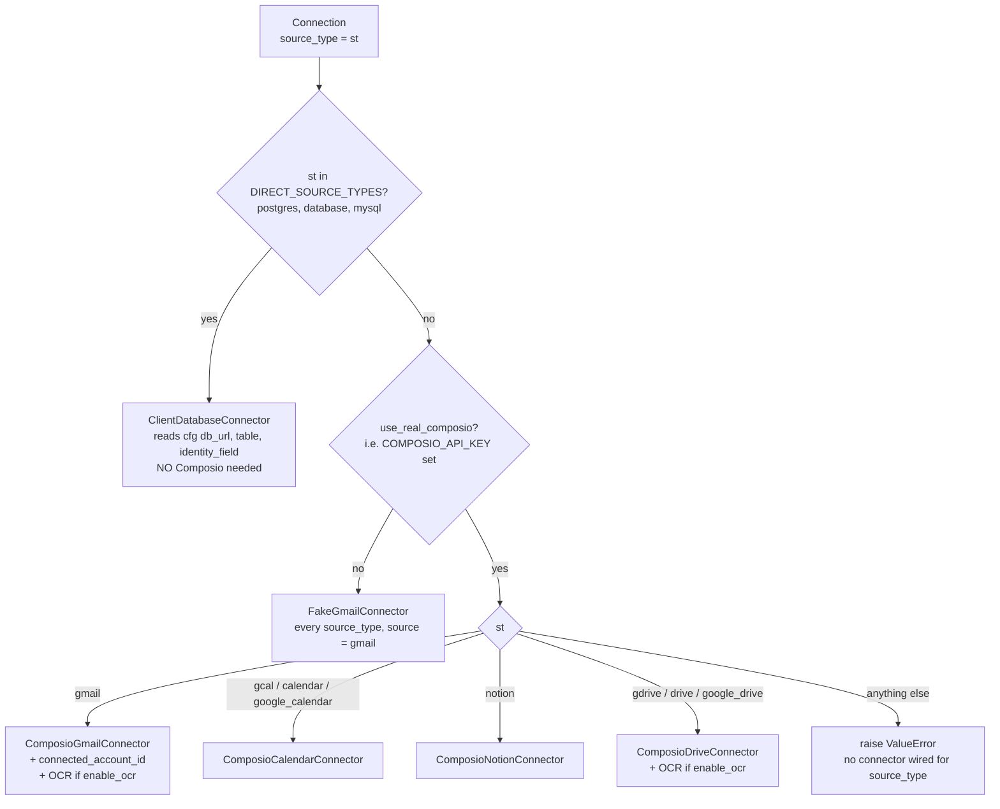
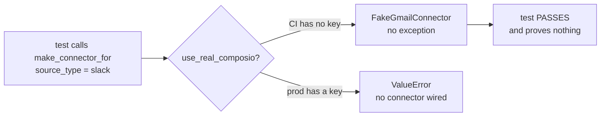

# The Connector Factory

*Layer 1 · Knowledge Layer · sub-layer 2 — `genios_engine/platform/wiring.py`*

> Given one `Connection` row, which object does the engine build — and which "Connect" buttons is the product allowed to show?

| | |
|---|---|
| **File** | [platform/wiring.py](../../../genios_engine/platform/wiring.py) · 233 lines · 17 `make_*` functions + 1 alias |
| **The function** | `make_connector_for(connection) -> SourceConnector` · lines 44–84 |
| **Dispatch key** | `connection.source_type` |
| **Exported as data** | `IMPLEMENTED_SOURCE_TYPES`, `DIRECT_SOURCE_TYPES`, `COMPOSIO_SOURCE_TYPES` |
| **Branches** | 1 direct · 1 dev fallback · 4 Composio · 1 raise |
| **Alias** | `make_gmail_connector_for = make_connector_for` |
| **Callers** | 4 in [api/routes.py](../../../genios_engine/api/routes.py), 2 in `scripts/` |
| **Test** | `test_buildable_matches_the_connector_dispatch` in [tests/test_source_registry.py](../../../tests/test_source_registry.py) |

---

## 1 · What the module is for

The header comment states the whole design of `wiring.py` in three lines:

> The switch between REAL and dev is here, driven entirely by .env — no code change.
>   DATABASE_URL set   → Postgres/Supabase repo   (else in-memory)
>   COMPOSIO keys set  → real Composio Gmail       (else fake connector)

**Every `make_*` in the file is a two-branch function over one settings property**, so that no other module ever writes `if get_settings().use_real_db`. `make_connector_for` is the only one that is more than two branches, because it is the only one dispatching over tenant data rather than deployment config.

---

## 2 · `make_connector_for`, branch by branch

```python
def make_connector_for(connection) -> SourceConnector:
    """Build the right connector for ONE org's connection, dispatched by source_type.
    Composio API key is global (GeniOS's); per-org identity is composio_user_id. Every
    source sits behind the same SourceConnector interface — the pipeline is agnostic."""
    s = get_settings()
    st = connection.source_type
```

Note the parameter is **untyped**. `connection` is duck-typed on `.source_type`, `.config`, `.org_id`, `.connection_id` and `.composio_user_id`, which is what lets `_sync_source` in the API hand it a synthetic `Connection` that was never stored.

### Branch 0 — the client's own database

```python
    # Client's own database — no Composio; read-only pull → structured route.
    if st in DIRECT_SOURCE_TYPES:
        from genios_engine.capture.connectors.database import ClientDatabaseConnector
        cfg = connection.config or {}
        return ClientDatabaseConnector(
            database_url=cfg["db_url"], table=cfg["table"],
            identity_field=cfg["identity_field"],
            watermark_col=cfg.get("watermark_col", "updated_at"), source=st)
```

**This branch is first, and being first is the point.** It sits *above* the `use_real_composio` check, so a client-database connection is built for real in a dev environment that has no Composio key at all. It is the only source you can exercise end-to-end without a broker.

`source=st` is passed through, so a connection registered as `mysql` produces `RawObject.source == "mysql"` — the descriptor id is preserved rather than being flattened to `postgres`. `object_type` becomes the table name, which is why the `postgres` descriptor declares `object_types=()`:

> () means NOT ENUMERATED (tenant-defined, e.g. client DB tables) — never "none".

Three config keys are read with `[]`, not `.get()`. A `postgres` connection whose `config` is missing `db_url` raises `KeyError` here — inside a background task, surfacing as `L1 sync failed for org_id=… connection_id=…` in the log rather than as a validation error at `POST /api/connections`. See §7.

### Branch 1 — the dev fallback

```python
    if not s.use_real_composio:
        from genios_engine.capture.connectors.fake import FakeGmailConnector
        return FakeGmailConnector(org_id=connection.org_id,
                                  connection_id=connection.connection_id)
```

`use_real_composio` is `bool(self.composio_api_key)`. With no key, **every remaining `source_type` returns a fake Gmail connector** — including `notion`, `gdrive` and a `source_type` that is complete nonsense. The fake emits one hard-coded `RawObject` with `source="gmail"`, so in dev a Notion connection produces Gmail-labelled data. That is a deliberate trade (the spine runs end to end with no credentials) and it is precisely the reason for §4.

### Branches 2–5 — the Composio sources

```python
    key, uid = s.composio_api_key, connection.composio_user_id
```

One global key, one per-org label. Then:

| `source_type` | Class | Extra wiring |
|---|---|---|
| `gmail` | `ComposioGmailConnector` | `connected_account_id=s.composio_gmail_account or None`, `ocr=` |
| `gcal`, `calendar`, `google_calendar` | `ComposioCalendarConnector` | — |
| `notion` | `ComposioNotionConnector` | — |
| `gdrive`, `drive`, `google_drive` | `ComposioDriveConnector` | `ocr=` |

The aliases are inlined as tuple membership tests (`if st in ("gcal", "calendar", "google_calendar")`) rather than resolved through `descriptor_of(st).source`. That works, but it means the alias set is written twice — once in the registry descriptor, once here — and the only thing keeping them in step is `COMPOSIO_SOURCE_TYPES` plus the registry test.

### Branch 6 — the failure

```python
    raise ValueError(f"no connector wired for source_type={st!r}")
```

Reached only when Composio *is* configured and `source_type` is not one of the eleven. Callers do not catch it specifically:

- `_sync_connection` wraps the whole `run_sync` in `except Exception` and logs *"L1 sync failed for org_id=%s connection_id=%s"*.
- `POST /api/ingest/all` catches per connection and appends `{"org_id": …, "source": …, "error": …}` to its response — *"one bad source never kills the rest"*.
- `POST /api/integrations/{tool}/sync` catches, logs, and re-raises as `HTTPException(502, f"sync failed for {tool}: …")`.

**That 502 is the customer-visible symptom this whole module exists to prevent.** §3.

### The whole dispatch



---

## 3 · `IMPLEMENTED_SOURCE_TYPES` — and the 502 that was a lie

```python
IMPLEMENTED_SOURCE_TYPES: frozenset[str] = BUILDABLE_SOURCES
```

One line, with fourteen lines of comment above it, because the line is not the interesting part:

> Source types make_connector_for can actually build. The integrations UI reads this
> so a "Connect" button never starts an OAuth flow that ends in a 502 — advertising a
> connector that raises ValueError was a customer-visible lie.

**The failure mode being described is specific and bad.** A user clicks *Connect Slack*. They are redirected to Slack, they read a consent screen listing everything GeniOS wants to read, they grant it. They are redirected back. The integration shows as connected. Then every sync 502s, because `make_connector_for` has no Slack branch. **The user has given away real access to real data in exchange for nothing, and the product told them it worked.**

Two endpoints now refuse before that can happen. `POST /api/connect/initiate`:

```python
from genios_engine.platform.wiring import IMPLEMENTED_SOURCE_TYPES
if body.source_type not in IMPLEMENTED_SOURCE_TYPES:
    raise HTTPException(400, f"'{body.source_type}' is not available yet — no connector is "
                             "implemented for it. Connecting would authorize data GeniOS "
                             "cannot ingest.")
```

and `GET /api/auth/{tool}/connect`, the full-page redirect the *Connect* button navigates to:

```python
# Stop the 502 lie: never START an OAuth flow for a source make_connector_for can't
# build — the user would grant real data access and every later sync would crash.
from genios_engine.platform.wiring import IMPLEMENTED_SOURCE_TYPES
if tool.lower() not in IMPLEMENTED_SOURCE_TYPES:
    raise HTTPException(400, f"'{tool}' is not available yet — its connector is not "
                             "implemented. Coming soon; nothing was authorized.")
```

The last clause of that message — *"nothing was authorized"* — is the promise the guard actually makes.

This bites in practice. `_TOOLKIT_SLUGS` in [api/routes.py](../../../genios_engine/api/routes.py) maps ten tool names the dashboard knows about:

| Tool the dashboard offers | In `IMPLEMENTED_SOURCE_TYPES`? | Result of clicking Connect |
|---|---|---|
| `gmail`, `notion` | yes | OAuth proceeds |
| `gcal` / `calendar` / `google_calendar` | yes | OAuth proceeds |
| `gdrive` / `drive` / `google_drive` | yes | OAuth proceeds |
| `slack`, `hubspot`, `jira` | **no** | HTTP 400, nothing authorized |
| `gsheets` / `sheets`, `gdocs` / `docs` | **no** | HTTP 400, nothing authorized |

**Four of the ten tools with a Composio toolkit slug cannot be connected**, and the guard is what makes that honest rather than a crash three hours later.

### Why it is *derived*, not hand-listed

> Derived from the source registry (`buildable=True`) rather than hand-listed here: a
> second hand-maintained list of sources is exactly how this drifted out of step with
> the family taxonomy and the coverage capabilities.

The registry docstring names the four lists that drifted — family, buildability, coverage capability, structured mappings — and the two concrete bugs that resulted (six sources with a capability and no family; `hubspot` advertising `crm` for a pack requirement no connector can satisfy). `IMPLEMENTED_SOURCE_TYPES = BUILDABLE_SOURCES` deletes one of the four by aliasing it.

---

## 4 · `DIRECT_SOURCE_TYPES` and `COMPOSIO_SOURCE_TYPES` — data, because the function cannot be asked

```python
# The dispatch table make_connector_for branches on, as DATA so it can be compared with
# the registry. In dev (no Composio key) the function falls back to a fake connector for
# every source_type, so a test cannot discover the real dispatch by calling it — these
# two names make the agreement checkable instead of hopeful.
DIRECT_SOURCE_TYPES: frozenset[str] = frozenset({"postgres", "database", "mysql"})
COMPOSIO_SOURCE_TYPES: frozenset[str] = frozenset({
    "gmail", "gcal", "calendar", "google_calendar", "notion",
    "gdrive", "drive", "google_drive",
})
```

**The precise reason is worth spelling out, because it is a genuinely awkward testability problem.**

A test would like to assert: *every source the registry calls buildable actually has a branch.* The obvious way is to call the function for each id and check it does not raise. That test is worthless, and worse than worthless — it passes for every input:



Branch 1 swallows the answer. Every unwired source type returns a `FakeGmailConnector` in CI, so the branch that would have raised is never reached, and the test that was supposed to catch a missing branch is structurally incapable of doing so. Nor can the test simply set a fake API key — the Composio branches would then construct real client objects pointed at a broker that would reject them.

Exporting the two sets moves the assertion off the *call* and onto the *table*:

```python
def test_buildable_matches_the_connector_dispatch() -> None:
    """`buildable=True` and the branches in make_connector_for must agree.

    Flipping buildable without wiring a branch advertises a Connect button that ends in
    'no connector wired'; wiring a branch without flipping buildable hides a working
    integration from the UI. In dev the function falls back to a fake connector for every
    source_type, so this compares the dispatch table instead of calling it.
    """
    assert DIRECT_SOURCE_TYPES | COMPOSIO_SOURCE_TYPES == BUILDABLE_SOURCES
    assert IMPLEMENTED_SOURCE_TYPES == BUILDABLE_SOURCES
```

The residual risk is stated honestly: the sets are a *declaration* of the dispatch, not the dispatch itself. Someone could add a `if st == "slack":` branch without touching `COMPOSIO_SOURCE_TYPES`, and the test would fail (good) — but someone could also add the id to the set without the branch, and the test would pass while production raised. The comment's phrase is *"checkable instead of hopeful"*, not *proved*.

Both failure directions are named in the docstring, and the second is the subtle one: **wiring a branch without flipping `buildable` hides a working integration from the UI**, because `IMPLEMENTED_SOURCE_TYPES` is what the Connect guard reads.

---

## 5 · OCR wiring

Two branches wire OCR, and they are the two that produce documents:

```python
    if st == "gmail":
        from genios_engine.capture.connectors.composio import ComposioGmailConnector
        ocr = None                              # scanned-PDF attachments need OCR (native-only if off)
        if s.enable_ocr:
            from genios_engine.capture.documents.tesseract import TesseractOcr
            ocr = TesseractOcr()
        return ComposioGmailConnector(api_key=key, user_id=uid,
                                      connected_account_id=s.composio_gmail_account or None, ocr=ocr)
```

and identically, minus the account id, for `gdrive`. The setting:

> OCR (Tesseract) fallback for scanned/image docs. Native text always works; OCR
> needs the tesseract binary, so default off — turn on where the binary is present.

```python
    enable_ocr: bool = False
```

The import of `TesseractOcr` is *inside* the `if`, so the module is never imported when OCR is off — a deployment without the binary never risks an import-time failure.

`ocr` flows into `process_document(mime=…, data=…, filename=…, ocr=self._ocr)` in both connectors, and its presence changes behaviour in one more place. In Gmail's attachment loop:

```python
worth = mime in _EXTRACTABLE_ATTACHMENT_MIMES or (self._ocr and mime.startswith("image/"))
```

**With OCR off, image attachments are not downloaded at all** — the skip happens before the per-file `GMAIL_GET_ATTACHMENT` round trip. So `enable_ocr` is not only a text-extraction switch; it is a network-cost switch, for the reason the connector spells out:

> That call, not any LLM, is what made L1 slow: one round-trip per attachment, mostly for
> invite.ics that gets dropped anyway.

Calendar and Notion take no `ocr` argument — a calendar event is structured and a Notion page arrives as markdown, so there is nothing to scan.

`connected_account_id` is Gmail-only and optional: `s.composio_gmail_account or None`, described in config as an *"optional shared connected-account id"*. When set it is passed to every `GMAIL_FETCH_EMAILS` call as `connected_account_id`; when blank, Composio resolves the account from `user_id` alone.

---

## 6 · Who calls it

| Caller | Where the `Connection` comes from | `max_pages` |
|---|---|---|
| `_sync_connection` — backing `POST /api/sync/{connection_id}` | `_connections.get(connection_id)`, ownership-checked against the JWT org | 20 |
| `POST /api/ingest/all` — the internal-token cron | `_connections.list_active()`, every org | 20 |
| `_sync_source` — backing `POST /api/integrations/{tool}/sync` | **synthesised**, not stored | 3 |
| [scripts/gmail_l1.py](../../../scripts/gmail_l1.py) | the store | — |
| [scripts/restore_reingest.py](../../../scripts/restore_reingest.py) | the store, for `validate_connection()` | — |

`_sync_source` is the odd one and worth reading:

```python
def _sync_source(org_id: str, source_type: str, limit: int):
    from genios_engine.contracts.connection import Connection
    conn = Connection(org_id=org_id, composio_user_id=org_id, source_type=source_type, config={})
    return run_sync(make_connector_for(conn), org_id=org_id, connection_id=conn.connection_id, ...)
```

It builds a throwaway `Connection` with **`composio_user_id = org_id`** — matching `GET /api/auth/{tool}/connect`, which calls `comp.connected_accounts.link(org_id, auth_config_id)`. In that flow the org id *is* the Composio user label, so no stored row is needed. Two consequences: `config` is `{}`, so this path can never build a client-database connector (it is also gated on an ACTIVE Composio account, so it cannot reach that branch anyway); and `conn.connection_id` is freshly minted per call, so the `CursorStore` key `(org_id, connection_id, source)` is new every time and **the watermark is not reused across calls to this endpoint**. The guard immediately above it explains why the OAuth state, not the local row, is treated as truth:

> NOTE: we do NOT mirror a local connection row here — a click ≠ a completed OAuth. The tool
> is "connected" only once Composio reports an ACTIVE account […] which is the single source
> of truth for status + sync.

The backward-compatible alias at the bottom of the module —

```python
# backward-compatible alias
make_gmail_connector_for = make_connector_for
```

— has no remaining caller in the tree.

---

## 7 · Gaps

| Gap | Detail |
|---|---|
| **`cfg["db_url"]` / `["table"]` / `["identity_field"]` are unguarded** | A malformed client-DB connection raises `KeyError` deep inside a background task. `POST /api/connections` accepts any `config` dict. The friendly failure would be a 400 at registration time. |
| **The dev fallback masks the source type** | With no Composio key, a `notion` connection yields `FakeGmailConnector` emitting `source="gmail"`. Nothing warns. A `FakeConnector(source=st)` would keep the source honest in dev. |
| **Aliases are duplicated** | `("gcal", "calendar", "google_calendar")` appears in the registry descriptor, in `COMPOSIO_SOURCE_TYPES`, and inline in the branch. `descriptor_of(st).source` would collapse all three to one. |
| **The exported sets are a declaration, not the dispatch** | Adding an id to `COMPOSIO_SOURCE_TYPES` without a branch passes the test and raises in production — §4. |
| **`connection` is untyped** | `def make_connector_for(connection) -> SourceConnector` takes no annotation, so nothing type-checks the duck. |
| **No caching** | Every `run_sync` builds a fresh connector, and for a Composio source a fresh (lazily-instantiated) SDK client. Harmless today; a per-connection cache would matter at higher sync frequency. |
| **`make_gmail_connector_for` is dead** | Alias with no caller. |
| **No `validate_connection` on build** | The factory never checks the credential works; the first failure is inside `run_sync`. `restore_reingest.py` is the only place that validates deliberately. |

---

## 8 · Map

**Source**

| Thing | Where |
|---|---|
| `make_connector_for`, `IMPLEMENTED_SOURCE_TYPES`, `DIRECT_SOURCE_TYPES`, `COMPOSIO_SOURCE_TYPES`, `make_gmail_connector_for` | [platform/wiring.py](../../../genios_engine/platform/wiring.py) |
| `BUILDABLE_SOURCES`, `SourceDescriptor`, `is_buildable` | [capture/source_registry.py](../../../genios_engine/capture/source_registry.py) |
| `use_real_composio`, `composio_api_key`, `composio_gmail_account`, `enable_ocr` | [platform/config.py](../../../genios_engine/platform/config.py) |
| `ClientDatabaseConnector` | [connectors/database.py](../../../genios_engine/capture/connectors/database.py) |
| `ComposioGmailConnector` | [connectors/composio.py](../../../genios_engine/capture/connectors/composio.py) |
| `ComposioCalendarConnector` | [connectors/calendar.py](../../../genios_engine/capture/connectors/calendar.py) |
| `ComposioNotionConnector` | [connectors/notion.py](../../../genios_engine/capture/connectors/notion.py) |
| `ComposioDriveConnector` | [connectors/drive.py](../../../genios_engine/capture/connectors/drive.py) |
| `FakeGmailConnector` | [connectors/fake.py](../../../genios_engine/capture/connectors/fake.py) |
| `run_sync` | [acquire/sync_runner.py](../../../genios_engine/capture/acquire/sync_runner.py) |

**Endpoints that consult the factory or its exports** — `POST /api/sync/{connection_id}` · `POST /api/ingest/all` · `POST /api/integrations/{tool}/sync` · `POST /api/connect/initiate` (guard) · `GET /api/auth/{tool}/connect` (guard) — all in [api/routes.py](../../../genios_engine/api/routes.py)

**Tests** — `test_buildable_matches_the_connector_dispatch`, `test_required_pack_capabilities_are_satisfiable`, `test_capability_lookup_resolves_aliases` in [tests/test_source_registry.py](../../../tests/test_source_registry.py)

**The other sixteen `make_*` in the same file** — `make_repo`, `make_agent_registry_store`, `make_human_event_store`, `make_agent_event_store`, `make_cursor_store`, `make_connection_store`, `make_parked_store`, `make_document_job_store`, `make_payload_store`, `make_prepared_store`, `make_trace_repo`, `make_llm_client`, `make_graph_store`, `make_card_store`, `make_pack_registry`, `make_relevance_classifier`

---

*Prev: [Connections and Secrets](02-Connections-and-Secrets.md) · Up: [Overview](00-Overview.md)*
