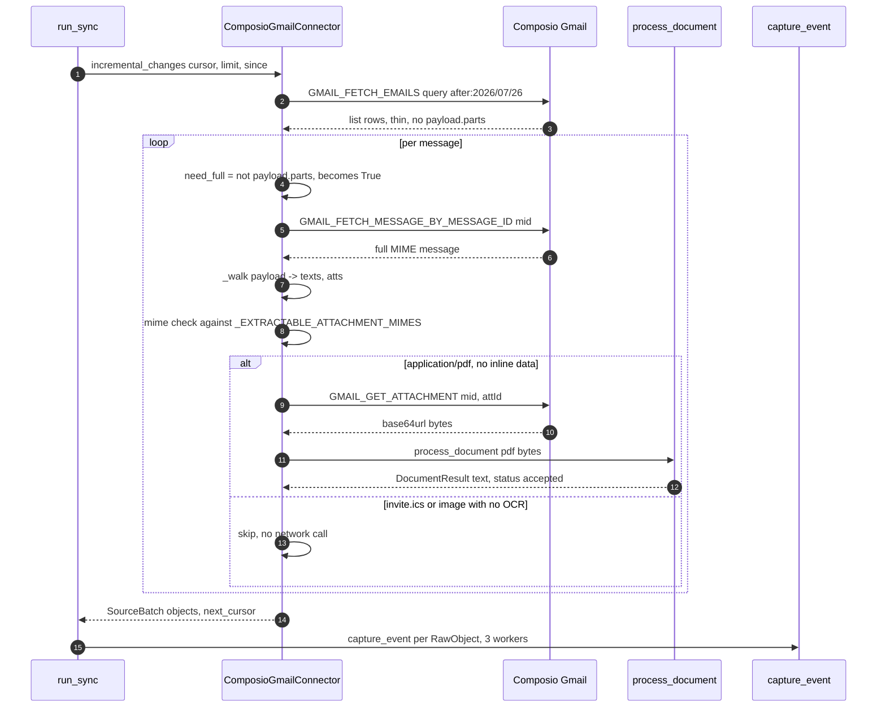
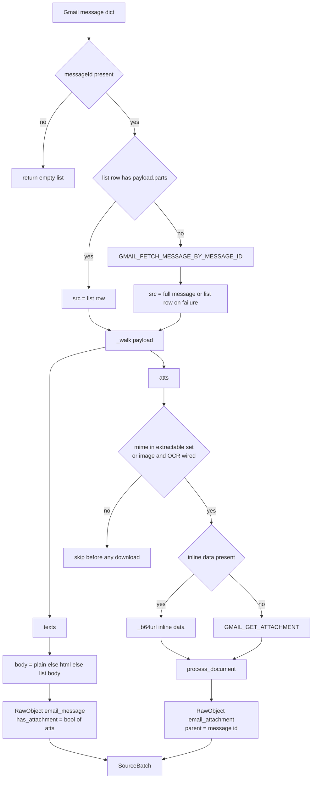
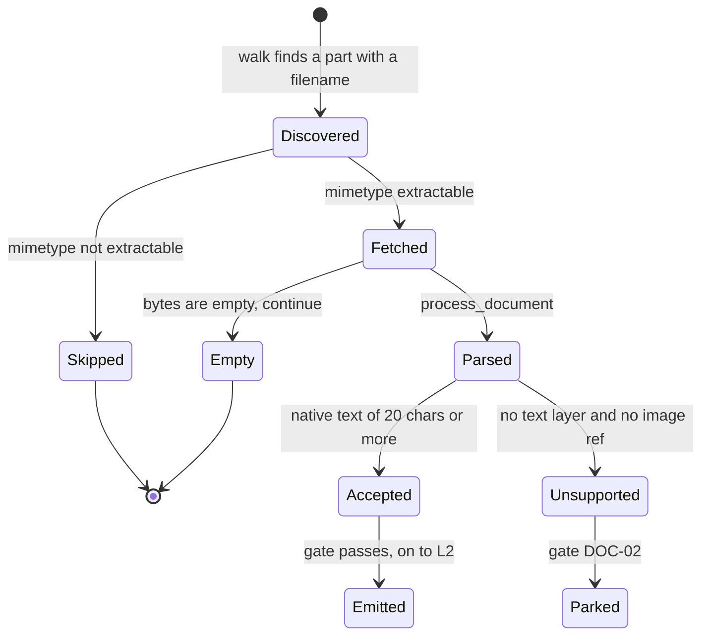

# The Gmail Connector

*Layer 1 · Knowledge Connectors · the `gmail` implementation of `SourceConnector`*

> How does one Gmail message become the objects the rest of the engine reasons about — and which of the decisions in that translation are load-bearing?

| | |
|---|---|
| **File** | [capture/connectors/composio.py](../../../genios_engine/capture/connectors/composio.py) — 328 lines, one class and six module-level helpers |
| **Class** | `ComposioGmailConnector`, `source = "gmail"` |
| **Depends on** | [documents/native.py](../../../genios_engine/capture/documents/native.py) · [documents/router.py](../../../genios_engine/capture/documents/router.py) · [connectors/base.py](../../../genios_engine/capture/connectors/base.py) |
| **Owns** | Gmail transport, MIME walking, recipient extraction, timestamp parsing, the attachment fetch/skip decision |
| **Emits** | `SourceBatch(objects=[RawObject, ...], next_cursor=str \| None)` — one `email_message` plus zero or more `email_attachment` per Gmail message |
| **Composio tool slugs used** | `GMAIL_FETCH_EMAILS`, `GMAIL_FETCH_MESSAGE_BY_MESSAGE_ID`, `GMAIL_GET_ATTACHMENT` |
| **LLM calls** | none — this is Layer 1 |
| **Constructed at** | [platform/wiring.py](../../../genios_engine/platform/wiring.py) `make_connector_for`, branch `st == "gmail"` |
| **Tests** | [tests/test_email_edges.py](../../../tests/test_email_edges.py) — 3 tests, all green |

---

## 1 · What this is

Gmail is the noisiest, richest and most structurally awkward source the engine ingests, and this
connector is where all of that awkwardness is absorbed. Everything downstream — landing, gate,
triage, the Layer 2 graph — is source-agnostic and works on `RawObject`. So every Gmail-specific
decision has to be made here or not at all.

The file opens by naming the boundary:

> Composio sits BEHIND this interface — auth + Gmail data delivery only. Our contract,
> gate, graph, and acquisition orchestration stay ours; swappable for native.
>
> NOTE: the Gmail response field paths below are defensive and may need a small tweak
> against the real payload on the first live run (the "spike"). Only this mapping
> changes — nothing downstream.

That second paragraph explains the shape of almost every function in the file. The connector never
trusts a single field name. It reads a list of candidate keys, falls back to MIME headers, falls
back again to a computed default, and returns something valid rather than raising. **The defensive
style is not paranoia about Composio; it is the price of keeping the swap-for-native promise cheap.**

The interface it satisfies is four methods, from [connectors/base.py](../../../genios_engine/capture/connectors/base.py):

```python
class SourceConnector(Protocol):
    source: str
    def validate_connection(self) -> bool: ...
    def initial_snapshot(self, cursor: str | None, limit: int) -> SourceBatch: ...
    def incremental_changes(self, cursor: str | None, limit: int,
                            since: Optional[datetime] = None) -> SourceBatch: ...
    def fetch_content(self, object_ref: str) -> dict[str, Any]: ...
```

---

## 2 · The six helpers

### 2.1 `_b64url` — decode, never raise

Gmail encodes body and attachment bytes as URL-safe base64 with the padding stripped. Python's
decoders reject unpadded input, and Composio has been observed handing back both alphabets.

```python
def _b64url(s: Any) -> bytes:
    """Decode Gmail's URL-safe base64 body/attachment data. Tolerant of missing padding and
    of a standard-base64 fallback; never raises — returns b'' on anything unparseable."""
    if not isinstance(s, str) or not s:
        return b""
    pad = "=" * (-len(s) % 4)
    for decoder in (base64.urlsafe_b64decode, base64.b64decode):
        try:
            return decoder(s + pad)
        except (binascii.Error, ValueError):
            continue
    return b""
```

`-len(s) % 4` is the padding count for any length. The two-decoder loop covers the `-_` and `+/`
alphabets. **The `b""` return is deliberate: a body that will not decode degrades the message to
snippet-only, it does not abort the page** — and a page is up to 100 emails.

### 2.2 `_EXTRACTABLE_ATTACHMENT_MIMES` — the L1 speed fix

This set is the single most consequential constant in Layer 1, and the comment above it says why:

> Attachment mimetypes worth DOWNLOADING (we can extract text from these). Everything else —
> calendar invites (invite.ics), vcards, signatures, images without OCR — is skipped BEFORE the
> per-file GMAIL_GET_ATTACHMENT network call. That call, not any LLM, is what made L1 slow: one
> round-trip per attachment, mostly for invite.ics that gets dropped anyway.

| MIME | Extension |
|---|---|
| `application/pdf` | .pdf |
| `application/vnd.openxmlformats-officedocument.wordprocessingml.document` | .docx |
| `application/vnd.openxmlformats-officedocument.spreadsheetml.sheet` | .xlsx |
| `application/vnd.openxmlformats-officedocument.presentationml.presentation` | .pptx |
| `text/plain` | .txt |
| `text/markdown` | .md |

The ordering in `_to_objects` is the whole point — the mimetype test happens *before* the download,
not after:

```python
worth = mime in _EXTRACTABLE_ATTACHMENT_MIMES or (self._ocr and mime.startswith("image/"))
if not worth:
    continue
raw_bytes = _b64url(a.get("data")) if a.get("data") else \
    self._attachment_bytes(mid, a.get("attachmentId"))
```

Note the second branch of the `or`: **images only become worth fetching when an OCR engine was
injected.** With `ocr=None` — the default, and the default in production because
`Settings.enable_ocr` is `False` — every image part, including every signature logo, is skipped
without a network call. See §6 for what happens when OCR *is* switched on, which is not what the
line intends.

Note also `a.get("data")`: a small inline part arrives with its bytes already in the payload, so
`GMAIL_GET_ATTACHMENT` is skipped entirely for those.

### 2.3 `_BACKFILL_WINDOW` — why the first sync is deliberately short

```python
_BACKFILL_WINDOW = "newer_than:30d"
```

> First-ever backfill window on a fresh connect. Kept SHORT (1 month) so onboarding is fast — a
> Composio list page (~100 emails) is ~26s, so fewer days = fewer pages = quicker first sync.
> Steady-state incremental sync resumes from the watermark and only pulls new mail regardless.

The trade is explicit: history depth against time-to-first-value. A year of mail at ~26s per
hundred is minutes of a user staring at a spinner on the day they connect. The constant is used in
two places — `initial_snapshot` always, and `incremental_changes` only when there is no watermark
yet:

```python
query = f"after:{since.strftime('%Y/%m/%d')}" if since else _BACKFILL_WINDOW
```

`after:` is date-granular, which means the resumed query overlaps the previous run by up to a day.
That is intentional:

> Resume from the stored watermark (date-granular → a natural overlap that the
> dedup ledger de-dups) so nothing at the boundary is missed.

The overlap costs nothing because `compute_dedup_key` for an email is
`gmail:email_message:<messageId>` with no content version — *"Email/message pass no version → the
immutable object never re-lands."*

### 2.4 `_extract_email` and `_extract_emails`

One regex serves both: `_EMAIL = re.compile(r"[\w.+-]+@[\w-]+\.[\w.-]+")`.

`_extract_email` takes the first match and lowercases it — used for the sender, where a header
value is `"Piyush Sharma <piyush@3one4capital.com>"` and only one address can be right.

`_extract_emails` is the plural case, and its docstring states the downstream requirement:

> ALL distinct emails across the given header values (To/Cc can list many, comma-separated,
> each possibly "Name <addr>"). Order-preserving dedup so L2 can build one edge per recipient.

```python
seen: dict[str, None] = {}
for s in sources:
    if not s:
        continue
    text_val = ", ".join(str(x) for x in s) if isinstance(s, (list, tuple)) else str(s)
    for m in _EMAIL.findall(text_val):
        seen.setdefault(m.lower(), None)
return list(seen)
```

A dict used as an ordered set. Order matters because Layer 2 truncates: in
[context/pipeline.py](../../../genios_engine/context/pipeline.py) the recipient loop is
`recips[:_MAX_RECIPIENTS]` with `_MAX_RECIPIENTS = 25`, so *which* 25 survive is decided by the
order this function returns. `setdefault` means the first occurrence wins its position — a person
on both To and Cc keeps their To position rather than being pushed down the list.

The consumer is [context/runner.py](../../../genios_engine/context/runner.py):

```python
recipients = [e for e in ((raw.get("to") or []) + (raw.get("cc") or [])) if e]
```

which becomes `corresponded_with` and `works_at` edges. The locked test proves the contract:

```python
got = _extract_emails("Rohit <rohit@genios.ai>, piyush@3one4capital.com",
                      None, ["a@b.com", "a@b.com"])
assert got == ["rohit@genios.ai", "piyush@3one4capital.com", "a@b.com"]
```

Names dropped, `None` source skipped, list source joined, duplicate collapsed, order kept.

### 2.5 `_header` — case-insensitive MIME header lookup

```python
def _header(m: dict, name: str) -> str | None:
    for h in (m.get("payload") or {}).get("headers") or []:
        if str(h.get("name", "")).lower() == name.lower():
            return h.get("value")
    return None
```

Linear scan, no index — a Gmail header list is a few dozen entries and this is called at most seven
times per message. RFC 5322 does not fix header casing, hence the `.lower()` on both sides. The
double `or` guards a message with no `payload` at all, which is what a thin list row looks like.

### 2.6 `_parse_ts` — four shapes, then a floor

`occurred_at` is world time, and Layer 2's whole thread-state model (`thread.last_outbound`,
recency, ball-in-court) is built on it. Getting it wrong is worse than most failures here, so the
function tries four shapes across four candidate keys before giving up.

| Order | Where | Shape | Example |
|---|---|---|---|
| 1 | `internalDate`, `messageTimestamp`, `timestamp`, `date` | epoch **milliseconds**, int or digit-string | `1785144439000` |
| 2 | same keys | epoch **seconds**, int or digit-string | `1785144439` |
| 3 | same keys | ISO 8601, `Z` accepted | `"2026-07-27T09:27:19Z"` |
| 4 | `Date` MIME header | RFC 2822 via `email.utils.parsedate_to_datetime` | `"Mon, 27 Jul 2026 09:27:19 GMT"` |
| — | fallback | `datetime.now(timezone.utc)` | ingest time |

The ms-vs-seconds discrimination is one expression:

```python
ms = int(v)
return datetime.fromtimestamp(ms / 1000 if ms > 1e12 else ms, tz=timezone.utc)
```

`1e12` ms is September 2001. Any plausible mail timestamp in milliseconds exceeds it; any in
seconds (`~1.7e9`) does not. Every branch returns tz-aware UTC — naive values from
`fromisoformat` and `parsedate_to_datetime` are stamped with `replace(tzinfo=timezone.utc)`.

**The final fallback to `now()` is the one lossy behaviour in the file.** A message with no
recognisable timestamp lands as if it arrived this second, which silently corrupts the watermark
in `run_sync` — `watermark = max(watermark, raw.occurred_at)` — and can skip mail on the next
incremental pass. Nothing logs it.

---

## 3 · The transport surface

| Method | Slug | Notes |
|---|---|---|
| `validate_connection` | `GMAIL_FETCH_EMAILS` | `max_results=1`; returns `True` or raises |
| `initial_snapshot` | `GMAIL_FETCH_EMAILS` | `query=_BACKFILL_WINDOW`, cursor as `page_token` |
| `incremental_changes` | `GMAIL_FETCH_EMAILS` | `query=after:YYYY/MM/DD` from the watermark, else `_BACKFILL_WINDOW` |
| `fetch_content` | `GMAIL_FETCH_MESSAGE_BY_MESSAGE_ID` | one full MIME message |
| `_full_message` | wraps `fetch_content` | any exception → `{}` |
| `_attachment_bytes` | `GMAIL_GET_ATTACHMENT` | any exception → `b""` |

The client is lazy — `from composio import Composio` happens inside `_client_()`, *"lazy: only
needed on real runs"* — which is why `tests/test_email_edges.py` can construct
`ComposioGmailConnector(api_key="x", user_id="u")` and call `_to_objects` with no network and no
`composio` package installed.

`_execute` carries a live TODO:

```python
# Composio 0.18 requires an explicit toolkit version for manual execution.
# Trial: skip (uses latest). TODO(prod): pin toolkit_versions={"gmail": "<ver>"}.
```

Both retrieval helpers swallow everything, and both say why:

> Defensive: any failure (not connected, API error, unknown shape) → {} and we fall back to the
> list message.

with `# noqa: BLE001 — never let one message abort the batch`.

`_to_batch` accepts three possible container keys and two cursor keys, because the live shape was
not known when it was written:

```python
messages = (data.get("messages") or data.get("emails")
            or data.get("response_data") or [])
...
cursor = data.get("nextPageToken") or data.get("next_page_token")
```

---

## 4 · The full-fetch rule

This is the most important decision in `_to_objects`, and the comment is a bug post-mortem written
in place:

> Pull the FULL MIME message UNLESS the list row already carries a complete MIME structure
> (payload.parts, walked below). A flat body string of ANY length may be Gmail's clipped
> preview — and for deep extraction a signal (competitor, pricing, legal, budget) can sit
> anywhere in the body, so we never feed the LLM a possibly-truncated body. Full-fetch is one
> extra call for exactly the at-risk emails; if it fails we fall back to the list row (safe).
> (Was: only fetched full when body < 400 chars → a 500-char clip of a 2,000-char email slipped
>  through truncated → the LLM missed everything past the clip.)

The rule itself is one line:

```python
need_full = not (list_payload and list_payload.get("parts"))
full = self._full_message(mid) if need_full else {}
src = full or m                                  # prefer the full message for every field
```

**The old predicate tested length; the new one tests structure.** Length is unknowable — a 500-char
string is either a whole short email or the first quarter of a long one, and nothing in the string
says which. `payload.parts` is knowable: if the list row already carries the MIME tree, the bytes
in it are complete by construction, and the extra call is pure waste. If it does not, the flat
string is suspect regardless of size and the round trip is justified.

The cost is honest: one extra `GMAIL_FETCH_MESSAGE_BY_MESSAGE_ID` for every list row that is thin.
The commit that made the change states the effect plainly — *"NEW syncs feed the LLM the complete
email → the deep corpus can actually see the signals. Existing emails keep whatever body was
stored; a re-sync refreshes them."*

`src = full or m` then makes the full message authoritative for every field, with the list row as
backup, which is exactly what `pick()` implements:

```python
def pick(*keys):
    for k in keys:
        v = src.get(k) if isinstance(src, dict) else None
        if v:
            return v
    for k in keys:
        v = m.get(k)
        if v:
            return v
    return None
```

All of `src` first, then all of `m` — not key-by-key alternation.

---

## 5 · `_walk` — one recursion, two outputs

```python
@staticmethod
def _walk(payload: Any, texts: list, atts: list) -> None:
    """Recursively collect (mime, bytes) text bodies and attachment part-refs from a Gmail
    MIME payload — so the FULL body (not a 280-char snippet) and every PDF/file are captured."""
    if not isinstance(payload, dict):
        return
    for p in (payload.get("parts") or []):
        ComposioGmailConnector._walk(p, texts, atts)
    mime = payload.get("mimeType") or ""
    filename = payload.get("filename") or ""
    body = payload.get("body") or {}
    data = body.get("data") if isinstance(body, dict) else None
    att_id = body.get("attachmentId") if isinstance(body, dict) else None
    if filename and (att_id or data):                       # an attachment part
        atts.append({"filename": filename, "mime": mime, "attachmentId": att_id, "data": data})
    elif mime in ("text/plain", "text/html") and data:       # a body text part
        texts.append((mime, _b64url(data)))
```

Four properties worth holding on to:

1. **Children before self.** The recursion runs first, then the node classifies itself. A
   `multipart/mixed` root therefore contributes nothing itself but its subtree is already collected.
2. **A non-multipart message still works.** A plain single-part message has no `parts`, the loop is
   empty, and the root itself is a `text/plain` node with `body.data` — so it lands in `texts`.
3. **`filename` is the attachment discriminator, not mimetype.** A `text/plain` part *with* a
   filename is an attachment; without one it is the body. The `elif` guarantees a part is never both.
4. **Inline data and referenced data are both captured.** `att_id or data` — small parts carry bytes
   inline, large ones carry only an `attachmentId`; `_to_objects` prefers the inline bytes.

Body selection prefers plain text and falls back through HTML to whatever the list row had:

```python
plain = next((t for mm, t in texts if mm == "text/plain"), b"")
html = next((t for mm, t in texts if mm == "text/html"), b"")
body_bytes = plain or html
body = body_bytes.decode("utf-8", "replace") if body_bytes else list_body
```

`"replace"` on the decode is the same philosophy as `_b64url` returning `b""` — a mojibake
character is recoverable, a `UnicodeDecodeError` mid-page is not. HTML is not stripped here; that
happens once in [capture/pipeline.py](../../../genios_engine/capture/pipeline.py), *"heavy at
ingestion"*.

The snippet is a preview with a threshold:

```python
preview = pick("preview", "snippet") or ""
snippet = preview if len(preview.strip()) >= 20 else body[:280]
```

---

## 6 · `_to_objects` — the exact objects produced

> One Gmail message → [email_message] + one [email_attachment] per file. The email carries
> the FULL body (walked from MIME parts, snippet only as fallback); each attachment is text-
> extracted (native/OCR) exactly like a Drive file so its content reaches the graph too.

### The `email_message`

```python
RawObject(
    source="gmail", object_type="email_message", source_object_id=mid,
    occurred_at=occurred, actor_email=sender_email, actor_type="external_contact",
    parent_object_id=thread,
    raw={
        "subject": subject,
        "body": body,                 # FULL text now → preprocess → L2
        "snippet": snippet,
        "labelIds": labels,
        "to": to_emails, "cc": cc_emails,
        "has_attachment": bool(atts),  # keeps attachment-only emails out of the N-10 drop
    },
)
```

`parent_object_id` is the Gmail `threadId`, which `_linkage_hints` in the pipeline turns into
`{"type": "thread", "value": ...}` for Layer 2. `content_version` is left `None` by omission — an
email is immutable, so its dedup key never changes.

**`has_attachment` exists for exactly one downstream line**, in
[gate/rules.py](../../../genios_engine/capture/gate/rules.py):

```python
if not body.strip() and not ctx.raw.get("has_attachment"):
    return ("N-10", "drop")                  # empty, no attachment
```

An email whose whole content is a PDF — a signed contract, a term sheet, an invoice — has an empty
body and would be dropped as noise without this flag. Note that `bool(atts)` counts *all*
attachment parts found by `_walk`, before the `_EXTRACTABLE_ATTACHMENT_MIMES` filter. That is the
right choice: an email carrying only an `invite.ics` is still not an empty email, even though the
invite itself is never downloaded.

### The `email_attachment`

One per *worth-fetching* file, appended after the message:

```python
RawObject(
    source="gmail", object_type="email_attachment",
    source_object_id=f"{mid}::{a.get('attachmentId') or a.get('filename') or i}",
    occurred_at=occurred, actor_email=sender_email, actor_type="external_contact",
    parent_object_id=mid,          # links the file back to its email
    raw={
        "subject": a.get("filename") or "attachment",
        "body": r.text,            # extracted document text → L2 facts
        "mime": a.get("mime"),
        "has_attachment": bool(r.text),
        "document": {"native_parse_used": r.native_parse_used, "ocr_used": r.ocr_used,
                     "ocr_engine": r.ocr_engine, "ocr_pages": r.ocr_pages,
                     "avg_confidence": r.avg_confidence, "status": r.status},
        "to": to_emails, "cc": cc_emails,
    },
)
```

- **The composite id** `"<messageId>::<attachmentId>"` with a three-step fallback to filename then
  loop index guarantees a distinct, stable dedup key per file even when Gmail supplies no
  attachment id.
- **`parent_object_id = mid`**, not the thread — the file hangs off its email, and the email hangs
  off the thread.
- **`actor_email` is the message sender.** The test locks the reason: *"facts attach to the sender"*.
  A term sheet's numbers become facts about the person who sent it.
- **`to`/`cc` are copied from the parent message**, so an attachment reaching Layer 2 independently
  still carries the same recipient set and builds the same edges.
- **`document` is provenance**, and [capture/pipeline.py](../../../genios_engine/capture/pipeline.py)
  routes it to `document_job_store.put(...)` for any event that has it. Its `status` field is also
  read by the gate: `unsupported` → park `DOC-02`, `ocr_review_required` → park `DOC-04`.

The intent behind the whole attachment branch is recorded in the source in the author's own words:

> each attachment → its own DOCUMENT event (mirrors the Drive connector): download bytes,
> extract text natively/OCR, gate + L2 it. "PDF me file hai usse bhi banke aana chahiye."

Extraction is delegated to `process_document` in
[documents/native.py](../../../genios_engine/capture/documents/native.py), which tries the native
text layer and then hands the result to `route_document`:

```python
def route_document(doc: DocumentInput, ocr: OcrEngine | None = None) -> DocumentResult:
    """Native text if usable; else OCR (if an engine is given); low-quality OCR parks."""
    if doc.text_layer and len(doc.text_layer.strip()) >= _MIN_NATIVE_CHARS:
        return DocumentResult(text=doc.text_layer, native_parse_used=True, ...)
```

`_MIN_NATIVE_CHARS = 20`, and `OCR_MIN_CONFIDENCE = 0.75` in
[documents/base.py](../../../genios_engine/capture/documents/base.py) — *"A tunable constant, not a
magic number scattered in logic."*

---

## 7 · Diagrams

### One message with a PDF, end to end



### The decision tree inside `_to_objects`



### Attachment lifecycle



---

## 8 · Worked example

A real-shaped thin list row from `GMAIL_FETCH_EMAILS`:

```python
{
  "messageId": "19a3f1c8b2e0d114",
  "threadId": "19a3f1c8b2e0d100",
  "labelIds": ["INBOX", "IMPORTANT"],
  "preview": "Hi Rohit, sharing the updated deck",
  "messageText": "Hi Rohit, sharing the updated deck. Terms are in the PDF.",
  "to": "Rohit <rohit@genios.ai>",
  "cc": "Partner <partner@3one4capital.com>, rohit@genios.ai",
}
```

No `payload`, so `list_payload` is `None` and **`need_full` is `True`** — the 56-character
`messageText` might be a clip, and the rule no longer gambles on length. One
`GMAIL_FETCH_MESSAGE_BY_MESSAGE_ID` returns:

```python
{"internalDate": "1785144439000",
 "payload": {"mimeType": "multipart/mixed",
   "headers": [{"name": "From", "value": "Piyush Sharma <piyush@3one4capital.com>"},
               {"name": "Subject", "value": "Re: term sheet"},
               {"name": "Date", "value": "Mon, 27 Jul 2026 09:27:19 GMT"}],
   "parts": [
     {"mimeType": "text/plain", "body": {"data": "SGkgUm9oaXQsIHNoYXJpbmcgLi4u"}},
     {"filename": "term-sheet.pdf", "mimeType": "application/pdf",
      "body": {"attachmentId": "ANGjdJ_9x", "size": 184320}},
     {"filename": "invite.ics", "mimeType": "text/calendar",
      "body": {"attachmentId": "ANGjdJ_2p", "size": 1104}}]}}
```

Step by step:

| Step | Result |
|---|---|
| `_parse_ts` | `internalDate` is a digit-string, `1785144439000 > 1e12` → ms → `2026-07-27T09:27:19+00:00`. The RFC-2822 `Date` header is never reached. |
| `_extract_email` on `From` | `"piyush@3one4capital.com"` |
| `_extract_emails` To | `["rohit@genios.ai"]` |
| `_extract_emails` Cc | `["partner@3one4capital.com", "rohit@genios.ai"]` — order preserved, no dedup across To and Cc |
| `_walk` | `texts = [("text/plain", b"Hi Rohit, sharing ...")]`, `atts = [term-sheet.pdf, invite.ics]` |
| body | full decoded plain text, not the 56-char list value |
| snippet | `preview` is 34 chars ≥ 20 → the preview is kept as-is |
| `has_attachment` | `True` — two parts in `atts`, both counted |
| PDF | `application/pdf` is in the set, no inline `data` → **one** `GMAIL_GET_ATTACHMENT`, then `pypdf` extraction |
| invite.ics | `text/calendar` is not in the set → **skipped, zero network calls** |

Two `RawObject`s come back:

| Field | object 1 | object 2 |
|---|---|---|
| `object_type` | `email_message` | `email_attachment` |
| `source_object_id` | `19a3f1c8b2e0d114` | `19a3f1c8b2e0d114::ANGjdJ_9x` |
| `parent_object_id` | `19a3f1c8b2e0d100` (thread) | `19a3f1c8b2e0d114` (message) |
| `actor_email` | `piyush@3one4capital.com` | `piyush@3one4capital.com` |
| `occurred_at` | `2026-07-27T09:27:19Z` | `2026-07-27T09:27:19Z` |
| `raw["subject"]` | `"Re: term sheet"` | `"term-sheet.pdf"` |
| `raw["body"]` | full email prose | PDF text layer |
| `raw["document"]` | absent | `{"native_parse_used": True, "ocr_used": False, "status": "accepted", ...}` |

Their dedup keys are `gmail:email_message:19a3f1c8b2e0d114` and
`gmail:email_attachment:19a3f1c8b2e0d114::ANGjdJ_9x` — distinct, so tomorrow's overlapping
`after:` query re-lands neither.

Network cost for this message: **2 calls** (one full fetch, one attachment). Before the mimetype
pre-check it would have been 3, the third spent downloading an `invite.ics` that the document
router would have marked `unsupported` and the gate would have parked.

---

## 9 · Gaps

Everything below is verified against the code, not inferred.

1. **`raw["headers"]` is never populated, so three gate rules are dead for Gmail.**
   [gate/rules.py](../../../genios_engine/capture/gate/rules.py) reads
   `hdrs = ctx.raw.get("headers") or {}` and uses it for `N-01` (`Auto-Submitted`), `N-04`
   (`Precedence: bulk`) and `N-02` (`List-Unsubscribe`). The connector extracts From/To/Cc/Subject
   and drops every other header. Gmail bulk mail is still caught by `CATEGORY_PROMOTIONS`,
   `N-03` no-reply and `N-09` spam, but the three header rules cannot fire from this source.
   Fixing it is one line: carry a header dict onto `raw`.

2. **xlsx and pptx are downloaded and then never extracted.** Both are in
   `_EXTRACTABLE_ATTACHMENT_MIMES`, and both are in `_NATIVE_MIMES` in
   [router.py](../../../genios_engine/capture/documents/router.py) — but `extract_native_text` in
   [native.py](../../../genios_engine/capture/documents/native.py) has branches only for
   txt/md, html, docx and pdf. An xlsx therefore returns `text_layer=None`, gets
   `status="unsupported"`, and is parked as `DOC-02` after paying for the download. A pricing
   spreadsheet is exactly the kind of file this connector exists to capture.

3. **The OCR branch cannot succeed as wired.** `worth` admits `image/*` when `self._ocr` is set,
   but `process_document` is called without `image_ref`, and `route_document` takes the OCR path
   only when `doc.image_ref is not None and ocr is not None`. Separately,
   `TesseractOcr.ocr` does `Image.open(image_ref)` — it wants a path, and the connector holds
   bytes. So with `enable_ocr=True`, every image attachment is downloaded and then parked as
   `DOC-02`; with the default `enable_ocr=False` nothing is downloaded at all. **The safe
   configuration is the current default.**

4. **`_NATIVE_MIMES` in `router.py` is dead.** It is defined and never referenced; `route_document`
   branches on whether a text layer came back, not on mimetype. Harmless today, misleading to the
   next reader.

5. **The `now()` fallback in `_parse_ts` is silent.** See §2.6 — it can advance the sync watermark
   past mail that has not been fetched, and nothing records that it happened.

6. **The source registry declares the wrong object types.** `SourceDescriptor("gmail", ...)` in
   [source_registry.py](../../../genios_engine/capture/source_registry.py) lists
   `object_types=("message",)` while the connector emits `email_message` and `email_attachment`.
   Nothing enforces the field for unstructured sources — only
   `tests/test_source_registry.py::test_structured_mapping_object_types_are_declared` checks it,
   and Gmail has no structured mapping — so this is documentation drift rather than a live fault.

7. **Recipients are read from the list row, not the full message.** `_extract_emails` is called with
   `m.get("to")` and `m.get("toRecipients")` — never `src.get("to")` — plus
   `_header(src, "To")` and `_header(m, "To")`. In practice the MIME header covers it, but the
   asymmetry with `pick()` is not deliberate-looking.

8. **`toolkit_versions` is unpinned.** `dangerously_skip_version_check=True` with an explicit
   `TODO(prod)`. A Composio-side Gmail toolkit change lands unannounced.

9. **`GMAIL_FETCH_EMAILS` is the only list call.** There is no Gmail `historyId` incremental sync;
   resumption is a date-granular `after:` query plus the dedup ledger. This is a deliberate
   simplification, but it means a deletion or label change is invisible to the engine.

**Not gaps — deliberate.** No LLM call anywhere in this file. No retry on a failed full-fetch or
attachment download (the batch matters more than the message; `run_sync` retries the *capture*
twice and quarantines poison). No content stored by the connector — it returns objects and the
pipeline decides what is persisted.

---

## 10 · Map

**Source**

| File | Role |
|---|---|
| [capture/connectors/composio.py](../../../genios_engine/capture/connectors/composio.py) | This connector |
| [capture/connectors/base.py](../../../genios_engine/capture/connectors/base.py) | `RawObject`, `SourceBatch`, `SourceConnector` |
| [capture/connectors/composio_base.py](../../../genios_engine/capture/connectors/composio_base.py) | `ComposioExec` — shared client used by Drive/Calendar/Notion, **not** by this connector, which has its own `_client_`/`_execute` |
| [capture/connectors/drive.py](../../../genios_engine/capture/connectors/drive.py) | The connector the attachment branch mirrors |
| [capture/documents/native.py](../../../genios_engine/capture/documents/native.py) | `extract_native_text`, `process_document` |
| [capture/documents/router.py](../../../genios_engine/capture/documents/router.py) | `route_document`, `_MIN_NATIVE_CHARS = 20` |
| [capture/documents/base.py](../../../genios_engine/capture/documents/base.py) | `DocumentResult`, `OCR_MIN_CONFIDENCE = 0.75` |
| [capture/documents/tesseract.py](../../../genios_engine/capture/documents/tesseract.py) | `TesseractOcr` |
| [capture/acquire/sync_runner.py](../../../genios_engine/capture/acquire/sync_runner.py) | `run_sync` — the caller, `_CAPTURE_WORKERS = 3` |
| [capture/pipeline.py](../../../genios_engine/capture/pipeline.py) | `capture_event` — consumes each `RawObject` |
| [capture/gate/rules.py](../../../genios_engine/capture/gate/rules.py) | `N-10`, `DOC-02`, `DOC-04` |
| [platform/wiring.py](../../../genios_engine/platform/wiring.py) | `make_connector_for` — where the connector is built |

**Constants**

| Name | Value | File |
|---|---|---|
| `_BACKFILL_WINDOW` | `"newer_than:30d"` | composio.py |
| `_EXTRACTABLE_ATTACHMENT_MIMES` | 6 mimetypes | composio.py |
| `_EMAIL` | `r"[\w.+-]+@[\w-]+\.[\w.-]+"` | composio.py |
| `_MIN_NATIVE_CHARS` | `20` | documents/router.py |
| `OCR_MIN_CONFIDENCE` | `0.75` | documents/base.py |
| `_BULK_RECIPIENTS` / `_MAX_RECIPIENTS` | `10` / `25` | context/pipeline.py |

**Endpoints**

| Route | File | Use |
|---|---|---|
| `POST /integrations/{tool}/sync` | [api/routes.py](../../../genios_engine/api/routes.py) | per-tool sync |
| `POST /integrations/sync-all` | api/routes.py | background sync of every active source |
| `POST /sync/{connection_id}` | api/routes.py | one connection |
| `POST /webhooks/composio` | api/routes.py | real-time push; calls `ComposioGmailConnector(api_key="", user_id="")._to_raw(msg)` — the *only* caller of `_to_raw`, which returns the email object and discards its attachments |

**Tests** — [tests/test_email_edges.py](../../../tests/test_email_edges.py), 3 tests, green.

> These lock the DETERMINISTIC inputs to the email relationship graph + content completeness:
>   1. To/Cc capture (person↔person / person→company edges in L2)
>   2. FULL body from MIME parts (not a ~280-char snippet)
>   3. attachments/PDF → their own document event so their text reaches the graph

Back to [Layer 1 Overview](../00-Overview.md).
