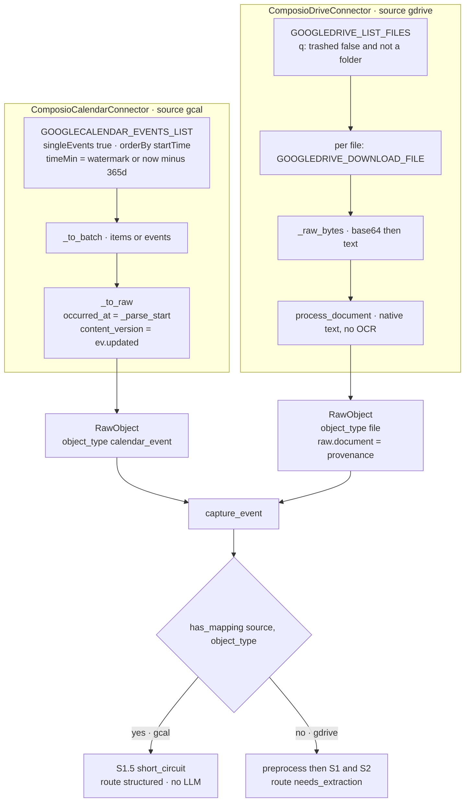
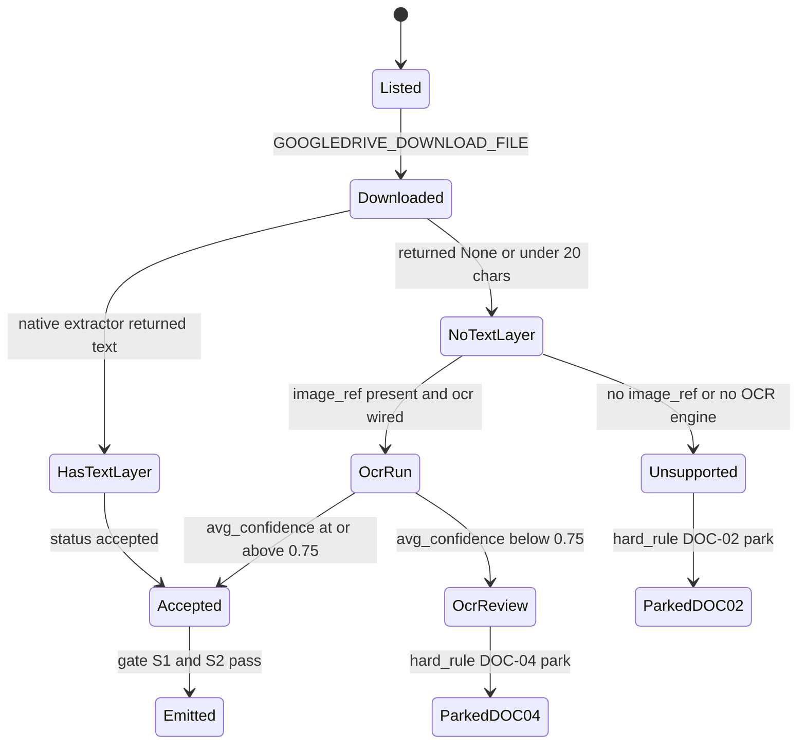

# The Calendar and Drive Connectors

*Layer 1 · Knowledge Connectors · `genios_engine/capture/connectors/calendar.py` and `drive.py`*

> How does a Google Calendar event and a Google Drive file become a `RawObject` — and why does one of them carry a `content_version` while the other does not?

| | |
|---|---|
| **Files** | [calendar.py](../../../genios_engine/capture/connectors/calendar.py) · 87 lines · [drive.py](../../../genios_engine/capture/connectors/drive.py) · 90 lines |
| **Shared base** | [base.py](../../../genios_engine/capture/connectors/base.py) — `RawObject`, `SourceBatch`, `SourceConnector` · [composio_base.py](../../../genios_engine/capture/connectors/composio_base.py) — `ComposioExec.execute` |
| **Composio tools used** | `GOOGLECALENDAR_EVENTS_LIST`, `GOOGLECALENDAR_EVENTS_GET`, `GOOGLEDRIVE_LIST_FILES`, `GOOGLEDRIVE_DOWNLOAD_FILE` |
| **Calendar emits** | `RawObject(source="gcal", object_type="calendar_event")` — **structured**, short-circuits the gate |
| **Drive emits** | `RawObject(source="gdrive", object_type="file")` — **unstructured document**, full gate + L2 |
| **Downstream** | [structured/registry.py](../../../genios_engine/capture/structured/registry.py) `gcal.event.v1` · [documents/native.py](../../../genios_engine/capture/documents/native.py) `process_document` |
| **Built by** | [wiring.py](../../../genios_engine/platform/wiring.py) `make_connector_for` |
| **Tests** | [tests/test_structured_dedup.py](../../../tests/test_structured_dedup.py) · [tests/test_documents.py](../../../tests/test_documents.py) |
| **Entry point** | [Layer 1 Overview](../00-Overview.md) |

---

## 1 · Two connectors, two lanes

These two live in the same package and implement the same `SourceConnector` protocol, but they hand
Layer 1 fundamentally different things.

A calendar event arrives **already typed**. Google tells us the start, the end, the status, the
attendees. There is nothing to infer, so the gate short-circuits it — `gcal`/`calendar_event` has a
registered mapping and never reaches an LLM:

> `# S1.5 — structured short-circuit (already typed; skips email N-codes)`
> — [gate.py](../../../genios_engine/capture/gate/gate.py)

A Drive file arrives as **bytes**. It has to be downloaded, its text layer extracted, and the prose
handed to L2 like any email body. The module comment states the boundary exactly:

> *Google Drive via Composio. Files are DOCUMENTS → download, extract text NATIVELY
> (HTML/docx/pdf/txt — no OCR), and hand the text to the gate/L2. Scanned images with
> no text layer would need OCR (Tesseract), wired separately. Paths finalized live.*

**The lane is not chosen by the connector — it is derived in the pipeline from whether a structured
mapping exists.** [pipeline.py](../../../genios_engine/capture/pipeline.py):

```python
# auto-detect structured sources (CRM/calendar/DB): a registry mapping means the
# object is typed → structured route (gate short-circuit), no LLM extraction.
if not is_structured and has_mapping(event.source, event.object_type):
    is_structured = True
```

`has_mapping("gcal", "calendar_event")` is `True` because `gcal.event.v1` is registered.
`has_mapping("gdrive", "file")` is `False`. That one lookup is the whole fork.

---

## 2 · The Calendar connector

### 2.1 · The one API call

Everything the connector reads comes from a single Composio slug with four fixed arguments plus a
time bound:

```python
args: dict[str, Any] = {"calendarId": self._cal, "maxResults": max_results,
                        "singleEvents": True, "orderBy": "startTime",
                        "timeMin": tmin.astimezone(timezone.utc).isoformat()}
```

| Argument | Value | Why |
|---|---|---|
| `calendarId` | `"primary"` by default, from `__init__` | one calendar per connection; the constructor takes `calendar_id` but `make_connector_for` never overrides it |
| `maxResults` | the caller's `limit` | page size, driven by `sync_batch_limit` (default 25) |
| `singleEvents` | `True` | recurring series are **expanded into individual instances**. Without it a weekly stand-up would land once as a rule, not as the dated meetings the graph needs |
| `orderBy` | `"startTime"` | Google only accepts `startTime` ordering when `singleEvents` is true — the two arguments are a pair, not two independent choices |
| `timeMin` | the watermark, or now − 365 days | see below |
| `pageToken` | only when a cursor exists | `SourceBatch.next_cursor` carries `nextPageToken` back |

### 2.2 · A year back, not a month

```python
# window: from the watermark, or the last 365 days on a first run (+ all future). A year
# back so a fresh connect captures real history, not just the last month.
tmin = since or (datetime.now(timezone.utc) - timedelta(days=365))
```

This is a deliberate divergence from the Gmail connector, which uses `_BACKFILL_WINDOW =
"newer_than:30d"` and justifies it on onboarding speed (*"a Composio list page (~100 emails) is
~26s"*). Calendars are small — a year of meetings is a few hundred rows, not a few hundred pages —
and meeting history is exactly the material that makes a relationship graph worth having. **The
asymmetry is not an oversight; the cost profiles of the two sources are different.**

Note also what `timeMin` alone implies: there is no `timeMax`, so every future event on the calendar
is inside the window on every sweep.

### 2.3 · `_parse_start` — a three-step fallback that never raises

```python
def _parse_start(ev: dict) -> datetime:
    start = ev.get("start") or {}
    val = start.get("dateTime") or start.get("date") or ev.get("updated")
    ...
    return datetime.now(timezone.utc)
```

The chain is: **timed event → all-day event → last-edited time → now**. `start.dateTime` exists for
a normal meeting; an all-day event carries only `start.date` (`"2026-08-01"`); a malformed or
partial event still has `updated`. Parsing is `datetime.fromisoformat` with a `Z` → `+00:00` rewrite
and a naive-datetime rescue (`dt.replace(tzinfo=timezone.utc)`), and a `ValueError` falls through to
`now`. The function has no failure mode that propagates — `occurred_at` on `RawObject` is
non-optional, so it cannot be allowed one.

### 2.4 · `content_version` — why a reschedule must re-land

This is the load-bearing line of the file:

```python
# `updated` changes whenever the event is edited (rescheduled, status change) →
# a reschedule re-lands and updates meeting.start_at instead of being deduped away.
content_version=str(ev.get("updated")) if ev.get("updated") else None,
```

`content_version` folds into the dedup key in
[source_event.py](../../../genios_engine/contracts/source_event.py):

```python
base = f"{source}:{object_type}:{source_object_id}"
return f"{base}:{content_version}" if content_version else base
```

> *Stable per source object — same object+version yields the same key, so re-syncs and
> retries can't create duplicates. For a MUTABLE structured object the connector passes a
> content_version (updatedAt/etag/watermark); a genuine change then yields a NEW key so the
> edit lands and updates the graph, while an unchanged re-sync still dedups. Email/message
> pass no version → the immutable object never re-lands.*

The distinction is the whole point. An email is immutable — it is written once and never edited, so
a stable key is correct and a re-sync must produce nothing. A calendar event is **mutable**: it gets
moved, it gets cancelled, attendees are added. Without a version in the key, `land_raw_object` would
find the dedup key already present and record:

```python
trace.record("landing", "drop", reason_code="duplicate", dedup_key=event.dedup_key)
```

and `meeting.start_at` would be frozen at whatever the event's start was the first time we saw it,
forever. [tests/test_structured_dedup.py](../../../tests/test_structured_dedup.py) pins both halves —
that a change produces a new key, and that an *unchanged* re-sync still dedups:

```python
assert proposal != won                 # a real change re-lands → graph updates
assert proposal == unchanged           # an unchanged re-sync still dedups (no spurious work)
```

### 2.5 · The `raw` dict, and the two fields that were being dropped

```python
raw={  # structured fields the gcal.calendar_event mapping reads
    "summary": ..., "start": ..., "end": ..., "status": ...,
    "attendees": attendees, "hangoutLink": ev.get("hangoutLink"),
    # agenda/notes + where — real relevant info that was being dropped (only summary was kept)
    "description": ev.get("description"),
    "location": ev.get("location"),
},
```

`description` and `location` are recent additions, and the registry was widened to match. The
mapping in [structured/registry.py](../../../genios_engine/capture/structured/registry.py):

| `source_field` | `target` | `value_type` |
|---|---|---|
| `summary` | `meeting.title` | string |
| `start` | `meeting.start_at` | timestamp |
| `end` | `meeting.end_at` | timestamp |
| `status` | `meeting.status` | enum |
| `description` | `meeting.description` | string |
| `location` | `meeting.location` | string |

with `intent="scheduling_move"`, `name_field="meeting.title"`, `emit_on_change=["start", "status"]`,
and one relation:

```python
relations=[RelationMap("attendees", "person", "attended", "in", "email")],
```

That relation is why the connector flattens attendees to a bare email list
(`[a.get("email") for a in (ev.get("attendees") or []) if a.get("email")]`) — `apply_relations` in
[structured/apply.py](../../../genios_engine/capture/structured/apply.py) normalises through
`norm_email` so *"attendee-persons MERGE with pipeline-created persons"*.

`hangoutLink` is carried in `raw` but has **no** `FieldMap`, so it reaches the encrypted payload
store and nothing else. That is deliberate-looking but undocumented; it is listed in Gaps.

---

## 3 · The Drive connector

### 3.1 · The list query

```python
args: dict[str, Any] = {"pageSize": limit,
                        "q": "trashed = false and mimeType != 'application/vnd.google-apps.folder'"}
```

Two exclusions, both structural rather than heuristic. **Trashed files are not knowledge** — a user
deleting a document is an explicit statement that it should not inform anything. **Folders are not
documents** — they have no bytes to download, and a per-folder `GOOGLEDRIVE_DOWNLOAD_FILE` would be
a wasted round trip that returns nothing parseable.

### 3.2 · One download per file, inside the mapping

```python
dl = self._x.execute("GOOGLEDRIVE_DOWNLOAD_FILE", {"file_id": str(fid)})
r = process_document(mime=mime, data=_raw_bytes(dl), filename=name, ocr=self._ocr)
```

`_to_raw` is called once per listed file from `_to_batch`, and it makes a network call. A page of 25
files is 1 list call plus 25 sequential download calls, all of them before anything has been deduped.

### 3.3 · `_raw_bytes` — base64 first, text second

```python
def _raw_bytes(dl: dict) -> bytes | str:
    """Best-effort: pull file content out of the download response (text or base64)."""
    for k in ("content", "text", "data", "file", "body"):
        v = dl.get(k)
        if isinstance(v, str) and v:
            try:
                return base64.b64decode(v, validate=True)
            except Exception:
                return v
        if isinstance(v, (bytes, bytearray)):
            return bytes(v)
    return ""
```

The response shape is not pinned — the module comment says *"Paths finalized live"* — so five keys
are probed in order and both plausible encodings are handled. `validate=True` is what makes the
heuristic mostly safe: ordinary prose contains spaces, newlines and punctuation outside the base64
alphabet, so `b64decode` raises and the string is returned as-is. The failure case is narrow but
real, and is listed in Gaps.

`process_document` accepts `bytes | str` precisely because of this, and normalises internally:

```python
raw = data.encode() if isinstance(data, str) else data
txt = data if isinstance(data, str) else data.decode(errors="ignore")
```

### 3.4 · `process_document` and the document provenance dict

[native.py](../../../genios_engine/capture/documents/native.py) dispatches on mime with a filename
suffix as a second chance, and **never raises**:

| Condition | Extractor |
|---|---|
| `text/plain`, `text/markdown`, `.txt`, `.md` | the text itself |
| `text/html`, `.html`, `.htm` | `_html_to_text` — an `HTMLParser` subclass skipping `script`/`style`/`head` |
| the docx mime, `.docx` | `_docx_to_text` — paragraphs **plus every table cell** |
| `application/pdf`, `.pdf` | `_pdf_to_text` — `pypdf`, page text joined |
| anything else, or any exception | `None` |

> *Return the document's text layer, or None if it has none (scanned image →
> OCR fallback) or the format is unsupported. Never raises.*

`route_document` then decides the status, and `_MIN_NATIVE_CHARS = 20` is the bar — a PDF that
yields eight characters is treated as having no usable text layer, not as a tiny document.

The `DocumentResult` is flattened straight into `raw["document"]`:

```python
raw={"subject": name, "body": r.text, "mime": mime, "has_attachment": bool(r.text),
     "document": {"native_parse_used": r.native_parse_used, "ocr_used": r.ocr_used,
                  "ocr_engine": r.ocr_engine, "ocr_pages": r.ocr_pages,
                  "avg_confidence": r.avg_confidence, "status": r.status}},
```

That dict has two consumers downstream, and they are independent:

1. **The gate reads `status`** — [rules.py](../../../genios_engine/capture/gate/rules.py):
   ```python
   # Documents: unparseable / low-confidence OCR → park (reviewable, never silent drop).
   doc = ctx.raw.get("document") or {}
   if doc.get("status") == "unsupported":
       return ("DOC-02", "park")
   if doc.get("status") == "ocr_review_required":
       return ("DOC-04", "park")
   ```
   Both are `park`, never `drop` — an unreadable contract goes to a human queue.
2. **The pipeline writes the whole dict to `document_jobs`**:
   ```python
   # document provenance (native vs OCR + status) for any file-type event
   doc = raw.raw.get("document")
   if doc and document_job_store is not None:
       document_job_store.put(org_id=org_id, event_id=event.event_id, doc=doc,
                              fmt=raw.raw.get("mime"))
   ```
   The table is defined in [0002_l1_tables.sql](../../../migrations/0002_l1_tables.sql) with columns
   `format, native_parse_used, ocr_engine, ocr_pages, avg_confidence, status`.

Note `"has_attachment": bool(r.text)` is exactly `bool(body)`, so it can never rescue an event from
the `N-10 empty_no_attachment` drop that its own emptiness would trigger — but it does not need to,
because `DOC-02` fires first in `hard_rule`.

### 3.5 · OCR wiring, on both connectors

Calendar takes **no** `ocr` argument at all — events have no bytes. Drive does:

```python
def __init__(self, *, api_key: str, user_id: str, ocr=None) -> None:
    self._x = ComposioExec(api_key=api_key, user_id=user_id)
    self._ocr = ocr                  # OcrEngine | None — native-only if None
```

and `make_connector_for` supplies it from settings:

```python
ocr = None
if s.enable_ocr:
    from genios_engine.capture.documents.tesseract import TesseractOcr
    ocr = TesseractOcr()
return ComposioDriveConnector(api_key=key, user_id=uid, ocr=ocr)
```

`enable_ocr` defaults to `False` — *"OCR needs the tesseract binary, so default off"*. **But even
with it on, the Drive path cannot reach OCR today.** `route_document` gates the OCR branch on
`doc.image_ref is not None`, and `ComposioDriveConnector` calls `process_document` without
`image_ref`. See Gaps §6.2.

---

## 4 · Diagrams





The `OcrRun` state is drawn because `route_document` can reach it. **From the Drive connector it
cannot** — see Gaps §7.4.

---

## 5 · Worked example A — a meeting that moves

**Sweep 1.** `GOOGLECALENDAR_EVENTS_LIST` returns:

```json
{"items": [{"id": "ev_7h2k", "status": "confirmed",
            "updated": "2026-07-30T09:00:00Z",
            "summary": "Acme pilot review",
            "start": {"dateTime": "2026-08-01T15:00:00+05:30"},
            "end":   {"dateTime": "2026-08-01T16:00:00+05:30"},
            "organizer": {"email": "rohit@genios.io"},
            "attendees": [{"email": "priya@acme.com"}, {"email": "rohit@genios.io"}],
            "hangoutLink": "https://meet.google.com/abc-defg-hij",
            "description": "Walk through pilot scope and pricing.",
            "location": "Google Meet"}],
 "nextPageToken": null}
```

`_to_raw` produces:

| field | value |
|---|---|
| `source` / `object_type` | `gcal` / `calendar_event` |
| `source_object_id` | `ev_7h2k` |
| `occurred_at` | `2026-08-01T15:00:00+05:30` — from `start.dateTime` |
| `actor_email` / `actor_type` | `rohit@genios.io` / `internal_user` |
| `content_version` | `2026-07-30T09:00:00Z` |
| `raw.attendees` | `["priya@acme.com", "rohit@genios.io"]` |

`to_source_event` then computes
`dedup_key = "gcal:calendar_event:ev_7h2k:2026-07-30T09:00:00Z"`, and `source_family` resolves to
`communication` via the registry descriptor for `gcal`.

In `capture_event`: `has_mapping("gcal", "calendar_event")` → `is_structured = True` → **the
preprocess block is skipped entirely** (no PII masking, no `PreparedContent` row — there is no prose
to mask). The gate records `S0 pass`, then:

```
S1.5  short_circuit  reason_code=structured_mapped
```

`triage_lane` scores the empty text at 0, then `if ctx.is_structured: score = max(score, 30)` → lane
**P2**. `apply_mapping(gcal.event.v1, raw)` yields:

```python
{"meeting.title": "Acme pilot review",
 "meeting.start_at": "2026-08-01T15:00:00+05:30",
 "meeting.end_at": "2026-08-01T16:00:00+05:30",
 "meeting.status": "confirmed",
 "meeting.description": "Walk through pilot scope and pricing.",
 "meeting.location": "Google Meet"}
```

The `GatedEvent` leaves with `route="structured"`, `triage_lane="P2"`,
`prepared_content_ref=None`. Trace: `landing → S0 → S1.5 → triage → emit`.

**Sweep 2, after Priya moves the meeting a day.** Google returns the same `id` with
`"updated": "2026-07-31T18:00:00Z"` and `"start": {"dateTime": "2026-08-02T15:00:00+05:30"}`.
New `content_version` → new dedup key
`gcal:calendar_event:ev_7h2k:2026-07-31T18:00:00Z` → `repo.exists` is `False` → it lands again, and
`meeting.start_at` updates. Had `content_version` been `None`, sweep 2 would have terminated at
`landing / drop / duplicate` and the graph would still say the first of August.

---

## 6 · Worked example B — a proposal PDF

`GOOGLEDRIVE_LIST_FILES` returns:

```json
{"files": [{"id": "1AbCdEfGh", "name": "Acme pilot proposal.pdf",
            "mimeType": "application/pdf",
            "modifiedTime": "2026-07-29T11:42:07.221Z",
            "lastModifyingUser": {"emailAddress": "rohit@genios.io"}}],
 "nextPageToken": null}
```

`_to_raw` immediately calls `GOOGLEDRIVE_DOWNLOAD_FILE` with `{"file_id": "1AbCdEfGh"}`. The
response `{"content": "JVBERi0xLjQK…"}` hits the first key in `_raw_bytes`, `b64decode(…,
validate=True)` succeeds, and the PDF bytes go to `process_document`. `_pdf_to_text` returns roughly
1,800 characters — well over `_MIN_NATIVE_CHARS` — so `route_document` takes the native branch:

```python
DocumentResult(text="…", native_parse_used=True, ocr_used=False,
               ocr_engine=None, ocr_pages=0, avg_confidence=None, status="accepted")
```

The resulting `RawObject`:

| field | value |
|---|---|
| `source` / `object_type` | `gdrive` / `file` |
| `source_object_id` | `1AbCdEfGh` |
| `occurred_at` | `2026-07-29T11:42:07.221+00:00` — `modifiedTime` |
| `actor_email` | `rohit@genios.io` |
| `content_version` | **`None`** |
| `raw.subject` / `raw.body` | the filename / the extracted text |
| `raw.document.status` | `accepted` |

`dedup_key = "gdrive:file:1AbCdEfGh"` — no version segment. `source_family` is `knowledge`.

`has_mapping("gdrive", "file")` is `False`, so this goes down the unstructured path:
`extract_native_text(mime="text/html", …)` is run over the body as a defensive HTML strip, the
filename is prepended as the subject, and `preprocess` masks PII and produces a `PreparedContent`.
The gate finds no whitelist code (`sender_known` is `False`, `actor.type` is `internal_user`,
`gdrive` is not a deliberate source), `hard_rule` returns `None` because `status == "accepted"` and
the body is non-empty, and `S2` routes it to `needs_extraction`. A `document_jobs` row is written
with `native_parse_used=true, ocr_pages=0, status='accepted'`.

**The same file scanned.** A photographed contract has no text layer, so `_pdf_to_text` returns `""`,
`route_document` falls through both branches to `status="unsupported"`, and `hard_rule` returns
`("DOC-02", "park")`. The event lands as `parked`, its raw payload **is** stored —

> *Parked = a human-review queue (grey-zone), so it MUST keep content to be recoverable — was
> a bug: parked stored no payload, dedup blocked re-fetch, /recover was a no-op → black hole.*

— and `document_jobs` records `status='unsupported'` so the file is findable in the review queue.

---

## 7 · Gaps — what the code does not do

### 7.1 · Calendar: the watermark is a *start-time* filter, not a *modified-since* filter

`incremental_changes` passes `since` straight into `timeMin`, which is a filter on when the event
*starts*. But `run_sync` computes the watermark from `occurred_at`:

```python
if watermark is None or raw.occurred_at > watermark:
    watermark = raw.occurred_at
```

and for `gcal`, `occurred_at` **is** the event's start time. So after a sweep that sees any
future-dated meeting, the stored watermark is a date in the future, and the next sweep asks Google
for events starting after it — skipping everything between now and then. Two consequences follow:
a reschedule of a near-term meeting can be missed, and an event whose start moves *earlier* falls
out of the window. Google's own answer for this is `updatedMin` or a `syncToken`; neither is used.
The recovery mode in `run_sync` (`mode="recovery"`, a fixed `reconcile_days` lookback that never
moves the watermark) is the existing mitigation, not a fix.

### 7.2 · Drive: `since` is accepted and ignored

```python
def incremental_changes(self, cursor: str | None = None, limit: int = 50,
                        since: datetime | None = None) -> SourceBatch:
    return self._to_batch(self._list(limit=limit, page_token=cursor))
```

`since` is in the signature to satisfy the protocol and is never used; the `q` string carries no
`modifiedTime >` clause. Every sweep re-lists and — because the download happens inside `_to_raw` —
**re-downloads every file in the drive**, up to `max_pages=20` pages. The dedup ledger then drops
them all as duplicates *after* the bytes are on the wire. This is the exact cost that the Notion
connector's watermark fix removed on its side; see
[The Notion and Client-Database Connectors](06-Notion-and-Database-Connectors.md) §2.3.

### 7.3 · Drive: no `content_version`, so an edited file never re-lands

`ComposioDriveConnector._to_raw` sets no `content_version`, so a Drive file's dedup key is fixed at
`gdrive:file:<id>`. `modifiedTime` is already read for `occurred_at` and would be the natural
version. Today, a proposal revised after first capture cannot update anything downstream.

### 7.4 · Drive: OCR is wired but unreachable

`route_document` requires `doc.image_ref is not None` to run OCR, and the connector never sets it:

```python
r = process_document(mime=mime, data=_raw_bytes(dl), filename=name, ocr=self._ocr)
```

With `enable_ocr=true` and Tesseract installed, a scanned PDF from Drive still parks as `DOC-02
unsupported`, never `DOC-04 ocr_review_required`. `OcrEngine.ocr(image_ref)` takes a reference PIL
can open (`Image.open(image_ref)`), so closing this needs a real image-bytes staging step, not a
one-line change. The Gmail attachment path in
[composio.py](../../../genios_engine/capture/connectors/composio.py) has the same shape and the same
gap.

### 7.5 · Drive: Google-native files are listed but cannot be downloaded

The `q` excludes folders but not `application/vnd.google-apps.document`, `.spreadsheet` or
`.presentation`. Those have no binary content — Google requires an *export* call — so
`GOOGLEDRIVE_DOWNLOAD_FILE` will not yield parseable bytes, `extract_native_text` returns `None` for
an unrecognised mime, and every Google Doc in the drive parks as `DOC-02`. Either the query should
exclude `application/vnd.google-apps.` prefixed mimes, or an export branch is needed.

### 7.6 · `_raw_bytes` can mis-decode short plain text

A text file whose entire content is base64-alphabet characters with a length divisible by four —
`"deadline"` is eight such characters — passes `validate=True` and is decoded into binary garbage,
which then reaches `data.decode(errors="ignore")` as gibberish. Rare, silent, and only fixable by
having the response tell us the encoding rather than guessing.

### 7.7 · Smaller ones

- `hangoutLink` is captured into `raw` but has no `FieldMap` in `gcal.event.v1`, so it never becomes
  a structured field. It survives only in the encrypted payload.
- Neither connector's `fetch_content` is called by anything in the engine — `GOOGLECALENDAR_EVENTS_GET`
  is dead today. It exists to satisfy the `SourceConnector` protocol.
- `validate_connection` on both connectors is likewise never called from any route or sweep, so a
  broken connection is discovered by the first sync failing rather than at connect time.
- `ComposioCalendarConnector` accepts `calendar_id` but `make_connector_for` always builds it with
  the default `"primary"`; a tenant with several calendars can connect only one.
- The Drive per-file download is sequential inside a list comprehension. Gmail solved the equivalent
  problem with a mime pre-filter — *"skip non-extractable files BEFORE the expensive per-file
  download (this is the L1 speed fix)"* — and Drive has no equivalent.

---

## 8 · Map

| Thing | Where |
|---|---|
| Calendar connector | [capture/connectors/calendar.py](../../../genios_engine/capture/connectors/calendar.py) |
| Drive connector | [capture/connectors/drive.py](../../../genios_engine/capture/connectors/drive.py) |
| `RawObject` / `SourceBatch` / `SourceConnector` | [capture/connectors/base.py](../../../genios_engine/capture/connectors/base.py) |
| Composio client wrapper | [capture/connectors/composio_base.py](../../../genios_engine/capture/connectors/composio_base.py) |
| Native text extraction | [capture/documents/native.py](../../../genios_engine/capture/documents/native.py) |
| Native-vs-OCR routing, `OCR_MIN_CONFIDENCE = 0.75` | [documents/router.py](../../../genios_engine/capture/documents/router.py) · [documents/base.py](../../../genios_engine/capture/documents/base.py) |
| Tesseract engine | [capture/documents/tesseract.py](../../../genios_engine/capture/documents/tesseract.py) |
| Document provenance store | [capture/documents/store.py](../../../genios_engine/capture/documents/store.py) |
| `gcal.event.v1` mapping | [capture/structured/registry.py](../../../genios_engine/capture/structured/registry.py) |
| Field + relation application | [capture/structured/apply.py](../../../genios_engine/capture/structured/apply.py) |
| dedup key | [contracts/source_event.py](../../../genios_engine/contracts/source_event.py) |
| raw → `SourceEvent` | [capture/landing/normalize.py](../../../genios_engine/capture/landing/normalize.py) |
| Pipeline | [capture/pipeline.py](../../../genios_engine/capture/pipeline.py) |
| Gate + reason codes | [capture/gate/gate.py](../../../genios_engine/capture/gate/gate.py) · [gate/rules.py](../../../genios_engine/capture/gate/rules.py) |
| Sweep orchestration | [capture/acquire/sync_runner.py](../../../genios_engine/capture/acquire/sync_runner.py) |
| Connector construction | [platform/wiring.py](../../../genios_engine/platform/wiring.py) |
| Source descriptors (`gcal`, `gdrive`) | [capture/source_registry.py](../../../genios_engine/capture/source_registry.py) |

**Tables:** `source_events`, `document_jobs`, `raw_payloads`, `prepared_content`, `event_trace`,
`parked_events` — [migrations/0002_l1_tables.sql](../../../migrations/0002_l1_tables.sql),
[migrations/0027_l1_seam.sql](../../../migrations/0027_l1_seam.sql).

**Tests:** [tests/test_structured_dedup.py](../../../tests/test_structured_dedup.py) (calendar
`content_version`), [tests/test_documents.py](../../../tests/test_documents.py) (native vs OCR
routing), [tests/test_source_registry.py](../../../tests/test_source_registry.py) (`gcal`/`gdrive`
buildable ↔ dispatch agreement).

**Sibling documents:** [The Connector Contract](01-The-Connector-Contract.md) ·
[The Connector Factory](03-The-Connector-Factory.md) · [Gmail Connector](04-Gmail-Connector.md) ·
[The Notion and Client-Database Connectors](06-Notion-and-Database-Connectors.md) ·
[Acquisition and Sync](07-Acquisition-and-Sync.md) · [The Fake Connector](08-The-Fake-Connector.md)
