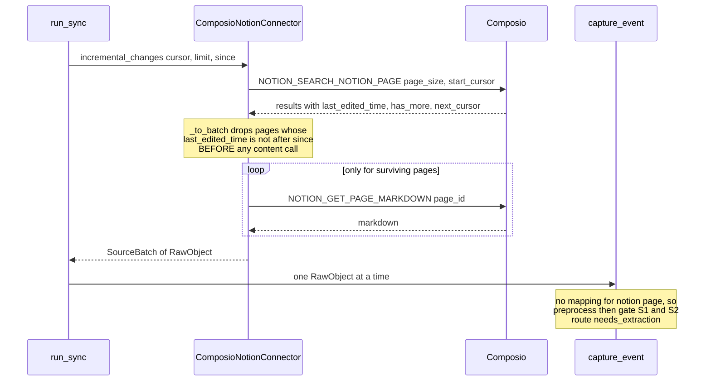
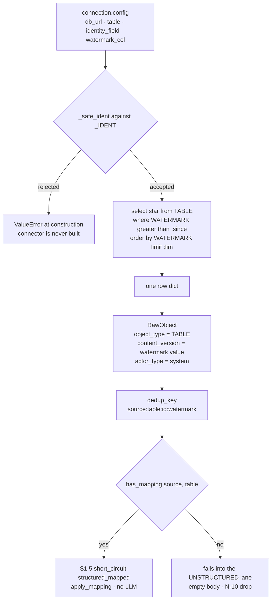

# The Notion and Client-Database Connectors

*Layer 1 · Knowledge Connectors · `genios_engine/capture/connectors/notion.py` and `database.py`*

> One connector reads a workspace over an API it does not control; the other opens a SQL connection into a customer's production database. What does each one have to get right that the other does not?

| | |
|---|---|
| **Files** | [notion.py](../../../genios_engine/capture/connectors/notion.py) · 86 lines · [database.py](../../../genios_engine/capture/connectors/database.py) · 81 lines |
| **Notion tools** | `NOTION_SEARCH_NOTION_PAGE`, `NOTION_GET_PAGE_MARKDOWN` |
| **Database access** | direct SQLAlchemy via [platform/db.py](../../../genios_engine/platform/db.py) `get_engine` — **no Composio** |
| **Notion emits** | `RawObject(source="notion", object_type="page")` — unstructured prose → L2 |
| **Database emits** | `RawObject(source=<source_type>, object_type=<table>)` — structured, gate short-circuit |
| **Owns** | the watermark-before-fetch ordering in `_to_batch`; the `_IDENT` identifier allowlist |
| **Built by** | [wiring.py](../../../genios_engine/platform/wiring.py) — `DIRECT_SOURCE_TYPES` for the DB, `COMPOSIO_SOURCE_TYPES` for Notion |
| **Tests** | [tests/test_structured_dedup.py](../../../tests/test_structured_dedup.py) · [tests/test_source_registry.py](../../../tests/test_source_registry.py) |
| **Entry point** | [Layer 1 Overview](../00-Overview.md) |

---

## 1 · Why these two are one document

They sit at opposite ends of the connector spectrum and each one exposes a failure mode the other
cannot have.

Notion is a **content** source: the list call returns metadata, and the text costs a second network
call per page. That makes *when you filter* an economic question, not a stylistic one — filtering
after the fetch is correct and expensive; filtering before it is correct and cheap. Section 2.3 is
about that single ordering.

The client database is a **trust** source: it is the only connector that runs SQL the customer's
own config helped compose, against the customer's own production instance, over a credential we
hold. Section 3.2 is about the one regex that stands between a config field and an injected query.

Both, incidentally, illustrate the layer's hard property from opposite directions — **Layer 1 makes
no LLM calls at all**, and the database connector's header states the stricter version of that rule:

> *The LLM never gets DB/SQL access.*

---

## 2 · The Notion connector

### 2.1 · Two calls, list then content

```python
def _search(self, *, limit: int, page_token: str | None) -> dict:
    args: dict[str, Any] = {"page_size": limit}
    if page_token:
        args["start_cursor"] = page_token
    return self._x.execute("NOTION_SEARCH_NOTION_PAGE", args)

def _markdown(self, page_id: str) -> str:
    data = self._x.execute("NOTION_GET_PAGE_MARKDOWN", {"page_id": page_id})
    md = data.get("markdown") or data.get("content") or data.get("text") or ""
    return md if isinstance(md, str) else ""
```

`NOTION_SEARCH_NOTION_PAGE` with no query returns everything the integration can see —
Notion's search endpoint treats an absent query as "list all". `_markdown` probes three plausible
response keys and coerces a non-string to `""`, matching the module's stated posture: *"Field paths
finalized on first live run."*

Pagination follows Notion's own contract rather than Google's:

```python
cursor = data.get("next_cursor") if data.get("has_more") else None
```

`has_more` is authoritative; a `next_cursor` without it is not followed.

### 2.2 · `_title` — walk the properties, find the title-typed one

```python
def _title(page: dict) -> str | None:
    props = page.get("properties") or {}
    for p in props.values():
        if isinstance(p, dict) and p.get("type") == "title":
            return "".join(t.get("plain_text", "") for t in (p.get("title") or []))
    return page.get("title")
```

Notion has no fixed "name" field. A page in a database has whatever the user called its title
column — `Name`, `Task`, `Deal`, `Untitled` — and the only stable marker is the property's `type`
being `"title"`. So the function **ignores the keys entirely and searches by type**, then joins the
rich-text runs' `plain_text` (a title split across bold and plain segments arrives as several runs,
not one string). The final `page.get("title")` is the fallback for a plain page that carries no
properties block.

### 2.3 · The watermark fix — filter *before* fetching content

This is the change worth reading the file for:

```python
def _to_batch(self, data: dict, since: datetime | None = None) -> SourceBatch:
    results = data.get("results") or data.get("pages") or []
    if since is not None:
        # honour the watermark BEFORE fetching content: _to_raw pulls each page's
        # full markdown, so filtering here is what stops every 6-hourly sweep from
        # re-downloading the whole workspace (`since` was previously ignored).
        # Metadata-only compare; dedup_key/content_version are untouched.
        results = [p for p in results if isinstance(p, dict)
                   and _parse_ts(p.get("last_edited_time")) > since]
    objs = [self._to_raw(p) for p in results if isinstance(p, dict)]
```

The mechanism is small; the reason it matters is structural. `_to_raw` calls `_markdown`, which is a
network round trip per page. If the watermark were applied downstream — at landing, where the dedup
ledger would have dropped the unchanged pages anyway — **the correctness would be identical and the
cost would be one `NOTION_GET_PAGE_MARKDOWN` per page in the workspace, every six hours**, because
the scheduler runs a cross-org sweep on `sync_interval_hours = 6.0` by default:

> *On startup the engine runs a cross-org sync sweep every `sync_interval_hours` (L1 pull →
> L2/L3/L5), so connected tools stay fresh without a button click.*
> — [config.py](../../../genios_engine/platform/config.py)

`last_edited_time` is on the search result itself, so the comparison is free. The comment's last
sentence — *"Metadata-only compare; dedup_key/content_version are untouched"* — is a deliberate
scope statement: this fix changed **what we download**, not **what counts as the same object**. That
distinction has a consequence, and it is in Gaps §4.2.

Note also the asymmetry between the two entry points, which is correct:

```python
def initial_snapshot(self, cursor=None, limit=50):
    return self._to_batch(self._search(limit=limit, page_token=cursor))          # no since

def incremental_changes(self, cursor=None, limit=50, since=None):
    return self._to_batch(self._search(limit=limit, page_token=cursor), since=since)
```

A backfill must not filter — it is the run that establishes the history.

### 2.4 · The `RawObject`

```python
return RawObject(
    source="notion", object_type="page", source_object_id=str(pid),
    occurred_at=_parse_ts(page.get("last_edited_time")),
    actor_email=((page.get("last_edited_by") or {}).get("email")),
    actor_type="internal_user",
    raw={"subject": _title(page), "body": body, "url": page.get("url")},
)
```

`occurred_at` being `last_edited_time` is what makes the watermark honest here: `run_sync` advances
the stored watermark to `max(occurred_at)` over the batch, so for Notion the watermark genuinely is
"the most recent edit we have seen" — which is exactly the quantity `_to_batch` compares against.
(That is *not* true of the calendar connector, where `occurred_at` is the meeting's start time; see
[The Calendar and Drive Connectors](05-Calendar-and-Drive-Connectors.md) §7.1.)

There is no structured mapping for `notion`/`page`, so `has_mapping` is `False` and the page takes
the unstructured route: `preprocess` masks the markdown, the gate runs S1 and S2, and the
`GatedEvent` leaves with `route="needs_extraction"` for L2's combined relevance + extraction call.

---

## 3 · The client-database connector

### 3.1 · What it is, in the module's own words

> *Read-only pull from a CLIENT's OWN database. Rows are STRUCTURED → they short-circuit
> the gate (no LLM). We never copy the DB — we read changed rows via a watermark column
> and emit only the mapped signal. The LLM never gets DB/SQL access. Table/column names are
> interpolated into SQL, so they are STRICTLY validated as identifiers (defense against a
> hostile /connections config being used for SQL injection).*

Four commitments in five lines: read-only, structured, no bulk copy, no model access. It is the only
connector in the package that does not import `ComposioExec`.

Its configuration arrives from the tenant, through `POST /connections`:

```python
class AddConnection(BaseModel):
    composio_user_id: str = ""          # that org's label in Composio (blank for DB source)
    source_type: str = "gmail"
    config: dict = {}                   # source-specific (e.g. DB: db_url/table/watermark)
```

and is unpacked in `make_connector_for`:

```python
if st in DIRECT_SOURCE_TYPES:
    from genios_engine.capture.connectors.database import ClientDatabaseConnector
    cfg = connection.config or {}
    return ClientDatabaseConnector(
        database_url=cfg["db_url"], table=cfg["table"],
        identity_field=cfg["identity_field"],
        watermark_col=cfg.get("watermark_col", "updated_at"), source=st)
```

`db_url` is one of `_SECRET_FIELDS` in
[connections/store.py](../../../genios_engine/capture/connections/store.py) and is Fernet-sealed at
rest:

> *a leaked connections table / backup no longer exposes every client's production DB password
> in clear.*

### 3.2 · `_IDENT` and `_safe_ident` — the injection defence

```python
# schema.table or bare table; letters/digits/underscore only, one optional dotted qualifier
_IDENT = re.compile(r"^[A-Za-z_][A-Za-z0-9_]*(\.[A-Za-z_][A-Za-z0-9_]*)?$")


def _safe_ident(name: str, what: str) -> str:
    if not isinstance(name, str) or not _IDENT.match(name):
        raise ValueError(f"unsafe {what} identifier: {name!r}")
    return name
```

The problem this solves is unavoidable rather than incidental. SQL parameter binding covers
*values*, never *identifiers* — there is no `:table` placeholder in any driver. A connector that
lets the tenant name the table it reads must therefore interpolate that name into the statement:

```python
q = f"select * from {self._table}"    # table = trusted config, not user input
```

so the validation has to happen at the boundary, and it does — all three interpolated names are
run through `_safe_ident` **in the constructor**, before any query exists:

```python
self._table = _safe_ident(table, "table")            # e.g. "public.customer_accounts"
self._id = _safe_ident(identity_field, "identity_field")
self._wm = _safe_ident(watermark_col, "watermark_col")
```

The regex is an **allowlist**, not a blocklist: an identifier must be a letter or underscore
followed by word characters, optionally once dotted. That admits `public.customer_accounts` and
`deals`. It refuses everything else outright, including the shapes that matter:

| Config value | Result |
|---|---|
| `"customer_accounts"` | accepted |
| `"public.customer_accounts"` | accepted |
| `"users; drop table source_events--"` | `ValueError: unsafe table identifier: …` |
| `"users where 1=1 union select * from secrets"` | rejected — spaces are not in the class |
| `'"MixedCase"'` | rejected — quoting is not permitted, so case-sensitive identifiers cannot be used |
| `"a.b.c"` | rejected — one dotted qualifier only |

Only the values — `since`, `lim`, and the id in `fetch_content` — are bound:

```python
q += f" where {self._wm} > :since"
params["since"] = since
...
q += f" order by {self._wm} limit :lim"
```

**Failure is a `ValueError` at construction, not a filtered query.** A malformed connection cannot
half-work; `make_connector_for` raises and the sync for that connection fails loudly.

### 3.3 · The watermark column doubles as `content_version`

```python
wm = row.get(self._wm)
occurred = wm if isinstance(wm, datetime) else datetime.now(timezone.utc)
return RawObject(source=self.source, object_type=self._table,
                 source_object_id=str(rid), occurred_at=occurred,
                 # the watermark value IS the row's content version — a CRM deal that
                 # moves proposal→won gets a new updated_at → re-lands → deal.stage updates.
                 content_version=str(wm) if wm is not None else None,
                 actor_type="system", raw=dict(row))
```

One column, three jobs: it is the `where` clause of the incremental read, it is `occurred_at`, and
it is the `content_version` that folds into the dedup key. That is the tidiest expression of the
mutable-object rule anywhere in the codebase — the same value that tells us the row changed is the
value that makes the changed row a *different* event.

[tests/test_structured_dedup.py](../../../tests/test_structured_dedup.py) pins it with the
proposal→won case and names the bug it closes:

```python
r1, r2 = conn._to_raw(row1), conn._to_raw(row2)
assert r1.content_version != r2.content_version
assert to_source_event(r1, ...).dedup_key != \
    to_source_event(r2, ...).dedup_key   # the deal-stage-freeze fix
```

Note `object_type=self._table`. The table name **is** the object type, which is what lets one
generic connector serve every tenant table — and what makes the structured registry the place a
tenant table becomes meaningful:

```python
# Client's own database — same mechanism, customer-defined table. (Example row shape.)
register(StructuredMapping(
    mapping_id="postgres.customer_accounts.v1", source="postgres",
    object_type="public.customer_accounts", identity_field="account_id",
    node_type="product_account",
    fields=[FieldMap("plan", "product_account.plan", "enum"),
            FieldMap("status", "product_account.status", "enum"),
            FieldMap("seats_used", "product_account.seats_used", "number",
                     authority="direct_observation")],
    intent="pipeline_update", emit_on_change=["plan", "status"]))
```

The `object_type` string in the mapping must match the configured `table` **character for
character**, `public.` prefix included.

### 3.4 · Paging, or the absence of it

```python
def _rows(self, *, since: datetime | None, limit: int) -> list[dict]:
    q = f"select * from {self._table}"
    ...
    q += f" order by {self._wm} limit :lim"
```

`order by <watermark> limit :lim` with **no offset** and `next_cursor=None`. There is no in-sweep
pagination: `run_sync` sees an empty cursor and breaks out of its page loop after one page. Drainage
is across sweeps instead — each sweep takes the oldest `limit` unseen rows, the watermark advances to
the newest `occurred_at` in that batch, and the next sweep resumes there. With
`sync_batch_limit = 25` and `sync_interval_hours = 6.0`, a backlog of 10,000 changed rows takes a
long time to drain. This is a real constraint, not a bug, but it is invisible from the call site.

---

## 4 · Diagrams





---

## 5 · Worked example A — a Notion page on the second sweep

**Sweep 1 (backfill).** `initial_snapshot` calls `_to_batch` with no `since`. The search returns
three pages, all three get a `NOTION_GET_PAGE_MARKDOWN` call, all three land. The newest
`last_edited_time` in the batch is `2026-07-30T14:05:00.000Z`, and `run_sync` stores that as the
watermark for `(org, connection, "notion")`.

**Sweep 2, six hours later.** The search returns the same three pages. One was edited:

```json
{"results": [
  {"id": "8f21…", "last_edited_time": "2026-07-30T14:05:00.000Z", "url": "https://notion.so/8f21", "properties": {"Name": {"type": "title", "title": [{"plain_text": "Acme pilot"}]}}},
  {"id": "b7c0…", "last_edited_time": "2026-07-30T17:41:00.000Z", "url": "https://notion.so/b7c0", "properties": {"Task": {"type": "title", "title": [{"plain_text": "Pricing "}, {"plain_text": "v3"}]}}},
  {"id": "1d44…", "last_edited_time": "2026-06-02T08:00:00.000Z", "url": "https://notion.so/1d44", "properties": {}}],
 "has_more": false, "next_cursor": null}
```

`_to_batch` with `since = 2026-07-30T14:05:00+00:00` keeps exactly one: `b7c0…`, because
`17:41 > 14:05`. The first page's timestamp is `>` -equal, not greater, so it is excluded; the June
page is excluded. **Two `NOTION_GET_PAGE_MARKDOWN` calls are not made.** Before the fix, all three
were.

For the surviving page, `_title` walks `properties`, finds `Task` with `type == "title"`, and joins
its two runs into `"Pricing v3"`. The `RawObject`:

| field | value |
|---|---|
| `source` / `object_type` | `notion` / `page` |
| `source_object_id` | `b7c0…` |
| `occurred_at` | `2026-07-30T17:41:00+00:00` |
| `actor_email` | from `last_edited_by.email`, often `None` |
| `content_version` | **`None`** |
| `raw` | `{"subject": "Pricing v3", "body": "<markdown>", "url": "https://notion.so/b7c0"}` |

`dedup_key = "notion:page:b7c0…"`, `source_family = "knowledge"`. In `capture_event` the subject is
prepended to the stripped body and both are masked together —

> *SUBJECT IS PART OF THE PROSE and is masked WITH the body — prepending a raw
> subject downstream would leak unmasked PII from subject lines to the LLM.*

— then the gate passes S1 and S2 and the event emits with `route="needs_extraction"`. The watermark
advances to `2026-07-30T17:41:00+00:00`.

**The catch:** if `b7c0…` had already landed in sweep 1, its dedup key is unchanged, so
`land_raw_object` records `landing / drop / duplicate` and the edit never reaches the graph. The
markdown was fetched and thrown away. See Gaps §7.2.

---

## 6 · Worked example B — a CRM deal moving to `won`

Connection config:

```json
{"source_type": "postgres",
 "config": {"db_url": "postgresql://reader:…@db.acme.internal/app",
            "table": "public.customer_accounts",
            "identity_field": "account_id",
            "watermark_col": "updated_at"}}
```

All three identifiers pass `_IDENT`. `get_engine` normalises the URI to `postgresql+psycopg://` and
returns the process-wide pooled engine (`pool_size=8, max_overflow=4, pool_pre_ping=True`).

**Sweep 1.** `since` is `None`, so the statement is:

```sql
select * from public.customer_accounts order by updated_at limit :lim
```

One row comes back:

```python
{"account_id": 4821, "plan": "growth", "status": "proposal", "seats_used": 12,
 "updated_at": datetime(2026, 7, 20, 10, 0, tzinfo=timezone.utc)}
```

`_to_raw` yields `RawObject(source="postgres", object_type="public.customer_accounts",
source_object_id="4821", occurred_at=2026-07-20T10:00Z, content_version="2026-07-20 10:00:00+00:00",
actor_type="system", raw=<the whole row>)`.

`dedup_key = "postgres:public.customer_accounts:4821:2026-07-20 10:00:00+00:00"`.
`has_mapping("postgres", "public.customer_accounts")` → `True` → structured. Preprocess is skipped,
the gate records `S1.5 short_circuit structured_mapped`, `triage_lane` floors the score at 30 → **P2**,
and `apply_mapping` produces:

```python
{"product_account.plan": "growth",
 "product_account.status": "proposal",
 "product_account.seats_used": 12}
```

`seats_used` carries `authority="direct_observation"` — a per-field authority, because the
customer's own database observing its own seat count outranks anything inferred elsewhere.

**Sweep 2, after the deal closes.** `since` is now `2026-07-20T10:00Z`, so:

```sql
select * from public.customer_accounts where updated_at > :since order by updated_at limit :lim
```

returns the same account with `status="won"` and `updated_at=2026-07-28T14:00Z`. New watermark →
new `content_version` → new dedup key → it lands again → `product_account.status` updates. This is
the freeze the `content_version` mechanism exists to prevent, stated in `RawObject`'s own comment:

> *Without this, deal.stage froze at its first-seen value forever.*

Note what is stored and what is not. `raw=dict(row)` means the **entire row** — every column,
including ones nobody mapped — is JSON-serialised into the encrypted, TTL'd payload store. Only the
three mapped targets become `structured_fields` on the `GatedEvent`. And at no point in either sweep
does a model see a table name, a column name, or a row.

---

## 7 · Gaps — what the code does not do

### 7.1 · Notion: the watermark saves content calls, not list pages

`_to_batch` filters a page of results that has already been fetched. `NOTION_SEARCH_NOTION_PAGE` is
called with `page_size` and `start_cursor` only — no `filter`, no `sort` — so results are not
ordered by `last_edited_time` and the walk cannot stop early. With `max_pages=20` and
`sync_batch_limit=25`, a workspace larger than ~500 pages has a tail that later sweeps never reach.
Notion's search API accepts `sort: {timestamp: "last_edited_time", direction: "descending"}`, which
would let the loop break on the first page that falls entirely behind the watermark.

### 7.2 · Notion: no `content_version`, so an edited page cannot re-land

The connector sets no `content_version`, so a page's dedup key is `notion:page:<id>` for its whole
life. The comment is honest about the scope of the fix — *"dedup_key/content_version are
untouched"* — but the consequence is worth stating plainly: **after backfill, the incremental path
can only ever emit pages that are new, never pages that changed.** An edited page passes the
`_to_batch` filter, costs a markdown fetch, and is then dropped at landing as a duplicate.
`last_edited_time` is already read for `occurred_at` and is the obvious version value.

### 7.3 · Database: an unmapped table is silently dropped, not parked

The gate has a park path for this exact case:

```python
if ctx.is_structured:
    if has_mapping(ctx.event.source, ctx.event.object_type):
        trace.record("S1.5", "short_circuit", reason_code="structured_mapped")
        return GateResult(action="short_circuit", route="structured")
    trace.record("S1.5", "park", reason_code="mapping_missing")
    return GateResult(action="park", reason_code="mapping_missing")
```

but it is **unreachable from the sync path**. `run_sync` never passes `is_structured=True`; the
pipeline derives it from `has_mapping`, so a table with no mapping never sets the flag and never
reaches S1.5. It falls into the unstructured lane instead, where `raw.raw.get("body")` is absent, the
prepared text is empty, and `hard_rule` returns:

```python
if not body.strip() and not ctx.raw.get("has_attachment"):
    return ("N-10", "drop")                  # empty, no attachment
```

So connecting a client table without first registering a `StructuredMapping` for it produces a
sweep that scans rows and drops every one as `N-10 empty_no_attachment` — a misleading reason code
for what is actually `mapping_missing`. `is_structured=True` appears only in tests
([test_structured.py](../../../tests/test_structured.py), [test_gate.py](../../../tests/test_gate.py),
[test_events_parked.py](../../../tests/test_events_parked.py), [test_pipeline.py](../../../tests/test_pipeline.py)).

### 7.4 · Database: `select *` is broader than the mapping

The statement selects every column and `raw=dict(row)` keeps every one, so unmapped columns —
potentially including personal data the mapping deliberately ignores — are written to
`raw_payloads`. The payload store is encrypted with a short TTL, which bounds the exposure but does
not remove it. Selecting only `identity_field`, `watermark_col` and the mapping's `source_field`s
would make the connector's *"we never copy the DB"* claim literal rather than directional.

### 7.5 · Database: no deletes, no schema drift detection

A row deleted in the client database is invisible — there is no tombstone, and nothing downstream is
told the account is gone. Likewise, if `watermark_col` is dropped or renamed the connector raises a
SQLAlchemy error on every sweep rather than degrading; `validate_connection` (`select 1 from
<table> limit 1`) would catch a missing table but is never called by any route.

### 7.6 · Database: the `mysql` source type builds a Postgres-shaped engine

`DIRECT_SOURCE_TYPES` includes `"mysql"`, and `SourceDescriptor("mysql", "enterprise_system",
buildable=True)` is registered, but `get_engine` only rewrites `postgresql://` and `postgres://`
prefixes and the module docstring says *"Supabase Postgres via psycopg"*. A MySQL URL would need the
right driver in `db_url` and would still share the Postgres-tuned pool settings.

### 7.7 · Both: `fetch_content` is dead code

Neither `ComposioNotionConnector.fetch_content` nor `ClientDatabaseConnector.fetch_content` is
called anywhere in the engine — only the Gmail connector calls its own. They exist to satisfy the
`SourceConnector` protocol.

---

## 8 · Map

| Thing | Where |
|---|---|
| Notion connector | [capture/connectors/notion.py](../../../genios_engine/capture/connectors/notion.py) |
| Client-database connector | [capture/connectors/database.py](../../../genios_engine/capture/connectors/database.py) |
| `RawObject` / `SourceBatch` / `SourceConnector` | [capture/connectors/base.py](../../../genios_engine/capture/connectors/base.py) |
| Composio client wrapper | [capture/connectors/composio_base.py](../../../genios_engine/capture/connectors/composio_base.py) |
| Pooled engine, URL normalisation | [platform/db.py](../../../genios_engine/platform/db.py) |
| Connection model, `config` jsonb | [contracts/connection.py](../../../genios_engine/contracts/connection.py) |
| `db_url` encryption at rest | [capture/connections/store.py](../../../genios_engine/capture/connections/store.py) |
| `postgres.customer_accounts.v1` mapping | [capture/structured/registry.py](../../../genios_engine/capture/structured/registry.py) |
| `apply_mapping` / `apply_relations` | [capture/structured/apply.py](../../../genios_engine/capture/structured/apply.py) |
| dedup key + `content_version` | [contracts/source_event.py](../../../genios_engine/contracts/source_event.py) |
| Gate `mapping_missing` / `N-10` | [capture/gate/gate.py](../../../genios_engine/capture/gate/gate.py) · [gate/rules.py](../../../genios_engine/capture/gate/rules.py) |
| Sweep + watermark storage | [capture/acquire/sync_runner.py](../../../genios_engine/capture/acquire/sync_runner.py) · [acquire/cursor_store.py](../../../genios_engine/capture/acquire/cursor_store.py) |
| `DIRECT_SOURCE_TYPES` / `COMPOSIO_SOURCE_TYPES` | [platform/wiring.py](../../../genios_engine/platform/wiring.py) |
| `POST /connections` | [api/routes.py](../../../genios_engine/api/routes.py) |
| Source descriptors (`notion`, `postgres`, `database`, `mysql`) | [capture/source_registry.py](../../../genios_engine/capture/source_registry.py) |

**Endpoints:** `POST /connections`, `GET /connections`, `POST /sync/{connection_id}`.

**Tests:** [tests/test_structured_dedup.py](../../../tests/test_structured_dedup.py) — the
`ClientDatabaseConnector` watermark-as-version case, constructed against a URL that is never
connected to. [tests/test_source_registry.py](../../../tests/test_source_registry.py) — asserts
`DIRECT_SOURCE_TYPES | COMPOSIO_SOURCE_TYPES == BUILDABLE_SOURCES`, and that every structured
mapping names a source the taxonomy knows.

**Sibling documents:** [The Connector Contract](01-The-Connector-Contract.md) ·
[Connections and Secrets](02-Connections-and-Secrets.md) ·
[The Connector Factory](03-The-Connector-Factory.md) ·
[The Calendar and Drive Connectors](05-Calendar-and-Drive-Connectors.md) ·
[Acquisition and Sync](07-Acquisition-and-Sync.md) · [The Fake Connector](08-The-Fake-Connector.md)
