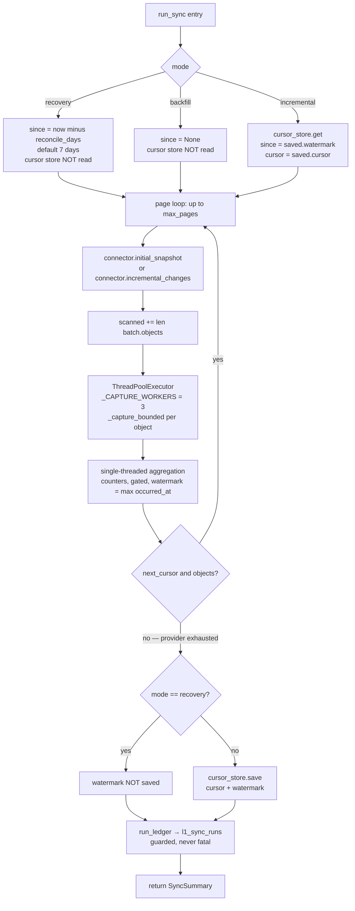
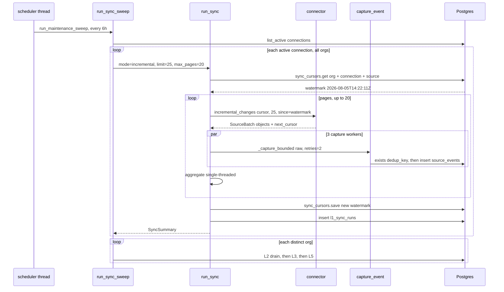

# Acquisition and Sync

*Layer 1 · Knowledge Connectors · `genios_engine/capture/acquire/` — the loop that pulls, and the memory that makes pulling repeatable.*

> **How does the engine pull from a source repeatedly, over months, without missing an object and without processing the same object twice — when the network is flaky, the provider paginates, and one poisonous attachment can kill a whole batch?**

| | |
|---|---|
| **Files** | [cursor_store.py](../../../genios_engine/capture/acquire/cursor_store.py) · 70 lines — [sync_runner.py](../../../genios_engine/capture/acquire/sync_runner.py) · 151 lines |
| **Orchestration above it** | [api/routes.py](../../../genios_engine/api/routes.py) lines 89–205, 736–797 · [platform/scheduler.py](../../../genios_engine/platform/scheduler.py) · 62 lines |
| **Owns** | the resume position, the sync loop, pagination, per-page concurrency, poison isolation, the run ledger |
| **Tables** | `sync_cursors` ([0001_initial.sql](../../../migrations/0001_initial.sql)) · `l1_sync_runs` ([0027_l1_seam.sql](../../../migrations/0027_l1_seam.sql)) · writes into `source_events`, `parked_events` |
| **Emits** | `SyncSummary` — counters plus a list of `GatedEvent`. **The real handoff to L2 is the `source_events` row, not this object** |
| **LLM calls** | zero. Nothing in this path reads a model |
| **Tests** | [tests/test_sync.py](../../../tests/test_sync.py) · 2 tests · 52 lines |

---

## 1 · What this is

A connector knows how to ask a provider for objects. It does not know *where the last conversation
stopped*. `acquire/` is the part that remembers, and the part that turns "give me a page of mail"
into "pull everything that has happened since 14:22 last Tuesday, three pages of it, without falling
over on the one attachment that is malformed".

The module header states the boundary it is defending:

> Acquisition orchestration — pulls batches from a connector (backfill or incremental)
> and runs each raw object through the L1 pipeline. This loop is OURS regardless of
> whether the connector is Composio or native; the connector is just the read primitive.

That sentence is the reason `run_sync` exists at all. Composio has its own sync semantics. So does
Gmail. So would a native IMAP adapter. If the resume logic lived in the connector, every new source
would re-litigate the no-miss guarantee and each would get it slightly differently. Here it is
written once, and `SourceConnector`
([connectors/base.py](../../../genios_engine/capture/connectors/base.py)) is reduced to four
methods that only fetch.

---

## 2 · The cursor — what "resume" actually means

Two values, per `(org_id, connection_id, source)`:

```python
@dataclass
class Cursor:
    cursor: str | None = None            # provider pagination token
    watermark: datetime | None = None    # latest occurred_at seen — resume point
    last_object_id: str | None = None
```

The `CursorStore` protocol docstring is the whole design in three lines:

> Per-connection sync position. Combined with a small overlap + the dedup ledger,
> this is the no-miss backbone: next run resumes from the watermark, re-scans the
> boundary, and duplicates are dropped by dedup — nothing slips through the gap.

**The guarantee is a two-part mechanism, and neither half works alone.** The watermark on its own
would miss anything the provider indexed a second late, or anything whose timestamp ties with the
last object seen. Re-scanning the boundary on its own would re-emit the same events every run. Put
together — deliberately overlap, then let the ledger reject the overlap — and you get an at-least-once
pull collapsed to exactly-once processing.

The overlap is not a fudge factor tuned by hand; it falls out of the provider's own granularity. The
Gmail connector turns the watermark into a query:

```python
query = f"after:{since.strftime('%Y/%m/%d')}" if since else _BACKFILL_WINDOW
```

> Resume from the stored watermark (date-granular → a natural overlap that the
> dedup ledger de-dups) so nothing at the boundary is missed.
> — [connectors/composio.py](../../../genios_engine/capture/connectors/composio.py) line 157

`after:` is date-granular, so a watermark of `2026-08-05T14:22:11Z` re-scans all of 5 August. That is
hours of overlap by construction, and it costs nothing because the second half of the mechanism is a
unique index:

```sql
create unique index if not exists source_events_dedup
    on source_events (org_id, dedup_key);
```

The `dedup_key` is `source:object_type:source_object_id`, optionally suffixed with a
`content_version` for mutable objects
([contracts/source_event.py](../../../genios_engine/contracts/source_event.py)). Landing checks it
before anything expensive happens:

```python
if repo.exists(org_id, event.dedup_key):
    trace.record("landing", "drop", reason_code="duplicate", dedup_key=event.dedup_key)
    return LandingResult(event=event, trace=trace, landed=False)
```

`tests/test_sync.py::test_resync_is_idempotent` is the proof, and its comment says why the count is 3
and not 2:

> every event was already SEEN on the first sync (landed for dedup+audit, even the
> one that was gate-dropped), so the whole re-sync is duplicates — nothing reprocessed.

### 2.1 · `sync_cursors`

```sql
create table if not exists sync_cursors (
    id             text primary key,
    org_id         text not null,
    connection_id  text not null,
    source         text not null,
    cursor         text,
    watermark      timestamptz,
    last_object_id text,
    updated_at     timestamptz not null default now()
);
```

`PostgresCursorStore.save` is a read-then-update-or-insert inside one `engine.begin()` block, keyed
by `(org_id, connection_id, source)`. There is **no unique constraint on that triple** and no
`on conflict` clause, so the upsert is application-level only — see §7. `last_object_id` is in the
dataclass, in the table and in both store implementations, and is never written by `run_sync`.

---

## 3 · `run_sync` — the loop

One function, 89 lines, twelve optional collaborators. Everything is injected: the repo, the parked
store, the trace repo, the payload store, the prepared store, the cursor store, the document job
store, the relevance classifier, the run ledger. Pass none of them and it still runs — that is what
`test_sync.py` does, in memory, with three fake emails.

### 3.1 · The three modes

```python
since = None
if mode == "recovery":
    since = datetime.now(timezone.utc) - timedelta(days=reconcile_days)
elif cursor_store is not None and mode != "backfill":
    saved = cursor_store.get(org_id, connection_id, source)
    if saved is not None:
        cursor = cursor or saved.cursor
        since = saved.watermark
```

| `mode` | `since` becomes | connector method | `sync_mode` stamped on the event | moves the watermark? | purpose |
|---|---|---|---|---|---|
| `backfill` | `None` — the cursor store is **not read** | `initial_snapshot(page_cursor, limit)` | `SyncMode.backfill` | **yes** | first pull; the connector decides its own history window (`newer_than:30d` for Gmail) |
| `incremental` | `saved.watermark` | `incremental_changes(page_cursor, limit, since=since)` | `SyncMode.incremental` | **yes** | steady state — the mode every scheduled sweep and every dashboard button uses |
| `recovery` | `now() − reconcile_days` (default **7 days**) | `incremental_changes(page_cursor, limit, since=since)` | `SyncMode.incremental` | **no** | safety re-scan of a fixed lookback window |

The comment above the block states the intent of the third row:

> mode="recovery" = a safety re-scan of a fixed lookback window (ignores watermark,
> doesn't move it) — anything the primary sync missed lands; dupes drop at dedup.

**Recovery never touching the watermark is the point of recovery.** A run that both re-scans history
*and* commits a new resume point cannot be run safely: if the recovery window ends earlier than the
live watermark (it usually does — 7 days back versus this morning), saving would drag the primary
sync backwards and the next incremental run would re-pull a week. If it ends later, a partial
recovery would silently advance past objects the primary sync had not reached. So the guard is
unconditional:

```python
# recovery is a pure safety re-scan — never regress/advance the primary watermark
if cursor_store is not None and mode != "recovery":
    cursor_store.save(org_id, connection_id, source, cursor=summary.next_cursor,
                      watermark=watermark)
```

Recovery is therefore idempotent *and* free of side effects on the sync position. You can run it
during an incident, twice, and the only thing that changes is that missed events land.

### 3.2 · Pagination

```python
for _page in range(max_pages):
    batch = (connector.initial_snapshot(page_cursor, limit) if mode == "backfill"
             else connector.incremental_changes(page_cursor, limit, since=since))
    ...
    page_cursor = batch.next_cursor
    if not page_cursor or not batch.objects:      # provider exhausted → stop
        break
```

`max_pages` defaults to **1** in the signature and is overridden at every real call site: **20** for
`_sync_connection`, `run_sync_sweep` and `/ingest/all`; **3** for `_sync_source` (the synchronous
dashboard paths, where a user is watching an HTTP response). Combined with `limit` (25 from
`sync_batch_limit`) that is a hard ceiling of 500 objects per connection per sweep, 75 per dashboard
click. The loop stops early on either signal — no token, or an empty page — so a source with nothing
new costs exactly one API call.

### 3.3 · Concurrency: three workers, one aggregator

```python
_CAPTURE_WORKERS = int(os.environ.get("GENIOS_L1_WORKERS", "3"))
```

The reasoning is written directly above it:

> Per-page capture concurrency. Each email's capture is independent (dedup is DB-enforced, the
> watermark is an order-independent max), so we run them in parallel to overlap the per-email DB
> round-trips — the real L1 cost. Kept ≤ the Supabase client cap (L2 uses 5); NO data changes,
> only faster.

and the constant carries its own constraint:

> pool-safe default (Supabase session-mode caps total clients at 15; keep L1+L2 workers + the live
> app well under it). Both are env-overridable — raise once the pooler moves to transaction mode.

**The number 3 is not a throughput choice, it is a connection-budget choice.** Supabase in session
mode caps the pool at 15 clients. L1 takes 3, L2 takes 3 (`GENIOS_L2_WORKERS`,
[context/runner.py](../../../genios_engine/context/runner.py) line 26), the live API keeps the rest.
Raising `GENIOS_L1_WORKERS` without moving the pooler to transaction mode starves the app that
tenants are looking at.

The two safety arguments are exactly the two properties the comment names: dedup is enforced by a
unique index, so two threads racing on the same object produce one row and one duplicate verdict;
and the watermark is a `max()`, which does not care what order it sees its inputs.

The aggregation is deliberately not parallel:

```python
if batch.objects:
    with ThreadPoolExecutor(max_workers=_CAPTURE_WORKERS) as ex:
        captured = list(ex.map(_cap, batch.objects))
else:
    captured = []

for raw, res, err in captured:              # aggregate SINGLE-THREADED → no races on summary
```

`ex.map` returns results in submission order and the pool is closed before the loop begins, so
`SyncSummary` is mutated by exactly one thread. `setattr(summary, res.outcome, ...)` — a
read-modify-write on a plain int — would be a genuine race otherwise.

### 3.4 · Poison isolation

```python
def _capture_bounded(raw: RawObject, *, retries: int, **kw):
    """capture_event with bounded retries. A poison object (still failing after
    retries) returns (None, error) so the caller quarantines it — the batch never
    crashes and nothing is silently lost."""
    err = None
    for _ in range(retries + 1):
        try:
            return capture_event(raw, **kw), None
        except Exception as e:      # noqa: BLE001 — deliberately broad; poison isolation
            err = e
    return None, err
```

Called with `retries=2`, so **three attempts, immediately consecutive — no backoff, no sleep**. When
all three fail, the object becomes a parked row rather than an exception:

```python
if res is None:                          # poison → quarantine, batch continues
    summary.quarantined += 1
    if parked_store is not None:
        parked_store.add(ParkedEvent(
            event_id=f"{raw.source}:{raw.source_object_id}", org_id=org_id,
            source=raw.source, reason_code="poison_quarantine", stage="capture",
            trace=[{"error": type(err).__name__, "detail": str(err)[:200]}]))
    continue
```

`poison_quarantine` is a registered reason code in
[gate/rules.py](../../../genios_engine/capture/gate/rules.py) `REASON_LABELS`, so it renders in the
same review surface as every gate decision. And parking rather than dropping is the house rule,
stated on the contract itself:

> Parked ≠ deleted. An uncertain/unsupported event, reviewable with its reason,
> stage, and trace. Recover re-injects it; retention is L7 policy, not hidden delete.
> — [contracts/parked.py](../../../genios_engine/contracts/parked.py)

Note the `continue`: a quarantined object does **not** advance the watermark. It cannot — the
`SourceEvent` was never built, so there is no `occurred_at` the code trusts. Other objects on the
same page will still push the watermark past it, which is precisely the hole `mode="recovery"` is
there to sweep up: a poison object that never reached `repo.add` has no ledger row, so a later
re-scan re-lands it cleanly.

### 3.5 · `SyncSummary`

> Batch-level 'how much came in, how much filtered where'. Complements the
> per-event trace with an aggregate view.

| Field | Meaning |
|---|---|
| `scanned` | `+= len(batch.objects)` per page — everything the provider returned |
| `emitted` / `dropped` / `parked` / `duplicate` | set by `setattr(summary, res.outcome, …)` from `CaptureResult.outcome` |
| `quarantined` | poison only; counted in the `res is None` branch, never via `setattr` |
| `next_cursor` | the **last** page's `batch.next_cursor` |
| `gated` | every `GatedEvent` produced this run |
| `results` | every `CaptureResult` produced this run |

`scanned == emitted + dropped + parked + duplicate + quarantined` for a run, because every object
takes exactly one of those six branches.

### 3.6 · The run ledger

```python
if run_ledger is not None:                    # l1_sync_runs — observability, never fatal
    try:
        run_ledger(org_id=org_id, connection_id=connection_id, source=source,
                   mode=mode, summary=summary)
    except Exception:       # noqa: BLE001 — a ledger hiccup must not fail the sync
        pass
```

`l1_sync_runs` exists because the numbers used to evaporate:

> per-run ingestion ledger: what each sync scanned/kept/filtered, per connection.
> (run_sync computed this and threw it into a log line.)
> — [0027_l1_seam.sql](../../../migrations/0027_l1_seam.sql)

**The bare `except: pass` is the correct call here and it is worth being explicit about why.** The
ledger is a description of work that has already been committed — `source_events` rows are written,
payloads are stored, the cursor has already advanced. Raising now would fail a sync that succeeded,
and the caller's retry would re-pull a page that is entirely duplicates. Losing one observability row
is strictly cheaper than that. It is the one place in this file where swallowing an exception buys
something.

The writer is `_run_ledger` in routes.py, and it only runs when a real DB is configured
(`if _graph is None: return`).

---

## 4 · The orchestration above `run_sync`

### 4.1 · `_sync_connection` — one connection, error-isolated

```python
def _sync_connection(connection, mode: str, limit: int) -> None:
    """ONE connection's full pass (L1 sync + L2) — background, per-org independent. A sync failure
    is LOGGED with org/connection context (was a bare `except: pass` — the exact 'stuck tenant' an
    on-call gets paged about, engineered to be invisible)."""
```

That parenthesis is the difference between the two `except` blocks in this system. In the ledger,
swallowing is deliberate. Here it was a bug, and the fix was `_log.exception` with `org_id` and
`connection_id` in the message. `_run_l2(connection.org_id)` is called **outside** the try, so a
failed L1 pull still triggers a downstream drain — the previous sweep's emitted rows are still
waiting.

### 4.2 · `run_sync_sweep` — all connections first, then reason once per org

```python
for conn in conns:                            # L1: pull each connection (one bad source ≠ others)
    try:
        run_sync(make_connector_for(conn), ..., max_pages=20, run_ledger=_run_ledger)
        l1_ok += 1
    except Exception:
        l1_err += 1
        _log.exception("auto-sync L1 failed org=%s conn=%s", conn.org_id, conn.connection_id)
orgs = {c.org_id for c in conns}
for org in orgs:                              # L2/L3/L5: once per org, after all its sources pulled
    _run_l2(org)
```

> Full auto-sync sweep across EVERY active connection (all orgs): L1 pull for all connections,
> THEN one L2/L3/L5 pass per org (not per-connection — an org with 3 sources shouldn't re-reason 3×).

**The ordering is the design.** Reasoning per connection would make an org with Gmail, Calendar and
HubSpot pay for three graph rebuilds and three reasoning passes per sweep, two of which are working
from an incomplete picture. Pulling everything first means the single L2 pass sees the Gmail thread
*and* the calendar invite that explains it. `_run_l2` is L2 → L3 → L5 in sequence, each guarded, with
one `_log.exception` around the lot so *"a single org's failure is LOGGED … and never touches another
org"*.

### 4.3 · The sender resolver — a parameter that existed and was never passed

```python
# known-sender resolver: "is this email already a person in the org's graph?" feeds the
# gate's W-01 whitelist so mail from known contacts is never N-code dropped. The resolver
# param existed in run_sync since day one — it was simply never passed, so W-01 never
# fired in production. Cached per org (5 min) — one query per sync, not per email.
_SENDER_CACHE: dict[str, tuple[float, frozenset]] = {}
_SENDER_TTL_S = 300.0
```

`run_sync` has always declared `SenderResolver = Callable[[RawObject], bool]` and always threaded it
into `capture_event(..., sender_known=sk)`. The gate has always had the rule:

```python
if ctx.sender_known:
    return "W-01"                            # known customer/prospect/vendor
```

and W-01 runs *before* the destructive N-codes — *"Whitelist runs BEFORE destructive drops so known
customers/prospects/vendors/important-attachments are never blanket-dropped."* The wiring was the
missing piece. Until `sender_resolver=_sender_resolver_for(org_id)` was added at each call site,
`sender_known` was `False` for every object in production, W-01 could not fire, and mail from a
known customer sent through a `notifications@` relay was N-03'd like any newsletter.

The cache is what makes it affordable. One query per org per five minutes:

```python
hit = _SENDER_CACHE.get(org_id)
if hit is None or now - hit[0] > _SENDER_TTL_S:
    with _graph.engine.connect() as c:
        rows = c.execute(text(
            "select canonical_key from graph_nodes where org_id=:o "
            "and node_type='person' and valid_to is null"), {"o": org_id}).fetchall()
    hit = (now, frozenset(r.canonical_key for r in rows if r.canonical_key))
    _SENDER_CACHE[org_id] = hit
return email in hit[1]
```

A `frozenset` membership test per email, against every live person node in the org. Five minutes of
staleness means a contact created by this very sweep may not whitelist until the next one — acceptable,
because the fallback is the gate's ordinary rules, not a drop.

### 4.4 · The scheduler thread

> In-process automatic data-sync scheduler. A single daemon thread runs a cross-org sync sweep
> (L1 pull → L2/L3/L5) every `sync_interval_hours`, so connected tools stay fresh WITHOUT a button
> click and WITHOUT Celery/Upstash (respects the no-periodic-broker rule — this uses only a plain
> thread + the DB).

| Setting | Default | Effect |
|---|---|---|
| `GENIOS_SCHEDULER_ENABLED` | `true` | `false` (or interval ≤ 0) → thread never starts |
| `GENIOS_SYNC_INTERVAL_HOURS` | `6.0` | tick cadence |
| `GENIOS_SYNC_INITIAL_DELAY_SECONDS` | `45` | *"wait after startup before the first sweep"* |
| `GENIOS_SYNC_BATCH_LIMIT` | `25` | records per connection per sweep |

The loop body is four lines and the important one is the `except`:

```python
except Exception:                 # noqa: BLE001 — a crashed sweep must not kill the loop
    _log.exception("scheduled maintenance sweep crashed")
```

Both waits are `_stop.wait(...)` on a `threading.Event`, not `time.sleep`, so shutdown is immediate
rather than up to six hours. Started from `main.py`'s lifespan and only when a real DB is configured
(*"no point sweeping in-memory dev"*), stopped on shutdown.

The multi-instance caveat is in the module docstring and is honest about the cost:

> if the engine is scaled to >1 instance each runs its own sweep. That's safe for
> data integrity (source_events dedup makes ingestion idempotent) but wasteful; for a multi-instance
> deploy set GENIOS_SCHEDULER_ENABLED=false and drive /ingest/all from a single external cron instead.

That is the dedup ledger paying for itself a second time — the property that makes boundary overlap
free also makes a duplicated scheduler merely wasteful rather than corrupting. `run_maintenance_sweep`
is what the thread calls; the sync sweep is its first step, followed by card lifecycle, retention
purges, the executive sweep, distribution, calibration and graph maintenance — only the first is in
scope here.

### 4.5 · Every entry point into `run_sync`

| Caller | Auth | `mode` | `max_pages` | L1 | L2/L3/L5 |
|---|---|---|---|---|---|
| `platform/scheduler.py` → `run_maintenance_sweep` → `run_sync_sweep` | none — daemon thread | `incremental` | 20 | synchronous, per connection | once per org, after all pulls |
| `POST /ingest/all` | `require_internal` (x-internal-token) | query param, default `incremental` | 20 | synchronous | `BackgroundTasks`, per org |
| `POST /sync/{connection_id}` | tenant JWT | query param, default `incremental` | 20 | `BackgroundTasks` → `_sync_connection` | in the same background task |
| `POST /integrations/{tool}/sync` | tenant JWT | `incremental`, hard-coded in `_sync_source` | 3 | **synchronous** — returns real counts | `BackgroundTasks` |
| `POST /integrations/sync-all` | tenant JWT | `incremental` | 3 | `BackgroundTasks` → `_sync_all_bg` | after all sources |

`/ingest/all` is the only way to reach `mode="recovery"` today, and only with the internal token —
*"a tenant can't trigger a cross-org run or learn which orgs exist."*

---

## 5 · Diagrams

### 5.1 · One `run_sync` call



### 5.2 · A scheduled sweep, end to end



---

## 6 · A worked recovery pass

**Situation.** Org `org_acme`, one Gmail connection `conn_7f3`. The stored watermark is
`2026-08-05T14:22:11Z`. An operator suspects the 4 August sweep dropped mail — the provider was
returning 5xx that morning. Today is 2026-08-07.

```
POST /ingest/all?mode=recovery&limit=25
x-internal-token: <internal>
```

**Step 1 — the window.** `mode == "recovery"`, so the first branch fires and the cursor store is
never read:

```
since = 2026-08-07T09:14:00Z − timedelta(days=7) = 2026-07-31T09:14:00Z
cursor = None        (the caller passed none, and saved.cursor was never consulted)
sync_mode = SyncMode.incremental      # "recovery" is not "backfill"
```

**Step 2 — page one.** `incremental_changes(None, 25, since=2026-07-31T09:14:00Z)` becomes the Gmail
query `after:2026/07/31`. Twenty-five objects come back with `next_cursor="pt_A2f9"`.
`summary.scanned = 25`.

Three worker threads run `_capture_bounded` across them. The aggregation loop then walks the
results in submission order:

| Outcome | Count | Why |
|---|---|---|
| `duplicate` | 22 | already in `source_events` from the 5 and 6 August sweeps — landing short-circuits before preprocess, before the gate, before any storage write |
| `emitted` | 1 | `19a4f2c…` — a message from `priya@acme.com` timestamped `2026-08-04T11:03Z`, never landed because that sweep 5xx'd mid-page. `sender_resolver` returns `True` (Priya is a live `person` node) → gate returns **W-01**, whitelisted past the N-codes → route `needs_extraction`, lane `P1` |
| `dropped` | 1 | `no-reply@news.io` → **N-03** |
| `quarantined` | 1 | attachment `19b81ac…::att_2`, a PDF whose bytes fail extraction; three consecutive attempts raise, `_capture_bounded` returns `(None, err)` |

The quarantined object becomes:

```python
ParkedEvent(event_id="gmail:19b81ac…::att_2", org_id="org_acme", source="gmail",
            reason_code="poison_quarantine", stage="capture",
            trace=[{"error": "UnicodeDecodeError", "detail": "'utf-8' codec can't decode byte …"}])
```

and is visible immediately at `GET /parked?reason_code=poison_quarantine`.

**Step 3 — page two.** `incremental_changes("pt_A2f9", 25, since=…)` returns 4 objects and
`next_cursor=None`. All four are duplicates. `summary.scanned = 29`. The loop breaks on
`if not page_cursor` — 18 of the 20 permitted pages unused.

**Step 4 — the watermark is not touched.** `mode == "recovery"`, so `cursor_store.save` is skipped
entirely. `sync_cursors.watermark` for `(org_acme, conn_7f3, gmail)` is still
`2026-08-05T14:22:11Z`. The in-memory `watermark` local did climb to `2026-08-06T18:41Z` during
aggregation — it is simply discarded. **Had it been saved, the next incremental sweep would have
started from a point this pass never verified.**

**Step 5 — the ledger.** `_run_ledger` inserts one row:

| run_id | org_id | connection_id | source | mode | scanned | emitted | dropped | parked | duplicate | quarantined |
|---|---|---|---|---|---|---|---|---|---|---|
| `run_…` | `org_acme` | `conn_7f3` | `gmail` | `recovery` | 29 | 1 | 1 | 0 | 26 | 1 |

**Step 6 — downstream.** `/ingest/all` queues `_run_l2("org_acme")` as a background task. L2's drain
query selects `source_events` rows with `outcome='emitted'` that have no extraction result — the one
recovered message is picked up, ordered `P1` first. The recovery did its job: one real event that the
primary sync lost is now in the graph, the primary sync position is untouched, and 26 re-scanned
objects cost one `select 1` each.

---

## 7 · Gaps and hazards

**A failure between the ledger write and the payload write is a permanent, silent loss counted as
`duplicate`.** This is the one genuine hole in the no-miss story and it is worth stating precisely.
In [pipeline.py](../../../genios_engine/capture/pipeline.py) the order is:

```python
if kept and payload_store is not None:
    event.payload_ref = new_id("pay")
repo.add(event, outcome=outcome, route=gate.route, triage_lane=lane, ...)   # line 198
if kept and payload_store is not None:
    payload_store.put(payload_id=event.payload_ref, org_id=org_id,
                      event_id=event.event_id, content=json.dumps(raw.raw, default=str))
```

If `payload_store.put` raises, `_capture_bounded` retries — but the retry now hits
`repo.exists(...) → True` and returns `outcome="duplicate"` **without raising**, so nothing is
quarantined. The `source_events` row survives with `outcome='emitted'` and no `raw_payloads` row,
and L2's drain inner-joins `raw_payloads` ([context/runner.py](../../../genios_engine/context/runner.py)
line 109), so the event is invisible to L2 forever. `mode="recovery"` cannot rescue it either,
because dedup is keyed on the ledger row that does exist. The observable symptom is a `duplicate`
count that is one too high.

**Stale page tokens are stored across differing queries.** When `max_pages` is exhausted with pages
remaining, `summary.next_cursor` is a live provider token and it is saved. The next incremental run
does `cursor = cursor or saved.cursor` *and* `since = saved.watermark`, then passes both — a token
minted against `after:2026/08/05` is replayed against `after:2026/08/06`. Provider page tokens are
generally query-scoped; the behaviour is provider-defined, not guaranteed. It only triggers on a
connection with more than 500 pending objects in one sweep.

**Test coverage is two tests.** `tests/test_sync.py` covers counters, `next_cursor` and re-sync
idempotence, all in memory with `cursor_store=None`. **Nothing tests the cursor round-trip, the mode
table, the recovery no-save guard, pagination, `_capture_bounded`, or the quarantine branch.** Every
behaviour in §3.1–§3.4 is verified by reading only.

The rest, compactly:

| # | Gap | Detail |
|---|---|---|
| 1 | No unique constraint on `sync_cursors (org_id, connection_id, source)` | `save` is select-then-insert-or-update with no `on conflict`, so two concurrent sweeps for one connection can insert two rows; `get` uses `.first()` and one silently wins |
| 2 | `_SENDER_CACHE` is unsynchronised | the closure is called from all three capture threads; on a cold/expired entry up to three threads each open a connection and run the `graph_nodes` query. Benign, but three clients against a 15-client budget at the busiest moment |
| 3 | The resolver does not use `norm_email` | it does `(raw.actor_email or "").strip().lower()` and compares against `canonical_key`, which `platform.identity.norm_email` mints *with* the `+tag` suffix stripped — so `priya+deals@acme.com` never matches the node keyed `priya@acme.com` and W-01 cannot fire |
| 4 | Quarantined rows are not recoverable via `/parked/{event_id}/recover` | the quarantine path invents `event_id=f"{raw.source}:{raw.source_object_id}"`, not the `evt_…` id `to_source_event` mints, so the payload lookup finds nothing and only the parked status flips. Re-running `mode="recovery"` is the real path |
| 5 | `retries=2` has no backoff | three attempts fire back to back with no sleep — defends a deterministic parse failure, not a rate limit or a stalled socket |
| 6 | `SyncMode.recovery` is declared and never used | `run_sync` maps `backfill` or `incremental` only, so `source_events.sync_mode` can never hold `'recovery'` |
| 7 | Recovery is never scheduled | no caller passes `mode="recovery"`; `reconcile_days` is never overridden. The safety net is manual-only, via `/ingest/all?mode=recovery` |
| 8 | `l1_sync_runs` fills 11 of 13 columns | `started_at` and `error` are declared and never written; a *failed* sync writes no row at all — the ledger is a record of successes |
| 9 | The `L2 uses 5` comment is stale | `GENIOS_L2_WORKERS` defaults to `3`. The budget is safer than the comment claims, not tighter |
| 10 | `SyncSummary.gated` / `.results` are accumulated and discarded | every caller reads only the integer counters, yet up to 500 `GatedEvent` and 500 `CaptureResult` objects are held for the life of a sweep — the peak memory of an L1 pass, for nothing |

---

## 8 · Map

| Kind | Item |
|---|---|
| Source | [capture/acquire/cursor_store.py](../../../genios_engine/capture/acquire/cursor_store.py) — `Cursor`, `CursorStore`, `InMemoryCursorStore`, `PostgresCursorStore` |
| Source | [capture/acquire/sync_runner.py](../../../genios_engine/capture/acquire/sync_runner.py) — `SyncSummary`, `_capture_bounded`, `run_sync`, `_CAPTURE_WORKERS`, `SenderResolver` |
| Source | [capture/pipeline.py](../../../genios_engine/capture/pipeline.py) — `land_raw_object`, `capture_event`, `CaptureResult` |
| Source | [capture/connectors/base.py](../../../genios_engine/capture/connectors/base.py) — `RawObject`, `SourceBatch`, `SourceConnector` |
| Source | [capture/landing/pg_repository.py](../../../genios_engine/capture/landing/pg_repository.py) — dedup `exists` + `on conflict do nothing` insert |
| Source | [capture/parked/store.py](../../../genios_engine/capture/parked/store.py) — `ParkedStore`, `parked_from_trace` |
| Source | [platform/scheduler.py](../../../genios_engine/platform/scheduler.py) — `_loop`, `start_scheduler`, `stop_scheduler` |
| Source | [platform/wiring.py](../../../genios_engine/platform/wiring.py) `make_cursor_store` — Postgres when `DATABASE_URL` is set, else in-memory |
| Orchestration | [api/routes.py](../../../genios_engine/api/routes.py) — `_sender_resolver_for`, `_SENDER_CACHE`, `_run_ledger`, `_run_l2`, `_sync_connection`, `run_sync_sweep`, `run_maintenance_sweep`, `_sync_source`, `_sync_all_bg` |
| Table | `sync_cursors` — [0001_initial.sql](../../../migrations/0001_initial.sql) |
| Table | `source_events` + unique `source_events_dedup (org_id, dedup_key)` — [0001_initial.sql](../../../migrations/0001_initial.sql) |
| Table | `l1_sync_runs` — [0027_l1_seam.sql](../../../migrations/0027_l1_seam.sql) |
| Table | `parked_events` — [0002_l1_tables.sql](../../../migrations/0002_l1_tables.sql) |
| Endpoint | `POST /ingest/all` · `POST /sync/{connection_id}` · `POST /integrations/{tool}/sync` · `POST /integrations/sync-all` · `GET /parked` · `POST /parked/{event_id}/recover` |
| Settings | `GENIOS_L1_WORKERS` (3) · `GENIOS_L2_WORKERS` (3) · `GENIOS_SCHEDULER_ENABLED` (true) · `GENIOS_SYNC_INTERVAL_HOURS` (6.0) · `GENIOS_SYNC_INITIAL_DELAY_SECONDS` (45) · `GENIOS_SYNC_BATCH_LIMIT` (25) — [platform/config.py](../../../genios_engine/platform/config.py) |
| Tests | [tests/test_sync.py](../../../tests/test_sync.py) — `test_sync_counts_and_cursor`, `test_resync_is_idempotent` |
