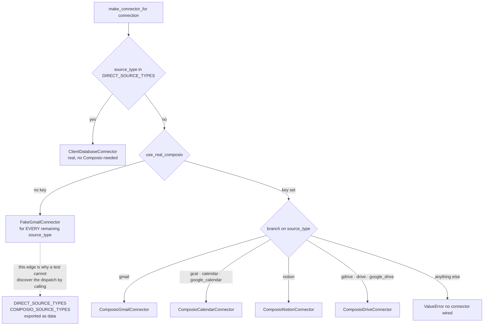

# The Fake Connector

*Layer 1 · Knowledge Connectors · `genios_engine/capture/connectors/fake.py`*

> Forty-seven lines that return one hard-coded email. Why does the codebase need them, and what does the rest of the system have to do differently because they exist?

| | |
|---|---|
| **File** | [fake.py](../../../genios_engine/capture/connectors/fake.py) · 47 lines · zero imports beyond `datetime` and `.base` |
| **Class** | `FakeGmailConnector` — `source = "gmail"` |
| **Emits** | exactly one `RawObject`, `source_object_id="msg_18c4a9e2f7"`, always |
| **Selected when** | `not get_settings().use_real_composio`, i.e. `GENIOS_COMPOSIO_API_KEY` is empty |
| **Consequence it forces** | `DIRECT_SOURCE_TYPES` and `COMPOSIO_SOURCE_TYPES` exported as **data**, because the dispatch cannot be discovered by calling `make_connector_for` |
| **Used by** | [tests/test_landing.py](../../../tests/test_landing.py) · [tests/test_pipeline.py](../../../tests/test_pipeline.py) · `POST /dev/ingest-sample` |
| **Entry point** | [Layer 1 Overview](../00-Overview.md) |

---

## 1 · What it is

```python
class FakeGmailConnector:
    """Deterministic fake for dev/tests — no live Composio/Google needed.
    Same shape a real connector produces, so the spine is exercised end to end."""
```

Two claims in that docstring, and the second one is the whole design.

A stub that returned `[]` would also need no network. What makes this class useful is that it
returns **an object indistinguishable in shape from what `ComposioGmailConnector._to_objects`
produces** — same `RawObject` dataclass, same `source`/`object_type` pair, same `raw` keys the gate
reads. So every stage after the connector runs for real: `to_source_event` computes a real dedup
key, `preprocess` masks real text, `run_gate` evaluates real rules, `triage_lane` scores real
regexes, and a real `GatedEvent` comes out the far end.

**Layer 1's contract is `RawObject` in, `GatedEvent` out. The fake is a legitimate implementation of
the left-hand side, which is precisely why the right-hand side can be tested without a network.**
That is the point of the protocol in [base.py](../../../genios_engine/capture/connectors/base.py):

> *One interface, every source implements. Composio sits BEHIND this (auth +
> data delivery only); a native adapter can replace any one connector without
> changing landing/gate/graph. Our contract stays ours.*

The fake is the cheapest possible proof of that sentence. If the pipeline could tell the difference
between it and `ComposioGmailConnector`, the abstraction would be leaking.

---

## 2 · The sample object, in full

```python
def _sample(self) -> list[RawObject]:
    return [
        RawObject(
            source="gmail",
            object_type="email_message",
            source_object_id="msg_18c4a9e2f7",
            occurred_at=datetime(2026, 7, 28, 9, 14, 22, tzinfo=timezone.utc),
            actor_email="priya@acme.com",
            actor_type="external_contact",
            parent_object_id="thread_18c4a",
            raw={
                "subject": "Revised contract",
                "snippet": "Budget is approved. Can you send the revised contract by Friday?",
            },
        ),
    ]
```

Every field in it is doing work, and none of it is arbitrary:

| Field | Value | What it exercises downstream |
|---|---|---|
| `source_object_id` | `msg_18c4a9e2f7` | fixed → `dedup_key` is `gmail:email_message:msg_18c4a9e2f7`, asserted verbatim in `test_landing.py` |
| `occurred_at` | a fixed 2026 UTC instant | the watermark advance in `run_sync` is deterministic |
| `actor_email` | `priya@acme.com` | a real-looking external domain → `_linkage_hints` emits `{"type": "company_domain", "value": "acme.com"}` and is **not** filtered by `_FREE_MAIL` |
| `actor_type` | `external_contact` | not `agent`, so the `W-03` whitelist does not fire and S1's hard rules actually run |
| `parent_object_id` | `thread_18c4a` | → the second linkage hint, `{"type": "thread", …}` |
| `raw.subject` | `Revised contract` | prepended to the body and masked with it in `preprocess` |
| `raw.snippet` | `Budget is approved. Can you send the revised contract by Friday?` | the sentence carries a **deadline** word (`Friday`) and a **question mark** → `triage_lane` scores 25 + 10 = 35 → lane **P1**, so the triage code path is genuinely traversed rather than defaulting to `P3` |

The sender is not `no-reply@…`, there are no `labelIds`, no `headers`, no `document` block — so
`hard_rule` walks its full list and returns `None`, and the event emits. Change any one of those and
the sample stops being an end-to-end exercise: `test_pipeline.py` keeps a separate hand-built
`RawObject` with `no-reply@promo.io` precisely because the fake is deliberately the *passing* case.

```python
assert stages == ["landing", "preprocess", "S0", "S1", "S2", "triage", "emit"]
```

That assertion in `test_full_pipeline_emits_gated_event_with_full_trace` is the fake's real job:
seven stages, in order, with no network.

### 2.1 · The three protocol methods

```python
def validate_connection(self) -> bool:
    return True

def initial_snapshot(self, cursor=None, limit=50) -> SourceBatch:
    return SourceBatch(objects=self._sample(), next_cursor="cursor_end")

def incremental_changes(self, cursor=None, limit=50, since=None) -> SourceBatch:
    return SourceBatch(objects=self._sample(), next_cursor=cursor)

def fetch_content(self, object_ref: str) -> dict[str, Any]:
    return {"body": "Budget is approved. Can you send the revised contract by Friday?"}
```

`limit` and `since` are accepted and ignored — the fake has one object, so paging and watermarks
have nothing to act on. The two cursor behaviours differ, and the difference is visible in a dev
sweep: `incremental_changes` **echoes** the cursor it was handed (so a first call with `None` gives
`next_cursor=None` and `run_sync` breaks after one page), while `initial_snapshot` returns the
constant `"cursor_end"` (so `run_sync`'s loop never sees a falsy cursor and drains all
`max_pages=20` iterations, scanning 20 and emitting 1 with 19 duplicates). Harmless in dev,
occasionally confusing when reading a `SyncSummary`.

---

## 3 · How the wiring reaches it

The switch is declared at the top of [wiring.py](../../../genios_engine/platform/wiring.py):

```python
# The switch between REAL and dev is here, driven entirely by .env — no code change.
#   DATABASE_URL set   → Postgres/Supabase repo   (else in-memory)
#   COMPOSIO keys set  → real Composio Gmail       (else fake connector)
```

and implemented as a single early return inside `make_connector_for`:

```python
def make_connector_for(connection) -> SourceConnector:
    s = get_settings()
    st = connection.source_type
    # Client's own database — no Composio; read-only pull → structured route.
    if st in DIRECT_SOURCE_TYPES:
        ...
        return ClientDatabaseConnector(...)
    if not s.use_real_composio:
        from genios_engine.capture.connectors.fake import FakeGmailConnector
        return FakeGmailConnector(org_id=connection.org_id,
                                  connection_id=connection.connection_id)
    key, uid = s.composio_api_key, connection.composio_user_id
    if st == "gmail":
        ...
```

`use_real_composio` is one line in [config.py](../../../genios_engine/platform/config.py):

```python
@property
def use_real_composio(self) -> bool:
    return bool(self.composio_api_key)
```

Two structural facts follow from where that check sits.

**The database branch is checked first.** A `postgres`/`database`/`mysql` connection gets a real
`ClientDatabaseConnector` even with no Composio key at all, because it needs no broker. The fake
only ever substitutes for the *Composio* half of the dispatch.

**The fallback is unconditional across source types.** In dev, a connection whose `source_type` is
`notion`, `gcal`, or `gdrive` receives a `FakeGmailConnector` whose `source` attribute is `"gmail"`.
The events it emits are `gmail`/`email_message`; only the cursor-store key follows the connection
(`run_sync(..., source=connection.source_type, ...)`).



---

## 4 · The consequence: the dispatch had to become data

This is the part worth carrying away. Because the fallback swallows every source type, **calling
`make_connector_for` in a test environment tells you nothing about which connectors are really
wired.** A test asserting "connecting Notion produces a Notion connector" would pass by accident in
CI while returning a Gmail fake, and would keep passing after someone deleted the Notion branch.

The fix is to publish the branch table alongside the branches, and compare *that*:

```python
# The dispatch table make_connector_for branches on, as DATA so it can be compared with
# the registry. In dev (no Composio key) the function falls back to a fake connector for
# every source_type, so a test cannot discover the real dispatch by calling it — these
# two names make the agreement checkable instead of hopeful.
DIRECT_SOURCE_TYPES: frozenset[str] = frozenset({"postgres", "database", "mysql"})
COMPOSIO_SOURCE_TYPES: frozenset[str] = frozenset({
    "gmail", "gcal", "calendar", "google_calendar", "notion",
    "gdrive", "drive", "google_drive",
})
```

The other half of the comparison is derived from the source registry, never hand-listed:

```python
IMPLEMENTED_SOURCE_TYPES: frozenset[str] = BUILDABLE_SOURCES
```

> *Source types make_connector_for can actually build. The integrations UI reads this
> so a "Connect" button never starts an OAuth flow that ends in a 502 — advertising a
> connector that raises ValueError was a customer-visible lie.*

`BUILDABLE_SOURCES` in [source_registry.py](../../../genios_engine/capture/source_registry.py) is a
comprehension over the descriptor index, **canonical ids and aliases alike**:

```python
BUILDABLE_SOURCES: frozenset[str] = frozenset(
    key for key, d in _BY_ID.items() if d.buildable)
```

which is why `COMPOSIO_SOURCE_TYPES` must list `calendar` and `google_calendar` as well as `gcal` —
the aliases are on `SourceDescriptor("gcal", …, aliases=("calendar", "google_calendar"))` and land
in the frozenset as first-class keys.

The assertion that ties it together is in
[tests/test_source_registry.py](../../../tests/test_source_registry.py):

```python
def test_buildable_matches_the_connector_dispatch() -> None:
    """`buildable=True` and the branches in make_connector_for must agree.

    Flipping buildable without wiring a branch advertises a Connect button that ends in
    'no connector wired'; wiring a branch without flipping buildable hides a working
    integration from the UI. In dev the function falls back to a fake connector for every
    source_type, so this compares the dispatch table instead of calling it.
    """
    assert DIRECT_SOURCE_TYPES | COMPOSIO_SOURCE_TYPES == BUILDABLE_SOURCES
    assert IMPLEMENTED_SOURCE_TYPES == BUILDABLE_SOURCES
```

Both sets currently hold the same eleven keys:

| Set | Members |
|---|---|
| `DIRECT_SOURCE_TYPES` | `postgres`, `database`, `mysql` |
| `COMPOSIO_SOURCE_TYPES` | `gmail`, `gcal`, `calendar`, `google_calendar`, `notion`, `gdrive`, `drive`, `google_drive` |
| `BUILDABLE_SOURCES` | the union of the two, derived from `buildable=True` descriptors + aliases |

**Adding a connector is therefore three edits that a test forces you to make together:** flip
`buildable` on the descriptor, add the `source_type` to the right dispatch set, and wire the branch.
Miss the middle one and the test fails; miss the last one and production raises
`ValueError: no connector wired for source_type=…`.

This is the same drift the registry's own docstring was written against:

> *Four hand-maintained lists drift* … *Adding a source is now one descriptor here. The four
> old names are derived views over this module, so no call site changed.*

---

## 5 · Worked example — a dev sweep, end to end

`.env` empty. `get_settings()` reports `use_real_db=False`, `use_real_composio=False`.
`GET /config` returns `{"env": "dev", "composio": "fake", "database": "in-memory", …}`.

`POST /dev/ingest-sample` runs the shortest possible version of the spine:

```python
conn = FakeGmailConnector()
out = []
for o in conn.incremental_changes().objects:
    res = capture_event(o, org_id=conn.org_id, connection_id=conn.connection_id,
                        repo=_demo_repo)
```

`conn.org_id` is `"org_demo"` and `conn.connection_id` is `"con_demo"` — the constructor defaults,
used here because no `Connection` row exists. What happens to the single object:

| Stage | Result |
|---|---|
| `to_source_event` | `dedup_key = "gmail:email_message:msg_18c4a9e2f7"`, `source_family = "communication"` (from the `gmail` descriptor), `actor = Actor(type="external_contact", email="priya@acme.com")` |
| `land_raw_object` | `repo.exists` → `False` → `landing / pass`. Nothing is written yet — *"landing = normalize + dedup check only (writing is deferred to after the gate)"* |
| structured check | `has_mapping("gmail", "email_message")` → `False` → unstructured lane |
| `preprocess` | text is `"Revised contract\n\nBudget is approved. Can you send the revised contract by Friday?"` — subject and body masked together |
| gate `S0` | `in_scope` default `True` → `pass` |
| gate `S1` | no `W` code (`sender_known=False`, `actor.type != "agent"`, `gmail` is not deliberate); `hard_rule` finds no `Auto-Submitted`, no OOO phrase, no `no-reply` match, no `Precedence`, no `List-Unsubscribe`, non-empty body → `None` → `pass` |
| gate `S2` | `relevance` is `None` in this route → the default branch → `route="needs_extraction"` |
| `triage_lane` | `_DEADLINE` matches `friday` (+25), `"?"` present (+10) → 35 → **`P1`** |
| ledger | `repo.add(event, outcome="emitted", route="needs_extraction", triage_lane="P1", …)` |
| `emit` | `GatedEvent(route="needs_extraction", triage_lane="P1", linkage_hints=[company_domain acme.com, thread thread_18c4a])` |

The endpoint returns the full trace, and `test_duplicate_stops_at_landing` shows the second call
through the same repo produces `["landing"]` and nothing else — the fake's fixed
`source_object_id` is what makes idempotency demonstrable in a unit test.

---

## 6 · What the fake does **not** exercise

Everything below is untested by any code path that goes through `FakeGmailConnector`. This list is
the honest boundary of "the spine is exercised end to end".

| Not exercised | Why it matters |
|---|---|
| **Composio itself** | `ComposioExec.execute`, the `data`-unwrapping (`res.get("data", {})`), auth, `dangerously_skip_version_check`, rate limits, and every field path the connector modules describe as *"finalized against the real response on first live run"* |
| **Response mapping** | `_to_objects`, `_to_raw`, `_walk`, `_header`, `_parse_ts`, `_parse_start`, `_title`, `_raw_bytes` — the fake starts *after* mapping, so a mapping bug is invisible to it |
| **The structured lane** | the fake's object has no registry mapping, so `S1.5 short_circuit`, `apply_mapping`, `apply_relations` and the `route="structured"` branch never run. `test_pipeline.py` and `test_structured.py` reach them only by passing `is_structured=True` by hand |
| **`content_version`** | the fake sets none, so the mutable-object dedup rule — the calendar reschedule, the CRM `proposal→won` — is covered by `test_structured_dedup.py` against connector internals, not by any fake-driven run |
| **Documents and OCR** | no `raw["document"]`, so `DOC-02` / `DOC-04` parking, `process_document`, and the `document_jobs` write are never touched. `FakeOcr` in [documents/fake.py](../../../genios_engine/capture/documents/fake.py) is the separate fake for that seam |
| **Paging and watermarks** | `limit` and `since` are ignored; `next_cursor` is a constant. Multi-page drainage, boundary overlap, and `mode="recovery"` are untested through it |
| **Attachments and threads** | one message, one thread id, no `email_attachment` children |
| **Noise** | one clean email. Every `N-` code, the `W-` whitelist, and the relevance classifier are reached only by hand-built `RawObject`s |
| **Concurrency** | `run_sync`'s `ThreadPoolExecutor` over `_CAPTURE_WORKERS` has one item to schedule |
| **Poison isolation** | the fake cannot raise, so `_capture_bounded`'s retry-then-quarantine path and the `poison_quarantine` parked reason are never hit |
| **Postgres** | in dev the repos are in-memory, so unique-constraint dedup, `raw_payloads` encryption, `prepared_content`, `event_trace` and `document_jobs` writes are exercised only by the DB-backed tests |

**And the sharpest one:** the fake is a *Gmail* fake. There is no `FakeCalendarConnector`,
`FakeNotionConnector`, or `FakeDriveConnector`. In a keyless environment every connection collapses
to the same email, which is exactly the ambiguity `DIRECT_SOURCE_TYPES` and `COMPOSIO_SOURCE_TYPES`
exist to work around — and the reason a per-source fake, returning that source's real object shape,
would be the next useful thing to add here.

---

## 7 · Gaps

- **`org_id` and `connection_id` are stored but never used.** `FakeGmailConnector.__init__` keeps
  both, `make_connector_for` passes them, and nothing in the class reads them — the `RawObject` is
  built from `_sample()` with no reference to either. They exist so `/dev/ingest-sample` can read
  `conn.org_id` off the connector rather than inventing a constant.
- **`source = "gmail"` is fixed.** A dev sweep of a Notion connection writes `gmail` events under a
  `notion` cursor key. Nothing checks the two agree.
- **`initial_snapshot` returns a non-`None` cursor forever.** A dev backfill therefore always runs
  the full `max_pages` loop and reports `scanned=20, emitted=1, duplicate=19`, which reads like a
  bug in the summary rather than a property of the fake.
- **No fake for the other three connectors.** See §6.

---

## 8 · Map

| Thing | Where |
|---|---|
| The fake connector | [capture/connectors/fake.py](../../../genios_engine/capture/connectors/fake.py) |
| `RawObject` / `SourceBatch` / `SourceConnector` protocol | [capture/connectors/base.py](../../../genios_engine/capture/connectors/base.py) |
| The dispatch and the fallback | [platform/wiring.py](../../../genios_engine/platform/wiring.py) |
| `use_real_composio`, `use_real_db`, `use_real_llm` | [platform/config.py](../../../genios_engine/platform/config.py) |
| `BUILDABLE_SOURCES`, `SourceDescriptor` | [capture/source_registry.py](../../../genios_engine/capture/source_registry.py) |
| The pipeline the fake drives | [capture/pipeline.py](../../../genios_engine/capture/pipeline.py) |
| Sweep loop | [capture/acquire/sync_runner.py](../../../genios_engine/capture/acquire/sync_runner.py) |
| Gate + triage | [capture/gate/gate.py](../../../genios_engine/capture/gate/gate.py) · [capture/triage/triage.py](../../../genios_engine/capture/triage/triage.py) |
| The OCR-side fake | [capture/documents/fake.py](../../../genios_engine/capture/documents/fake.py) |
| `/dev/ingest-sample`, `/config` | [api/routes.py](../../../genios_engine/api/routes.py) |

**Tests:** [tests/test_landing.py](../../../tests/test_landing.py) — dedup key, `landed` semantics,
stability across re-sync. [tests/test_pipeline.py](../../../tests/test_pipeline.py) — the seven-stage
trace, the duplicate short-stop. [tests/test_source_registry.py](../../../tests/test_source_registry.py)
— `test_buildable_matches_the_connector_dispatch`, the assertion that exists because of the fallback.

**Endpoints:** `POST /dev/ingest-sample` (no auth, no config), `GET /config` (reports
`"composio": "fake"` when the key is absent).

**Sibling documents:** [The Connector Contract](01-The-Connector-Contract.md) ·
[The Connector Factory](03-The-Connector-Factory.md) · [Gmail Connector](04-Gmail-Connector.md) ·
[The Calendar and Drive Connectors](05-Calendar-and-Drive-Connectors.md) ·
[The Notion and Client-Database Connectors](06-Notion-and-Database-Connectors.md) ·
[Acquisition and Sync](07-Acquisition-and-Sync.md)
