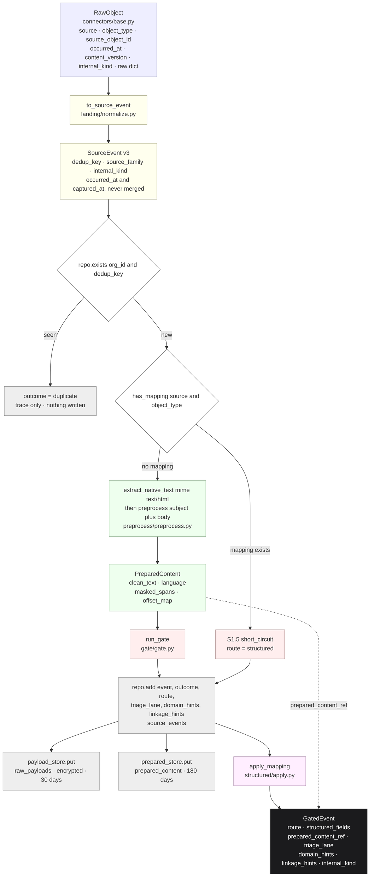

# Normalization and Extraction — Overview

*Layer 1 · `genios_engine/capture/` · where a provider's shape stops mattering*

> **What does a raw object have to become before the gate is allowed to judge it — and which
> of the two lanes does it take?**

| | |
|---|---|
| **Packages** | [landing/](../../../genios_engine/capture/landing/) · [preprocess/](../../../genios_engine/capture/preprocess/) · [documents/](../../../genios_engine/capture/documents/) · [structured/](../../../genios_engine/capture/structured/) |
| **Plus two stores** | [payload_store.py](../../../genios_engine/capture/payload_store.py) · 67 lines — encrypted raw, 30-day TTL |
| | [prepared_store.py](../../../genios_engine/capture/prepared_store.py) · 80 lines — masked text + offset map, 180-day TTL |
| **Owns** | `RawObject` → `SourceEvent`; the dedup identity; PII masking; the offset map; typed field mapping; everything persisted at the seam |
| **Emits** | `SourceEvent` → the gate · `PreparedContent` → `prepared_content` · `structured_fields` → `GatedEvent` |
| **Lanes** | **Two**, chosen by one dict lookup: `has_mapping(source, object_type)` |
| **Tables** | `source_events` · `raw_payloads` · `prepared_content` · `document_jobs` |
| **Migrations** | [0001_initial.sql](../../../migrations/0001_initial.sql) · [0003_source_event_outcome.sql](../../../migrations/0003_source_event_outcome.sql) · [0027_l1_seam.sql](../../../migrations/0027_l1_seam.sql) · [0035_l1_internal_knowledge.sql](../../../migrations/0035_l1_internal_knowledge.sql) |
| **Orchestrated by** | [pipeline.py](../../../genios_engine/capture/pipeline.py) · 227 lines — nothing here calls anything else here |
| **LLM calls** | **Zero.** There is no model client in this package |

---

## 1 · What this sub-layer owns, and what it refuses

The spec calls this stage the **Content Pipeline** and the **Event Pipeline**. In the code there
is no module by either name. What exists is four small packages that the spine
[pipeline.py](../../../genios_engine/capture/pipeline.py) calls in a fixed order, and the two
"pipelines" are two **branches** through that one spine.

It **owns** four transformations:

| Transformation | Where | Determinism |
|---|---|---|
| provider object → one envelope | [landing/normalize.py](../../../genios_engine/capture/landing/normalize.py) | fully deterministic except `event_id` and `captured_at` |
| bytes / HTML → prose | [documents/native.py](../../../genios_engine/capture/documents/native.py) | deterministic; **never raises** |
| prose → PII-masked prose + an offset map back to source characters | [preprocess/preprocess.py](../../../genios_engine/capture/preprocess/preprocess.py) | deterministic, regex + Luhn |
| typed source object → target fields and graph edges | [structured/apply.py](../../../genios_engine/capture/structured/apply.py) | deterministic table lookup |

It **refuses** three things:

- **It does not interpret.** `apply_mapping` says so directly: *"Deterministic, no LLM. Unknown
  source fields are ignored (never guessed)."*
- **It does not decide whether an event matters.** That is the gate ([ESQE](../04-ESQE/00-Overview.md)),
  and even the gate only decides whether it is *safe to pass on*.
- **It does not write the event.** `land_raw_object` computes the envelope and answers *"have we
  seen this?"* — the row is written after the gate, so the ledger can record what was decided.

---

## 2 · The two lanes, and the one line that picks between them

The whole branch is three lines of [pipeline.py](../../../genios_engine/capture/pipeline.py):

```python
# auto-detect structured sources (CRM/calendar/DB): a registry mapping means the
# object is typed → structured route (gate short-circuit), no LLM extraction.
if not is_structured and has_mapping(event.source, event.object_type):
    is_structured = True
```

`has_mapping` is a dict membership test and nothing more —
[structured/registry.py](../../../genios_engine/capture/structured/registry.py):

```python
def has_mapping(source: str, object_type: str) -> bool:
    return (source, object_type) in _REGISTRY
```

**The lane is decided by whether someone has written a `StructuredMapping` for that
`(source, object_type)` pair.** Four are shipped: `hubspot.deal.v1`, `stripe.subscription.v1`,
`gcal.event.v1`, `postgres.customer_accounts.v1`.

| | **Structured lane** | **Unstructured lane** |
|---|---|---|
| Spec name | Event Pipeline | Content Pipeline |
| Entered when | `has_mapping(source, object_type)` | otherwise |
| Preprocess runs? | **No** — `if not is_structured:` guards the whole block | Yes — HTML strip, PII mask, offset map |
| `PreparedContent` written? | No, `prepared` stays `None` | Yes, for kept events |
| Gate stages run | S0, then **S1.5 short-circuit** | S0, S1 whitelist + hard rules, S2 |
| N-codes applied | none — *"already typed; skips email N-codes"* | all of them |
| `GatedEvent.route` | `"structured"` | `"needs_extraction"` |
| Triage floor | `score = max(score, 30)` → never worse than P2 | pure signal score |
| What L2 does with it | `commit_structured` — *"structured lane (B1, no LLM)"* | one combined relevance + extraction LLM call |

The two lanes rejoin at `_build_gated_event`. Both produce the same object; they differ in which
fields of it carry the payload — `structured_fields` on one side, `prepared_content_ref` on the
other.

**Layer 1 makes no model call in either lane.** The lane decides whether *Layer 2* will have to.

---

## 3 · The single biggest efficiency decision, in code terms

A CRM deal, a calendar event and a row in the customer's own database are **already typed**.
Nothing about them needs a language model to understand — `dealstage` is `deal.stage`, and that
is a fact about the mapping, not about the text.

Follow one calendar event through and count the work that never happens:

| Step | Unstructured email | `gcal.calendar_event` |
|---|---|---|
| `extract_native_text(mime="text/html", …)` | runs | **skipped** |
| `preprocess()` — language detect, 5 PII detectors, mask, offset map | runs | **skipped** |
| `whitelist()` + `hard_rule()` — 12 reason codes | run | **skipped** |
| `prepared_store.put()` — a row in `prepared_content` | writes | **never written** |
| L2's extraction LLM call | one per event | **zero** |
| L2 commit path | `process_event` | `commit_structured` + `apply_relations` |

[context/runner.py](../../../genios_engine/context/runner.py) is where the saving is actually
banked, and it is unambiguous about it:

```python
mapping = get_mapping(row.source, row.object_type)
if mapping is not None:                          # structured lane (B1, no LLM)
```

The mapping registry is checked **twice** — once by L1 to pick the lane, once by L2 to pick the
commit path — from the same `_REGISTRY` dict. There is no flag to keep in sync between the layers
because there is no flag; both ask the same table the same question.

The structured mapping is also where **cross-tool identity** is decided, which is why the lane is
not merely cheap but load-bearing. From `hubspot.deal.v1`:

> THE CROSS-TOOL BRIDGE. Without these, a CRM deal was an ISLAND — zero edges to
> any person — so every neighbor rule (cooling_deal, competitor_in_live_deal,
> deal_sentiment_negative) was structurally unable to fire across tools, and
> single_threaded_deal fired on EVERY deal (edge_count 0).

---

## 4 · The governing strategy: heavy at ingestion, light at runtime

Every deterministic thing this sub-layer can compute is computed **once, at ingest, and
persisted**. That sentence is the design; migration [0027_l1_seam.sql](../../../migrations/0027_l1_seam.sql)
exists because for a long time it was not true. Its header is the clearest statement of the
problem anywhere in the repository:

> GeniOS Engine · L1 seam persistence. Before this, L1 computed PreparedContent
> (PII-masked text + offset map), a gate route, a triage lane and domain/linkage hints —
> then threw them ALL away, because the real L1→L2 handoff was a SQL query over
> source_events joined to raw_payloads, and L2 re-derived clean text itself. That
> inverted "heavy at ingestion, light at runtime" and made [start,end] evidence offsets
> impossible. These columns + prepared_content ARE the seam, persisted.

Read that in code terms. Before 0027:

- `capture_event` computed `prepared`, `gate.route`, `lane`, `hints`, `links` — and passed them
  only into the in-memory `GatedEvent`, which nothing durable consumed.
- `source_events` had no `route`, `triage_lane`, `domain_hints` or `linkage_hints` columns, so
  the ledger could not carry them.
- `prepared_content` did not exist, so the masked text had nowhere to live.
- L2's drain therefore re-stripped HTML and re-masked PII **per event, per run** — and because
  it re-derived the text, an `[start, end]` span computed by an extractor could not be resolved
  back to a character in the original source. The offset map existed and was unusable.

After 0027, the seam is a set of columns plus a table, and the drain reads it. From
[context/runner.py](../../../genios_engine/context/runner.py):

```python
"""Drain order = L1's triage lane FIRST (P0 preempts P3 — the lane was computed at
ingestion and previously thrown away), then arrival time. Prepared text rides along
from the seam so processing doesn't re-derive it."""
```

and

> Prefer the SEAM: L1 already computed the PII-masked prepared text (+offset map)
> at ingestion — subject INCLUDED, masked with the body — and persisted it to
> prepared_content. Used as-is: prepending the raw subject here would reintroduce
> unmasked subject-line PII to the LLM. Fallback re-derivation only for pre-seam rows.

The fallback still exists in `_clean_for_llm`, and it is scoped honestly: *pre-seam rows*. It is
not an alternative path, it is a compatibility shim for history.

**The strategy has a second, less obvious payoff.** Because the prepared text is the *masked,
replayable* form, it can be retained far longer than the raw payload —
[prepared_store.py](../../../genios_engine/capture/prepared_store.py) states the arithmetic:

> Retention: prepared text is the MASKED, replayable form — kept 180 days (longer than the
> encrypted raw payload's 30) so an improved extractor can re-run history without re-paying
> or re-fetching.

`PREPARED_TTL_DAYS = 180` against `ttl_days: int = 30` on `RawPayloadStore.put`. Six months of
re-extractable history at a privacy posture the raw bodies could never be kept at.

---

## 5 · Raw object → gated event



Three details of that order are deliberate and easy to get wrong:

1. **The dedup check happens before any work.** A duplicate costs one `exists()` query and a
   trace record. It never strips HTML, never masks, never touches the LLM.
2. **The ledger row is written after the gate, not after landing.** `repo.add` is called with
   `outcome`, so the row is honest about what was decided. See
   [Landing and Deduplication](01-Landing-and-Deduplication.md) §5.
3. **Content is stored only for kept events.** `kept = outcome in ("emitted", "parked")`. Dropped
   noise gets a ledger row and nothing else — *"L1 stays a filter, not a warehouse"*.

---

## 6 · Worked example — the same sync, two lanes

One `run_sync` over a Gmail connection and one over a Google Calendar connection, traced through
the same 227 lines.

### 6.1 · A Gmail message — the unstructured lane

**In**, from `ComposioGmailConnector._to_raw`:

```
RawObject(source="gmail", object_type="email_message", source_object_id="m1",
          occurred_at=2026-08-01T00:00:00Z, actor_email="priya@chat360.io",
          actor_type="external_contact", parent_object_id="thr_7", content_version=None,
          raw={"subject": "proposal", "body": "<p>Hi, can we meet Friday about the proposal?</p>",
               "snippet": "…", "labelIds": [], "to": [...], "cc": [], "has_attachment": False})
```

| Step | Result |
|---|---|
| `to_source_event` | `dedup_key = "gmail:email_message:m1"` · `source_family = "communication"` · `internal_kind = None` · `schema_version = 3` |
| `repo.exists` | `False` → `LandingResult(landed=True)`, trace `landing/pass` |
| `has_mapping("gmail", "email_message")` | `False` → unstructured lane |
| `extract_native_text` | `"Hi, can we meet Friday about the proposal?"` — tags gone |
| `full_text` | `"proposal\n\nHi, can we meet Friday about the proposal?"` — **subject prepended before masking** |
| `preprocess` | `PreparedContent(language="en", masked_spans=[], offset_map=[…])`, trace `preprocess/pass` |
| `run_gate` | S0 pass → no whitelist → no hard rule → S2 `route`, `route="needs_extraction"` |
| `outcome` / `kept` | `"emitted"` / `True` |
| `domain_hints` | `[DomainHint(domain="sales", source="keyword")]` — `proposal` matches the sales regex |
| `_linkage_hints` | `[{"type": "company_domain", "value": "chat360.io", "from": "sender"}, {"type": "thread", "value": "thr_7"}]` |
| `triage_lane` | deadline `friday` 25 + question mark 10 = 35 → **P1** |
| writes | `source_events` row · `raw_payloads` row · `prepared_content` row |

`test_emitted_event_persists_route_lane_and_hints` and
`test_prepared_text_is_persisted_for_kept_events` in
[test_l1_seam.py](../../../tests/test_l1_seam.py) assert exactly this shape.

### 6.2 · A Google Calendar event — the structured lane

**In**, from `ComposioCalendarConnector._to_raw`:

```
RawObject(source="gcal", object_type="calendar_event", source_object_id="ev1",
          occurred_at=2026-08-01T15:00:00Z, actor_email="a@acme.io",
          actor_type="internal_user", content_version="2026-07-30T09:00:00Z",
          raw={"summary": "Chat360 review", "start": "2026-08-01T15:00:00Z",
               "end": "…", "status": "confirmed", "attendees": ["priya@chat360.io"],
               "description": "…", "location": "…"})
```

| Step | Result |
|---|---|
| `to_source_event` | `dedup_key = "gcal:calendar_event:ev1:2026-07-30T09:00:00Z"` — **the version is in the key** |
| `has_mapping("gcal", "calendar_event")` | `True` → `is_structured = True` |
| preprocess | **not called.** `prepared` stays `None` |
| `run_gate` | S0 pass → S1.5 `short_circuit`, `reason_code="structured_mapped"`, `route="structured"` |
| `domain_hints` | `domain_hints("gcal", None)` → `[]` — no source prior for `gcal`, and no text to keyword-match |
| `triage_lane` | text is `""`, score 0, then `max(0, 30)` → **P2** |
| `apply_mapping` | `{"meeting.title": …, "meeting.start_at": …, "meeting.end_at": …, "meeting.status": "confirmed", "meeting.description": …, "meeting.location": …}` |
| `prepared_content` | **no row** — `prepared is None` |
| `GatedEvent` | `route="structured"`, `prepared_content_ref=None`, `versions={"preprocessor": None, "gate_rules": "gate-1"}` |

At L2, `get_mapping` finds the same entry, `apply_relations` turns `attendees` into
`person → attended → meeting` edges keyed on the lowercased email, and `commit_structured` writes
them. **No model was called at any point in this event's life.**

---

## 7 · The documents in this folder

| # | Document | Answers |
|---|---|---|
| **00** | **Overview** *(this page)* | What the sub-layer owns, the two lanes, and the strategy 0027 restored |
| 01 | [Landing and Deduplication](01-Landing-and-Deduplication.md) | `to_source_event` field by field, the family-promotion rule, `compute_dedup_key` and the `content_version` design, `land_raw_object`, the repository seam, and the decision columns |
| 02 | [Preprocessing and PII](02-Preprocessing-and-PII.md) | The five detectors, Luhn on cards, overlap resolution, the offset map, and `to_source_offset` |
| 03 | [Documents and OCR](03-Documents-and-OCR.md) | `extract_native_text`, the native → OCR → unsupported router, `OCR_MIN_CONFIDENCE`, and `document_jobs` |
| 04 | [Structured Mappings](04-Structured-Mappings.md) | `FieldMap` · `RelationMap` · `StructuredMapping`, the four shipped mappings, and the cross-tool bridge |
| 05 | [The Persisted Seam](05-The-Persisted-Seam.md) | `raw_payloads` vs `prepared_content`, the two TTL clocks, encryption, and what L2's drain actually selects |

Sideways: [Knowledge Connectors](../02-Knowledge-Connectors/00-Overview.md) produces the
`RawObject` this stage consumes; [ESQE](../04-ESQE/00-Overview.md) consumes the `SourceEvent` and
`PreparedContent` it produces. Upwards: [Layer 1 Overview](../00-Overview.md).

---

## 8 · Gaps

Verified against the code, not assumed.

| # | Gap | Evidence |
|---|---|---|
| 1 | **The `mapping_missing` park is unreachable in production.** `run_gate` parks with `reason_code="mapping_missing"` when `ctx.is_structured` is true and no mapping exists — but `capture_event` only *sets* `is_structured` when a mapping **does** exist. No production caller passes `is_structured=True`; only [test_structured.py](../../../tests/test_structured.py), [test_events_parked.py](../../../tests/test_events_parked.py), [test_gate.py](../../../tests/test_gate.py) and [test_pipeline.py](../../../tests/test_pipeline.py) do | [gate.py](../../../genios_engine/capture/gate/gate.py) lines 23–28 vs [pipeline.py](../../../genios_engine/capture/pipeline.py) lines 145–146; `grep is_structured=True` finds tests only |
| 2 | **An unmapped client-DB table is silently N-10 dropped.** `ClientDatabaseConnector` builds `RawObject(object_type=self._table, raw=dict(row))` — the row's own columns, so no `body` and no `subject` unless the table happens to have columns by those names. With no mapping for that table the row takes the *unstructured* lane, `source_text` is `""`, `clean_text` is `""`, and `hard_rule` returns `("N-10", "drop")` on `not body.strip() and not ctx.raw.get("has_attachment")`. The operator sees `dropped / empty_no_attachment`, not "you forgot the mapping" — and gap 1 is why the honest `mapping_missing` park cannot fire instead | [database.py](../../../genios_engine/capture/connectors/database.py) line 54 · [pipeline.py](../../../genios_engine/capture/pipeline.py) line 156 · [rules.py](../../../genios_engine/capture/gate/rules.py) lines 89–90 |
| 3 | **The Composio webhook path writes no `prepared_content`.** `POST /webhooks/composio` calls `capture_event` with `payload_store` and `document_job_store` but **not** `prepared_store`, so a live-pushed Gmail message lands with a ledger row and an encrypted payload and no seam text. L2 then falls back to `_clean_for_llm`'s re-derivation branch — the exact inversion 0027 was written to end | [routes.py](../../../genios_engine/api/routes.py) lines 835–837 vs [pipeline.py](../../../genios_engine/capture/pipeline.py) lines 205–207 |
| 4 | **`domain_hints` sees nothing on the structured lane.** `hints = domain_hints(event.source, text)` with `text = None` when `prepared is None`, and `_SOURCE_PRIOR` has no entry for `gcal` or `postgres` — so every calendar event and every DB row reaches L2 with an empty `domain_hints` list. `hubspot` and `stripe` do have priors, but neither has a buildable connector | [hints.py](../../../genios_engine/capture/domain/hints.py) lines 10–14 · [pipeline.py](../../../genios_engine/capture/pipeline.py) lines 182–184 |
| 5 | **`GatedEvent.deadline_at` and `coverage_ready` are never populated.** Both are declared on the contract; `_build_gated_event` sets neither. The triage `_DEADLINE` regex detects deadline language and spends it only on the lane score — the date itself is never extracted | [gated_event.py](../../../genios_engine/contracts/gated_event.py) lines 31, 34 · [pipeline.py](../../../genios_engine/capture/pipeline.py) lines 88–106 |
| 6 | **`GatedEvent` carries no `source_family`.** The envelope has it, the `source_events` column has it, the L1→L2 contract does not. Family's only runtime consumer is L1's own `whitelist()` W-05 check | [gated_event.py](../../../genios_engine/contracts/gated_event.py) has no such field |

### Deliberately not done

**The unstructured lane never OCRs by itself.** `pipeline.py` calls
`extract_native_text(mime="text/html", …)` and nothing else. OCR is the connector's job — Drive
runs `process_document` inside `_to_raw` and hands the result forward as
`raw["document"]`, which the gate reads for DOC-02 / DOC-04. That is a division of labour, not an
omission, but it does mean **any source that does not OCR for itself has no OCR**.

**The offset map's coordinates are the stripped text, not the raw HTML bytes.** Stated in the
pipeline comment: *"Offset map note: src coordinates refer to the stripped text, not raw HTML
bytes."* Anything that wants to highlight in the original message body has to strip first.

---

## 9 · Map

| Kind | Path |
|---|---|
| Envelope transform | [capture/landing/normalize.py](../../../genios_engine/capture/landing/normalize.py) |
| Storage seam | [capture/landing/repository.py](../../../genios_engine/capture/landing/repository.py) · [capture/landing/pg_repository.py](../../../genios_engine/capture/landing/pg_repository.py) |
| Envelope contract | [contracts/source_event.py](../../../genios_engine/contracts/source_event.py) |
| Prepared contract | [contracts/prepared_content.py](../../../genios_engine/contracts/prepared_content.py) |
| L1→L2 contract | [contracts/gated_event.py](../../../genios_engine/contracts/gated_event.py) |
| Preprocess | [capture/preprocess/preprocess.py](../../../genios_engine/capture/preprocess/preprocess.py) · [pii.py](../../../genios_engine/capture/preprocess/pii.py) · [text.py](../../../genios_engine/capture/preprocess/text.py) |
| Documents | [capture/documents/native.py](../../../genios_engine/capture/documents/native.py) · [router.py](../../../genios_engine/capture/documents/router.py) · [store.py](../../../genios_engine/capture/documents/store.py) |
| Structured | [capture/structured/registry.py](../../../genios_engine/capture/structured/registry.py) · [apply.py](../../../genios_engine/capture/structured/apply.py) |
| Stores | [capture/payload_store.py](../../../genios_engine/capture/payload_store.py) · [capture/prepared_store.py](../../../genios_engine/capture/prepared_store.py) |
| The spine | [capture/pipeline.py](../../../genios_engine/capture/pipeline.py) |
| Intake door | [capture/intake.py](../../../genios_engine/capture/intake.py) |
| L2 consumer | [context/runner.py](../../../genios_engine/context/runner.py) |
| Migrations | [0001_initial.sql](../../../migrations/0001_initial.sql) · [0003_source_event_outcome.sql](../../../migrations/0003_source_event_outcome.sql) · [0027_l1_seam.sql](../../../migrations/0027_l1_seam.sql) · [0035_l1_internal_knowledge.sql](../../../migrations/0035_l1_internal_knowledge.sql) |
| Tests | [test_l1_seam.py](../../../tests/test_l1_seam.py) · [test_structured_dedup.py](../../../tests/test_structured_dedup.py) · [test_structured.py](../../../tests/test_structured.py) · [test_preprocess.py](../../../tests/test_preprocess.py) · [test_documents.py](../../../tests/test_documents.py) · [test_internal_knowledge.py](../../../tests/test_internal_knowledge.py) · [test_intake_one_door.py](../../../tests/test_intake_one_door.py) |
