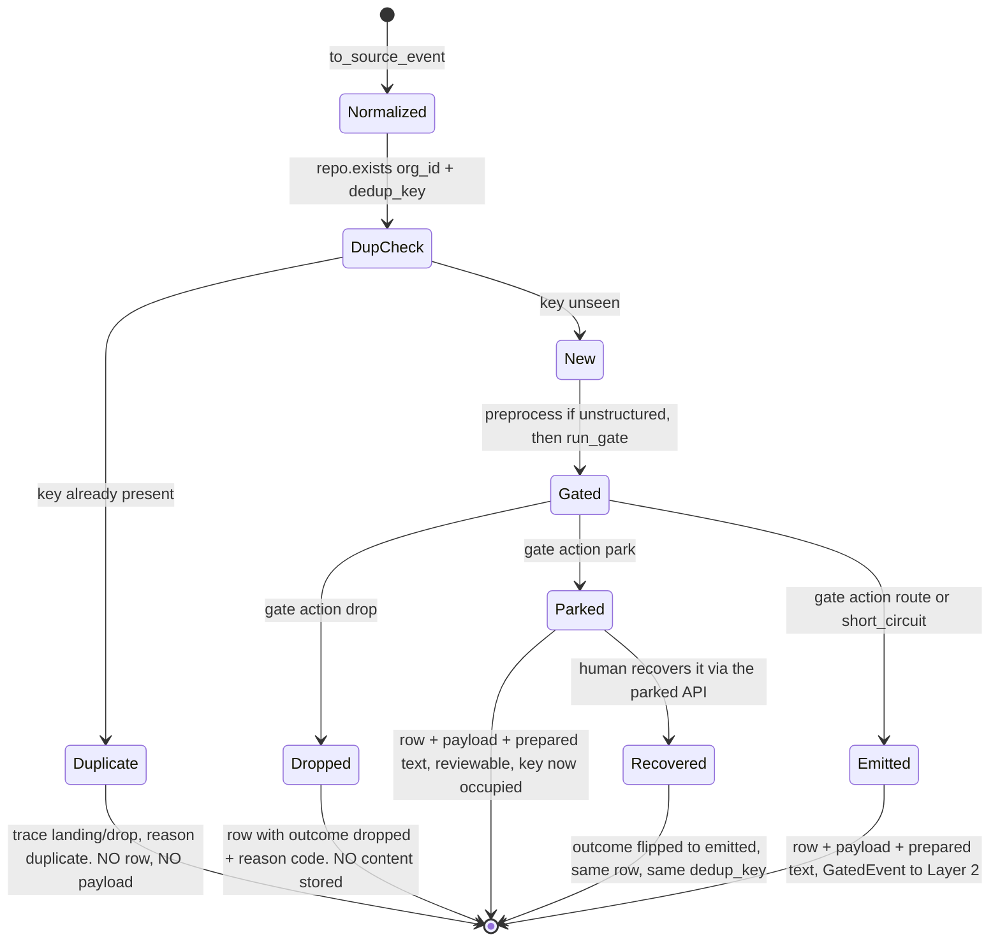

# Landing and Deduplication

*Layer 1 · `genios_engine/capture/landing/` · 153 lines that decide what counts as the same thing twice*

> **When the same object arrives again, how does the engine know — and when should "again"
> mean "changed"?**

| | |
|---|---|
| **Files** | [landing/normalize.py](../../../genios_engine/capture/landing/normalize.py) · 47 lines — `to_source_event` |
| | [landing/repository.py](../../../genios_engine/capture/landing/repository.py) · 42 lines — the Protocol + in-memory impl |
| | [landing/pg_repository.py](../../../genios_engine/capture/landing/pg_repository.py) · 64 lines — the Postgres impl |
| **Contract** | [contracts/source_event.py](../../../genios_engine/contracts/source_event.py) · 57 lines — `SourceEvent` v3, `Actor`, `SyncMode`, `compute_dedup_key` |
| **Entry point** | `land_raw_object` in [pipeline.py](../../../genios_engine/capture/pipeline.py) lines 38–53 |
| **Owns** | the envelope, the dedup identity, the ledger write, and the four decision columns |
| **Table** | `source_events` — created in [0001_initial.sql](../../../migrations/0001_initial.sql), extended by [0003](../../../migrations/0003_source_event_outcome.sql), [0027](../../../migrations/0027_l1_seam.sql), [0035](../../../migrations/0035_l1_internal_knowledge.sql) |
| **Uniqueness** | `create unique index source_events_dedup on source_events (org_id, dedup_key)` — a **DB index**, not application logic |
| **Tests** | [test_structured_dedup.py](../../../tests/test_structured_dedup.py) · [test_l1_seam.py](../../../tests/test_l1_seam.py) · [test_internal_knowledge.py](../../../tests/test_internal_knowledge.py) |
| **LLM calls** | Zero |

---

## 1 · `to_source_event` — a deterministic transform with exactly two exceptions

The whole of [normalize.py](../../../genios_engine/capture/landing/normalize.py) is one function.
Its docstring states the property that everything else in this document depends on:

> Deterministic raw → immutable SourceEvent. dedup_key is stable per source
> object; only event_id/captured_at are non-deterministic (assigned at ingest).

```python
def to_source_event(
    raw: RawObject,
    *,
    org_id: str,
    connection_id: str,
    sync_mode: SyncMode = SyncMode.incremental,
    payload_ref: str | None = None,
) -> SourceEvent:
```

Sixteen fields come out. Fourteen are a pure function of `(raw, org_id, connection_id,
sync_mode)`. Two are not:

| Non-deterministic field | Value | Why it has to be |
|---|---|---|
| `event_id` | `new_id("evt")` → `evt_` + 24 hex chars from `uuid4()` | it is the row's primary key and the join key for `raw_payloads`, `prepared_content`, `event_trace` — a fresh one per attempt |
| `captured_at` | `datetime.now(timezone.utc)` | *when we learned it*, which is genuinely different on a re-sync |

**This is what makes the rest of the pipeline testable.** Feed the same `RawObject` in twice and
you get two events whose `dedup_key`, `source_family`, `internal_kind`, `actor` and `occurred_at`
are byte-identical. That identity is the entire dedup mechanism —
[test_structured_dedup.py](../../../tests/test_structured_dedup.py) constructs two `RawObject`s
from two versions of the same calendar event and compares nothing but the two `dedup_key`s.

---

## 2 · The family-promotion rule

The one branch in the function. Quoted in full, because the reasoning is the point:

> A declared internal_kind PROMOTES the family to `internal`. Family answers "what
> kind of reality is this", and a policy the company wrote is its own record no
> matter which door it came through — classifying an uploaded pricing sheet as
> `knowledge` would file it beside a customer's shared doc, which is the exact
> conflation this step exists to end. The descriptor's family stays the DEFAULT.
> An unrecognised tag normalises to None and changes nothing.

```python
kind = normalize_kind(raw.internal_kind)
...
source_family="internal" if kind else family_of(raw.source),
internal_kind=kind,
```

Three consequences, each checkable:

| Input | `internal_kind` | `source_family` |
|---|---|---|
| `RawObject(source="upload", internal_kind="pricing")` | `"pricing"` | **`"internal"`** — promoted |
| `RawObject(source="upload", internal_kind=None)` | `None` | `"knowledge"` — the descriptor's default |
| `RawObject(source="upload", internal_kind="whatever")` | `None` | `"knowledge"` — an unrecognised tag changes nothing |

The third row is the important one and it is guarded by
[test_internal_knowledge.py](../../../tests/test_internal_knowledge.py). `normalize_kind` refuses
to guess, and its docstring says why:

> None is the honest answer for an unrecognised tag: it stays an ordinary tagged
> document at observed authority. Guessing here would hand rank 4 to a typo.

Rank 4 is `CANON_AUTHORITY_RANK`; observed traffic is `OBSERVED_AUTHORITY_RANK = 2`. So a typo in
a free-text upload tag would otherwise let a document outrank a system of record. The promotion is
deliberately one-way and deliberately vocabulary-bound: `INTERNAL_KINDS` is a twelve-member
`frozenset`, plus an `_ALIASES` table that maps free text like `okrs`, `rate_card` and `handbook`
onto it.

**The `upload` descriptor's own family is never mutated.** `family_of("upload")` still returns
`"knowledge"`. The promotion is a property of the *event*, not the source.

---

## 3 · `SourceEvent`, field by field

The contract's docstring is three sentences and each one is a rule:

> The one immutable envelope every connector emits. Append-only; corrections
> are new events, never edits. occurred_at (world time) and captured_at (when we
> learned it) are never merged.

| Field | Type | Set from | Notes |
|---|---|---|---|
| `event_id` | `str` | `new_id("evt")` | non-deterministic · PK of `source_events` |
| `org_id` | `str` | caller | tenant boundary; on **every** table, and half of the dedup index |
| `connection_id` | `str` | caller | `"manual"`, `"knowledge"`, `"upload"`, `"human"` or the agent id for the deliberate doors |
| `source` | `str` | `raw.source` | vendor-or-door identity — see [Knowledge Sources](../01-Knowledge-Sources/00-Overview.md) |
| `source_family` | `str` = `"unclassified"` | `"internal" if kind else family_of(raw.source)` | *"one of capture.source_families.FAMILIES"* |
| `object_type` | `str` | `raw.object_type` | `email_message` · `calendar_event` · `deal` · `document_chunk` · a table name |
| `source_object_id` | `str` | `raw.source_object_id` | the provider's id, stringified by the connector |
| `parent_object_id` | `str \| None` | `raw.parent_object_id` | Gmail thread id; an attachment's parent message. Feeds the `thread` linkage hint |
| `dedup_key` | `str` | `compute_dedup_key(...)` | §4 |
| `actor` | `Actor` | `Actor(type=raw.actor_type, email=raw.actor_email)` | `Actor.external_id` exists on the model and **`to_source_event` never sets it** |
| `occurred_at` | `datetime` | `raw.occurred_at` | **world time** — when the thing happened |
| `captured_at` | `datetime` | `datetime.now(timezone.utc)` | **our time** — when we learned it |
| `sync_mode` | `SyncMode` | caller | `backfill` · `incremental` · `recovery` |
| `payload_ref` | `str \| None` | *the parameter exists and no caller passes it* | `capture_event` assigns `new_id("pay")` later, and only for kept events |
| `capture_confidence` | `float` = `1.0` | never overridden | column is `numeric(4,3)`; nothing in the codebase ever writes another value |
| `internal_kind` | `str \| None` | `normalize_kind(raw.internal_kind)` | §2 |
| `schema_version` | `int` = `3` | constant | *"v3: + internal_kind (additive only)"* |

### 3.1 · Why `occurred_at` and `captured_at` are never merged

They answer different questions and they diverge routinely:

- A backfill run in August captures an email from March. `occurred_at` is March, `captured_at`
  is August. Ordering a customer's timeline by `captured_at` would show a year of history as
  having happened in one afternoon.
- The `sync_runner` advances the watermark from `raw.occurred_at`, never `captured_at` —
  `if watermark is None or raw.occurred_at > watermark`. Using capture time would make the
  watermark meaningless on a backfill.
- L2's drain orders by `se.occurred_at asc` after the triage lane, so world time is what decides
  processing order within a lane.

### 3.2 · Append-only, and what a "correction" is

*"Append-only; corrections are new events, never edits."* Nothing in `capture/` issues an
`update` against `source_events`. The `_INSERT` in
[pg_repository.py](../../../genios_engine/capture/landing/pg_repository.py) is the only write
path, and its conflict clause is `do nothing`.

The single exception in the whole repository is the human-driven recovery of a parked event, and
it lives in the API layer, not here:

```python
"update source_events set outcome='emitted' where org_id=:o and event_id=:e "
"and outcome='parked'"
```

That flips a decision a human overruled. It does not edit the event. The envelope's contents are
never rewritten — a corrected fact arrives as a new event with a new `dedup_key`, which is
exactly the mechanism §4 describes.

---

## 4 · `compute_dedup_key` — and the `content_version` design

The whole function:

```python
def compute_dedup_key(source: str, object_type: str, source_object_id: str,
                      content_version: str | None = None) -> str:
    base = f"{source}:{object_type}:{source_object_id}"
    return f"{base}:{content_version}" if content_version else base
```

Its docstring carries the design decision:

> Stable per source object — same object+version yields the same key, so re-syncs and
> retries can't create duplicates. For a MUTABLE structured object the connector passes a
> content_version (updatedAt/etag/watermark); a genuine change then yields a NEW key so the
> edit lands and updates the graph, while an unchanged re-sync still dedups. Email/message
> pass no version → the immutable object never re-lands.

### 4.1 · Two object natures, one key shape

| | **Immutable object** | **Mutable object** |
|---|---|---|
| Examples | an email, a Slack message, an agent's completed action | a CRM deal, a calendar event, a DB row, a re-written policy |
| Passes `content_version`? | No | Yes |
| Key shape | `gmail:email_message:m1` | `gcal:calendar_event:ev1:2026-07-30T09:00:00Z` |
| Second sync, unchanged | same key → **duplicate**, dropped at landing | same key → **duplicate**, dropped at landing |
| Second sync, object changed | *cannot happen* — an email never edits itself | **new key** → lands as a new event → the graph updates |

**An email never edits itself, so passing no version is not a shortcut — it is the correct
model.** Its key is permanently stable, which is what makes a re-sync, a boundary overlap and a
bounded retry all free.

### 4.2 · Who actually passes a version

Verified by `grep content_version` across `genios_engine/`:

| Producer | `content_version` | Source of the value |
|---|---|---|
| [connectors/calendar.py](../../../genios_engine/capture/connectors/calendar.py) | `str(ev.get("updated"))` | Google's own edit timestamp |
| [connectors/database.py](../../../genios_engine/capture/connectors/database.py) | `str(wm)` where `wm = row[watermark_col]` | the client table's `updated_at` |
| [intake.py](../../../genios_engine/capture/intake.py) · `ingest_internal_knowledge` | `semantic_hash({"title": subject, "body": body})` | a content hash, not a timestamp |
| [connectors/composio.py](../../../genios_engine/capture/connectors/composio.py) — Gmail | **none** | correct: messages are immutable |
| [connectors/notion.py](../../../genios_engine/capture/connectors/notion.py) | **none** | see Gaps |
| [connectors/drive.py](../../../genios_engine/capture/connectors/drive.py) | **none** | see Gaps |
| `ingest_manual` · `ingest_human_event` · `ingest_agent_event` · upload chunks | **none** (default) | agent events ride the caller's idempotency key instead |

The calendar connector states its own case at the assignment:

> `updated` changes whenever the event is edited (rescheduled, status change) →
> a reschedule re-lands and updates meeting.start_at instead of being deduped away.

and so does the database connector:

> the watermark value IS the row's content version — a CRM deal that
> moves proposal→won gets a new updated_at → re-lands → deal.stage updates.

`ingest_internal_knowledge` is the interesting third case, because a written policy has no
provider timestamp. It hashes the content instead, and gets the same semantics:

> SUPERSEDES, not append. The dedup key is (key, semantic hash of the content):
>
>   * re-submitting identical content       → same key → duplicate, no re-land
>   * editing the policy and re-submitting  → new hash → new key → it re-lands and
>     the graph updates, exactly like a CRM deal whose stage changed

### 4.3 · The bug this fixed: `deal.stage` frozen forever

Before `content_version`, the key was just `source:object_type:source_object_id`. Trace what that
meant for a deal:

1. Monday's sync sees `deal_9` at `dealstage = "proposal"`. Key `postgres:deals:5`. New → lands →
   `apply_mapping` produces `{"deal.stage": "proposal"}` → L2 writes it into the graph.
2. Thursday the deal is won. The connector's watermark query correctly returns the row —
   `updated_at` moved, so `_rows(since=…)` selects it.
3. Landing computes the key. Still `postgres:deals:5`. `repo.exists` → `True`.
   **`outcome = "duplicate"`, `landed = False`, terminal.**
4. The graph still says `proposal`. It will say `proposal` forever, because every subsequent sync
   repeats step 3.

The connector was doing its job perfectly and the change still could not reach the graph. The
comment on `RawObject.content_version` names the outcome in one line:

> Without this, deal.stage froze at its first-seen value forever.

The regression test is [test_structured_dedup.py](../../../tests/test_structured_dedup.py), whose
header states the invariant it protects:

> D2 · structured-lane freeze fix. A MUTABLE structured object (CRM deal, calendar event, DB row)
> must re-land when it CHANGES (so deal.stage/meeting.start_at update), while an immutable email
> must NOT re-land on re-sync. The discriminator is a per-object content_version in dedup_key.

```python
def test_structured_change_gets_a_new_dedup_key():
    proposal = compute_dedup_key("hubspot", "deal", "deal_9", "2026-07-20T10:00:00Z")
    won = compute_dedup_key("hubspot", "deal", "deal_9", "2026-07-28T14:00:00Z")   # stage moved
    unchanged = compute_dedup_key("hubspot", "deal", "deal_9", "2026-07-20T10:00:00Z")
    assert proposal != won                 # a real change re-lands → graph updates
    assert proposal == unchanged           # an unchanged re-sync still dedups (no spurious work)
```

Both halves matter. Dropping the version entirely would fix the freeze and re-process every
unchanged row on every sweep; keeping it fixes the freeze and still dedups the boundary overlap.

---

## 5 · `land_raw_object` — normalise and **check**, nothing else

```python
def land_raw_object(raw: RawObject, *, org_id: str, connection_id: str,
                    repo: SourceEventRepository,
                    sync_mode: SyncMode = SyncMode.incremental,
                    trace: EventTrace | None = None) -> LandingResult:
    """Normalize + dedup check ONLY. Writing is deferred to after the gate so the
    ledger records the decision (and content is stored kept-only). `landed` here
    means "new" (not already seen), not "written"."""
    event = to_source_event(raw, org_id=org_id, connection_id=connection_id,
                            sync_mode=sync_mode)
    trace = trace or EventTrace(org_id=org_id, event_id=event.event_id,
                                dedup_key=event.dedup_key, source=event.source)
    if repo.exists(org_id, event.dedup_key):
        trace.record("landing", "drop", reason_code="duplicate", dedup_key=event.dedup_key)
        return LandingResult(event=event, trace=trace, landed=False)
    trace.record("landing", "pass", object_type=event.object_type)
    return LandingResult(event=event, trace=trace, landed=True)
```

**`landed` means "new", not "written".** That distinction is the whole reason the function is
shaped this way, and getting it backwards would make the ledger lie. The write happens ~150 lines
later in `capture_event`, after the gate has produced an outcome:

```python
outcome = {"drop": "dropped", "park": "parked"}.get(gate.action, "emitted")
...
repo.add(event, outcome=outcome, route=gate.route, triage_lane=lane,
         domain_hints=hints or None, linkage_hints=links or None)
```

The comment above it names the intent:

> Decision-first ledger: write the lightweight source_events row (metadata + the
> decision) AFTER the gate, for every new object — this is the dedup + audit ledger
> ("already fetched?" check reads it).

Three properties fall out of deferring the write:

1. **A dropped event still gets a row.** `repo.add` is unconditional for a new object. So
   `outcome='dropped'` with its reason code is queryable, and the same object is never re-fetched
   and re-judged on the next sweep.
2. **The row is honest.** There is no window in which a row exists saying nothing about what
   happened to it, and no second `update` to keep consistent.
3. **The trace is written for every outcome**, via the single exit `_finish`, including the
   duplicate path where no row is written at all. A duplicate leaves a footprint even though it
   leaves no ledger row.

`land_raw_object` is also kept standalone deliberately —
*"Kept standalone so it is independently testable."*

---

## 6 · The repository seam

### 6.1 · The Protocol

Two methods. The docstring carries more design than the code does:

> Storage seam. In-memory for dev/tests; a Postgres/Supabase impl replaces it
> behind the same interface (dedup uniqueness enforced by a DB unique index).
> `add` is called AFTER the gate with the decision outcome — this table is the
> dedup + decision ledger (metadata only); content is stored elsewhere, kept-only.
> route/triage_lane/domain_hints/linkage_hints persist the gate+triage decisions
> so L2 READS the seam instead of re-deriving it (heavy at ingestion, light at
> runtime).

```python
class SourceEventRepository(Protocol):
    def exists(self, org_id: str, dedup_key: str) -> bool: ...
    def add(self, event: SourceEvent, outcome: str | None = None, *,
            route: str | None = None, triage_lane: str | None = None,
            domain_hints: list | None = None, linkage_hints: list | None = None) -> None: ...
```

Both are `org_id`-first. `exists` cannot be called without a tenant, so there is no accidental
cross-org dedup — two orgs receiving the same forwarded email each land their own event.

### 6.2 · In-memory

`InMemorySourceEventRepository` keeps three dicts keyed on `(org_id, dedup_key)`: `_by_key`,
`_outcome`, `_decision`. It is not a toy — it is what the demo endpoint
`POST /dev/ingest-sample` and the whole test suite run on, and
[test_l1_seam.py](../../../tests/test_l1_seam.py) asserts against `repo._decision` directly:

```python
dec = repo._decision[("org_a", res.event.dedup_key)]
assert dec["route"] == "needs_extraction"
assert dec["triage_lane"] in ("P0", "P1", "P2", "P3")
```

One honest difference from Postgres: `add` **overwrites** on a repeat key, where the Postgres impl
does nothing. Nothing depends on the difference, because `add` is only reached when `exists`
already returned `False`.

### 6.3 · Postgres — where uniqueness actually lives

```sql
insert into source_events
  (event_id, org_id, connection_id, source, source_family, object_type,
   source_object_id, parent_object_id, dedup_key, actor, occurred_at, captured_at,
   sync_mode, payload_ref, capture_confidence, schema_version, outcome,
   route, triage_lane, domain_hints, linkage_hints, internal_kind)
values (...)
on conflict (org_id, dedup_key) do nothing
```

against the index from [0001_initial.sql](../../../migrations/0001_initial.sql):

```sql
create unique index if not exists source_events_dedup
    on source_events (org_id, dedup_key);
```

**This is the sentence that makes concurrent capture safe.** The `exists` check in
`land_raw_object` is an *optimisation* — it avoids preprocessing and gating an object we already
have. It is not the guarantee. The guarantee is the unique index, and `on conflict … do nothing`
is what turns a lost race into a no-op instead of an exception.

That matters because the capture loop is concurrent by design.
[acquire/sync_runner.py](../../../genios_engine/capture/acquire/sync_runner.py):

> Per-page capture concurrency. Each email's capture is independent (dedup is DB-enforced, the
> watermark is an order-independent max), so we run them in parallel to overlap the per-email DB
> round-trips — the real L1 cost.

Three workers by default (`GENIOS_L1_WORKERS`), and there is a genuine interleaving in which two
of them both see `exists → False` for the same key — a duplicate inside one page, a recovery
re-scan overlapping an incremental sync, a webhook arriving while a sweep runs. With uniqueness in
application logic, that race writes two rows and L2 extracts the same email twice, at cost. With
it in the index, the loser's insert silently affects zero rows.

The Postgres class docstring adds the reason `internal_kind` is on the insert list at all:

> internal_kind carries AUTHORITY across the seam — without it persisted,
> company canon would arrive at L2 indistinguishable from a stranger's email.

### 6.4 · Which impl runs

One function, driven by `.env` alone —
[platform/wiring.py](../../../genios_engine/platform/wiring.py):

```python
def make_repo() -> SourceEventRepository:
    s = get_settings()
    if s.use_real_db:
        from genios_engine.capture.landing.pg_repository import PostgresSourceEventRepository
        return PostgresSourceEventRepository(s.database_url)
    return InMemorySourceEventRepository()
```

---

## 7 · The columns the row carries

`source_events` was built in four migrations and the layers are legible in the DDL.

| Column | Added by | Written by | Read by |
|---|---|---|---|
| `event_id` … `schema_version` | [0001_initial.sql](../../../migrations/0001_initial.sql) | `to_source_event` | joins from `raw_payloads`, `prepared_content`, `event_trace` |
| `outcome` | [0003](../../../migrations/0003_source_event_outcome.sql) | `capture_event` after the gate | L2's drain `where se.outcome='emitted'` · `/parked/{id}/recover` · L2 health counts |
| `source_family` | [0027](../../../migrations/0027_l1_seam.sql) | `to_source_event` | **no reader of the column.** The *envelope* field is read once, in L1's own `whitelist()` W-05 check against `DELIBERATE_FAMILIES` — but that happens before the row is written |
| `route` | [0027](../../../migrations/0027_l1_seam.sql) | `gate.route` | nothing at runtime — L2 re-derives the lane from `get_mapping` |
| `triage_lane` | [0027](../../../migrations/0027_l1_seam.sql) | `triage_lane(ctx, prepared)`, emitted events only | **L2's drain order** — `order by coalesce(se.triage_lane, 'P3') asc` |
| `domain_hints` | [0027](../../../migrations/0027_l1_seam.sql) | `domain_hints(source, text)`, kept events only | L2 — passed into `process_event` and `commit_structured` |
| `linkage_hints` | [0027](../../../migrations/0027_l1_seam.sql) | `_linkage_hints(event)`, kept events only | nothing at runtime — see Gaps |
| `internal_kind` | [0035](../../../migrations/0035_l1_internal_knowledge.sql) | `normalize_kind` | L2 — `internal_kind=getattr(row, "internal_kind", None)` into `process_event` |

0003 states the table's job in two lines:

> source_events is the lightweight dedup + decision ledger (metadata only, no content).
> `outcome` records the gate decision so the ledger is honest about what was kept vs
> dropped. Full content lives in raw_payloads (short TTL) for KEPT events only.

Two nullability rules are enforced in `capture_event` rather than in the schema, and both are
deliberate:

```python
kept = outcome in ("emitted", "parked")
...
if kept:
    hints = domain_hints(event.source, text)
    links = _linkage_hints(event)
if gate.action not in ("drop", "park"):
    lane = triage_lane(ctx, prepared)
```

> The triage lane is the L2 DRAIN order, so it exists only
> for emitted events — a parked event's terminal trace record stays the gate's
> park decision (recovery re-emits and the drain treats lane-less as P3).

A dropped event therefore carries `outcome='dropped'` and `route` and nothing else. A parked
event carries hints but no lane. Only an emitted event carries all four. `test_l1_seam.py` pins
the parked/dropped half:

```python
dec = repo._decision[("org_a", res.event.dedup_key)]
assert dec["triage_lane"] is None                # lane is for emitted events only
```

0035 adds one index worth knowing about, because it is partial:

```sql
create index if not exists idx_source_events_internal_kind
  on source_events (org_id, internal_kind)
  where internal_kind is not null;
```

> L2's drain reads canon by kind when rebuilding the organisation's own picture of
> itself; partial so the index only covers the rows that have one.

---

## 8 · The dedup lifecycle



Two edges are easy to miss and both are load-bearing.

**The parked state occupies the key.** That is why parked events must keep their content — a
re-fetch cannot get past dedup, so if the payload were missing the event would be unrecoverable.
The pipeline comment records this as a fixed bug:

> KEPT content: stash the raw body (encrypted, short TTL) for EMITTED and PARKED events.
> Parked = a human-review queue (grey-zone), so it MUST keep content to be recoverable — was
> a bug: parked stored no payload, dedup blocked re-fetch, /recover was a no-op → black hole.

**Recovery flips a column; it does not create an event.** `recover_parked` updates
`outcome='emitted'` on the existing row, checking first that `raw_payloads` still holds the body.
The `dedup_key` is untouched, so the append-only rule survives.

The duplicate edge terminates immediately and cheaply — one `exists()` query, one trace record,
no HTML strip, no PII pass, no model. That is what makes `mode="recovery"` affordable:

> mode="recovery" = a safety re-scan of a fixed lookback window (ignores watermark,
> doesn't move it) — anything the primary sync missed lands; dupes drop at dedup.

---

## 9 · Worked example — two syncs of one changing deal

A customer's own Postgres, connected through `ClientDatabaseConnector(table="public.customer_accounts",
identity_field="account_id", watermark_col="updated_at", source="postgres")`. This table has a
shipped mapping — `postgres.customer_accounts.v1` — so it takes the structured lane.

### Sync 1 — Monday 10:00 UTC

The connector runs `select * from public.customer_accounts order by updated_at limit 50`. One row:

```
{"account_id": 5, "plan": "starter", "status": "trial",
 "seats_used": 3, "updated_at": 2026-07-20T10:00:00+00:00}
```

`_to_raw` produces:

```
RawObject(source="postgres", object_type="public.customer_accounts",
          source_object_id="5", occurred_at=2026-07-20T10:00:00+00:00,
          content_version="2026-07-20 10:00:00+00:00", actor_type="system",
          raw={"account_id": 5, "plan": "starter", "status": "trial",
               "seats_used": 3, "updated_at": …})
```

| Step | Value |
|---|---|
| `dedup_key` | `postgres:public.customer_accounts:5:2026-07-20 10:00:00+00:00` |
| `source_family` | `enterprise_system` |
| `internal_kind` | `None` — the row is observed, not asserted |
| `repo.exists` | `False` → `landed=True`, trace `landing/pass` |
| `has_mapping("postgres", "public.customer_accounts")` | `True` → structured lane, no preprocess |
| gate | S0 pass → S1.5 `short_circuit` / `structured_mapped`, `route="structured"` |
| `outcome` | `emitted`, `kept=True` |
| `lane` | text `""`, score 0, `max(0, 30)` → **P2** |
| `apply_mapping` | `{"product_account.plan": "starter", "product_account.status": "trial", "product_account.seats_used": 3}` |
| row written | `outcome='emitted'`, `route='structured'`, `triage_lane='P2'`, `domain_hints=null`, `linkage_hints=null` |

`domain_hints` is null because `domain_hints("postgres", None)` finds no source prior and has no
text to keyword-match. `linkage_hints` is null because the actor has no email and there is no
`parent_object_id`.

The graph now holds `product_account.status = "trial"`.

### Sync 2 — Thursday 14:05 UTC, nothing changed since Monday

The watermark is Monday 10:00. `_rows(since=…)` returns the row again only if `updated_at > since`
— it does not, so the row is not even fetched. **Cost: zero.** The watermark did its job before
dedup was needed.

### Sync 2b — Thursday, but the sweep window overlaps

A recovery run (`mode="recovery"`, a 7-day lookback that ignores the watermark) does re-fetch it.
`updated_at` is unchanged, so:

| Step | Value |
|---|---|
| `dedup_key` | `postgres:public.customer_accounts:5:2026-07-20 10:00:00+00:00` — **identical** |
| `repo.exists` | `True` |
| trace | `landing / drop / reason_code="duplicate"` |
| `outcome` | `duplicate` |
| written | **nothing** — no row, no payload, no prepared text |

`SyncSummary.duplicate` increments, `l1_sync_runs` records it, and the event's life ends in
microseconds.

### Sync 3 — Friday, the account upgrades

Someone converts the trial. The application updates the row:

```
{"account_id": 5, "plan": "growth", "status": "active",
 "seats_used": 11, "updated_at": 2026-07-31T09:12:00+00:00}
```

| Step | Value |
|---|---|
| watermark | Monday 10:00 → `updated_at > since` → **row fetched** |
| `content_version` | `"2026-07-31 09:12:00+00:00"` |
| `dedup_key` | `postgres:public.customer_accounts:5:2026-07-31 09:12:00+00:00` — **new** |
| `event_id` | a fresh `evt_…` — this is a *second* event about the same account |
| `repo.exists` | `False` → `landed=True` |
| gate | S1.5 `short_circuit` again |
| `apply_mapping` | `{"product_account.plan": "growth", "product_account.status": "active", "product_account.seats_used": 11}` |
| row written | a second `source_events` row, `outcome='emitted'` |
| L2 | `commit_structured` on `node_type="product_account"`, identity `account_id=5` → **the same node**, updated |

Two ledger rows, two envelopes, one graph node. `source_events` is now a full audit trail of what
the account looked like at each observation, and the graph holds the current truth. **Neither the
freeze nor the duplicate storm happens**, and the discriminator between the two cases was a single
optional string in the key.

Had `updated_at` not been declared as the `watermark_col`, `content_version` would be `None`,
the key would collapse to `postgres:public.customer_accounts:5`, and Friday's upgrade would be
reported as a duplicate. That is the failure the tests in
[test_structured_dedup.py](../../../tests/test_structured_dedup.py) exist to prevent:

```python
assert to_source_event(r1, org_id="o", connection_id="c").dedup_key != \
    to_source_event(r2, org_id="o", connection_id="c").dedup_key   # the deal-stage-freeze fix
```

---

## 10 · Gaps

| # | Gap | Evidence |
|---|---|---|
| 1 | **Notion pages can never re-land after an edit.** `NotionConnector._to_raw` sets no `content_version`, so the key is `notion:page:{id}` forever. The `since` filter correctly re-fetches an edited page — and landing then reports it as a duplicate. The connector comment is honest about the boundary — *"Metadata-only compare; dedup_key/content_version are untouched"* — but the consequence is that a Notion workspace is captured once and then frozen | [notion.py](../../../genios_engine/capture/connectors/notion.py) lines 54, 61–72 |
| 2 | **Google Drive has the same freeze.** `_to_raw` reads `f.get("modifiedTime")` for `occurred_at` and does not pass it as `content_version`. An edited document is fetched, downloaded, text-extracted — and then dropped as a duplicate, so the download cost is paid and discarded | [drive.py](../../../genios_engine/capture/connectors/drive.py) lines 67–76 |
| 3 | **`to_source_event`'s `payload_ref` parameter is dead.** No caller passes it; `capture_event` assigns `event.payload_ref = new_id("pay")` after the gate instead, mutating the "immutable" envelope | `grep to_source_event` finds only `pipeline.py:45` and tests · [pipeline.py](../../../genios_engine/capture/pipeline.py) lines 196–197 |
| 4 | **`capture_confidence` is a constant.** Declared `float = 1.0`, stored as `numeric(4,3)`, never written with any other value anywhere in the repository. It is a field waiting for a producer — an OCR confidence, a partial fetch, a degraded parse — that does not exist yet | `grep capture_confidence` returns one default, one column, one bind |
| 5 | **`Actor.external_id` is never populated.** The model declares it; `to_source_event` builds `Actor(type=…, email=…)` only. So an actor with no email — a `system` DB row, an agent — has no stable identity on the envelope beyond its type | [source_event.py](../../../genios_engine/contracts/source_event.py) line 18 vs [normalize.py](../../../genios_engine/capture/landing/normalize.py) line 42 |
| 6 | **Three of the 0027 columns are written and never read back.** L2's drain selects `triage_lane`, `internal_kind`, `domain_hints`, `parent_object_id` and `prepared_content.clean_text` — not `route`, not `linkage_hints`, not `source_family`. L2 re-derives the lane from `get_mapping(row.source, row.object_type)`, which is consistent by construction but does mean the persisted `route` is decorative today. `linkage_hints` — the company domain and thread id — has no consumer at all, despite being the S3 entity hint the seam was built to carry | [runner.py](../../../genios_engine/context/runner.py) lines 64, 103–107 · `grep linkage_hints` finds no read outside `capture/` |
| 7 | **The 0027 `source_family` backfill is narrower than the taxonomy.** Its `case` has no `operational` branch and omits the six sources that had a coverage capability but no family, so historical rows for those sources backfilled to `'unclassified'` | [0027_l1_seam.sql](../../../migrations/0027_l1_seam.sql) lines 17–26 |
| 8 | **Nothing prunes `source_events`.** `raw_payloads` has `purge_expired`, `prepared_content` has `purge_expired`. The ledger has neither — which is arguably correct, since it is the dedup memory and forgetting a key means re-landing an old object. But it means the table grows without bound, and no document says so | `grep purge` finds no `source_events` deletion outside the org-cascade FK in [0033](../../../migrations/0033_org_data_cascade.sql) |

---

## 11 · Map

| Kind | Path |
|---|---|
| Envelope transform | [capture/landing/normalize.py](../../../genios_engine/capture/landing/normalize.py) |
| Repository Protocol + in-memory | [capture/landing/repository.py](../../../genios_engine/capture/landing/repository.py) |
| Postgres repository | [capture/landing/pg_repository.py](../../../genios_engine/capture/landing/pg_repository.py) |
| Envelope + `compute_dedup_key` | [contracts/source_event.py](../../../genios_engine/contracts/source_event.py) |
| `RawObject` | [capture/connectors/base.py](../../../genios_engine/capture/connectors/base.py) |
| Canon vocabulary | [capture/internal_knowledge.py](../../../genios_engine/capture/internal_knowledge.py) |
| Family lookup | [capture/source_families.py](../../../genios_engine/capture/source_families.py) → [capture/source_registry.py](../../../genios_engine/capture/source_registry.py) |
| `land_raw_object` + `capture_event` | [capture/pipeline.py](../../../genios_engine/capture/pipeline.py) |
| Version producers | [connectors/calendar.py](../../../genios_engine/capture/connectors/calendar.py) · [connectors/database.py](../../../genios_engine/capture/connectors/database.py) · [capture/intake.py](../../../genios_engine/capture/intake.py) |
| Concurrency + recovery mode | [capture/acquire/sync_runner.py](../../../genios_engine/capture/acquire/sync_runner.py) |
| Impl selection | [platform/wiring.py](../../../genios_engine/platform/wiring.py) · `make_repo` |
| Id generation | [platform/ids.py](../../../genios_engine/platform/ids.py) · `new_id` |
| L2 consumer | [context/runner.py](../../../genios_engine/context/runner.py) · `_pull` |

### Tables and indexes

| Object | Migration |
|---|---|
| `source_events` | [0001_initial.sql](../../../migrations/0001_initial.sql) |
| `source_events_dedup` unique index on `(org_id, dedup_key)` | [0001_initial.sql](../../../migrations/0001_initial.sql) |
| `outcome` + `source_events_outcome` index | [0003_source_event_outcome.sql](../../../migrations/0003_source_event_outcome.sql) |
| `source_family` · `route` · `triage_lane` · `domain_hints` · `linkage_hints` | [0027_l1_seam.sql](../../../migrations/0027_l1_seam.sql) |
| `internal_kind` + partial index | [0035_l1_internal_knowledge.sql](../../../migrations/0035_l1_internal_knowledge.sql) |
| org cascade FK | [0033_org_data_cascade.sql](../../../migrations/0033_org_data_cascade.sql) |

### Tests

| File | What it pins |
|---|---|
| [test_structured_dedup.py](../../../tests/test_structured_dedup.py) | email key stability · a changed structured object gets a new key · calendar `updated` → `content_version` · DB watermark → `content_version` |
| [test_l1_seam.py](../../../tests/test_l1_seam.py) | the decision columns persist · `source_family` on the envelope · `schema_version == 3` · lane is emitted-only |
| [test_internal_knowledge.py](../../../tests/test_internal_knowledge.py) | the family-promotion rule and the unrecognised-tag no-op |

### Endpoints that touch this table

| Endpoint | Interaction |
|---|---|
| `POST /sync/{connection_id}` · `POST /ingest/all` | `run_sync` → `capture_event` → `repo.add` |
| `POST /webhooks/composio` | one live Gmail message → `capture_event` |
| `POST /api/org/{org}/upload` · `POST /api/org/{org}/knowledge` · `POST /human-events` · `POST /agent-events` | via `capture/intake.py`, the same `repo` |
| `POST /parked/{event_id}/recover` | the only `update` against `source_events` in the codebase |
| `POST /dev/ingest-sample` | the in-memory repo, no persistence |

Sideways: [Normalization and Extraction Overview](00-Overview.md) · [The Persisted Seam](05-The-Persisted-Seam.md)
· [ESQE · The Capture Pipeline](../04-ESQE/05-The-Capture-Pipeline.md). Upwards:
[Layer 1 Overview](../00-Overview.md).
