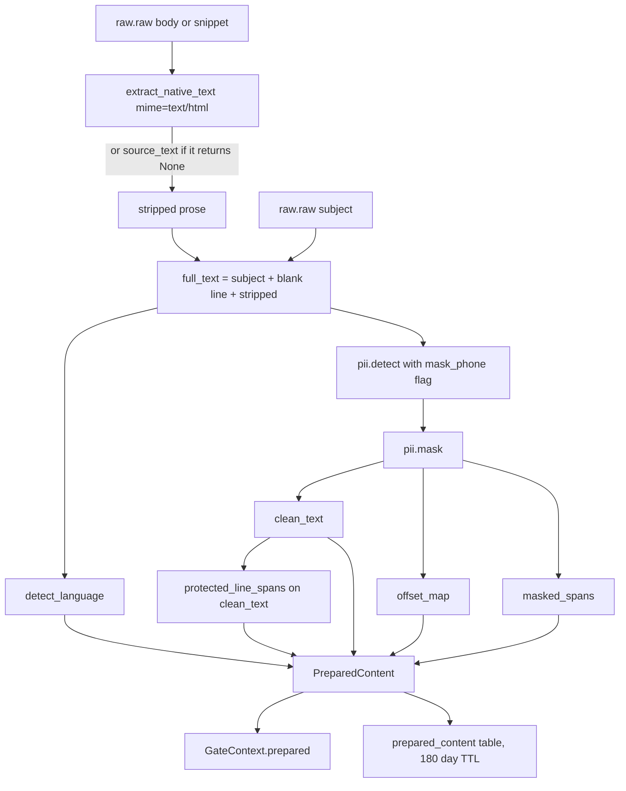
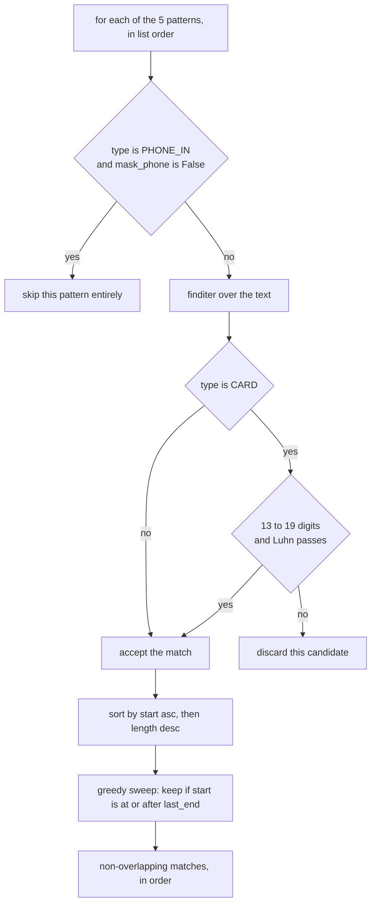
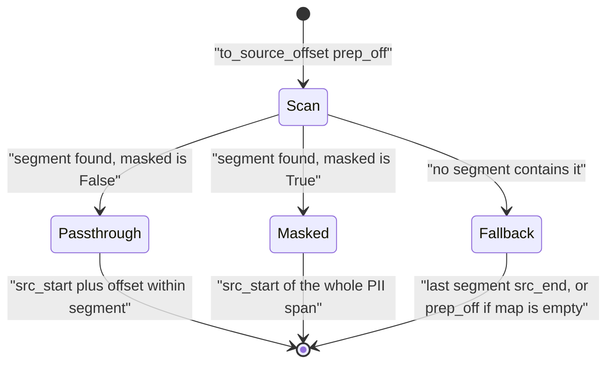

# Preprocessing and PII Masking

*Stage 03 · `genios_engine/capture/preprocess/` — three files, 163 lines, zero model calls.*

> **The one question this document answers: "How does raw text become something safe to
> put in front of an LLM, without losing the ability to point back at the exact character
> it came from?"**

---

## §0 · At a glance

| | |
|---|---|
| **Files** | [`preprocess/pii.py`](../../../genios_engine/capture/preprocess/pii.py) 91 · [`preprocess/text.py`](../../../genios_engine/capture/preprocess/text.py) 47 · [`preprocess/preprocess.py`](../../../genios_engine/capture/preprocess/preprocess.py) 25 |
| **Contract emitted** | `PreparedContent` — [`contracts/prepared_content.py`](../../../genios_engine/contracts/prepared_content.py) |
| **Called from** | [`capture/pipeline.py:160`](../../../genios_engine/capture/pipeline.py) and, as a pre-seam fallback only, [`context/runner.py:47`](../../../genios_engine/context/runner.py) |
| **Owns** | 5 PII detectors · Luhn validation · overlap resolution · the offset map · language detection · protected-line spans |
| **Persisted to** | `prepared_content` table — [`prepared_store.py`](../../../genios_engine/capture/prepared_store.py), 180-day TTL |
| **Version stamp** | `preprocessor_version = "prep-1"`, copied into `GatedEvent.versions["preprocessor"]` |
| **LLM calls** | Zero. Every decision here is a regex or an arithmetic checksum. |
| **Tests** | [`tests/test_preprocess.py`](../../../tests/test_preprocess.py) · [`tests/test_l1_seam.py`](../../../tests/test_l1_seam.py) |

---

## §1 · What this is

Layer 1 has to hand Layer 2 something an LLM can read. Raw email bodies are not that: they
are HTML, they are bilingual, and they carry PAN numbers, Aadhaar numbers, card numbers and
bank codes that must never leave the tenant's boundary in a prompt.

The naive fix — strip the PII and move on — breaks the thing GeniOS sells. Layer 3 shows a
user a fact and the user asks *"where did you get that?"* If the text the model read is not
character-addressable back to the source, that question has no answer.

So `preprocess()` does both jobs at once: it produces masked text **and** an explicit map from
every masked-text offset back to the original. The module docstring states the contract:

> Raw source text → PreparedContent: language, PII-masked clean text, an explicit
> offset map back to source, and protected-line spans. No LLM. No raw PII survives
> into clean_text.

Twenty-five lines of orchestration:

```python
def preprocess(source_text: str, *, event_id: str | None = None,
               mask_phone: bool = False) -> PreparedContent:
    language = text.detect_language(source_text)
    matches = pii.detect(source_text, mask_phone=mask_phone)
    clean_text, offset_map, masked_spans = pii.mask(source_text, matches)
    protected = text.protected_line_spans(clean_text)
```

Note the order. **Protection is computed on `clean_text`, not on `source_text`** — masking
changes string lengths, so a span computed before masking would point at the wrong characters
afterwards. The contract records that coordinate system in a comment on the field itself:
`protected_spans: list[tuple[int, int]]  # in clean_text coords`.

---

## §2 · The five detectors

[`pii.py`](../../../genios_engine/capture/preprocess/pii.py) opens with the policy, and the
policy is the interesting part:

> Deterministic high-risk PII detectors. Aadhaar/PAN/card/IFSC are ALWAYS masked
> before any LLM call; phone is tenant-configurable (default off — sales/support
> workflows often need it). Mask always wins over "protected" for high-risk PII.

`_PATTERNS` is an ordered list, and the order matters for overlap resolution (§2.3):

| # | Type | Regex, exactly as compiled | Flags | Extra validation |
|---|---|---|---|---|
| 1 | `PAN` | `\b[A-Z]{5}[0-9]{4}[A-Z]\b` | none | — |
| 2 | `AADHAAR` | `\b\d{4}\s?\d{4}\s?\d{4}\b` | none | — |
| 3 | `IFSC` | `\b[A-Z]{4}0[A-Z0-9]{6}\b` | none | — |
| 4 | `CARD` | `\b(?:\d[ -]?){13,19}\b` | none | **Luhn checksum** |
| 5 | `PHONE_IN` | `\b(?:\+91[-\s]?)?[6-9]\d{9}\b` | none | skipped unless `mask_phone=True` |

All five are Indian-market formats. `IFSC` encodes the RBI rule that the fifth character of a
bank code is always `0`. `PHONE_IN` encodes that Indian mobile numbers start 6–9.

### §2.1 · Why CARD runs Luhn before masking

`\b(?:\d[ -]?){13,19}\b` is a deliberately loose net — it matches any 13-to-19 digit run with
optional spaces or hyphens. That shape also matches order numbers, tracking IDs, and long
reference codes. Masking all of them would gut the text.

So `detect()` re-checks every `CARD` candidate before accepting it:

```python
if typ == "CARD":
    digits = re.sub(r"\D", "", m.group())
    if not (13 <= len(digits) <= 19 and _luhn_ok(digits)):
        continue
```

`_luhn_ok` is the standard mod-10 checksum, walking the digits in reverse and doubling every
second one:

```python
def _luhn_ok(digits: str) -> bool:
    total, alt = 0, False
    for ch in reversed(digits):
        d = ord(ch) - 48
        if alt:
            d *= 2
            if d > 9:
                d -= 9
        total += d
        alt = not alt
    return total % 10 == 0
```

**The regex finds candidates; the checksum decides.** `4111 1111 1111 1111` passes and is
masked. `4111 1111 1111 1112` fails and the `CARD` match is discarded — though see §2.3 for
what happens to it next, because it does not simply survive in the clear.

### §2.2 · Why PHONE_IN is tenant-configurable and default OFF

`detect()` short-circuits phone entirely unless asked:

```python
if typ == "PHONE_IN" and not mask_phone:
    continue
```

The reason is in the file header: *sales/support workflows often need it*. A sales rep's email
saying "call Priya on 9876543210 before the demo" is a **fact about a deal**, and the fact is
worthless without the number. PAN and Aadhaar are never load-bearing that way — nobody's sales
process needs an Aadhaar number in a prompt — so those four are unconditional and phone is a
switch.

The switch is threaded `preprocess(mask_phone=...)` ← `capture_event(mask_phone=...)`, and a
`mask_phone: bool = False` setting exists in [`platform/config.py:57`](../../../genios_engine/platform/config.py).
See the Gaps section: **no caller currently reads that setting.**

### §2.3 · Overlap resolution

Five independent regexes over the same string will collide. The resolution is three lines and
one comment:

```python
# resolve overlaps: earliest start, then longest; keep non-overlapping
matches.sort(key=lambda x: (x.start, -(x.end - x.start)))
kept: list[PiiMatch] = []
last_end = -1
for m in matches:
    if m.start >= last_end:
        kept.append(m)
        last_end = m.end
```

Sort by start ascending; on a tie, longest first (that is what the negated length does). Then a
single greedy sweep keeping anything that begins at or after the end of the last kept match.

The behaviour this produces on real strings is worth knowing, because it is not always the
obvious one. Verified against the shipped code:

| Input | Raw matches | Kept | Why |
|---|---|---|---|
| `card 4111 1111 1111 1111,` | `AADHAAR` 5–19, `CARD` 5–24 | `CARD` | same start, `CARD` is longer |
| `card 4111 1111 1111 1112` *(bad Luhn)* | `AADHAAR` 5–19 only | `AADHAAR` | `CARD` discarded by Luhn — but the first 12 digits still trip Aadhaar, **so it is still masked, just mislabelled** |
| `Call +91 9876543210 now` | none *(default)* | none | with a space, only `PHONE_IN` matches, and it is off |
| `Call +919876543210 now` | `AADHAAR` 6–18 | `AADHAAR` | no space → 12 consecutive digits → Aadhaar fires **even with phone masking off** |
| `ref 1234 5678 9012 is an invoice no` | `AADHAAR` 4–18 | `AADHAAR` | no Verhoeff check — a 12-digit reference is masked as Aadhaar |

The pattern across every row is the same: **when the detectors are wrong, they are wrong in the
direction of over-masking.** That is the correct failure mode for a component whose job is to
stop PII reaching a model.

---

## §3 · The offset map

This is the load-bearing part of the module.

### §3.1 · Length-changing replacement is fine

`ABCDE1234F` is ten characters. `[PAN]` is five. Every mask shifts everything after it. The
docstring on `mask()` states why that is not a problem:

> Build masked text + an offset map (segments) + the masked spans. Length-changing
> replacement is fine because the offset map tracks the mapping precisely.

The alternative — padding tokens to the source length — would keep offsets stable at the cost of
producing text full of `[PAN]#####` noise. The map is the better trade.

### §3.2 · `OffsetSegment`

```python
class OffsetSegment(BaseModel):
    """Maps a range of prepared (clean) text back to the original source text.
    Passthrough segments are 1:1; masked segments collapse a source PII span to a token."""
    prep_start: int
    prep_end: int
    src_start: int
    src_end: int
    masked: bool = False
```

Four integers and a flag. `prep_*` are coordinates in `clean_text`; `src_*` are coordinates in
the original.

### §3.3 · How `mask()` builds the segments

One pass, two kinds of segment, emitted strictly in order. `src` tracks the read head in the
source, `prep` tracks the write head in the output.

For each match:

1. **Passthrough** — if `m.start > src`, everything from `src` to `m.start` is copied verbatim
   and gets a segment with `masked=False`. It is 1:1: `prep_end - prep_start == src_end - src_start`.
2. **Masked** — the token `f"[{m.pii_type}]"` is appended, and gets a segment with `masked=True`
   whose `prep` range is the token's length and whose `src` range is the *full original span*.
   The two ranges deliberately differ in length. A `MaskedSpan` is recorded alongside.

After the loop, a trailing passthrough segment covers `text[src:]` if anything remains. The
result is a partition of `clean_text` — **every offset in `[0, len(clean_text))` falls inside
exactly one segment.**

`mask()` assumes its input is already sorted and non-overlapping. `detect()` guarantees that;
nothing else calls `mask()`.

### §3.4 · `to_source_offset` walks them

```python
def to_source_offset(self, prep_off: int) -> int:
    """Prepared-text offset → original source offset (masked regions map to their
    source start). This is what makes 'click a fact, see the exact sentence' work."""
    for seg in self.offset_map:
        if seg.prep_start <= prep_off < seg.prep_end:
            if seg.masked:
                return seg.src_start
            return seg.src_start + (prep_off - seg.prep_start)
    return self.offset_map[-1].src_end if self.offset_map else prep_off
```

Three cases:

- **Passthrough hit** — add the offset within the segment. Exact.
- **Masked hit** — return `src_start`. Any of the five characters of `[PAN]` maps to the same
  place: the start of the original PAN. There is no meaningful character-level correspondence
  inside a collapsed span, so it collapses to its start.
- **Miss** — an offset past the end returns the last segment's `src_end`, or the input unchanged
  if there is no map at all (empty source text).

### §3.5 · Why this exists, in plain terms

Layer 2 sends `clean_text` to a model and gets back facts with `[start, end]` character spans
into that text. Those spans are meaningless to a human — they index a masked string that was
never displayed to anyone. Feed them through `to_source_offset` and they become offsets into
the original email, which means Layer 3 can highlight the actual sentence a user's colleague
actually typed.

The seam migration [`0027_l1_seam.sql`](../../../migrations/0027_l1_seam.sql) records what it
cost to learn this:

> Before this, L1 computed PreparedContent (PII-masked text + offset map), a gate route, a
> triage lane and domain/linkage hints — then threw them ALL away … That inverted "heavy at
> ingestion, light at runtime" and made `[start,end]` evidence offsets impossible.

---

## §4 · `detect_language`

Three tiers, in [`text.py`](../../../genios_engine/capture/preprocess/text.py):

```python
def detect_language(text: str) -> str:
    if _DEVANAGARI.search(text):
        return "hi"
    toks = re.findall(r"[a-zA-Z]+", text.lower())
    if not toks:
        return "other"
    hits = sum(1 for t in toks if t in _HINGLISH)
    return "hinglish" if hits / len(toks) >= 0.12 else "en"
```

1. **`hi`** — any character in the Devanagari block `[ऀ-ॿ]`. One character is enough; if
   Devanagari appears at all, the text is not English.
2. **`other`** — no Latin letters at all (pure numbers, pure punctuation).
3. **`hinglish` vs `en`** — the 21-word `_HINGLISH` lexicon at **≥ 12 %** of Latin tokens.

The lexicon: `kal · parso · tak · bhej · karo · kar · dunga · dungi · jaldi · urgent · hai ·
padega · band · update · final · chahiye · ho · jayega · kitna · abhi · milta`.

12 % is low on purpose. Hinglish is mostly English words with Hindi connective tissue — one Hindi
word in eight is already a strong signal. Verified: `"kal tak bhej dunga, jaldi karo"` → `hinglish`
(6/6 hits); `"Please send the revised contract by Friday"` → `en` (0/7).

It also misfires, and the misfire is structural rather than accidental: **`urgent`, `update`,
`final` and `band` are ordinary English words sitting in the Hinglish lexicon.** `"Update the
final doc"` scores 2/4 = 50 % and returns `hinglish`. Short English subject lines built from
those words will be mislabelled. Nothing in Layer 1 branches on `language`, so today the cost is
a wrong label on a persisted row rather than wrong behaviour.

---

## §5 · `protected_line_spans`

```python
def protected_line_spans(text: str) -> list[tuple[int, int]]:
    """Lines carrying money / dates / deadlines / questions / important keywords are
    protected — the token-budget trimmer may never drop them."""
```

Four patterns plus a literal, OR-ed per line:

| Signal | Pattern |
|---|---|
| question | the literal character `?` anywhere in the line |
| `_DEADLINE` | `\b(by\|before\|eod\|tomorrow\|today\|deadline\|mon\|tue\|wed\|thu\|fri\|sat\|sun\|friday\|monday\|tuesday\|wednesday\|thursday\|kal\|parso\|aaj)\b` · `re.I` |
| `_MONEY` | `(₹\|\$\|rs\.?\|inr\|usd)\s?\d\|[\d,]+\s?(lakh\|crore\|k)\b` · `re.I` |
| `_IMPORTANT` | `\b(invoice\|contract\|proposal\|agreement\|order\s*form\|renewal\|payment\|overdue\|legal\|compliance\|sev1\|outage\|cancel\|refund)\b` · `re.I` |

Note both Hindi day-words in `_DEADLINE` (`kal`, `parso`, `aaj`) and the Indian money units in
`_MONEY` (`lakh`, `crore`). This is the same market assumption as the PII detectors.

Iteration uses `splitkeepends=True` semantics so the running index stays correct, and the emitted
span deliberately excludes the newline:

```python
for line in text.splitlines(keepends=True):
    if ("?" in line or _DEADLINE.search(line) or _MONEY.search(line)
            or _IMPORTANT.search(line)):
        spans.append((idx, idx + len(line.rstrip("\n"))))
    idx += len(line)
```

**The rule the comment states — the token-budget trimmer may never drop a protected line — is a
contract with a consumer that does not exist yet.** See Gaps.

---

## §6 · `PreparedContent`, field by field

> Clean, PII-masked text + an explicit offset map so every downstream evidence
> span can be traced back to exact source characters. Raw content is never persisted
> here — only the prepared form + the map.

| Field | Type | Set by | Meaning |
|---|---|---|---|
| `prepared_content_id` | `str` | `new_id("pc")` | identity of this preparation run |
| `event_id` | `str \| None` | caller | the `SourceEvent` it belongs to; primary key in the table |
| `clean_text` | `str` | `pii.mask` | **the only text any model ever sees** |
| `language` | `str` | `detect_language` | `en` · `hi` · `hinglish` · `other` |
| `masked_spans` | `list[MaskedSpan]` | `pii.mask` | what was removed, where in the **source**, and the token used |
| `protected_spans` | `list[tuple[int,int]]` | `protected_line_spans` | in **clean_text** coords |
| `signature_hints` | `dict[str, Any]` | nothing | always `{}` — column exists, writer does not |
| `offset_map` | `list[OffsetSegment]` | `pii.mask` | the partition described in §3 |
| `preprocessor_version` | `str` | default | `"prep-1"` — lets a replay know which rules produced a row |

`MaskedSpan` carries `src_start`, `src_end`, `pii_type`, `token`. It is the audit record: it says
*a PAN was here, in the source, between these characters*, without storing the PAN.

---

## §7 · Where `preprocess` is called from

[`pipeline.py`](../../../genios_engine/capture/pipeline.py), inside `capture_event`, guarded by
`if not is_structured` — structured events carry typed fields and have no prose to clean. The
comment block above the call is the densest statement of policy in the file:

> preprocess (unstructured text only; structured events carry typed fields).
> HTML is stripped HERE (heavy at ingestion): the gate's OOO/empty checks and the
> persisted seam text both want prose, and L2 used to re-strip it per event.
> **SUBJECT IS PART OF THE PROSE and is masked WITH the body** — prepending a raw
> subject downstream would leak unmasked PII from subject lines to the LLM.
> Offset map note: src coordinates refer to the stripped text, not raw HTML bytes.

```python
source_text = raw.raw.get("body") or raw.raw.get("snippet") or ""
stripped = extract_native_text(mime="text/html", data=source_text) or source_text
subject = str(raw.raw.get("subject") or "")
full_text = (subject + "\n\n" + stripped) if subject else stripped
prepared = preprocess(full_text, event_id=event.event_id, mask_phone=mask_phone)
trace.record("preprocess", "pass", language=prepared.language,
             masked=len(prepared.masked_spans),
             protected=len(prepared.protected_spans))
```

Three things are decided here.

**The HTML strip happens before masking.** `extract_native_text(mime="text/html", ...)` is the
document module's HTML parser reused as a text cleaner — see
[Documents and OCR](03-Documents-and-OCR.md). The `or source_text` fallback means a plain-text
body passes through untouched. The consequence stated in the last line of the comment is
important for anyone reading offsets later: **`src_start`/`src_end` index the stripped prose, not
the original HTML bytes.** The raw HTML is in `raw_payloads`; the offsets do not address it.

**The subject is concatenated, not prepended later.** `subject + "\n\n" + stripped` goes through
the masker as one string. The reason is a regression that was fixed by moving this: the seam once
persisted body-only prepared text and Layer 2 stuck the raw subject on the front just before the
model call — so `Re: KYC — Aadhaar 1234 5678 9012` reached the LLM in the clear. There is now a
test pinning it, [`test_l1_seam.py::test_subject_line_pii_is_masked_in_prepared_text`](../../../tests/test_l1_seam.py):

```python
"""The subject is part of the prose and is masked WITH the body. (Regression: the
seam once persisted body-only prepared text and L2 prepended the RAW subject —
unmasked subject-line PII reached the LLM.)"""
```

…and the Layer 2 side now carries the matching instruction in `_clean_for_llm`
([`context/runner.py`](../../../genios_engine/context/runner.py)):

> Prefer the SEAM: L1 already computed the PII-masked prepared text (+offset map)
> at ingestion — subject INCLUDED, masked with the body — and persisted it to
> prepared_content. Used as-is: prepending the raw subject here would reintroduce
> unmasked subject-line PII to the LLM. Fallback re-derivation only for pre-seam rows.

**The result feeds the gate before it is stored.** `GateContext(prepared=prepared, ...)` — so
`hard_rule()` reads `ctx.prepared.clean_text` for its out-of-office and empty-body checks, and
`triage_lane()` reads it for urgency scoring. The gate and triage see masked text, which is
correct: `[PAN]` is not an urgency signal.

---

## §8 · Diagrams



The detector pipeline inside `pii.detect`:



Resolving one offset:



---

## §9 · A worked example, with real numbers

Input, 128 characters:

```
Invoice INV-2031. PAN ABCDE1234F, card 4111 1111 1111 1111, IFSC HDFC0001234. Call 9876543210. Please pay Rs 4,50,000 by Friday?
```

`detect(mask_phone=False)` produces, before overlap resolution: `PAN` 22–32, `AADHAAR` 39–53,
`CARD` 39–58, `IFSC` 65–76. `PHONE_IN` never runs. `CARD` survives Luhn. Sorting puts `CARD`
ahead of `AADHAAR` at the shared start 39 because it is longer, and the sweep then drops
`AADHAAR` because 39 < 58.

Kept: `PAN` 22–32 · `CARD` 39–58 · `IFSC` 65–76.

`clean_text`, 105 characters:

```
Invoice INV-2031. PAN [PAN], card [CARD], IFSC [IFSC]. Call 9876543210. Please pay Rs 4,50,000 by Friday?
```

`offset_map` — seven segments, exactly as produced:

| # | `prep_start` | `prep_end` | `src_start` | `src_end` | `masked` | source text it covers |
|---|---|---|---|---|---|---|
| 0 | 0 | 22 | 0 | 22 | `False` | `Invoice INV-2031. PAN ` |
| 1 | 22 | 27 | 22 | 32 | `True` | `ABCDE1234F` |
| 2 | 27 | 34 | 32 | 39 | `False` | `, card ` |
| 3 | 34 | 40 | 39 | 58 | `True` | `4111 1111 1111 1111` |
| 4 | 40 | 47 | 58 | 65 | `False` | `, IFSC ` |
| 5 | 47 | 53 | 65 | 76 | `True` | `HDFC0001234` |
| 6 | 53 | 105 | 76 | 128 | `False` | `. Call 9876543210. Please pay …` |

The masked rows are the ones to look at: segment 3 is 6 prepared characters mapping to 19 source
characters. Segments 0, 2, 4 and 6 are all exactly 1:1.

Resolving offsets:

- `clean_text.index("[CARD]")` is **34**. `to_source_offset(34)` → segment 3, masked → **39** —
  the first `4` of the card number in the original.
- `to_source_offset(0)` → segment 0, passthrough → `0 + (0 - 0)` = **0**.
- `to_source_offset(60)` → segment 6, passthrough → `76 + (60 - 53)` = **83**, which is the `9` of
  `9876543210` in the source. The 23-character drift accumulated by three masks is absorbed
  exactly.

`masked_spans`: `("PAN", 22, 32, "[PAN]")` · `("CARD", 39, 58, "[CARD]")` · `("IFSC", 65, 76, "[IFSC]")`.

`language`: `en` — no Devanagari, and none of `invoice / card / ifsc / call / please / pay / rs / by / friday`
is in the Hinglish lexicon.

`protected_spans`: `[(0, 105)]` — one span, the whole thing. The input has no newline, so it is a
single line, and it trips all four signals at once: the literal `?`, `_DEADLINE` on `by`,
`_MONEY` on `Rs 4`, and `_IMPORTANT` on `Invoice`. §10 explains why that outcome is the common
one.

---

## §10 · Gaps and things deliberately not done

**1 · The token-budget trimmer does not exist.** `protected_line_spans` computes and persists
spans for a consumer described in its own docstring — *"the token-budget trimmer may never drop
them"* — and a grep across `genios_engine/` finds no trimmer. `protected_spans` is written to
`prepared_content` and read by nobody. The rule is real and correct; the code it constrains has
not been written.

**2 · Protection is line-based, and HTML emails have one line.** `_html_to_text` joins its
extracted fragments with a single space (§3 of the Documents doc), so an HTML body arrives at
`protected_line_spans` as one long line. Verified end-to-end: a four-paragraph HTML email yields
`protected_spans = [(0, 18), (20, 96)]` — the subject line, and *the entire body as a single
protected span*. For HTML mail, protection is currently all-or-nothing.

**3 · `to_source_offset` has no production caller.** It is exercised only by
`tests/test_preprocess.py`. The mechanism is correct and tested; nothing in Layers 2–5 calls it
yet, so the *"click a fact, see the exact sentence"* capability is built but not consumed.

**4 · `settings.mask_phone` is dead config.** `platform/config.py:57` defines `mask_phone: bool = False`,
`capture_event` accepts `mask_phone`, and `preprocess` honours it — but no call site in
`genios_engine/` passes `get_settings().mask_phone` through. Every production call takes the
`False` default. Enabling phone masking today requires a code change, not a config change.

**5 · PAN and IFSC are case-sensitive.** Neither pattern carries `re.I`. `PAN ABCDE1234F` is
masked; `pan abcde1234f` is not. Real emails contain both.

**6 · No Verhoeff check on Aadhaar.** `CARD` earns a checksum; `AADHAAR` does not, so any
12-digit run masks. This over-masks 12-digit invoice and order numbers. Given the alternative is
leaking Aadhaar numbers, this is the right side to err on — but it is a choice, not an oversight,
and it should be recorded as one.

**7 · `signature_hints` is a column with no writer.** Declared on the contract, present in the
`prepared_content` DDL, serialised on every write as `{}`. Email signature-block detection was
intended and is not implemented.

**8 · Non-Indian PII is not detected.** No SSN, no IBAN, no EU phone formats, no email-address
masking. Every detector encodes an Indian-market assumption. A non-Indian tenant gets no masking
at all beyond the accidental `AADHAAR` catches.

**9 · The offset map does not reach raw HTML.** Stated in the pipeline comment and worth
repeating: offsets address the *stripped* prose. Highlighting inside an original HTML email would
need a second map that the strip does not produce.

---

## §11 · Map

**Source**

| File | Lines | What lives there |
|---|---|---|
| [`capture/preprocess/pii.py`](../../../genios_engine/capture/preprocess/pii.py) | 91 | `_PATTERNS` · `PiiMatch` · `_luhn_ok` · `detect` · `mask` |
| [`capture/preprocess/text.py`](../../../genios_engine/capture/preprocess/text.py) | 47 | `_HINGLISH` · `_DEVANAGARI` · `_DEADLINE` · `_MONEY` · `_IMPORTANT` · `detect_language` · `protected_line_spans` |
| [`capture/preprocess/preprocess.py`](../../../genios_engine/capture/preprocess/preprocess.py) | 25 | `preprocess` |
| [`contracts/prepared_content.py`](../../../genios_engine/contracts/prepared_content.py) | 48 | `MaskedSpan` · `OffsetSegment` · `PreparedContent` · `to_source_offset` |
| [`capture/prepared_store.py`](../../../genios_engine/capture/prepared_store.py) | 86 | `PREPARED_TTL_DAYS = 180` · the Protocol · in-memory + Postgres stores · `purge_expired` |
| [`capture/pipeline.py`](../../../genios_engine/capture/pipeline.py) | 227 | the only production call site, lines 154–163 |

**Table** — `prepared_content`, created in [`0027_l1_seam.sql`](../../../migrations/0027_l1_seam.sql)

| Column | Type | Source |
|---|---|---|
| `event_id` | `text primary key` | `PreparedContent.event_id` |
| `org_id` | `text not null` | caller |
| `prepared_content_id` | `text not null` | `new_id("pc")` |
| `clean_text` | `text not null` | `pii.mask` |
| `language` | `text` | `detect_language` |
| `masked_spans` | `jsonb` | `MaskedSpan[]` |
| `protected_spans` | `jsonb` | list of `[start, end]` pairs |
| `offset_map` | `jsonb` | `OffsetSegment[]` |
| `signature_hints` | `jsonb` | always `{}` |
| `preprocessor_version` | `text` | `"prep-1"` |
| `expires_at` | `timestamptz` | now + 180 days |

An org-cascade FK is added in [`0033_org_data_cascade.sql`](../../../migrations/0033_org_data_cascade.sql).

**Tests**

| Test | Pins |
|---|---|
| `test_masks_high_risk_pii_and_maps_offsets_back` | PAN masked · token maps to the source PAN start · a passthrough char maps 1:1 |
| `test_phone_not_masked_by_default_but_masked_when_enabled` | the `mask_phone` switch, both ways |
| `test_language_detection` | `hinglish` and `en` |
| `test_protected_line_has_deadline_and_question` | a deadline+question line produces a span |
| `test_l1_seam.py::test_subject_line_pii_is_masked_in_prepared_text` | the subject-concatenation regression |
| `test_l1_seam.py::test_html_is_stripped_at_ingestion` | no `<` survives into `clean_text` |
| `test_l1_seam.py::test_prepared_text_is_persisted_for_kept_events` | the seam is written, and is org-scoped |

**Endpoints** — none. This module is called from the pipeline, never over HTTP.

---

**See also** — [Layer 1 Overview](../00-Overview.md) · [Documents and OCR](03-Documents-and-OCR.md) ·
[The Persisted Seam](05-The-Persisted-Seam.md) · [The Capture Pipeline](../04-ESQE/05-The-Capture-Pipeline.md)
