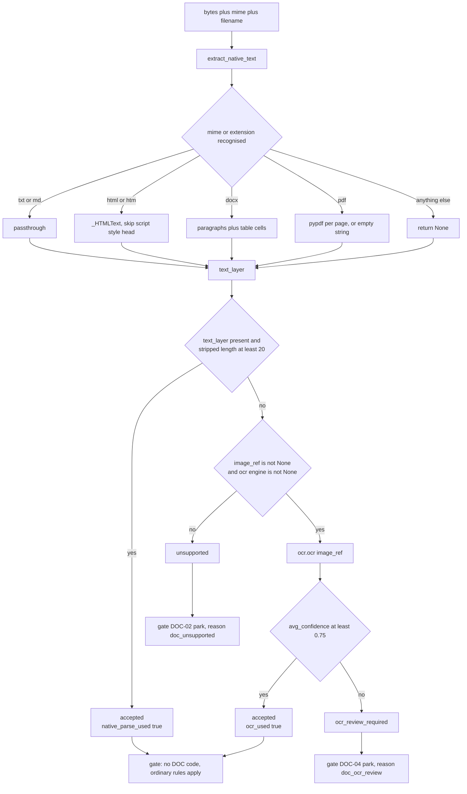
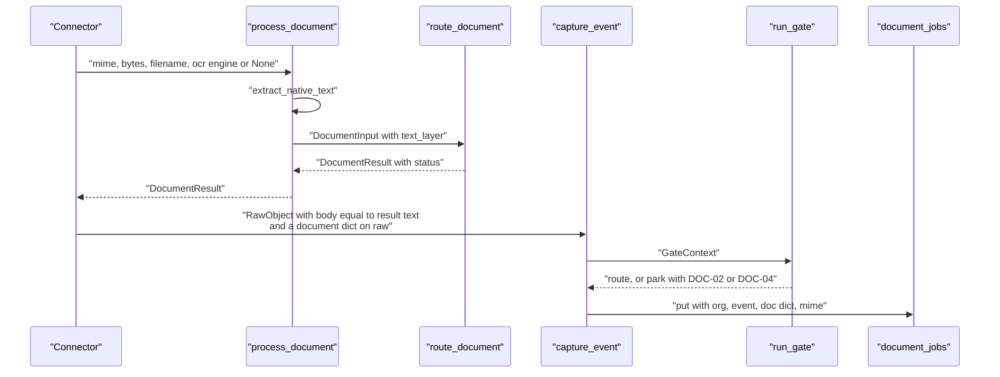

# Documents and OCR

*Stage 03 · `genios_engine/capture/documents/` — six files, 247 lines, and the only place in Layer 1 that touches file bytes.*

> **The one question this document answers: "A PDF arrives. How does it become text — and what
> happens when it cannot?"**

---

## §0 · At a glance

| | |
|---|---|
| **Files** | [`base.py`](../../../genios_engine/capture/documents/base.py) 42 · [`native.py`](../../../genios_engine/capture/documents/native.py) 89 · [`router.py`](../../../genios_engine/capture/documents/router.py) 34 · [`tesseract.py`](../../../genios_engine/capture/documents/tesseract.py) 26 · [`fake.py`](../../../genios_engine/capture/documents/fake.py) 16 · [`store.py`](../../../genios_engine/capture/documents/store.py) 40 |
| **Entry points** | `extract_native_text(mime, data, filename)` · `process_document(...)` · `route_document(doc, ocr)` |
| **Emits** | `DocumentResult` → a `document` dict on `RawObject.raw` → read by the gate and written to `document_jobs` |
| **Constants** | `OCR_MIN_CONFIDENCE = 0.75` · `_MIN_NATIVE_CHARS = 20` |
| **Statuses** | `accepted` · `ocr_review_required` · `unsupported` |
| **Gate codes** | `DOC-02` → `doc_unsupported` (**park**) · `DOC-04` → `doc_ocr_review` (**park**) |
| **Callers** | [`connectors/composio.py:310`](../../../genios_engine/capture/connectors/composio.py) (Gmail attachments) · [`connectors/drive.py:66`](../../../genios_engine/capture/connectors/drive.py) · [`pipeline.py:157`](../../../genios_engine/capture/pipeline.py) (HTML strip only) · [`context/runner.py:45`](../../../genios_engine/context/runner.py) |
| **Table** | `document_jobs` — [`0002_l1_tables.sql`](../../../migrations/0002_l1_tables.sql) |
| **Tests** | [`tests/test_documents.py`](../../../tests/test_documents.py) — 4 cases, one per route |

---

## §1 · What this is

The package docstring is the whole design in four sentences:

> Documents & OCR. Native text extraction first; OCR only when a document is
> scanned/image-only or has insufficient text. Tesseract sits behind an interface
> (swappable / async worker later). Low-quality OCR parks, never becomes a fact.

Three commitments follow from it, and everything else in this document is detail:

1. **Native first, always.** OCR is expensive, slow and lossy. If a file already carries a text
   layer, that layer wins. `native.py` opens with the same point: *"Native text extraction — NO
   OCR. If a document already has a text layer (HTML, digital PDF, docx, txt/md), we pull it
   straight out; Tesseract is only the fallback for scanned images with no text layer."*
2. **OCR sits behind a Protocol.** Nothing in the routing knows what Tesseract is.
3. **Bad OCR is never a fact.** Confidence below a threshold parks the event for a human, rather
   than feeding a plausible-looking hallucination into the knowledge graph.

---

## §2 · The contracts — `base.py`

Three dataclasses and one Protocol. 42 lines with no logic in them at all.

```python
# Threshold below which OCR output is parked for review (not used as a business fact).
# A tunable constant, not a magic number scattered in logic.
OCR_MIN_CONFIDENCE = 0.75
```

**0.75 has a name and one definition site.** It is imported by `router.py` and used in exactly
one comparison. Tuning it is a one-line change with no grep required — which is the entire point
of the comment.

| Type | Fields | Role |
|---|---|---|
| `DocumentInput` | `mime` · `filename` · `text_layer: str \| None` · `image_ref: str \| None` · `document_hash: str \| None` | what the router is asked about. `text_layer` = *"extractable text if the format has one"*; `image_ref` = *"pointer to image bytes for scanned/image docs"* |
| `OcrResult` | `text` · `avg_confidence: float` · `pages: int` · `engine: str` | what any OCR engine returns |
| `DocumentResult` | `text` · `native_parse_used: bool` · `ocr_used: bool` · `ocr_engine: str \| None` · `ocr_pages: int` · `avg_confidence: float \| None` · `status: str` | what the router decides |

`DocumentResult` is deliberately over-specified: `native_parse_used` and `ocr_used` are separate
booleans rather than one enum, because the row in `document_jobs` is provenance and provenance
should not need interpretation.

The engine seam is three lines:

```python
class OcrEngine(Protocol):
    name: str

    def ocr(self, image_ref: str) -> OcrResult: ...
```

A structural Protocol, not an ABC — an engine does not import anything from this package to
satisfy it. Two implementations ship: `TesseractOcr` and `FakeOcr`.

---

## §3 · Native extraction — `extract_native_text`

```python
def extract_native_text(*, mime: str, data: bytes | str, filename: str = "") -> str | None:
    """Return the document's text layer, or None if it has none (scanned image →
    OCR fallback) or the format is unsupported. Never raises."""
```

**"Never raises" is the contract.** It is enforced by a bare `except Exception: return None`
around the whole dispatch. A malformed PDF, a docx written by some tool that python-docx hates,
a truncated download — none of them can take down a sync. They all become `None`, which the
router reads as *"no text layer"*, which becomes a park with a reason code. The failure is
routed, not thrown.

Dispatch is `mime` **or** filename extension, so a provider that reports
`application/octet-stream` for a `.pdf` still parses:

| Branch | Matches | Implementation | Notes |
|---|---|---|---|
| txt / md | `text/plain`, `text/markdown`, or `*.txt` / `*.md` | passthrough of `txt` | `txt` is `data` if it is already a `str`, else `data.decode(errors="ignore")` |
| html | `text/html` or `*.html` / `*.htm` | `_html_to_text` → `_HTMLText` | see below |
| docx | the OOXML wordprocessing mime or `*.docx` | `_docx_to_text` via `python-docx` | paragraphs **and** table cells |
| pdf | `application/pdf` or `*.pdf` | `_pdf_to_text` via `pypdf` | per-page `extract_text() or ""` |
| anything else | — | — | `return None` |

### §3.1 · `_HTMLText`

An `html.parser.HTMLParser` subclass with a depth counter:

```python
class _HTMLText(HTMLParser):
    _SKIP = {"script", "style", "head"}
```

`handle_starttag` increments `_skip` when it sees one of the three; `handle_endtag` decrements.
`handle_data` appends only when `_skip == 0` and the fragment is non-blank after stripping.
`text()` joins the fragments with a single space.

Skipping `script` and `style` is obvious — their contents are code, not prose. Skipping `head`
removes `<title>`, meta tags and inline CSS from marketing mail.

Two behaviours are worth knowing before you debug something with it:

- **The join is a space, so document structure is destroyed.** A four-paragraph email becomes one
  line. That is fine for an LLM and fatal for anything line-based — see
  [Preprocessing and PII](02-Preprocessing-and-PII.md) §10, where it makes `protected_line_spans`
  degenerate to a single span covering the whole body.
- **An unclosed `<head>` swallows the document.** `_skip` only ever decrements on an explicit
  `</head>`. Verified: `"<html><head><title>T</title><body><p>Hello</p></body></html>"` returns
  `""`. In `pipeline.py` the `or source_text` fallback catches this (an empty string is falsy, so
  the raw HTML is used instead); in `process_document` it does not, and the file routes to
  `unsupported`.

Plain text passed through the HTML branch survives intact, including bare `<` characters —
verified with `"Plain text, no tags at all. Price < 5 lakh."`.

### §3.2 · `_docx_to_text` reads tables

```python
def _docx_to_text(raw: bytes) -> str:
    from docx import Document
    doc = Document(io.BytesIO(raw))
    parts = [p.text.strip() for p in doc.paragraphs if p.text.strip()]
    for tbl in doc.tables:
        for row in tbl.rows:
            parts += [c.text.strip() for c in row.cells if c.text.strip()]
    return "\n".join(parts)
```

`doc.paragraphs` in python-docx returns only body paragraphs — **anything inside a table is
invisible to it**. In commercial documents the table is where the money lives: pricing grids,
line items, payment schedules, effective dates. Walking `doc.tables` explicitly is what makes a
proposal's price list reach the graph.

Unlike the HTML path, this one joins with `"\n"`, so docx text keeps its line structure.

### §3.3 · `_pdf_to_text`

```python
return "\n".join((pg.extract_text() or "") for pg in reader.pages).strip()
```

The `or ""` matters: `pypdf` returns `None` for a page with no text layer. A PDF where page 3 is a
scanned insert still yields pages 1, 2 and 4. If *every* page is scanned the join produces `""`,
which `.strip()` keeps as `""` — falsy, so the router treats it as no text layer.

### §3.4 · `process_document` — the convenience wrapper

```python
def process_document(*, mime: str, data: bytes | str, filename: str = "",
                     image_ref: str | None = None,
                     ocr: OcrEngine | None = None) -> DocumentResult:
    """Full path: native text if the format has it, else OCR (if wired), else unsupported."""
    text = extract_native_text(mime=mime, data=data, filename=filename)
    doc = DocumentInput(mime=mime, filename=filename, text_layer=text, image_ref=image_ref)
    return route_document(doc, ocr=ocr)
```

This is what the Gmail and Drive connectors call. Note the `image_ref` parameter — and note in
§7 that neither caller ever passes it.

---

## §4 · Routing — `route_document`

Thirty-four lines, three terminals, and the docstring names all three:

> Native text if usable; else OCR (if an engine is given); low-quality OCR parks.

```python
_MIN_NATIVE_CHARS = 20

def route_document(doc: DocumentInput, ocr: OcrEngine | None = None) -> DocumentResult:
    # native path
    if doc.text_layer and len(doc.text_layer.strip()) >= _MIN_NATIVE_CHARS:
        return DocumentResult(text=doc.text_layer, native_parse_used=True, ocr_used=False,
                              ocr_engine=None, ocr_pages=0, avg_confidence=None,
                              status="accepted")

    # OCR path (scanned / image-only / insufficient text)
    if doc.image_ref is not None and ocr is not None:
        r = ocr.ocr(doc.image_ref)
        status = "accepted" if r.avg_confidence >= OCR_MIN_CONFIDENCE else "ocr_review_required"
        return DocumentResult(text=r.text, native_parse_used=False, ocr_used=True,
                              ocr_engine=r.engine, ocr_pages=r.pages,
                              avg_confidence=r.avg_confidence, status=status)

    # can't parse (unsupported binary, or scanned with no OCR engine wired)
    return DocumentResult(text="", native_parse_used=False, ocr_used=False,
                          ocr_engine=None, ocr_pages=0, avg_confidence=None,
                          status="unsupported")
```

**`_MIN_NATIVE_CHARS = 20` is the "insufficient text" rule.** A scanned PDF frequently carries a
tiny text layer — a stamped page number, a footer, an OCR watermark from whatever scanned it.
Twenty characters is the line between *"this document has text"* and *"this document has debris".*
Below the line, the document is treated as having no text layer at all and falls through to the
OCR branch.

`_NATIVE_MIMES` also lives in this file — a set of seven mime strings including xlsx and pptx —
and **`route_document` never reads it.** Routing is decided entirely by whether `text_layer` came
back with enough characters. See Gaps.

### §4.1 · The three statuses, and where each lands

| `status` | Produced when | Gate code | Gate action | Reason label |
|---|---|---|---|---|
| `accepted` | native text ≥ 20 chars, **or** OCR at confidence ≥ 0.75 | none — falls through to the ordinary N-code rules | route / drop as normal | — |
| `ocr_review_required` | OCR ran, `avg_confidence < 0.75` | `DOC-04` | **park** | `doc_ocr_review` |
| `unsupported` | no usable text layer and no `(image_ref, ocr)` pair | `DOC-02` | **park** | `doc_unsupported` |

The gate reads them in [`gate/rules.py`](../../../genios_engine/capture/gate/rules.py), at the
very top of `hard_rule` — **before** every noise rule, including provider spam labels:

```python
# Documents: unparseable / low-confidence OCR → park (reviewable, never silent drop).
doc = ctx.raw.get("document") or {}
if doc.get("status") == "unsupported":
    return ("DOC-02", "park")
if doc.get("status") == "ocr_review_required":
    return ("DOC-04", "park")
```

**Both are `park`, never `drop`, and that is the whole point.** A dropped event stores no content
(`pipeline.py`: *"Dropped noise still gets NO content — only the ledger row"*). A parked event
stores its raw payload and lands in `parked_events` with its reason code and trace, recoverable
by `/recover`. A document we could not read is not noise — it is a document we could not read,
and someone may need to look at it.

One ordering consequence: `hard_rule` only runs when `whitelist()` returned `None`. A known
sender (`W-01`) or a starred email (`W-02`) bypasses `hard_rule` entirely — **so an unreadable
attachment from a known customer is not parked as `DOC-02`; it is emitted with empty text.**

---

## §5 · The OCR engines

### §5.1 · `TesseractOcr`

The comment states both the abstraction and the operational intent:

> Tesseract (English) behind the OcrEngine interface. Runs server-side, and in
> production as an ASYNC worker — never in the API request thread. Lazy import so
> dev/tests don't require the binary; wire this when OCR is enabled.

```python
class TesseractOcr:
    name = "tesseract-eng"

    def ocr(self, image_ref: str) -> OcrResult:
        import pytesseract          # lazy: needs the tesseract binary + pytesseract
        from PIL import Image

        img = Image.open(image_ref)
        data = pytesseract.image_to_data(img, lang=self._lang,
                                         output_type=pytesseract.Output.DICT)
        words = [w for w in data["text"] if w.strip()]
        confs = [int(c) for c in data["conf"] if str(c).lstrip("-").isdigit() and int(c) >= 0]
        avg = (sum(confs) / len(confs) / 100.0) if confs else 0.0
        return OcrResult(text=" ".join(words), avg_confidence=avg, pages=1, engine=self.name)
```

Four details:

- **The import is inside the method.** `pytesseract` needs a native `tesseract` binary on PATH.
  A module-level import would make the whole `capture` package unimportable on a dev laptop
  without it. `platform/wiring.py` mirrors the pattern — it imports `TesseractOcr` only inside
  `if s.enable_ocr:`, and `enable_ocr` defaults to `False`:

  > OCR (Tesseract) fallback for scanned/image docs. Native text always works; OCR
  > needs the tesseract binary, so default off — turn on where the binary is present.

- **`image_to_data`, not `image_to_string`.** The `_data` variant returns per-word confidences,
  which is the only way to compute an `avg_confidence` at all. Using `image_to_string` would make
  `OCR_MIN_CONFIDENCE` unimplementable.
- **The confidence filter is defensive.** Tesseract emits `-1` for non-text regions;
  `str(c).lstrip("-").isdigit() and int(c) >= 0` drops those and survives string-typed values.
  No words → `avg = 0.0`, which is below the threshold, which parks. Correct default.
- **`pages=1` is hard-coded.** The engine OCRs one image. Multi-page scanned PDFs would need
  page-splitting upstream, which does not exist.

The "never in the API request thread" line is intent, not enforcement. `route_document` calls
`ocr.ocr(...)` synchronously; the async worker is whatever calls `run_sync`.

### §5.2 · `FakeOcr`

```python
class FakeOcr:
    """Deterministic OCR for dev/tests — no Tesseract binary needed. The image_ref
    encodes the outcome: 'good:...' → high confidence, 'weak:...' → low confidence."""
    name = "fake-ocr"

    def ocr(self, image_ref: str) -> OcrResult:
        if image_ref.startswith("weak:"):
            return OcrResult(text="blurr d cntract renews 30 sept",
                             avg_confidence=0.42, pages=1, engine=self.name)
        return OcrResult(text="Agreement renews automatically on 30 September.",
                         avg_confidence=0.91, pages=1, engine=self.name)
```

**Encoding the outcome in the reference string is the trick that makes the whole routing table
testable with no fixtures, no image files and no binary.** A test writes `image_ref="weak:page4"`
and asserts a park; `image_ref="good:page4"` and asserts acceptance. 0.42 and 0.91 sit either
side of 0.75 with room to spare, so nudging the threshold does not silently break the tests.

The weak text is a nice touch of realism: `"blurr d cntract renews 30 sept"` is what bad OCR
actually looks like, and it is exactly the kind of string that would produce a confident, wrong
fact if it were ever accepted.

---

## §6 · Provenance — `DocumentJobStore` and `document_jobs`

```python
class DocumentJobStore(Protocol):
    """Records how each document was parsed (native vs OCR) + status — provenance for
    L2 and a review queue for ocr_review_required / unsupported files."""

    def put(self, *, org_id: str, event_id: str, doc: dict, fmt: str | None) -> None: ...
```

Written from `pipeline.py`, for any event whose raw dict carries a `document` key, and only when
a store was injected:

```python
doc = raw.raw.get("document")
if doc and document_job_store is not None:
    document_job_store.put(org_id=org_id, event_id=event.event_id, doc=doc,
                           fmt=raw.raw.get("mime"))
```

Note it is written for **every** outcome, before the `drop`/`park` early return — so a `DOC-02`
park still records how the parse was attempted. The `fmt` column stores the mime type.

`document_jobs`, from [`0002_l1_tables.sql`](../../../migrations/0002_l1_tables.sql):

| Column | Type | From |
|---|---|---|
| `id` | `text primary key` | `new_id("doc")` |
| `org_id` | `text not null` | caller |
| `event_id` | `text not null` | the `SourceEvent` |
| `format` | `text` | `raw.raw["mime"]` |
| `native_parse_used` | `boolean not null default false` | `DocumentResult` |
| `ocr_engine` | `text` | `DocumentResult` |
| `ocr_pages` | `int not null default 0` | `DocumentResult` |
| `avg_confidence` | `numeric(4,3)` | `DocumentResult` |
| `status` | `text not null` | `accepted \| ocr_review_required \| unsupported` |

The docstring calls it two things. As **provenance** it works: given a fact in the graph, this row
says whether the text behind it came from a clean text layer or from OCR at 0.78 confidence, and
Layer 2 can weigh it accordingly. As a **review queue** it does not: nothing in the codebase
issues a `select` against `document_jobs`. The queue that actually works is `parked_events`,
populated by the `DOC-02` / `DOC-04` parks.

---

## §7 · The decision, drawn



And the lifecycle of a file event:



---

## §8 · Worked example — the same scanned contract, two ways in

A supplier sends a signed renewal as a scanned PDF: no text layer, image-only, 2 pages.

### §8.1 · By email, through the Gmail connector

`ComposioGmailConnector._to_raw` walks the MIME parts and reaches the attachment loop.
The mime is `application/pdf`, which is in `_EXTRACTABLE_ATTACHMENT_MIMES`, so `worth` is `True`
and the per-attachment download happens. That download is deliberately gated:

> skip non-extractable files BEFORE the expensive per-file download (this is the L1
> speed fix): only PDFs/Office/txt, or images when OCR is on, are worth fetching.

Then:

```python
r = process_document(mime=a.get("mime") or "", data=raw_bytes,
                     filename=a.get("filename") or "", ocr=self._ocr)
```

`extract_native_text` runs `_pdf_to_text`. Every page returns `None` from `extract_text()`, the
join produces `""`, `.strip()` leaves `""`. `text_layer` is falsy.

`route_document` then checks `doc.image_ref is not None` — and `image_ref` is `None`, because
`process_document` was called without it. **The OCR branch is skipped even though `self._ocr` is
a fully-constructed `TesseractOcr`.** Result:

```
DocumentResult(text='', native_parse_used=False, ocr_used=False,
               ocr_engine=None, ocr_pages=0, avg_confidence=None,
               status='unsupported')
```

The connector emits a second `RawObject` — `object_type="email_attachment"`,
`parent_object_id` set to the message id, `body=""` and:

```python
"document": {"native_parse_used": False, "ocr_used": False, "ocr_engine": None,
             "ocr_pages": 0, "avg_confidence": None, "status": "unsupported"}
```

`capture_event` lands it, `preprocess` produces empty `clean_text`, and `hard_rule` returns
`("DOC-02", "park")` on its second line — assuming no whitelist hit. The event goes to
`parked_events` with reason `DOC-02` / label `doc_unsupported`, its payload **is** stored (parked
events keep content so `/recover` can work), and a `document_jobs` row records
`native_parse_used=false, ocr_engine=null, status='unsupported'`.

A human opens the parked queue, sees `doc_unsupported` against `renewal-signed.pdf`, and knows
exactly what to do. That part works.

### §8.2 · By upload, through `POST /api/org/{org_id}/upload`

The same PDF, dragged into the dashboard. [`api/upload_routes.py`](../../../genios_engine/api/upload_routes.py)
does not call `process_document`, `route_document` or `extract_native_text`. It has its own
private parser:

```python
def _extract_text(name: str, data: bytes) -> str:
    """Native text extraction — no OCR binary. pdf→pypdf, docx→python-docx, else utf-8 decode."""
```

The docstring is honest about it. The consequences differ from §8.1 in every particular:

| | Email attachment | Dashboard upload |
|---|---|---|
| Parser | `extract_native_text` | `upload_routes._extract_text` |
| Dispatch | mime **or** extension | extension only, via `_ext(name)` |
| HTML | `_HTMLText`, skips script/style/head | none — decoded as utf-8, tags and all |
| docx tables | **read** | **not read** — `doc.paragraphs` only |
| Result on a scanned PDF | `status="unsupported"` | `""` |
| Status recorded | `document_jobs` row | none |
| Gate outcome | `DOC-02` park, visible in the queue | no `document` dict → **no DOC code fires** |
| What the user sees | a parked file with a reason | `resource_uploads.status='indexed'`, `facts_count=0` |

`_chunk("")` returns `[]`, so no chunks are emitted, nothing is ingested, and the upload is
marked indexed with zero facts. **The scanned contract disappears silently.** There is no parked
event, no reason code, and no row in `document_jobs` — the three mechanisms this package exists
to provide.

### §8.3 · The defect, stated plainly

Two separate things are broken, and they compound:

**(a) `image_ref` is never passed, so OCR is unreachable from every shipped connector.**
`process_document` accepts `image_ref` and defaults it to `None`. Both call sites —
[`composio.py:310`](../../../genios_engine/capture/connectors/composio.py) and
[`drive.py:66`](../../../genios_engine/capture/connectors/drive.py) — omit it. Therefore
`route_document`'s guard `if doc.image_ref is not None and ocr is not None` can never be true in
production, regardless of `enable_ocr`, regardless of whether the tesseract binary is installed.
**`ocr_review_required` and `DOC-04` cannot occur outside the test suite.** Every scanned document
from every source becomes `unsupported` → `DOC-02`.

The engine itself is correct and tested. `TesseractOcr.ocr` expects something `PIL.Image.open`
accepts — a filesystem path or a file object — so the fix is upstream: render the scanned page to
an image, put it somewhere openable, and pass the reference through `process_document`.

**(b) the upload path was never wired to any of it.** The upload endpoint predates the port from
the old `genios-brain` (its module docstring says so) and kept its own extraction. Pointing
`_extract_text` at `process_document` would give uploads the mime dispatch, the docx table walk,
the `unsupported` status, the `DOC-02` park and the `document_jobs` provenance in one change —
and would still not enable OCR, because of (a).

The Layer 1 overview's scorecard already grades this line: *"Documents & OCR — works, but the
**upload** path is not wired to OCR."* That is accurate as far as it goes; (a) makes it broader.

---

## §9 · Gaps and things deliberately not done

**1 · OCR is unreachable in production.** §8.3(a). The highest-severity item here.

**2 · The upload path duplicates and diverges from this package.** §8.3(b).

**3 · `_NATIVE_MIMES` is dead.** Defined in `router.py` with seven entries, referenced nowhere.
Worse, it advertises support that does not exist: xlsx and pptx are in the set, and
`extract_native_text` has no branch for either. Verified — an `.xlsx` returns `None`.

**4 · Gmail pays to download xlsx and pptx and gets nothing.** They are in
`_EXTRACTABLE_ATTACHMENT_MIMES`, so the per-attachment network call is made, and then the parse
returns `None` → `unsupported` → `DOC-02` park. The mime lists in `composio.py` and the parser
branches in `native.py` need to agree.

**5 · `document_jobs` has no reader and no index.** Insert-only. No `select`, no endpoint, no
index beyond the primary key. The "review queue" half of its docstring is aspirational; the
working queue is `parked_events`.

**6 · `DocumentInput.document_hash` is never populated.** Declared, defaulted to `None`, never
set by any caller. Content-hash dedup of identical attachments across emails is not implemented.

**7 · `pages` is always 1.** `TesseractOcr` OCRs one image and reports one page. `ocr_pages` in
`document_jobs` will read `1` or `0` and nothing else.

**8 · Confidence is a flat mean.** `avg_confidence` averages every word equally, so a contract
whose body reads cleanly but whose signature block is illegible can average above 0.75 and be
accepted. No per-region or per-page gating exists.

**9 · English only.** `TesseractOcr(lang="eng")`, and `name = "tesseract-eng"`. The `lang`
constructor argument exists but `wiring.py` calls `TesseractOcr()` with no arguments. A scanned
Devanagari document would OCR as noise — at low confidence, so it would park rather than lie,
which is the right failure.

**10 · An unclosed `<head>` blanks an HTML document.** §3.1. Harmless in `pipeline.py` thanks to
the `or source_text` fallback; not harmless for an HTML file arriving through `process_document`.

---

## §10 · Map

**Source**

| File | Lines | What lives there |
|---|---|---|
| [`documents/base.py`](../../../genios_engine/capture/documents/base.py) | 42 | `OCR_MIN_CONFIDENCE` · `DocumentInput` · `OcrResult` · `DocumentResult` · `OcrEngine` |
| [`documents/native.py`](../../../genios_engine/capture/documents/native.py) | 89 | `_HTMLText` · `_html_to_text` · `_docx_to_text` · `_pdf_to_text` · `extract_native_text` · `process_document` |
| [`documents/router.py`](../../../genios_engine/capture/documents/router.py) | 34 | `_NATIVE_MIMES` *(unused)* · `_MIN_NATIVE_CHARS` · `route_document` |
| [`documents/tesseract.py`](../../../genios_engine/capture/documents/tesseract.py) | 26 | `TesseractOcr` |
| [`documents/fake.py`](../../../genios_engine/capture/documents/fake.py) | 16 | `FakeOcr` |
| [`documents/store.py`](../../../genios_engine/capture/documents/store.py) | 40 | `DocumentJobStore` · `InMemoryDocumentJobStore` · `PostgresDocumentJobStore` |

**Callers**

| Site | Call |
|---|---|
| [`connectors/composio.py:310`](../../../genios_engine/capture/connectors/composio.py) | `process_document(...)` per Gmail attachment, `ocr=self._ocr` |
| [`connectors/drive.py:66`](../../../genios_engine/capture/connectors/drive.py) | `process_document(...)` per Drive file, `ocr=self._ocr` |
| [`pipeline.py:157`](../../../genios_engine/capture/pipeline.py) | `extract_native_text(mime="text/html", ...)` — the HTML strip, not a document parse |
| [`context/runner.py:45`](../../../genios_engine/context/runner.py) | the same HTML strip, pre-seam fallback only |
| [`platform/wiring.py:66,80`](../../../genios_engine/platform/wiring.py) | constructs `TesseractOcr()` for Gmail and Drive when `enable_ocr` |
| [`platform/wiring.py:149`](../../../genios_engine/platform/wiring.py) | `make_document_job_store()` |
| [`api/routes.py:40`](../../../genios_engine/api/routes.py) | `_documents = make_document_job_store()`, threaded into every sync entry point |

**Table** — `document_jobs`, [`0002_l1_tables.sql`](../../../migrations/0002_l1_tables.sql); org-cascade FK in [`0033_org_data_cascade.sql`](../../../migrations/0033_org_data_cascade.sql); included in the account-erasure delete list in [`api/account_routes.py`](../../../genios_engine/api/account_routes.py).

**Tests** — [`tests/test_documents.py`](../../../tests/test_documents.py), one per terminal:

| Test | Asserts |
|---|---|
| `test_text_pdf_parses_natively_without_ocr` | `native_parse_used` and not `ocr_used`; `status == "accepted"` |
| `test_scanned_good_quality_routes_through_ocr_and_accepts` | `ocr_engine == "fake-ocr"`, `status == "accepted"` at 0.91 |
| `test_scanned_low_confidence_parks_for_review` | `status == "ocr_review_required"` at 0.42 — *"never used blindly as a fact"* |
| `test_scanned_without_ocr_engine_is_unsupported` | `ocr=None` → `status == "unsupported"` |

All four construct `DocumentInput` directly and therefore *can* set `image_ref`. **That is why the
suite is green while §8.3(a) is broken: no test exercises `process_document`, which is the
function every production caller actually uses.**

**Settings** — `enable_ocr: bool = False` in [`platform/config.py:63`](../../../genios_engine/platform/config.py).

**Endpoints** — none owned by this package. `POST /api/org/{org_id}/upload` handles files without
using it; see §8.2.

---

**See also** — [Layer 1 Overview](../00-Overview.md) · [Preprocessing and PII](02-Preprocessing-and-PII.md) ·
[Gmail Connector](../02-Knowledge-Connectors/04-Gmail-Connector.md) ·
[Calendar and Drive Connectors](../02-Knowledge-Connectors/05-Calendar-and-Drive-Connectors.md) ·
[Reason Codes](../04-ESQE/02-Reason-Codes.md)
