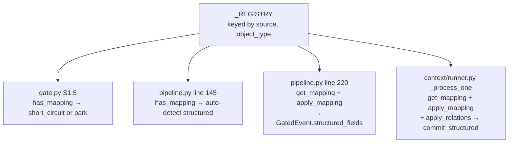
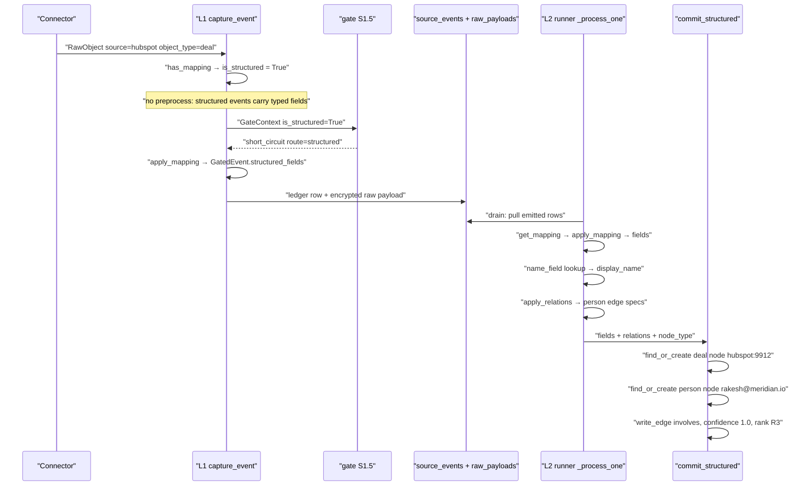
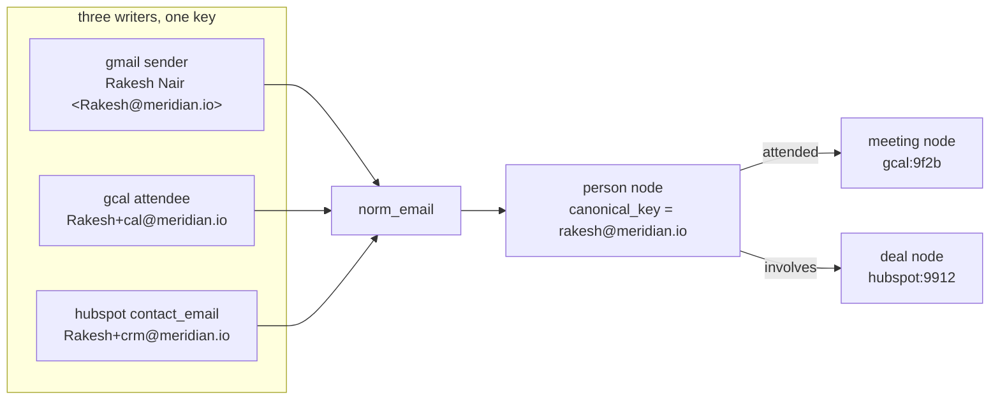

# Structured Mappings

*Layer 1 · [capture/structured/registry.py](../../../genios_engine/capture/structured/registry.py) — 108 lines, three dataclasses, four functions, four mappings · [capture/structured/apply.py](../../../genios_engine/capture/structured/apply.py) — 61 lines, two public functions*

> **When an event arrives already typed — a CRM deal, a calendar invite, a row in the
> client's own database — what turns it into graph facts and graph edges without a single
> model call, and what exactly do I write to add the next one?**

| | |
|---|---|
| **Files** | [structured/registry.py](../../../genios_engine/capture/structured/registry.py) · [structured/apply.py](../../../genios_engine/capture/structured/apply.py) · [structured/\_\_init\_\_.py](../../../genios_engine/capture/structured/__init__.py) |
| **Owns** | `FieldMap`, `RelationMap`, `StructuredMapping`, the `_REGISTRY` dict, `apply_mapping`, `apply_relations`, `_emails_from`, `_PERSONAL_DOMAINS` |
| **Imports** | `platform.identity.norm_email` — nothing else. No I/O, no clock, no DB, no model |
| **Emits** | `dict[target → value]` and `list[edge spec]`. Both plain Python, both deterministic |
| **Read by** | [gate/gate.py](../../../genios_engine/capture/gate/gate.py) S1.5 · [capture/pipeline.py](../../../genios_engine/capture/pipeline.py) · [context/runner.py](../../../genios_engine/context/runner.py) · [scripts/rebuild_graph.py](../../../scripts/rebuild_graph.py) |
| **Registered at** | **import time**. Four `register(...)` calls at module bottom |
| **Tests** | [tests/test_structured.py](../../../tests/test_structured.py) — 3 · [tests/test_identity_parity.py](../../../tests/test_identity_parity.py) — 5 · [tests/test_source_registry.py](../../../tests/test_source_registry.py) — 2 of the 12 |

---

## 1 · Why a structured object needs no model at all

The package docstring is the whole argument, and it is four lines:

> Structured short-circuit — CRM / DB / calendar / billing events whose meaning is
> already typed. Mapped to fields WITHOUT an LLM. Mappings are DATA (a registry), not
> per-source logic hardcoded in the pipeline — add a source = add a mapping.

An email carries its meaning in prose, so something has to read it. A HubSpot deal carries
`"dealstage": "proposal"`. There is nothing to infer: HubSpot is the system that *decides*
what stage the deal is in. Sending that payload to a model would be paying to re-derive a
value the source is authoritative for, and arriving at a *lower* confidence than the source
already gives you.

Layer 2's structured lane states the consequence in cost terms —
[context/structured.py](../../../genios_engine/context/structured.py):

> B1 — Structured lane. Structured events (calendar / CRM / client-DB) already carry typed
> fields (L1 mapped them via the registry). We write them straight to the graph — NO LLM,
> confidence 1.0, authority R3 (configured system-of-record). This is the cost hero.

### Mappings are data, not code

The alternative — an `if source == "hubspot": ...` chain inside the pipeline — was rejected
explicitly. The registry's own section comment says where a new source goes:

```python
# ── Built-in mappings (DATA — new source = new entry here, or load YAML/DB later) ──
# The same lane serves CRM, billing, calendar, and the client's own database.
```

Two properties follow that a hardcoded chain cannot give you:

1. **The pipeline never grows.** `capture_event` mentions no vendor. It asks
   `has_mapping(source, object_type)` and, if the answer is yes, calls `apply_mapping`.
   HubSpot, Stripe, Google Calendar and a customer's Postgres table go down the same 4 lines.
2. **The mapping is inspectable.** `all_mappings()` returns the list, and
   [tests/test_source_registry.py](../../../tests/test_source_registry.py) walks it to check
   every mapping names a source the taxonomy knows — see §4.5. You cannot walk an `if` chain.

The `postgres.customer_accounts.v1` entry is the proof: it is a *tenant's* table, mapped by
the same three lines of data as HubSpot's deal object, with a comment that says so —

> Client's own database — same mechanism, customer-defined table. (Example row shape.)

### Where the registry is consulted — four places, three layers



**`apply_relations` has no Layer 1 caller.** L1 computes `structured_fields` into the
`GatedEvent`, but the L2 drain reads database rows rather than `GatedEvent` objects, so it
re-derives the fields from the raw payload and computes the relations there for the first
time. The registry is therefore consulted twice per structured event, on two sides of the
seam, and the mapping must stay a pure function of the payload for that to be safe. It is.

---

## 2 · The three dataclasses, field by field

### `FieldMap` — one source field to one target field

```python
@dataclass(frozen=True)
class FieldMap:
    source_field: str
    target: str
    value_type: str = "string"                 # string | enum | number | timestamp
    authority: str = "source_of_record"        # per-field (not every source is SoR for every field)
```

| Field | Meaning | Consumed by |
|---|---|---|
| `source_field` | The key as it appears in `RawObject.raw` | `apply_mapping` |
| `target` | The dotted graph fact name, e.g. `deal.stage` | `apply_mapping` output key, then `write_fact(field=...)` |
| `value_type` | `string` \| `enum` \| `number` \| `timestamp` | **nothing** |
| `authority` | Per-field authority claim | **nothing** |

*`target` is the field name Layer 3's rule corpus reads.* `deal.stage` and `deal.amount` are
not descriptive labels — [packs/sales_v1.py](../../../genios_engine/packs/sales_v1.py) matches
on `deal.status` and `deal.value` derived from exactly these, so renaming a `target` silently
retires a rule.

### The comment that carries the design: per-field authority

> per-field (not every source is SoR for every field)

This is a real distinction, even though nothing reads the field yet. HubSpot is the system of
record for `dealstage` — nobody else can tell you what stage a deal is in, because the stage
*is* whatever HubSpot says. It is not obviously the system of record for `amount`, which a
finance system may hold more accurately. The one shipped override says the same thing from
the other side:

```python
FieldMap("seats_used", "product_account.seats_used", "number",
         authority="direct_observation"),
```

`plan` and `status` in the customer's own table are *configured* — a human typed them. But
`seats_used` is *counted* — the database observed it. Those are different kinds of truth and
deserve different authority when they conflict with another source.

**Today both `value_type` and `authority` are declared and unread.** `commit_structured`
hardcodes what they would have decided:

```python
wrote = store.write_fact(
    conn, org_id=org_id, subject_node_id=node, field=field, value=value,
    value_type="string", confidence=1.0, occurred_at=occurred_at,
    ...
    source=source, authority_rank=3)      # R3 system-of-record
```

Every structured fact is written as a string at authority rank 3, regardless of what its
`FieldMap` claims. See §10.

### `RelationMap` — the source object's edges

The docstring is the clearest statement of what this type is for:

> A relationship the source object carries to OTHER entities → a graph edge.
> e.g. a calendar event's `attendees` → person nodes, each person→attended→meeting.

```python
@dataclass(frozen=True)
class RelationMap:
    source_field: str                          # raw field holding the related entity/entities
    related_node_type: str                     # node_type of the related entity, e.g. "person"
    edge_type: str                             # e.g. "attended", "works_at", "about"
    direction: str = "in"                      # "in": related→this node; "out": this→related
    identity: str = "email"                    # how to build the related node's canonical_key
```

`direction` resolves in `commit_structured`, and the line is worth reading because the default
is the non-obvious one:

```python
frm, to = (other, node) if rel.get("direction", "in") == "in" else (node, other)
```

`"in"` means the edge points *at* the structured object: person → `attended` → meeting,
person → `involves` → deal. All three shipped relations use it. `"out"` is implemented and
unused.

`identity` is the only extension point with a hard floor: `apply_relations` contains
`if rel.identity == "email":` and nothing else. A relation declaring `identity="domain"`
would parse, register, and produce **zero edges, silently**. See §10.

### `StructuredMapping` — the whole entry

```python
@dataclass
class StructuredMapping:
    mapping_id: str                            # versioned, e.g. hubspot.deal.v1
    source: str
    object_type: str
    identity_field: str
    node_type: str
    fields: list[FieldMap]
    intent: str
    name_field: str | None = None              # mapped target used as the node's display_name
    relations: list[RelationMap] = field(default_factory=list)   # source object → graph edges
    tags: list[str] = field(default_factory=list)
    emit_on_change: list[str] = field(default_factory=list)
```

| Field | What it is | Who reads it |
|---|---|---|
| `mapping_id` | Versioned id, `hubspot.deal.v1`. The `.v1` is the contract version | Test assertion messages only |
| `source` | Half the registry key. Must be a source `descriptor_of()` knows | `register`, `test_source_registry` |
| `object_type` | The other half. Must be in the descriptor's `object_types` *if it enumerates any* | `register`, `test_source_registry` |
| `identity_field` | Which raw field is the object's id | **nothing** |
| `node_type` | The graph node type this object becomes: `deal`, `meeting`, `subscription`, `product_account` | `commit_structured(node_type=...)` |
| `fields` | The `FieldMap` list | `apply_mapping` |
| `intent` | Business intent label: `pipeline_update`, `invoice_event`, `scheduling_move` | **nothing** |
| `name_field` | A **target** name (not a source name) whose mapped value becomes the node's `display_name` | `context/runner.py` |
| `relations` | The `RelationMap` list | `apply_relations` |
| `tags` | Free labels: `stage_change`, `subscription_change` | **nothing** |
| `emit_on_change` | Which source fields should re-emit when they change | **nothing** |

Two of these need care.

**`name_field` holds a target, not a source.** `context/runner.py` does the lookup *after*
the mapping has run:

```python
fields = apply_mapping(mapping, raw)
display_name = fields.get(mapping.name_field) if mapping.name_field else None
```

`hubspot.deal.v1` declares `name_field="deal.title"` — the target of `FieldMap("dealname",
"deal.title")` — not `"dealname"`. Writing the source name there produces `None` and the node
falls back to its raw id in `commit_structured`:

```python
display_name=display_name or source_object_id,   # readable title, not the raw id
```

**`emit_on_change` names source fields, and nothing enforces it.** The intent is visible: for
`hubspot.deal.v1` it is `["dealstage", "amount"]` — a deal whose stage or amount moved is
news; a deal whose description was tidied is not. What actually causes a changed object to
re-land is entirely elsewhere, in `compute_dedup_key`
([contracts/source_event.py](../../../genios_engine/contracts/source_event.py)):

> For a MUTABLE structured object the connector passes a content_version (updatedAt/etag/
> watermark); a genuine change then yields a NEW key so the edit lands and updates the graph,
> while an unchanged re-sync still dedups.

So change detection is the connector's `content_version`, at whole-object granularity.
`emit_on_change` is the finer-grained rule that was written down and never wired.

---

## 3 · The registry itself — four functions, thirteen lines

```python
_REGISTRY: dict[tuple[str, str], StructuredMapping] = {}


def register(m: StructuredMapping) -> None:
    _REGISTRY[(m.source, m.object_type)] = m


def get_mapping(source: str, object_type: str) -> StructuredMapping | None:
    return _REGISTRY.get((source, object_type))


def has_mapping(source: str, object_type: str) -> bool:
    return (source, object_type) in _REGISTRY


def all_mappings() -> list[StructuredMapping]:
    return list(_REGISTRY.values())
```

| Function | Answer for an unmapped pair | Why that answer |
|---|---|---|
| `get_mapping` | `None` | The caller decides. `context/runner.py` treats `None` as "unstructured lane" |
| `has_mapping` | `False` | In the gate, false + `is_structured` = **park**, never drop. An unknown typed object is a gap, not noise |
| `all_mappings` | — | Exists so tests can walk the corpus |

**The key is the exact `(source, object_type)` tuple, unnormalised.** Unlike
[source_registry.py](../../../genios_engine/capture/source_registry.py), which lower-cases its
argument and raises on a duplicate id, `register` neither normalises nor collides —
registering a second `("hubspot", "deal")` silently replaces the first, and a mapping declared
as `("HubSpot", "deal")` is permanently unreachable because `event.source` is lower-case by
convention.

### The gate consequence: `mapping_missing` is a park

[gate/gate.py](../../../genios_engine/capture/gate/gate.py), stage S1.5, is where the registry
becomes a routing decision:

```python
# S1.5 — structured short-circuit (already typed; skips email N-codes)
if ctx.is_structured:
    if has_mapping(ctx.event.source, ctx.event.object_type):
        trace.record("S1.5", "short_circuit", reason_code="structured_mapped")
        return GateResult(action="short_circuit", route="structured")
    trace.record("S1.5", "park", reason_code="mapping_missing")
    return GateResult(action="park", reason_code="mapping_missing")
```

A typed object with no mapping does not go to the LLM and does not get dropped. It parks with
the reason code `mapping_missing`, which is a queue entry that says *"someone needs to write
three lines of registry data"*. [tests/test_structured.py](../../../tests/test_structured.py)
pins it:

```python
res = capture_event(raw, org_id="o", connection_id="c", repo=repo, is_structured=True)
assert res.outcome == "parked"
assert res.trace.records[-1].reason_code == "mapping_missing"
```

And the pipeline turns the registry into an *auto-detector*, so a connector does not have to
declare itself:

```python
# auto-detect structured sources (CRM/calendar/DB): a registry mapping means the
# object is typed → structured route (gate short-circuit), no LLM extraction.
if not is_structured and has_mapping(event.source, event.object_type):
    is_structured = True
```

---

## 4 · The four shipped mappings, in full

### 4.1 `hubspot.deal.v1`

| | |
|---|---|
| Key | `("hubspot", "deal")` |
| `identity_field` | `id` |
| `node_type` | `deal` |
| `intent` | `pipeline_update` |
| `name_field` | `deal.title` |
| `tags` | `["stage_change"]` |
| `emit_on_change` | `["dealstage", "amount"]` |

| `source_field` | `target` | `value_type` | `authority` |
|---|---|---|---|
| `dealname` | `deal.title` | `string` | `source_of_record` |
| `dealstage` | `deal.stage` | `enum` | `source_of_record` |
| `amount` | `deal.amount` | `number` | `source_of_record` |
| `closedate` | `deal.close_date` | `timestamp` | `source_of_record` |

| `source_field` | `related_node_type` | `edge_type` | `direction` | `identity` |
|---|---|---|---|---|
| `contact_email` | `person` | `involves` | `in` | `email` |
| `contacts` | `person` | `involves` | `in` | `email` |

Two relations for one concept, because two payload shapes exist in the wild: a single
`contact_email` string, and a `contacts` associations array. Both declare `edge_type
"involves"`, which matters — `apply_relations` dedups on `(edge_type, email)`, so a payload
carrying the same person in both fields produces **one** edge, not two.

### 4.2 `stripe.subscription.v1`

| | |
|---|---|
| Key | `("stripe", "subscription")` · `identity_field` `id` · `node_type` `subscription` |
| `intent` | `invoice_event` · `tags` `["subscription_change"]` · `emit_on_change` `["status"]` |
| `name_field` | **none** — the node displays as its raw `source_object_id` |
| `relations` | **none** |

| `source_field` | `target` | `value_type` |
|---|---|---|
| `status` | `subscription.status` | `enum` |
| `current_period_end` | `subscription.current_period_end` | `timestamp` |

### 4.3 `gcal.event.v1`

| | |
|---|---|
| Key | `("gcal", "calendar_event")` · `identity_field` `id` · `node_type` **`meeting`** |
| `intent` | `scheduling_move` · `name_field` `meeting.title` · `emit_on_change` `["start", "status"]` |
| `tags` | **none** |

| `source_field` | `target` | `value_type` |
|---|---|---|
| `summary` | `meeting.title` | `string` |
| `start` | `meeting.start_at` | `timestamp` |
| `end` | `meeting.end_at` | `timestamp` |
| `status` | `meeting.status` | `enum` |
| `description` | `meeting.description` | `string` |
| `location` | `meeting.location` | `string` |

| `source_field` | `related_node_type` | `edge_type` | `direction` | `identity` |
|---|---|---|---|---|
| `attendees` | `person` | `attended` | `in` | `email` |

Note `object_type="calendar_event"` but `node_type="meeting"` — the source's noun and the
graph's noun differ, and the mapping is where they are reconciled. `mapping_id` says `gcal.
event.v1` while `object_type` says `calendar_event`; the id is a label, only the tuple key
routes.

### 4.4 `postgres.customer_accounts.v1`

| | |
|---|---|
| Key | `("postgres", "public.customer_accounts")` — a **schema-qualified table name** as the object type |
| `identity_field` | `account_id` — the only mapping that is not `id` |
| `node_type` | `product_account` · `intent` `pipeline_update` · `emit_on_change` `["plan", "status"]` |
| `name_field` / `tags` / `relations` | **none** |

| `source_field` | `target` | `value_type` | `authority` |
|---|---|---|---|
| `plan` | `product_account.plan` | `enum` | `source_of_record` |
| `status` | `product_account.status` | `enum` | `source_of_record` |
| `seats_used` | `product_account.seats_used` | `number` | **`direct_observation`** |

The `object_type` is a table name, which is why the source registry deliberately declines to
enumerate `postgres`'s object types — from
[source_registry.py](../../../genios_engine/capture/source_registry.py):

> The client's own database. Object types are the tenant's tables — unenumerable here.

### 4.5 What the source registry tests hold against all four

```python
def test_structured_mappings_reference_known_sources() -> None:
    """A mapping for a source the taxonomy does not know lands its events as
    `unclassified` — which is how stripe.subscription.v1 sat unnoticed."""
    for mapping in all_mappings():
        assert descriptor_of(mapping.source) is not None, mapping.mapping_id
        assert family_of(mapping.source) != "unclassified", mapping.mapping_id
```

and

> If a source enumerates its object types, a mapping must use one of them. An empty
> tuple means 'tenant-defined' (client DB tables) and is not checked.

**A mapping is not self-sufficient.** It has to agree with the source taxonomy, or its events
land with `source_family = 'unclassified'` and every family-scoped behaviour downstream stops
seeing them. That failure had already happened once, to Stripe, and the test is the scar.

---

## 5 · The cross-tool bridge — why the two `RelationMap`s exist

The longest comment in the registry, quoted whole because it is the reason the file was
changed:

> THE CROSS-TOOL BRIDGE. Without these, a CRM deal was an ISLAND — zero edges to
> any person — so every neighbor rule (cooling_deal, competitor_in_live_deal,
> deal_sentiment_negative) was structurally unable to fire across tools, and
> single_threaded_deal fired on EVERY deal (edge_count 0). Contact emails, when
> present in the payload (either field shape), become person edges whose
> canonical keys MERGE with email/calendar-derived persons. Absent field = no-op.

### The mechanism of the island

`commit_structured` creates the deal node under a source-scoped key:

```python
node = store.find_or_create_node(
    conn, org_id=org_id, node_type=node_type,
    canonical_key=f"{source}:{source_object_id}",
    ...)
```

`hubspot:9912`. Nothing else in the system mints that key. With an empty `relations` list the
loop below it never runs, so the deal node has **degree zero** — and `correlate_event` is
handed a `touched` map containing only the deal itself.

### The four rules, and what zero edges did to each

From [packs/sales_v1.py](../../../genios_engine/packs/sales_v1.py), verbatim:

> cooling deal — a contact tied to a LIVE deal (neighbour has an open deal) whose two-way
> interaction has thinned to half its prior fortnight.

```python
{"id": "cooling_deal", "level": "predictive", "scope": "person",
 "when": [{"path": "derived.engagement", "op": "<=", "value": 0.5},
          {"neighbor_fact": "deal.status", "op": "=", "value": "open"}], ...}
```

> single-threaded deal — an open deal with ≤1 relationship in the graph = key-person risk
> (the whole deal rides one contact). Coarse threading proxy via edge_count; tunable.

```python
{"id": "single_threaded_deal", "level": "predictive", "scope": "deal",
 "when": [{"path": "deal.status", "op": "=", "value": "open"},
          {"fn": "edge_count", "op": "<=", "value": 1}], ...}
```

| Rule | Scope | The predicate that needed an edge | Behaviour with degree 0 |
|---|---|---|---|
| `cooling_deal` | person | `neighbor_fact deal.status = open` | No person is adjacent to any deal → **never fires** |
| `competitor_in_live_deal` | deal | `neighbor_has_obs competitor` | The deal has no neighbours to carry the observation → **never fires** |
| `deal_sentiment_negative` | deal | neighbour observation | → **never fires** |
| `single_threaded_deal` | deal | `edge_count <= 1` | `0 <= 1` is true for every open deal → **fires on all of them** |

**Three rules could not fire and a fourth could not stop firing, and the cause was two absent
lines of registry data — not a defect in any rule.** That is the argument for keeping
relations in the mapping rather than in the rules: a rule that reasons over neighbours is only
as good as whoever wrote the edges, and the edges are the source's business, declared once.

The bridge is also explicitly permissive about missing data — *"Absent field = no-op"* — which
is the `raw_val in (None, "", [])` guard in §7. A HubSpot instance that never populates
`contact_email` degrades to exactly the old behaviour, with no error.

---

## 6 · `apply_mapping` and its one conservative rule

```python
def apply_mapping(mapping: StructuredMapping, raw_fields: dict[str, Any]) -> dict[str, Any]:
    """Map a structured source object's fields to target fields per the mapping.
    Deterministic, no LLM. Unknown source fields are ignored (never guessed)."""
    out: dict[str, Any] = {}
    for fm in mapping.fields:
        if fm.source_field in raw_fields:
            out[fm.target] = raw_fields[fm.source_field]
    return out
```

Eight lines. Three properties, all load-bearing.

**Unknown source fields are ignored, never guessed.** The loop iterates the *mapping*, not the
payload. A HubSpot payload with forty properties contributes at most four facts. There is no
fuzzy name matching, no "`deal_stage` probably means `dealstage`", no fallback. Anything the
mapping did not declare does not exist. The test states it as an assertion:

```python
fields = apply_mapping(m, {"dealstage": "proposal", "amount": 800000, "junk": "x"})
assert fields == {"deal.stage": "proposal", "deal.amount": 800000}   # junk ignored
```

**A missing source field produces no key at all — not a `None`.** The guard is
`if fm.source_field in raw_fields`, membership, not truthiness. Note what the same test
asserts by omission: `dealname` and `closedate` were absent from the payload and are absent
from the output, rather than present-and-null. That matters at commit, because
`commit_structured` skips empties:

```python
for field, value in (structured_fields or {}).items():
    if value in (None, ""):
        continue
```

A partial payload therefore **updates the fields it carries and leaves the rest of the node
alone**. It cannot blank `deal.close_date` by not mentioning it.

**Falsy-but-real values survive.** Because the test is membership, `"amount": 0` maps to
`deal.amount = 0`, and `0 in (None, "")` is `False`, so it is written as a fact. A deal worth
nothing is a fact; a deal whose amount was not in the payload is not.

**No type coercion happens anywhere.** `value_type` is not consulted, so `closedate` reaches
`write_fact` as whatever the connector put there — string, epoch integer, whatever — and is
stored with `value_type="string"`. §10.

---

## 7 · `apply_relations`, `_emails_from`, and the one canonical key

```python
def apply_relations(mapping: StructuredMapping, raw_fields: dict[str, Any]) -> list[dict[str, Any]]:
    """Resolve a structured object's declared relations into edge specs the commit layer can
    write: {node_type, canonical_key, display_name, edge_type, direction}. Deterministic, no LLM.
    Person identity is the lowercased email so attendee-persons MERGE with pipeline-created persons."""
    out: list[dict[str, Any]] = []
    seen: set[tuple[str, str]] = set()
    for rel in mapping.relations:
        raw_val = raw_fields.get(rel.source_field)
        if raw_val in (None, "", []):
            continue
        if rel.identity == "email":
            for email, name in _emails_from(raw_val):
                key = (rel.edge_type, email)
                if key in seen:
                    continue
                seen.add(key)
                out.append({"node_type": rel.related_node_type, "canonical_key": email,
                            "display_name": name or email, "edge_type": rel.edge_type,
                            "direction": rel.direction})
    return out
```

Four guards in twenty lines:

| Guard | Line | What it prevents |
|---|---|---|
| `raw_val in (None, "", [])` | absent / empty field | An edgeless payload raising instead of no-opping |
| `if rel.identity == "email"` | unimplemented identity kinds | Minting a key by a scheme nobody wrote |
| `seen` on `(edge_type, email)` | `contact_email` **and** `contacts` naming the same person | A duplicate edge from two shapes of one fact |
| `canonical or ...` inside `_emails_from` | malformed addresses | A person node keyed `"not-an-email"` |

### `_emails_from` — three payload shapes, one output

> Normalise an attendees-style field into (email, display_name) pairs. Accepts a bare
> string, a list of strings, or a list of {email, displayName} dicts (Google/CRM shapes).

```python
items = value if isinstance(value, list) else [value]
for it in items:
    if isinstance(it, str):
        email, name = it, None
    elif isinstance(it, dict):
        email, name = it.get("email") or it.get("address"), it.get("displayName") or it.get("name")
    else:
        continue
    canonical = norm_email(email)
    if canonical:
        out.append((canonical, name))
```

| Shape | Example | Yields |
|---|---|---|
| Bare string | `"rakesh@meridian.io"` | `[("rakesh@meridian.io", None)]` |
| List of strings | `["a@x.com", "b@x.com"]` | two pairs, no names |
| List of dicts | `[{"email": ..., "displayName": ...}]` | pairs with names |
| Dict key fallbacks | `address` for the email, `name` for the label | Outlook-style payloads |
| Anything else | `[42]`, `[None]`, a nested list | `continue` — dropped without error |

The display name is *optional in both shapes*, and `apply_relations` falls back with
`name or email`. A HubSpot `contact_email` string therefore produces a person node displayed
as the address itself — accurate, if not pretty — until an email or calendar event supplies a
real name for the same key.

### Person identity is `norm_email`, and that is the whole point

> Person identity is the lowercased email so attendee-persons MERGE with pipeline-created
> persons.

The canonical function lives one layer down, in
[platform/identity.py](../../../genios_engine/platform/identity.py), and its module docstring
is the best statement of why any of this exists:

> Identity is the substrate of cross-intelligence: the same human arriving via gmail
> (sender), calendar (attendee), CRM (contact) and a typed note must converge on ONE
> node, or every cross-tool rule reasons about strangers. That only holds if every
> writer computes the SAME canonical key — and it didn't: the structured lane
> lowercased only, while the extraction pipeline also stripped +tags, so
> priya+cal@x.com (calendar) and priya@x.com (email) became two people.

```python
def norm_email(email: str | None) -> str | None:
    """Canonical email key: lowercase + trim + strip a +tag suffix from the local
    part. None for malformed input. THE person-identity function — every layer that
    mints a person canonical_key must use exactly this."""
    if not email or "@" not in str(email):
        return None
    local, _, dom = str(email).strip().lower().partition("@")
    local = local.split("+", 1)[0]
    return f"{local}@{dom}" if local and dom else None
```

Three transformations, in order: strip whitespace, lower-case, drop everything from the first
`+` in the local part. `Priya+cal@Chat360.io` → `priya@chat360.io`.

`apply.py` does not reimplement any of it — it imports the function:

```python
from genios_engine.platform.identity import norm_email
```

and [tests/test_identity_parity.py](../../../tests/test_identity_parity.py) exists solely to
hold that arrangement in place. Its opening docstring:

> Identity parity — the substrate of cross-intelligence. The same human via gmail,
> calendar, CRM and a typed note must mint ONE canonical person key, byte-identical,
> from every writer. If two writers normalize differently, the graph reasons about
> strangers and every cross-tool rule dies quietly.

```python
def test_one_definition_everywhere():
    assert _norm_email is norm_email             # pipeline aliases platform.identity
```

**Identity, not equality.** The L2 extraction pipeline is required to *be* the same function
object, not merely to behave alike — the failure mode being prevented is a second
implementation that drifts.

### `_PERSONAL_DOMAINS` — declared here, used one layer up

```python
# personal mailbox domains — an attendee here is a person, never evidence of a company
_PERSONAL_DOMAINS = {"gmail.com", "googlemail.com", "outlook.com", "hotmail.com",
                     "yahoo.com", "icloud.com", "proton.me", "protonmail.com"}
```

The comment states the rule the set exists to enforce: a `gmail.com` attendee is a human, and
must not be read as evidence that a company called Gmail is involved. **`apply.py` itself
never references the set.** Its only consumer is
[context/pipeline.py](../../../genios_engine/context/pipeline.py):

```python
def _company_domain(email: str | None) -> str | None:
    """Work domain from an email → a company canonical_key. None for personal providers
    (gmail/outlook/…) and malformed addresses, so we never create a 'gmail.com' company."""
```

So `apply_relations` mints a person node for a Gmail attendee exactly as it would for a work
address — correct, because a person *is* a person — and the personal-domain filter applies
only where a company node would otherwise be created. The set is in the right module for its
meaning and the wrong module for its call graph. §10.

---

## 8 · Diagram — one structured event, both sides of the seam





---

## 9 · Worked example — a calendar invite and a HubSpot deal meeting on one person

Two connectors, two syncs, no shared code path, no model call. They converge because both
derive the same canonical key.

### Step 1 — the calendar event arrives

```python
RawObject(source="gcal", object_type="calendar_event", source_object_id="9f2b",
          occurred_at=datetime(2026, 8, 4, 10, 30, tzinfo=timezone.utc),
          actor_type="system", content_version="2026-08-01T09:12:00Z",
          raw={"id": "9f2b",
               "summary": "Meridian — pilot scoping",
               "start": "2026-08-04T10:30:00Z",
               "end": "2026-08-04T11:15:00Z",
               "status": "confirmed",
               "attendees": [{"email": "Rakesh+cal@meridian.io", "displayName": "Rakesh Nair"},
                             {"email": "priya@chat360.io", "displayName": "Priya"}]})
```

`capture_event` calls `has_mapping("gcal", "calendar_event")` → `True`, so `is_structured`
flips without the connector saying anything. Preprocessing is skipped entirely — there is no
prose to strip or mask. The gate records `S1.5 / short_circuit / structured_mapped`.
`triage_lane` returns at least `P1`, since the structured floor is 30 and no keyword scored:

```python
if ctx.is_structured:
    score = max(score, 30)          # structured business events: at least normal
```

`apply_mapping` produces four keys — `description` and `location` were absent from the payload
and are therefore absent from the result:

```python
{"meeting.title": "Meridian — pilot scoping",
 "meeting.start_at": "2026-08-04T10:30:00Z",
 "meeting.end_at": "2026-08-04T11:15:00Z",
 "meeting.status": "confirmed"}
```

### Step 2 — L2 drains it and resolves the relation

```python
relations = apply_relations(mapping, raw)
```

```python
[{"node_type": "person", "canonical_key": "rakesh@meridian.io",
  "display_name": "Rakesh Nair", "edge_type": "attended", "direction": "in"},
 {"node_type": "person", "canonical_key": "priya@chat360.io",
  "display_name": "Priya", "edge_type": "attended", "direction": "in"}]
```

`Rakesh+cal@meridian.io` lost its `+cal` tag and its capital R on the way through
`norm_email`. `commit_structured` creates a `meeting` node keyed `gcal:9f2b` with
`display_name` from `name_field="meeting.title"` — *"Meridian — pilot scoping"* — plus two
person nodes and two `attended` edges pointing at the meeting.

Graph after step 2: **3 nodes, 2 edges.**

### Step 3 — the HubSpot deal arrives, a day later, from a different connector

```python
RawObject(source="hubspot", object_type="deal", source_object_id="9912",
          occurred_at=datetime(2026, 8, 5, 9, 0, tzinfo=timezone.utc),
          actor_type="system", content_version="2026-08-05T09:00:11Z",
          raw={"id": "9912", "dealname": "Meridian pilot", "dealstage": "proposal",
               "amount": 800000, "closedate": "2026-09-30",
               "contact_email": "Rakesh+crm@meridian.io"})
```

```python
apply_mapping(...)  →  {"deal.title": "Meridian pilot", "deal.stage": "proposal",
                        "deal.amount": 800000, "deal.close_date": "2026-09-30"}

apply_relations(...) → [{"node_type": "person", "canonical_key": "rakesh@meridian.io",
                         "display_name": "rakesh@meridian.io",
                         "edge_type": "involves", "direction": "in"}]
```

Two details worth reading twice:

- `contacts` was absent, so its `RelationMap` no-opped on `raw_val in (None, "", [])`. One
  relation declared, one edge produced.
- `display_name` fell back to the address, because a bare string carries no name. The person
  node already exists with `display_name` "Rakesh Nair" from the calendar invite;
  `find_or_create_node` finds it by `canonical_key` and does not need the fallback.

### Step 4 — the convergence

`commit_structured` calls `find_or_create_node(canonical_key="rakesh@meridian.io")` and gets
back **the node the calendar invite created yesterday**. The comment on that loop:

> The related node is find-or-created by its own canonical_key (email for people) so it MERGES
> with the same entity seen elsewhere, turning the graph from a scatter of nodes into a real
> network.

Graph after step 4: **4 nodes, 3 edges.**

| Node | `canonical_key` | Minted by |
|---|---|---|
| meeting | `gcal:9f2b` | calendar |
| deal | `hubspot:9912` | HubSpot |
| person | `rakesh@meridian.io` | calendar, **found** by HubSpot |
| person | `priya@chat360.io` | calendar |

| Edge | From | To | `edge_type` |
|---|---|---|---|
| 1 | `rakesh@meridian.io` | `gcal:9f2b` | `attended` |
| 2 | `priya@chat360.io` | `gcal:9f2b` | `attended` |
| 3 | `rakesh@meridian.io` | `hubspot:9912` | `involves` |

### Step 5 — what Layer 3 can now see, and could not before

| Rule | Before the bridge | After |
|---|---|---|
| `cooling_deal` (person scope) | Rakesh has no deal neighbour → silent | Rakesh is adjacent to an open deal; if his engagement halves the rule can fire |
| `single_threaded_deal` (deal scope) | `edge_count` 0 → fires on *every* open deal | `edge_count` 1 → still fires, but now **truthfully**: this deal genuinely rides one contact |
| `competitor_in_live_deal` | no neighbour to carry the observation → silent | an observation on Rakesh from an email is now one hop from the deal |

Add a second contact to the HubSpot payload and `single_threaded_deal` goes quiet on its own,
which is what a working rule looks like.

**Not one model call was made in any of the five steps.** Two `apply_mapping` calls, two
`apply_relations` calls, four `norm_email` calls, and eight facts plus three edges at
confidence 1.0.

---

## 10 · Gaps — what the mappings declare and the engine does not read

- **`identity_field` is never used.** `commit_structured` keys the node
  `f"{source}:{source_object_id}"`, where `source_object_id` comes from the `SourceEvent`
  envelope — i.e. from whatever the *connector* chose. `postgres.customer_accounts.v1`
  declares `identity_field="account_id"` and nothing checks that the connector agreed.
- **`value_type` is never used.** Every structured fact is written with
  `value_type="string"`. A `timestamp` and a `number` land identically, and no coercion or
  validation happens at any point.
- **`FieldMap.authority` is never used.** Every structured fact is written at
  `authority_rank=3`. The `seats_used` / `direct_observation` distinction — the one place the
  concept is exercised — has no effect on conflict resolution today.
- **`emit_on_change` is never used.** Change detection is entirely
  `RawObject.content_version` folded into `dedup_key`, at whole-object granularity. A deal
  whose description was reworded re-lands exactly as loudly as one whose stage moved.
- **`intent` and `tags` are never used.** No consumer anywhere in `genios_engine`.
- **`RelationMap.identity` supports one value.** `apply_relations` has a single
  `if rel.identity == "email"` branch with no `else`. Declaring `identity="domain"` produces
  no edges and no warning — a silent no-op, not a startup error. Compare
  `source_registry.__post_init__`, which raises on an unknown family.
- **`RelationMap.direction="out"` is implemented but unused.** All three shipped relations are
  `"in"`. The `out` path in `commit_structured` has no test coverage.
- **`register()` neither normalises nor detects collisions.** A second registration for the
  same `(source, object_type)` silently wins; a mapping keyed with a capital letter is
  unreachable. `source_registry._index()` raises in the equivalent situation.
- **Only two of the four mappings carry relations.** `stripe.subscription.v1` and
  `postgres.customer_accounts.v1` are islands in exactly the way the deal was: a subscription
  node has zero edges to the person or company that holds it, and a `product_account` has
  zero edges to anything. The bridge fixed deals and meetings; billing and the client DB still
  have the disease the comment describes.
- **`_PERSONAL_DOMAINS` lives in `apply.py` and is used only by `context/pipeline.py`.** Worse,
  a near-duplicate exists in [capture/pipeline.py](../../../genios_engine/capture/pipeline.py)
  as `_FREE_MAIL`, used by `_linkage_hints` for the same purpose, and **the two lists
  disagree**: `_FREE_MAIL` has `yahoo.co.in` and lacks `protonmail.com`; `_PERSONAL_DOMAINS`
  has `protonmail.com` and lacks `yahoo.co.in`. A `protonmail.com` sender yields a
  `company_domain` linkage hint from L1 while L2 refuses to create the company node.
- **`name_field` holding a target rather than a source is undocumented and unvalidated.**
  Writing `name_field="dealname"` silently degrades every deal's display name to its raw id.
- **Mappings are Python, not data at rest.** The section comment offers *"or load YAML/DB
  later"* — there is no loader. A tenant cannot add a mapping for their own table without a
  deploy, which is awkward for the one mapping whose whole point is being tenant-defined.
- **No test covers `apply_relations` dedup across the two HubSpot shapes.**
  [tests/test_identity_parity.py](../../../tests/test_identity_parity.py) exercises
  `contact_email` alone and `contacts` alone; nothing asserts that a payload carrying both
  produces one edge, which is the `seen` set's only reason to exist.

---

## 11 · Map

| Kind | Path |
|---|---|
| Registry + the four mappings | [capture/structured/registry.py](../../../genios_engine/capture/structured/registry.py) |
| `apply_mapping` · `apply_relations` · `_emails_from` | [capture/structured/apply.py](../../../genios_engine/capture/structured/apply.py) |
| Package docstring | [capture/structured/\_\_init\_\_.py](../../../genios_engine/capture/structured/__init__.py) |
| The canonical person key | [platform/identity.py](../../../genios_engine/platform/identity.py) |
| Gate short-circuit (S1.5) | [capture/gate/gate.py](../../../genios_engine/capture/gate/gate.py) |
| L1 auto-detect + field derivation | [capture/pipeline.py](../../../genios_engine/capture/pipeline.py) |
| L2 drain, where relations are computed | [context/runner.py](../../../genios_engine/context/runner.py) |
| L2 commit — nodes, facts, edges, correlation | [context/structured.py](../../../genios_engine/context/structured.py) |
| Company-domain filter, the only `_PERSONAL_DOMAINS` reader | [context/pipeline.py](../../../genios_engine/context/pipeline.py) |
| Source taxonomy the mappings must agree with | [capture/source_registry.py](../../../genios_engine/capture/source_registry.py) |
| Rules that depend on the bridge | [packs/sales_v1.py](../../../genios_engine/packs/sales_v1.py) |
| Replay path that walks the registry | [scripts/rebuild_graph.py](../../../scripts/rebuild_graph.py) |
| Tests | [tests/test_structured.py](../../../tests/test_structured.py) · [tests/test_identity_parity.py](../../../tests/test_identity_parity.py) · [tests/test_source_registry.py](../../../tests/test_source_registry.py) |
| Sibling | [05 · The Persisted Seam](05-The-Persisted-Seam.md) · [Layer 1 Overview](../00-Overview.md) |
