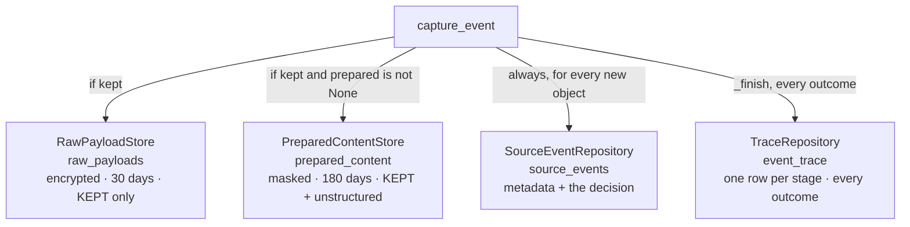
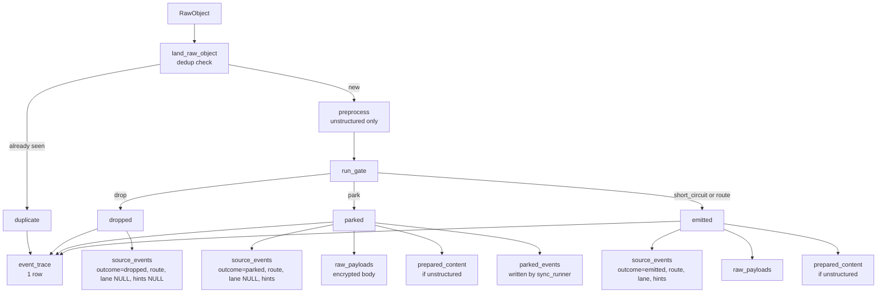

# The Persisted Seam

*Layer 1 · [migrations/0027_l1_seam.sql](../../../migrations/0027_l1_seam.sql) — 67 lines · three stores: [payload_store.py](../../../genios_engine/capture/payload_store.py) 67 · [prepared_store.py](../../../genios_engine/capture/prepared_store.py) 80 · [trace_store.py](../../../genios_engine/capture/trace_store.py) 52*

> **Layer 1 computes a route, a lane, hints, and PII-masked text with an offset map. Where
> does all of that go, what does Layer 2 read instead of re-deriving it, and what is
> deliberately not written down?**

| | |
|---|---|
| **Migration** | [0027_l1_seam.sql](../../../migrations/0027_l1_seam.sql) — the columns and tables that *are* the seam |
| **Tables** | `source_events` *(+5 columns)* · `raw_payloads` · `prepared_content` · `event_trace` · `l1_sync_runs` |
| **Stores** | `RawPayloadStore` · `PreparedContentStore` · `TraceRepository` — each a `Protocol` with an in-memory and a Postgres implementation |
| **Written by** | [capture/pipeline.py](../../../genios_engine/capture/pipeline.py) `capture_event`, lines 196–207 |
| **Read by** | [context/runner.py](../../../genios_engine/context/runner.py) `_pull` — one SQL statement, three tables |
| **TTLs** | `raw_payloads` **30 days** · `prepared_content` **180 days** (`PREPARED_TTL_DAYS`) · `event_trace` **none** |
| **Purged by** | `run_maintenance_sweep` in [api/routes.py](../../../genios_engine/api/routes.py), every tick |
| **Tests** | [tests/test_l1_seam.py](../../../tests/test_l1_seam.py) — 7 tests, one per property |

---

## 1 · What the seam is, and what it replaced

The migration header is the whole design decision, and it is worth reading before anything
else in this document:

> GeniOS Engine · L1 seam persistence. Before this, L1 computed PreparedContent
> (PII-masked text + offset map), a gate route, a triage lane and domain/linkage hints —
> then threw them ALL away, because the real L1→L2 handoff was a SQL query over
> source_events joined to raw_payloads, and L2 re-derived clean text itself. That
> inverted "heavy at ingestion, light at runtime" and made [start,end] evidence offsets
> impossible. These columns + prepared_content ARE the seam, persisted.
> All statements idempotent (the migration ledger applies this once anyway).

Three separate failures are named there, and they are worth separating:

1. **The work was done twice.** HTML stripping, quote stripping and PII masking ran at
   ingestion, were discarded, and ran again in L2 on the same bytes.
2. **The decisions were done once and lost.** The gate had already decided a route; triage had
   already computed a lane; the domain classifier had already produced hints. None of it
   survived the function call, so L2 had no way to honour a priority L1 had computed.
3. **Evidence offsets were impossible.** An offset map only means something if the text it
   maps *from* still exists. Re-deriving clean text produces different characters at different
   positions, so `[start, end]` could never point back at a source sentence.

The `GatedEvent` object ([contracts/gated_event.py](../../../genios_engine/contracts/gated_event.py))
is the in-process handoff — but the actual handoff between the two layers is a database read,
because L2 drains asynchronously. That is the reason everything on `GatedEvent` also has to
exist as a column or a row.

### The seam is written at one place, in one block

`capture_event` computes and writes it in twelve lines
([capture/pipeline.py](../../../genios_engine/capture/pipeline.py)):

```python
outcome = {"drop": "dropped", "park": "parked"}.get(gate.action, "emitted")
kept = outcome in ("emitted", "parked")
...
if kept:
    text = prepared.clean_text if prepared else None
    hints = domain_hints(event.source, text)
    links = _linkage_hints(event)
if gate.action not in ("drop", "park"):
    lane = triage_lane(ctx, prepared)
    trace.record("triage", "pass", lane=lane)
...
repo.add(event, outcome=outcome, route=gate.route, triage_lane=lane,
         domain_hints=hints or None, linkage_hints=links or None)
```

with the reasoning above it:

> The seam, computed ONCE for kept events (dropped noise gets only the ledger row):
> deterministic hints persisted WITH the decision so L2 and any replay read them
> instead of recomputing. The triage lane is the L2 DRAIN order, so it exists only
> for emitted events — a parked event's terminal trace record stays the gate's
> park decision (recovery re-emits and the drain treats lane-less as P3).

**`kept` and `gate.action not in ("drop","park")` are two different conditions and the
difference is deliberate.** A parked event is *kept* — it gets content and hints — but has no
lane, because a lane is a queue position and a parked event is not in the queue. The drain's
`coalesce(se.triage_lane, 'P3')` is the other half of that contract.

### The decision columns

```sql
-- decision columns on the ledger (envelope v2 + gate/triage outputs)
alter table source_events add column if not exists source_family text;
alter table source_events add column if not exists route text;           -- gate route (structured | needs_extraction)
alter table source_events add column if not exists triage_lane text;     -- P0..P3 processing lane
alter table source_events add column if not exists domain_hints jsonb;   -- deterministic pre-classify hints
alter table source_events add column if not exists linkage_hints jsonb;  -- S3 entity hints (company domain, thread)
```

`source_family` also gets a backfill in the same migration, computed with the same `case`
expression as [capture/source_families.py](../../../genios_engine/capture/source_families.py) —
*"backfill family for existing rows (same mapping as capture/source_families.py)"* — so a row
written before the column existed is not permanently `NULL`.

---

## 2 · The three stores

Each is a `Protocol` with two implementations. The in-memory one is what tests and a
no-`DATABASE_URL` dev run use; [platform/wiring.py](../../../genios_engine/platform/wiring.py)
chooses.



### 2.1 `RawPayloadStore` — the body, encrypted, short-lived

The Protocol docstring states the rule and the reason in one sentence:

> Raw content lives here — encrypted, with a short TTL — and ONLY for KEPT
> (emitted) events, so L2 can read the body. Dropped noise is never stored: this
> is what keeps L1 a filter, not a data warehouse.

```python
_INSERT = text(
    """
    insert into raw_payloads (id, org_id, event_id, content_type, enc_content, expires_at)
    values (:id, :org_id, :event_id, :content_type, :enc_content, :expires_at)
    on conflict (id) do nothing
    """
)
```

```python
def put(self, *, payload_id, org_id, event_id, content,
        content_type="application/json", ttl_days=30):
    expires = datetime.now(timezone.utc) + timedelta(days=ttl_days)
    with self._engine.begin() as conn:
        conn.execute(_INSERT, {
            "id": payload_id, "org_id": org_id, "event_id": event_id,
            "content_type": content_type,
            "enc_content": encrypt(content, self._key),
            "expires_at": expires,
        })
```

| Property | Value |
|---|---|
| Encryption | Fernet, via [platform/crypto.py](../../../genios_engine/platform/crypto.py), key = `GENIOS_CRYPTO_KEY` |
| Column | `enc_content bytea` — *"encrypted at rest"* in [0001_initial.sql](../../../migrations/0001_initial.sql) |
| TTL | `ttl_days: int = 30`, a **default argument**, not a module constant |
| Content | `json.dumps(raw.raw)` — the entire raw object, not just the body |
| Conflict | `do nothing`, so a re-`put` is a no-op and never re-extends the clock |
| Org cascade | `raw_payloads_org_cascade_fk … on delete cascade not valid` ([0033](../../../migrations/0033_org_data_cascade.sql)) |

Note the asymmetry with `prepared_content`: the raw TTL is a bare literal default on two method
signatures, while the prepared TTL is the named `PREPARED_TTL_DAYS`. The pipeline calls
`payload_store.put(...)` without `ttl_days`, so 30 is what ships.

### 2.2 `PreparedContentStore` — the masked, replayable form

The module docstring is the single best statement of what this table is for:

> PreparedContent persistence — the L1→L2 seam, stored.
>
> L1 pays once (HTML strip, quote strip, PII mask, offset map) at ingestion; L2 and every
> later re-extraction read the SAME prepared text instead of re-deriving it. The offset
> map is what makes '[start,end] evidence → exact source sentence' possible downstream.
>
> Retention: prepared text is the MASKED, replayable form — kept 180 days (longer than the
> encrypted raw payload's 30) so an improved extractor can re-run history without re-paying
> or re-fetching. Both clocks are enforced by purge jobs, and both stores erase by org for
> account deletion.

```python
PREPARED_TTL_DAYS = 180


class PreparedContentStore(Protocol):
    def put(self, *, org_id: str, prepared: PreparedContent,
            ttl_days: int = PREPARED_TTL_DAYS) -> None: ...
    def get_text(self, *, org_id: str, event_id: str) -> str | None: ...
```

The write flattens a `PreparedContent` pydantic model into eleven columns, four of them JSONB:

```python
"insert into prepared_content (event_id, org_id, prepared_content_id, "
"clean_text, language, masked_spans, protected_spans, offset_map, "
"signature_hints, preprocessor_version, expires_at) "
"values (:e, :o, :pid, :txt, :lang, cast(:ms as jsonb), cast(:ps as jsonb), "
"cast(:om as jsonb), cast(:sh as jsonb), :pv, :exp) "
"on conflict (event_id) do nothing"
```

`get_text` is **org-scoped on read**, not just on write:

```python
"select clean_text from prepared_content where event_id=:e and org_id=:o"
```

and the in-memory implementation reproduces the same check rather than skipping it —

```python
row = self.rows.get(event_id)
if row is None or row["org_id"] != org_id:
    return None
```

— which is what [tests/test_l1_seam.py](../../../tests/test_l1_seam.py) asserts:

```python
# and it is org-scoped
assert prepared.get_text(org_id="org_b", event_id=res.event.event_id) is None
```

**Only `clean_text` has a reader.** `masked_spans`, `protected_spans`, `offset_map`,
`signature_hints` and `preprocessor_version` are written and, today, never selected back. §8.

### 2.3 `TraceRepository` — one row per stage, for every outcome

> Persists the per-event decision trace. One row per stage in event_trace so any
> event's full path (what came in, which stage filtered it, why) is queryable.

```python
def save(self, trace: EventTrace) -> None:
    rows = [{
        "org_id": trace.org_id, "event_id": trace.event_id,
        "dedup_key": trace.dedup_key, "source": trace.source,
        "stage": r.stage, "action": r.action.value, "reason_code": r.reason_code,
        "detail": json.dumps(r.detail, default=str),
    } for r in trace.records]
    if not rows:
        return
    with self._engine.begin() as conn:
        conn.execute(_INSERT, rows)
```

One `executemany` per event, in one transaction — a trace is written whole or not at all. The
event-level fields (`org_id`, `event_id`, `dedup_key`, `source`) are **denormalised onto every
stage row**, which is why the table is queryable without a join to `source_events`. That
matters for the one query you actually want to run: *why did this event not reach the graph?*

The call site is `_finish`, the pipeline's single exit:

```python
def _finish(event: SourceEvent, trace: EventTrace, outcome: str,
            gated: GatedEvent | None, trace_repo: TraceRepository | None) -> CaptureResult:
    """Single exit: persist the decision trace (all outcomes) and return the result."""
```

**Every terminal outcome goes through `_finish`, including `duplicate` and `dropped`.** A
dropped event has no content anywhere in the system, but it has a trace row saying which stage
dropped it and under which reason code.

---

## 3 · The DDL, exactly as it ships

### `prepared_content`

```sql
-- PreparedContent, persisted: PII-masked clean text + the offset map back to source
-- characters. KEPT (emitted/parked) unstructured events only. Retained LONGER than the
-- encrypted raw payload (it is the masked, replayable form) — this is what lets an
-- improved extractor re-run over history without re-fetching or re-paying.
create table if not exists prepared_content (
    event_id              text primary key,
    org_id                text not null,
    prepared_content_id   text not null,
    clean_text            text not null,
    language              text,
    masked_spans          jsonb,
    protected_spans       jsonb,
    offset_map            jsonb,
    signature_hints       jsonb,
    preprocessor_version  text,
    created_at            timestamptz not null default now(),
    expires_at            timestamptz                          -- retention clock (180d default)
);
create index if not exists prepared_content_by_org on prepared_content (org_id, created_at);
create index if not exists prepared_content_expiry on prepared_content (expires_at);
```

Two things to notice. **`event_id` is the primary key on its own**, not `(org_id, event_id)` —
org is a filter column, and uniqueness rests on `new_id("evt")` being a UUID. And
`expires_at` is **nullable** with no default: a row written by anything other than
`PostgresPreparedContentStore.put` (which always computes it) would never be purged.

### `l1_sync_runs`

```sql
-- per-run ingestion ledger: what each sync scanned/kept/filtered, per connection.
-- (run_sync computed this and threw it into a log line.)
create table if not exists l1_sync_runs (
    run_id        text primary key,
    org_id        text not null,
    connection_id text,
    source        text,
    mode          text,
    scanned       int not null default 0,
    emitted       int not null default 0,
    dropped       int not null default 0,
    parked        int not null default 0,
    duplicate     int not null default 0,
    quarantined   int not null default 0,
    error         text,
    started_at    timestamptz,
    finished_at   timestamptz not null default now()
);
create index if not exists l1_sync_runs_by_org on l1_sync_runs (org_id, finished_at desc);
```

Same disease, one level up: the per-*run* counters were also computed and discarded. The
writer is `_run_ledger` in [api/routes.py](../../../genios_engine/api/routes.py) —

> l1_sync_runs writer — the per-run ingestion ledger run_sync used to log-and-drop.

— called from `run_sync` inside a bare `except` because *"a ledger hiccup must not fail the
sync"*. It writes ten of the fourteen columns: `error`, `started_at` and `finished_at` are
left to their defaults or `NULL`.

---

## 4 · The kept-only rule, and its three consequences

```python
# KEPT content: stash the raw body (encrypted, short TTL) for EMITTED and PARKED events.
# Parked = a human-review queue (grey-zone), so it MUST keep content to be recoverable — was
# a bug: parked stored no payload, dedup blocked re-fetch, /recover was a no-op → black hole.
# Dropped noise still gets NO content — only the ledger row (L1 stays a filter, not a warehouse).
if kept and payload_store is not None:
    event.payload_ref = new_id("pay")
repo.add(event, outcome=outcome, route=gate.route, triage_lane=lane,
         domain_hints=hints or None, linkage_hints=links or None)
if kept and payload_store is not None:
    # full raw object → L2 reads body (unstructured) or maps fields (structured); a recovered
    # parked event flips to 'emitted' and L2 reads this same payload.
    payload_store.put(payload_id=event.payload_ref, org_id=org_id,
                      event_id=event.event_id, content=json.dumps(raw.raw, default=str))
if kept and prepared is not None and prepared_store is not None:
    # the PII-masked, replayable form + offset map — retained longer than the raw payload
    prepared_store.put(org_id=org_id, prepared=prepared)
```

Note the order: `payload_ref` is assigned to the envelope **before** `repo.add`, so the ledger
row carries the pointer, and the payload row is written after — an `event_id` foreign key
into `source_events` requires the parent row to exist first.

### 4.1 Dropped noise gets a ledger row and nothing else — and that is a privacy property

The obvious reading is storage economics: an inbox firehose is mostly marketing, and not
writing it saves space. That is true and it is the smaller half.

The larger half is that **content that was never written cannot leak, cannot be subpoenaed,
cannot be mis-purged, and does not appear in a subject-access response.** A newsletter that hit
`N-04` leaves behind: one `source_events` row (sender, timestamps, `outcome='dropped'`,
`route`, no lane, no hints), and a handful of `event_trace` rows recording *stage* and *reason
code*. Its body was `raw.raw` in memory for the duration of one function call and was never
serialised.

The test is one line of assertion and one of comment:

```python
def test_dropped_noise_persists_no_content():
    res, repo, prepared = _capture(_raw(oid="m2", raw_extra=None,
                                        body="x", labelIds=["SPAM"]))
    assert res.outcome == "dropped"
    assert prepared.rows == {}                       # ledger row only, no content
    dec = repo._decision[("org_a", res.event.dedup_key)]
    assert dec["triage_lane"] is None                # lane is for emitted events only
```

The ledger migration says the same thing from the schema side
([0003_source_event_outcome.sql](../../../migrations/0003_source_event_outcome.sql)):

> source_events is the lightweight dedup + decision ledger (metadata only, no content).
> `outcome` records the gate decision so the ledger is honest about what was kept vs
> dropped. Full content lives in raw_payloads (short TTL) for KEPT events only.

*"Honest about what was kept vs dropped"* — the ledger is not a record of what the system has;
it is a record of what the system **decided**, which is a different and more useful thing.

### 4.2 Parked events DO keep content — storing none was a black hole

The comment names the bug it fixed, and the failure chain is three links long:

> Parked = a human-review queue (grey-zone), so it MUST keep content to be recoverable — was
> a bug: parked stored no payload, dedup blocked re-fetch, /recover was a no-op → black hole.

1. Park stored no payload.
2. The event *did* land in `source_events`, so `repo.exists(org_id, dedup_key)` returned
   `True` forever after — dedup blocked ever re-fetching it from the provider.
3. `/parked/{event_id}/recover` therefore had nothing to recover: no local copy, no way to
   get another one.

**Park is only meaningfully different from drop if the content survives.** Otherwise "parked"
is a drop with a nicer label and a review queue that cannot act.

The recover route now reads the payload as a precondition
([api/routes.py](../../../genios_engine/api/routes.py)):

```python
@router.post("/parked/{event_id}/recover")
def recover_parked(event_id: str, org_id: str = Depends(get_current_org)) -> dict:
    """Human promotes a grey-zone parked event → re-inject it: flip the source event to 'emitted'
    so the next L2 pass processes it (its encrypted payload was kept). No longer a no-op."""
    ...
    has_payload = c.execute(text("select 1 from raw_payloads where org_id=:o and event_id=:e"),
                            {"o": org_id, "e": event_id}).first() is not None
    if has_payload:
        reinjected = c.execute(text(
            "update source_events set outcome='emitted' where org_id=:o and event_id=:e "
            "and outcome='parked'"), {"o": org_id, "e": event_id}).rowcount > 0
```

Recovery is a single `UPDATE` of one column. Nothing is re-fetched and nothing is re-decided:
the event flips to `emitted` and the next drain picks it up with `triage_lane` still `NULL`,
which `coalesce(se.triage_lane, 'P3')` reads as the lowest lane. That is the second half of the
pipeline comment quoted in §1.

### 4.3 The TTLs are enforced by a job that runs, not by a column that hopes

`expires_at` is a number in a row. Something has to read it. The `purge_expired` docstring
records what happened when nothing did:

> Enforce the raw-content TTL (DB Law 2). Deletes encrypted raw bodies past expires_at
> and returns the count (a deletion-certificate primitive). Was NEVER run → raw PII grew
> unbounded and the 'short TTL' / deletion promise was unmet. In-process cron, no Celery.

```python
def purge_expired(self, *, org_id: str | None = None, eval_time=None) -> int:
    now = eval_time or datetime.now(timezone.utc)
    q = "delete from raw_payloads where expires_at < :now"
    params = {"now": now}
    if org_id is not None:
        q += " and org_id = :o"
        params["o"] = org_id
    with self._engine.begin() as conn:
        return conn.execute(text(q), params).rowcount
```

The prepared-content twin is four lines and has no `org_id` filter:

```python
def purge_expired(self, *, eval_time=None) -> int:
    now = eval_time or datetime.now(timezone.utc)
    with self._engine.begin() as c:
        return c.execute(text(
            "delete from prepared_content where expires_at < :now"),
            {"now": now}).rowcount
```

Both are called every tick from `run_maintenance_sweep`, the in-process scheduler heartbeat:

```python
# retention clocks, ENFORCED: raw payloads (30d), prepared text (180d), and bounded Layer 4
# context payloads. Hash/provenance rows remain after the L4 payload expires, but replay closes.
retention = {}
for name, store in (("raw_payloads", _payload_store), ("prepared_content", _prepared_store)):
    try:
        if hasattr(store, "purge_expired"):
            retention[name] = store.purge_expired()
    except Exception:                                    # noqa: BLE001 — never kill the heartbeat
        _log.exception("retention purge failed for %s", name)
        retention[name] = "error"
```

The `hasattr` guard is what lets the in-memory stores — which have no `purge_expired` — sit in
the same slot in dev without a branch. The `except` is the heartbeat rule: a purge failure is
logged and counted as `"error"` in the returned dict, and the sweep continues to card
lifecycle, the executive pass and delivery.

There is also a direct, internal-only route for the raw clock alone:

```python
@router.post("/retention/purge")
def retention_purge(_internal: None = Depends(require_internal)) -> dict:
    """Cron: enforce the raw-content TTL — delete encrypted raw_payloads past expires_at across
    all tenants (DB Law 2 / deletion promise). Internal-only. Returns the deletion count."""
```

*"A deletion-certificate primitive"* — the return value is a count, so a purge can be evidenced
rather than asserted.

### The third erasure path: by org, immediately

Both tables are in the ordered delete list in
[api/account_routes.py](../../../genios_engine/api/account_routes.py) —

```python
"raw_payloads", "prepared_content", "document_jobs", "resource_uploads",
"l2_extraction_results", "l2_processing_runs", "event_trace", "parked_events",
"source_coverage", "sync_cursors", "l1_sync_runs", "source_events",
```

— and both carry a schema-level cascade from [0033](../../../migrations/0033_org_data_cascade.sql),
whose header explains why belt and braces:

> Tenant erasure must be complete by schema, not by a best-effort application list.

---

## 5 · The retention asymmetry: 30 days versus 180

| | `raw_payloads` | `prepared_content` |
|---|---|---|
| Contents | The whole raw object, verbatim | PII-**masked** prose + offset map |
| At rest | Fernet-encrypted `bytea` | Plain `text` |
| TTL | 30 days (default arg) | 180 days (`PREPARED_TTL_DAYS`) |
| Written for | every kept event | kept **and** unstructured events only |
| Purge scope | optional `org_id` filter | all orgs |

The reason is in the module docstring, and it is a single sentence:

> kept 180 days (longer than the encrypted raw payload's 30) so an improved extractor can
> re-run history without re-paying or re-fetching.

Read the two rows as a liability and an asset. The raw payload is **someone else's data,
unmasked, in full** — every phone number, every account reference, every signature block. It is
held because L2 needs the body, and for no other reason, so it should expire as soon as that
need has passed. The prepared text is **ours**: the PII is already tokens, the HTML is already
gone, and the offset map means an evidence span still resolves. It is the artefact you would
want to keep.

That is what makes replay cheap in principle: ship a better extractor, run it over 180 days of
prepared text, and pay only for the model calls. No provider round-trips (some of which are no
longer possible — the mailbox may have been disconnected, the message deleted), no re-stripping,
no re-masking, and no re-exposure of raw PII to do it.

**In practice the replay path does not yet use it.** Both readers inner-join `raw_payloads`:

```python
"from source_events se "
"join raw_payloads rp on rp.event_id = se.event_id "
"left join prepared_content pc on pc.event_id = se.event_id and pc.org_id = se.org_id "
```

`prepared_content` is a **left** join — correctly, since structured events have no row — but
`raw_payloads` is an inner one. Once a payload passes day 30 its event disappears from the
drain entirely, prepared text or not. [scripts/rebuild_graph.py](../../../scripts/rebuild_graph.py)
`_pull_all` has the same inner join and does not select `prepared_content` at all. §8.

### What the prepared text buys today, on the live path

`_clean_for_llm` in [context/runner.py](../../../genios_engine/context/runner.py):

```python
def _clean_for_llm(raw: dict, event_id: str, prepared_text: str | None = None) -> str:
    """Prefer the SEAM: L1 already computed the PII-masked prepared text (+offset map)
    at ingestion — subject INCLUDED, masked with the body — and persisted it to
    prepared_content. Used as-is: prepending the raw subject here would reintroduce
    unmasked subject-line PII to the LLM. Fallback re-derivation only for pre-seam rows."""
    if prepared_text:
        return prepared_text
```

The parenthetical is a real regression, pinned by its own test:

> The subject is part of the prose and is masked WITH the body. (Regression: the
> seam once persisted body-only prepared text and L2 prepended the RAW subject —
> unmasked subject-line PII reached the LLM.)

```python
assert "1234 5678 9012" not in text          # masked
assert "KYC" in text                          # subject prose survives
assert "details attached" in text             # body present too
```

**The seam is a PII boundary, not only a cache.** If L2 concatenates anything onto the prepared
text, whatever it concatenates has bypassed the masker.

---

## 6 · What is written where, by outcome



| Outcome | `source_events` | `raw_payloads` | `prepared_content` | `event_trace` | `parked_events` |
|---|---|---|---|---|---|
| `duplicate` | — *(the row already exists from the first sighting)* | — | — | 1 row: `landing / drop / duplicate` | — |
| `dropped` | row, `route`, **no lane, no hints** | — | — | landing, preprocess, S0, S1 … | — |
| `parked` | row, `route`, **no lane**, hints | ✅ | ✅ if unstructured | … terminal park record | ✅ via `run_sync` |
| `emitted` | row, `route`, `triage_lane`, hints | ✅ | ✅ if unstructured | … `triage`, `emit` | — |

Two rows deserve a second look.

**A duplicate writes nothing but a trace row.** `land_raw_object` returns before `repo.add` is
ever reached, so there is no second ledger row — but there *is* a trace row proving the
provider handed us the object again and dedup caught it. That is how you tell "the connector
never sent it" apart from "we saw it and skipped it".

**A structured event never gets a `prepared_content` row.** `if not is_structured:` gates the
whole preprocessing block, so `prepared` stays `None` and the third `if kept and prepared is
not None` never fires. A CRM deal has typed fields, not prose — there is nothing to mask and
no offsets to map. The `left join` in the drain is the reader-side acknowledgement of that.

---

## 7 · Worked example — one email across all three stores

An inbound email from `priya@chat360.io`, subject *"proposal"*, body containing the word
*urgent*. This is the shape [tests/test_l1_seam.py](../../../tests/test_l1_seam.py) exercises.

### Step 0 — landing

```python
event = to_source_event(raw, org_id="org_a", connection_id="c1", ...)
# event_id   = "evt_9c41ab7e2f5d40b18a3c77e2"     (new_id, uuid4 hex[:24])
# dedup_key  = "gmail:email:m1"                    (no content_version — email is immutable)
# source_family = "communication"
```

`repo.exists("org_a", "gmail:email:m1")` → `False`.

```
event_trace  ← landing / pass / object_type=email
```

### Step 1 — preprocess

Not structured, so the block runs. Body is HTML-stripped, the subject is **prepended and masked
with it**, and `preprocess` returns a `PreparedContent`:

```python
source_text = raw.raw.get("body") or raw.raw.get("snippet") or ""
stripped = extract_native_text(mime="text/html", data=source_text) or source_text
subject = str(raw.raw.get("subject") or "")
full_text = (subject + "\n\n" + stripped) if subject else stripped
prepared = preprocess(full_text, event_id=event.event_id, mask_phone=mask_phone)
```

```
event_trace  ← preprocess / pass / language=en, masked=0, protected=1
```

### Step 2 — gate and triage

S0 passes (in scope), S1 finds no hard rule, S2 routes:

```
event_trace  ← S0 / pass
event_trace  ← S2 / pass / route=needs_extraction
```

`outcome = "emitted"`, `kept = True`.

`domain_hints("gmail", clean_text)` — no source prior for gmail, but the body matches the
`sales` keyword pattern on *proposal* → `[DomainHint(domain="sales", source="keyword")]`.

`_linkage_hints(event)` — the sender's domain is not in `_FREE_MAIL`:

```python
[{"type": "company_domain", "value": "chat360.io", "from": "sender"}]
```

`triage_lane` scores `urgent` 45 and `?` 10 → 55 → **`P1`**.

```
event_trace  ← triage / pass / lane=P1
```

### Step 3 — the three writes

```python
event.payload_ref = new_id("pay")                # "pay_5b1e…"
repo.add(event, outcome="emitted", route="needs_extraction", triage_lane="P1",
         domain_hints=[DomainHint(domain="sales", source="keyword")],
         linkage_hints=[{"type": "company_domain", "value": "chat360.io", "from": "sender"}])
payload_store.put(payload_id="pay_5b1e…", org_id="org_a",
                  event_id="evt_9c41…", content=json.dumps(raw.raw, default=str))
prepared_store.put(org_id="org_a", prepared=prepared)
```

| Table | Row |
|---|---|
| `source_events` | `event_id=evt_9c41…`, `dedup_key=gmail:email:m1`, `source_family=communication`, `outcome=emitted`, `route=needs_extraction`, `triage_lane=P1`, `domain_hints=[…sales…]`, `linkage_hints=[…chat360.io…]`, `payload_ref=pay_5b1e…` |
| `raw_payloads` | `id=pay_5b1e…`, `enc_content=<Fernet bytes>`, `content_type=application/json`, `expires_at = now + 30d` |
| `prepared_content` | `event_id=evt_9c41…`, `clean_text="proposal\n\nHi, can we meet Friday…"`, `language=en`, `offset_map=[…]`, `preprocessor_version=prep-1`, `expires_at = now + 180d` |
| `event_trace` | **5 rows**: landing, preprocess, S0, S2, emit — all carrying `dedup_key` and `source` |

Then, at the single exit:

```python
trace.record("emit", "emit", route=gated.route, lane=lane)
return _finish(event, trace, "emitted", gated, trace_repo)
```

### Step 4 — L2 reads the seam instead of re-deriving it

One statement, three tables:

```sql
select se.event_id, se.source, se.object_type, se.actor->>'email' as sender,
       se.occurred_at, se.source_object_id, se.triage_lane, se.internal_kind,
       se.parent_object_id, se.domain_hints,
       rp.enc_content,
       pc.clean_text as prepared_text
from source_events se
join raw_payloads rp on rp.event_id = se.event_id
left join prepared_content pc on pc.event_id = se.event_id and pc.org_id = se.org_id
where se.org_id=:o and se.outcome='emitted'
  and se.event_id not in (select event_id from l2_extraction_results where org_id=:o)
  and se.event_id not in (select event_id from l2_processing_runs
                          where org_id=:o and status in ('done','parked'))
order by coalesce(se.triage_lane, 'P3') asc, se.occurred_at asc
limit :lim
```

with the docstring that closes the loop opened by the migration header:

> Drain order = L1's triage lane FIRST (P0 preempts P3 — the lane was computed at
> ingestion and previously thrown away), then arrival time. Prepared text rides along
> from the seam so processing doesn't re-derive it.

Our event sorts on `'P1'`, ahead of every `P2` and `P3` regardless of arrival time — string
ordering on `P0 < P1 < P2 < P3` happens to be correct. `_clean_for_llm` sees a non-empty
`prepared_text` and returns it unchanged. `domain_hints` rides through to `process_event`.

**Nothing is recomputed.** The HTML was stripped once, the PII masked once, the lane decided
once, the hints derived once — at 09:41 on the day of ingestion, by a function that made no
model calls.

### Step 5 — thirty days later

`run_maintenance_sweep` deletes the `raw_payloads` row and reports
`{"raw_payloads": 1, "prepared_content": 0}`. The `source_events` row, the five `event_trace`
rows and the `prepared_content` row all survive: the decision record and the masked text
outlive the raw bytes by five months.

---

## 8 · Gaps — what the seam persists and nothing reads

- **The offset map has no reader.** `offset_map` is written on every prepared row, and
  `PreparedContent.to_source_offset` exists with a precise docstring — *"This is what makes
  'click a fact, see the exact sentence' work"* — but `get_text` selects only `clean_text`,
  and nothing in `genios_engine` selects `offset_map` back out. The migration header names
  evidence offsets as a motivation; the column is populated and the capability is not yet
  built on it.
- **`masked_spans`, `protected_spans`, `signature_hints`, `preprocessor_version` and
  `language` are likewise written and never selected.** `preprocessor_version` is the one that
  will bite: a replay cannot tell which rows were produced by which preprocessor without
  reading it, which is exactly the question a re-extraction has to ask.
- **The 180-day replay promise is not reachable through either existing reader.** Both
  `context/runner._pull` and `scripts/rebuild_graph._pull_all` inner-join `raw_payloads`. After
  day 30 an event with intact prepared text is invisible to both. The asymmetry is correct and
  the code that would exploit it does not exist.
- **`prepared_store.put` is `on conflict (event_id) do nothing`.** A re-processed event never
  updates its prepared text, so shipping a new `preprocessor_version` leaves every existing row
  at the old one. There is no re-prepare path.
- **`expires_at` on `prepared_content` is nullable with no default.** A row inserted by any
  path other than `put` is immortal — the purge is `expires_at < :now`, and `NULL` never
  satisfies it.
- **The raw TTL is a default argument in two signatures, not a named constant.** Compare
  `PREPARED_TTL_DAYS = 180`. Changing the raw retention means editing `ttl_days: int = 30` in
  both the Protocol and `PostgresRawPayloadStore.put`, and nothing imports it.
- **`RawPayloadStore`'s Protocol docstring is one revision behind the code.** It says *"ONLY
  for KEPT (emitted) events"*; the pipeline writes for emitted **and parked**, which is the
  whole point of §4.2.
- **`/parked/{event_id}/recover` marks a status it did not achieve.** If the payload has been
  purged, `has_payload` is `False`, `reinjected` stays `False` — and `_parked.set_status(event_id,
  "recovered")` runs anyway, outside the branch. A grey-zone event older than 30 days is
  recorded as recovered while remaining `outcome='parked'` forever.
- **`event_trace` has no TTL and no purge.** It grows with every event of every outcome,
  including dropped noise, at roughly 4–6 rows per event. Its only bounded deletion is
  whole-org erasure. The `detail` JSONB carries counts and codes rather than content, so this
  is a volume problem rather than a privacy one — but nothing trims it.
- **`l1_sync_runs` never records `error`, `started_at`, or a real `finished_at`.** `_run_ledger`
  inserts ten of the fourteen columns; the three failure/timing columns exist and are always
  `NULL` or defaulted, so a failed sync is indistinguishable from a sync that scanned nothing.
  It also has no TTL.
- **In-memory stores silently drop the TTL entirely.** `InMemoryRawPayloadStore.put` accepts
  `ttl_days` and ignores it; `InMemoryPreparedContentStore` stores no `expires_at`. Neither has
  `purge_expired`, which is why the sweep needs its `hasattr` guard. Retention is therefore
  untested in the in-memory path — no test asserts that an expired row is deleted.
- **`purge_expired` on prepared content has no `org_id` parameter**, unlike its raw-payload
  twin. Per-tenant prepared purge is not expressible without the account-erasure path.

---

## 9 · Map

| Kind | Path |
|---|---|
| The migration that *is* the seam | [migrations/0027_l1_seam.sql](../../../migrations/0027_l1_seam.sql) |
| Base tables | [migrations/0001_initial.sql](../../../migrations/0001_initial.sql) — `source_events`, `raw_payloads`, `event_trace` |
| `outcome` column + its reasoning | [migrations/0003_source_event_outcome.sql](../../../migrations/0003_source_event_outcome.sql) |
| Tenant cascade FKs | [migrations/0033_org_data_cascade.sql](../../../migrations/0033_org_data_cascade.sql) |
| Encrypted raw bodies, 30d | [capture/payload_store.py](../../../genios_engine/capture/payload_store.py) |
| Masked prepared text, 180d | [capture/prepared_store.py](../../../genios_engine/capture/prepared_store.py) |
| Per-stage decision trace | [capture/trace_store.py](../../../genios_engine/capture/trace_store.py) |
| The ledger Protocol | [capture/landing/repository.py](../../../genios_engine/capture/landing/repository.py) |
| The writer | [capture/pipeline.py](../../../genios_engine/capture/pipeline.py) |
| The contract that is flattened into `prepared_content` | [contracts/prepared_content.py](../../../genios_engine/contracts/prepared_content.py) |
| The contract behind `event_trace` | [contracts/trace.py](../../../genios_engine/contracts/trace.py) |
| Fernet encrypt/decrypt | [platform/crypto.py](../../../genios_engine/platform/crypto.py) |
| Store selection | [platform/wiring.py](../../../genios_engine/platform/wiring.py) |
| The reader | [context/runner.py](../../../genios_engine/context/runner.py) |
| Retention sweep · `/retention/purge` · `/parked/{id}/recover` · `l1_sync_runs` writer | [api/routes.py](../../../genios_engine/api/routes.py) |
| Whole-org erasure order | [api/account_routes.py](../../../genios_engine/api/account_routes.py) |
| Run summary source | [capture/acquire/sync_runner.py](../../../genios_engine/capture/acquire/sync_runner.py) |
| Tests | [tests/test_l1_seam.py](../../../tests/test_l1_seam.py) · [tests/test_intake_one_door.py](../../../tests/test_intake_one_door.py) |
| Sibling | [04 · Structured Mappings](04-Structured-Mappings.md) · [Layer 1 Overview](../00-Overview.md) |
