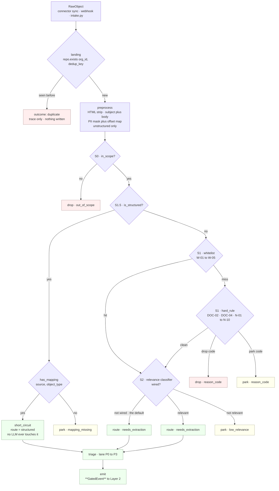

# ESQE — Overview

*Layer 1 · `genios_engine/capture/` · the qualification funnel, and everything it refuses*

> **The spec asked for a ten-component Enterprise Signal Qualification Engine as THE single
> gateway. What is actually in Layer 1, and where did the other components really go?**

| | |
|---|---|
| **Spec name** | Enterprise Signal Qualification Engine — the single gateway every signal passes |
| **Code name** | *none.* **There is no `esqe/` package.** The funnel is ten files across four sub-packages plus the spine |
| **Files** | [gate/\_\_init\_\_.py](../../../genios_engine/capture/gate/__init__.py) 6 · [gate/context.py](../../../genios_engine/capture/gate/context.py) 27 · [gate/gate.py](../../../genios_engine/capture/gate/gate.py) 54 · [gate/rules.py](../../../genios_engine/capture/gate/rules.py) 93 · [gate/relevance.py](../../../genios_engine/capture/gate/relevance.py) 51 |
| | [triage/triage.py](../../../genios_engine/capture/triage/triage.py) 43 · [domain/hints.py](../../../genios_engine/capture/domain/hints.py) 32 · [pipeline.py](../../../genios_engine/capture/pipeline.py) 227 · [parked/store.py](../../../genios_engine/capture/parked/store.py) 96 · [trace_store.py](../../../genios_engine/capture/trace_store.py) 52 |
| **Size** | **681 lines.** The decision point itself — `run_gate` — is **54 of them** |
| **Input** | a `RawObject` from a connector, or from [intake.py](../../../genios_engine/capture/intake.py) |
| **Output** | `GatedEvent` → Layer 2 *(the spec calls this a `QualifiedEnterpriseSignal`)* |
| **Terminal outcomes** | `emitted` · `dropped` · `parked` · `duplicate` · `quarantined` |
| **Trace stage names** | `landing` · `preprocess` · `S0` · `S1.5` · `S1` · `S2` · `triage` · `emit` |
| **Reason codes** | **23** in `REASON_LABELS`: 5 W · 10 N · 2 DOC · 6 stage codes |
| **LLM calls** | **Zero.** There is no model client anywhere in `capture/` |
| **Tables** | `source_events` · `event_trace` · `parked_events` · `raw_payloads` · `prepared_content` · `document_jobs` |
| **Tests** | [test_gate.py](../../../tests/test_gate.py) *(5)* · [test_relevance.py](../../../tests/test_relevance.py) *(4)* · [test_events_parked.py](../../../tests/test_events_parked.py) |
| **Endpoints** | `GET /parked` · `POST /parked/{event_id}/recover` — [api/routes.py](../../../genios_engine/api/routes.py) |

---

## 1 · What ESQE was supposed to be

The architecture spec describes one gateway. Everything entering the system passes through it,
and it decides — in one place, with one vocabulary — whether a signal is real, what it is about,
how much it matters, and where it goes next.

That framing is correct about the *shape* and wrong about the *layer*. A single gateway that also
scores business importance would have to know what the business is, and Layer 1 does not and must
not. The gateway that got built is a **narrower** gateway that runs earlier, and the components
the spec bundled into it were pushed up to the layers that can actually answer them.

> **A note on provenance.** The spec text is not checked into this repository — `docs/LAYER_MAP.md`
> and [`genios_engine/LAYERS.py`](../../../genios_engine/LAYERS.py) carry the layer names and
> nothing more. The left-hand column of the table in §3 is therefore the **claim**, carried in
> from the spec. Every other column was read out of the code and can be opened and checked.

---

## 2 · What was actually built

Ten files, no `esqe/` module, one call site. [pipeline.py](../../../genios_engine/capture/pipeline.py)
calls them in one fixed order and nothing else may call them out of order:

```python
landing = land_raw_object(raw, ...)          # dedup
...
prepared = preprocess(full_text, ...)        # HTML strip + PII mask
ctx = GateContext(event=event, prepared=prepared, raw=raw.raw, ...)
gate = run_gate(ctx, trace, relevance=relevance)
outcome = {"drop": "dropped", "park": "parked"}.get(gate.action, "emitted")
```

The gate is the only unit permitted to say *no*. Triage and domain hints run **after** the gate
and only for events that survived it — they annotate, they never reject.

The `gate/__init__.py` docstring states the contract:

> The gate — deterministic only (no per-item LLM in L1).
>
> S0 scope → S1 hard rules + whitelist → S1.5 structured short-circuit → route.
> Every stage records its decision (pass/drop/park/short_circuit) with a reason code
> into the event trace, so you can see exactly what filtered where and why.

**That docstring has the order wrong.** In [gate.py](../../../genios_engine/capture/gate/gate.py)
S1.5 is checked *before* S1, not after — a structured event never reaches the email noise rules at
all. The second sentence is exactly right and is the more important half.

---

## 3 · The honest mapping table

One row per spec component. **Where a component is not in Layer 1, the row says so and names the
file that actually holds it.**

| # | Spec component | Where it really lives | Verdict |
|---|---|---|---|
| 1 | **Single gateway / scope** | `run_gate` stage **S0**, reading `GateContext.in_scope` — [gate.py:17](../../../genios_engine/capture/gate/gate.py) | ⚠️ **In Layer 1, but inert.** No caller in the repo ever passes `in_scope=False`; `capture_event` defaults it to `True` and nothing overrides it |
| 2 | **Deduplication** | `land_raw_object` + `compute_dedup_key` + `on conflict (org_id, dedup_key) do nothing` — [pipeline.py](../../../genios_engine/capture/pipeline.py), [source_event.py](../../../genios_engine/contracts/source_event.py), [pg_repository.py](../../../genios_engine/capture/landing/pg_repository.py) | ✅ **Layer 1**, but it runs *before* the gate, not inside it |
| 3 | **Noise filtering** | `hard_rule()` — [rules.py:50](../../../genios_engine/capture/gate/rules.py). 12 rules, fixed order, reason-coded | ✅ **Layer 1.** The one component that is genuinely, wholly here — see [The Reason Codes](02-Reason-Codes.md) |
| 4 | **Semantic signal detection** | **Not Layer 1.** [context/extract/extractor.py](../../../genios_engine/context/extract/extractor.py) + [prompt.py](../../../genios_engine/context/extract/prompt.py) — *"B3 — the single combined call: relevance judgment + typed extraction with evidence"* | ❌ **Layer 2.** It needs a model. `capture/` makes zero LLM calls, structurally |
| 5 | **Relevance assessment** | **Split.** Layer 1 has an optional deterministic S2 slot (`DeterministicRelevanceClassifier`, [relevance.py](../../../genios_engine/capture/gate/relevance.py)), **off by default** — `enable_l1_relevance: bool = False` in [platform/config.py](../../../genios_engine/platform/config.py). The real judgment is the `relevance` float returned by L2's B3 call | ⚠️ **Mostly Layer 2.** L1's version is defence-in-depth and a keyword regex |
| 6 | **Importance / business scoring** | **Not Layer 1.** [reason/scoring.py](../../../genios_engine/reason/scoring.py) — `urgency()` · `impact()` · `recency()` · `confidence()` · `score()`, integer basis points | ❌ **Layer 4** (`reason/` is layer 4 in `LAYERS.py`; the file's own comment still says *"L3 scoring"*, the old dossier number). Layer 1 holds **no** business scoring of any kind |
| 7 | **Urgency detection** | **Split, and the split is deliberate.** [triage/triage.py](../../../genios_engine/capture/triage/triage.py) computes a **processing lane** P0–P3 from keyword regexes. Real urgency is `reason/scoring.py:urgency()` | ⚠️ Its own comment draws the line: *"Triage = PROCESSING ORDER only (which event gets worked first), not user priority (that is L3)"* |
| 8 | **Domain classification** | **Hints only.** [domain/hints.py](../../../genios_engine/capture/domain/hints.py) → `DomainHint(domain, source="scope"\|"keyword")` from a 6-entry source prior and 3 keyword regexes | ⚠️ *"L2's combined call decides the real domain; these narrow the search and seed schema loading"* |
| 9 | **Entity linkage / correlation** | **Hints only.** `_linkage_hints()` in [pipeline.py:71](../../../genios_engine/capture/pipeline.py) — a company domain from the sender and a thread id from the parent object. Real identity is [context/identity.py](../../../genios_engine/context/identity.py) and [context/correlation.py](../../../genios_engine/context/correlation.py) | ⚠️ *"cheap deterministic entity hints for L2 (hints only; L2 decides identity)"* |
| 10 | **Routing + audit** | `GateResult.route` ∈ `{structured, needs_extraction}`, `triage_lane`, and one `event_trace` row per stage for **every** outcome — [trace_store.py](../../../genios_engine/capture/trace_store.py) | ✅ **Layer 1**, and the strongest thing in the funnel. The trace is written even for drops |

**Three of ten are wholly in Layer 1. Two are elsewhere entirely. Five are hints or halves.**
That is not a shortfall; it is the layering rule doing its job. `tests/test_layer_topology.py`
makes it a build failure for `capture/` to import anything above it, so a Layer 1 that scored
business importance could not compile.

---

## 4 · What Layer 1 does answer

From the [Layer 1 Overview](../00-Overview.md), and it is the sentence to hold onto:

> **Layer 1 does not reason.** It never asks *"is this important to the business?"* It asks only
> *"is this real, is it new, is it safe to pass on, and how urgently should it be worked?"*

| Question | Answered by | Output |
|---|---|---|
| **Is it real?** | the connector envelope + `S0` + `hard_rule()` | drop with an N-code, or pass |
| **Is it new?** | `land_raw_object` → `repo.exists(org_id, dedup_key)` | `duplicate`, or continue |
| **Is it safe to pass on?** | `preprocess()` PII masking + `whitelist()` + `S2` | masked `prepared_content`, or park |
| **How urgently should it be worked?** | `triage_lane()` | `P0` · `P1` · `P2` · `P3` |

Every one of those is answerable from the object itself. **None of them requires knowing what the
company sells.** That is the test for whether a rule belongs in Layer 1 at all.

---

## 5 · The funnel

Real stage names, in the order the code runs them.



**Two things about that shape are the whole design.**

First, **S1.5 runs before S1.** A calendar event or a CRM deal never meets an email noise rule,
because those rules read `Precedence` headers and `no-reply@` senders that a typed object does not
have. Running them anyway would be guessing.

Second, **the whitelist runs before the hard rules.** Full argument in
[The Gate](01-The-Gate.md) §3; the one-line version is in the code:

> Deterministic S1. Whitelist runs BEFORE destructive drops so known
> customers/prospects/vendors/important-attachments are never blanket-dropped.

---

## 6 · Where an event can end

`capture_event` collapses the gate's four terminal *actions* into three *outcomes*, and the two
outcomes that never reach the gate make five in total.

```python
outcome = {"drop": "dropped", "park": "parked"}.get(gate.action, "emitted")
kept = outcome in ("emitted", "parked")
```

| Gate action | Pipeline outcome | Content stored? | Trace written? | Recoverable? |
|---|---|---|---|---|
| `route` | `emitted` | yes — payload + prepared | yes | n/a |
| `short_circuit` | `emitted` | yes — payload *(no prepared: structured events skip preprocess)* | yes | n/a |
| `park` | `parked` | **yes** — payload + prepared | yes | **yes**, `POST /parked/{id}/recover` |
| `drop` | `dropped` | **no** — ledger row only | yes | no |
| *(never reaches the gate)* | `duplicate` | no | yes | n/a |
| *(raised out of `capture_event`)* | `quarantined` | no | `poison_quarantine` row in `parked_events` | manual |

The comment on the kept-content branch records a bug that this table exists to prevent recurring:

> KEPT content: stash the raw body (encrypted, short TTL) for EMITTED and PARKED events.
> Parked = a human-review queue (grey-zone), so it MUST keep content to be recoverable — was
> a bug: parked stored no payload, dedup blocked re-fetch, /recover was a no-op → black hole.
> Dropped noise still gets NO content — only the ledger row (L1 stays a filter, not a warehouse).

---

## 7 · The documents in this folder

| # | Document | Answers |
|---|---|---|
| **00** | **Overview** *(this page)* | What ESQE was asked to be, what got built, and where the missing components actually live |
| 01 | [**The Gate**](01-The-Gate.md) | `GateContext` and `GateResult` field by field · `run_gate` stage by stage · why the stage order is the design · every `trace.record` call · four worked examples |
| 02 | [**The Reason Codes**](02-Reason-Codes.md) | All 23 codes · the five W-codes in evaluation order · every hard rule in firing order with its exact regex or header · the three deliberate absences · what an operator does about each code |
| 03 | *Relevance and Domain Hints* | The `RelevanceClassifier` Protocol, the swappable LLM slot, `_BUSINESS`, and `domain_hints()`. **Not yet written** |
| 04 | *Triage Lanes* | `triage_lane()` — the five signals, the four thresholds, and why it is order and not importance. **Not yet written** |
| 05 | *The Capture Pipeline* | `capture_event` end to end: decision-first ledger writes, the seam, the kept-only payload rule. **Not yet written** |
| 06 | *Outcomes, Traces and Parked* | `event_trace`, `parked_events`, `parked_from_trace`, and the recover path. **Not yet written** |

Upwards: [Layer 1 Overview](../00-Overview.md). Sideways:
[Knowledge Sources](../01-Knowledge-Sources/00-Overview.md) ·
[Knowledge Connectors](../02-Knowledge-Connectors/00-Overview.md).

---

## 8 · Gaps

Every row here was verified by reading the code, not inferred from the docs.

| # | Gap | Evidence |
|---|---|---|
| 1 | **Three noise rules cannot fire on live traffic.** N-01, N-02 and N-04 all read `ctx.raw["headers"]`. **No producer in the repo ever writes that key.** The Gmail connector's `raw` dict is `subject · body · snippet · labelIds · to · cc · has_attachment` — no `headers`. So `Auto-Submitted`, `List-Unsubscribe` and `Precedence` are dead in production and alive only in tests | `grep -rn '"headers"' genios_engine/capture/` returns the *reader* in [rules.py:56](../../../genios_engine/capture/gate/rules.py) and the Gmail API header *helper*, never a writer. [composio.py](../../../genios_engine/capture/connectors/composio.py) `_to_objects` builds the raw dict |
| 2 | **Two more gate inputs have no producer.** `important_attachment` (W-04) and `sender_blocked` (N-08) are read by `whitelist()`/`hard_rule()` and written by nothing in the codebase. `approved_sender` (half of W-02) likewise — only the `STARRED` label half of W-02 can fire | `grep -rn important_attachment` / `sender_blocked` / `approved_sender` each return exactly the read site in [rules.py](../../../genios_engine/capture/gate/rules.py) |
| 3 | **`REASON_LABELS` is written and never read.** Its own comment says *"Human-readable label per reason code — shown in traces/logs so a drop is legible"* — but the trace stores the bare code, and nothing imports the dict. The labels exist only in the source file | `grep -rn REASON_LABELS` returns only its definition |
| 4 | **S0 is a permanently open door.** `in_scope` defaults to `True` and no call site sets it otherwise, so `out_of_scope` can never be recorded in production | `grep -rn in_scope` finds only the default, the pass-through and the check |
| 5 | **W-01 does not fire on the webhook path.** `_sender_resolver_for` is passed to `run_sync` at four call sites but **not** to the `capture_event` call in `POST /webhooks/composio`, so a real-time Gmail push is always `sender_known=False`. The comment on the resolver records the same class of bug once already: *"The resolver param existed in run_sync since day one — it was simply never passed, so W-01 never fired in production"* | [api/routes.py:835](../../../genios_engine/api/routes.py) |
| 6 | **The gate only understands email.** Every N-code reads a Gmail-shaped field. For Notion pages, Drive files and database rows the noise filter is a no-op — as the Layer 1 roadmap says: *"The noise gate only understands email. For every other source type it does nothing at all"* | [rules.py](../../../genios_engine/capture/gate/rules.py) reads `labelIds`, `headers`, `email` only |
| 7 | **Three dead fields on the contracts.** `GateContext.active_domains` is read by nothing. `GateContext.structured_fields` is populated by the pipeline and then read from the pipeline's own local variable, never from the context. `GateResult.whitelist_code` is set on three return paths and consumed nowhere — so *which* whitelist saved an event is not persisted | `grep -rn active_domains \| whitelist_code` |
| 8 | **The docstring's stage order contradicts the code.** `gate/__init__.py` says *"S0 scope → S1 hard rules + whitelist → S1.5 structured short-circuit"*; `gate.py` runs S0 → S1.5 → S1 → S2 | compare the two files |

**None of these is a silent-data-loss bug.** Every one of them makes the gate *more* permissive
than intended — an event that should have been dropped is emitted instead. That is the correct
direction for a filter to fail in, and it is why they have survived.

---

## 9 · Map

| Kind | Path |
|---|---|
| The gate | [capture/gate/gate.py](../../../genios_engine/capture/gate/gate.py) · [context.py](../../../genios_engine/capture/gate/context.py) · [rules.py](../../../genios_engine/capture/gate/rules.py) · [relevance.py](../../../genios_engine/capture/gate/relevance.py) |
| The spine | [capture/pipeline.py](../../../genios_engine/capture/pipeline.py) |
| Triage | [capture/triage/triage.py](../../../genios_engine/capture/triage/triage.py) |
| Domain hints | [capture/domain/hints.py](../../../genios_engine/capture/domain/hints.py) |
| Structured registry | [capture/structured/registry.py](../../../genios_engine/capture/structured/registry.py) · [apply.py](../../../genios_engine/capture/structured/apply.py) |
| Deliberate sources | [capture/source_registry.py](../../../genios_engine/capture/source_registry.py) · [source_families.py](../../../genios_engine/capture/source_families.py) |
| Traces | [capture/trace_store.py](../../../genios_engine/capture/trace_store.py) · [contracts/trace.py](../../../genios_engine/contracts/trace.py) |
| Parked | [capture/parked/store.py](../../../genios_engine/capture/parked/store.py) · [contracts/parked.py](../../../genios_engine/contracts/parked.py) |
| L1→L2 contract | [contracts/gated_event.py](../../../genios_engine/contracts/gated_event.py) |
| Envelope | [contracts/source_event.py](../../../genios_engine/contracts/source_event.py) |
| Where the missing components went | [context/extract/extractor.py](../../../genios_engine/context/extract/extractor.py) *(L2)* · [reason/scoring.py](../../../genios_engine/reason/scoring.py) *(L4)* |
| Wiring | [platform/wiring.py](../../../genios_engine/platform/wiring.py) `make_relevance_classifier` · [platform/config.py](../../../genios_engine/platform/config.py) `enable_l1_relevance` |
| Migrations | [0002_l1_tables.sql](../../../migrations/0002_l1_tables.sql) · [0003_source_event_outcome.sql](../../../migrations/0003_source_event_outcome.sql) · [0027_l1_seam.sql](../../../migrations/0027_l1_seam.sql) |
| Tests | [tests/test_gate.py](../../../tests/test_gate.py) · [tests/test_relevance.py](../../../tests/test_relevance.py) · [tests/test_events_parked.py](../../../tests/test_events_parked.py) |
