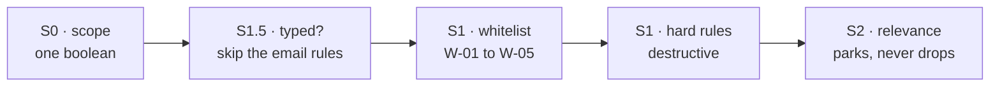
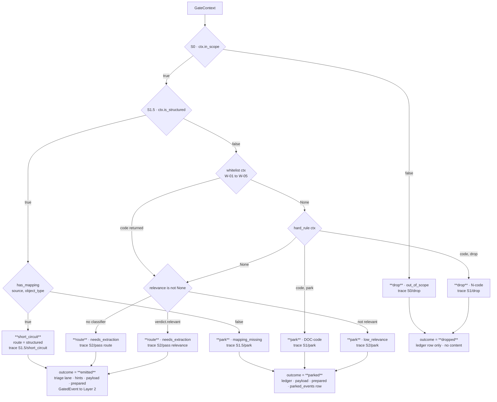

# The Gate

*Layer 1 · `genios_engine/capture/gate/` · the one unit allowed to say no*

> **What does `run_gate` actually look at, in what order does it look, and why is the order
> itself the design?**

| | |
|---|---|
| **Files** | [gate/gate.py](../../../genios_engine/capture/gate/gate.py) · **54 lines** — the whole decision |
| | [gate/context.py](../../../genios_engine/capture/gate/context.py) · 27 lines — what the gate may look at |
| | [gate/rules.py](../../../genios_engine/capture/gate/rules.py) · 93 lines — see [The Reason Codes](02-Reason-Codes.md) |
| | [gate/relevance.py](../../../genios_engine/capture/gate/relevance.py) · 51 lines — the optional S2 slot |
| **Owns** | The four stages `S0` · `S1.5` · `S1` · `S2`, and the four terminal actions |
| **Input** | one `GateContext` + one `EventTrace` + an optional `RelevanceClassifier` |
| **Output** | one `GateResult` · and 1–2 rows appended to the trace |
| **Called from** | [pipeline.py:168](../../../genios_engine/capture/pipeline.py) — the only call site in the engine |
| **Terminal actions** | `drop` · `park` · `short_circuit` · `route` |
| **LLM calls** | Zero. The S2 slot is a `Protocol`; today's implementation is a regex |
| **Tests** | [tests/test_gate.py](../../../tests/test_gate.py) *(5)* · [tests/test_relevance.py](../../../tests/test_relevance.py) *(4)* |

---

## 1 · `GateContext` — everything the gate is allowed to see

Nine fields. **The list is a permission boundary, not a convenience.** Anything not on it is
knowledge the gate must not reach for.

```python
@dataclass
class GateContext:
    event: SourceEvent
    prepared: PreparedContent | None = None
    raw: dict[str, Any] = field(default_factory=dict)      # subject, headers, snippet, flags
    is_structured: bool = False
    structured_fields: dict[str, Any] = field(default_factory=dict)
    sender_known: bool = False                             # deterministic (CRM/linkage)
    active_domains: list[str] = field(default_factory=list)
    in_scope: bool = True
```

| Field | Read by | What it is | Status |
|---|---|---|---|
| `event` | `whitelist()` — `event.actor.type`, `event.source`, `event.source_family`; `run_gate` — `event.source`, `event.object_type` | the immutable envelope from `landing/normalize.py` | live |
| `prepared` | `hard_rule()` for the body text; `DeterministicRelevanceClassifier` | the PII-masked, HTML-stripped `clean_text`. `None` for structured events, which skip preprocess entirely | live |
| `raw` | `whitelist()` and `hard_rule()` for every flag and header | the connector's own dict, untouched | live — but see §7 |
| `is_structured` | `run_gate` S1.5 | set by the caller, or auto-detected in `capture_event` when `has_mapping(source, object_type)` is true | live |
| `structured_fields` | **nothing** | the pipeline populates it and then reads its own local variable instead | **dead** |
| `sender_known` | `whitelist()` W-01, `DeterministicRelevanceClassifier`, `triage_lane()` | *"deterministic (CRM/linkage)"* — resolved by `_sender_resolver_for` against `graph_nodes` | live on sync, **not on the webhook path** |
| `active_domains` | **nothing** | declared, never read anywhere in the repo | **dead** |
| `in_scope` | `run_gate` S0 | defaults `True`; no caller ever sets it `False` | **inert** |

The comment on `sender_known` — *"deterministic (CRM/linkage)"* — is the load-bearing constraint.
The gate is permitted to know *whether* the sender is already a person in the graph, because that
is a set-membership test. It is not permitted to know *who* they are, what deal they are on, or
what they are worth. **That distinction is the whole boundary between Layer 1 and Layer 2.**

---

## 2 · `GateResult` — four fields, three of them optional

```python
@dataclass
class GateResult:
    action: str                          # route | drop | park | short_circuit
    reason_code: str | None = None
    route: str | None = None             # needs_extraction | structured
    whitelist_code: str | None = None
```

| Return path | `action` | `reason_code` | `route` | `whitelist_code` |
|---|---|---|---|---|
| S0 out of scope | `drop` | `out_of_scope` | — | — |
| S1.5 mapping found | `short_circuit` | **—** | `structured` | — |
| S1.5 no mapping | `park` | `mapping_missing` | — | — |
| S1 hard rule | `drop` *or* `park` | the code, e.g. `N-06` | — | — |
| S2 classifier says no | `park` | `low_relevance` | — | the W-code, if any |
| S2 classifier says yes | `route` | — | `needs_extraction` | the W-code, if any |
| S2 no classifier *(the default)* | `route` | — | `needs_extraction` | the W-code, if any |

Two asymmetries worth knowing before you change this file:

- **`short_circuit` carries no `reason_code`.** The trace records `structured_mapped`; the result
  object does not. Anything downstream reading `GateResult.reason_code` sees `None` for a
  perfectly successful structured event.
- **`whitelist_code` is set only on the three S2 paths and read by nobody.** *Which* whitelist code
  saved an event is therefore not persisted anywhere — the trace records it as a `detail` on the
  S1 row, and that is the only surviving copy.

---

## 3 · `run_gate`, stage by stage

### S0 — scope

```python
if not ctx.in_scope:
    trace.record("S0", "drop", reason_code="out_of_scope")
    return GateResult(action="drop", reason_code="out_of_scope")
trace.record("S0", "pass")
```

The cheapest possible check, first, so a tenant that has switched a mailbox or a folder out of
scope costs one boolean rather than a regex sweep. **As shipped it always passes** — no caller
constructs a `GateContext` with `in_scope=False`, and `capture_event`'s parameter defaults to
`True`. The stage is a door that has been built and never closed.

### S1.5 — the structured short-circuit

```python
if ctx.is_structured:
    if has_mapping(ctx.event.source, ctx.event.object_type):
        trace.record("S1.5", "short_circuit", reason_code="structured_mapped")
        return GateResult(action="short_circuit", route="structured")
    trace.record("S1.5", "park", reason_code="mapping_missing")
    return GateResult(action="park", reason_code="mapping_missing")
```

Comment in the source:

> S1.5 — structured short-circuit (already typed; skips email N-codes)

A structured object is one the source already typed: a HubSpot deal, a Google Calendar event, a
row in the tenant's own Postgres. `capture_event` sets `is_structured` automatically when the
registry knows the pair:

```python
if not is_structured and has_mapping(event.source, event.object_type):
    is_structured = True
```

There are four registered mappings today — `hubspot.deal.v1`, `stripe.subscription.v1`,
`gcal.event.v1`, `postgres.customer_accounts.v1` — in
[structured/registry.py](../../../genios_engine/capture/structured/registry.py).

**The park-on-`mapping_missing` branch is the interesting half.** A structured event whose
`(source, object_type)` pair has no mapping is *not* dropped and *not* guessed at. It parks, with a
reason code that names exactly what is missing: nobody has written a mapping for this object type
yet. That is a queue of work for an engineer, surfaced as data, and it is what
`test_unknown_structured_type_parks_for_mapping_review` asserts.

### S1 — whitelist first, then the destructive rules

```python
wl = whitelist(ctx)
if wl:
    trace.record("S1", "pass", whitelist=wl)
else:
    hit = hard_rule(ctx)
    if hit:
        code, action = hit
        trace.record("S1", action, reason_code=code)
        return GateResult(action=action, reason_code=code)
    trace.record("S1", "pass")
```

Note the `else`. **A whitelist hit does not soften the hard rules — it skips them entirely.**
`hard_rule()` is never called. This is covered in §4 and it has a consequence in §7 that is easy to
miss.

### S2 — the optional relevance slot, and its default route

```python
if relevance is not None:
    v = relevance.classify(ctx, ctx.prepared)
    if not v.relevant:
        trace.record("S2", "park", reason_code="low_relevance", relevance=v.relevance)
        return GateResult(action="park", reason_code="low_relevance", whitelist_code=wl)
    trace.record("S2", "pass", relevance=v.relevance, reason=v.reason)
    return GateResult(action="route", route="needs_extraction", whitelist_code=wl)

# S2 default — route unstructured candidate to L2's combined relevance+extraction call
trace.record("S2", "pass", route="needs_extraction")
return GateResult(action="route", route="needs_extraction", whitelist_code=wl)
```

The classifier is `None` unless `enable_l1_relevance` is set — the factory in
[platform/wiring.py](../../../genios_engine/platform/wiring.py) is explicit:

> Optional L1 S2 relevance gate. None (off) unless enabled. Deterministic today;
> swap for the LLM classifier at LLM-integration time (same interface).

**So the shipped default is: everything that survived S1 routes.** `test_relevance_off_by_default_routes_everything_past_gate`
asserts precisely that, using the text *"hey lets grab coffee sometime"* — which is emitted, because
deciding that coffee is not business is a judgment, and judgment is Layer 2's.

When it *is* wired, the low-relevance verdict **parks**. It does not drop. The comment says why:

> S2 — optional relevance classifier (defense-in-depth; deterministic now,
> LLM-swappable later). Low relevance parks for review (never a hard drop).

---

## 4 · Why the order is the design

Three orderings are doing work, and each one prevents a specific class of damage.



**S1.5 before S1 — because the email rules do not apply to typed objects.** A calendar event has no
`Precedence` header and no `no-reply@` sender. Running `hard_rule()` against it would either be a
no-op or, worse, a false positive: a calendar event with an empty description and no attachment
matches N-10 exactly. Short-circuiting first means a typed object is judged by whether we know how
to read it, not by whether it looks like a newsletter.

**Whitelist before the hard rules — the sentence the file opens with:**

> Deterministic S1. Whitelist runs BEFORE destructive drops so known
> customers/prospects/vendors/important-attachments are never blanket-dropped.

The five whitelist codes each name a case where a noise heuristic would have been confidently
wrong:

| Code | The case it rescues | The rule it would otherwise have hit |
|---|---|---|
| W-01 `known_sender` | a customer's product-update mail that carries an unsubscribe footer | N-02 |
| W-02 `starred_important` | a human has already looked at this and starred it | any |
| W-03 `agent_event` | an agent reporting a completed action, from a machine address | N-03, N-01 |
| W-04 `important_attachment` | a contract or invoice on an otherwise empty mail | N-10 |
| W-05 `deliberate_source` | a policy someone typed into `POST /api/org/{org}/knowledge` | N-10, N-03 |

W-05 carries its own argument in the source:

> a human/agent deliberately handed us this —
> N-codes exist for inbox firehoses, not for it

**S2 last, and parking rather than dropping.** By the time S2 runs, everything cheap and certain has
already been decided. What is left is genuinely grey, and the layer's rule for grey is written into
the parked contract:

> Parked ≠ deleted. An uncertain/unsupported event, reviewable with its reason,
> stage, and trace. Recover re-injects it; retention is governance policy, not hidden delete.

---

## 5 · Every `trace.record` call

`EventTrace.record(stage, action, reason_code=None, **detail)` appends one `StageRecord`. The gate
makes exactly seven distinct calls; a single event triggers one or two of them.

| # | Stage | Action | `reason_code` | `detail` | When |
|---|---|---|---|---|---|
| 1 | `S0` | `drop` | `out_of_scope` | — | `ctx.in_scope` is false |
| 2 | `S0` | `pass` | — | — | always, otherwise |
| 3 | `S1.5` | `short_circuit` | `structured_mapped` | — | typed **and** a mapping exists |
| 4 | `S1.5` | `park` | `mapping_missing` | — | typed, no mapping |
| 5 | `S1` | `pass` | — | `{"whitelist": "W-0n"}` | a whitelist code hit |
| 6 | `S1` | `drop` \| `park` | the DOC/N code | — | a hard rule hit |
| 7 | `S1` | `pass` | — | — | nothing hit |
| 8 | `S2` | `park` | `low_relevance` | `{"relevance": 0.30}` | classifier wired, not relevant |
| 9 | `S2` | `pass` | — | `{"relevance": 0.90, "reason": "known_sender"}` | classifier wired, relevant |
| 10 | `S2` | `pass` | — | `{"route": "needs_extraction"}` | **no classifier — the default** |

Rows 9 and 10 are both `S2 / pass` and carry **different detail keys**. A query that reads
`detail->>'route'` to find routed events will silently miss every event processed with the
classifier switched on. The trace contract explains why this matters at all:

> Per-event, per-stage visibility — the debug core.
>
> Every L1 stage appends exactly what it did and why, so you can answer:
> "what came in, which stage filtered it, why, and how much" for any event.

Two more stage names are written by the pipeline, not the gate: `triage` / `pass` with
`{"lane": "P1"}`, and `emit` / `emit` with `{"route": ..., "lane": ...}`. Before the gate,
`landing` and `preprocess`. Every record, for every outcome including drops, is persisted by
[trace_store.py](../../../genios_engine/capture/trace_store.py) into `event_trace` — one row per
stage.

---

## 6 · The full decision, and how the pipeline reads it



The mapping from four actions to three outcomes is one line:

```python
outcome = {"drop": "dropped", "park": "parked"}.get(gate.action, "emitted")
kept = outcome in ("emitted", "parked")
```

**`route` and `short_circuit` both fall through the `.get` default to `emitted`.** Everything that
follows keys off `outcome` and `kept`, not off `gate.action` — except the triage call, which uses
the action directly:

```python
if gate.action not in ("drop", "park"):
    lane = triage_lane(ctx, prepared)
    trace.record("triage", "pass", lane=lane)
```

The comment explains why a parked event deliberately has no lane:

> The triage lane is the L2 DRAIN order, so it exists only
> for emitted events — a parked event's terminal trace record stays the gate's
> park decision (recovery re-emits and the drain treats lane-less as P3).

---

## 7 · Four worked examples

### 7.1 A structured calendar event → `short_circuit`

The Google Calendar connector builds this `RawObject`:

```python
RawObject(source="gcal", object_type="calendar_event", source_object_id="ev_88f2",
          occurred_at=..., actor_email="priya@acme.com", actor_type="internal_user",
          content_version="2026-08-05T11:02:14.221Z",
          raw={"summary": "Acme — pricing review", "start": "2026-08-07T10:00:00+05:30",
               "end": "2026-08-07T10:30:00+05:30", "status": "confirmed",
               "attendees": ["priya@acme.com", "rohit@genios.ai"],
               "description": "walk through the revised quote", "location": "Meet"})
```

| Step | What happens |
|---|---|
| `land_raw_object` | dedup key `gcal:calendar_event:ev_88f2:2026-08-05T11:02:14.221Z` — the `content_version` means a **reschedule re-lands** instead of being deduped away. `trace: landing/pass` |
| structured auto-detect | `has_mapping("gcal", "calendar_event")` → `True` → `is_structured = True` |
| preprocess | **skipped.** `prepared` stays `None` — structured events carry typed fields, not prose |
| `S0` | `in_scope` true → `trace: S0/pass` |
| `S1.5` | mapping exists → `trace: S1.5/short_circuit, reason_code=structured_mapped` → `GateResult(action="short_circuit", route="structured")` |
| outcome | `emitted`, `kept=True` |
| triage | `prepared` is `None`, `raw` has no `snippet` → text is `""`, score `0`, then the structured floor `max(score, 30)` → **30 → `P2`** |
| structured fields | `apply_mapping(gcal.event.v1, raw)` → `{"meeting.title": "Acme — pricing review", "meeting.start_at": ..., "meeting.end_at": ..., "meeting.status": "confirmed", "meeting.description": ..., "meeting.location": "Meet"}` |
| emit | `GatedEvent(route="structured", triage_lane="P2", prepared_content_ref=None)` |

**No email rule was ever evaluated, and no model will ever read this event.** Trace:
`landing → S0 → S1.5 → triage → emit`. Five rows, no `preprocess` row, no `S1`, no `S2`.

### 7.2 A newsletter → `drop`, and the order decides which code

```python
RawObject(source="gmail", object_type="email_message", source_object_id="m_71a",
          actor_email="news@updates.saasvendor.io", actor_type="external_contact",
          raw={"subject": "Your August product digest",
               "body": "<html>…</html>", "snippet": "Twelve new features this month.",
               "labelIds": ["INBOX", "CATEGORY_PROMOTIONS", "UNREAD"],
               "has_attachment": False})
```

This object matches **three** noise rules at once: the promotions label (N-06), the `updates@`
sender pattern in `_NOREPLY` (N-03), and — had the connector supplied headers — the unsubscribe
header (N-02). `hard_rule()` returns on its first hit, and the promotions check comes before both:

| Step | What happens |
|---|---|
| landing | new → `trace: landing/pass` |
| preprocess | HTML stripped, subject prepended, PII masked → `trace: preprocess/pass, language=en, masked=0, protected=0` |
| `S0` | pass |
| `S1` whitelist | `sender_known` false · no `STARRED` · actor is `external_contact` · no `important_attachment` · `gmail` is not deliberate → **`None`** |
| `S1` hard rule | doc checks skip · no `SPAM`/`TRASH` · no `sender_blocked` · **`CATEGORY_PROMOTIONS` → `("N-06", "drop")`** |
| trace | `S1/drop, reason_code=N-06` |
| outcome | `dropped`, `kept=False` → **no payload, no prepared content, no domain hints, no linkage hints, no triage lane.** A `source_events` ledger row and four `event_trace` rows, and nothing else |

**The reason code you see is the first rule that matched, not the strongest.** That is worth
remembering when reading `event_trace`: `N-06` here does not mean the mail was *only* promotional.

### 7.3 An unparseable PDF attachment → `park`

The Gmail connector turns every extractable attachment into its own `email_attachment` event. When
`route_document` cannot parse the file — an unsupported binary, or a scan with no OCR engine wired
— it returns `status="unsupported"` and empty text, and that dict rides along on the raw object:

```python
raw={"subject": "MSA_signed_v4.pdf", "body": "", "mime": "application/pdf",
     "has_attachment": False,
     "document": {"native_parse_used": False, "ocr_used": False, "ocr_engine": None,
                  "ocr_pages": 0, "avg_confidence": None, "status": "unsupported"}}
```

| Step | What happens |
|---|---|
| `S1` whitelist | nothing hits — in particular `important_attachment` is **never set by any producer** (§8), so W-04 cannot rescue a contract here |
| `S1` hard rule | the document checks run **first**, before every N-code: `doc.get("status") == "unsupported"` → `("DOC-02", "park")` |
| trace | `S1/park, reason_code=DOC-02` |
| outcome | `parked`, `kept=True` → **payload and prepared content are stored**, and `run_sync` writes a `parked_events` row via `parked_from_trace` |
| recovery | `GET /parked?reason_code=DOC-02` lists it; `POST /parked/{event_id}/recover` flips the ledger row to `emitted` and L2 reads the same stored payload |

The comment on the document branch states the rule in one line:

> Documents: unparseable / low-confidence OCR → park (reviewable, never silent drop).

Had OCR run and come back under `OCR_MIN_CONFIDENCE = 0.75`, the status would be
`ocr_review_required` and the code `DOC-04` — same action, different queue.

### 7.4 A reply from a known customer that carries an unsubscribe header → `route`

This is `test_known_sender_bypasses_bulk_drop`, and it is the case the whole stage order exists for:

```python
ctx = GateContext(event=_event("news@acme.com"), sender_known=True,
                  raw={"subject": "Product update",
                       "headers": {"List-Unsubscribe": "<mailto:u@acme.com>"},
                       "snippet": "New feature launched."})
```

| Step | What happens |
|---|---|
| `S0` | pass |
| `S1.5` | `is_structured` false → skipped, **records nothing** |
| `S1` whitelist | `ctx.sender_known` is true → **`W-01`** returned on the first check |
| `S1` | `trace: S1/pass, detail={"whitelist": "W-01"}`. **`hard_rule()` is never called** — the `List-Unsubscribe` header is never looked at |
| `S2` | no classifier wired → `trace: S2/pass, detail={"route": "needs_extraction"}` |
| result | `GateResult(action="route", route="needs_extraction", whitelist_code="W-01")` |
| outcome | `emitted`. Triage: no urgent or deadline words, `sender_known` +15, no `?` → score 15 → **`P2`** |

`acme.com` is a real customer domain, so `_linkage_hints` also emits
`{"type": "company_domain", "value": "acme.com", "from": "sender"}`, and the trace ends
`landing → preprocess → S0 → S1 → S2 → triage → emit`.

**Without the whitelist running first this mail is `N-02 dropped` and the customer's product
announcement never reaches the graph.** That is the failure the ordering prevents.

---

## 8 · Gaps

| # | Gap | Consequence |
|---|---|---|
| 1 | **The whitelist skips the DOC park codes too, not just the destructive drops.** `hard_rule()` is called only in the `else` branch, and DOC-02/DOC-04 live inside it | An unparseable PDF **from a known sender** is not parked for review — it routes to Layer 2 with an empty body. The most important documents are the ones least likely to be queued for repair |
| 2 | **`ctx.raw["headers"]` has no producer.** N-01, N-02 and N-04 read it; no connector writes it | Three of ten noise rules are dead on live traffic. They pass in `tests/test_gate.py` because the test builds the dict by hand |
| 3 | **`important_attachment`, `sender_blocked` and `approved_sender` have no producer either** | W-04 and N-08 can never fire. W-02 fires only via the `STARRED` label |
| 4 | **`in_scope` is never set false** | S0 is a stage that has never executed its drop branch outside a unit test |
| 5 | **`GateResult.whitelist_code` is read by nobody** | Which W-code rescued an event is not persisted on `source_events`; it survives only as a `detail` key on the S1 trace row |
| 6 | **`GateContext.active_domains` and `.structured_fields` are read by nobody** | Two fields on the permission boundary that grant permission to nothing |
| 7 | **W-01 does not fire on `POST /webhooks/composio`** | `_sender_resolver_for` is wired into the four `run_sync` call sites but not into the webhook's direct `capture_event` call, so a real-time push from a known customer is `sender_known=False` and takes the full N-code path |
| 8 | **`gate/__init__.py` documents the stages in the wrong order** | It reads *"S0 scope → S1 hard rules + whitelist → S1.5 structured short-circuit"*; the code runs S0 → S1.5 → S1 → S2 |

---

## 9 · Map

| Kind | Path |
|---|---|
| The decision | [capture/gate/gate.py](../../../genios_engine/capture/gate/gate.py) |
| The permission boundary | [capture/gate/context.py](../../../genios_engine/capture/gate/context.py) |
| The rules | [capture/gate/rules.py](../../../genios_engine/capture/gate/rules.py) → [The Reason Codes](02-Reason-Codes.md) |
| The S2 slot | [capture/gate/relevance.py](../../../genios_engine/capture/gate/relevance.py) |
| The only call site | [capture/pipeline.py](../../../genios_engine/capture/pipeline.py) `capture_event` |
| Structured mappings | [capture/structured/registry.py](../../../genios_engine/capture/structured/registry.py) · [apply.py](../../../genios_engine/capture/structured/apply.py) |
| Document status source | [capture/documents/router.py](../../../genios_engine/capture/documents/router.py) · [base.py](../../../genios_engine/capture/documents/base.py) `OCR_MIN_CONFIDENCE = 0.75` |
| Triage | [capture/triage/triage.py](../../../genios_engine/capture/triage/triage.py) |
| Trace | [contracts/trace.py](../../../genios_engine/contracts/trace.py) · [capture/trace_store.py](../../../genios_engine/capture/trace_store.py) |
| Parked | [contracts/parked.py](../../../genios_engine/contracts/parked.py) · [capture/parked/store.py](../../../genios_engine/capture/parked/store.py) |
| Known-sender resolver | [api/routes.py](../../../genios_engine/api/routes.py) `_sender_resolver_for` |
| Classifier switch | [platform/config.py](../../../genios_engine/platform/config.py) `enable_l1_relevance` · [platform/wiring.py](../../../genios_engine/platform/wiring.py) `make_relevance_classifier` |
| Output contract | [contracts/gated_event.py](../../../genios_engine/contracts/gated_event.py) |
| Tests | [tests/test_gate.py](../../../tests/test_gate.py) · [tests/test_relevance.py](../../../tests/test_relevance.py) |
| Endpoints | `GET /parked` · `POST /parked/{event_id}/recover` |

Sideways: [ESQE Overview](00-Overview.md) · [The Reason Codes](02-Reason-Codes.md).
Upwards: [Layer 1 Overview](../00-Overview.md).
