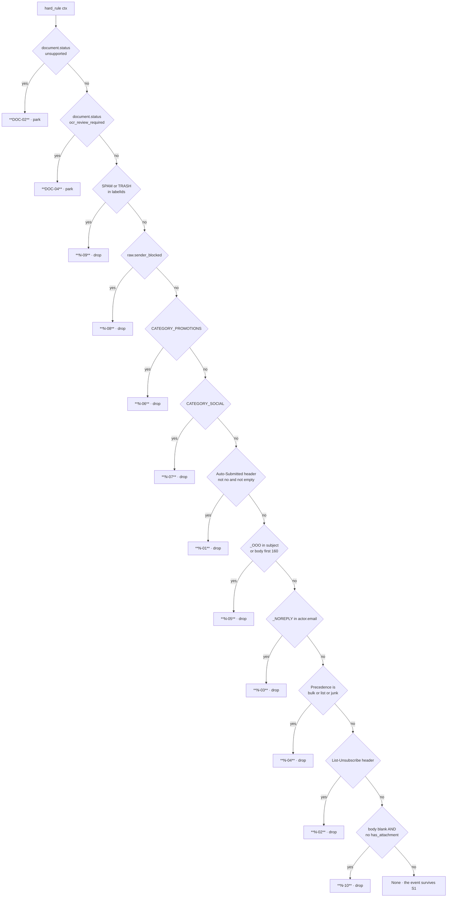

# The Reason Codes

*Layer 1 · `genios_engine/capture/gate/rules.py` · 93 lines · why nothing is ever filtered anonymously*

> **Every drop, park and short-circuit in Layer 1 carries a named code. What are all twenty-three
> of them, in what order do they fire, and what is an operator supposed to do about each one?**

| | |
|---|---|
| **File** | [gate/rules.py](../../../genios_engine/capture/gate/rules.py) · 93 lines |
| **Owns** | `REASON_LABELS` · `whitelist()` · `hard_rule()` · `_NOREPLY` · `_OOO` |
| **Codes** | **23** — 5 `W-` · 10 `N-` · 2 `DOC-` · 6 stage codes |
| **Imports** | `DELIBERATE_FAMILIES`, `DELIBERATE_SOURCES` from [source_families.py](../../../genios_engine/capture/source_families.py); `GateContext` |
| **Called from** | [gate/gate.py](../../../genios_engine/capture/gate/gate.py) stage S1 — the only caller |
| **Actions produced** | `drop` *(10 codes)* · `park` *(2 codes)* · bypass *(5 codes)* |
| **Persisted to** | `event_trace.reason_code` · `parked_events.reason_code` |
| **Not implemented** | N-11 · N-12 · N-20 — and `CATEGORY_UPDATES` deliberately left alone |
| **Tests** | [tests/test_gate.py](../../../tests/test_gate.py) covers N-03 and the W-01 bypass |

---

## 1 · The complete code table

`REASON_LABELS` is the whole vocabulary in one dict. Its comment states its purpose:

> Human-readable label per reason code — shown in traces/logs so a drop is legible.

| Code | Label | Fires when | Action | Why the code exists |
|---|---|---|---|---|
| **W-01** | `known_sender` | `ctx.sender_known` | *bypass* | the sender is already a `person` node in this org's graph |
| **W-02** | `starred_important` | `STARRED` in `labelIds`, or `raw["approved_sender"]` | *bypass* | a human has already judged this mail worth keeping |
| **W-03** | `agent_event` | `event.actor.type == "agent"` | *bypass* | an agent reporting a completed action, usually from a machine address |
| **W-04** | `important_attachment` | `raw["important_attachment"]` | *bypass* | contract / invoice / legal marker on an otherwise empty mail |
| **W-05** | `deliberate_source` | source in `DELIBERATE_SOURCES` or family in `DELIBERATE_FAMILIES` | *bypass* | someone typed or uploaded this on purpose |
| **DOC-02** | `doc_unsupported` | `raw["document"]["status"] == "unsupported"` | **park** | we could not read the file — a human decides, we do not delete |
| **DOC-04** | `doc_ocr_review` | `raw["document"]["status"] == "ocr_review_required"` | **park** | OCR confidence below `OCR_MIN_CONFIDENCE = 0.75` |
| **N-09** | `provider_spam` | `SPAM` or `TRASH` in `labelIds` | drop | the provider already classified it; re-deciding adds nothing |
| **N-08** | `tenant_blocklisted` | `raw["sender_blocked"]` | drop | the tenant said so explicitly |
| **N-06** | `gmail_promotions` | `CATEGORY_PROMOTIONS` in `labelIds` | drop | Gmail's own high-confidence marketing category |
| **N-07** | `gmail_social` | `CATEGORY_SOCIAL` in `labelIds` | drop | social-network notifications |
| **N-01** | `machine_ack` | `Auto-Submitted` header present and not `no` | drop | RFC 3834 machine acknowledgement |
| **N-05** | `out_of_office` | `_OOO` matches the subject or the first 160 chars of the body | drop | an autoresponder, not a message |
| **N-03** | `no_reply_sender` | `_NOREPLY` matches `actor.email` | drop | a mailbox nobody reads and nobody answers |
| **N-04** | `bulk_precedence` | `Precedence` header is `bulk`, `list` or `junk` | drop | the sender declared it bulk |
| **N-02** | `bulk_campaign_unsub` | `List-Unsubscribe` header present | drop | a campaign, by its own header |
| **N-10** | `empty_no_attachment` | body is blank **and** `has_attachment` is falsy | drop | there is nothing here to extract |
| **duplicate** | `already_seen` | `repo.exists(org_id, dedup_key)` in `land_raw_object` | drop *(landing)* | idempotency — the same object, already landed |
| **out_of_scope** | `out_of_scope` | `not ctx.in_scope` | drop *(S0)* | the tenant took this mailbox or folder out of scope |
| **mapping_missing** | `structured_unmapped` | typed object, `has_mapping()` false | **park** *(S1.5)* | an engineer owes this object type a mapping |
| **structured_mapped** | `structured_ok` | typed object, mapping found | *short-circuit* | **the only code in the table that means success** |
| **low_relevance** | `low_relevance` | S2 classifier returns `relevant=False` | **park** *(S2)* | grey zone — reviewable, never a hard drop |
| **poison_quarantine** | `poison_quarantine` | `capture_event` still raising after 2 retries | **park** *(sync)* | one bad object must not fail the batch |

**Ten of the twenty-three drop. Five park. Five bypass. One means yes.**

---

## 2 · `whitelist()` — five codes, evaluation order matters

```python
def whitelist(ctx: GateContext) -> str | None:
    """Return a W-code if the event bypasses destructive drops, else None."""
    labels = set(ctx.raw.get("labelIds") or [])
    if ctx.sender_known:
        return "W-01"                            # known customer/prospect/vendor
    if "STARRED" in labels or ctx.raw.get("approved_sender"):
        return "W-02"                            # human-starred / manually approved
    if ctx.event.actor.type == "agent":
        return "W-03"                            # agent event
    if ctx.raw.get("important_attachment"):
        return "W-04"                            # contract/invoice/legal marker
    if (ctx.event.source in DELIBERATE_SOURCES
            or ctx.event.source_family in DELIBERATE_FAMILIES):
        return "W-05"                            # a human/agent deliberately handed us this —
                                                 # N-codes exist for inbox firehoses, not for it
    return None
```

The order is cheapest-and-strongest first. **The returned code is the first that matched, not the
only one that would have.** An agent event from a starred thread reports `W-02`, never `W-03` —
which matters when you are counting codes in `event_trace` to work out *why* the noise filter is
letting things through.

W-05's membership sets are derived views over the source registry, not hand-written lists:

| Set | Members today | Declared in |
|---|---|---|
| `DELIBERATE_SOURCES` | `upload` · `internal` · `human` · `agent` | descriptors with `deliberate=True` in [source_registry.py](../../../genios_engine/capture/source_registry.py) |
| `DELIBERATE_FAMILIES` | `human_input` · `ai_generated` | a `frozenset` literal in the same file |

The registry states the rule in its own words:

> Families a human or an agent DELIBERATELY handed us. The noise gate's N-codes exist
> for inbox firehoses; deliberately-provided material bypasses them (it still lands, is
> traced, and is deduped like everything else).

**"It still lands, is traced, and is deduped"** is the part that keeps W-05 from being a hole. A
whitelist code buys an event past `hard_rule()`. It buys it past nothing else — not dedup, not the
trace, not PII masking, not S2.

---

## 3 · `hard_rule()` — twelve checks, in the order they run

```python
def hard_rule(ctx: GateContext) -> tuple[str, str] | None:
    """Return (reason_code, action) to drop/park, else None. Only very-high-certainty
    drops — ambiguous automation is parked, never blanket-dropped."""
```

It returns on the **first** match, so the order below is the code's real precedence.



### 3.1 The four inputs it reads

```python
email = ctx.event.actor.email or ""
subject = ctx.raw.get("subject") or ""
body = ctx.prepared.clean_text if ctx.prepared else (ctx.raw.get("snippet") or "")
hdrs: dict = ctx.raw.get("headers") or {}
labels = set(ctx.raw.get("labelIds") or [])   # source-provided category signals
```

`body` prefers the **prepared** text — HTML already stripped, PII already masked — and falls back
to the connector's snippet only when preprocess did not run. Since `preprocess` prepends the
subject to the body, `body[:160]` in the N-05 check already contains the subject; the explicit
`subject` check catches the fallback case where `prepared` is `None`.

### 3.2 DOC-02 and DOC-04 — first, and both park

```python
# Documents: unparseable / low-confidence OCR → park (reviewable, never silent drop).
doc = ctx.raw.get("document") or {}
if doc.get("status") == "unsupported":
    return ("DOC-02", "park")
if doc.get("status") == "ocr_review_required":
    return ("DOC-04", "park")
```

The `document` dict is written by
[connectors/drive.py](../../../genios_engine/capture/connectors/drive.py) and by the attachment
branch of [connectors/composio.py](../../../genios_engine/capture/connectors/composio.py), from
`route_document`'s three-valued `status`: `accepted` · `ocr_review_required` · `unsupported`.
**Both park codes run before every drop code**, so a file we could not read is never mistaken for
an empty mail and dropped by N-10.

### 3.3 N-09 and N-08 — the highest-confidence noise

```python
# Provider-classified spam/trash + tenant blocklist — highest-confidence noise.
if "SPAM" in labels or "TRASH" in labels:
    return ("N-09", "drop")                  # provider spam/trash label
if ctx.raw.get("sender_blocked"):
    return ("N-08", "drop")                  # tenant blocklist (fed by tenant config)
```

Neither is our judgment. Gmail already ran its classifier; the tenant already wrote the blocklist.
Re-deciding either would be arrogance with a worse dataset.

### 3.4 N-06 and N-07 — Gmail's own categories

```python
# Gmail's own high-confidence categories → deterministic noise (no guessing).
# (CATEGORY_UPDATES is left alone — receipts/alerts can matter; L2 decides.)
if "CATEGORY_PROMOTIONS" in labels:
    return ("N-06", "drop")                  # marketing / promotions
if "CATEGORY_SOCIAL" in labels:
    return ("N-07", "drop")                  # social-network notifications
```

Two of Gmail's four categories are used and two are not. See §5.1.

### 3.5 N-01, N-05, N-03, N-04, N-02 — the automation ladder

```python
if str(hdrs.get("Auto-Submitted", "no")) not in ("no", ""):
    return ("N-01", "drop")                  # machine acknowledgement
if _OOO.search(subject) or _OOO.search(body[:160]):
    return ("N-05", "drop")                  # out-of-office (real impl: availability hint first)
if _NOREPLY.search(email):
    return ("N-03", "drop")                  # no-reply / notification sender
if str(hdrs.get("Precedence", "")).lower() in ("bulk", "list", "junk"):
    return ("N-04", "drop")                  # bulk campaign (Precedence header)
if hdrs.get("List-Unsubscribe"):
    return ("N-02", "drop")                  # bulk campaign (unsubscribe header)
```

N-01 defaults the header to `"no"` when absent, so a missing `Auto-Submitted` never fires it —
only an explicit `auto-generated` or `auto-replied` does.

The parenthetical on N-05 is a known-incomplete marker, not a description:

> out-of-office (real impl: availability hint first)

An out-of-office reply is not noise to a scheduling question — it is the answer. The current rule
drops the whole message; the intended behaviour is to lift the availability window out of it
first. **That work is not done.**

### 3.6 N-10 — empty and nothing attached

```python
if not body.strip() and not ctx.raw.get("has_attachment"):
    return ("N-10", "drop")                  # empty, no attachment
```

The `has_attachment` half exists because of a real regression. The Gmail connector's comment
records it at the point it sets the flag:

> `"has_attachment": bool(atts),  # keeps attachment-only emails out of the N-10 drop`

A mail whose entire content is a signed PDF has an empty body. Without the second clause, it dies
here.

---

## 4 · The two regexes, in full

```python
_NOREPLY = re.compile(
    r"(no[-_.]?reply|donotreply|notifications?@|updates?@|marketing@|mailer-daemon)", re.I
)
_OOO = re.compile(r"\b(out of office|ooo|on leave|automatic reply|chutti)\b", re.I)
```

### `_NOREPLY` — matched against `actor.email` only

| Alternative | Catches | Note |
|---|---|---|
| `no[-_.]?reply` | `noreply@`, `no-reply@`, `no_reply@`, `no.reply@` | **unanchored** — matches anywhere in the address, so `technoreply@x.io` also hits |
| `donotreply` | `donotreply@` | |
| `notifications?@` | `notification@` and `notifications@` | the `@` anchors it to the local-part end |
| `updates?@` | `update@` and `updates@` | also matches `product-updates@vendor.io` |
| `marketing@` | `marketing@` | |
| `mailer-daemon` | bounce notifications | |

There are **no `\b` anchors**. That is a deliberate looseness for the `@`-terminated alternatives
and an accident for `no[-_.]?reply`. It is matched against the parsed `actor.email`, never the
display name, so *"Acme No-Reply <priya@acme.com>"* does not fire it.

### `_OOO` — matched against the subject and `body[:160]`

| Alternative | Catches |
|---|---|
| `out of office` | the English standard |
| `ooo` | the abbreviation — `\b`-anchored, so `zoooom` does not match |
| `on leave` | |
| `automatic reply` | Outlook's own autoresponder subject prefix |
| `chutti` | Hindi/Hinglish for leave or holiday — the same bilingual handling as `triage.py`'s `jaldi` / `turant` and `relevance.py`'s `kitna` |

Both patterns are `re.I`. **Only the first 160 characters of the body are scanned** — an OOO
declaration that appears below a quoted thread is not a real out-of-office reply.

---

## 5 · Three deliberate absences

### 5.1 `CATEGORY_UPDATES` is left alone

Gmail applies four category labels. Two of them drop, one is unused, and the fourth is refused on
principle, in a one-line comment:

> (CATEGORY_UPDATES is left alone — receipts/alerts can matter; L2 decides.)

`CATEGORY_UPDATES` is where a payment receipt, a delivery failure, a subscription renewal notice
and a security alert all land. Every one of those is a business fact. Dropping the category would
be **fast, cheap, and wrong**, and it is the single filtering decision that would have done the
most damage. `CATEGORY_FORUMS` is simply not checked at all.

### 5.2 N-11, N-12 and N-20 are not implemented

The last two lines of `hard_rule()` are not code. They are the boundary, written down:

```python
# N-11 (notification linked to tracked entity → park) needs entity linkage → S3/L2.
# N-12/N-20 (bulk-from-known → park · grey-zone relevance) need relevance/linkage → L2.
return None
```

| Code | What it would do | Why it cannot live here |
|---|---|---|
| **N-11** | park a notification that mentions an entity we already track | needs entity linkage — *"is this Stripe alert about a deal we care about?"* is a graph question |
| **N-12** | park a bulk mail that came from a known contact | needs both the bulk signal **and** the graph's opinion of the sender |
| **N-20** | park a grey-zone relevance verdict | needs relevance, which needs a model |

All three want the answer to *"does this matter to us?"* — and Layer 1 is the layer that has
promised not to know. The Layer 1 overview states it as a rule:

> **N-11 / N-12 / N-20 are not in the gate.** They require entity linkage and relevance, which
> require graph knowledge. Layer 1 must not reach upward for it.

### 5.3 There is no code for "probably noise"

The docstring is the policy:

> Only very-high-certainty drops — ambiguous automation is parked, never blanket-dropped.

Look at what the ten drop codes have in common. Six of them read a field somebody else wrote — a
provider label, a tenant blocklist, an RFC header the sender set. Three are pattern matches against
an address or an autoresponder phrase. One is the absence of content altogether. **Not one is a
judgment about whether the message is worth reading.** Everything that would require that judgment
is either parked (`mapping_missing`, `low_relevance`, `DOC-02`, `DOC-04`) or handed to Layer 2.

---

## 6 · What an operator does with each code

Read from `event_trace` (all outcomes) or `parked_events` (parks only, via `GET /parked?reason_code=…`).

| Code | If you see a lot of it | Action |
|---|---|---|
| `duplicate` | normal — overlap windows on incremental sync are deliberate | none. A high count is the no-miss design working |
| `out_of_scope` | **impossible today.** No caller sets `in_scope=False` | if this ever appears, someone wired a scope filter — find it |
| `structured_mapped` | normal for CRM / calendar / database syncs | none. This is a success code |
| `mapping_missing` | a connected source is emitting an object type nobody mapped | **engineering task.** Add a `StructuredMapping` to [structured/registry.py](../../../genios_engine/capture/structured/registry.py), then recover the parked events |
| `DOC-02` | unreadable files are arriving | check the mime. If it is a scan, wire an OCR engine. Then recover |
| `DOC-04` | OCR is running but below `0.75` | review the text by hand; recover or relabel. Repeated hits on one source mean bad scan quality upstream |
| `low_relevance` | only possible with `enable_l1_relevance=true` | review the queue. If good mail is parking, the `_BUSINESS` regex is too narrow — **do not** switch the classifier off, widen it |
| `poison_quarantine` | one object fails `capture_event` after 2 retries | a real bug. The `parked_events.trace` holds the exception type and 200 chars of detail |
| `N-09` | high volume is normal | none. If legitimate mail is here, the provider's classifier is the thing to fix |
| `N-08` | matches the tenant's blocklist size | **cannot happen today** — nothing writes `sender_blocked` |
| `N-06` / `N-07` | high volume is normal for a shared inbox | if a customer's announcements are being dropped, add them to the graph so **W-01** rescues them |
| `N-01` | delivery receipts and calendar acks | none |
| `N-05` | out-of-office season | **known-incomplete.** These may contain availability the scheduler wanted. Watch the count around holidays |
| `N-03` | the largest N-code in most tenants | check for false positives from `updates?@` — a real account manager at `updates@partner.com` is dropped |
| `N-04` / `N-02` | **cannot happen today** — nothing writes `raw["headers"]` | if these are zero and `N-03` is huge, that is the bug, not the traffic |
| `N-10` | attachment-only mail with a failed extraction | check `has_attachment` is being set by the connector |
| `W-01`…`W-05` | *(trace `detail` only, never a `reason_code`)* | a rising W-01 count means the graph is learning who the customers are — that is the system working |

**The one query worth having:**

```sql
select reason_code, count(*) from event_trace
where org_id = :org and action in ('drop','park')
group by reason_code order by 2 desc;
```

If `N-02` and `N-04` are zero while `N-03` dominates, you have found gap 2 below without reading
any code.

---

## 7 · Gaps

| # | Gap | Evidence |
|---|---|---|
| 1 | **`REASON_LABELS` is defined and never read.** Its comment promises the label is *"shown in traces/logs so a drop is legible"*, but `event_trace` stores the bare code and nothing imports the dict. The labels exist only in this file | `grep -rn REASON_LABELS` returns one hit — the definition |
| 2 | **N-01, N-02 and N-04 cannot fire on live traffic.** All three read `ctx.raw["headers"]`; no connector writes that key. The Gmail raw dict is `subject · body · snippet · labelIds · to · cc · has_attachment` | [composio.py](../../../genios_engine/capture/connectors/composio.py) `_to_objects`; `grep -rn '"headers"' genios_engine/capture/` |
| 3 | **N-08 and W-04 cannot fire at all.** `sender_blocked` and `important_attachment` have no producer anywhere in the repo | `grep -rn sender_blocked \| important_attachment` |
| 4 | **W-02 fires on half its condition.** `approved_sender` has no producer either; only the `STARRED` label works | same grep |
| 5 | **`_NOREPLY` is unanchored on its first alternative.** `no[-_.]?reply` matches mid-word, and `updates?@` matches `product-updates@` — a plausible false positive for a real vendor contact | [rules.py:12](../../../genios_engine/capture/gate/rules.py) |
| 6 | **N-05 drops the availability it should be reading.** The code's own note: *"real impl: availability hint first"* | [rules.py:82](../../../genios_engine/capture/gate/rules.py) |
| 7 | **Every code is email-shaped.** A Notion page, a Drive file or a Postgres row passes `hard_rule()` untouched — no code in the table can describe them. The Layer 1 roadmap names this as step 3: *"The noise gate only understands email. For every other source type it does nothing at all"* | none of the twelve checks reads a non-email field except `document` |
| 8 | **Which W-code fired is not queryable.** It is written as a `detail` key on the S1 trace row, not as a `reason_code`, and `GateResult.whitelist_code` is read by nobody | [gate.py:33](../../../genios_engine/capture/gate/gate.py) |

---

## 8 · Map

| Kind | Path |
|---|---|
| The rules | [capture/gate/rules.py](../../../genios_engine/capture/gate/rules.py) |
| The caller | [capture/gate/gate.py](../../../genios_engine/capture/gate/gate.py) stage S1 |
| Deliberate sets | [capture/source_registry.py](../../../genios_engine/capture/source_registry.py) `DELIBERATE_SOURCES` · `DELIBERATE_FAMILIES` · [source_families.py](../../../genios_engine/capture/source_families.py) |
| Document statuses | [capture/documents/router.py](../../../genios_engine/capture/documents/router.py) · [base.py](../../../genios_engine/capture/documents/base.py) `OCR_MIN_CONFIDENCE = 0.75` |
| `has_attachment` producers | [connectors/composio.py](../../../genios_engine/capture/connectors/composio.py) · [connectors/drive.py](../../../genios_engine/capture/connectors/drive.py) |
| `duplicate` | [capture/pipeline.py](../../../genios_engine/capture/pipeline.py) `land_raw_object` |
| `poison_quarantine` | [capture/acquire/sync_runner.py](../../../genios_engine/capture/acquire/sync_runner.py) |
| `low_relevance` | [capture/gate/relevance.py](../../../genios_engine/capture/gate/relevance.py) |
| Where codes are stored | [capture/trace_store.py](../../../genios_engine/capture/trace_store.py) `event_trace` · [parked/store.py](../../../genios_engine/capture/parked/store.py) `parked_events` |
| Migrations | [0002_l1_tables.sql](../../../migrations/0002_l1_tables.sql) *(parked_events)* · [0003_source_event_outcome.sql](../../../migrations/0003_source_event_outcome.sql) · [0027_l1_seam.sql](../../../migrations/0027_l1_seam.sql) |
| Tests | [tests/test_gate.py](../../../tests/test_gate.py) · [tests/test_relevance.py](../../../tests/test_relevance.py) · [tests/test_events_parked.py](../../../tests/test_events_parked.py) |
| Endpoints | `GET /parked?reason_code=…` · `POST /parked/{event_id}/recover` — [api/routes.py](../../../genios_engine/api/routes.py) |

Sideways: [ESQE Overview](00-Overview.md) · [The Gate](01-The-Gate.md).
Upwards: [Layer 1 Overview](../00-Overview.md).
