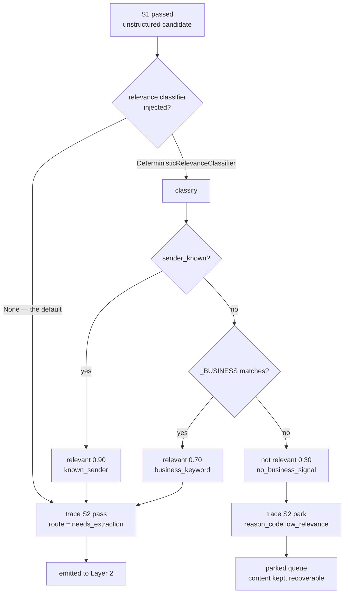
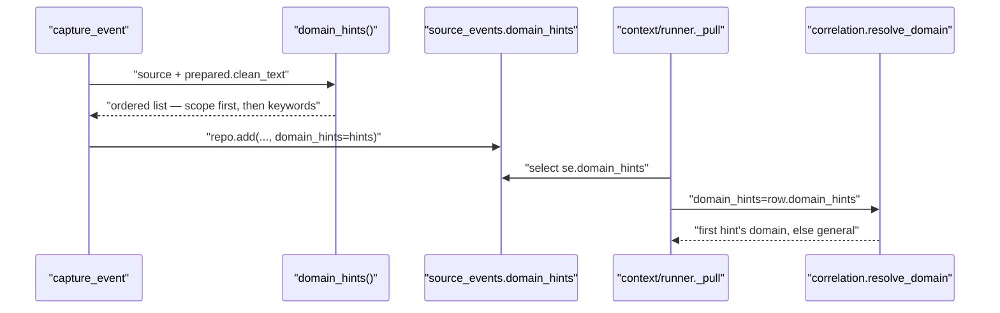

# Relevance and Domain Hints

*Layer 1 · [capture/gate/relevance.py](../../../genios_engine/capture/gate/relevance.py) — 51 lines, one Protocol, one implementation · [capture/domain/hints.py](../../../genios_engine/capture/domain/hints.py) — 32 lines, one function*

> **What does Layer 1 decide about *meaning* without a model — and what exactly changes on
> the day an LLM is wired into the gate?**

| | |
|---|---|
| **Files** | [gate/relevance.py](../../../genios_engine/capture/gate/relevance.py) · [domain/hints.py](../../../genios_engine/capture/domain/hints.py) |
| **Owns** | `RelevanceClassifier` (Protocol) · `RelevanceVerdict` · `DeterministicRelevanceClassifier` · `_BUSINESS` · `_SOURCE_PRIOR` · `_KEYWORDS` · `domain_hints()` |
| **Called from** | `run_gate` stage **S2** ([gate/gate.py](../../../genios_engine/capture/gate/gate.py):44) · `capture_event` ([pipeline.py](../../../genios_engine/capture/pipeline.py):186) |
| **Emits** | A `RelevanceVerdict` that the gate turns into *route* or *park*; a `list[DomainHint]` that lands on the `source_events` row |
| **Wired by** | `make_relevance_classifier()` ([platform/wiring.py](../../../genios_engine/platform/wiring.py):227) — returns `None` unless `enable_l1_relevance` |
| **LLM calls** | **Zero.** Both modules are pure regex + dict lookup |
| **Tests** | [tests/test_relevance.py](../../../tests/test_relevance.py) — 4 tests · [tests/test_domain_coverage.py](../../../tests/test_domain_coverage.py) — 2 tests · [tests/test_correlation.py](../../../tests/test_correlation.py) — `resolve_domain` |

---

## 1 · Two jobs, one constraint

Both modules answer a question about **meaning**, and neither is allowed a model to answer it:

| Module | Question | Consequence of the answer |
|---|---|---|
| `gate/relevance.py` | *Is this event business at all?* | Not relevant → **park** (human review queue), never a drop |
| `domain/hints.py` | *Which part of the business is it about?* | The hint list is persisted and becomes Layer 2's correlation domain |

The constraint is stated at the top of `hints.py` and it is the reason neither module tries to
be clever:

> Deterministic domain HINTS only (no LLM). L2's combined call decides the real domain;
> these narrow the search and seed schema loading. Source prior + keyword evidence.

Layer 1 is not deciding relevance or domain. It is producing a **cheap prior** so that Layer 2's
single combined call has something to start from, and so that an operator can see, on the
`source_events` row itself, what the machine thought before any model was involved.

---

## 2 · The swappable slot

`RelevanceClassifier` is a `typing.Protocol`, and its docstring is the whole design decision:

```python
class RelevanceClassifier(Protocol):
    """S2 relevance gate (defense-in-depth). The gate slot is identical whether this
    is deterministic or an LLM — at LLM-integration time we swap in a temp-0 classifier
    and NOTHING else in the pipeline changes."""

    def classify(self, ctx: GateContext, prepared: PreparedContent | None) -> RelevanceVerdict: ...
```

**The promise is enforced by the shape of the call site, not by discipline.** `run_gate` takes
`relevance` as an optional parameter typed to the Protocol, calls `classify` once, and branches
on the verdict — it never touches the implementation:

```python
    # S2 — optional relevance classifier (defense-in-depth; deterministic now,
    # LLM-swappable later). Low relevance parks for review (never a hard drop).
    if relevance is not None:
        v = relevance.classify(ctx, ctx.prepared)
        if not v.relevant:
            trace.record("S2", "park", reason_code="low_relevance", relevance=v.relevance)
            return GateResult(action="park", reason_code="low_relevance", whitelist_code=wl)
        trace.record("S2", "pass", relevance=v.relevance, reason=v.reason)
        return GateResult(action="route", route="needs_extraction", whitelist_code=wl)
```

The file closes by restating the same contract as a note to whoever does the wiring:

> When the LLM classifier is wired (LLM-integration step), it implements the same
> RelevanceClassifier interface (temp-0, relevance + domains + evidence). Slot below
> in gate.run_gate stays unchanged.

Everything the classifier can see is `GateContext` ([gate/context.py](../../../genios_engine/capture/gate/context.py)) plus the
`PreparedContent`. `PreparedContent.clean_text` is **already PII-masked** at this point —
`preprocess()` ran earlier in `capture_event`, so a future LLM classifier inherits the masking
for free rather than needing its own.

### `RelevanceVerdict`

```python
@dataclass
class RelevanceVerdict:
    relevant: bool
    relevance: float
    domains: list[str] = field(default_factory=list)
    reason: str | None = None
```

`domains` exists for the LLM implementation — *"relevance + domains + evidence"* — and today
**nothing populates it and nothing reads it**. See §8.

---

## 3 · `DeterministicRelevanceClassifier` — three answers, in order

```python
class DeterministicRelevanceClassifier:
    """Safe default + dev impl — no LLM. Known sender or business keyword → relevant;
    otherwise low relevance (parks for review, never a hard drop)."""

    name = "relevance-deterministic-1"
```

| # | Condition | `relevant` | `relevance` | `reason` | Gate action |
|---|---|---|---|---|---|
| 1 | `ctx.sender_known` | `True` | **0.90** | `known_sender` | route → `needs_extraction` |
| 2 | `_BUSINESS` matches the text | `True` | **0.70** | `business_keyword` | route → `needs_extraction` |
| 3 | neither | `False` | **0.30** | `no_business_signal` | **park**, reason code `low_relevance` |

The order matters: a known sender is checked **before** the text, so a one-word reply from a
person already in the graph (`"hi"`) is relevant at 0.90 without any keyword. That is exactly
what `test_relevance_on_passes_known_sender_regardless` asserts.

`sender_known` is not computed here. It arrives from `run_sync`'s `sender_resolver`, which in
production ([api/routes.py](../../../genios_engine/api/routes.py):97–117) is a cached
`graph_nodes` lookup for `node_type='person'` in that org — deterministic, no model, one query
per org per TTL.

**The third branch is the design point: low relevance parks, it never drops.** A false negative
from a regex would otherwise silently delete a customer's email. Parked events keep their
encrypted payload and are recoverable through `POST /api/parked/{event_id}/recover`.

### `_BUSINESS`, in full

```python
_BUSINESS = re.compile(
    r"\b(deal|pricing|contract|invoice|payment|meeting|proposal|budget|renewal|issue|"
    r"ticket|demo|quote|order|refund|escalat\w*|cancel\w*|approv\w*|sign|overdue|"
    r"security|compliance|legal|kitna|payment pending)\b",
    re.I,
)
```

| Group | Terms |
|---|---|
| Commercial | `deal` `pricing` `contract` `proposal` `quote` `budget` `renewal` `demo` `order` |
| Money | `invoice` `payment` `refund` `overdue` `payment pending` |
| Support | `issue` `ticket` `escalat*` `cancel*` |
| Process | `meeting` `approv*` `sign` `security` `compliance` `legal` |
| **Hinglish** | **`kitna`** (*"how much"* — the price question, asked in Hindi) · **`payment pending`** (the standard Indian-office phrasing) |

The stems `escalat\w*`, `cancel\w*` and `approv\w*` cover *escalation / escalated*, *cancel /
cancelled / cancellation*, *approve / approval / approved*. `re.I` makes the whole thing
case-insensitive; the text is used as-is (unlike triage, which lowercases first — see
[Triage Lanes](04-Triage-Lanes.md)).

---

## 4 · Off by default — and what runs instead

```python
def make_relevance_classifier():
    """Optional L1 S2 relevance gate. None (off) unless enabled. Deterministic today;
    swap for the LLM classifier at LLM-integration time (same interface)."""
    if not get_settings().enable_l1_relevance:
        return None
    from genios_engine.capture.gate.relevance import DeterministicRelevanceClassifier
    return DeterministicRelevanceClassifier()
```

```python
    # optional S2 relevance classifier in L1 (defense-in-depth). Deterministic until an
    # LLM classifier is wired. Default off — decide on real-data evidence.
    enable_l1_relevance: bool = False
```

**So in a default deployment this module does not run at all.** `make_relevance_classifier()`
returns `None`, `run_gate` skips the block, and control falls through to:

```python
    # S2 default — route unstructured candidate to L2's combined relevance+extraction call
    trace.record("S2", "pass", route="needs_extraction")
    return GateResult(action="route", route="needs_extraction", whitelist_code=wl)
```

Everything that survived S0 (scope) and S1 (whitelist + hard N-codes) is routed to Layer 2,
where a single combined LLM call produces relevance *and* typed facts together. The Layer 1
classifier is **defense-in-depth**, not the primary filter — its only job would be to stop
obviously-irrelevant text from costing a model call, and the code declines to turn that on
until there is real-data evidence that it is worth the false-park risk.

Four call sites pass it, all in [api/routes.py](../../../genios_engine/api/routes.py), and all
of them get whatever the setting says:

| Call site | Line |
|---|---|
| `_sync_connection` (background per-connection sync) | 162 |
| `run_sync_sweep` (scheduler / cross-org sweep) | 184 |
| `ingest_all` (`POST /api/ingest/all`) | 367 |
| `_sync_source` (`POST /api/integrations/{tool}/sync`) | 741 |

The current state is visible at runtime — `GET /api/config` returns
`"l1_relevance": s.enable_l1_relevance`.



---

## 5 · Domain hints — the second deterministic read

Thirty-two lines, one public function, two module constants.

### `_SOURCE_PRIOR` — the source *is* the evidence

```python
_SOURCE_PRIOR: dict[str, str] = {
    "hubspot": "sales", "salesforce": "sales",
    "zendesk": "support", "intercom": "support",
    "stripe": "admin", "razorpay": "admin",
}
```

| Source | Domain | Why |
|---|---|---|
| `hubspot` · `salesforce` | `sales` | A CRM object is a sales object by construction |
| `zendesk` · `intercom` | `support` | A helpdesk object is a support object |
| `stripe` · `razorpay` | `admin` | Billing systems; `razorpay` is the Indian-market counterpart |

Six sources. Everything else — `gmail`, `gcal`, `notion`, `gdrive`, `slack`, `postgres`,
`pipedrive`, `mixpanel`, `human`, `upload`, `agent` — has **no prior** and depends entirely on
text keywords.

### `_KEYWORDS` — three domains, three regexes

```python
_KEYWORDS: dict[str, re.Pattern[str]] = {
    "sales": re.compile(r"\b(deal|pricing|proposal|contract|quote|demo|budget|renewal)\b", re.I),
    "support": re.compile(r"\b(issue|error|broken|ticket|down|outage|bug|not working)\b", re.I),
    "admin": re.compile(r"\b(invoice|payment|overdue|gst|compliance|legal|tds|filing)\b", re.I),
}
```

| Domain | Terms |
|---|---|
| `sales` | `deal` `pricing` `proposal` `contract` `quote` `demo` `budget` `renewal` |
| `support` | `issue` `error` `broken` `ticket` `down` `outage` `bug` `not working` |
| `admin` | `invoice` `payment` `overdue` **`gst`** `compliance` `legal` **`tds`** `filing` |

`gst` (Goods and Services Tax) and `tds` (Tax Deducted at Source) are Indian statutory filings —
they are in the `admin` list because for the target customer they are the single most common
administrative correspondence there is.

### The function

```python
def domain_hints(source: str, text: str | None) -> list[DomainHint]:
    hints: list[DomainHint] = []
    prior = _SOURCE_PRIOR.get(source)
    if prior:
        hints.append(DomainHint(domain=prior, source="scope"))
    if text:
        for domain, pat in _KEYWORDS.items():
            if pat.search(text) and not any(h.domain == domain for h in hints):
                hints.append(DomainHint(domain=domain, source="keyword"))
    return hints
```

Three properties fall out of those nine lines:

1. **The source prior is always first**, because it is appended before the keyword loop runs.
2. **No domain appears twice** — `not any(h.domain == domain for h in hints)`. A HubSpot payload
   whose text also says *"pricing"* yields one `sales` hint (`source="scope"`), not two.
3. **Keyword order is dict-insertion order** — `sales`, then `support`, then `admin`. Text that
   hits two keyword families lists them in that fixed order, so the result is stable across
   replays instead of depending on set iteration.

`DomainHint` is a two-field pydantic model in the L1→L2 contract
([contracts/gated_event.py](../../../genios_engine/contracts/gated_event.py)):

```python
class DomainHint(BaseModel):
    domain: str
    source: str                              # scope | keyword | history
```

`scope` = derived from the source. `keyword` = derived from the text. `history` is declared and
**has no producer anywhere in the tree**.

---

## 6 · Why the ordering is load-bearing

The hint list is not a set of equal candidates. Layer 2's correlation engine takes the **first**
one and treats everything after it as ignored:

```python
def resolve_domain(domain_hints: list | None) -> str:
    """L1's deterministic hints → the one domain this event correlates under.

    Hints arrive ordered by strength (a source prior like HubSpot→sales before a keyword
    match), so the first is the most trustworthy. Two keywords firing at once means the
    text is genuinely ambiguous; taking the first keeps the choice deterministic instead
    of alphabetical or dict-ordered.
    """
    for hint in domain_hints or []:
        domain = hint.get("domain") if isinstance(hint, dict) else getattr(hint, "domain", None)
        if domain:
            return str(domain)
    return DEFAULT_DOMAIN
```

`DEFAULT_DOMAIN = "general"`, with its own note in
[context/correlation.py](../../../genios_engine/context/correlation.py):

> Domain bucket for an event whose text triggered no keyword. Most email lands here, and
> that is fine: threads keep real conversations together, so `general` is a resting place
> for the genuinely uncategorised rather than a dumping ground for everything.

That domain becomes part of a situation's identity — `stable_id("corr", {"node": …, "domain": …})`.
**So the append order inside a 32-line L1 helper decides which business situation an event joins.**
A source prior outranks a keyword because it was appended first, and that is the entire mechanism.



---

## 7 · Where hints are computed, and where they land

In [pipeline.py](../../../genios_engine/capture/pipeline.py), inside `capture_event`, after the
gate has decided:

```python
    outcome = {"drop": "dropped", "park": "parked"}.get(gate.action, "emitted")
    kept = outcome in ("emitted", "parked")
    ...
    if kept:
        text = prepared.clean_text if prepared else None
        hints = domain_hints(event.source, text)
        links = _linkage_hints(event)
```

Two consequences worth holding on to:

- **Hints are computed for parked events too** (`kept` includes `parked`), unlike the triage
  lane, which is emitted-only. A parked event that is later recovered already carries its domain.
- **Structured events pass `text=None`**, because `prepared` is only built for the unstructured
  branch. A HubSpot deal therefore gets its source prior and *nothing else* — the keyword regexes
  never see the structured payload.

The comment above that block explains why any of this is persisted at all:

> The seam, computed ONCE for kept events (dropped noise gets only the ledger row):
> deterministic hints persisted WITH the decision so L2 and any replay read them
> instead of recomputing.

Persistence path:

| Step | Where |
|---|---|
| Written to the ledger | `repo.add(event, outcome=…, route=…, triage_lane=lane, domain_hints=hints or None, …)` — [pipeline.py](../../../genios_engine/capture/pipeline.py):198 |
| SQL column | `cast(:domain_hints as jsonb)` in `_INSERT` — [landing/pg_repository.py](../../../genios_engine/capture/landing/pg_repository.py) |
| Migration | `alter table source_events add column if not exists domain_hints jsonb;` — [migrations/0027_l1_seam.sql](../../../migrations/0027_l1_seam.sql) |
| Carried on the contract | `GatedEvent.domain_hints: list[DomainHint]` |
| Read back by L2 | `select … se.domain_hints …` in `_pull` — [context/runner.py](../../../genios_engine/context/runner.py) |
| Also read by | `context/backfill.py` (re-correlating historic events), `context/structured.py`, `context/pipeline.py` |

Note `hints or None`: an empty list is stored as SQL `NULL`, not `[]`. `resolve_domain` handles
both identically.

---

## 8 · Worked examples

### A · Unknown sender, business keyword, classifier ON

Input — `RawObject(source="gmail", actor_email="someone@unknown.io", raw={"snippet": "can you send the contract and pricing?"})`, `sender_known=False`, `relevance=DeterministicRelevanceClassifier()`.

| Stage | Result |
|---|---|
| preprocess | `clean_text = "can you send the contract and pricing?"` (nothing to mask) |
| S0 | pass |
| S1 | pass — no whitelist, no N-code |
| **S2** | `sender_known` False → `_BUSINESS` matches **`contract`** → `RelevanceVerdict(True, 0.70, reason="business_keyword")` |
| trace | `S2 pass relevance=0.7 reason=business_keyword` |
| `domain_hints("gmail", …)` | no prior; `sales` matches (`contract`, `pricing`) → `[DomainHint(domain="sales", source="keyword")]` |
| outcome | **emitted** · `route="needs_extraction"` |
| L2 | `resolve_domain` → `"sales"` |

This is `test_relevance_on_passes_business_email`.

### B · Unknown sender, no business signal, classifier ON

Input — the same shape with `raw={"snippet": "hey lets grab coffee sometime"}`.

| Stage | Result |
|---|---|
| S2 | no known sender, no `_BUSINESS` match → `RelevanceVerdict(False, 0.30, reason="no_business_signal")` |
| trace | `S2 park reason_code=low_relevance relevance=0.3` |
| `domain_hints` | still computed (`kept` = True for parked) → **`[]`** — no prior for gmail, no keyword match |
| triage lane | **not computed** — `gate.action == "park"` |
| stored | `outcome='parked'`, `route=NULL`, `triage_lane=NULL`, `domain_hints=NULL`, raw payload **kept** (encrypted) |
| recoverable | yes — `POST /api/parked/{event_id}/recover` flips `outcome` to `emitted` |

This is `test_relevance_on_parks_non_business_chatter`. With the classifier **off** — the default —
the same email is `emitted` (`test_relevance_off_by_default_routes_everything_past_gate`) and Layer 2
decides.

### C · A HubSpot deal — the classifier is never reached

Input — `RawObject(source="hubspot", object_type="deal", …)`.

`has_mapping("hubspot", "deal")` is true (`hubspot.deal.v1`), so `capture_event` sets
`is_structured=True` and `run_gate` short-circuits at **S1.5** before S2 exists as a possibility:

```
trace stages: landing → S0 → S1.5 → triage → emit
```

| | |
|---|---|
| relevance classifier | never called — structured events skip S1 and S2 entirely |
| `prepared` | `None` → `domain_hints("hubspot", None)` |
| hints | `[DomainHint(domain="sales", source="scope")]` |
| L2 domain | `sales` |

### D · Two keyword families in one email

`domain_hints("gmail", "the invoice is broken and the deal is stuck")` returns, in this order:

```
[DomainHint(domain='sales',   source='keyword'),
 DomainHint(domain='support', source='keyword'),
 DomainHint(domain='admin',   source='keyword')]
```

All three fired (`deal` / `broken` / `invoice`). `resolve_domain` takes **`sales`** — not because
sales is stronger evidence here, but because `_KEYWORDS` is declared sales-first. The email is
genuinely ambiguous and the code says so out loud: *"Two keywords firing at once means the text is
genuinely ambiguous; taking the first keeps the choice deterministic."*

### E · The no-duplicate rule, isolated

`domain_hints("hubspot", "the deal pricing and an invoice overdue, ticket broken")`:

```
[DomainHint(domain='sales',   source='scope'),     # prior — appended first
 DomainHint(domain='support', source='keyword'),
 DomainHint(domain='admin',   source='keyword')]
```

The `sales` keyword regex matched too (`deal`, `pricing`) and was suppressed by
`not any(h.domain == domain for h in hints)` — the scope hint already claimed that domain.
*(In the real pipeline a HubSpot event carries `text=None`, so this shape only occurs if
`domain_hints` is called directly.)*

---

## 9 · Gaps

| Gap | Detail |
|---|---|
| **`RelevanceVerdict.domains` has no consumer** | The field exists for the LLM implementation, but `run_gate` reads only `.relevant`, `.relevance` and `.reason`. Swap in a temp-0 classifier tomorrow and its domain output is silently discarded — it does **not** flow into `domain_hints`. The "nothing else changes" promise holds for the *relevance* decision only. |
| **The classifier is off in every deployment** | `enable_l1_relevance: bool = False`, and it is a global `Settings` field — there is no per-org override, so it cannot be trialled on one tenant. |
| **The `snippet` fallback in `classify` is unreachable** | `text = prepared.clean_text if prepared else (ctx.raw.get("snippet") or "")`. `prepared` is `None` only for structured events, and structured events short-circuit at S1.5 before S2. The branch exists for direct callers and tests. |
| **Three vocabularies, no shared source** | `_BUSINESS` (relevance), `_KEYWORDS` (domain) and `_URGENT`/`_DEADLINE` (triage) overlap heavily and are maintained independently. `overdue` is a business keyword *and* an `admin` keyword and carries **zero** triage weight — see [Triage Lanes](04-Triage-Lanes.md) §7. |
| **`_SOURCE_PRIOR` covers 6 of 33 registered sources** | `gcal`, `postgres`, `notion`, `gdrive`, `slack`, `pipedrive`, `mixpanel` have no prior. Combined with `text=None` for structured events, **every calendar event and every client-database row emits zero hints** and correlates under `general`. A `gcal → general` meeting cannot join the `sales` situation its attendees are in. |
| **Source ids are not canonicalised before lookup** | `domain_hints(event.source, …)` uses the raw string; `to_source_event` copies `raw.source` verbatim. Aliases are not resolved through `descriptor_of`. Harmless today because no `_SOURCE_PRIOR` key has aliases — a latent trap for the next entry that does. |
| **`DomainHint.source == "history"` has no producer** | Declared in the contract comment, never emitted. |
| **Hinglish coverage is asymmetric** | Relevance has `kitna` and `payment pending`; triage has five Hindi terms; `_KEYWORDS` has none at all (`gst`/`tds` are English acronyms). A Hindi-language support complaint gets no domain hint. |
| **No unit test for the ordering rule at L1** | The strength ordering is tested on the L2 side (`test_the_strongest_hint_wins`) against a hand-built list. Nothing asserts that `domain_hints()` itself puts the scope hint first, nor that duplicates are suppressed. |
| **`relevance` is untyped in `run_sync`** | `relevance=None` in [acquire/sync_runner.py](../../../genios_engine/capture/acquire/sync_runner.py) carries no annotation, so nothing type-checks the Protocol at the injection point that actually matters. |

---

## 10 · Map

**Source**

| Thing | Where |
|---|---|
| `RelevanceClassifier` · `RelevanceVerdict` · `DeterministicRelevanceClassifier` · `_BUSINESS` | [capture/gate/relevance.py](../../../genios_engine/capture/gate/relevance.py) |
| `domain_hints()` · `_SOURCE_PRIOR` · `_KEYWORDS` | [capture/domain/hints.py](../../../genios_engine/capture/domain/hints.py) |
| `DomainHint` · `GatedEvent.domain_hints` | [contracts/gated_event.py](../../../genios_engine/contracts/gated_event.py) |
| The S2 slot | [capture/gate/gate.py](../../../genios_engine/capture/gate/gate.py) |
| `GateContext.sender_known` | [capture/gate/context.py](../../../genios_engine/capture/gate/context.py) |
| Where both are called | [capture/pipeline.py](../../../genios_engine/capture/pipeline.py) |
| `make_relevance_classifier` | [platform/wiring.py](../../../genios_engine/platform/wiring.py) |
| `enable_l1_relevance` | [platform/config.py](../../../genios_engine/platform/config.py) |
| `sender_resolver` injection | [capture/acquire/sync_runner.py](../../../genios_engine/capture/acquire/sync_runner.py) |
| `resolve_domain` · `DEFAULT_DOMAIN` | [context/correlation.py](../../../genios_engine/context/correlation.py) |

**Storage**

| Column / table | Where |
|---|---|
| `source_events.domain_hints jsonb` | [migrations/0027_l1_seam.sql](../../../migrations/0027_l1_seam.sql) |
| `_INSERT` binding | [capture/landing/pg_repository.py](../../../genios_engine/capture/landing/pg_repository.py) |
| In-memory `_decision` mirror | [capture/landing/repository.py](../../../genios_engine/capture/landing/repository.py) |
| Parked queue (`low_relevance` lands here) | [capture/parked/store.py](../../../genios_engine/capture/parked/store.py) |

**Endpoints** — `GET /api/config` (reports `l1_relevance`) · `POST /api/sync/{connection_id}` · `POST /api/ingest/all` · `POST /api/integrations/{tool}/sync` · `GET /api/parked` · `POST /api/parked/{event_id}/recover` — all in [api/routes.py](../../../genios_engine/api/routes.py)

**Tests**

| Test | File |
|---|---|
| `test_relevance_off_by_default_routes_everything_past_gate` · `test_relevance_on_parks_non_business_chatter` · `test_relevance_on_passes_business_email` · `test_relevance_on_passes_known_sender_regardless` | [tests/test_relevance.py](../../../tests/test_relevance.py) |
| `test_domain_hint_from_source_prior` · `test_domain_hint_from_keyword` | [tests/test_domain_coverage.py](../../../tests/test_domain_coverage.py) |
| `test_the_strongest_hint_wins` · `test_no_hint_is_a_bucket_not_an_error` | [tests/test_correlation.py](../../../tests/test_correlation.py) |
| `test_emitted_event_persists_route_lane_and_hints` | [tests/test_l1_seam.py](../../../tests/test_l1_seam.py) |

---

*Prev: [Reason Codes](02-Reason-Codes.md) · Next: [Triage Lanes](04-Triage-Lanes.md) · Up: [ESQE Overview](00-Overview.md) · [Layer 1 Overview](../00-Overview.md)*
