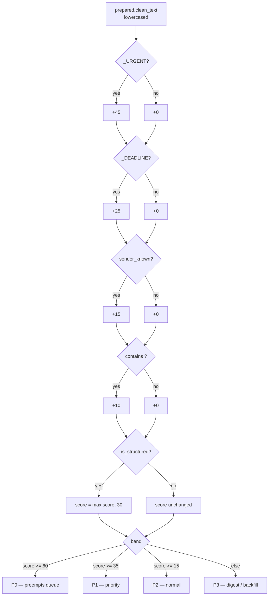
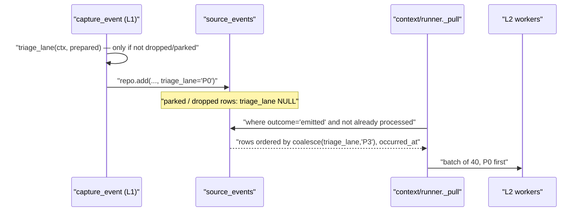

# Triage Lanes

*Layer 1 · [capture/triage/triage.py](../../../genios_engine/capture/triage/triage.py) — 43 lines, two regexes, one function, four bands*

> **Which event gets worked first — and who is allowed to decide that at ingestion time,
> knowing nothing about the business?**

| | |
|---|---|
| **File** | [capture/triage/triage.py](../../../genios_engine/capture/triage/triage.py) |
| **Owns** | `_URGENT` · `_DEADLINE` · `triage_lane()` |
| **Inputs** | `GateContext` (`sender_known`, `is_structured`, `raw`) + `PreparedContent \| None` |
| **Output** | One of four strings: `P0` `P1` `P2` `P3` |
| **Called from** | `capture_event` — once, only for events the gate did **not** drop or park |
| **Persisted to** | `source_events.triage_lane` · `GatedEvent.triage_lane` |
| **Consumed by** | `order by coalesce(se.triage_lane, 'P3') asc, se.occurred_at asc` in [context/runner.py](../../../genios_engine/context/runner.py) `_pull` |
| **LLM calls / DB reads** | **Zero.** Pure function of the text and two booleans |

---

## 1 · What triage is not

The first two lines of the module are the specification, and they are mostly a list of things
this file may not do:

> Triage = PROCESSING ORDER only (which event gets worked first), not user priority
> (that is L3). Uses L1-cheap deterministic signals only — no graph data, no LLM.

Three separate prohibitions, worth taking one at a time.

**Not user priority.** Triage answers *which event does the extraction worker pick up next*. It
does not answer *how much should the CEO care*. That second judgement needs the graph, the deal,
the history and the pack — and it belongs to the reasoning layer's Priority Unit
([reason/reasoners/priority.py](../../../genios_engine/reason/reasoners/priority.py)), which is
*"deliberately the only one allowed to speak about urgency at all"*.

The `(that is L3)` in the comment is the **old dossier numbering**, not a mistake.
[LAYERS.py](../../../genios_engine/LAYERS.py) carries the translation table:

```
    package     layer   new-vision name              old dossier
    reason        4     Reasoning Engine             L3 Reasoning
```

So the comment's *L3* and today's **layer 4 `reason`** are the same package. The file also
explains why the digits are never in the package names: *"the numbers have already changed twice
across specs while the code did not."*

**No graph data.** `triage_lane` is a pure function of `GateContext` and `PreparedContent`.
`GateContext` has no store, no engine, no session. `sender_known` is the single bit of graph
knowledge that reaches it, and it arrives pre-resolved from `run_sync`'s `sender_resolver` —
one cached query per org, not per event.

**No LLM.** Layer 1 makes zero model calls. Ordering the queue by asking a model which item to
put first would cost a model call per item, which is the queue.

---

## 2 · The scoring, in full

```python
def triage_lane(ctx: GateContext, prepared: PreparedContent | None) -> str:
    text = (prepared.clean_text if prepared else (ctx.raw.get("snippet") or "")).lower()
    score = 0
    if _URGENT.search(text):
        score += 45
    if _DEADLINE.search(text):
        score += 25
    if ctx.sender_known:
        score += 15
    if "?" in text:
        score += 10
    if ctx.is_structured:
        score = max(score, 30)          # structured business events: at least normal
```

| Signal | Points | Source of truth |
|---|---|---|
| `_URGENT` matches | **+45** | the prepared (PII-masked) text |
| `_DEADLINE` matches | **+25** | the prepared text |
| `ctx.sender_known` | **+15** | graph person lookup, resolved before capture |
| text contains `?` | **+10** | a question is waiting on someone |
| `ctx.is_structured` | **floor of 30** | `score = max(score, 30)` — a floor, not an addition |

Each regex contributes **once**, no matter how many terms it matches — `re.search` returns on the
first hit. Three urgency words score the same 45 as one. The theoretical maximum is
`45 + 25 + 15 + 10 = 95`.

The text read is `prepared.clean_text` — the **PII-masked** text produced by `preprocess()`
earlier in `capture_event`, subject line included. Triage never sees raw PII, and a masked
`[PHONE_IN]` token carries no triage weight.

---

## 3 · `_URGENT` and `_DEADLINE`

```python
_URGENT = re.compile(
    r"\b(urgent|asap|immediately|escalat\w*|cancel\w*|sev\s?1|outage|"
    r"legal notice|jaldi|turant)\b",
    re.I,
)
_DEADLINE = re.compile(
    r"\b(by|before|eod|tomorrow|today|deadline|friday|monday|tuesday|"
    r"wednesday|thursday|kal|parso|aaj)\b",
    re.I,
)
```

### `_URGENT` — +45

| Term | Notes |
|---|---|
| `urgent` `asap` `immediately` | the plain words |
| `escalat\w*` | escalate / escalated / escalation |
| `cancel\w*` | cancel / cancelled / cancellation |
| `sev\s?1` | matches both `sev1` and `sev 1` |
| `outage` | the ops word |
| `legal notice` | a two-word phrase inside the alternation |
| **`jaldi`** | Hindi — *"quickly / hurry"* |
| **`turant`** | Hindi — *"immediately"* |

### `_DEADLINE` — +25

| Term | Notes |
|---|---|
| `by` `before` | prepositions of deadline — see §9, they are also ordinary English |
| `eod` `deadline` | explicit |
| `today` `tomorrow` | relative dates |
| `monday` … `friday` | **weekday names, Monday to Friday only** — no `saturday`, no `sunday` |
| **`kal`** | Hindi — *"tomorrow"* (and *"yesterday"*; the word is the same) |
| **`parso`** | Hindi — *"the day after tomorrow"* (and *"the day before yesterday"*) |
| **`aaj`** | Hindi — *"today"* |

Five Hindi terms across the two patterns. They are not decoration: the target customer's inbox
is Hinglish, and *"kal tak bhej dena, jaldi chahiye"* is a P0 in any English-only vocabulary's
blind spot.

---

## 4 · The structured floor

```python
    if ctx.is_structured:
        score = max(score, 30)          # structured business events: at least normal
```

A HubSpot deal moving from `demo` to `proposal` is one of the highest-signal events the system
ever receives — and its payload contains **no urgency words, no deadline words, and no question
mark**. Worse, structured events are never preprocessed (`prepared is None`), so the text triage
reads is `ctx.raw.get("snippet") or ""` — an empty string. Without the floor, every CRM stage
change, every calendar move and every client-database row would score **0** and land in `P3`,
behind every piece of chatter that happened to contain the word *"by"*.

**The floor says: a typed business event from a system of record is at least a normal business
event, whatever its words.** It is `max`, not `+30`, so a structured event whose text *does*
carry urgency (a `cancel`led calendar invite, if a snippet is present) keeps its higher score
rather than being capped at normal.

---

## 5 · The four bands

```python
    if score >= 60:
        return "P0"       # immediate / high-risk, preempts queue
    if score >= 35:
        return "P1"       # priority
    if score >= 15:
        return "P2"       # normal
    return "P3"           # low-signal / digest / backfill
```

| Score | Lane | Meaning | What it takes to get here |
|---|---|---|---|
| ≥ 60 | **P0** | immediate / high-risk, preempts queue | urgency + one more signal (45 + 25, or 45 + 15) |
| ≥ 35 | **P1** | priority | urgency alone (45), or deadline + question (35) |
| ≥ 15 | **P2** | normal | known sender (15), deadline (25), or the structured floor (30) |
| < 15 | **P3** | low-signal / digest / backfill | a question mark alone (10), or nothing at all |

The cutoffs are chosen so that **urgency alone never reaches P0** — 45 is P1. A P0 requires
urgency *plus* corroboration: a deadline, or a sender the graph already knows. One shouted word
from a stranger is not a preemption.



---

## 6 · Where the lane is computed — and where it deliberately is not

In [pipeline.py](../../../genios_engine/capture/pipeline.py), after the gate has returned:

```python
    if gate.action not in ("drop", "park"):
        lane = triage_lane(ctx, prepared)
        trace.record("triage", "pass", lane=lane)
```

`lane` is initialised to `None` and stays `None` for every dropped and parked event. The comment
immediately above the block explains why, and it is the whole rule:

> The triage lane is the L2 DRAIN order, so it exists only
> for emitted events — a parked event's terminal trace record stays the gate's
> park decision (recovery re-emits and the drain treats lane-less as P3).

**A lane is a position in a queue. An event that is not in the queue cannot have one.** Giving a
parked event a `P1` would be recording an ordering for work that is not scheduled — and the
terminal trace record would then say `triage` rather than `park`, hiding *why* the event stopped.
`test_dropped_noise_persists_no_content` asserts exactly this: `dec["triage_lane"] is None`, with
the comment *"lane is for emitted events only"*.

The lane is then written twice — once to the ledger, once onto the contract:

```python
    repo.add(event, outcome=outcome, route=gate.route, triage_lane=lane,
             domain_hints=hints or None, linkage_hints=links or None)
    ...
    gated = _build_gated_event(event, prepared, gate, lane or "P3", structured_fields,
                               hints, links)
    trace.record("emit", "emit", route=gated.route, lane=lane)
```

`lane or "P3"` is belt-and-braces: `_build_gated_event` is only reached on the emitted path, and
every emitted event has `gate.action` of `route` or `short_circuit`, so `lane` is always set by
the time it is used. The fallback exists so the contract can never carry `None`.

`GatedEvent` itself declares a *different* default — `triage_lane: str = "P2"` — which the
pipeline never exercises. See §9.

Trace stages for the two emitted shapes, from [tests/test_pipeline.py](../../../tests/test_pipeline.py):

| Event | Stages |
|---|---|
| Unstructured email | `landing → preprocess → S0 → S1 → S2 → triage → emit` |
| Structured HubSpot deal | `landing → S0 → S1.5 → triage → emit` |

Note the structured path has no `preprocess` stage — which is precisely why the floor in §4 exists.

---

## 7 · The payoff — the drain honours the lane

Everything above is worth nothing unless something reads it. This is the read, in
[context/runner.py](../../../genios_engine/context/runner.py):

```python
def _pull(store: GraphStore, org_id: str, limit: int):
    """Drain order = L1's triage lane FIRST (P0 preempts P3 — the lane was computed at
    ingestion and previously thrown away), then arrival time. Prepared text rides along
    from the seam so processing doesn't re-derive it."""
```

```sql
order by coalesce(se.triage_lane, 'P3') asc, se.occurred_at asc
```

**"The lane was computed at ingestion and previously thrown away."** Before
[migrations/0027_l1_seam.sql](../../../migrations/0027_l1_seam.sql) added the column, Layer 1
scored every event, chose a band, and then dropped it on the floor — the L1→L2 handoff was a
plain query over `source_events`, and Layer 2 drained in arrival order. A bus delivers in arrival
order, which is the wrong order for work.

Two details in that one `order by`:

- **`coalesce(..., 'P3')`** is the lane-less fallback the pipeline comment promised. A row with
  `triage_lane IS NULL` sorts last. That covers pre-seam historic rows and recovered parked
  events, both of which have no lane.
- **`asc` on the raw string works** because `'P0' < 'P1' < 'P2' < 'P3'` lexicographically — the
  band names are single-character-suffixed and equal length by construction.

The drain then processes `_BATCH = 40` rows at a time through a `ThreadPoolExecutor` of
`_MAX_WORKERS` (default 3, `GENIOS_L2_WORKERS`), so within a batch a P0 is *started* first but
the LLM calls overlap. The ordering guarantee is about which events enter the batch, not about
strict serial completion.



---

## 8 · Worked examples — four real messages

Each row below is the actual output of the shipped scorer.

### A · `"URGENT: production is down, we need a fix today"` — known sender

| Signal | Match | Points |
|---|---|---|
| `_URGENT` | **`urgent`** | +45 |
| `_DEADLINE` | **`today`** | +25 |
| `sender_known` | True | +15 |
| `?` | absent | +0 |
| structured floor | n/a | — |
| **Total** | | **85 → `P0`** |

Also worth noting: `domain_hints("gmail", …)` returns `[DomainHint(domain="support", source="keyword")]`
on the word `down`. The event drains first *and* arrives at Layer 2 pre-labelled `support`.

### B · `"Can you send the revised pricing by Friday?"` — unknown sender

| Signal | Match | Points |
|---|---|---|
| `_URGENT` | none | +0 |
| `_DEADLINE` | **`by`** (first match; `friday` would also hit) | +25 |
| `sender_known` | False | +0 |
| `?` | present | +10 |
| **Total** | | **35 → `P1`** |

Exactly on the P1 boundary. Drop the question mark and it is a `P2`.

### C · A HubSpot deal stage change — structured

`RawObject(source="hubspot", object_type="deal", raw={...})`, no `snippet` key.

| Signal | Match | Points |
|---|---|---|
| text read | `ctx.raw.get("snippet") or ""` → `""` | — |
| `_URGENT` / `_DEADLINE` / `?` | nothing to match | +0 |
| `sender_known` | False (`actor_type="system"`) | +0 |
| raw score | | **0** |
| structured floor | `max(0, 30)` | **30** |
| **Total** | | **30 → `P2`** |

**This is the floor doing its entire job.** The most reliably meaningful event in the system
scores zero on every text signal and would otherwise sit in `P3` behind newsletters.

### D · `"Invoice INV-2231 is overdue, payment pending"` — unknown sender

| Signal | Match | Points |
|---|---|---|
| `_URGENT` | none — `overdue` is not in `_URGENT` | +0 |
| `_DEADLINE` | none | +0 |
| `sender_known` | False | +0 |
| `?` | absent | +0 |
| **Total** | | **0 → `P3`** |

An overdue invoice drains **last**. The same text is `business_keyword`-relevant to
`DeterministicRelevanceClassifier` (`invoice`, `payment`, `overdue`, `payment pending` are all in
`_BUSINESS`) and produces an `admin` domain hint — so two of the three L1 vocabularies agree this
is business, and the third has no word for it. See §9.

### E · Hinglish, for completeness — `"kal tak bhej dena, jaldi chahiye"`, known sender

`jaldi` (+45) · `kal` (+25) · known sender (+15) = **85 → `P0`**. An English-only vocabulary
scores this 15 → `P2`.

### F · Two false positives, scored honestly

| Text | Matches | Score | Lane |
|---|---|---|---|
| `"I cancelled tomorrow meeting, no worries"` | `cancel\w*` +45, `tomorrow` +25 | 70 | **`P0`** |
| `"sent by Priya on behalf of the team"` | `by` +25 | 25 | **`P2`** |

A polite cancellation preempts the queue. A sentence containing the preposition *"by"* is a
normal business event. Both are the cost of a 43-line deterministic scorer, and both are cheap
mistakes — they cost ordering, never a drop.

---

## 9 · Gaps

| Gap | Detail |
|---|---|
| **`by` and `before` are ordinary English** | `_DEADLINE` fires on *"sent by Priya"*, *"the doc before the call"*. +25 is close to a free floor for prose of any length, which compresses the useful range of the P2 band. |
| **`cancel\w*` is not urgency** | A cancelled meeting is common and usually calm; combined with `tomorrow` it reaches `P0` (§8F). It sits in `_URGENT` because a cancelled *deal* matters — the pattern cannot tell the two apart without the graph, which it is forbidden to read. |
| **No word for money** | `overdue`, `invoice`, `payment pending`, `refund` carry zero triage weight, while `_BUSINESS` and `_KEYWORDS["admin"]` all recognise them. Three vocabularies, maintained independently — see [Relevance and Domain Hints](03-Relevance-and-Domain-Hints.md) §9. |
| **Weekends are missing** | `_DEADLINE` lists `monday`–`friday`. *"by Saturday"* scores nothing. |
| **`.lower()` is redundant** | Both patterns already carry `re.I`. The lowercasing costs a full string copy per event and changes no outcome. |
| **The lane is computed once and never revised** | A `P3` event whose thread turns urgent an hour later keeps `P3` forever. Nothing recomputes lanes, and there is no endpoint to re-lane a row. |
| **A recovered parked event drains LAST** | `POST /api/parked/{event_id}/recover` runs `update source_events set outcome='emitted' …` and does **not** set `triage_lane`. `coalesce(…, 'P3')` then puts a human-promoted event at the back of the queue — the opposite of what the promotion meant. |
| **Two different defaults for a missing lane** | `GatedEvent.triage_lane: str = "P2"` (contract), `lane or "P3"` (pipeline), `coalesce(…, 'P3')` (drain). The pipeline never exercises the contract default, so nothing breaks — but the contract states a different answer to the same question. |
| **No index supports the ordering** | `source_events_outcome (org_id, outcome)` covers the filter; the `order by coalesce(se.triage_lane,'P3'), se.occurred_at` has no supporting index, so it is a sort over the filtered set. Fine at current volume, worth knowing before it is not. |
| **Lexicographic band ordering is fragile by construction** | `'P0' < 'P1' < 'P2' < 'P3'` holds only while every band is one letter plus one digit. A `P10` would sort between `P1` and `P2`. |
| **No direct unit test** | Nothing calls `triage_lane()` and asserts a specific lane for specific text. The two existing assertions are membership checks — `res.gated.triage_lane in {"P0","P1","P2","P3"}` and `dec["triage_lane"] in ("P0","P1","P2","P3")`. Every weight and cutoff in §2 and §5 is currently untested. |

---

## 10 · Map

**Source**

| Thing | Where |
|---|---|
| `triage_lane()` · `_URGENT` · `_DEADLINE` | [capture/triage/triage.py](../../../genios_engine/capture/triage/triage.py) |
| `GateContext.sender_known` · `.is_structured` | [capture/gate/context.py](../../../genios_engine/capture/gate/context.py) |
| Where the lane is computed and persisted | [capture/pipeline.py](../../../genios_engine/capture/pipeline.py) |
| `GatedEvent.triage_lane` (default `"P2"`) | [contracts/gated_event.py](../../../genios_engine/contracts/gated_event.py) |
| `PreparedContent.clean_text` (the masked text triage reads) | [contracts/prepared_content.py](../../../genios_engine/contracts/prepared_content.py) |
| `sender_resolver` injection into capture | [capture/acquire/sync_runner.py](../../../genios_engine/capture/acquire/sync_runner.py) |
| The cached graph person lookup behind `sender_known` | [api/routes.py](../../../genios_engine/api/routes.py) — `_sender_resolver_for` |
| The drain that honours the lane | [context/runner.py](../../../genios_engine/context/runner.py) — `_pull`, `process_pending` |
| The layer-numbering translation table | [LAYERS.py](../../../genios_engine/LAYERS.py) |
| Where real user priority is decided (layer 4) | [reason/reasoners/priority.py](../../../genios_engine/reason/reasoners/priority.py) |

**Storage**

| Column | Where |
|---|---|
| `source_events.triage_lane text` — *"P0..P3 processing lane"* | [migrations/0027_l1_seam.sql](../../../migrations/0027_l1_seam.sql) |
| `_INSERT` binding | [capture/landing/pg_repository.py](../../../genios_engine/capture/landing/pg_repository.py) |
| In-memory `_decision` mirror | [capture/landing/repository.py](../../../genios_engine/capture/landing/repository.py) |
| `source_events_outcome (org_id, outcome)` | [migrations/0003_source_event_outcome.sql](../../../migrations/0003_source_event_outcome.sql) |

**Tests**

| Test | File |
|---|---|
| `test_full_pipeline_emits_gated_event_with_full_trace` (lane present, `triage` stage in order) · `test_structured_event_emits_structured_route` (structured trace has no `preprocess`) | [tests/test_pipeline.py](../../../tests/test_pipeline.py) |
| `test_emitted_event_persists_route_lane_and_hints` · `test_dropped_noise_persists_no_content` (*"lane is for emitted events only"*) | [tests/test_l1_seam.py](../../../tests/test_l1_seam.py) |

**Related** — [Relevance and Domain Hints](03-Relevance-and-Domain-Hints.md) · [The Gate](01-The-Gate.md) · [The Capture Pipeline](05-The-Capture-Pipeline.md) · [L2 · Input From Layer 1](../../Layer-2-Context-Intelligence/Input-From-Layer-1.md)

---

*Prev: [Relevance and Domain Hints](03-Relevance-and-Domain-Hints.md) · Next: [The Capture Pipeline](05-The-Capture-Pipeline.md) · Up: [ESQE Overview](00-Overview.md) · [Layer 1 Overview](../00-Overview.md)*
