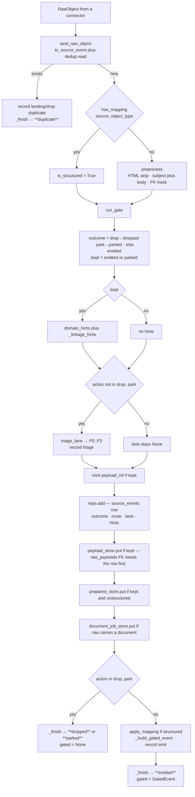

# The Capture Pipeline

*`genios_engine/capture/pipeline.py` — 227 lines. Every other file in Layer 1 is called from here, in one order.*

> **The one question this document answers: "In what order does one raw object become a
> decision, and what is written to disk at each step?"**

---

## §0 · At a glance

| | |
|---|---|
| **File** | [pipeline.py](../../../genios_engine/capture/pipeline.py) — 227 lines |
| **Public entry points** | `land_raw_object()` · `capture_event()` |
| **Private helpers** | `_linkage_hints()` · `_build_gated_event()` · `_finish()` |
| **Dataclasses** | `LandingResult` · `CaptureResult` |
| **Calls into** | `landing/normalize` · `documents/native` · `preprocess/` · `gate/` · `triage/` · `domain/hints` · `structured/` |
| **Writes** | `source_events` · `raw_payloads` · `prepared_content` · `document_jobs` · `event_trace` |
| **Returns** | `CaptureResult(event, trace, outcome, gated)` |
| **Terminal outcomes** | `duplicate` · `dropped` · `parked` · `emitted` |
| **LLM calls** | none — there is no model client anywhere in this import graph |
| **Tests** | [test_pipeline.py](../../../tests/test_pipeline.py) · [test_l1_seam.py](../../../tests/test_l1_seam.py) |

---

## §1 · What this is

`capture_event` is the whole of Layer 1 expressed as one function. A connector hands it a
`RawObject`; it hands back a `CaptureResult` whose `outcome` is one of four terminal words and
whose `trace` explains how it got there. Everything else in `capture/` is a step it calls.

Its own docstring states both the contract and the strategy:

> The L1 pipeline for one raw object, fully traced. Terminal outcomes:
> duplicate (landing), dropped/park (gate), or emitted (gated_event → L2).
>
> Everything L1 computes is PERSISTED at the seam: the decision (route/lane/hints)
> lands on the source_events row and the PII-masked prepared text (+offset map) in
> prepared_content — so L2 reads the seam instead of re-deriving it, and evidence
> can trace back to exact source characters.

**Read the second paragraph as the design rule for the whole layer.** Layer 1 is expensive once,
at ingestion, so that Layer 2 is cheap every time.

---

## §2 · Step 1 — `land_raw_object`

Landing is kept a separate function on purpose, and the docstring says why:

> Normalize + dedup check ONLY. Writing is deferred to after the gate so the
> ledger records the decision (and content is stored kept-only). `landed` here
> means "new" (not already seen), not "written".

```python
event = to_source_event(raw, org_id=org_id, connection_id=connection_id, sync_mode=sync_mode)
trace = trace or EventTrace(org_id=org_id, event_id=event.event_id,
                            dedup_key=event.dedup_key, source=event.source)
if repo.exists(org_id, event.dedup_key):
    trace.record("landing", "drop", reason_code="duplicate", dedup_key=event.dedup_key)
    return LandingResult(event=event, trace=trace, landed=False)
trace.record("landing", "pass", object_type=event.object_type)
```

Three things happen and nothing else: the envelope is built, the `EventTrace` is created (it is
born here and lives for the whole capture), and the dedup ledger is *read*. Nothing is written.

A duplicate ends the event's life immediately — one trace record, no `source_events` row, no
payload. The trace is still persisted, so *"we saw it and rejected it as already-seen"* is a
queryable fact rather than an absence.

---

## §3 · `capture_event`, in the order it runs

### 3.1 · Auto-detect structured sources

```python
if not is_structured and has_mapping(event.source, event.object_type):
    is_structured = True
```

> auto-detect structured sources (CRM/calendar/DB): a registry mapping means the
> object is typed → structured route (gate short-circuit), no LLM extraction.

The caller may pass `is_structured=True`, but almost nobody does — [sync_runner.py](../../../genios_engine/capture/acquire/sync_runner.py)
never passes it. In production the flag is derived here, from `has_mapping(source, object_type)`
in [structured/registry.py](../../../genios_engine/capture/structured/registry.py). **A HubSpot deal
takes the structured lane because a mapping exists for `("hubspot", "deal")`, not because anyone
told the pipeline it was structured.**

### 3.2 · Preprocess — the HTML strip and the subject rule

Only unstructured events are preprocessed; structured events carry typed fields and have no prose
to clean.

```python
source_text = raw.raw.get("body") or raw.raw.get("snippet") or ""
stripped = extract_native_text(mime="text/html", data=source_text) or source_text
subject = str(raw.raw.get("subject") or "")
full_text = (subject + "\n\n" + stripped) if subject else stripped
prepared = preprocess(full_text, event_id=event.event_id, mask_phone=mask_phone)
```

The comment above it carries two decisions that are easy to undo by accident:

> HTML is stripped HERE (heavy at ingestion): the gate's OOO/empty checks and the
> persisted seam text both want prose, and L2 used to re-strip it per event.
> SUBJECT IS PART OF THE PROSE and is masked WITH the body — prepending a raw
> subject downstream would leak unmasked PII from subject lines to the LLM.
> Offset map note: src coordinates refer to the stripped text, not raw HTML bytes.

**The subject rule is a privacy invariant, not a formatting choice.** `subject + "\n\n" + body`
goes through `preprocess` as one string, so an Aadhaar number in a subject line is masked exactly
like one in the body. [test_l1_seam.py](../../../tests/test_l1_seam.py) pins it:

```python
def test_subject_line_pii_is_masked_in_prepared_text():
    """The subject is part of the prose and is masked WITH the body. (Regression: the
    seam once persisted body-only prepared text and L2 prepended the RAW subject —
    unmasked subject-line PII reached the LLM.)"""
```

The offset-map caveat matters for evidence: `to_source_offset` returns a position in the
*stripped* text, not a byte offset into the original HTML.

### 3.3 · The gate

```python
ctx = GateContext(event=event, prepared=prepared, raw=raw.raw,
                  is_structured=is_structured, structured_fields=structured_fields,
                  sender_known=sender_known, in_scope=in_scope)
gate = run_gate(ctx, trace, relevance=relevance)
```

`GateContext` is the complete list of what the gate may look at. There is no store, no graph, no
connection object in it — which is the mechanical reason Layer 1 cannot reason. See
[The Gate](01-The-Gate.md).

### 3.4 · Action → outcome, and the `kept` flag

```python
outcome = {"drop": "dropped", "park": "parked"}.get(gate.action, "emitted")
kept = outcome in ("emitted", "parked")
```

Two lines that decide everything downstream. `GateResult.action` is one of
`route | drop | park | short_circuit`; both `route` and `short_circuit` fall through the
dictionary's default and become `emitted`.

| `gate.action` | `outcome` | `kept` |
|---|---|---|
| `route` | `emitted` | ✅ |
| `short_circuit` | `emitted` | ✅ |
| `park` | `parked` | ✅ |
| `drop` | `dropped` | ❌ |

**`kept` is the storage predicate.** It, and not the outcome, decides whether content is written.

### 3.5 · Hints and links — for kept events only

```python
if kept:
    text = prepared.clean_text if prepared else None
    hints = domain_hints(event.source, text)
    links = _linkage_hints(event)
```

> The seam, computed ONCE for kept events (dropped noise gets only the ledger row):
> deterministic hints persisted WITH the decision so L2 and any replay read them
> instead of recomputing.

Note that `text` is `None` for structured events, so `domain_hints` can only contribute its
`_SOURCE_PRIOR` for them — a HubSpot deal gets `sales` from the source prior; keyword hints never
fire on a structured object because there is no prose to search.

### 3.6 · The triage lane — for non-terminal events only

```python
if gate.action not in ("drop", "park"):
    lane = triage_lane(ctx, prepared)
    trace.record("triage", "pass", lane=lane)
```

The condition is deliberately *not* `if kept` — parked events are kept but get no lane:

> The triage lane is the L2 DRAIN order, so it exists only
> for emitted events — a parked event's terminal trace record stays the gate's
> park decision (recovery re-emits and the drain treats lane-less as P3).

That last clause is load-bearing and it is honoured on the other side: `_pull` in
[context/runner.py](../../../genios_engine/context/runner.py) orders by
`coalesce(se.triage_lane, 'P3')`. A recovered event therefore drains last rather than not at all.
Skipping the record also keeps the trace honest — the final record for a parked event stays the
`park`, so `final_action` means what it says.

### 3.7 · The write order

This is the part of the file worth being careful about.

```python
if kept and payload_store is not None:
    event.payload_ref = new_id("pay")
repo.add(event, outcome=outcome, route=gate.route, triage_lane=lane,
         domain_hints=hints or None, linkage_hints=links or None)
if kept and payload_store is not None:
    payload_store.put(payload_id=event.payload_ref, org_id=org_id,
                      event_id=event.event_id, content=json.dumps(raw.raw, default=str))
if kept and prepared is not None and prepared_store is not None:
    prepared_store.put(org_id=org_id, prepared=prepared)
```

Three orderings, each forced by something real:

**1 · The ledger row is written AFTER the gate.** Not before.

> Decision-first ledger: write the lightweight source_events row (metadata + the
> decision) AFTER the gate, for every new object — this is the dedup + audit ledger
> ("already fetched?" check reads it).

`repo.add` takes `outcome=` as a positional-ish argument for exactly this reason: the row cannot
be written until the decision exists, because the row *is* the record of the decision. Writing at
landing time would produce a ledger of arrivals; writing here produces a ledger of judgements.

**2 · `payload_ref` is minted BEFORE the row.** The id assignment sits above `repo.add` so the
`source_events.payload_ref` column is populated in the same insert. A second UPDATE would be a
second round-trip and a window in which the row points at nothing.

**3 · The payload row is written AFTER the ledger row.** Because of a foreign key —
[0001_initial.sql](../../../migrations/0001_initial.sql):

```sql
create table if not exists raw_payloads (
    id           text primary key,
    org_id       text not null,
    event_id     text not null references source_events (event_id),
    ...
```

Insert the payload first and the FK rejects it. **The order is not stylistic; reversing any of the
three breaks something concrete.**

The content rule itself is the strongest comment in the file:

> KEPT content: stash the raw body (encrypted, short TTL) for EMITTED and PARKED events.
> Parked = a human-review queue (grey-zone), so it MUST keep content to be recoverable — was
> a bug: parked stored no payload, dedup blocked re-fetch, /recover was a no-op → black hole.
> Dropped noise still gets NO content — only the ledger row (L1 stays a filter, not a warehouse).

### 3.8 · The document job

```python
doc = raw.raw.get("document")
if doc and document_job_store is not None:
    document_job_store.put(org_id=org_id, event_id=event.event_id, doc=doc,
                           fmt=raw.raw.get("mime"))
```

Written for *any* event carrying a `document` dict — including one the gate parked as `DOC-02`
(unsupported) or `DOC-04` (OCR review), because that is exactly when you want the provenance row.
It sits above the drop/park return for that reason.

### 3.9 · The early return

```python
if gate.action in ("drop", "park"):
    return _finish(event, trace, outcome, None, trace_repo)
```

`gated=None`. A dropped or parked event never produces a `GatedEvent`.

### 3.10 · The structured route

```python
if is_structured and not structured_fields:
    mapping = get_mapping(event.source, event.object_type)
    if mapping:
        structured_fields = apply_mapping(mapping, raw.raw)
```

> structured route: derive fields from the mapping registry (data-driven, no LLM)

`and not structured_fields` means an explicit caller-supplied dict wins — that is the path
[test_pipeline.py](../../../tests/test_pipeline.py) uses. In production the dict is always empty
and the mapping always runs. Unknown source fields are ignored, never guessed:
`apply_mapping` only copies `fm.source_field in raw_fields`.

### 3.11 · Building the `GatedEvent` and the emit record

```python
gated = _build_gated_event(event, prepared, gate, lane or "P3", structured_fields, hints, links)
trace.record("emit", "emit", route=gated.route, lane=lane)
return _finish(event, trace, "emitted", gated, trace_repo)
```

`lane or "P3"` is the only place a lane is invented — it cannot trigger today, because `lane` is
always set when `gate.action` is neither drop nor park. It is a defensive default matching the
drain's own `coalesce(..., 'P3')`.

Inside `_build_gated_event`, `route=gate.route or "needs_extraction"` — the same defensive shape.
See [Publishing to Layer 2](07-Publishing-to-Layer-2.md) for the object field by field.

---

## §4 · `_linkage_hints` — the company domain and the thread

```python
_FREE_MAIL = ("gmail.com", "googlemail.com", "outlook.com", "hotmail.com",
              "yahoo.com", "yahoo.co.in", "icloud.com", "proton.me")


def _linkage_hints(event: SourceEvent) -> list[dict]:
    """S3 — cheap deterministic entity hints for L2 (hints only; L2 decides identity).
    Company domain from the sender, and thread linkage from the parent object."""
```

| Hint | Emitted when | Shape |
|---|---|---|
| `company_domain` | the sender's email has an `@` and the domain is **not** in `_FREE_MAIL` | `{"type": "company_domain", "value": "acme.com", "from": "sender"}` |
| `thread` | `event.parent_object_id` is set | `{"type": "thread", "value": "thread_18c4a"}` |

The `_FREE_MAIL` exclusion is the whole point of the first hint: `priya@gmail.com` is a person,
not evidence of a company called Gmail. The same idea appears independently as `_PERSONAL_DOMAINS`
in [structured/apply.py](../../../genios_engine/capture/structured/apply.py) — two lists, slightly
different membership (`protonmail.com` is in one, `yahoo.co.in` in the other).

**The docstring is explicit that these are hints, not identity.** Layer 1 never resolves an entity.

---

## §5 · `_finish` — the single exit

```python
def _finish(event: SourceEvent, trace: EventTrace, outcome: str,
            gated: GatedEvent | None, trace_repo: TraceRepository | None) -> CaptureResult:
    """Single exit: persist the decision trace (all outcomes) and return the result."""
    if trace_repo is not None:
        trace_repo.save(trace)
    return CaptureResult(event=event, trace=trace, outcome=outcome, gated=gated)
```

Four lines, called from all four return statements in `capture_event`. **There is no path out of
the pipeline that does not write the trace** — that structural property, not a convention, is what
makes "every rejection has a name" true. See [Outcomes, Traces and Parked](06-Outcomes-Traces-and-Parked.md).

---

## §6 · The whole flow



---

## §7 · Worked example — one email, every branch

A real run against the in-memory stores. Input:

```python
RawObject(source="gmail", object_type="email_message", source_object_id="msg_18c4a9e2f7",
          occurred_at=datetime(2026, 7, 28, 9, 14, 22, tzinfo=timezone.utc),
          actor_email="priya@acme.com", actor_type="external_contact",
          parent_object_id="thread_18c4a",
          raw={"subject": "Revised contract",
               "body": "<html><body><p>Budget is approved. Can you send the revised "
                       "contract by Friday?</p></body></html>", "headers": {}})
```

| Step | What happened | Value |
|---|---|---|
| `to_source_event` | envelope built | `event_id=evt_17594bfd…`, `dedup_key=gmail:email_message:msg_18c4a9e2f7`, `source_family=communication`, `schema_version=3` |
| `repo.exists` | not seen | `landed=True` → `landing / pass` |
| `has_mapping("gmail","email_message")` | no mapping | stays unstructured |
| HTML strip | `_html_to_text` | `Budget is approved. Can you send the revised contract by Friday?` |
| subject join | subject **then** body | `Revised contract\n\nBudget is approved. …` |
| `preprocess` | no high-risk PII present | `preprocess / pass`, `language=en`, `masked=0`, `protected=2` |
| `run_gate` S0 | `in_scope=True` | `S0 / pass` |
| `run_gate` S1 | no whitelist, no hard rule | `S1 / pass` |
| `run_gate` S2 | no classifier wired | `S2 / pass`, `route=needs_extraction` |
| outcome map | `action="route"` | `outcome=emitted`, `kept=True` |
| `domain_hints` | keyword `contract` | `[DomainHint(domain="sales", source="keyword")]` |
| `_linkage_hints` | `acme.com` not free-mail, thread present | `company_domain=acme.com` · `thread=thread_18c4a` |
| `triage_lane` | deadline `Friday` 25 + `?` 10 = 35 | **P1** → `triage / pass` |
| `payload_ref` | minted before the row | `pay_fc40f096…` |
| `repo.add` | ledger row | `outcome=emitted`, `route=needs_extraction`, `triage_lane=P1`, both hint columns |
| `payload_store.put` | after the row | full `raw.raw` as JSON, encrypted, 30-day TTL |
| `prepared_store.put` | masked text plus offset map | `pc_6730ffbe…`, 180-day TTL |
| `_build_gated_event` | | `prepared_content_ref=pc_6730ffbe…`, `versions={"preprocessor":"prep-1","gate_rules":"gate-1"}` |
| `_finish` | trace saved | 7 rows in `event_trace` |

The trace, exactly as recorded:

```
landing     pass                    {'object_type': 'email_message'}
preprocess  pass                    {'language': 'en', 'masked': 0, 'protected': 2}
S0          pass                    {}
S1          pass                    {}
S2          pass                    {'route': 'needs_extraction'}
triage      pass                    {'lane': 'P1'}
emit        emit                    {'route': 'needs_extraction', 'lane': 'P1'}
```

**Change one thing and the branches move.** Add `labelIds: ["SPAM"]` and the same email ends at
`S1 / drop / N-09`: no lane, no hints, no payload, no prepared text — one ledger row and six words
of reason. Change the source to `hubspot` and object type to `deal` and preprocess never runs at
all; the trace is `landing → S0 → S1.5 → triage → emit`, five records, `route=structured`.

---

## §8 · Gaps

**`in_scope` and `sender_known` have no production source of `False` and `True` respectively.**
`in_scope` defaults to `True` and neither `run_sync` nor `intake.py` ever passes it, so S0 cannot
fire outside tests. `sender_known` *is* wired — [routes.py](../../../genios_engine/api/routes.py)
builds `_sender_resolver_for` and `run_sync` calls it per object — but only for connector syncs,
not for the webhook or intake paths.

**`mask_phone` is never passed in production.** `capture_event(mask_phone=False)` is the default
and no caller overrides it, so `PHONE_IN` in [preprocess/pii.py](../../../genios_engine/capture/preprocess/pii.py)
never runs outside tests. That is the documented intent — *"phone is tenant-configurable (default
off — sales/support workflows often need it)"* — but there is no tenant configuration reaching it.

**`CaptureResult.outcome`'s inline comment is stale.** It reads
`# emitted | duplicate | dropped | park`; the value actually produced is `parked`. `run_sync`
depends on the real spelling — `setattr(summary, res.outcome, …)` resolves to `SyncSummary.parked`.

**A concurrent double-capture of the same object can raise on the payload insert.**
`repo.exists` and `repo.add` are separate statements, and `PostgresSourceEventRepository.add` is
`on conflict (org_id, dedup_key) do nothing`. If two workers capture the same object at once — two
overlapping syncs of one connection, say — the loser's `source_events` insert is a no-op and its
following `raw_payloads` insert then violates the FK. `_capture_bounded` retries twice and
quarantines after that, so the batch survives; the event lands once, correctly. It is contained,
not impossible.

**Nothing records the persistence step in the trace.** `event_trace` covers landing, preprocess,
gate, triage and emit; the four store writes are invisible to it. A payload write that silently
did nothing (in-memory store in a misconfigured deployment) leaves no mark.

---

## §9 · Map

| Thing | Where |
|---|---|
| The pipeline | [pipeline.py](../../../genios_engine/capture/pipeline.py) |
| Envelope + dedup key | [landing/normalize.py](../../../genios_engine/capture/landing/normalize.py) · [contracts/source_event.py](../../../genios_engine/contracts/source_event.py) |
| Ledger | [landing/repository.py](../../../genios_engine/capture/landing/repository.py) · [landing/pg_repository.py](../../../genios_engine/capture/landing/pg_repository.py) |
| HTML strip | [documents/native.py](../../../genios_engine/capture/documents/native.py) |
| Preprocess + PII | [preprocess/preprocess.py](../../../genios_engine/capture/preprocess/preprocess.py) · [preprocess/pii.py](../../../genios_engine/capture/preprocess/pii.py) |
| Gate | [gate/gate.py](../../../genios_engine/capture/gate/gate.py) · [gate/rules.py](../../../genios_engine/capture/gate/rules.py) |
| Triage | [triage/triage.py](../../../genios_engine/capture/triage/triage.py) |
| Domain hints | [domain/hints.py](../../../genios_engine/capture/domain/hints.py) |
| Structured mappings | [structured/registry.py](../../../genios_engine/capture/structured/registry.py) · [structured/apply.py](../../../genios_engine/capture/structured/apply.py) |
| Stores | [payload_store.py](../../../genios_engine/capture/payload_store.py) · [prepared_store.py](../../../genios_engine/capture/prepared_store.py) · [documents/store.py](../../../genios_engine/capture/documents/store.py) · [trace_store.py](../../../genios_engine/capture/trace_store.py) |
| Callers | [acquire/sync_runner.py](../../../genios_engine/capture/acquire/sync_runner.py) · [intake.py](../../../genios_engine/capture/intake.py) · [api/routes.py](../../../genios_engine/api/routes.py) |
| Tables | `source_events` · `raw_payloads` · `prepared_content` · `document_jobs` · `event_trace` |
| Migrations | [0001_initial.sql](../../../migrations/0001_initial.sql) · [0002_l1_tables.sql](../../../migrations/0002_l1_tables.sql) · [0003_source_event_outcome.sql](../../../migrations/0003_source_event_outcome.sql) · [0027_l1_seam.sql](../../../migrations/0027_l1_seam.sql) · [0035_l1_internal_knowledge.sql](../../../migrations/0035_l1_internal_knowledge.sql) |
| Tests | [test_pipeline.py](../../../tests/test_pipeline.py) · [test_l1_seam.py](../../../tests/test_l1_seam.py) · [test_structured.py](../../../tests/test_structured.py) · [test_relevance.py](../../../tests/test_relevance.py) |

*Next: [Outcomes, Traces and the Parked Queue](06-Outcomes-Traces-and-Parked.md) · then
[Publishing to Layer 2](07-Publishing-to-Layer-2.md). Back to [Layer 1 Overview](../00-Overview.md).*
