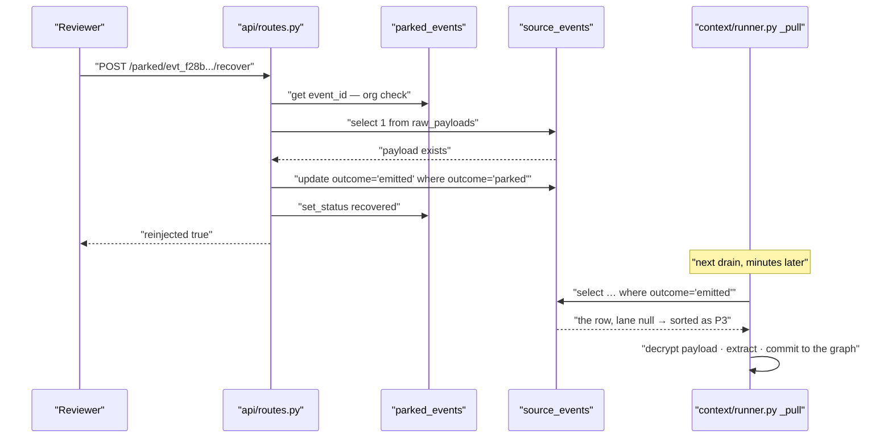

# Outcomes, Traces and the Parked Queue

*Where an event can end its life, what is written when it does, and how to get it back.*

> **The one question this document answers: "For any object that ever entered GeniOS, what
> happened to it and why?"**

---

## §0 · At a glance

| | |
|---|---|
| **Files** | [contracts/trace.py](../../../genios_engine/contracts/trace.py) · [contracts/parked.py](../../../genios_engine/contracts/parked.py) · [trace_store.py](../../../genios_engine/capture/trace_store.py) · [parked/store.py](../../../genios_engine/capture/parked/store.py) |
| **Types** | `StageAction` · `StageRecord` · `EventTrace` · `ParkedEvent` |
| **Stores** | `TraceRepository` · `ParkedStore` — Protocol plus in-memory plus Postgres for each |
| **Tables** | `event_trace` ([0001](../../../migrations/0001_initial.sql)) · `parked_events` ([0002](../../../migrations/0002_l1_tables.sql)) |
| **Terminal states** | `duplicate` · `dropped` · `parked` · `quarantined` · `emitted` |
| **Endpoints** | `GET /parked` · `POST /parked/{event_id}/recover` |
| **Tests** | [test_events_parked.py](../../../tests/test_events_parked.py) · [test_l1_seam.py](../../../tests/test_l1_seam.py) |

---

## §1 · The five ways an event ends

Four of them come out of `capture_event` as `CaptureResult.outcome`. The fifth,
`quarantined`, is produced one level up in [sync_runner.py](../../../genios_engine/capture/acquire/sync_runner.py)
when capture itself throws.

| Outcome | Decided at | `source_events` row | `raw_payloads` | `prepared_content` | `event_trace` | `parked_events` | `GatedEvent` |
|---|---|---|---|---|---|---|---|
| **duplicate** | `land_raw_object` — `repo.exists` | ❌ none | ❌ | ❌ | ✅ 1 row | ❌ | ❌ |
| **dropped** | gate S0 / S1 hard rule | ✅ `outcome='dropped'` | ❌ | ❌ | ✅ all stages | ❌ | ❌ |
| **parked** | gate S1.5 / S1 doc rules / S2 | ✅ `outcome='parked'` | ✅ | ✅ if unstructured | ✅ all stages | ✅ via `run_sync` | ❌ |
| **quarantined** | `_capture_bounded` after 3 attempts | ❌ none | ❌ | ❌ | ❌ | ✅ `poison_quarantine` | ❌ |
| **emitted** | gate `route` / `short_circuit` | ✅ `outcome='emitted'` | ✅ | ✅ if unstructured | ✅ all stages | ❌ | ✅ |

Two rows in that table are worth staring at.

**A duplicate leaves a trace and nothing else.** No ledger row is written because one already
exists under the same `(org_id, dedup_key)` — the earlier capture's row, with the earlier
capture's decision. The trace row is what tells you the object was re-offered.

**A quarantined object leaves only a parked row.** Capture threw before anything was persisted, so
there is no event id, no ledger row and no trace. The parked row is the entire record.

---

## §2 · `EventTrace` — the debug core

```python
class StageAction(str, Enum):
    pass_ = "pass"
    drop = "drop"
    park = "park"
    emit = "emit"
    short_circuit = "short_circuit"


class StageRecord(BaseModel):
    stage: str                              # "landing", "S0", "S1", ...
    action: StageAction
    reason_code: str | None = None
    detail: dict[str, Any] = Field(default_factory=dict)
    at: datetime = Field(default_factory=lambda: datetime.now(timezone.utc))
```

`EventTrace` itself states what it is for:

> Per-event, per-stage visibility — the debug core.
>
> Every L1 stage appends exactly what it did and why, so you can answer:
> "what came in, which stage filtered it, why, and how much" for any event.

The whole write API is one method, and it returns `self` so a stage can chain:

```python
def record(self, stage: str, action: str, reason_code: str | None = None,
           **detail: Any) -> "EventTrace":
    self.records.append(
        StageRecord(stage=stage, action=StageAction(action),
                    reason_code=reason_code, detail=detail)
    )
    return self
```

`**detail` is why the trace is useful rather than merely present. `preprocess` records
`language`, `masked` and `protected` counts; `triage` records the lane; S2 records the relevance
score. Those are the numbers you need when the answer to *"why was this dropped?"* is *"it
wasn't — it was scored 0.30"*.

```python
@property
def final_action(self) -> StageAction | None:
    return self.records[-1].action if self.records else None
```

`final_action` is only meaningful because [pipeline.py](../../../genios_engine/capture/pipeline.py)
never records a stage *after* a terminal decision. That is the reason a parked event gets no
`triage` record even though it is a kept event — the last thing in its trace stays the `park`.

### The stage vocabulary, as actually emitted

| Stage | Emitted by | Actions seen |
|---|---|---|
| `landing` | `land_raw_object` | `pass` · `drop` (`duplicate`) |
| `preprocess` | `capture_event` | `pass` |
| `S0` | `run_gate` | `pass` · `drop` (`out_of_scope`) |
| `S1.5` | `run_gate` | `short_circuit` (`structured_mapped`) · `park` (`mapping_missing`) |
| `S1` | `run_gate` | `pass` · `drop`/`park` with a W- or N- or DOC- code |
| `S2` | `run_gate` | `pass` · `park` (`low_relevance`) |
| `triage` | `capture_event` | `pass` |
| `emit` | `capture_event` | `emit` |

---

## §3 · `event_trace` — one row per stage

The Protocol says exactly what the table is:

> Persists the per-event decision trace. One row per stage in event_trace so any
> event's full path (what came in, which stage filtered it, why) is queryable.

```sql
create table if not exists event_trace (
    id          bigserial primary key,
    org_id      text not null,
    event_id    text not null,
    dedup_key   text,
    source      text,
    stage       text not null,
    action      text not null,               -- pass | drop | park | emit | short_circuit
    reason_code text,
    detail      jsonb not null default '{}',
    at          timestamptz not null default now()
);
create index if not exists event_trace_by_event on event_trace (org_id, event_id);
create index if not exists event_trace_by_stage on event_trace (org_id, stage, action);
```

`PostgresTraceRepository.save` flattens the whole `EventTrace` into a list of dicts and hands it to
one `execute` — SQLAlchemy turns that into an executemany, so a seven-stage trace is one round
trip, not seven:

```python
rows = [{...} for r in trace.records]
if not rows:
    return
with self._engine.begin() as conn:
    conn.execute(_INSERT, rows)
```

The two indexes answer the two different questions people actually ask. `event_trace_by_event`
answers *"what happened to this one email"*. `event_trace_by_stage` answers *"how many things did
S1 drop this week, and for which codes"* — the aggregate view that tells you a gate rule is
mis-tuned.

Note what the table does **not** have: a foreign key to `source_events`. That is necessary,
because a duplicate writes a trace row for an `event_id` whose ledger row was never inserted.

---

## §4 · Why the trace is written for every outcome, including drops

`_finish` is called from all four exits of `capture_event`, and it saves unconditionally:

```python
def _finish(event, trace, outcome, gated, trace_repo) -> CaptureResult:
    """Single exit: persist the decision trace (all outcomes) and return the result."""
    if trace_repo is not None:
        trace_repo.save(trace)
```

**The question this buys you is the one that is otherwise unanswerable: "the customer says they
emailed us — where did it go?"**

Without a drop trace, a dropped email is indistinguishable from an email that was never fetched,
which is indistinguishable from a connector that broke. With it, one query separates all three:

```sql
select stage, action, reason_code, detail
from event_trace
where org_id = :o and event_id = :e
order by id;
```

An empty result means acquisition never saw the object — go and look at
[cursor_store.py](../../../genios_engine/capture/acquire/cursor_store.py) and the connector. A
result ending in `S1 / drop / N-03` means the gate saw it and called it a no-reply sender; the
reason code has a human label in `REASON_LABELS` in
[gate/rules.py](../../../genios_engine/capture/gate/rules.py). The distinction is the difference
between a bug and a policy.

---

## §5 · `ParkedEvent` — the rule

The nineteen-line contract carries the layer's second-most-quoted comment:

> Parked ≠ deleted. An uncertain/unsupported event, reviewable with its reason,
> stage, and trace. Recover re-injects it; retention is L7 policy, not hidden delete.

```python
class ParkedEvent(BaseModel):
    event_id: str
    org_id: str
    source: str
    reason_code: str
    stage: str
    trace: list[dict] = Field(default_factory=list)
    status: str = "pending"                    # pending | recovered | relabeled | dropped
    created_at: datetime = Field(default_factory=lambda: datetime.now(timezone.utc))
```

Three clauses, three separate commitments:

| Clause | Enforced by |
|---|---|
| *reviewable with its reason, stage, and trace* | `reason_code` + `stage` + `trace` on the row; `GET /parked` returns them |
| *Recover re-injects it* | `POST /parked/{event_id}/recover` flips `source_events.outcome` back to `emitted` — and the payload was kept for exactly this (see §3.7 of [The Capture Pipeline](05-The-Capture-Pipeline.md)) |
| *retention is L7 policy, not hidden delete* | nothing in Layer 1 deletes a parked row; the raw payload's 30-day TTL is a separate, declared clock in `purge_expired` |

**The second clause used to be a lie.** The pipeline comment records it:

> was a bug: parked stored no payload, dedup blocked re-fetch, /recover was a no-op → black hole.

A parked event kept no content, so recovery had nothing to re-inject, and dedup prevented the sync
from ever fetching it again. The queue looked like a review queue and behaved like a bin.

---

## §6 · `ParkedStore` and `parked_from_trace`

```python
class ParkedStore(Protocol):
    def add(self, p: ParkedEvent) -> None: ...
    def list(self, org_id: str, reason_code: str | None = None) -> list[ParkedEvent]: ...
    def get(self, event_id: str) -> ParkedEvent | None: ...
    def set_status(self, event_id: str, status: str) -> None: ...
```

| Implementation | Backing | Chosen when |
|---|---|---|
| `InMemoryParkedStore` | `dict[str, ParkedEvent]` keyed by `event_id` | no `DATABASE_URL` — `make_parked_store()` in [platform/wiring.py](../../../genios_engine/platform/wiring.py) |
| `PostgresParkedStore` | `parked_events`, `insert … on conflict (event_id) do nothing` | `DATABASE_URL` set |

The Postgres `add` is idempotent by primary key, so re-parking the same event after a re-sync
cannot create a second review item. `list` orders `created_at desc` and filters by `reason_code`
when given — which is what the `?reason_code=` query parameter on `GET /parked` maps to.

`parked_from_trace` is the adapter from the pipeline's world to the queue's:

```python
def parked_from_trace(org_id, event_id, source, reason_code, trace: EventTrace) -> ParkedEvent:
    last = trace.records[-1] if trace.records else None
    return ParkedEvent(
        event_id=event_id, org_id=org_id, source=source, reason_code=reason_code,
        stage=last.stage if last else "unknown",
        trace=[{"stage": r.stage, "action": r.action.value, "reason": r.reason_code}
               for r in trace.records],
    )
```

**`stage` comes from the last record, which is the parking decision itself** — that is why the
queue can say *"S1.5 · mapping_missing"* rather than just *"parked"*. The embedded `trace` is a
deliberately lossy projection: stage, action, reason. The `detail` dict and the timestamps are
dropped here and remain available in `event_trace`.

### The status vocabulary

| Status | Meaning | Written by |
|---|---|---|
| `pending` | awaiting review — the default on construction | `ParkedEvent` default |
| `recovered` | a human promoted it; the source event was flipped back to `emitted` | `recover_parked` in [api/routes.py](../../../genios_engine/api/routes.py) |
| `relabeled` | reserved: the reviewer disagreed with the reason code | **nothing** |
| `dropped` | reserved: the reviewer confirmed it is noise | **nothing** |

Two of the four are vocabulary without a writer. See §10.

---

## §7 · The endpoints

```python
@router.get("/parked")
def list_parked(reason_code: str | None = None, org_id: str = Depends(get_current_org)) -> dict:
    return {"parked": [p.model_dump(mode="json") for p in _parked.list(org_id, reason_code)]}
```

Tenant-scoped by the credential, never by a caller-supplied `org_id`.

```python
@router.post("/parked/{event_id}/recover")
def recover_parked(event_id: str, org_id: str = Depends(get_current_org)) -> dict:
    """Human promotes a grey-zone parked event → re-inject it: flip the source event to 'emitted'
    so the next L2 pass processes it (its encrypted payload was kept). No longer a no-op."""
```

What recovery actually does, in order:

1. `_parked.get(event_id)`; 404 if missing **or if it belongs to another org**.
2. If a real database is configured, check `raw_payloads` has a row for `(org_id, event_id)`.
   *No payload, no re-injection* — there would be nothing for Layer 2 to read.
3. If it does: `update source_events set outcome='emitted' where org_id=:o and event_id=:e and outcome='parked'`.
   The `and outcome='parked'` clause makes a double-click harmless — the second call matches zero
   rows and returns `reinjected: false`.
4. `_parked.set_status(event_id, "recovered")` — unconditionally, whether or not step 3 changed
   anything.
5. Return `{"event_id", "status": "recovered", "reinjected": <bool>}`.

**Recovery does not re-run the gate, re-preprocess, or re-decide anything.** It changes one column.
The next L2 drain picks the row up because `_pull` filters on `se.outcome='emitted'`, and orders it
last within its time band because `triage_lane` is still null and the drain coalesces null to `P3`.

---

## §8 · `poison_quarantine`

The fifth terminal state never reaches `capture_event`'s return statement, because
`capture_event` raised. `_capture_bounded` absorbs it:

```python
def _capture_bounded(raw: RawObject, *, retries: int, **kw):
    """capture_event with bounded retries. A poison object (still failing after
    retries) returns (None, error) so the caller quarantines it — the batch never
    crashes and nothing is silently lost."""
    err = None
    for _ in range(retries + 1):
        try:
            return capture_event(raw, **kw), None
        except Exception as e:      # noqa: BLE001 — deliberately broad; poison isolation
            err = e
    return None, err
```

`run_sync` passes `retries=2`, so three attempts. On `res is None` the aggregation loop writes a
synthetic parked row and moves on:

```python
summary.quarantined += 1
if parked_store is not None:
    parked_store.add(ParkedEvent(
        event_id=f"{raw.source}:{raw.source_object_id}", org_id=org_id,
        source=raw.source, reason_code="poison_quarantine", stage="capture",
        trace=[{"error": type(err).__name__, "detail": str(err)[:200]}]))
continue
```

Three things differ from an ordinary park and all three matter:

- **The `event_id` is synthetic** — `"gmail:msg_18c4a9e2f7"`, not an `evt_…` id. No `SourceEvent`
  was ever committed, so there is no real id to use.
- **The `trace` holds an exception, not stages** — `{"error": "IntegrityError", "detail": "…"}`.
- **Recovery cannot work on it.** Step 2 of `recover_parked` looks for a `raw_payloads` row keyed
  by that id and will not find one, so `reinjected` is always `false`. Fixing a quarantined object
  means fixing the bug and re-syncing; the dedup ledger has no row for it either, so a re-sync
  genuinely re-lands it.

`summary.quarantined` is carried into `l1_sync_runs` by `_run_ledger`, so a rising quarantine count
is visible per connection per run without reading logs.

---

## §9 · Worked example — parked as `low_relevance`, then recovered

A real run. An email with no business signal, with the deterministic relevance classifier wired
(`make_relevance_classifier()`, which `run_sync` passes as `relevance=`):

```python
RawObject(source="gmail", object_type="email_message", source_object_id="msg_7d31",
          occurred_at=datetime(2026, 8, 3, 7, 2, tzinfo=timezone.utc),
          actor_email="rahul@vendorx.io", actor_type="external_contact",
          raw={"subject": "Quick hello",
               "body": "Hi, hope you are well. Wanted to reconnect sometime.",
               "headers": {}})
```

**Capture.** `_BUSINESS` in [gate/relevance.py](../../../genios_engine/capture/gate/relevance.py)
finds nothing, and the sender is not known, so `RelevanceVerdict(False, 0.30, reason="no_business_signal")`:

```
landing     pass                    {'object_type': 'email_message'}
preprocess  pass                    {'language': 'en', 'masked': 0, 'protected': 0}
S0          pass                    {}
S1          pass                    {}
S2          park   low_relevance    {'relevance': 0.3}
```

`outcome='parked'`, `kept=True`, and the ledger row records the honest shape of a park:

```python
{'route': None, 'triage_lane': None, 'domain_hints': None,
 'linkage_hints': [{'type': 'company_domain', 'value': 'vendorx.io', 'from': 'sender'}]}
```

`route` is null because `GateResult(action="park")` carries no route. `triage_lane` is null
because the lane is drain order and this event is not draining. `domain_hints` is null because
`domain_hints()` found no keyword — but `linkage_hints` is not, because `vendorx.io` is not in
`_FREE_MAIL`. Payload and prepared text were both written; this is a kept event.

**The queue row**, from `parked_from_trace`:

```json
{
  "event_id": "evt_f28b23f5dea74e928f8685fe",
  "org_id": "org_demo",
  "source": "gmail",
  "reason_code": "low_relevance",
  "stage": "S2",
  "trace": [
    {"stage": "landing",    "action": "pass", "reason": null},
    {"stage": "preprocess", "action": "pass", "reason": null},
    {"stage": "S0",         "action": "pass", "reason": null},
    {"stage": "S1",         "action": "pass", "reason": null},
    {"stage": "S2",         "action": "park", "reason": "low_relevance"}
  ],
  "status": "pending",
  "created_at": "2026-08-07T06:41:57.246358Z"
}
```

**Recovery.** A human sees it in `GET /parked?reason_code=low_relevance`, recognises Rahul as a
real prospect, and calls `POST /parked/evt_f28b23f5.../recover`:



The event is now indistinguishable from one the gate had emitted in the first place, except for
two residues: its `event_trace` still ends at `S2 / park / low_relevance`, and its
`triage_lane` is still null.

---

## §10 · Gaps

**Only `run_sync` populates `parked_events`.** `capture_event` never touches the parked store —
the write lives in the aggregation loop of [sync_runner.py](../../../genios_engine/capture/acquire/sync_runner.py).
Every other caller of `capture_event` therefore parks silently:

| Caller | Passes `parked_store`? | Consequence of a park |
|---|---|---|
| `run_sync` | ✅ | appears in `GET /parked` |
| `POST /webhooks/composio` | ❌ | ledger row + payload + trace written, **no queue row** |
| `intake.py` (`ingest_manual`, uploads, human/agent events) | ❌ | same — a `DOC-02`/`DOC-04` upload park is invisible to the queue |
| `POST /dev/ingest-sample` | ❌ | demo only |

The event is not lost — it is in `source_events` with `outcome='parked'` and its trace is in
`event_trace` — but the review UI reads `parked_events`, so nobody will look at it.

**`relabeled` and `dropped` have no writer.** The status column accepts four values and the system
can produce two. There is no endpoint to reject a parked event, so the queue only grows in the
`pending` direction unless someone recovers.

**`set_status("recovered")` runs even when re-injection did not happen.** In an in-memory
deployment, or when the raw payload has aged past its 30-day TTL, the row is marked `recovered`
while `source_events.outcome` is untouched. The response distinguishes the two with `reinjected`,
but the stored status does not.

**Recovery leaves no audit record.** No `event_trace` row is appended, so the decision path for the
event still reads *"parked at S2"* forever. The only evidence a human intervened is
`parked_events.status`, which carries no actor and no timestamp of the change.

**A recovered event never gets a triage lane.** It is drained as `P3` — behind every P0/P1/P2 in
the queue — even when a human just declared it worth looking at. The lane could be recomputed at
recovery time; it is not.

**`PostgresParkedStore.list` is unbounded.** No limit, no pagination, no status filter — a tenant
with a noisy classifier and months of history gets the whole table in one response. The
in-memory implementation has the same shape, and additionally ignores `status`, so recovered
items keep appearing in the list.

---

## §11 · Map

| Thing | Where |
|---|---|
| `StageAction` · `StageRecord` · `EventTrace` | [contracts/trace.py](../../../genios_engine/contracts/trace.py) |
| `ParkedEvent` | [contracts/parked.py](../../../genios_engine/contracts/parked.py) |
| `TraceRepository` + both impls | [trace_store.py](../../../genios_engine/capture/trace_store.py) |
| `ParkedStore` + both impls + `parked_from_trace` | [parked/store.py](../../../genios_engine/capture/parked/store.py) |
| Where traces are recorded | [pipeline.py](../../../genios_engine/capture/pipeline.py) · [gate/gate.py](../../../genios_engine/capture/gate/gate.py) |
| Reason-code labels | `REASON_LABELS` in [gate/rules.py](../../../genios_engine/capture/gate/rules.py) |
| Quarantine | `_capture_bounded` + the aggregation loop in [acquire/sync_runner.py](../../../genios_engine/capture/acquire/sync_runner.py) |
| Store selection | `make_parked_store` · `make_trace_repo` in [platform/wiring.py](../../../genios_engine/platform/wiring.py) |
| Endpoints | `list_parked` · `recover_parked` in [api/routes.py](../../../genios_engine/api/routes.py) |
| `event_trace` DDL | [0001_initial.sql](../../../migrations/0001_initial.sql) |
| `parked_events` DDL | [0002_l1_tables.sql](../../../migrations/0002_l1_tables.sql) |
| `l1_sync_runs` — the aggregate view | [0027_l1_seam.sql](../../../migrations/0027_l1_seam.sql) |
| Tests | [test_events_parked.py](../../../tests/test_events_parked.py) · [test_l1_seam.py](../../../tests/test_l1_seam.py) · [test_pipeline.py](../../../tests/test_pipeline.py) |

*Previous: [The Capture Pipeline](05-The-Capture-Pipeline.md) · Next:
[Publishing to Layer 2](07-Publishing-to-Layer-2.md) · Back to [Layer 1 Overview](../00-Overview.md).*
