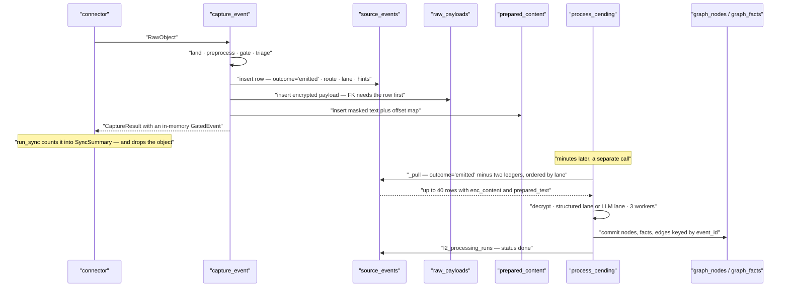

# Publishing to Layer 2

*The last thing Layer 1 does, and the thing it does not do that everyone assumes it does.*

> **The one question this document answers: "What exactly crosses the boundary from `capture/`
> to `context/`, and by what mechanism?"**

---

## §0 · At a glance

| | |
|---|---|
| **The contract** | `GatedEvent` — [contracts/gated_event.py](../../../genios_engine/contracts/gated_event.py), 39 lines |
| **Spec name** | the architecture spec calls this a `QualifiedEnterpriseSignal`. Same role, different name; from here on it is `GatedEvent`, because that is what the code calls it |
| **Built by** | `_build_gated_event()` in [pipeline.py](../../../genios_engine/capture/pipeline.py) |
| **Actually transported by** | the `source_events` table, drained by `_pull()` in [context/runner.py](../../../genios_engine/context/runner.py) |
| **Filter** | `outcome = 'emitted'`, minus two idempotency ledgers |
| **Order** | `coalesce(triage_lane, 'P3') asc, occurred_at asc` |
| **Carries content** | **no** — two references, `payload_ref` and `prepared_content_ref` |
| **`schema_version`** | `2` — v2 added `internal_kind`, additive only |
| **Deeper on the L2 side** | [Input — what Layer 1 actually hands over](../../Layer-2-Context-Intelligence/Input-From-Layer-1.md) |

---

## §1 · `GatedEvent`, field by field

The docstring sets the boundary of what this object is allowed to be:

> L1's output to L2. Deterministic only — no LLM classification here. Carries the
> routing decision (structured values vs needs-extraction) plus cheap hints; L2's
> single combined call produces relevance + typed facts.

| Field | Type | Set from | What it is for |
|---|---|---|---|
| `event_id` | `str` | `event.event_id` | provenance key — every fact, edge and observation L2 writes points back at it |
| `org_id` | `str` | `event.org_id` | tenant scope; on every row of every table |
| `source` | `str` | `event.source` | `gmail` · `gcal` · `hubspot` · `notion` · `human` · `agent` · … |
| `object_type` | `str` | `event.object_type` | with `source`, the key into the structured mapping registry |
| `occurred_at` | `datetime` | `event.occurred_at` | **world time**, never capture time — correlation windows and freshness use it |
| `payload_ref` | `str \| None` | `event.payload_ref` | the `raw_payloads.id`. `None` when no payload store was wired |
| `prepared_content_ref` | `str \| None` | `prepared.prepared_content_id` | the `prepared_content` row. `None` for structured events, which have no prose |
| `route` | `str` | `gate.route or "needs_extraction"` | `"structured"` or `"needs_extraction"` |
| `structured_fields` | `dict` | caller-supplied, else `apply_mapping(...)` | typed values for the structured route, e.g. `{"deal.stage": "proposal"}` |
| `domain_hints` | `list[DomainHint]` | `domain_hints(source, clean_text)` | `DomainHint(domain, source)` where `source` is `scope` or `keyword` |
| `deadline_at` | `datetime \| None` | **never set** | declared and unused — see §7 |
| `linkage_hints` | `list[dict]` | `_linkage_hints(event)` | `company_domain` from the sender, `thread` from the parent object |
| `triage_lane` | `str` | `lane or "P3"` | drain order, `P0`–`P3`. Default on the model is `"P2"`, which the pipeline never relies on |
| `coverage_ready` | `bool \| None` | **never set** | declared and unused — see §7 |
| `internal_kind` | `str \| None` | `event.internal_kind` | company canon, one of the twelve `INTERNAL_KINDS` |
| `versions` | `dict` | see §3 | which preprocessor and which gate ruleset produced this |
| `schema_version` | `int` | `2` | see §3 |

`internal_kind` is the only field whose comment explains a downstream consequence:

> Company canon (capture.internal_knowledge.INTERNAL_KINDS) — the authority this
> event carries into the graph. None = observed traffic, ordinary rank.

**That is Layer 1 asserting authority, not describing content.** Provenance is what capture knows,
so capture sets it; Layer 2 honours it rather than inferring it back from the source name.

---

## §2 · What it deliberately does not carry

**No content.** Not the body, not the subject, not the cleaned text, not the structured object's
raw JSON. Two opaque strings stand in for all of it:

```python
payload_ref=event.payload_ref,
prepared_content_ref=prepared.prepared_content_id if prepared else None,
```

This is the same rule the stores state on their own terms. From
[payload_store.py](../../../genios_engine/capture/payload_store.py):

> Raw content lives here — encrypted, with a short TTL — and ONLY for KEPT
> (emitted) events, so L2 can read the body. Dropped noise is never stored: this
> is what keeps L1 a filter, not a data warehouse.

Carrying the body on the contract object would defeat three properties at once. Content would
travel unencrypted through whatever holds the object; the 30-day and 180-day retention clocks
would have a second, unmanaged copy to chase; and the two lifetimes — a raw payload dies at 30
days, its masked prepared form lives 180 — could not diverge, which is exactly what makes
re-extraction over history possible without re-fetching or re-paying.

Also absent, and deliberately so: no relevance verdict, no entities, no facts, no classification.
`domain_hints` and `linkage_hints` are named *hints* in both the field names and the docstring —
*"hints only; L2 decides identity"*.

---

## §3 · `versions` and `schema_version`

```python
versions={
    "preprocessor": prepared.preprocessor_version if prepared else None,
    "gate_rules": "gate-1",
},
```

| Key | Value today | Where it comes from |
|---|---|---|
| `preprocessor` | `"prep-1"` for unstructured, `None` for structured | `PreparedContent.preprocessor_version` default in [contracts/prepared_content.py](../../../genios_engine/contracts/prepared_content.py) |
| `gate_rules` | `"gate-1"` | a string literal in `_build_gated_event`. Nothing in [gate/](../../../genios_engine/capture/gate/) declares or exports it |

The intent is replayability: knowing which preprocessor masked the text and which ruleset judged
it lets you re-run a corpus after changing either. The preprocessor half works — the version rides
along with the stored `PreparedContent` and is persisted in `prepared_content.preprocessor_version`.
**The gate half is a hardcoded literal that will not change when the rules do**, and `versions` is
not among the columns written to `source_events` at all.

```python
schema_version: int = 2                  # v2: + internal_kind (additive only)
```

v2 added `internal_kind` and nothing else. *Additive only* is the compatibility promise: a reader
built against v1 sees every field it knew, in the same shape, and simply does not look at the new
one. The envelope underneath moved in step —
[contracts/source_event.py](../../../genios_engine/contracts/source_event.py) is at
`schema_version: int = 3  # v3: + internal_kind`, having gained `source_family` at v2. **The two
version numbers count different things and are not meant to match.**

---

## §4 · The handoff as it actually works

There is no bus. Nothing subscribes. `capture_event` returns a `GatedEvent` to its caller and the
caller keeps it in memory; **Layer 2 never sees that object.** What Layer 2 does is drain the seam:

```python
def _pull(store: GraphStore, org_id: str, limit: int):
    """Drain order = L1's triage lane FIRST (P0 preempts P3 — the lane was computed at
    ingestion and previously thrown away), then arrival time. Prepared text rides along
    from the seam so processing doesn't re-derive it."""
    with store.engine.connect() as c:
        return c.execute(text(
            "select se.event_id, se.source, se.object_type, se.actor->>'email' as sender, "
            "se.occurred_at, se.source_object_id, se.triage_lane, se.internal_kind, "
            "se.parent_object_id, se.domain_hints, "
            "rp.enc_content, "
            "pc.clean_text as prepared_text "
            "from source_events se "
            "join raw_payloads rp on rp.event_id = se.event_id "
            "left join prepared_content pc on pc.event_id = se.event_id and pc.org_id = se.org_id "
            "where se.org_id=:o and se.outcome='emitted' "
            "and se.event_id not in (select event_id from l2_extraction_results where org_id=:o) "
            "and se.event_id not in (select event_id from l2_processing_runs "
            "                        where org_id=:o and status in ('done','parked')) "
            "order by coalesce(se.triage_lane, 'P3') asc, se.occurred_at asc "
            "limit :lim"), {"o": org_id, "lim": limit}).fetchall()
```

Five clauses, five decisions:

**`join raw_payloads` — an inner join.** An emitted event with no payload row is *invisible* to
Layer 2. This is the mechanical reason the pipeline stores content for kept events: without the
payload there is nothing to join to and the event never drains. It is also why
`recover_parked` checks `raw_payloads` before flipping the outcome — flipping a payload-less row
would produce a permanently stuck `emitted` row.

**`left join prepared_content`** — outer, because structured events legitimately have no prepared
text, and because rows written before migration
[0027_l1_seam.sql](../../../migrations/0027_l1_seam.sql) have none either.

**`where se.outcome='emitted'`** — the single filter that defines the queue. Dropped and parked
rows sit in the same table and are excluded by this one predicate. Recovery works by changing this
column and nothing else.

**Two `not in` ledgers make the drain idempotent:**

| Ledger | Keyed by | Job |
|---|---|---|
| `l2_extraction_results` | `processing_key = hash(org_id + PROMPT_VERSION + content)` | the extraction cache — identical content never pays twice |
| `l2_processing_runs` | `(org_id, event_id)`, status in `done`/`parked` | the per-event done-marker and retry budget |

The second exists because of a specific failure, recorded in
[0010_l2_processing_runs.sql](../../../migrations/0010_l2_processing_runs.sql):

> runaway re-charge: a failed/parked event with no ledger row was re-pulled every batch and
> re-sent to the LLM.

Together they make `process_pending` safe to call after every sync, from the scheduler, and from
two instances at once.

**`order by coalesce(se.triage_lane, 'P3') asc, se.occurred_at asc`** — the lane Layer 1 computed
at ingestion is the drain order, and lane-less rows sort last rather than not at all. Within a
lane, oldest first. Because lanes are the plain strings `P0`–`P3`, lexicographic ascending is
numeric ascending; no mapping table is needed.

---

## §5 · What Layer 2 reads from the seam, and what it re-derives

The seam's whole justification is *heavy at ingestion, light at runtime*. It is worth being exact
about how much of Layer 1's work actually gets reused.

| Layer 1 computed | Persisted to | Read by `_pull`? | Layer 2's use |
|---|---|---|---|
| `triage_lane` | `source_events.triage_lane` | ✅ | drain order, directly in the `order by` |
| `internal_kind` | `source_events.internal_kind` | ✅ | authority rank 4 and a canon node instead of sender-attached facts |
| `parent_object_id` | `source_events.parent_object_id` | ✅ | thread continuity for correlation |
| prepared text | `prepared_content.clean_text` | ✅ | **the exact string sent to the model** |
| `domain_hints` | `source_events.domain_hints` | ✅ | `resolve_domain()` picks the first — but see §7 |
| `route` | `source_events.route` | ❌ | not selected. Layer 2 re-derives the lane with `get_mapping(row.source, row.object_type)` |
| `linkage_hints` | `source_events.linkage_hints` | ❌ | not selected by anything |
| `structured_fields` | nowhere | — | recomputed by `apply_mapping(mapping, raw)` from the decrypted payload |

The prepared-text row is the one that paid off, and `_clean_for_llm` says why in full:

> Prefer the SEAM: L1 already computed the PII-masked prepared text (+offset map)
> at ingestion — subject INCLUDED, masked with the body — and persisted it to
> prepared_content. Used as-is: prepending the raw subject here would reintroduce
> unmasked subject-line PII to the LLM. Fallback re-derivation only for pre-seam rows.

**The `route` row is the one that did not.** Layer 1 decides `structured` vs `needs_extraction`,
writes it to a column, and Layer 2 makes the identical decision again from the same registry. The
two cannot disagree today — both call `get_mapping`/`has_mapping` on `(source, object_type)` — but
they are two independent evaluations of one decision, and only one of them is recorded.

---

## §6 · Emit, then drain



The gap between the two halves is not latency to be optimised away. It is the durability boundary:
the row is committed before anyone can consume it, so a crashed L2 worker costs a retry, never an
event.

---

## §7 · The honest note about the returned object

`capture_event` returns a fully populated `GatedEvent`, and it has exactly two consumers.

**One:** `run_sync` collects them into the batch summary.

```python
if res.gated is not None:
    summary.gated.append(res.gated)
```

`SyncSummary.gated` is returned to the caller and then discarded — no endpoint serialises it and
`_run_ledger` writes only the counters.

**Two:** the tests. [test_pipeline.py](../../../tests/test_pipeline.py) asserts on
`res.gated.route`, `res.gated.triage_lane` and `res.gated.structured_fields`; `POST /dev/ingest-sample`
returns `res.gated.model_dump(mode="json")` for the no-config demo.

**Nothing in `context/` imports `GatedEvent`.** It is Layer 1's typed statement of its own
decision, persisted column by column into `source_events` — and the columns, not the object, are
what Layer 2 reads. That is not a defect; it is what makes the handoff survive a restart. But a
reader who assumes `GatedEvent` is the wire format will go looking for a consumer that does not
exist.

The practical consequence: **a field that exists on `GatedEvent` but has no column reaches nobody.**
`versions`, `structured_fields`, `deadline_at`, `coverage_ready` and `schema_version` are all in
that category.

---

## §8 · Worked example — the same email, both sides

Layer 1 emits (real values from a run of the pipeline):

```json
{
  "event_id": "evt_17594bfd334649cea4cb0e37",
  "org_id": "org_demo",
  "source": "gmail",
  "object_type": "email_message",
  "occurred_at": "2026-07-28T09:14:22Z",
  "payload_ref": "pay_fc40f09679c1446aa44aa9d7",
  "prepared_content_ref": "pc_6730ffbe1aa648e796dbbac5",
  "route": "needs_extraction",
  "structured_fields": {},
  "domain_hints": [{"domain": "sales", "source": "keyword"}],
  "deadline_at": null,
  "linkage_hints": [
    {"type": "company_domain", "value": "acme.com", "from": "sender"},
    {"type": "thread", "value": "thread_18c4a"}
  ],
  "triage_lane": "P1",
  "coverage_ready": null,
  "internal_kind": null,
  "versions": {"preprocessor": "prep-1", "gate_rules": "gate-1"},
  "schema_version": 2
}
```

What Layer 2 receives, one drain later:

| Column | Value | Reached L2? |
|---|---|---|
| `event_id` | `evt_17594bfd…` | ✅ |
| `source` / `object_type` | `gmail` / `email_message` | ✅ — no mapping, so the extraction lane |
| `sender` | `priya@acme.com` from `actor->>'email'` | ✅ |
| `occurred_at` | `2026-07-28T09:14:22Z` | ✅ |
| `triage_lane` | `P1` | ✅ — ahead of every P2 and P3 regardless of arrival time |
| `parent_object_id` | `thread_18c4a` | ✅ — the reply joins its existing correlation |
| `internal_kind` | `null` | ✅ — ordinary observed traffic, authority rank 2 |
| `enc_content` | the whole `raw.raw` dict, encrypted | ✅ via the inner join |
| `prepared_text` | `Revised contract\n\nBudget is approved. …` | ✅ — sent to the model as-is |
| `domain_hints` | `["domain='sales' source='keyword'"]` | ⚠️ **arrives unreadable** — §9 |
| `route` | `needs_extraction` | ❌ not selected; re-derived |
| `linkage_hints` | both hints | ❌ not selected by anything |
| `versions` · `structured_fields` · `schema_version` | — | ❌ no column exists |

For the structured counterpart — a HubSpot deal — the same run produces
`route="structured"`, `prepared_content_ref=null`,
`structured_fields={"deal.title": "Acme — Platform", "deal.stage": "proposal", "deal.amount": "480000"}`,
`domain_hints=[{"domain": "sales", "source": "scope"}]` (the source prior, since there is no prose
to keyword-match) and `triage_lane="P2"` (the structured floor of 30). Layer 2 rebuilds those same
`structured_fields` itself with `apply_mapping` on the decrypted payload.

---

## §9 · Gaps

### `domain_hints` is written in a shape nothing can read

**This one is live and silent.** `capture_event` produces `list[DomainHint]` — pydantic models —
and hands them straight to the repository:

```python
hints = domain_hints(event.source, text)
repo.add(event, outcome=outcome, route=gate.route, triage_lane=lane,
         domain_hints=hints or None, linkage_hints=links or None)
```

[landing/pg_repository.py](../../../genios_engine/capture/landing/pg_repository.py) serialises with:

```python
"domain_hints": json.dumps(domain_hints, default=str) if domain_hints is not None else None,
```

`DomainHint` is not JSON-serialisable, so `default=str` fires and the model is stringified.
Reproduced against the real code:

```
>>> json.dumps([DomainHint(domain='sales', source='keyword')], default=str)
["domain='sales' source='keyword'"]
>>> resolve_domain(["domain='sales' source='keyword'"])
'general'
```

`resolve_domain` in [context/correlation.py](../../../genios_engine/context/correlation.py) accepts
a dict or an object with a `.domain` attribute; a string is neither, so it falls through to
`DEFAULT_DOMAIN = "general"`. **Every event correlates under `general` regardless of what Layer 1
detected**, and both readers of the column —
`_pull` in [context/runner.py](../../../genios_engine/context/runner.py) and the historical scan in
[context/backfill.py](../../../genios_engine/context/backfill.py) — are affected.

`linkage_hints` is unaffected because `_linkage_hints` returns plain dicts.

Nothing catches it: `InMemorySourceEventRepository` stores the Python objects as-is, so
[test_l1_seam.py](../../../tests/test_l1_seam.py) sees real `DomainHint`s, and its one hint
assertion is on `linkage_hints`. **The bug lives entirely in the Postgres serialisation path, which
no test exercises.** A one-line fix — dumping `h.model_dump()` — restores it, and existing rows
would need a backfill.

### `POST /context/process` raises `TypeError`

```python
return process_pending(org_id=org_id, store=_graph, llm=_llm,
                       crypto_key=get_settings().crypto_key, limit=limit)
```

`process_pending`'s signature is
`(*, org_id, store, llm, crypto_key, max_total: int = 5000)`. There is no `limit` parameter. The
endpoint clamps `limit` to 1–200 two lines earlier and then passes it under a name the function
does not accept. Every other caller — `_run_l2` in [api/routes.py](../../../genios_engine/api/routes.py),
`upload_routes.py`, `scripts/finish_l2.py` — omits it and works, which is why the drain runs in
production and only the manual endpoint is broken.

### Declared and never set

`deadline_at` and `coverage_ready` are fields on `GatedEvent` that `_build_gated_event` does not
populate and no code reads. `coverage_ready` has a real computation elsewhere —
`compute_coverage` in [coverage/model.py](../../../genios_engine/capture/coverage/model.py) — but it
is a per-org, per-domain answer served by `GET /coverage`, not a per-event one, so the field is
arguably in the wrong place rather than merely unfinished.

### `linkage_hints` has no consumer

Computed for every kept event, persisted to a jsonb column by migration
[0027_l1_seam.sql](../../../migrations/0027_l1_seam.sql), and selected by nothing. A repo-wide
search finds the column in the migration, the pipeline, both repositories, and one test assertion.
Layer 2 derives the company from the sender's email address itself.

### `route` is written and never read

Layer 1 records its routing decision on the ledger; Layer 2 re-derives it from
`get_mapping(row.source, row.object_type)`. Two evaluations, one recorded, and the recorded one is
the one that is ignored. Adding a mapping to the registry therefore changes how *historical* rows
are processed on a replay — their persisted `route` says otherwise and nobody consults it.

### `versions` does not survive the seam

There is no `versions` column. The preprocessor version is recoverable from
`prepared_content.preprocessor_version`; `gate_rules` is a literal that exists only on an in-memory
object nobody outside `capture/` holds. **Today you cannot answer "which gate ruleset judged this
event?" from the database.**

---

## §10 · Map

| Thing | Where |
|---|---|
| `GatedEvent` · `DomainHint` | [contracts/gated_event.py](../../../genios_engine/contracts/gated_event.py) |
| `_build_gated_event` · `_linkage_hints` | [pipeline.py](../../../genios_engine/capture/pipeline.py) |
| Ledger write — the real transport | [landing/pg_repository.py](../../../genios_engine/capture/landing/pg_repository.py) |
| Content stores behind the two refs | [payload_store.py](../../../genios_engine/capture/payload_store.py) · [prepared_store.py](../../../genios_engine/capture/prepared_store.py) |
| The drain | `_pull` · `_process_one` · `process_pending` in [context/runner.py](../../../genios_engine/context/runner.py) |
| Domain resolution on the L2 side | `resolve_domain` in [context/correlation.py](../../../genios_engine/context/correlation.py) |
| Structured lane on both sides | [structured/registry.py](../../../genios_engine/capture/structured/registry.py) · [structured/apply.py](../../../genios_engine/capture/structured/apply.py) |
| Triggers | `POST /sync/{connection_id}` · `POST /ingest/all` · `POST /context/process` · the scheduler sweep, all in [api/routes.py](../../../genios_engine/api/routes.py) |
| Tables | `source_events` · `raw_payloads` · `prepared_content` · `l2_extraction_results` · `l2_processing_runs` |
| Migrations | [0001_initial.sql](../../../migrations/0001_initial.sql) · [0003_source_event_outcome.sql](../../../migrations/0003_source_event_outcome.sql) · [0010_l2_processing_runs.sql](../../../migrations/0010_l2_processing_runs.sql) · [0027_l1_seam.sql](../../../migrations/0027_l1_seam.sql) · [0035_l1_internal_knowledge.sql](../../../migrations/0035_l1_internal_knowledge.sql) |
| Tests | [test_pipeline.py](../../../tests/test_pipeline.py) · [test_l1_seam.py](../../../tests/test_l1_seam.py) · [test_structured.py](../../../tests/test_structured.py) |
| The other side of this seam | [Input — what Layer 1 actually hands over](../../Layer-2-Context-Intelligence/Input-From-Layer-1.md) |

*Previous: [Outcomes, Traces and the Parked Queue](06-Outcomes-Traces-and-Parked.md) · Back to
[Layer 1 Overview](../00-Overview.md).*
