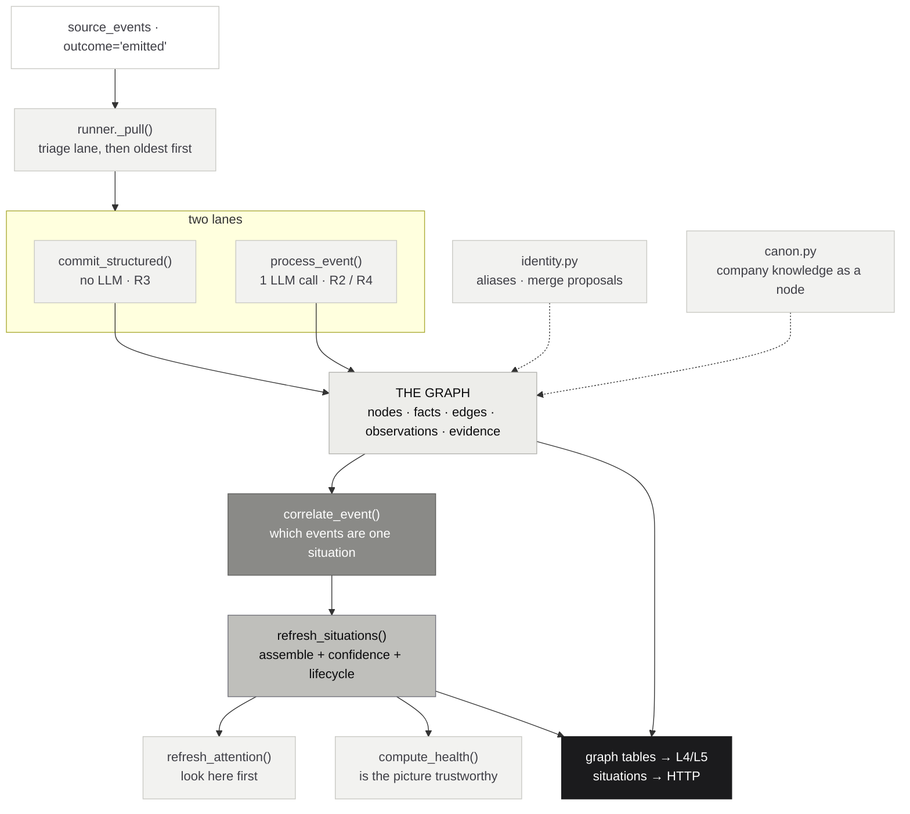

# Layer 2 — Context Intelligence (`context/`)

*The analyst. Layer 1 says what happened; Layer 2 says what is true.*

> **The one question this layer answers: "What is the current reality of the enterprise?"**
>
> It builds and maintains reality. **It never reasons, never prioritises, never recommends.**
> It is allowed to say *"the investor follow-up is overdue."* It is **not** allowed to say
> *"send the update today."* That sentence belongs to Layer 4 and nowhere else.

Four systems each hold a third of the truth. Slack says *"need pricing approval."* Email says
*"customer is waiting."* The calendar holds *"Pricing Review tomorrow."* The CRM says
*Enterprise deal.* A retrieval system stores four documents. Layer 2 stores **one situation
with four pieces of evidence** — and that difference is the whole layer.

---

## §0 · At a glance

| | |
|---|---|
| **Package** | `genios_engine/context/` |
| **Layer number** | 2 — `genios_engine/LAYERS.py` |
| **Size** | 24 files · ~4,290 lines |
| **Input** | rows in `source_events` where `outcome='emitted'` — [see Input](Input-From-Layer-1.md) |
| **Output** | the graph tables, read directly by L4/L5 — [see Output](Output-To-Layer-3-and-4.md) |
| **May import** | `contracts/`, `platform/`, `capture/` (same-or-lower only) |
| **LLM calls** | **exactly one per unstructured event** — a single combined extraction. Zero in the structured lane. Zero in correlation, situations, health, projections and identity. |
| **Migrations** | `0004` · `0028` · `0036` · `0037` · `0038` · `0039` · `0040` |
| **Tables** | 20 — graph · identity · correlation · situations · quality |
| **Status** | feature-complete, 659 tests green — **migrations `0036`–`0040` have never been executed** |

---

## §1 · How to read this folder

The architecture spec divides Layer 2 into five stages. This folder follows that division, and
each sub-folder documents **what the code actually does** at that stage.

| # | Sub-folder | Spec name | Code it documents |
|---|---|---|---|
| — | [**Input**](Input-From-Layer-1.md) | — | the `source_events` seam, both lanes, drain order |
| 01 | [**Enterprise Context Graph**](01-Enterprise-Context-Graph/00-Overview.md) | Enterprise Context Graph · 8 views | `graph_store.py` · `vocabulary.py` · `migrations/0004`, `0028` |
| 02 | [**Graph Engine**](02-Graph-Engine/00-Overview.md) | Graph Engines · 8 components | `identity.py` · `merge.py` · `canon.py` · `health.py` · `backfill.py` |
| 03 | [**Cross-Correlation Engine**](03-Cross-Correlation-Engine/00-Overview.md) | Cross-Correlation · 8 correlators | `correlation.py` |
| 04 | [**Context Quality Engine**](04-Context-Quality-Engine/00-Overview.md) | Context Quality · 8 components | the scoring functions in `situations.py` · `health.py` · `attention.py` |
| 05 | [**Business Situation Engine**](05-Business-Situation-Engine/00-Overview.md) | Candidate Generator + Situation Engine | `situations.py` · `projections.py` · `domain_spec.py` |
| — | [**Output**](Output-To-Layer-3-and-4.md) | `BusinessSituationObject` | what actually crosses, and the gap |

Each sub-folder has its own `00-Overview.md` indexing its leaves. Start there.

> **A note on names.** The spec and the code disagree in several places, and the code wins
> because the code is what runs. There is no `esqe/`-style module boundary here: the "eight
> graph views" are one set of tables queried differently, the "Situation Candidate Generator"
> is `correlation.py`, and the `BusinessSituationObject` is a table nothing downstream reads
> yet. Each sub-folder states its own mapping once, then uses the code's names.

---

## §2 · The pipeline, as it runs

**Per event** (inside one transaction): lane → graph writes → correlation.
**Per drain** (after the batch): read models → attention.
**Per scheduler tick** (hourly-scale, per org): node lifecycle → graph health.

The split matters. Correlation is `O(event)` and belongs in the hot path. Health is
`O(graph)` — running it per event would make every email pay for a whole-tenant scan.

---

## §3 · The six laws

Every one of these is enforced by a test. If a test fails, **the change is wrong, not the
test.** They exist because each was, at some point, violated.

### Law 1 · A label may narrow retrieval. It may never narrow evaluation.

Appears **three times** — attention scores, lifecycle states, projections — and it is the same
trap each time:

> If a quiet entity stopped being evaluated, it would produce no signals, so it would stay
> quiet, so it would stay dormant. **The customer who went silent — exactly the one worth
> noticing — is the one the system would go permanently blind to**, with nothing in the logs.

Enforced by `test_attention.py`, `test_graph_health.py`, `test_projections.py`: no module under
`reason/` may read attention, lifecycle or projections.

### Law 2 · Absence is never negative evidence.

An entity with no dated evidence is not stale — we cannot tell. A new domain with no expected
fields is 100% covered, not 0% known. An empty graph scores 100 "not measured", never 0%
healthy. *A health page that calls fresh accounts broken is one nobody reads.*

### Law 3 · Exact match is the only automatic merge.

No edit distance. No embeddings. No "similar enough". Fuzziness lives in how a name is
**cleaned** (dropping "Inc.", lowercasing), never in how two names are **compared**. A shared
name is a **proposal**; a human decides. *Because two colleagues really do share a name.*

### Law 4 · Nothing repairs itself.

Every integrity check is read-only. An auto-fix that runs unattended turns a small
inconsistency into silent data loss: it deletes the rows it decided were wrong, and nobody
finds out until a decision cannot be explained.

### Law 5 · Nothing is deleted — only archived.

Volume is controlled at Layer 1, where the gate drops noise *before* it becomes an entity.
Anything in the graph has already passed that bar. *An old customer is a dormant relationship,
not a mistake to erase.*

### Law 6 · This layer does not decide.

No priority, no risk score, no recommendation. Building them here would give **two layers an
opinion about the same thing and no way to tell which one was wrong.**

---

## §4 · Where the LLM is allowed

| Stage | LLM? | Why |
|---|---|---|
| Structured lane | **No** | fields are already typed |
| Extraction lane | **Yes — one combined call** | relevance + entities + facts + commitments + questions + observations, in a single request |
| Entity resolution | **No** | exact match only (Law 3) |
| Correlation | **No** | deterministic anchors and windows — same email correlates identically on every replay |
| Situations | **No** | assembly and arithmetic |
| Confidence | **No** | integer formulas |
| Lifecycle | **No** | date comparisons |
| Health | **No** | SQL counts |
| Projections | **No** | a query |

One call, one event. Everything after it is arithmetic — which is why a rebuild produces
byte-identical results and why the extraction cache is safe to reuse.

> **The bug this rule exists to prevent.** Fact confidence *used to be* the model's relevance
> float, which flowed into the pack gate — so a language model's mood decided whether rules
> fired. Confidence is now derived from authority rank; the model's relevance is stored
> separately and may only **rank**, never **gate**.

---

## §5 · The 20 tables

| Group | Tables |
|---|---|
| **Graph** | `graph_nodes` · `graph_facts` · `graph_edges` · `graph_observations` · `graph_source_refs` |
| **Identity** | `graph_aliases` · `source_identity_map` · `merge_proposals` · `merge_history` |
| **Correlation** | `context_correlations` · `context_correlation_members` |
| **Situations** | `context_situations` |
| **Quality** | `discrepancies` · `context_attention` · `context_node_lifecycle` · `graph_health` |
| **Plumbing** | `graph_versions` · `graph_change_outbox` · `context_read_models` · `l2_extraction_results` |

Every one carries `org_id` with an `ON DELETE CASCADE` to `orgs`, proven by
`tests/test_account_erasure.py` — tenant erasure is complete **by schema**, not by an
application list somebody remembers to update.

---

## §6 · Known state, honestly

| | |
|---|---|
| Entity resolution · human-reviewed · reversible | ✅ built |
| Correlation · both lanes | ✅ built |
| Situations · confidence vector · lifecycle | ✅ built |
| Graph health · integrity · lifecycle | ✅ built |
| Projections · zero-code for new domains | ✅ built |
| Company knowledge as a participant | ✅ built |
| **Situations adopted by Layer 4** | ❌ **zero consumers** — [see Output §6](Output-To-Layer-3-and-4.md) |
| **Migrations executed against Postgres** | ❌ **never, not once** |
| Test suite exercises real SQL | ❌ no database in CI |
| Works on pre-existing tenant data | ⚠️ needs `POST /situations/backfill` run once |

> **The failure mode this layer is most exposed to** is not a crash and not a wrong answer. It
> is code that is written, tested, green — **and does nothing.** Three of the eighteen bugs
> found while building Layer 2 were exactly that shape, and the test suite cannot reach a
> database, so it cannot catch the fourth.

---

## §7 · Related reading

| Document | For |
|---|---|
| [`Rohit_Updates/Layer 2.md`](../../Rohit_Updates/Layer%202.md) | the CTO action list — what to run, in order |
| [`System Design/Layer-1-Knowledge-Layer/`](../Layer-1-Knowledge-Layer/00-Overview.md) | where the input comes from |
| [`System Design/Layer-4-Reasoning-Engine/`](../Layer-4-Reasoning-Engine/00-Overview.md) | where the output should go |
