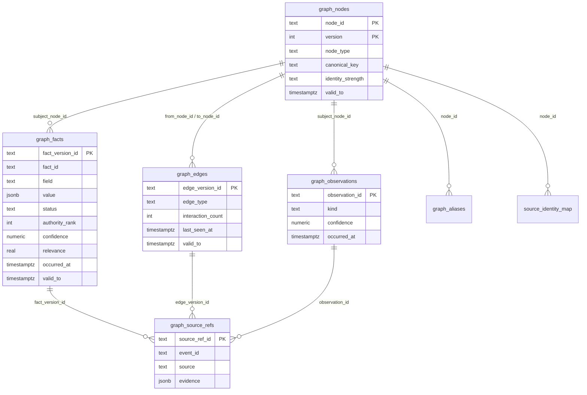
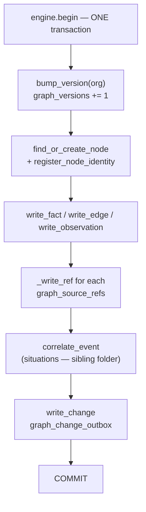

# The Enterprise Context Graph — the data model

*Five tables and one law. Everything Layer 2 knows is one of these rows, and no row exists
without a piece of evidence pointing at the event that produced it.*

> **The one question this folder answers: "What does the system hold, physically, and what
> is each column allowed to mean?"**
>
> Not how situations are built (that is [05-Business-Situation-Engine](../05-Business-Situation-Engine/)),
> not how identity is resolved or merged (that is [02-Graph-Engine](../02-Graph-Engine/)).
> This folder is the **storage contract**: the tables, the keys, the ranks, the statuses,
> the arithmetic that turns a row into a number a rule can read.

The graph stores **facts, not documents**. It holds *"Acme is waiting, 3 days"* — it does not
hold the email. The email is evidence, and evidence lives in exactly one table.

---

## §0 · At a glance

| | |
|---|---|
| **Owning package** | `genios_engine/context/` — the sole writer |
| **Commit layer** | `context/graph_store.py` (309 lines) — *every* graph write goes through it |
| **Tables** | `graph_nodes` · `graph_facts` · `graph_edges` · `graph_observations` · `graph_source_refs` |
| **Supporting** | `graph_aliases` · `source_identity_map` · `merge_proposals` · `merge_history` · `discrepancies` · `graph_versions` · `graph_change_outbox` · `context_read_models` · `context_attention` · `l2_extraction_results` · `llm_costs` |
| **Migrations** | `0004_l2_context_graph.sql` (the model) · `0028_l2_context.sql` (relevance + edge depth + attention) · `0036_l2_entity_resolution.sql` (aliases) · `0040_l2_projection_reads.sql` (the evidence→entity index) |
| **Two write lanes** | `context/pipeline.py` (unstructured — one LLM call) · `context/structured.py` (structured — zero LLM calls) |
| **Transaction shape** | `bump_version` → all writes → `write_change` — **one** `engine.begin()` block |
| **Ever executed against Postgres** | **No.** The SQL in this folder has never run. See §7. |

---

## §1 · The model in one picture



Read it in one sentence: **a node is a thing, a fact is something true of it, an edge is a
tie between two of them, an observation is something that was noticed about it, and every
one of those three points back at the event that justified it.**

---

## §2 · The four laws, quoted from the schema

`migrations/0004_l2_context_graph.sql:2-4` opens with the laws the rest of the model is
built to keep:

```sql
-- Laws: org_id on every table · every fact has provenance · versioned + reversible ·
-- identity deterministic-or-proposed · graph = projection of the L1 event stream.
```

| Law | How the code keeps it | Where it leaks |
|---|---|---|
| **`org_id` on every table** | every table above carries `org_id`; every query in `context/` filters on it; `cache_get` **raises** without one (`graph_store.py:275`) | none found |
| **Every fact has provenance** | `write_fact` / `write_edge` / `write_observation` each call `_write_ref` before returning (`graph_store.py:186, 247, 207`) | the upload-erasure path deletes facts but not their refs — §7 |
| **Versioned + reversible** | facts and edges are closed with `valid_to`, never updated in place; `merge_history` snapshots a merge before it runs | `graph_nodes.version` is **never incremented** — [01-Nodes](01-Nodes-and-Identity.md) |
| **Identity deterministic-or-proposed** | exact-key lookup only; a contested key raises a `merge_proposal` and changes nothing (`identity.py:91-111`) | none found |
| **The graph is a projection of the L1 event stream** | every row carries `created_by_event_id`; nothing is authored inside Layer 2 | derived rows (`context_attention`, `context_read_models`) are rebuilt, not projected |

---

## §3 · One write, end to end

Every commit — both lanes — has the same shape. From `context/pipeline.py:261` and
`context/structured.py:32`:



**Why the version bump is first.** `bump_version` upserts `graph_versions` for the tenant,
which takes a row lock other writers and Layer 4's publication guard contend on
(`tests/test_graph_version_consistency.py`). Bumping first means no reader can observe a
half-written graph under a version number that claims it is complete.

**Why correlation is last.** `pipeline.py:577-586`: *"the last thing in the same
transaction, because a situation must never reference nodes that rolled back."*

---

## §4 · What actually writes each table

| Table | Written by | Never written by |
|---|---|---|
| `graph_nodes` | `graph_store.find_or_create_node` (insert), `merge.py` (close / reopen via `valid_to`) | anything that increments `version` |
| `graph_facts` | `graph_store.write_fact`, `merge._resolve_duplicate_facts` (supersede), `api/upload_routes.delete_upload` (**hard delete**) | any layer above 2 |
| `graph_edges` | `graph_store.write_edge`, `merge.py` (close / dedupe / repoint) | any layer above 2 |
| `graph_observations` | `graph_store.write_observation`, `api/upload_routes.delete_upload` (**hard delete**) | any layer above 2 |
| `graph_source_refs` | `graph_store._write_ref` — the only writer, no exceptions | everything else |
| `graph_aliases` | `identity.record_alias`, `identity.observe_person_name`, `canon.register_canon_node` | — |
| `discrepancies` | `graph_store.write_discrepancy`, called only from the `discrepancy` branch of `write_fact` | — |

Layers 4–6 **read** these tables (`reason/runner.py`, `reason/composer.py`,
`deliver/card_builder.py`, `executive/sweep.py`) and write none of them. That direction is
enforced as a build failure by `tests/test_layer_topology.py`.

---

## §5 · The column census — what the schema promises and the code never fills

This is the most useful table in the folder. Migration `0004` declares a richer model than
the code implements. Nothing below is broken; all of it is **unfilled**, and a reader who
assumes otherwise will write a query that returns nothing forever.

| Column | Declared in | Writers | Readers | Verdict |
|---|---|---|---|---|
| `graph_nodes.version` | 0004:9 | inserted as literal `1`, `graph_store.py:96` | none | **never advances** — nodes are closed, not versioned |
| `graph_nodes.attributes` | 0004:15 | **none in `context/`** | `deliver/card_builder.py:31`, `executive/sweep.py:139` | always `{}`; two readers parse an empty object |
| `graph_nodes.registry_snapshot_hash` | 0004:19 | none | none | dead column |
| `graph_facts.freshness_policy_id` | 0004:51 | none | none | dead column |
| `graph_facts.visibility_scope` | 0004:52 | none (default `'org'`) | none | dead column — flagged for deletion, deliberately not dropped ([Rohit_Updates/Layer 2.md](../../../Rohit_Updates/Layer%202.md) Part 4) |
| `graph_facts.relevance` | 0028:14 | `graph_store.write_fact` on every call | **none, repo-wide** | written, never read — by design, see [02-Facts](02-Facts.md) §5 |
| `graph_source_refs.independence_group` | 0004:90 | none | Layer 4 synthesises `"source:<x>"` instead (`reason/runner.py:104`) | dead column with a live substitute |
| `graph_source_refs.source_field_path` | 0004:88 | none | none | dead column |
| `graph_source_refs.mapping_version` | 0004:92 | none | none | dead column |
| `graph_source_refs.extractor_version` | 0004:91 | hardcoded `"b3-haiku-1"` for **every** ref (`graph_store.py:259`) | none | a constant, including on structured-lane refs where no extractor ran |
| `graph_observations.pack_id` / `pack_version` | 0004:108-109 | none | none | dead columns |
| `graph_facts.status = 'candidate'` | 0004:47 | none | none | the schema's third status is never used; the code uses a **fourth** the schema does not name — `'historical'` |
| `graph_nodes.identity_strength = 'proposed'` | 0004:14 | none | `read_models`, `api/routes.py:1022` pass it through | every node L2 creates is `'strong'` |

> **The spec's model is wider than the running one.** Where a column has no writer, this
> folder says *"dead column"* and moves on. **The code wins because the code is what runs** —
> and a doc that describes `independence_group` as if it were populated would send an
> engineer looking for a corroboration bug that is really a design that took a different
> route.

---

## §6 · Worked example — one email, every row it creates

Inbound Gmail message, `event_id = evt_9`, from `priya+cal@Acme.IO` to `rohit@ourco.com`,
`occurred_at = 2026-08-06T09:00Z`, body contains *"we've shortlisted you and one other
vendor"*, LLM `relevance = 0.72`, `noise_type = "none"`, one observation
`{"kind": "other_vendor", "evidence_text": "one other vendor"}`.

| # | Table | Row (abbreviated) | Produced by |
|---|---|---|---|
| 1 | `graph_versions` | `graph_version += 1` | `bump_version` |
| 2 | `graph_nodes` | `node_type=person`, `canonical_key=priya@acme.io`, `identity_strength=strong` | `_person()` → `find_or_create_node` |
| 3 | `graph_aliases` | `(email, priya@acme.io) → that node` | `register_node_identity` |
| 4 | `graph_nodes` | `node_type=company`, `canonical_key=acme.io` | `_works_at()` |
| 5 | `graph_aliases` | `(domain, acme.io)`, `(company_name, acme)` | `alias_keys_for_node` |
| 6 | `graph_edges` | `person -works_at-> company`, `confidence=0.9`, `authority_rank=2`, `interaction_count=1` | `_works_at()` |
| 7 | `graph_source_refs` | ref → the edge version, `evidence={"derived":"email domain","domain":"acme.io"}` | `_write_ref` |
| 8 | `graph_facts` | `thread.last_inbound = "2026-08-06T09:00:00+00:00"`, rank 2, **confidence 0.85**, relevance 0.72 | `pipeline.py:520` |
| 9 | `graph_facts` | `thread.ball_in_court = "us"`, rank 2, confidence 0.85 | `pipeline.py:527` |
| 10 | `graph_observations` | `kind="competitor"` (normalised from `other_vendor`), `confidence=0.72` | `norm_obs_kind` + `write_observation` |
| 11 | `graph_observations` | `kind="email_relevance"`, `evidence={"relevance":0.72,...}` | `pipeline.py:504` |
| 12 | `graph_source_refs` | one ref per fact and per observation | `_write_ref` |
| 13 | `graph_change_outbox` | `{"nodes":2,"edges":1,"facts":2,"observations":2,...}` | `write_change` |

Note rows 8–9 and 10–11: **facts take a deterministic confidence from the authority rank;
observations take the LLM's relevance as their confidence.** That asymmetry is deliberate
and is argued in [02-Facts](02-Facts.md) §5 and [04-Observations](04-Observations.md) §4.

---

## §7 · Gaps — what is wrong at the storage level

| # | Problem | Severity |
|---|---|---|
| 1 | **None of this SQL has ever executed.** No database in the test suite. Column names, types and semantics are unverified; the logic is not. | **blocking** |
| 2 | **Deleting an upload leaves orphan evidence.** `api/upload_routes.py:261-264` deletes `graph_facts` and `graph_observations` for the file's events but **not** `graph_source_refs`. The refs survive, pointing at `fact_version_id`s that no longer exist — and `health.py` has no check for a ref without a fact (only the reverse). | high |
| 3 | **`fact_id` is regenerated on every version.** `graph_store.py:184` passes `new_id("fact")` on every insert, while the schema says `fact_id` is *"stable across versions"* (`0004:39`). Layer 4's `src_count` subquery joins on `fact_id`, so corroboration history does not survive a supersede. | medium |
| 4 | **`graph_nodes_by_key` is not unique.** Two workers processing two events for the same new sender can both miss the `select … limit 1` in `find_or_create_node` and both insert. The alias table's primary key catches it *afterwards*, as a merge proposal — the duplicate is detected, not prevented. | medium |
| 5 | **No index on `graph_edges.to_node_id`.** `graph_edges_current` covers `(org_id, from_node_id, edge_type)` only, but every reverse traversal — `api/routes.py:1004`, `reason/runner._neighbor_index` — reads the other direction. | medium |
| 6 | **`replay=True` has no caller.** The mode is implemented and frozen by `tests/test_fact_write_guard.py`, and nothing in the repo passes it. Backfill re-derives aliases, correlations and situations; it never re-writes facts. | low |

---

## §8 · The leaves

| # | Document | Answers |
|---|---|---|
| 01 | [**Nodes and Identity**](01-Nodes-and-Identity.md) | What a node is, how a `canonical_key` is minted per type, why every node is `strong`, and why `version` never advances |
| 02 | [**Facts**](02-Facts.md) | `authority_rank` R1–R4, `FACT_CONF_BY_RANK`, the five outcomes of `fact_write_action`, and the relevance/confidence split with the arithmetic that motivated it |
| 03 | [**Edges**](03-Edges.md) | The five edge types that actually exist, direction canonicalisation, and `interaction_count` — the relationship-depth substrate that nothing yet consumes |
| 04 | [**Observations**](04-Observations.md) | `_OBS_CANON` (81 entries → 31 kinds), the polarity vocabulary, the two dead polarity entries, and who reads which kind |
| 05 | [**Evidence**](05-Evidence.md) | `graph_source_refs` — the law that nothing exists without evidence, the evidence payloads by call site, and the spans the schema promised and nobody writes |
| 06 | [**The Eight Views**](06-The-Eight-Views.md) | The spec's eight graph views mapped onto real tables: which are real, which are emergent, which do not exist |

---

## §9 · The one thing to fix first

**Run the migrations.** Every finding in §7 except #1 was found by reading; #1 can only be
found by connecting. Layer 2's characteristic failure is code that is *written, tested,
green, and does nothing* — and the storage layer is where that failure is cheapest to
catch and most expensive to miss.
