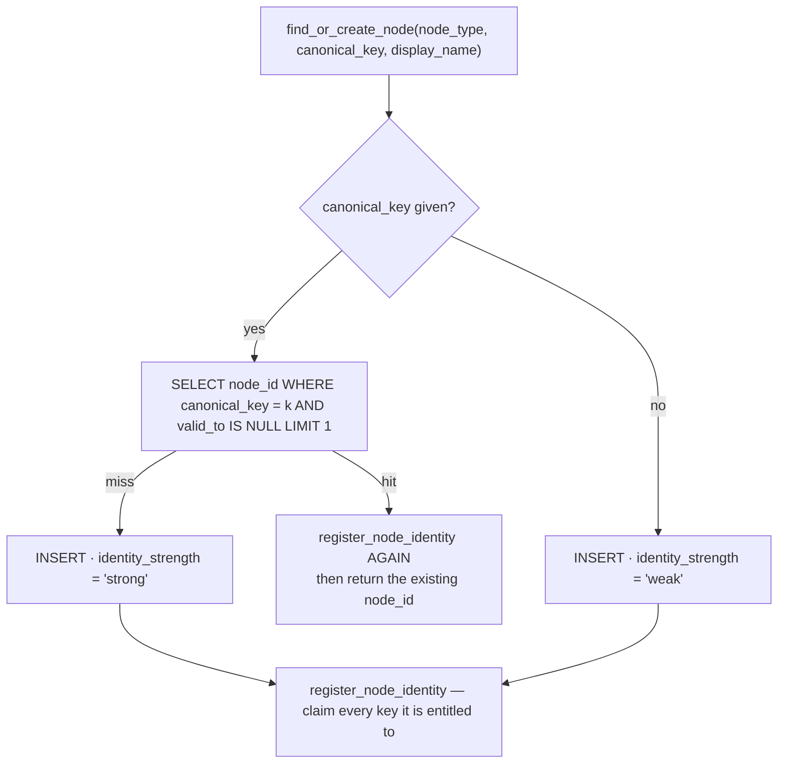
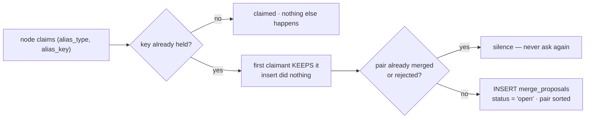

# Nodes and Identity — `graph_nodes`

*A node is a thing the business can be said to have a relationship with. Everything else in
the graph hangs off one.*

> **What this file answers:** what a node is · how its `canonical_key` is minted, per type ·
> what `identity_strength` really contains · what `version` was for and why it never moves ·
> how a node becomes findable by a name someone typed.

---

## §1 · What it is for

The graph needs one row per real thing, and the same real thing must land on the same row
however it arrived. `priya+cal@Acme.IO` in a calendar invite and `priya@acme.io` in an email
signature are **one person**, or every cross-tool rule in Layer 4 is reasoning about
strangers.

That is the whole job of this table: **one row per thing, reached deterministically.**

Everything reason-worthy about the thing lives in [`graph_facts`](02-Facts.md). The node
itself carries only identity and a display name — the *facts-versus-props* split stated in
`migrations/0004_l2_context_graph.sql:5-6`.

---

## §2 · What exists

### 2.1 The table

`migrations/0004_l2_context_graph.sql:7-24`

```sql
create table if not exists graph_nodes (
    node_id                text not null,
    version                int  not null default 1,
    org_id                 text not null,
    node_type              text not null,               -- person | company | deal | meeting | ...
    canonical_key          text,                        -- deterministic identity key
    display_name           text,
    identity_strength      text not null default 'weak',-- strong | weak | proposed
    attributes             jsonb not null default '{}',
    valid_from             timestamptz not null default now(),
    valid_to               timestamptz,
    created_by_event_id    text,
    registry_snapshot_hash text,
    primary key (node_id, version)
);
create index graph_nodes_by_org  on graph_nodes (org_id, node_type);
create index graph_nodes_by_key  on graph_nodes (org_id, canonical_key);
create index graph_nodes_current on graph_nodes (org_id, node_id) where valid_to is null;
```

**`graph_nodes_by_key` is not unique.** That matters — see §6.

### 2.2 The node types that actually get created

There is no enum and no registry. A node type is whatever string a writer passes. These are
the ones the running code can produce:

| `node_type` | Minted by | `canonical_key` | Example key |
|---|---|---|---|
| `person` | `pipeline._person`, mention loop, structured relations | `platform.identity.norm_email(email)` | `priya@acme.io` |
| `company` | `pipeline._works_at` | the work domain, lowercased | `acme.io` |
| `commitment` | `pipeline.py:550` | `commitment:` + sha1(subject + normalised text + due date)[:20] | `commitment:527c8e8089963e8d9e86` |
| `deal` | `structured.commit_structured` via `hubspot.deal.v1` | `"{source}:{source_object_id}"` | `hubspot:8801` |
| `meeting` | `gcal.event.v1` | `"{source}:{source_object_id}"` | `gcal:abc123` |
| `subscription` | `stripe.subscription.v1` | `"{source}:{source_object_id}"` | `stripe:sub_9` |
| `product_account` | `postgres.customer_accounts.v1` | `"{source}:{source_object_id}"` | `postgres:AC-42` |
| the 12 canon kinds<br/>(`policy`, `sop`, `pricing`, `product`, `goal`, `kpi`, `org_structure`, `employee_profile`, `project`, `task`, `asset`, `wiki`) | `canon.register_canon_node` | `internal:{kind}:{knowledge_key}` | `internal:policy:refund-policy` |

`pipeline._NODE_TYPES` (`pipeline.py:85`) lists `person · company · deal · meeting ·
commitment · thread · document · agent` — but it governs **only the label on a
`mention:<type>` observation**, not what may become a node. `thread`, `document` and `agent`
nodes are never created by any writer in the repo.

### 2.3 The identity substrate

Three tables, three different jobs:

| Table | Question it answers | Uniqueness |
|---|---|---|
| `graph_nodes.canonical_key` | *"is this thing already here?"* | **none enforced** — a plain index |
| `graph_aliases` (`0036`) | *"is anything already called this?"* | `primary key (org_id, alias_type, alias_key)` — the conflict **is** the signal |
| `source_identity_map` (`0004:27`) | *"which node is provider X's object Y?"* | `primary key (org_id, source, source_object_id)` |

`source_identity_map` is written only by the structured lane
(`structured.py:39` → `graph_store.map_identity`) and **read by nothing**. Its content is
already recoverable from `canonical_key = "{source}:{object_id}"`, which is how every reader
actually finds those nodes.

---

## §3 · How it works

### 3.1 `find_or_create_node` — the only door

`context/graph_store.py:76-105`



Two things in that flow are load-bearing.

**Re-registering on every sighting.** A hit does not return immediately; it re-runs
`register_node_identity` first (`graph_store.py:86-90`). The comment states the reason
precisely:

> *"a node's display name usually arrives AFTER its anchor did (an email gives you acme.io
> today and the words 'Acme Technologies' next week), and that later name is exactly the key
> a prose mention needs to find it by."*

Without it, the alias `company_name → "acme technologies"` would only ever be claimed if the
very first email carrying that company also carried its full name.

**The first claimant keeps a contested key.** `identity.record_alias` inserts with
`on conflict do nothing`, then re-reads the holder. If the holder is someone else, it returns
that other node id and the caller raises a proposal (`identity.py:102-111`,
`identity.py:164-192`). Nothing is overwritten, so lookups stay stable while a human decides.

### 3.2 Where a `canonical_key` comes from

Every key-minting function lives in `platform/identity.py` — *one* definition, imported
downward by every layer, so the structured lane and the extraction pipeline cannot drift.

| Function | Rule | `"Priya+cal@Acme.IO"` → | `"Acme Technologies Pvt Ltd"` → |
|---|---|---|---|
| `norm_email` | lowercase, trim, drop a `+tag` from the local part | `priya@acme.io` | — |
| `company_slug` | strip non-alphanumerics, lowercase, drop legal-form tokens — **but never all of them** | — | `acme technologies` |
| `domain_root` | the label before the public suffix, with a 16-entry compound-TLD list | `acme.io → acme`, `mail.acme.co.uk → acme` | — |
| `person_name_key` | lowercase, collapse whitespace, strip punctuation | `"Rohit  S." → rohit s` | — |

`company_slug("Co")` returns `"co"`, not `""`: `identity.py`'s comment — *"trimming a
one-word name to nothing would make every such company collide."* The implementation is
`kept or words` (`platform/identity.py:62`), i.e. if stripping suffixes empties the name, the
unstripped words are kept.

**The `+tag` rule is not cosmetic.** `platform/identity.py:4-9` records the bug it fixes: the
structured lane lowercased only, the extraction pipeline also stripped `+tags`, so
`priya+cal@x.com` (calendar) and `priya@x.com` (email) became two people.
`tests/test_identity_parity.py::test_plus_tag_strips_identically_in_both_lanes` freezes it.

### 3.3 The alias namespaces

`context/identity.py:41-55` — five types, and the separation between them is the design.

| `alias_type` | Derived from | Claimed by | Strength |
|---|---|---|---|
| `email` | a person's `canonical_key` | `alias_keys_for_node` | **strong** — proves identity alone |
| `domain` | a company's `canonical_key` | `alias_keys_for_node` | **strong** |
| `company_name` | the domain root **and** the display-name slug | `alias_keys_for_node` | weak |
| `person_name` | an observed name next to a real anchor | `observe_person_name` | weak — never anchors |
| `canon` | a canon document's title | `canon.register_canon_node` | weak — **its own namespace** |

Worked output of `alias_keys_for_node(node_type="company", canonical_key="acme.io",
display_name="Acme Technologies")`:

```python
[("domain", "acme.io", "anchor"),
 ("company_name", "acme", "anchor"),
 ("company_name", "acme technologies", "anchor")]
```

Three keys, one node. The second is what lets *"how did the Acme call go?"* in an email body
reach a company node that was only ever built from an email domain.

**A person's name is deliberately absent from that list** (`identity.py:64-67`): *"'Rohit S.'
anchors nothing on its own, and minting it as a lookup key would make every future Rohit
collide with this one."* Person names are recorded by `observe_person_name` with
`origin='observed'`, and a collision on one **never** raises a proposal.

**`canon` having its own namespace** is what stops a project called "Acme" from contending
with the customer called "Acme". Different `alias_type` → different primary key → no
collision → no false proposal. The pipeline then checks the company branch **before** the
canon branch (`pipeline.py:405` vs `pipeline.py:415`) so that when a name genuinely could
mean either, the customer wins — *"its alias is derived from a real email domain, which is
harder evidence than a title someone typed."*

### 3.4 What a collision does



`propose_merge` (`identity.py:134-161`) sorts the pair before inserting so `(A,B)` and
`(B,A)` are one proposal, and migration `0036` adds
`unique index merge_proposals_unique_open … where status = 'open'` so the same duplicate is
proposed once, not once per email. A pair already `merged` or `rejected` short-circuits at
`identity.py:147-152`.

The proposal's `evidence` records which alias type collided and whether it was `strong`
(`email`/`domain`) or `weak` — so a reviewer can tell *"two rows share an email address"*
from *"two rows share a slug."*

---

## §4 · The three columns that do not mean what they say

### 4.1 `identity_strength` is always `'strong'`

```python
"st": "strong" if canonical_key else "weak"        # graph_store.py:98
```

Every writer in `context/` passes a `canonical_key`: `_person` passes the normalised email,
`_works_at` the domain, the commitment path a sha1 key, `register_canon_node` an
`internal:…` key, `commit_structured` a `source:object_id`. **No call site can produce
`'weak'`, and nothing ever writes `'proposed'`** — the schema's third value has no writer at
all. The column is read and displayed (`read_models.py:36`, `api/routes.py:1022`) as though
it varied.

### 4.2 `version` never advances

The primary key is `(node_id, version)`, and the only insert hardcodes `1`:

```sql
insert into graph_nodes (node_id, version, org_id, …) values (:id, 1, :o, …)
```

Nothing anywhere increments it. What the code actually does instead is **close and reopen**:

- `merge.py:275` — `update graph_nodes set valid_to = now()` retires the merged node
- `merge.py:334` — `update graph_nodes set valid_to = null` reverses that

> **The spec's model is bitemporal nodes. The code's model is one row per node with a
> lifetime.** The code wins because the code is what runs — but the `(node_id, version)`
> primary key is a real trap: writing a second version by hand would be accepted by
> Postgres and then double-counted by every `where valid_to is null` query, which does not
> filter on version.

### 4.3 `attributes` is always `{}`

Declared as *"flat display props (not versioned facts)"* (`0004:15`). No module under
`context/` writes it. Two modules **read** it — `deliver/card_builder.py:31` and
`executive/sweep.py:139` — and both parse an object that is empty in every row.

---

## §5 · Worked example — one human, three arrivals

| Day | Arrives as | Lane | Key computed | Result |
|---|---|---|---|---|
| Mon | Gmail sender `Priya+cal@Acme.IO` | unstructured | `norm_email` → `priya@acme.io` | node created, `strong`; aliases `(email, priya@acme.io)`; company `acme.io` created; aliases `(domain, acme.io)`, `(company_name, acme)` |
| Tue | Calendar attendee `priya@acme.io`, displayName `"Priya Nair"` | structured | `apply_relations` → `norm_email` → `priya@acme.io` | **same node** found by `canonical_key`; `register_node_identity` re-runs; nothing new claimed (person names are not anchor keys) |
| Wed | Email body: *"Priya at Acme Technologies confirmed"* | unstructured mention loop | mention has a name, no email → not a person anchor. `resolve_company_mention(company_slug("Acme Technologies"))` → `"acme technologies"` | alias miss on Monday's node → **no company node created**; falls through to a `mention:company` observation on the sender |

That third row is the anchor rule doing exactly what it is supposed to do — and it is also
the case for the strongest argument in `find_or_create_node`: had any earlier email carried
the display name `"Acme Technologies"` for the `acme.io` node, the re-registration on
sighting would have claimed `(company_name, acme technologies)` and Wednesday's mention would
have landed on the real company instead.

---

## §6 · Edge cases and failure modes

| Case | Behaviour | Where |
|---|---|---|
| **Personal mailbox domain** | `_company_domain` returns `None` for `gmail.com`, `outlook.com`, `yahoo.com`, `icloud.com`, `proton.me`, … so no `gmail.com` company is ever created | `pipeline.py:91-97`, `capture/structured/apply.py:10` |
| **Malformed email** | `norm_email` returns `None`; `_person` falls back to `email.strip().lower()` as the key — a malformed address still creates a node, under a non-canonical key | `pipeline.py:275` |
| **Noise sender** | newsletter / automated / spam → **no person node at all**; the event stays in the L1 ledger | `pipeline.py:327` |
| **Bulk blast** | more than `_BULK_RECIPIENTS = 10` recipients → zero recipient nodes; otherwise capped at `_MAX_RECIPIENTS = 25` | `pipeline.py:342` |
| **Anchorless mention** | a person with no email, or any product/tool/system name → a `mention:<type>` observation on the sender, and the name is mapped to the sender so its facts still land somewhere anchored | `pipeline.py:438-446` |
| **Two workers, one new sender** | both miss the `select … limit 1`, both insert → two nodes with the same `canonical_key`. Caught afterwards by the alias primary key as a merge proposal, not prevented | `graph_store.py:80-98` |
| **A 30-chunk pricing PDF** | keyed on the file (`knowledge_key`), not the chunk — otherwise thirty "Pricing" nodes each holding a slice of one document | `canon.canon_key`, `pipeline.py:319-322` |

---

## §7 · The rules, and what enforces them

| Rule | Enforced by |
|---|---|
| Exact key equality is the only automatic merge | `identity.resolve_alias` is a single `where alias_key = :k` — there is no other comparison in the module |
| One canonical email definition for the whole system | `tests/test_identity_parity.py::test_one_definition_everywhere` |
| Calendar attendees merge with email-derived people | `tests/test_identity_parity.py::test_calendar_attendees_still_merge` |
| A CRM deal reaches its contacts as people | `tests/test_identity_parity.py::test_hubspot_deal_bridges_to_people` |
| Malformed input never mints a key | `tests/test_identity_parity.py::test_malformed_input_never_mints_a_key` |
| A merged node is closed, never deleted | `tests/test_l2_completeness.py::test_reversing_restores_the_graph_and_rebuilds_the_derived_views` |

---

## §8 · Where to go next

- Facts about a node → [02-Facts](02-Facts.md)
- Ties between nodes → [03-Edges](03-Edges.md)
- The merge machinery that consumes a proposal → [02-Graph-Engine](../02-Graph-Engine/)
