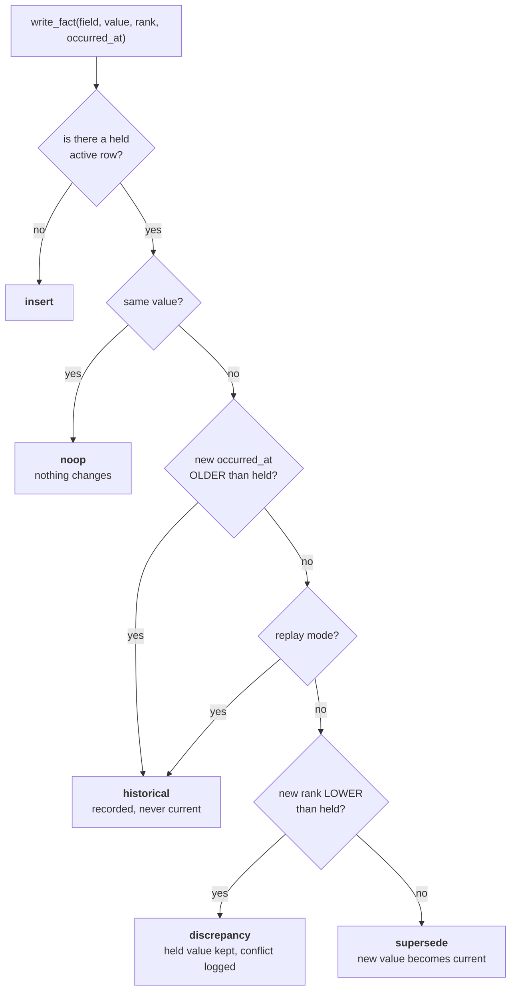

# Facts — the current truth, and how it changes

*`graph_facts` · `graph_store.py:fact_write_action` · `graph_store.py:write_fact`*

> A node says an entity exists. A **fact** says something about it that can change, be
> disagreed with, go stale, or be wrong. Every reason-worthy thing Layer 2 knows is a fact.

---

## §1 · What a fact is for

Two kinds of information hang off a node, and conflating them was an early mistake worth
naming:

| | Where it lives | Example | Rule |
|---|---|---|---|
| **Display property** | `graph_nodes.attributes` (jsonb) | an avatar URL, a formatted title | never versioned, never reasoned over |
| **Fact** | `graph_facts` (a row) | `deal.stage = "negotiation"` | versioned, evidenced, authority-ranked |

The test: *could two sources disagree about this, and would that disagreement matter?* If yes,
it is a fact and it needs provenance. If no, it is a property.

---

## §2 · What exists

```sql
create table graph_facts (
    fact_version_id   text primary key,   -- this VERSION
    fact_id           text not null,      -- stable across versions — the "same fact"
    org_id            text not null,
    subject_node_id   text not null,      -- what it is about
    field             text not null,      -- 'deal.stage', 'thread.ball_in_court', …
    value             jsonb not null,
    value_type        text not null default 'string',
    status            text not null default 'active',  -- active | superseded | historical
    authority_rank    int  not null default 1,          -- R1..R4
    confidence        numeric(4,3) not null default 0.5,
    relevance         real,               -- added 0028 — the model's interest score
    occurred_at       timestamptz,        -- WORLD time
    valid_from        timestamptz not null default now(),
    valid_to          timestamptz,        -- null = current
    created_by_event_id text,
    ...
);
create index graph_facts_current on graph_facts (org_id, subject_node_id, field)
    where valid_to is null and status = 'active';
```

**One active row per `(subject_node_id, field)`.** Readers take `limit 1`, so two active rows
for one field means "the truth" becomes whichever row the planner returns first. Nothing in
Postgres enforces this — it is maintained by the write rules below, repaired by
`merge.py:_resolve_duplicate_facts`, and audited by the `duplicate_active_fact` health check.

### The two clocks, never merged

| Column | Means | Used for |
|---|---|---|
| `occurred_at` | when it was true **in the world** | ordering, staleness, freshness |
| `valid_from` / `valid_to` | when **we believed it** | history, "what did we know on 1 June?" |

Merging these is the classic bi-temporal bug: a backfilled 2024 email would look like it
happened today.

---

## §3 · Authority — R1 to R4

`authority_rank` answers *"how much should this source be believed?"* — not how confident the
model was.

| Rank | Source | Written by | Confidence |
|---|---|---|---|
| **R4** | company canon — the org asserting something about itself | `pipeline.py` when `internal_kind` is set | **1.00** |
| **R3** | system of record — CRM, calendar, billing, client DB | `structured.py:commit_structured` | **0.90** |
| **R2** | evidence-backed extraction — quoted from a real message | `pipeline.py` extraction lane | **0.85** |
| **R1** | weak inference | (default; rarely written) | **0.40** |

```python
FACT_CONF_BY_RANK = {4: 1.00, 3: 0.90, 2: 0.85, 1: 0.40}   # pipeline.py:71
```

### Why R2 is 0.85 and not 0.70

A rank-2 fact has already passed the **B4 evidence guard** — the extraction quoted a verbatim
substring of the source. So we *know* the source said it; only the interpretation carries risk.

The first draft used 0.70, chosen by feel. Combined with the pack's impact floor, that put the
**entire email-derived corpus permanently below the firing gate** — every rule silently dead.
`tests/test_corpus_can_fire.py` now locks the property so a future edit to this table cannot
kill the rules again.

### Why R4 sits above R3

When the company writes down its own refund policy and a billing system implies something
different, the company's deliberate statement should win. The two rarely describe the same
*field* anyway — canon says list price, Stripe says what one customer was charged — and when
they do collide, the loss is recorded as a `discrepancies` row rather than resolved by luck.

---

## §4 · Confidence vs relevance — the split that saved the rules

Migration `0028` added a `relevance` column, and the reason is the sharpest example in this
layer of the *"the model extracts, it never decides"* rule.

**Before:** fact confidence *was* `ex.relevance` — a float the LLM produced. That flowed into
the pack engine's `ext_conf` → `C` → the `c_min` gate. **A language model's mood decided
whether signals fired.**

**Now:**

| Column | Comes from | May |
|---|---|---|
| `confidence` | `FACT_CONF_BY_RANK[authority_rank]` — deterministic | **gate** |
| `relevance` | the model's interest score | **rank**, never gate |

Same source, same rank, same confidence — every time, including on replay.

---

## §5 · How a write is decided

`fact_write_action` is a **pure function** — no database, fully tested — and the order of its
checks is load-bearing.



### Rule 1 · Staleness is checked BEFORE authority

The load-bearing line. Without it, any backfill or re-extract replays a 2024
`thread.ball_in_court = us` over today's `them`, and the correct value is already stamped
`superseded` — **an unrecoverable corruption.**

Checking staleness first also means replaying old low-rank mail does not spray discrepancies
against current system-of-record values.

### Rule 2 · `replay=True` may fill a gap, never flip a state

Belt and braces for deliberate reprocessing. A replay can insert a fact that was missing; it
can never change one that is active, regardless of timestamps.

### Rule 3 · A lower-authority disagreement is recorded, not applied

`discrepancy` keeps the held value and writes a `discrepancies` row. The conflict becomes a
**product signal** — visible, queryable, resolvable — rather than a silent overwrite.

---

## §6 · Worked examples

**A · A CRM stage change**
Held: `deal.stage = "proposal"` R3, occurred 1 Aug. New: `"negotiation"` R3, occurred 5 Aug.
→ not same · not older · not replay · not lower rank → **supersede**. Old row `valid_to = now()`.

**B · An email contradicts the CRM**
Held: `deal.stage = "closedwon"` R3, 5 Aug. New: extraction says `"negotiation"` R2, 6 Aug.
→ newer, but **lower rank** → **discrepancy**. CRM value stays; a conflict row appears; the
situation's `consistency` confidence drops from 100 to 66.

**C · The company's own pricing beats billing**
Held: `pricing.list = "249"` R3 (Stripe). New: `"299"` R4 (uploaded price list), newer.
→ higher rank, newer → **supersede**. Canon wins, as designed.

**D · A backfill delivers a 2024 email**
Held: `thread.ball_in_court = "them"` R2, occurred yesterday. New: `"us"` R2, occurred Mar 2024.
→ **historical**. Recorded with full provenance; current state untouched. *This is the rule
that makes backfill safe to run.*

---

## §7 · Edge cases

| Case | Behaviour | Why |
|---|---|---|
| Same value re-asserted | `noop` | no new version, no churn — a re-sync must not inflate history |
| Both `occurred_at` null | staleness check skipped → falls through to authority | nothing to compare |
| Equal ranks, newer value | `supersede` | recency breaks the tie |
| Fact on a node closed by a merge | repointed to the survivor | `merge.py:_NODE_REFERENCES` |
| Two active rows for one field | **invariant violation** | repaired at merge; counted by the `duplicate_active_fact` health check |

---

## §8 · The field vocabulary is a contract

`field` is a **string matched literally** by pack rules in Layer 3/4.

| Field | Written by | Read by |
|---|---|---|
| `deal.stage` · `deal.amount` · `deal.close_date` · `deal.title` | `structured.py` via `hubspot.deal.v1` | pack rules, situation lifecycle |
| `thread.ball_in_court` · `thread.last_inbound` · `thread.last_outbound` | `pipeline.py` | attention, `unanswered_email` |
| `commitment.due_at` | `pipeline.py` | attention, commitment rules |
| `meeting.*` · `subscription.*` · `product_account.*` | `structured.py` | pack rules |

> **The sharpest edge in Layer 2.** Rename `deal.stage` and nothing raises. The rules simply
> stop firing — quietly, with green tests. Treat these strings as a public API.

---

*Related: [Evidence](05-Evidence.md) · [Confidence Vector](../04-Context-Quality-Engine/01-Confidence-Vector.md) · [Conflict Detection](../04-Context-Quality-Engine/03-Conflict-Detection.md)*
