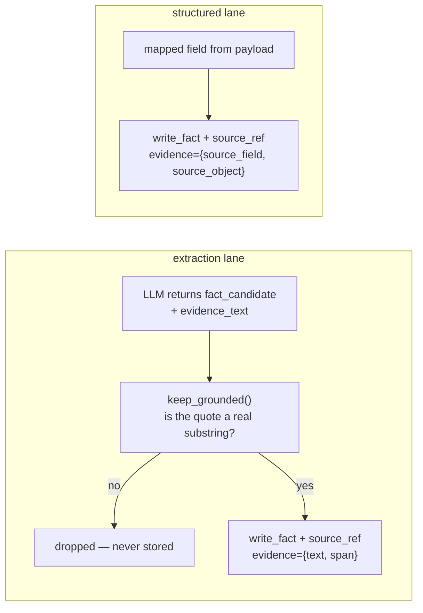

# Evidence — nothing is true just because it is written down

*`graph_source_refs` · the law that everything else in Layer 2 depends on*

> **The law:** every fact, every edge and every observation traces back to an exact Layer 1
> event and, where possible, the exact span of text that proves it.
>
> A claim without provenance is a guess wearing a confidence score.

---

## §1 · What it is for

Three things become impossible without it, and each one is fatal on its own:

| Without evidence | The consequence |
|---|---|
| **Explaining a decision** | A card says "Acme has gone quiet." The founder asks *"says who?"* and there is no answer. Trust is spent once. |
| **Correcting a wrong fact** | You can see the value is wrong. You cannot see which email produced it, so you cannot fix the cause. |
| **Deleting a tenant's data** | An event is purged but the facts it produced survive, unattributed and unreachable. |

There is a fourth, quieter one: **evidence is what makes confidence honest.** A situation's
`evidence` dimension counts distinct events and distinct *sources*. Without source refs, three
systems independently agreeing is indistinguishable from one system repeating itself.

---

## §2 · What exists

```sql
create table graph_source_refs (
    source_ref_id     text primary key,
    org_id            text not null,
    fact_version_id   text,        -- exactly one of these three is set
    edge_version_id   text,
    observation_id    text,
    event_id          text not null,     -- → source_events. ALWAYS present.
    source            text,              -- 'gmail', 'hubspot', 'upload', 'internal'
    source_object_id  text,
    source_field_path text,              -- which field of the payload, for structured
    evidence          jsonb not null default '{}',   -- {span, text, page, bbox}
    independence_group text,             -- see §5
    extractor_version text,
    mapping_version   text,
    created_at        timestamptz not null default now()
);
create index source_refs_by_fact  on graph_source_refs (org_id, fact_version_id);
create index source_refs_by_event on graph_source_refs (org_id, event_id);
```

`event_id` is **not nullable**. That is the law expressed in the schema: there is no way to
record a claim without saying where it came from.

### The evidence blob

| Key | For | Example |
|---|---|---|
| `text` | the verbatim quoted substring | `"we can look at this after the 15th"` |
| `span` | character offsets into the prepared text | `[412, 448]` |
| `derived` | a fact computed rather than quoted | `"email domain"`, `"we replied"` |
| `internal_kind` | canon facts — which kind of company statement | `"pricing"` |
| `source_field` / `source_object` | structured lane — which payload field | `"dealstage"` |

---

## §3 · How it works — the two lanes leave different receipts



### The B4 grounding guard

`context/guard.py:keep_grounded` is the anti-hallucination gate. A fact candidate survives only
if its `evidence_text` is a **genuine substring** of the source content.

This is why R2 is worth 0.85 (see [Facts §3](02-Facts.md)): we are not trusting that the model
was right — we are checking that the source actually said the words.

Facts that fail grounding are **dropped, not stored at low confidence.** A hallucinated claim
with a bad score is still in the graph, and something downstream will eventually surface it.

### Derived facts still carry evidence

Not everything is a quote. `thread.ball_in_court = "them"` is computed from the fact that we
replied. It carries `evidence = {"derived": "we replied"}` — which is honest: it names the
inference rather than pretending to a quotation.

---

## §4 · Worked example

An email from `john@acme.io`:

> *"Thanks — we've got budget approved for this, but I need to loop in our security team before
> we can sign anything."*

| Artifact | Evidence recorded |
|---|---|
| node `person:john@acme.io` | `created_by_event_id = evt_8f2a` |
| edge `works_at → acme.io` | `{"derived": "email domain", "domain": "acme.io"}` |
| observation `budget_approved` | `{"text": "we've got budget approved for this"}` |
| observation `security_review_started` | `{"text": "loop in our security team"}` |
| fact `thread.ball_in_court = "us"` | `{"derived": "inbound event"}` |

Six months later the founder asks why the deal was flagged as needing a security review. The
answer is one join: observation → source_ref → event → the sentence, verbatim, with its date.

---

## §5 · `independence_group` — the corroboration trap

A column that exists to prevent a specific illusion.

Three emails in one thread all mentioning a budget are **not** three independent confirmations —
they are one person saying the same thing three times. Counting them as three would inflate
confidence exactly where it should not.

`independence_group` marks refs that share an origin so they can be collapsed when corroboration
is counted. The same instinct drives the situation `evidence` formula, which weights **distinct
sources** (60 points) far above **volume** (40):

```python
volume        = min(40, event_count  * 8)     # 20 emails in one thread → 40
corroboration = min(60, source_count * 25)    # email + CRM + calendar   → 60
```

An email plus a CRM record plus a calendar invite are three systems independently agreeing.
Twenty emails in one thread are one person's account of events.

---

## §6 · Edge cases

| Case | Behaviour |
|---|---|
| Fact with no source ref | **an integrity violation** — counted by the `fact_without_evidence` health check, which drives the `evidence` health dimension |
| Event purged by retention | the ref survives with its `event_id`; the quoted text may no longer be retrievable. Provenance outlives the payload by design |
| Merge repoints a fact | the ref follows the `fact_version_id` — evidence is never re-attributed |
| Merge reversed | refs move back with their facts (`merge.py` snapshots record the exact ids) |
| Cached extraction reused | a *new* source ref is written for the new event. Two events quoting identical text are two pieces of evidence, not one |
| Structured lane, no quotable text | `evidence = {source_field, source_object}` — the field name IS the provenance |

---

## §7 · How to check the law is holding

```sql
-- should always be 0
select count(*) from graph_facts f
where f.org_id = :o and f.valid_to is null and f.status = 'active'
  and not exists (select 1 from graph_source_refs r
                  where r.org_id = f.org_id and r.fact_version_id = f.fact_version_id);
```

This is exactly the `fact_without_evidence` check in `health.py:_INTEGRITY_CHECKS`, surfaced
as the `evidence` dimension of `GET /api/org/{org}/graph/health`. If it is not 100, something
is writing facts without receipts and the whole trust chain is weaker than it reports.

---

*Related: [Facts](02-Facts.md) · [Graph Health](../04-Context-Quality-Engine/04-Graph-Health-Metrics.md) · [Confidence Vector](../04-Context-Quality-Engine/01-Confidence-Vector.md)*
