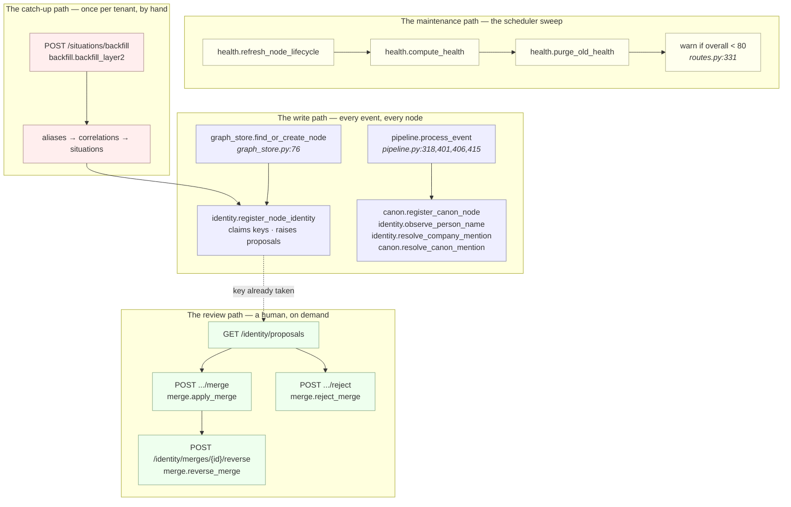

# Layer 2 · 02 — The Graph Engine

*The part of Layer 2 that keeps the graph honest. Everything else writes to the graph; this
is what decides **who a node is**, executes a human's decision that two nodes are one,
gives company knowledge a node of its own, measures whether the whole picture is still
trustworthy, and applies all of it to history that arrived before the code did.*

> **The one question this folder answers: "Is this graph still a true picture of one
> enterprise — and if two rows disagree about who something is, who decides?"**
>
> The answer is always the same: **a human decides, and the machine records why it asked.**
> Nothing here merges on its own, nothing here repairs on its own, and nothing here deletes.

---

## §0 · At a glance

| | |
|---|---|
| **Package** | `genios_engine/context/` — five modules, plus one shared normaliser in `platform/` |
| **Files** | `identity.py` (215) · `merge.py` (429) · `canon.py` (135) · `health.py` (397) · `backfill.py` (144) · `platform/identity.py` (92) |
| **Transport** | `api/identity_routes.py` (130) · four endpoints in `api/situation_routes.py` |
| **Input** | every `find_or_create_node` call · the L2 drain · the scheduler sweep · one POST from a human |
| **Output** | `graph_aliases` rows · `merge_proposals` rows · repaired graph state · `graph_health` measurements |
| **LLM calls** | **Zero. In all five modules.** Identity is decided by string equality; health by counting. |
| **Tables owned** | `graph_aliases` · `merge_proposals` · `merge_history` · `context_node_lifecycle` · `graph_health` |
| **Migrations** | `0004_l2_context_graph.sql` (proposals/history) · `0036_l2_entity_resolution.sql` · `0039_l2_graph_health.sql` |
| **Tests** | `test_entity_resolution.py` (225) · `test_graph_health.py` (271) · `test_canon_correlation.py` (212) · `test_l2_completeness.py` (118) |
| **Status** | Feature-complete and green. **None of this SQL has ever executed against Postgres** — see §8. |

---

## §1 · A note on names — the spec and the code disagree

> **The spec calls this the "Graph Engine". There is no `graph_engine.py`, no class called
> `GraphEngine`, and no single entry point.** The work the spec assigns to one component is
> done by five modules that never call each other in a line, plus a normaliser that lives one
> layer down in `platform/`. **The code wins, because the code is what runs.**

Three more places the vocabulary diverges, stated once here and then dropped:

| The spec says | The code has | Why the code's name is the true one |
|---|---|---|
| **Entity Resolution Engine** | `context/identity.py` — a lookup table, not an engine | There is no matcher, no scorer, no ranking pass. It resolves by exact key equality against `graph_aliases`. Calling it an engine implies an algorithm that does not exist. |
| **Pruning Engine** — "so the graph never grows forever" | `context/health.py` — archival only, plus a 180-day clock on health history | **Deliberate disagreement.** Volume is controlled at Layer 1, where the gate drops noise *before* it becomes a node. Deleting later destroys evidence a human may need to explain a decision the system already made. Enforced by `tests/test_graph_health.py::test_nothing_in_maintenance_deletes_graph_data`. |
| **Graph Updater** | `context/graph_store.py` (documented in `01-Enterprise-Context-Graph/`) | The commit layer is not part of this folder. This folder is what *maintains* what the commit layer wrote. |

And one thing the spec never asked for, which turned out to carry the whole design:
**`backfill.py`.** Every feature in this folder fires on node creation or event arrival. On a
tenant with existing history, all of it would look broken while being perfectly implemented.

---

## §2 · The five leaves

| # | Document | Code it documents | The question it answers |
|---|---|---|---|
| 01 | [**Entity Resolution**](01-Entity-Resolution.md) | `context/identity.py` · `platform/identity.py` · `0036` | "Acme", `acme.io`, "Acme, Inc." — is that one company or three? |
| 02 | [**Merge and Reverse**](02-Merge-and-Reverse.md) | `context/merge.py` · `api/identity_routes.py` | A human said they are one. What breaks when you fold two nodes together, and how is it undone? |
| 03 | [**Canon**](03-Canon.md) | `context/canon.py` · `capture/internal_knowledge.py` | The company's own policies and projects — a passenger, or a participant? |
| 04 | [**Lifecycle and Health**](04-Lifecycle-and-Health.md) | `context/health.py` · `0039` | Is this graph still trustworthy, and which entities have gone quiet? |
| 05 | [**Backfill**](05-Backfill.md) | `context/backfill.py` | None of the above fires on data that arrived yesterday. How is it applied to history? |
| 06 | [**Extraction & Grounding**](06-Extraction-and-Grounding.md) | `context/extract/` · `context/llm/` · `context/guard.py` | The **only LLM call in Layer 2**. How prose becomes candidates, and what stops a hallucination reaching the graph. |

---

## §3 · Where each piece actually runs

Nothing in this folder has a scheduler of its own. Each module is called from somewhere else,
and *where* it is called is most of the design.

**The call sites, exactly:**

| Caller | Line | Calls | Why there |
|---|---|---|---|
| `graph_store.py` | `:88`, `:102` | `register_node_identity` | On **creation and on every later sighting** — a node's display name usually arrives after its anchor did |
| `pipeline.py` | `:318` | `register_canon_node` | Only when `internal_kind` is set; inert for ordinary mail |
| `pipeline.py` | `:401` | `observe_person_name` | Next to a real email anchor, never instead of one |
| `pipeline.py` | `:406` | `resolve_company_mention` | Before canon, deliberately — see [03-Canon §5](03-Canon.md) |
| `pipeline.py` | `:415` | `resolve_canon_mention` | After the company branch, same reason |
| `api/routes.py` | `:327–329` | `refresh_node_lifecycle` → `compute_health` → `purge_old_health` | On the sweep, not the drain: both are **O(graph), not O(event)** |
| `api/situation_routes.py` | `:149`, `:165` | `backfill_layer2`, `compute_health(persist=False)` | Operator actions, not automatic |
| `api/identity_routes.py` | `:75`, `:95`, `:112` | `apply_merge`, `reject_merge`, `reverse_merge` | A human, in one transaction, with an audit row |

---

## §4 · The five laws

Each is enforced by a named test, and each exists because breaking it fails *silently*.

### L1 · Exact key equality is the only auto-merge (D8)

No edit distance, no embeddings, no "0.87 similar". Fuzziness lives in how an alias is
**derived** — stripping `Inc.`, lowercasing, taking a domain's label — never in how two
aliases are **compared**. Comparison is `=` in SQL, forever.

> *Enforced:* `test_entity_resolution.py::test_matching_is_string_equality_and_nothing_else`.
> *Why:* two colleagues genuinely share a name. Every similarity threshold turns a coin-flip
> into a permanent, invisible join between two real businesses.

### L2 · A collision is a question, not an answer

When a second node claims a key another node already holds, **the first claimant keeps the
key** and a `merge_proposals` row is written. Resolution stays stable while a human decides.

> *Enforced:* `test_entity_resolution.py::test_nothing_in_this_module_merges_anything`.

### L3 · Nothing repairs itself

All eight integrity checks are `select`-only, asserted character-by-character.

> *Enforced:* `test_graph_health.py::test_integrity_checks_never_repair`.
> *Why:* an auto-fix that runs unattended at 3am deletes the rows it decided were wrong, and
> nobody finds out until a decision cannot be explained.

### L4 · Nothing is deleted — only closed or archived

A merged node gets `valid_to=now()`, never a `DELETE`. A superseded fact gets
`status='superseded'`, never a `DELETE`. A quiet entity gets `lifecycle='archived'`, and stays
fully queryable and fully evaluated.

> *Enforced:* `test_graph_health.py::test_nothing_in_maintenance_deletes_graph_data`,
> `test_entity_resolution.py::test_the_merged_node_is_closed_not_deleted`.
> *Why:* a node id may already sit in a delivery card, a reasoning trace or an audit row.
> Those must still resolve.

### L5 · A label may narrow retrieval. It may never narrow evaluation.

`context_node_lifecycle` is a label. A dormant entity is still evaluated, every sweep, always.

> *Enforced:* `test_graph_health.py::test_lifecycle_never_gates_evaluation` — it greps every
> file under `reason/` for the string `context_node_lifecycle` and fails if any matches.
> *Why:* the starvation loop. If dormancy narrowed evaluation, a quiet entity would produce no
> signals, so it would stay quiet, so it would stay dormant. **The customer who went silent —
> exactly the one worth noticing — is the one the system would go permanently blind to.**

---

## §5 · The tables

| Table | Migration | Key | Written by | Read by |
|---|---|---|---|---|
| `graph_aliases` | `0036` | `(org_id, alias_type, alias_key)` | `identity.record_alias`, `identity.observe_person_name`, `canon.register_canon_node` | `identity.resolve_alias` and its two wrappers |
| `merge_proposals` | `0004` + `0036` | `id`; unique partial `(org, left, right) where status='open'` | `identity.propose_merge`, `merge.apply_merge`, `merge.reject_merge` | `merge.open_proposals`, `health` metric `open_merge_proposals` |
| `merge_history` | `0004` | `id` | `merge.apply_merge` | `merge.reverse_merge`, `GET /identity/merges` |
| `context_node_lifecycle` | `0039` | `(org_id, node_id)` | `health.refresh_node_lifecycle` **only** | `health` metric `nodes_dormant`, reporting |
| `graph_health` | `0039` | `(org_id, computed_at)` | `health.compute_health(persist=True)` | `GET /graph/health/history`, `health.purge_old_health` |

The primary key on `graph_aliases` is the whole mechanism: **one owner per key per org, and
the conflict IS the signal.** There is no separate collision detector — `on conflict do
nothing` followed by a read-back is the detector (`identity.py:102–111`).

Every one of these tables carries an `org_id` FK to `orgs` with `on delete cascade` — tenant
erasure is complete **by schema**, not by an application list someone remembers to update
(`0036:36–38`, `0039:51–56`).

---

## §6 · The HTTP surface

| Endpoint | Module | What it does |
|---|---|---|
| `GET /api/org/{org}/identity/proposals` | `merge.open_proposals` | The review queue, newest first, with both sides' names and keys joined in |
| `POST /api/org/{org}/identity/proposals/{id}/merge` | `merge.apply_merge` | Human confirms. Transactional. Body names the survivor; a mismatch against the proposal is a `422` |
| `POST /api/org/{org}/identity/proposals/{id}/reject` | `merge.reject_merge` | "Two different things." Recorded permanently — the pair is never proposed again |
| `POST /api/org/{org}/identity/merges/{id}/reverse` | `merge.reverse_merge` | Undo, from the snapshot taken at merge time |
| `GET /api/org/{org}/identity/merges` | raw SQL | History: what was folded into what, and whether it was reversed |
| `GET /api/org/{org}/graph/health` | `health.compute_health(persist=False)` | The vector, live, not recorded |
| `GET /api/org/{org}/graph/health/history` | raw SQL | The trend — the number that actually matters |
| `POST /api/org/{org}/situations/backfill` | `backfill.backfill_layer2` | Apply all of Layer 2 to existing history. `?limit=` caps the correlation pass |

Both merge endpoints write an audit row (`platform.audit.record`) with the repair counts
attached — `entities_merged` and `entity_merge_reversed`.

---

## §7 · The tests, and their one weakness

| File | Count | Shape |
|---|---|---|
| `tests/test_entity_resolution.py` | 225 lines | Half behavioural (the normalisers are pure), half source-text assertions on `identity.py` and `merge.py` |
| `tests/test_graph_health.py` | 271 lines | Mostly behavioural — `node_lifecycle` and `score_health` are pure functions |
| `tests/test_canon_correlation.py` | 212 lines | Almost entirely source-text assertions on `pipeline.process_event` |
| `tests/test_l2_completeness.py` | 118 lines | Entirely source-text — it exists to stop two specific regressions returning |

> **The weakness, stated plainly.** There is no database in the test suite. So roughly forty
> of these assertions read the form `assert "delete from context_situations" in source`. They
> pin the *prose*, not the behaviour. Two of them broke during a refactor for exactly that
> reason. One is **vacuous** and passes no matter what the code does — see §8, defect 8.
>
> The fix is not to rewrite the assertions. It is a test Postgres, at which point the SQL-
> dependent halves of `merge.py`, `health.py` and `backfill.py` become testable by behaviour.

---

## §8 · Gaps — what is actually wrong

Each of these was found by reading the code on disk against the schema on disk. Severity is
about blast radius, not likelihood.

### Confirmed defects

| # | Problem | Where | Severity |
|---|---|---|---|
| 1 | **`apply_merge` can abort on `context_attention`.** The generic repoint loop runs `update context_attention set node_id=:survivor where node_id=:merged`. That table's primary key is `(org_id, node_id)` (`0028:21–29`) and `attention.refresh_attention` writes one row per **person and deal** node (`attention.py:158`). Merge two duplicate people who both have attention rows and Postgres raises a duplicate-key error that aborts the whole transaction. **This is precisely the failure `_merge_correlations` was written to avoid** — the same bug, one table over, unhandled. | `merge.py:37–50` | **worst** |
| 2 | **The backfill anchors situations on your own company.** The live path excludes `internal_nodes`, which includes the company node reached through one of your own seats (`pipeline.py:294–298`). The backfill excludes only nodes whose `canonical_key` is an active seat's **email** (`backfill.py:119`). A company node's key is a *domain*, so it never matches — and `ANCHOR_PRIORITY` ranks `company` above `person`. Every historical outbound email can therefore anchor on your own company. **This is bug #1 from the Layer 2 notes, reappearing in the path built to fix everything else.** | `backfill.py:83–121` | **worst** |
| 3 | **A prose mention of a company's real name cannot resolve.** `alias_keys_for_node` claims `company_slug(display_name)` as a lookup key — but the only writer of company nodes in the entire codebase is `pipeline._works_at`, which sets `display_name=dom` (`pipeline.py:290–292`). So the key claimed is `company_slug("acme.io")` → **`"acme io"`**, and the documented, tested path (`"Acme Technologies Pvt Ltd"` → `"acme technologies"`) has **no producer**. Only the `domain_root` key `"acme"` ever works. | `identity.py:85–87` | high |
| 4 | **The backfill has no noise exclusion.** The live path skips correlation entirely for newsletters and automated mail (`pipeline.py:586`). `is_noise` comes from the extraction result and is never persisted on `source_events`, so the backfill cannot see it and correlates every emitted event that touched a node. Bug #5 from the Layer 2 notes — marketing blasts becoming evidence in live deals — returns on any backfilled tenant. *Recoverable:* the pipeline does leave an `email_noise:<type>` observation (`pipeline.py:506`), which the backfill does not consult. | `backfill.py:86–95` | high |
| 5 | **`reverse_merge` restores four of the eight repointed tables.** The snapshot records `graph_facts`, `graph_observations`, `graph_aliases` and edges. `source_identity_map`, `context_attention` and both `merge_proposals` columns are repointed by `apply_merge` and never moved back — so after an undo, a CRM contact id still resolves to the survivor, permanently (`map_identity` is `on conflict do nothing`). | `merge.py:61–82` vs `:37–50` | medium |
| 6 | **`apply_merge` can also abort on `merge_proposals`.** Same shape as defect 1: `0036:47–49` puts a unique partial index on `(org_id, left_node_id, right_node_id) where status='open'`. Repointing `left_node_id` from the merged node to the survivor can produce two open rows with the same pair. Reachable when three nodes contend for keys across different alias types. | `merge.py:42–43` | medium |
| 7 | **`context_node_lifecycle` rows for closed nodes are never cleaned.** `refresh_node_lifecycle` only iterates open nodes, so a merged node's lifecycle row survives forever, and no integrity check looks for it — unlike `alias_to_closed_node` and `correlation_on_closed_node`, which do. | `health.py:332–387` | low |
| 8 | **One test is vacuous.** `test_l2_completeness.py:88` reads `assert "list[str]" in inspect.signature(fn).return_annotation or True`. Because `merge.py` uses `from __future__ import annotations`, the annotation is the *string* `'int'`, `"list[str]" in "int"` is `False`, and `or True` swallows it. It was written to catch exactly the drift it now permits: `_resolve_duplicate_facts` and `_dedupe_edges` are both annotated `-> int` and both return `list[str]`. | `merge.py:167`, `:205` | low |
| 9 | **`anchoring_node_types()` has no callers.** Dead code repo-wide; `correlation._anchor_priority` reads `ANCHORING_KINDS` directly. | `canon.py:59–61` | low |
| 10 | **`compute_health` is 19 full-table scans per org, per sweep** (8 integrity + 11 metrics), several of them correlated subqueries over `source_events` × `graph_facts`. Fine at hourly cadence. Not fine at minute cadence. *(The Layer 2 notes say "~17" — the actual count is 19.)* | `health.py:96–169`, `:251–298` | structural |

### The one that outranks all of them

> **None of this SQL has ever executed against Postgres.** Every table the code queries is
> verified to exist in a migration (`tests/test_sql_references_real_tables.py`), and every
> query was reviewed column-by-column. **Column names, types and semantics are unverified.**
> Defects 1, 2, 5 and 6 are all in that class — none is a logic error, all four are a
> statement meeting a constraint. They will surface in the first thirty seconds against a
> real database, and not one minute earlier.

### Deliberately not done

**No automatic repair, for any of the eight integrity checks.** Not even for `self_edge`,
which is unambiguous and trivially fixable. The moment one check repairs, the argument for
the next one is already made, and the seventh will be the one that deletes something.

**No merge on certainty.** `_STRONG` marks email and domain collisions as high-signal in the
proposal evidence, and does nothing else with it. A collision on a strong alias is still only
a proposal, because the reversal path exists but *an unnoticed wrong merge is not reversed by
anyone*.

**Person names are never anchor keys.** `alias_keys_for_node` returns nothing for a person's
name — it is recorded only by `observe_person_name`, as `origin='observed'`, next to a real
email anchor. Minting `"rohit s"` as a lookup key would make every future Rohit collide with
this one.

---

## §9 · The one thing to fix first

**Defect 1 — the `context_attention` collision in `apply_merge`.** Not because it is the most
common, but because of what happens when it fires: a human clicks *merge*, the transaction
aborts, and the two duplicates stay duplicated with no repair and a `500`. Every unresolved
duplicate lowers the `identity` health dimension and the confidence of every situation about
that entity, so the one control a human has over identity is also the one that fails first.

The fix has a template already in the file: `_merge_correlations` exists solely because
`context_correlations` has a unique constraint the generic loop would trip. `context_attention`
needs the same treatment — delete the merged node's row rather than repoint it, since
attention is recomputed from scratch on the next drain anyway.
