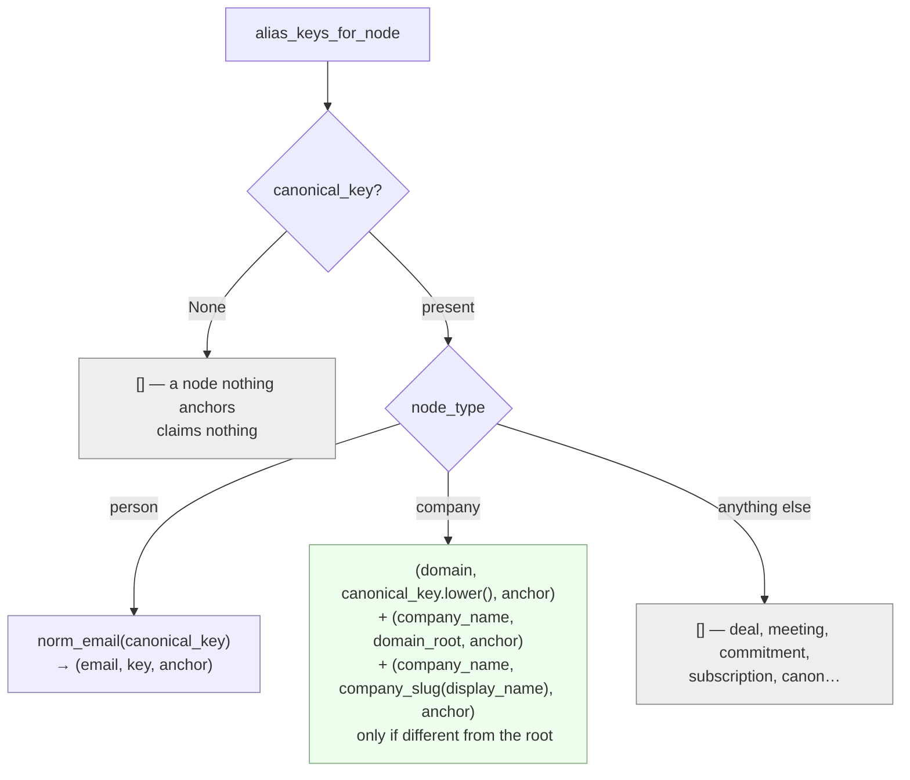

# 01 · Entity Resolution — `context/identity.py`

*One company arrives under five names in a week. This is the only thing standing between
"one customer" and "five strangers".*

> **The one question: "Have we seen this thing before, under a different spelling?"**
>
> Answered by **lookup**, never by scoring. An alias is a key an entity can be *found by* —
> recorded once, then matched with `=`. Fuzziness lives in how a key is **derived**. It never
> lives in how two keys are **compared**.

---

## §1 · What it is for

An enterprise names one company five ways in a week:

```
acme.io                      in an email address
"Acme"                       in a Slack message
"Acme, Inc."                 in a contract
"ACME"                       in a CRM export
"Acme Technologies Pvt Ltd"  on an invoice
```

Before this module, two nodes were the same entity only if their `canonical_key` strings were
**byte-identical**. So:

- `"Acme Inc."` named in an email never reached the company node built from `acme.io`
- `rohit@acme.io` and `rohit@gmail.com` stayed two unrelated people forever
- **`merge_proposals` — the table built for exactly this in migration `0004` — had never
  received a single row**

Every rule that asked *"what is happening with Acme?"* saw a fraction of the truth, and
nothing in the system reported a fraction.

### The law it obeys — D8

From `platform/identity.py`, the module docstring, and repeated in `0036_l2_entity_resolution.sql`:

> **Exact key equality is the ONLY auto-merge. Name similarity is a candidate finder, never a
> merge authority.**

This is not caution for its own sake. **Two colleagues genuinely share a name. Two companies
genuinely share a slug.** `domain_root("acme.io") == domain_root("acme.com")` — and those may
be one company or two, and nothing available in the data can tell you which. So when a second
node claims an alias that already belongs to another node, this module writes a **proposal**
and changes nothing.

### What it deliberately does not do

| Refused | Why |
|---|---|
| Edit distance, embeddings, "0.87 similar" | Each turns a coin-flip into a permanent, invisible join between two real businesses |
| Auto-merge, even at "certainty" | `merge_history` and `reverse_merge` exist — but an *unnoticed* wrong merge is not reversed by anyone |
| Creating a node from a bare name | The P1 anchor rule. This module widens what counts as anchored; it does not lower the bar |

The last one is enforced by grep, not by convention:

```python
# tests/test_entity_resolution.py::test_no_resolver_function_can_create_a_node
source = inspect.getsource(identity)
assert "insert into graph_nodes" not in source
assert "find_or_create_node" not in source
```

---

## §2 · What exists

### The five alias types

`identity.py:43–51`. Declared strongest-first, and the order is documentation rather than
code — nothing iterates it.

| Constant | Value | Derived from | Origin | Proves identity alone? |
|---|---|---|---|---|
| `ALIAS_EMAIL` | `"email"` | `norm_email(canonical_key)` on a **person** node | `anchor` | **Yes** — one email is one human |
| `ALIAS_DOMAIN` | `"domain"` | the **company** node's `canonical_key`, lowercased and trimmed | `anchor` | **Yes** |
| `ALIAS_COMPANY_NAME` | `"company_name"` | `domain_root(domain)` and `company_slug(display_name)` | `anchor` | No — a name is a candidate |
| `ALIAS_PERSON_NAME` | `"person_name"` | `person_name_key(name)`, written only by `observe_person_name` | `observed` | No — never used to propose anything |
| `ALIAS_CANON` | `"canon"` | `canon_title_key(title)` on a canon document — see [03-Canon](03-Canon.md) | `anchor` | No |

```python
_STRONG = frozenset({ALIAS_EMAIL, ALIAS_DOMAIN})     # identity.py:55
```

`_STRONG` does exactly one thing: it stamps `"strength": "strong"` or `"weak"` into a
proposal's `evidence` JSON (`identity.py:183`). **It does not change any behaviour.** A strong
collision is still only a proposal — just one worth a human's attention first.

> **Why `ALIAS_CANON` has its own namespace.** A project called "Acme" must not collide with
> the customer called "Acme". Different alias types cannot contend for the same key, so no
> false merge proposal is ever raised between them, **and a company mention still resolves to
> the company.** `identity.py:48–51` states this; `test_canon_correlation.py:88` pins it.

### The five public functions

| Function | Signature | Returns |
|---|---|---|
| `alias_keys_for_node` | `(*, node_type, canonical_key, display_name)` | `list[(alias_type, alias_key, origin)]` — the keys a node is entitled to |
| `record_alias` | `(conn, *, org_id, node_id, alias_type, alias_key, origin, event_id)` | `None` if the key is now this node's; **the other node's id** if it was already taken |
| `resolve_alias` | `(conn, *, org_id, alias_type, alias_key)` | `node_id \| None` — one `select`, exact match |
| `resolve_company_mention` | `(conn, *, org_id, name)` | `node_id \| None` — `company_slug(name)` against `ALIAS_COMPANY_NAME` |
| `propose_merge` | `(conn, *, org_id, left_node_id, right_node_id, node_type, reason, evidence)` | proposal id, or `None` if already queued or already decided |
| `register_node_identity` | `(conn, *, org_id, node_id, node_type, canonical_key, display_name, event_id)` | `list[str]` of proposal ids raised — **empty is the normal case** |
| `observe_person_name` | `(conn, *, org_id, node_id, name, event_id)` | `None` — records what a person is *called*, next to the email that identifies them |

---

## §3 · How it works

### 3.1 · The normalisers — `platform/identity.py`

These live one layer down, in `platform/`, and that placement is load-bearing. **Identity is
the substrate of cross-intelligence.** The same human arriving via Gmail (sender), Calendar
(attendee), a CRM (contact) and a typed note must converge on one node, and that only holds
if *every writer computes the same key*.

> It did not hold. The structured lane lowercased only, while the extraction pipeline also
> stripped `+tags` — so `priya+cal@x.com` from the calendar and `priya@x.com` from email became
> two people. One definition, imported downward, is the fix.

#### `norm_email(email) -> str | None`

**The** person-identity function. Every layer that mints a person `canonical_key` must use
exactly this.

```
lowercase → strip whitespace → split on "@" → drop everything after "+" in the local part
```

| Input | Output | Note |
|---|---|---|
| `"  Rohit+cal@Acme.io "` | `"rohit@acme.io"` | trim, lowercase, `+tag` stripped |
| `"rohit@acme.io"` | `"rohit@acme.io"` | idempotent |
| `"not-an-email"` | `None` | no `@` |
| `"+cal@acme.io"` | `None` | empty local part after stripping — `f"{local}@{dom}"` is only returned `if local and dom` |

#### `company_slug(name) -> str | None`

Company **name** → a comparison key. A *candidate* key, never an identity.

```python
cleaned = re.sub(r"[^a-z0-9\s]+", " ", str(name).strip().lower())   # platform/identity.py:57
words  = [w for w in cleaned.split() if w]
kept   = [w for w in words if w not in _LEGAL_SUFFIXES]
return " ".join(kept or words)
```

Two details carry the whole function:

1. **The regex runs on the already-lowercased string.** `[^a-z0-9\s]` would otherwise strip
   every capital letter. Order matters and there is no test on it.
2. **`kept or words`.** Only legal-form tokens are stripped, and *never all of them*. A company
   literally named `"Co"` stays `"co"` — trimming a one-word legal-form name to nothing would
   collapse every such company into a single empty key.

`_LEGAL_SUFFIXES` — **28 tokens** (`platform/identity.py:19–23`):

| Group | Tokens |
|---|---|
| Anglo | `inc` `incorporated` `llc` `llp` `ltd` `limited` `corp` `corporation` `co` `company` `plc` |
| Indian | `pvt` `private` |
| European | `gmbh` `ag` `sa` `sas` `bv` `nv` `srl` `spa` `oy` `ab` `as` `kft` |
| Asia-Pacific | `pte` `pty` `kk` |

| Input | Output |
|---|---|
| `"Acme"` / `"ACME"` / `"Acme, Inc."` / `"Acme Inc"` / `"  acme  "` | `"acme"` — all five |
| `"Acme Technologies Pvt Ltd"` | `"acme technologies"` |
| `"Northwind GmbH"` | `"northwind"` |
| `"3one4 Capital LLP"` | `"3one4 capital"` |
| `"Co"` | `"co"` — the `kept or words` fallback |
| `"Apex Legal"` vs `"Apex Logistics"` | `"apex legal"` ≠ `"apex logistics"` — over-trimming is the failure mode that fuses real businesses |
| `None` / `"   "` / `"!!!"` | `None` |

#### `domain_root(domain) -> str | None`

Email or web domain → the company label. Also a candidate key only.

```python
parts = [p for p in domain.strip().lower().strip(".").split(".") if p]
if len(parts) < 2: return None
if len(parts) >= 3 and ".".join(parts[-2:]) in _COMPOUND_TLDS: return parts[-3]
return parts[-2]
```

`_COMPOUND_TLDS` — **15 entries** (`platform/identity.py:28–31`): `co.uk` `co.in` `co.jp`
`co.nz` `co.za` `co.il` `co.kr` `com.au` `com.br` `com.sg` `com.mx` `org.uk` `net.au` `ac.uk`
`gov.uk`.

> **It is not a full public-suffix list, on purpose.** A missing entry only makes `domain_root`
> *shorter* than ideal — `acme.co.xx` → `"co"` instead of `"acme"` — which is a candidate key
> that finds nothing, not a wrong join. **This is only safe because the caller never
> auto-merges on it.** Extend the set as real domains show up.

| Input | Output | Path |
|---|---|---|
| `"acme.io"` | `"acme"` | 2 parts → `parts[-2]` |
| `"mail.acme.io"` | `"acme"` | 3 parts, `"acme.io"` not compound → `parts[-2]` |
| `"acme.co.uk"` | `"acme"` | 3 parts, `"co.uk"` compound → `parts[-3]` |
| `"careers.acme.com.au"` | `"acme"` | 4 parts, `"com.au"` compound → `parts[-3]` |
| `"co.uk"` | `"co"` | only 2 parts — the compound branch needs ≥ 3. A known, harmless shortfall |
| `"localhost"` / `None` / `""` | `None` | fewer than 2 parts |

#### `person_name_key(name) -> str | None`

`"Rohit  S."` → `"rohit s"`. **The weakest key in the file**, and the only one that never
appears in `alias_keys_for_node`.

### 3.2 · `alias_keys_for_node` — what a node may be found by

`identity.py:58–88`. Derived purely from what **anchors** the node. `origin='anchor'` means
the key is a restatement of the node's own identity, not a guess.



**A person's NAME is deliberately absent.** `"Rohit S."` anchors nothing on its own, and
minting it as a lookup key would make every future Rohit collide with this one.

**Every other node type returns an empty list, and that silence is correct.** `deal`,
`meeting`, `commitment`, `subscription`, `product_account` are anchored by source ids
(`hubspot:1234`, `gcal:evt_9`). Inventing name keys for them would collide unrelated records.

```python
# test_entity_resolution.py
assert _keys("deal", "hubspot:1234", "Acme Q3 Renewal") == set()
assert _keys("meeting", "gcal:evt_9", "Pricing Review") == set()
```

### 3.3 · `record_alias` — the claim, and the collision detector

There is no separate collision detector. `on conflict do nothing` followed by a read-back
**is** the detector.

```python
# identity.py:102–111
insert into graph_aliases (org_id, alias_type, alias_key, node_id, origin, created_by_event_id)
values (:o, :t, :k, :n, :orig, :ev)
on conflict (org_id, alias_type, alias_key) do nothing

holder = select node_id from graph_aliases where org_id=:o and alias_type=:t and alias_key=:k
return None if holder == node_id else holder
```

| Situation | Insert | Read-back | Return |
|---|---|---|---|
| Key is free | writes | this node | `None` |
| Key already this node's | no-op | this node | `None` |
| Key held by another node | no-op | **the other node** | that node's id → the caller has found a duplicate |

**Nothing is ever overwritten. The first claimant keeps the key.** That is what makes
resolution *stable* while a proposal waits for a human — a mention of "Acme" resolves to the
same node before and after the review, whichever way the review goes.

### 3.4 · `propose_merge` — recording the question

`identity.py:134–161`. Three guards, in order:

1. **Self-pairs and empties are refused** — `if not left or not right or left == right: return None`.
2. **The pair is sorted before insert** — `left, right = sorted((left_node_id, right_node_id))`.
   So `(A,B)` and `(B,A)` are one proposal, not two.
3. **A settled pair is never re-asked** — `select 1 ... where status in ('merged','rejected')`.
   Without this, every future email about either entity re-raises the same question and the
   queue becomes something people stop reading.

Then the insert, guarded by a partial unique index from `0036`:

```sql
create unique index if not exists merge_proposals_unique_open
    on merge_proposals (org_id, left_node_id, right_node_id)
    where status = 'open';
```

**One OPEN proposal per unordered pair.** The `where status = 'open'` clause is what allows a
pair to be proposed, rejected, and — if a human later reverses a merge — proposed again.

The `evidence` JSON records everything a reviewer needs without opening the graph:

```json
{"alias_type": "company_name", "alias_key": "acme", "strength": "weak",
 "display_name": "acme.io", "canonical_key": "acme.io", "event_id": "evt_..."}
```

### 3.5 · `register_node_identity` — the whole thing, in one call

`identity.py:164–192`. Claim every key the node is entitled to; for each one already taken,
raise a proposal.

```python
for alias_type, alias_key, origin in alias_keys_for_node(...):
    holder = record_alias(...)
    if holder is None:
        continue
    strength = "strong" if alias_type in _STRONG else "weak"
    pid = propose_merge(..., reason=f"shared_{alias_type}", evidence={...})
    if pid:
        proposals.append(pid)
```

It is called from `graph_store.find_or_create_node` in **both** branches — on creation
(`graph_store.py:102`) and on every later sighting of an existing node (`graph_store.py:88`).

> **Why on every sighting.** A node's display name usually arrives *after* its anchor did: an
> email gives you `acme.io` on Monday and the words "Acme Technologies" on Thursday. If keys
> were claimed only at creation, Thursday's name would never become a lookup key, and the
> mention that needed it would never resolve.

---

## §4 · Worked example

### Monday — an inbound email from `priya@acme.io`

`pipeline._person` creates a person node; `pipeline._works_at` creates the company node with
`canonical_key = "acme.io"` and `display_name = "acme.io"`.

`register_node_identity(node_type="company", canonical_key="acme.io", display_name="acme.io")`
derives:

| # | Source | `alias_type` | `alias_key` | Result |
|---|---|---|---|---|
| 1 | `canonical_key.lower()` | `domain` | `acme.io` | claimed |
| 2 | `domain_root("acme.io")` | `company_name` | `acme` | claimed |
| 3 | `company_slug("acme.io")` → `"acme io"` ≠ `"acme"` | `company_name` | `acme io` | claimed |

Row 3 is real and it is an artefact — see §6. Return value: `[]`. No proposals.

### Tuesday — a Slack message: *"pricing approval needed for Acme"*

Extraction returns an entity `{"type": "company", "name": "Acme"}` with no email. In
`pipeline.py:405`:

```python
elif etype == "company" and name and (
        known := resolve_company_mention(conn, org_id=org_id, name=str(name))):
```

`resolve_company_mention` computes `company_slug("Acme")` → `"acme"`, looks up
`(org, "company_name", "acme")`, finds row 2, and returns the company node id. The mention
attaches its facts **to the company** instead of piling onto whoever sent the Slack message —
and **no node is created**, which is the P1 anchor rule holding rather than bending.

### Wednesday — a CRM sync creates a second company node

Suppose a future connector creates a company node with `canonical_key = "acme.com"` and
`display_name = "Acme"`. Its keys:

| # | `alias_type` | `alias_key` | `record_alias` returns |
|---|---|---|---|
| 1 | `domain` | `acme.com` | `None` — free |
| 2 | `company_name` | `acme` | **the Monday node's id** — taken |
| 3 | `company_slug("Acme")` = `"acme"` == root → **skipped** by `named != root` | | |

One proposal is raised:

```
reason   = "shared_company_name"
strength = "weak"                       # company_name ∉ _STRONG
left     = min(node_monday, node_wednesday)     # sorted before insert
status   = "open"
```

**The Monday node keeps `"acme"`.** `resolve_company_mention("Acme")` returns the same node it
did on Tuesday, before and after a human decides. `domain_root("acme.io") ==
domain_root("acme.com")` — these may be one company or two, and only a human knows.

### Thursday — a human rejects it

`POST /identity/proposals/{id}/reject` → `status='rejected'`. Every future email from either
domain re-runs `register_node_identity`, `record_alias` still returns the other node's id, and
`propose_merge` returns `None` at the settled-pair guard. **The question is asked once.**

---

## §5 · Edge cases and the exact rules

| Case | Behaviour | Where |
|---|---|---|
| Empty `alias_key` | `record_alias` and `resolve_alias` both return `None` before touching the database | `identity.py:100`, `:116` |
| `canonical_key` is `None` | `alias_keys_for_node` returns `[]` immediately — a node nothing anchors must not become findable by a name it merely happened to be displayed under | `identity.py:70–71` |
| `company_slug(display_name)` equals `domain_root` | The second `company_name` key is skipped — `if named and named != root` | `identity.py:86` |
| Person `canonical_key` is malformed | `norm_email` returns `None`, no key is claimed, the person node exists with no alias | `identity.py:74–77` |
| A person and a company claim the same string | Impossible to collide — different `alias_type` values are different primary keys | `0036:28` |
| `observe_person_name` finds the key taken | **Nothing happens.** `on conflict do nothing`, no read-back, no proposal. Two people sharing a name is ordinary, not a duplicate | `identity.py:206–210` |
| A node re-registers its own keys | All three `record_alias` calls return `None`; the return value is `[]` | — |
| `propose_merge` on a pair already open | The partial unique index rejects it; `on conflict do nothing returning id` yields no row; returns `None` | `identity.py:158–161` |

### The rounding of responsibility

`observe_person_name` is the only writer with `origin='observed'`, and it is the only writer
that **never** raises a proposal. That asymmetry is the design:

> A person's name is written down so a later `"Rohit S."` in prose can *reach* an anchored
> node. It is never used to create a person and never on its own to propose a merge.

---

## §6 · What is wrong here

| # | Problem | Evidence |
|---|---|---|
| 1 | **The `company_slug(display_name)` key never carries a real company name.** The sole writer of company nodes is `pipeline._works_at`, which passes `display_name=dom` (`pipeline.py:290–292`). Nothing anywhere updates `graph_nodes.display_name`. So the key claimed is always `company_slug("acme.io")` = **`"acme io"`** — a string nobody writes in prose. `test_a_company_is_findable_by_its_domain_and_its_name` passes `"Acme Technologies Pvt Ltd"` by hand; **no production path ever does.** | `identity.py:85–87` vs `pipeline.py:291` |
| 2 | **Consequence: every company node carries a junk alias.** One extra `graph_aliases` row per company, keyed `"<label> <tld>"`. Harmless today; it becomes a false proposal the day a real company is called "Acme IO". | as above |
| 3 | **`alias_keys_for_node` assumes a company's `canonical_key` is a domain** and never checks. It happens to hold — `pipeline._works_at` is the only writer, and `_company_domain` filters personal providers — but the coupling is implicit. A future connector creating `company` nodes keyed `"hubspot:c_123"` would claim that string as a `domain` alias. | `identity.py:77–79` |
| 4 | **`_STRONG` changes no behaviour.** It labels the evidence JSON and nothing reads it. The review queue does not sort by it. | `identity.py:55`, `:183` |
| 5 | **A collision raises a proposal per alias type, then dedupes by luck.** Two nodes colliding on both `domain` and `company_name` call `propose_merge` twice; the second returns `None` only because the partial unique index catches it. Correct, but the guard is in the schema, not the code. | `identity.py:176–192` |

---

## §7 · The tests, and what each one protects

`tests/test_entity_resolution.py` — 225 lines. **Most of them assert that something does
NOT happen**, because the danger in this module is not failing to merge.

| Test | The failure it prevents |
|---|---|
| `test_the_five_ways_a_company_gets_written_collapse_to_one_key` | The actual reason the module exists — one company, five spellings, one key |
| `test_legal_suffixes_are_stripped_but_never_everything` | `"Co"` → `"co"`. Every one-word legal-form name collapsing into one empty key |
| `test_different_companies_keep_different_keys` | Over-trimming fusing `"Apex Legal"` with `"Apex Logistics"` |
| `test_a_person_is_findable_only_by_email` | Every future Rohit colliding with this one |
| `test_the_person_key_matches_the_rest_of_the_system` | The `+tag` split — the same human becoming strangers per tool |
| `test_an_unanchored_node_claims_nothing` | A node becoming findable by a name it was merely displayed under |
| `test_a_node_type_with_no_identity_scheme_claims_nothing` | Invented keys colliding unrelated CRM records |
| `test_matching_is_string_equality_and_nothing_else` | Any similarity threshold ever entering the comparison path |
| `test_no_resolver_function_can_create_a_node` | The P1 anchor rule being lowered — greps for `insert into graph_nodes` and `find_or_create_node` |
| `test_nothing_in_this_module_merges_anything` | Greps for `insert into merge_history` and `update graph_nodes` |
| `test_a_rejected_pair_is_never_proposed_again` | The review queue becoming unreadable |

> Four of these are `inspect.getsource` greps rather than behavioural assertions. They are the
> best available answer while there is no database in the suite — and they are exactly the
> tests that a test Postgres would replace with real ones.

---

## §8 · Reading order from here

| Next | Why |
|---|---|
| [02 · Merge and Reverse](02-Merge-and-Reverse.md) | What happens after a human says *yes* to a proposal this module raised |
| [03 · Canon](03-Canon.md) | The fifth alias type, and the namespace rule that keeps a project called "Acme" away from the customer called "Acme" |
| [05 · Backfill](05-Backfill.md) | `register_node_identity` fires on node creation. Nodes that already exist need `backfill_aliases` |
