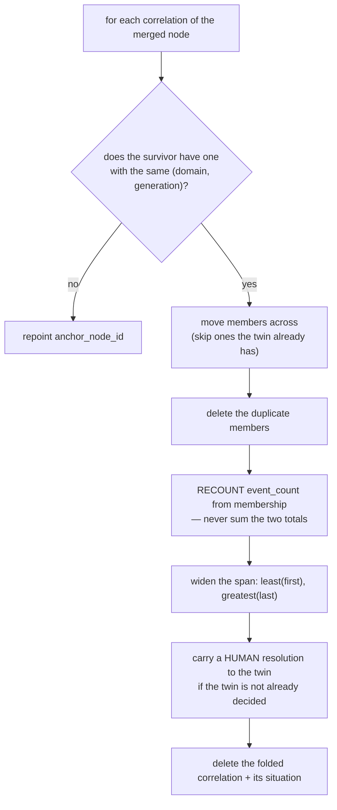

# Merge and reverse — the most destructive edit in the graph

*`context/merge.py` · `api/identity_routes.py`*

> Merging rewrites **who every fact, edge and observation is about**. Nothing here runs
> automatically. `identity.py` proposes; a human decides; this module carries out the decision
> and records enough to undo it.

---

## §1 · What it is for

Entity resolution finds duplicates. It never joins them, because a shared name is not proof.
This module is what happens **after** a person says "yes, those are the same customer."

It is separated from `identity.py` for one reason: detection is safe and continuous; execution
is destructive and rare. Mixing them would put a `update … set subject_node_id` in the same file
as a background scanner.

---

## §2 · Why reversibility is not optional

"Just merge them back" is **not** a repair. Once facts have been repointed, the original
ownership is gone — you cannot reconstruct which of the two entities each fact belonged to.

So `apply_merge` snapshots first, and the snapshot records **row ids, not counts**:

```python
snapshots = {"survivor": _snapshot(...), "merged": _snapshot(...)}
```

| Snapshot contains | Why ids and not counts |
|---|---|
| the merged node's row | to reopen it |
| `graph_facts` version ids it owned | to move back exactly those, not "everything now on the survivor" |
| `graph_observations` ids | same |
| `graph_aliases` `type:key` pairs | the table has no single-column id |
| open edges with their original `from`/`to` | to restore direction |
| **which** facts were superseded by the repair | a count proves something happened; only ids let it be undone |
| **which** edges were closed | reopening *every* closed edge would resurrect ones closed for unrelated reasons |

That last pair is a bug that was caught late: the repair functions originally returned
`int`. The module documented `reverse_merge` in its own docstring and **the function did not
exist** — snapshots were being taken and nothing could read them.

---

## §3 · The two invariants a merge breaks

Postgres catches neither.

### Invariant 1 · One active fact per `(subject, field)`

Merge two companies that each hold `deal.stage` and the survivor now has **two active values
for one field**. Every reader takes `limit 1`, so "the truth" becomes whichever row the planner
returns first.

`_resolve_duplicate_facts` resolves by the graph's own precedence and keeps the loser:

```sql
row_number() over (partition by field
                   order by authority_rank desc, occurred_at desc nulls last, created_at desc)
```

Rank first, then recency, then insertion order. Losers become `superseded` — **never deleted**,
because an unmerge needs them back.

### Invariant 2 · No self-edges

Duplicates are usually linked *to each other*. Repointing turns that edge into
`Acme corresponded_with Acme`. `_close_self_edges` closes exactly those and returns their ids.

`_dedupe_edges` handles the related case: both nodes knew the same person, so after repointing
there are two identical edges. It keeps the most recently seen and **sums `interaction_count`
into it** — merging must not quietly halve how well we appear to know someone.

---

## §4 · Correlations are folded, not repointed

The subtlest part, and it aborts the whole merge if done naively.

`context_correlations` has `unique (org_id, anchor_node_id, domain, generation)`. A blind
`update anchor_node_id` violates it **the moment both nodes hold a sales situation** — which is
precisely the case when they really were the same customer. Postgres rolls the entire merge back.

So `_merge_correlations` runs **first**, and `context_correlations` is deliberately **absent**
from the generic `_NODE_REFERENCES` loop:



**Recount, not sum.** The same email often reached both nodes before we knew they were one, so
adding the totals would claim more evidence than exists.

**The human resolution carries over.** Everything about a situation is rebuilt on the next
refresh *except* somebody having marked it handled. Confirming two customers are one must not
silently reopen work that was already closed.

---

## §5 · What `apply_merge` does, in order

1. Snapshot both nodes.
2. Refuse if either is not an open node, or if they are the same node.
3. **Fold correlations** (§4).
4. Repoint every table in `_NODE_REFERENCES`: `graph_facts`, `graph_observations`,
   `graph_aliases`, `source_identity_map`, `context_attention`, `merge_proposals` (both sides),
   `context_situations`.
5. Repoint `graph_edges.from_node_id` and `to_node_id`.
6. Repair: close self-edges, dedupe edges, supersede duplicate facts.
7. **Close** the merged node (`valid_to = now()`) — never delete it. Its id may already sit in a
   delivered card, a reasoning trace or an audit row, and those must still resolve.
8. Write `merge_history` with the snapshot, what moved, and what was repaired.
9. Mark the proposal `merged`; close any other proposal that has become self-referential.

A missing table in step 4 leaves rows pointing at a closed node — invisible in the UI, still
returned by anything that joins on `node_id`. The `broken_edge` and `alias_to_closed_node`
health checks exist to catch exactly that.

---

## §6 · What `reverse_merge` restores — and what it rebuilds

| Restored from the snapshot | Rebuilt on the next refresh |
|---|---|
| the merged node reopens (`valid_to = null`) | correlations |
| facts and observations move back, by id | situations |
| aliases move back, by `type:key` | attention |
| edges' original `from`/`to` | health |
| edges the merge closed reopen, by id | |
| facts the merge superseded become `active` again | |

Derived views are **dropped, not restored**. The merge deleted some of their rows entirely, and
reconstructing deleted derivations from a snapshot is guessing at state that is cheaper and more
correct to recompute from the graph we just put back.

A reversal also flips the pair's proposal from `merged` to `rejected` — undoing a merge says it
was *wrong*, not that the two entities were never worth comparing. Leaving it `merged` would
hide a real duplicate forever.

**A merge cannot be reversed twice.** `merge_history.reversed` is checked and set; the second
pass would move rows that no longer belong to the merged node.

---

## §7 · The API

| Endpoint | Notes |
|---|---|
| `GET /identity/proposals` | the queue, with both sides' names and keys |
| `POST /identity/proposals/{id}/merge` | body names **which node survives** — not guessed |
| `POST /identity/proposals/{id}/reject` | permanent; never asked again |
| `GET /identity/merges` | history, with `reversed` |
| `POST /identity/merges/{id}/reverse` | the undo |

The survivor is chosen by the caller because **which node keeps its id** decides what every
existing delivery card and reasoning trace still resolves to. Pick the one with the stronger
anchor.

The endpoint refuses a survivor/merged pair that does not match the proposal's two nodes — a
422, not a silent merge of whatever was posted.

---

## §8 · Edge cases

| Case | Behaviour |
|---|---|
| Merge a node into itself | `ValueError` before anything is touched |
| Either node already closed | `ValueError` — a closed node is not mergeable |
| Proposal already decided | `409`, with the current status |
| Both nodes hold the same fact field | one wins by rank→recency; the other is `superseded` |
| Both hold a sales situation | folded, evidence recounted, human resolution preserved |
| Two open proposals name the merged node | both repoint; self-referential ones are closed |

---

*Related: [Entity Resolution](01-Entity-Resolution.md) · [Facts](../01-Enterprise-Context-Graph/02-Facts.md) · [Lifecycle & Health](04-Lifecycle-and-Health.md)*
