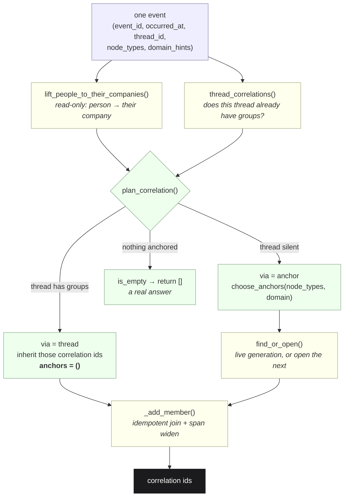
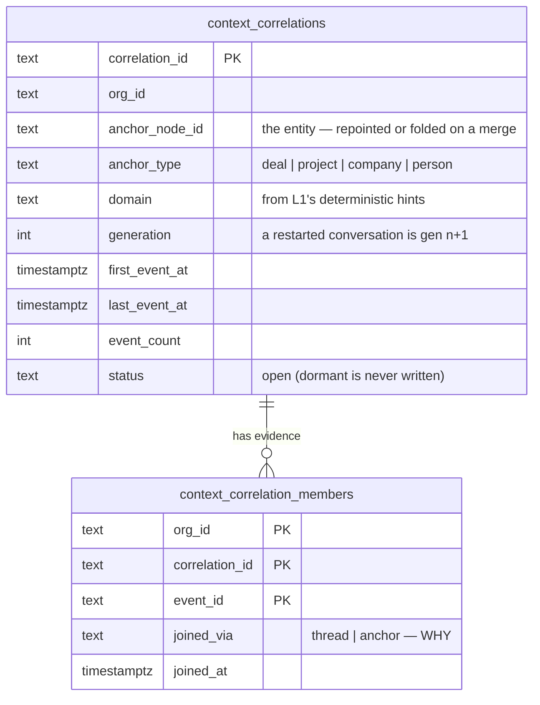

# 03 · The Cross-Correlation Engine (`context/correlation.py`)

*The moat. Four systems report one reality; this is the code that says so.*

> **The one question this engine answers: "Do these signals belong to the same thing?"**
>
> It does not prioritise, it does not score risk, it does not recommend. It groups. Every
> other opinion about the group belongs to a layer that is allowed to have opinions.

Slack says *"need pricing approval."* Email says *"customer is waiting."* The calendar holds
*"Pricing Review tomorrow."* The CRM says the deal is Enterprise. A retrieval system stores four
documents. **This stores one situation with four pieces of evidence** — which is the difference
between recalling text and understanding a company.

---

## §0 · At a glance

| | |
|---|---|
| **Module** | `genios_engine/context/correlation.py` — 356 lines, one file |
| **Migration** | `migrations/0037_l2_correlation.sql` |
| **Tables** | `context_correlations` · `context_correlation_members` |
| **Tests** | `tests/test_correlation.py` — 40 tests, **12 of them assert on source text, not behaviour** |
| **LLM calls** | **Zero.** The domain comes from Layer 1's deterministic keyword hints, never a model |
| **Call sites** | `context/pipeline.py:586` (extraction lane) · `context/structured.py:90` (structured lane) · `context/backfill.py:130` (history) |
| **Consumed by** | `context/situations.py` (1 situation per correlation) · `context/merge.py` (folding) · `context/health.py` (`correlation_reach`) · `api/situation_routes.py` (evidence list) |
| **Ever run against Postgres** | **No.** See [06 · Known Limitations](06-Known-Limitations.md) |

---

## §1 · The governing principle

> **Under-correlate rather than over-correlate.**

The two failure modes are not equal, and the whole design falls out of that asymmetry:

| Mistake | Cost |
|---|---|
| Wrongly **splitting** one situation | a duplicate card. Annoying. |
| Wrongly **merging** two situations | a **chimera**, reasoned about at full confidence — two customers' problems fused into one recommendation |

So every rule in the module fails towards *leave them apart*. This is the same instinct as the
identity rule in `platform.identity`: **when the evidence is not decisive, do nothing.**

---

## §2 · The decision, in one picture



**Pure planner, dumb persister.** Everything above the `═══` bar at `correlation.py:207` decides
and has never touched a database. Everything below only writes down what was decided. That split
is what makes the rules testable without Postgres — the same shape `graph_store.fact_write_action`
already uses.

The order in `plan_correlation` (`correlation.py:182`) *is* the engine:

1. **Thread first.** If this event's thread already has correlations, it joins those — and must
   **not also** open an anchor group, or one conversation lives in two places.
2. **Anchor otherwise.** Strongest tier of entity, plus the deterministic domain.
3. **Nothing is a valid outcome.** An event that anchors nothing correlates to nothing.

---

## §3 · What a situation is anchored on

**`(counterparty entity, domain)`** — plus a generation number that separates a restarted
conversation from the one that went cold.

```python
ANCHOR_PRIORITY: tuple[str, ...] = ("deal", "project", "company", "person")
```

Company beats person, because people change companies and a company outlives them. A deal beats
its company, because the deal *is* the business object. `project` is not written here — it is read
out of Layer 1's `ANCHORING_KINDS`, so adding an anchoring kind is one edit in one file.

Full treatment: **[01 · Anchoring](01-Anchoring.md)**.

---

## §4 · How to read this folder

| # | File | Answers |
|---|---|---|
| 01 | [**Anchoring**](01-Anchoring.md) | What a situation is *about* — `ANCHOR_PRIORITY`, `choose_anchors`, why only the strongest tier anchors, why our own company is excluded, and the `base_key` hash |
| 02 | [**Time Windows and Generations**](02-Time-Windows-and-Generations.md) | `CORRELATION_WINDOW_DAYS = 45`, `joins_window`, `merged_span`, `find_or_open`, why the test is against the **span** and not the latest event |
| 03 | [**Thread Continuity**](03-Thread-Continuity.md) | Why a thread beats an anchor, the bare-reply problem, the self-inheritance exclusion, and the untyped-null SQL trap |
| 04 | [**Both Lanes**](04-Both-Lanes.md) | Extraction lane vs structured lane vs backfill, and `lift_people_to_their_companies` — the one function that makes the headline example work |
| 05 | [**The Eight Correlators**](05-The-Eight-Correlators.md) | The correlation mechanisms an engine like this is expected to provide: which exist, which are emergent, which are **not built** |
| 06 | [**Known Limitations**](06-Known-Limitations.md) | Two deals at one company with no CRM, internal-only situations, and eight further gaps found by reading the code |

---

## §5 · Vocabulary — where the spec and the code disagree

> **The architecture spec calls this stage the *Cross-Correlation Engine*. The code calls it
> `context/correlation.py`. There is no module, class or table with "cross" in its name. The code
> wins, because the code is what runs.**

| Spec vocabulary | Code vocabulary | Note |
|---|---|---|
| Cross-Correlation Engine | `context/correlation.py` | one 356-line module, no package |
| a correlation *link* between two signals | a correlation **group** (`context_correlations`) | pairwise would be O(n²) rows and O(n²) comparisons; a deterministic group key is one lookup per event — stated in `0037_l2_correlation.sql:6-9` |
| Risk / Opportunity detection inside Layer 2 | **not here, and refused** | `situations.py:16-20` argues it: two layers with an opinion about the same thing and no way to tell which was wrong. Detection stays in the Layer 4 packs |
| `Email`, `Meeting`, `Document` as entities | **evidence, not anchors** | `choose_anchors` returns `[]` for `{"n_doc": "document", "n_meeting": "meeting"}` — pinned by `test_nothing_anchored_is_a_real_answer` |

A fifth divergence is inside the code itself: `context_correlations.status` is declared
`open | dormant` in the migration, and **nothing in the repository ever writes `dormant`.**
Dormancy is a *situation* concept (`situations.py:DORMANT_AFTER_DAYS`), not a correlation one. See
[06 · Known Limitations](06-Known-Limitations.md).

---

## §6 · The tables



Two design decisions are carried by the schema rather than by code:

* **`unique (org_id, anchor_node_id, domain, generation)`** is both the identity of a group *and*
  the concurrency guard. L2 drains with up to `GENIOS_L2_WORKERS` (default 3) workers; without it,
  two workers processing two events for the same customer in the same instant would each open
  generation 2.
* **Membership is many-to-many on purpose.** An introduction email naming two companies belongs to
  two situations; one row per event would silently drop one of them.

`joined_via` has exactly one reader — `api/situation_routes.py:100`, which returns it with each
piece of evidence. Without it, a wrong grouping is unexplainable after the fact: you can see two
events were joined, but not whether a thread or an anchor did it.

---

## §7 · A worked example, end to end

A tenant whose own seats are `@kurral.com`. Four events arrive over eleven days about one deal at
`acme.io`. Node ids are shortened for readability; the correlation ids below are the **real output**
of `stable_id` for those inputs.

| # | Event | Lane | `node_types` after lifting | thread | Result |
|---|---|---|---|---|---|
| 1 | inbound email from `john@acme.io`, text contains *"pricing"* | extraction | `{node_7f3a: company, node_p1: person}` — our own seat and `kurral.com` already removed | none yet | domain `sales` → anchors on `node_7f3a` → **opens** `corr_d8efc…d8d4` (gen 1), `joined_via=anchor` |
| 2 | our reply, same thread, text *"sounds good, thanks"* | extraction | `{}` — nothing anchored | thread has group #1 | **inherits** `corr_d8efc…d8d4`, `joined_via=thread` |
| 3 | HubSpot deal `dealstage` change, `contact_email = john@acme.io` | structured | `{node_deal: deal, node_p1: person}` → lifted to `{node_deal: deal, node_7f3a: company}` | `None` (structured lane never passes one) | `deal` outranks `company` → anchors on `node_deal` → a **second** group |
| 4 | Google Calendar invite "Pricing Review", attendees `john@acme.io` + our seat | structured | our seat dropped by `internal_emails`; `john` lifted → `{node_meeting: meeting, node_7f3a: company}` | `None` | `meeting` cannot anchor; `company` does → **joins** `corr_d8efc…d8d4` |

Three of the four events land in one group. **The fourth does not, and that is correct**: once a
deal object exists it is the sharper anchor, and events that name it belong to it. The two groups
are joined downstream by the graph (`deal → about → company`), not by fusing them here.

The arithmetic behind that id, exactly as `Anchor.base_key` and `find_or_open` compute it:

```
base_key       = "corr_" + sha256('{"domain":"sales","node":"node_7f3a"}')
               = corr_0fcceab00bf16c1af963252a425473828b9b63871ee2f91bb43cc0062aff25cd
correlation_id = "corr_" + sha256('{"base":"corr_0fcce…25cd","gen":1}')
               = corr_d8efc80b5f3e341c6df04a7a598849f9936a7dd77fd37e28528003e73179d8d4
```

Same tenant, same company, **support** domain instead of sales:
`corr_6e143640aeb75e15a33117f0d8371509c3012ba6a90fa0cf93c5ee72368871a8`. *Acme's renewal and
Acme's outage are not one problem* — pinned by `test_the_same_entity_in_two_domains_is_two_situations`.

---

## §8 · The one number to watch

`health.py:234` publishes **`correlation_reach`** — the fraction of *knowledge-bearing* events
(events that produced at least one fact) that reached a situation:

```sql
select count(*) from source_events se
where se.org_id = :o and se.outcome = 'emitted'
  and exists     (select 1 from graph_facts f              where f.created_by_event_id = se.event_id)
  and not exists (select 1 from context_correlation_members m where m.event_id = se.event_id)
```

The denominator is deliberately *events with facts*, not *all events*: a newsletter correctly
reaches no situation, and measuring against every event made normal marketing volume score 10% —
an alarm people switch off. **This is the single best signal that Layer 2 has quietly stopped
working**, which is how this layer fails: not with a crash, with silence.

---

## §9 · What this engine will never do

`test_correlation_never_scores_or_ranks` greps the module for `def priority`, `def urgency`,
`def risk_score`, `def recommend`, `def llm` and fails if any appears. The engine merges reality
and stops. Priority, risk and recommendation belong to Layer 4 — building them here would give two
layers an opinion about the same thing and no way to tell which one was wrong.
