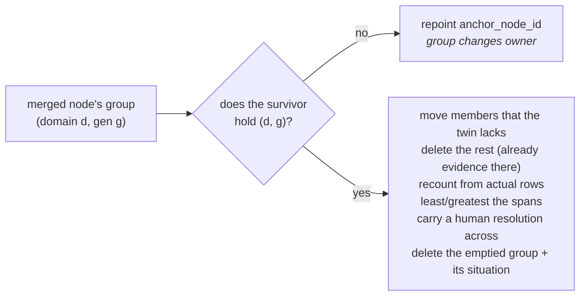

# 02 · Time Windows and Generations

*When is a new email part of the situation you already have, and when is it a new situation that
happens to be about the same customer?*

> **The renewal you lost in March is not the renewal you are working in September.**
>
> A correlation is not a folder that stays open forever. It has a **span**, a **window** around that
> span, and a **generation** number that lets a restarted conversation be a sibling of the old one
> rather than a stranger.

---

## §1 · What it is for

Anchoring answers *what*. This answers *when*. Without it, `(acme.io, sales)` would be a single
group that accumulates every sales email ever exchanged with Acme — five years of history reasoned
about as one live situation, with a `first_event_at` in 2021 and a confidence score computed over
evidence nobody remembers.

Without generations the alternative is worse: expiring a group and re-opening the **same**
`correlation_id` would rewrite history in place. Generations keep the old group findable and
intact, and start a clean one beside it.

---

## §2 · What exists

| Symbol | File | Kind | Role |
|---|---|---|---|
| `CORRELATION_WINDOW_DAYS = 45` | `correlation.py:59` | constant | how long a weak (entity+domain) group stays open to new evidence |
| `joins_window()` | `correlation.py:136` | **pure** | does this event belong to the existing group, or start a new generation? |
| `merged_span()` | `correlation.py:153` | **pure** | the group's span after admitting the event — ⚠️ **no production caller**, see §5 |
| `find_or_open()` | `correlation.py:239` | SQL | fetch the live generation, or mint the next one |
| `_add_member()` | `correlation.py:275` | SQL | idempotent membership + counter + span widening |
| `generation` column | `0037_l2_correlation.sql:22` | schema | `int not null default 1` |
| `unique (org_id, anchor_node_id, domain, generation)` | `0037_l2_correlation.sql:32` | schema | identity **and** concurrency guard |

---

## §3 · The constant

```python
CORRELATION_WINDOW_DAYS = 45
```

The comment states the reasoning in full: *a conversation that has been silent this long and then
restarts is a NEW situation, not a continuation.* **Threads are exempt** — a reply after six months
is still that thread, because `plan_correlation` never reaches the window code when a thread has
correlations (see [03 · Thread Continuity](03-Thread-Continuity.md)).

Why 45 and not 30 or 90? Three things agree on this number, and that agreement is the argument:

| Where | Value | Meaning |
|---|---|---|
| `correlation.py:59` | `CORRELATION_WINDOW_DAYS = 45` | a group stops accepting new evidence |
| `situations.py:70` | `DORMANT_AFTER_DAYS = 45` — *"matches the correlation window"* | a situation stops competing for attention |
| `api/routes.py:1280-1287` | `<14d active · 14–45d cooling · >45d dormant` | how a relationship's age is labelled in the API |

45 days is roughly a quarter's half-life: long enough that a two-week holiday, a procurement delay
or a slow legal review does not fork a live deal in two; short enough that a deal which died last
quarter does not contaminate the one starting now. **It is a judgement, not a derivation** — it was
picked, it is consistent across three modules, and it is one constant to change.

---

## §4 · `joins_window` — the arithmetic

```python
if event_at is None:
    return False                     # undated evidence never extends a window
if group_first is None or group_last is None:
    return True                      # an empty group accepts its first event
window = timedelta(days=window_days)
return (group_first - window) <= event_at <= (group_last + window)
```

In plain arithmetic, with `W = 45 days`:

```
join  ⟺  first − W  ≤  event_at  ≤  last + W
```

**The test is against the SPAN, not the latest event.** That single choice is the whole point of the
function, and it fixes a bug that would have made correlation quietly worse after every outage:

> A connector recovering from an outage delivers **old events after new ones**. Measuring only from
> `last_event_at` would push those late arrivals outside the window, open a fresh generation, and
> **split one situation in two.** Nothing would crash. The groups would simply get smaller and more
> numerous every time a sync fell behind.

Worked truth table. `NOW = 2026-08-06 12:00Z`; offsets are days relative to it; results are the
real return values of the function:

| `group_first` | `group_last` | `event_at` | lower bound | upper bound | result | reading |
|---|---|---|---|---|---|---|
| −10 | −1 | 0 | −55 | +44 | `True` | a live conversation stays one situation |
| −55 | −55 | 0 | −100 | −10 | `False` | 55 days of silence → a new generation |
| −5 | 0 | −20 | −50 | +45 | `True` | **the outage case** — a late old event joins |
| 0 | 0 | −46 | −45 | +45 | `False` | older than the whole window → still forks |
| −60 | −50 | 0 | −105 | −5 | `False` | the group ended too long ago |
| −60 | −40 | 0 | −105 | **+5** | `True` | *same start, later end* — the span is what decides |

The last two rows are the same group start and the same incoming event, differing only in when the
group last saw activity. Under a "latest event only" rule the fifth row would also be `False` — but
so would the third, and the third is the one that matters.

**Two guards, in this order, and the order matters:**

1. `event_at is None → False`. No `occurred_at` means no evidence about *when*. Letting it join
   would silently stretch a situation's span to include a period nothing happened in
   (`test_an_undated_event_never_extends_a_window`).
2. `group_first is None or group_last is None → True`. An empty group accepts its first event
   (`test_an_empty_group_accepts_its_first_event`).

Because guard 1 comes first, **an undated event does not even join an empty group.** In production
that path is unreachable: `source_events.occurred_at` is `timestamptz not null`
(`migrations/0001_initial.sql:14`) and all three call sites read that column. It is a defensive
guard, and §7 records the latent hazard it leaves for a future caller.

---

## §5 · `merged_span` — correct, tested, and never called

```python
def merged_span(*, group_first, group_last, event_at) -> tuple[datetime | None, datetime | None]:
    if event_at is None:
        return group_first, group_last
    first = event_at if group_first is None else min(group_first, event_at)
    last  = event_at if group_last  is None else max(group_last,  event_at)
    return first, last
```

Widening in **both** directions is right for the same reason as the window: a late-arriving old
event legitimately moves the *start* of a situation backwards.

> **⚠️ Code truth: `merged_span` has no production caller.** A repository-wide grep finds it in
> exactly two places — its definition in `correlation.py:153` and two assertions in
> `tests/test_correlation.py`. The real widening happens **in SQL**, inside `_add_member`:
>
> ```sql
> update context_correlations set event_count = event_count + 1,
>   first_event_at = least(first_event_at, coalesce(:at, first_event_at)),
>   last_event_at  = greatest(last_event_at, coalesce(:at, last_event_at)),
>   status = 'open', updated_at = now()
> where org_id = :o and correlation_id = :c
> ```
>
> The two implementations agree — `least`/`greatest` ignore NULLs, and `coalesce(:at, …)` makes an
> undated event a no-op — so this is a duplicate specification, not a divergence. But it is a
> duplicate: **a change to the Python widening rule would pass its tests and change nothing in
> production.** That is the exact failure shape this codebase is most exposed to.

---

## §6 · `find_or_open` — generations, ids, and the race

```python
latest = conn.execute(text(
    "select correlation_id, generation, first_event_at, last_event_at "
    "from context_correlations where org_id=:o and anchor_node_id=:n and domain=:d "
    "order by generation desc limit 1"), {...}).first()

if latest is not None and joins_window(group_first=latest.first_event_at,
                                       group_last=latest.last_event_at,
                                       event_at=event_at):
    return latest.correlation_id

generation = (latest.generation + 1) if latest is not None else 1
correlation_id = stable_id("corr", {"base": anchor.base_key, "gen": generation})
conn.execute(text(
    "insert into context_correlations (...) values (...) "
    "on conflict (org_id, anchor_node_id, domain, generation) do nothing"), {...})
return conn.execute(text(
    "select correlation_id from context_correlations where org_id=:o "
    "and anchor_node_id=:n and domain=:d and generation=:g"), {...}).scalar()
```

Four things are happening here.

**1 · Only the newest generation is consulted.** `order by generation desc limit 1`. An event that
falls outside the newest generation's window never gets tested against generation 1 — it opens a new
one. That is intentional and it is why generations are monotonic: the alternative (searching every
generation for a fit) would let a late event resurrect a group from two years ago.

**2 · The id is a hash of `(base_key, generation)`.**

```
correlation_id = "corr_" + sha256('{"base":"<base_key>","gen":<n>}')
```

Real values for `node_7f3a` in `sales` (`base_key = corr_0fcceab0…25cd`):

| generation | `correlation_id` |
|---|---|
| 1 | `corr_d8efc80b5f3e341c6df04a7a598849f9936a7dd77fd37e28528003e73179d8d4` |
| 2 | `corr_4a541095e4836cc7cb3d71cee475f88f397a854df63a35f0a1d2bd104a729e47` |

Deterministic, so a replay produces the same ids; and the generation lives **outside** `base_key`,
so the two generations are visibly siblings of one base rather than unrelated rows.

**3 · The insert is conflict-tolerant on purpose, and then it re-reads.** L2 drains with several
workers (`GENIOS_L2_WORKERS`, default 3), so two events for the same customer can be processed in
the same instant. Both compute the same "next generation", both attempt the insert, and one loses
the race. It must **re-read rather than raise** — the winner's row is the one every later event has
to join. `on conflict … do nothing` plus an unconditional re-select is what makes both workers agree
on the same `correlation_id`.

**4 · The unique constraint is the guard that makes step 3 safe.**
`unique (org_id, anchor_node_id, domain, generation)` is what turns a double insert into a no-op
instead of two rival groups. It is also the constraint that makes an entity merge dangerous — see
§8.

---

## §7 · `_add_member` — idempotent membership

```python
inserted = conn.execute(text(
    "insert into context_correlation_members (org_id, correlation_id, event_id, joined_via) "
    "values (:o, :c, :e, :via) on conflict do nothing"), {...}).rowcount
if not inserted:
    return False
# … then the counter + span update shown in §5
```

The counter follows the membership row, not the call. **Incrementing on a replayed event would
inflate a situation's evidence count without adding any evidence** — and `event_count` feeds the
`evidence` dimension of a situation's confidence vector, so an inflated count is a directly
misleading confidence score. The primary key `(org_id, correlation_id, event_id)` is what makes the
conflict detectable.

`status = 'open'` is written on every join. Nothing anywhere in the repository writes `'dormant'` —
see §9.

> **Latent hazard, precisely scoped.** If a future caller ever passes `occurred_at=None`, the
> undated guard in `joins_window` returns `False` for *every* comparison, including against a group
> whose span is `(NULL, NULL)`. `find_or_open` would then open generation *n+1* on every such event,
> each new group holding exactly one member, and a replay of the same undated event would create yet
> another. Today all three call sites read `source_events.occurred_at`, which is `not null`, so this
> cannot happen. There is no test pinning it.

---

## §8 · Generations and entity merges

Two customers turn out to be one customer. `merge.py:_merge_correlations` runs **before** the
generic repoint loop, and `context_correlations.anchor_node_id` is deliberately excluded from
`_NODE_REFERENCES` (`merge.py:51-54`), because:

> A blind `update anchor_node_id` trips `unique (org, anchor, domain, generation)` the moment both
> nodes hold a situation in the same domain **and generation** — which is precisely the case when
> they really were the same customer. Postgres would roll the entire merge back.

So the merge **folds** instead, per generation:



Two details that are easy to get wrong and are not:

* **`event_count` is recounted, never summed.** `count(*) from context_correlation_members` after
  the move. The same email often reached **both** nodes before we knew they were one; summing would
  claim more evidence than exists (`test_folding_recounts_evidence_instead_of_adding_it`).
* **The span widens across both groups** with `least(c.first_event_at, :cf)` /
  `greatest(c.last_event_at, :cl)`, and `least`/`greatest` ignore NULLs so a group that never had a
  dated event does not blank out the other's span (`test_folding_widens_the_span_across_both_groups`).

---

## §9 · `status` — a column with no writer

`0037_l2_correlation.sql:26` declares `status text not null default 'open' -- open | dormant`, and
indexes it: `context_correlations_open on (org_id, status, last_event_at desc)`.

**Nothing in the repository ever sets `dormant` on a correlation.** `_add_member` writes `'open'`;
no other statement touches the column. `situations.py:293-296` reads every correlation for the org
with no status filter, so the index has no reader either.

This is not a defect that breaks anything — dormancy was implemented one level up, on
`context_situations`, where `DORMANT_AFTER_DAYS = 45` genuinely fires. It is a documentation defect
in the schema: the comment promises a lifecycle the table does not have. Recorded in
[06 · Known Limitations](06-Known-Limitations.md).

---

## §10 · A worked timeline

One anchor: `node_7f3a` (`acme.io`), domain `sales`. Real ids.

| Date | Event | `latest` row seen | `joins_window` | Outcome |
|---|---|---|---|---|
| 1 Mar | first pricing email | none | — | opens **gen 1** `corr_d8efc80b…d8d4`, span `[1 Mar, 1 Mar]` |
| 12 Mar | proposal sent | gen 1, span `[1 Mar, 1 Mar]` | `1 Mar−45 ≤ 12 Mar ≤ 1 Mar+45` → `True` | joins gen 1, span → `[1 Mar, 12 Mar]` |
| 20 Mar | connector outage; the **6 Mar** reply finally lands | gen 1, span `[1 Mar, 12 Mar]` | `1 Mar−45 ≤ 6 Mar` → `True` | joins gen 1, span unchanged (6 Mar is inside) — **no fork** |
| 2 Sep | *"reviving this — new budget approved"*, no thread id | gen 1, span `[1 Mar, 12 Mar]` | `12 Mar+45 = 26 Apr < 2 Sep` → `False` | opens **gen 2** `corr_4a541095…9e47`, span `[2 Sep, 2 Sep]` |
| 3 Sep | reply on the September thread | — | thread wins; window never consulted | joins gen 2 via `thread` |

Generation 1 keeps its three events, its span and its situation. The March deal stays answerable;
the September deal starts clean.

---

## §11 · Tests

| Test | Property |
|---|---|
| `test_a_live_conversation_stays_one_situation` | inside the window joins |
| `test_a_long_silence_starts_a_new_situation` | 55 days of silence forks |
| `test_a_late_arriving_event_joins_instead_of_forking` | **the outage bug**, pinned |
| `test_an_event_older_than_the_whole_window_still_forks` | `W+1` days before the start forks |
| `test_an_undated_event_never_extends_a_window` | guard 1 |
| `test_an_empty_group_accepts_its_first_event` | guard 2 |
| `test_the_span_widens_in_both_directions` | `merged_span`, both directions |
| `test_an_undated_event_does_not_move_the_span` | `merged_span` no-op |
| `test_an_entity_merge_folds_situations_instead_of_repointing_them` | the unique-constraint trap |
| `test_folding_recounts_evidence_instead_of_adding_it` | recount, never sum |
| `test_folding_widens_the_span_across_both_groups` | `least`/`greatest` |

**None of these touch a database.** `find_or_open`, `_add_member`, the generation counter, the
`on conflict` race and the unique constraint have **no behavioural test at all** — the four tests in
the merge block assert on source text. That gap is the subject of [06](06-Known-Limitations.md).
