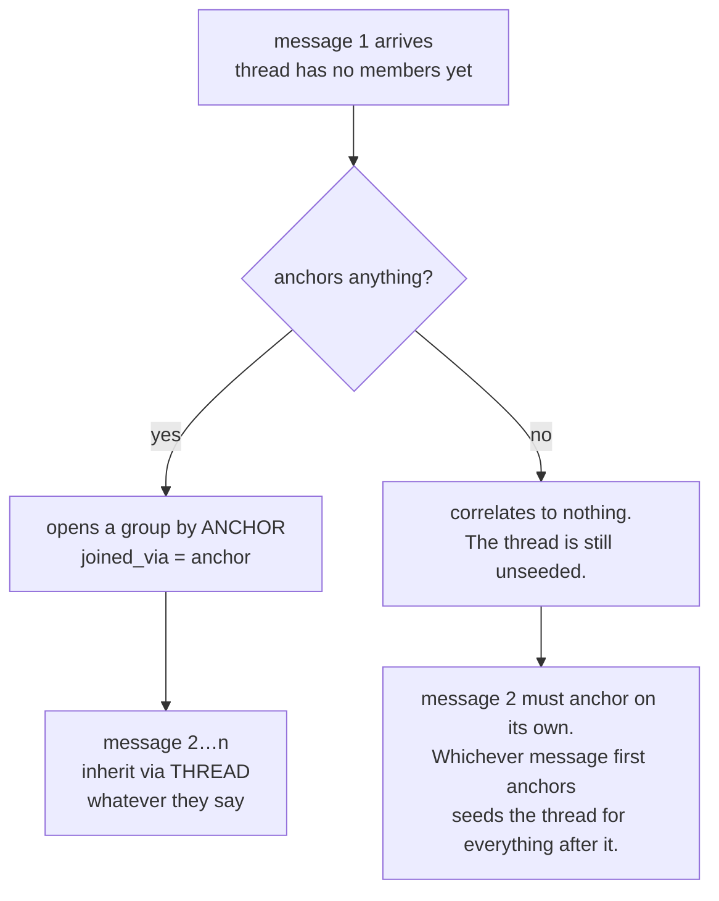

# 03 · Thread Continuity — why a thread beats an anchor

*"sounds good, thanks"*

> **A thread id is a HARD join.** An event that shares a thread with already-correlated events joins
> those correlations **whatever its own anchor says** — and must not *also* open an anchor group.
>
> Thread is checked **first**. The anchor key is only consulted when the thread is silent.

---

## §1 · What it is for — the bare-reply problem

Take the fifth message in a real deal thread:

```
From: john@acme.io
Subject: Re: Re: Re: Pricing for the Q3 rollout
Body:    sounds good, thanks
```

Run it through the anchoring rules on its own merits:

* **Entities:** the sender resolves to a person, and the person's domain resolves to Acme — so far
  so good. But now take the equally common variant where the reply comes from a mobile client with
  no signature, the extractor finds no entity mentions, and the sender is one of *our* seats
  forwarding internally. `node_types` after the internal filter is `{}`.
* **Domain:** *"sounds good, thanks"* contains none of L1's keywords → `general`, not `sales`.

Without thread inheritance that reply either lands nowhere or lands in a **different** group
(`(acme.io, general)` instead of `(acme.io, sales)`). Multiply by every reply in every conversation
and you get the failure the module's docstring names explicitly:

> *Without thread inheritance every reply in a conversation becomes its own island, which is the
> failure mode that makes correlation look like it is working while it does nothing.*

That is the signature of this whole engine's worst failure mode: not a crash, not a wrong answer —
**silence that looks like success.** `correlation_reach` would even look healthy, because a reply
that opens its own singleton group *is* correlated.

---

## §2 · What exists

| Symbol | File | Role |
|---|---|---|
| `JOINED_VIA_THREAD = "thread"` | `correlation.py:83` | the `joined_via` value written on the membership row |
| `JOINED_VIA_ANCHOR = "anchor"` | `correlation.py:84` | the other one |
| `thread_correlations()` | `correlation.py:213` | SQL — which groups already hold events from this thread |
| `plan_correlation()` | `correlation.py:182` | the ordering: thread → anchor → nothing |
| `CorrelationPlan.via` | `correlation.py:174` | records **why** these groups were chosen |
| `source_events.parent_object_id` | `migrations/0001_initial.sql:11` | where the thread id lives |

---

## §3 · How it works

### 3.1 · Where the thread id comes from

Layer 1 stores the provider's conversation id on the event envelope as `parent_object_id`. The L2
drain reads it and hands it through unchanged (`runner.py:91`):

```python
thread_id=getattr(row, "parent_object_id", None),
```

There is no thread *node* and no thread *entity* involved. The thread is a **join key on the ledger**,
not a graph object — which is why it can carry continuity without being able to anchor anything.

### 3.2 · The lookup

```python
rows = conn.execute(text(
    "select distinct m.correlation_id from context_correlation_members m "
    "join source_events se on se.org_id = m.org_id and se.event_id = m.event_id "
    "where m.org_id = :o and se.parent_object_id = :thread " + exclusion),
    params).fetchall()
return sorted(r.correlation_id for r in rows)
```

Read it as: *find every event that belongs to this thread and is already a member of some group;
return those groups.* Four properties:

* **`if not thread_id: return []`** — no thread is not an error, it is the ordinary case for
  calendar events, CRM rows and uploads.
* **`distinct` + `sorted`** — the same group reached through ten thread messages is returned once,
  and the order is total. Never "whatever order the rows arrived in".
* **`org_id` on both sides of the join** — tenant isolation is in the predicate, not in a wrapper.
* **The join is to `source_events`, not to a correlation column.** The thread id is never copied
  into the correlation tables, so there is nothing to keep in sync.

### 3.3 · `exclude_event_id` — why an event may not inherit from itself

```python
params: dict[str, str] = {"o": org_id, "thread": thread_id}
exclusion = ""
if exclude_event_id:
    exclusion = "and m.event_id <> :excl "
    params["excl"] = exclude_event_id
```

`correlate_event` always passes `exclude_event_id=event_id`. On a **replay** — a rebuild, a backfill
that overlaps, a re-drain after a fix — the event being processed may already be a member of the
groups it originally *opened by anchor*. Without the exclusion the replay would see its own
membership, take the thread branch, and report `via="thread"` for an event that was and should
remain an anchor join. The docstring's phrasing: *so a re-run cannot inherit from itself and pin an
event to a group it originally opened for a different reason.*

**The exclusion is composed in Python rather than passed as a nullable bind, and that is a scar.**

```python
# A bare `:param is null` gives Postgres no type to infer and raises "could not determine
# data type of parameter" — a failure that would only appear against a real database,
# long after the tests looked green.
```

The obvious one-liner — `and (:excl is null or m.event_id <> :excl)` — is a runtime error in
Postgres, not a style preference. `test_no_query_binds_an_untyped_null` asserts that the string
`":excl is null"` does not appear anywhere in the module. It is a source-text test, and in this one
case that is the right instrument: the property being protected *is* a property of the SQL text.

### 3.4 · The ordering, in `plan_correlation`

```python
if thread_correlation_ids:
    return CorrelationPlan(anchors=(), via=JOINED_VIA_THREAD,
                           inherited_correlation_ids=tuple(dict.fromkeys(thread_correlation_ids)))
domain = resolve_domain(domain_hints)
return CorrelationPlan(anchors=tuple(choose_anchors(node_types, domain)), via=JOINED_VIA_ANCHOR)
```

* **`anchors=()` on the thread branch is not laziness — it is the rule.** The fifth email in a
  thread that happens to mention *"pricing"* must not fork the conversation into a second,
  sales-domain situation. And it must not land in **both**: *one conversation living in two places
  is the same corruption as two conversations in one* (`test_a_thread_beats_the_events_own_anchor`).
* **`dict.fromkeys` deduplicates while preserving order.** Two facts from one event pointing at the
  same group must not join it twice (`test_a_repeated_thread_correlation_is_not_doubled`). `set()`
  would deduplicate too — and destroy the order, which would make the plan non-deterministic.
* **A thread spanning two groups joins both.** A reply on a thread that was itself an introduction
  to two companies belongs to both (`test_a_thread_spanning_two_situations_joins_both`).

Then, in `correlate_event`:

```python
correlation_ids = list(plan.inherited_correlation_ids) or [
    find_or_open(conn, org_id=org_id, anchor=anchor, event_at=occurred_at)
    for anchor in plan.anchors]
```

The `or` is what makes the two branches mutually exclusive at the persistence layer as well as the
planning layer. On the thread branch **`find_or_open` is never called**, which has a consequence
worth stating plainly:

> **Thread inheritance bypasses the 45-day window entirely.** A reply to a two-year-old thread joins
> the two-year-old group — including a generation that has long since gone cold. This is deliberate
> (*"threads are exempt: a reply after six months is still that thread"*, `correlation.py:58`) and
> it is also the sharpest edge in the design. See [06 · Known Limitations](06-Known-Limitations.md).

---

## §4 · How a thread gets its first group

Thread inheritance is a **continuity** mechanism, not an origination mechanism. It can only hand out
groups that already exist, which means every thread has a seed problem:



Consequences that follow directly from this, and are true of the code as written:

* **A noise first message never seeds a thread.** `pipeline.py:586` is
  `correlations = [] if is_noise else correlate_event(...)`, so a newsletter or automated alert
  writes no membership row at all. If someone replies to a newsletter, that reply must anchor on its
  own merits.
* **The seed does not have to be message 1.** If messages 1–3 anchor nothing and message 4 names a
  company, message 4 opens the group by anchor and messages 5+ inherit it. Messages 1–3 stay
  uncorrelated — they are not retroactively pulled in by the live path. A
  `POST /situations/backfill` will pick them up, because `backfill_correlations` walks events
  `order by se.occurred_at asc nulls last` and by the time it reaches message 4's successors the
  group exists.
* **The backfill's ordering is load-bearing for exactly this reason.** Processing history newest
  first would make later replies seed groups that earlier messages then fail to join.

---

## §5 · Worked example — one thread, five messages

Tenant seats are `@kurral.com`. Thread id `t_9f21`. `corr_A` = the group opened by message 1.

| # | Message | `node_types` | `thread_correlations()` | Plan | Row written |
|---|---|---|---|---|---|
| 1 | inbound from `john@acme.io`, *"can you send pricing for the Q3 rollout?"* | `{p_john: person, n_acme: company}` | `[]` — thread empty | `via=anchor`, anchors `[n_acme]`, domain `sales` | member of `corr_A`, `joined_via=anchor` |
| 2 | our reply, quotes the price | `{}` after the internal filter | `[corr_A]` | `via=thread` | member of `corr_A`, `joined_via=thread` |
| 3 | `john`: *"sounds good, thanks"* | `{p_john: person, n_acme: company}` | `[corr_A]` | `via=thread`, **anchors = ()** | member of `corr_A`, `joined_via=thread` |
| 4 | `john` forwards to `priya@acme.io`, text mentions *"outage last week"* | `{p_john, p_priya, n_acme}` | `[corr_A]` | `via=thread` — the `support` keyword is **ignored** | member of `corr_A` |
| 5 | a *new* email, no thread id, *"raising a ticket — the API is down"* | `{p_john: person, n_acme: company}` | `[]` — no thread | `via=anchor`, domain `support` | opens `corr_B` — a **different** situation |

Message 4 and message 5 carry the same keyword and the same company. One joins the sales
conversation; the other opens a support situation. **That is the intended behaviour**: a support
complaint buried inside a pricing thread is part of that negotiation, and a fresh support email is
its own problem.

The cost is visible in the same table: **message 4's `support` signal is invisible to any consumer
that filters situations by domain.** Its facts are in the graph either way — only the grouping is
decided here — but the `(acme.io, support)` situation will not list it as evidence. That is the
price of "thread wins", paid knowingly.

---

## §6 · Edge cases

**The structured lane never uses threads.** `structured.py:92` passes `thread_id=None` literally. A
calendar event and a CRM row have no conversation to continue, and the provider's own recurrence id
is not a business thread. Those lanes are anchor-only, always.

**`joined_via` is per membership row, not per group.** One group routinely holds both kinds. The
situation detail endpoint (`api/situation_routes.py:100`) returns it with each piece of evidence, so
"why is this email in this situation?" is answerable from the API without reading code.

**An event can inherit groups anchored on someone else entirely.** A thread that began as an
introduction between two companies keeps both groups; a later reply that names only one of them
still joins both. This is the correct reading of a forwarded conversation, and it is the only path
by which an event joins a group whose anchor it never touched.

**Thread inheritance ignores the domain completely.** There is no check that the inherited group's
domain matches the event's own hints. Message 4 above lands in a `sales` group while its own hints
say `support`. Deliberate, and a real source of "why is this here?" questions.

---

## §7 · Tests

| Test | Property |
|---|---|
| `test_a_bare_reply_inherits_its_conversation` | the headline case: no anchors, no hints, still correlated |
| `test_a_thread_beats_the_events_own_anchor` | thread wins **and** anchors stay empty |
| `test_a_thread_spanning_two_situations_joins_both` | fan-out preserved |
| `test_a_repeated_thread_correlation_is_not_doubled` | `dict.fromkeys` |
| `test_a_first_email_with_no_thread_uses_its_anchor` | the anchor branch still works |
| `test_an_unanchored_threadless_event_correlates_to_nothing` | `is_empty` |
| `test_the_decision_is_pure_and_repeatable` | same inputs → same plan, always |
| `test_no_query_binds_an_untyped_null` | the Postgres type-inference trap |

`thread_correlations` itself — the SQL, the join, the exclusion clause — has **no behavioural test**.
Everything above tests `plan_correlation` with a hand-supplied list of ids.
