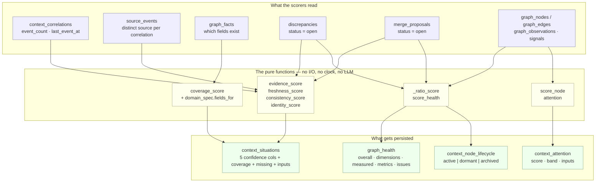

# The Context Quality Engine — Overview

*Layer 2 · `genios_engine/context/` · the part of the layer that scores its own output*

> **What does "quality" mean in a system that is forbidden from having opinions — and how
> does a number that is only ever a *minimum* stop a strong dimension from hiding a fatal
> one?**

| | |
|---|---|
| **Spec name** | *Context Quality Engine* — a unit in the GeniOS System Design Atlas |
| **Code** | **There is no module called `quality.py`.** The unit is three files that share one rule set |
| | [context/situations.py](../../../genios_engine/context/situations.py) · 464 lines — the confidence vector and coverage |
| | [context/health.py](../../../genios_engine/context/health.py) · 397 lines — graph integrity and health metrics |
| | [context/attention.py](../../../genios_engine/context/attention.py) · 166 lines — per-node "look here first" |
| **Supporting** | [context/domain_spec.py](../../../genios_engine/context/domain_spec.py) · 176 lines — what a domain expects to know |
| | [context/graph_store.py](../../../genios_engine/context/graph_store.py) · 308 lines — where a conflict gets *recorded* |
| **Tables** | `context_situations` · `graph_health` · `context_node_lifecycle` · `context_attention` · `discrepancies` · `merge_proposals` |
| **Migrations** | [`0004_l2_context_graph.sql`](../../../migrations/0004_l2_context_graph.sql) · [`0028_l2_context.sql`](../../../migrations/0028_l2_context.sql) · [`0038_l2_situations.sql`](../../../migrations/0038_l2_situations.sql) · [`0039_l2_graph_health.sql`](../../../migrations/0039_l2_graph_health.sql) |
| **Tests** | [test_situations.py](../../../tests/test_situations.py) · 46 tests · [test_graph_health.py](../../../tests/test_graph_health.py) · 24 tests · [test_attention.py](../../../tests/test_attention.py) · 6 tests |
| **LLM calls** | **Zero, and test-enforced** — `test_situations.py::test_no_llm_builds_a_situation` greps the module source for the string `llm` |

> **A note on names — the code wins.**
> The spec calls this the **Context Quality Engine**. The code has no such module, no such
> class, and no such import. What exists is a set of pure scoring functions living beside
> the things they score: confidence in `situations.py`, graph health in `health.py`,
> attention in `attention.py`. This folder documents those functions. **Do not go looking
> for `context/quality/` — it does not exist**, and inventing it later would put a fourth
> copy of the same minimum-not-average rule in the codebase.

---

## 1 · What "quality" means here

Layer 2 answers exactly one question — *"what is true right now?"* — and is forbidden from
answering *"what should we do about it?"* That constraint is what makes quality a
first-class output rather than an afterthought.

If the layer is not allowed to say *"this deal is at risk"*, the only useful thing it can
hand upward besides the facts themselves is **how much the facts are worth**. So Layer 2
publishes four separate quality measurements, and each answers a different question:

| Measurement | Scope | Question | Where |
|---|---|---|---|
| **Confidence** | one situation | *Can I trust this?* | [01 · Confidence Vector](01-Confidence-Vector.md) |
| **Coverage** | one situation | *Is this complete?* | [02 · Coverage and Missing](02-Coverage-and-Missing.md) |
| **Discrepancies** | one (entity, field) | *Do the sources agree?* | [03 · Conflict Detection](03-Conflict-Detection.md) |
| **Health** | the whole graph | *Is the substrate still trustworthy?* | [04 · Graph Health Metrics](04-Graph-Health-Metrics.md) |
| **Attention** | one entity | *Where should a reader look first?* | [05 · Attention](05-Attention.md) |

They are deliberately not one number. A single "quality: 71%" would be unactionable —
[api/situation_routes.py](../../../genios_engine/api/situation_routes.py) says so in its own
module docstring:

> Confidence comes back as a VECTOR, not one number, because a caller needs to know WHY it
> is low. "82% overall, 12% identity" tells you to go resolve a duplicate. "82%" tells you
> nothing you can act on.

---

## 2 · The five rules every scorer in this folder obeys

These are not conventions. Each one has a test that fails if you break it, and each one
exists because breaking it produced a real defect that shipped green.

### R1 · `overall` is the MINIMUM, never the average

Applies to both `score_situation` and `score_health`. The dimensions are **failure modes,
not features**; averaging lets a strong one conceal a fatal one.

```python
# situations.py:209
overall=min(trust), ...
# health.py:246
overall=min(live) if live else 100,
```

Enforced by `test_situations.py::test_overall_is_the_minimum_not_the_average` and
`test_graph_health.py::test_overall_is_the_minimum_not_the_average`.

### R2 · An unmeasurable dimension is EXCLUDED, not zeroed

Evidence with no timestamps says nothing about currency. Scoring that `0` would convert
missing data into bad news and drag every otherwise-solid situation to the floor.

| Engine | Mechanism | Marker |
|---|---|---|
| `situations.py` | `freshness_score` returns `(score, known)`; `freshness` joins `trust` only when `known` | `inputs["freshness_known"]` |
| `health.py` | `_ratio_score` returns `(score, measured)`; `overall = min(live)` over measured only | `Health.measured[name]` |

### R3 · Completeness is not correctness

Coverage is computed, persisted, and returned **beside** `overall` — never inside it.
`test_situations.py::test_missing_information_never_lowers_confidence` pins it: a sparse
situation and a complete one with identical evidence have **identical `overall`**.

### R4 · A conflict is recorded, never resolved

`graph_store.write_fact` writes a row to `discrepancies` and **keeps the held value**. No
code path in the repository ever closes one. See [03 · Conflict Detection](03-Conflict-Detection.md)
for the consequence, which is not small.

### R5 · A quality score may ORDER. It may never GATE.

The constitutional rule of Layer 2, and it appears here twice — attention scores and
lifecycle states. Both are enforced by a test that walks `genios_engine/reason/**/*.py`
looking for the table name:

```python
# tests/test_attention.py:54
def test_attention_never_gates_evaluation():
    root = Path(__file__).resolve().parents[1] / "genios_engine" / "reason"
    offenders = [py.name for py in root.rglob("*.py")
                 if "context_attention" in py.read_text()]
    assert not offenders
```

The loop it prevents: low attention → never evaluated → produces no signals → attention
never rises. *The customer who went silent is the one the system would go permanently blind
to.*

---

## 3 · The map



---

## 4 · This folder

| # | Document | Answers |
|---|---|---|
| 01 | [**The Confidence Vector**](01-Confidence-Vector.md) | The four trust dimensions, every constant, why `overall` is the minimum, why an unknown dimension is excluded rather than zeroed |
| 02 | [**Coverage and Missing**](02-Coverage-and-Missing.md) | `coverage_score`, why coverage sits outside `overall`, the domain-spec expected fields, and why checking the anchor node alone was worse than useless |
| 03 | [**Conflict Detection**](03-Conflict-Detection.md) | `fact_write_action`, the `discrepancy` branch, how a conflict is recorded rather than resolved — and what happens because nothing ever closes one |
| 04 | [**Graph Health Metrics**](04-Graph-Health-Metrics.md) | The eight integrity checks, the seven health dimensions, `_ratio_score`, why an empty graph scores 100 not 0, and why `correlation_reach` is the single best alarm |
| 05 | [**Attention**](05-Attention.md) | `score_node`'s six components and their exact arithmetic, the bands, and the constitutional never-gates rule |

---

## 5 · When each scorer runs

Nothing here is computed on demand at read time. Every score is precomputed and persisted,
because the read surfaces (`GET /situations`, `GET /graph/health`) must be cheap.

| Scorer | Trigger | Cadence | Code |
|---|---|---|---|
| `refresh_attention` | end of the L2 drain, when anything changed | per drain | [runner.py:190](../../../genios_engine/context/runner.py) |
| `refresh_situations` | after attention, same condition | per drain | [runner.py:202](../../../genios_engine/context/runner.py) |
| `refresh_node_lifecycle` | the scheduler sweep, per org | hourly-scale | [api/routes.py:327](../../../genios_engine/api/routes.py) |
| `compute_health` | the scheduler sweep, per org | hourly-scale | [api/routes.py:328](../../../genios_engine/api/routes.py) |
| `purge_old_health` | the scheduler sweep, per org | hourly-scale, keeps 180 days | [api/routes.py:329](../../../genios_engine/api/routes.py) |

Health and lifecycle are on the **sweep**, not the drain, and the comment in `routes.py`
says why:

> Here rather than in the L2 drain because both are O(graph), not O(event): running them
> per event would make every email pay for a whole-tenant scan.

Both refreshes in the drain are wrapped in `except Exception` and are **never fatal** —
`test_situations.py::test_a_failed_refresh_never_blocks_ingestion` asserts the `except`
appears within 400 characters of the `refresh_situations` call. Every value is derived, so a
broken refresh costs one cycle, not data.

The sweep logs a warning for any org scoring below **80** overall:

```python
# api/routes.py:331
if health.overall < 80:
    unhealthy.append({"org_id": org, "overall": health.overall,
                      "issues": [i["kind"] for i in health.issues]})
```

---

## 6 · Where the code and the spec disagree

| Spec says | Code does | Why the code wins |
|---|---|---|
| A **Context Quality Engine** module | Three files with shared rules; no module of that name | Quality is a property of a thing, and the score lives next to the thing it scores. A fourth home for the minimum-not-average rule would be a fourth place for it to drift |
| A **Risk Detector** and **Opportunity Detector** live in Layer 2 | Both stay in the Layer 4 packs | The same spec says context never decides. Two layers detecting risk = no way to tell which one was wrong. `test_situations.py::test_situations_never_carry_priority_or_risk` greps the module for `def risk_score`, `def priority`, `def recommend`, `def urgency` |
| A **Pruning Engine**, so the graph "never grows forever" | Pruning is **archival**, never deletion | Volume is controlled at Layer 1's gate. Anything in the graph passed that bar, so deleting it destroys evidence a human needs to explain a decision already made. `test_graph_health.py::test_nothing_in_maintenance_deletes_graph_data` greps `health.py` for `delete from graph_nodes/facts/edges/observations` |

---

## 7 · Gaps — what is measured but not yet used

Honest status, verified by grep across `genios_engine/`.

| # | Gap | Evidence |
|---|---|---|
| 1 | **Nothing in `reason/` reads a situation.** `situations.py`'s own docstring says *"The Reasoning Engine should never wake up and ask for the graph. It should ask for the active situations."* Today the only consumers of `context_situations` are the HTTP routes, `projections.py`, `health.py`'s own metrics, and `merge.py` | `grep -rn "context_situations\|active_situations" genios_engine` returns no hit under `reason/` |
| 2 | **Two of the eight integrity checks feed no health dimension.** `alias_to_closed_node` and `correlation_on_closed_node` are computed, reported in `Health.issues`, and score nothing | [health.py:223–235](../../../genios_engine/context/health.py) — compare the dimension table against `_INTEGRITY_CHECKS` |
| 3 | **A discrepancy is never closed.** `status` defaults to `'open'` and no `update discrepancies` exists anywhere in the repo. So `consistency` decays monotonically and three conflicts on one entity pin its confidence to 0 forever | [03 · Conflict Detection §5](03-Conflict-Detection.md) |
| 4 | **None of this SQL has ever run against Postgres.** The test suite has no database; every SQL-dependent behaviour is pinned by source-text assertions instead | [`Rohit_Updates/Layer 2.md` Part 4](../../../Rohit_Updates/Layer%202.md) |

> **The one thing to fix first:** stand up a Postgres and run migrations `0036`–`0040`. Every
> number in this folder is arithmetic that has been tested; none of the queries that *feed*
> those numbers has ever been executed. The failure mode this layer is most exposed to is
> not a crash — it is code that is written, tested, green, and does nothing.
