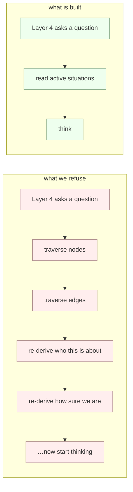
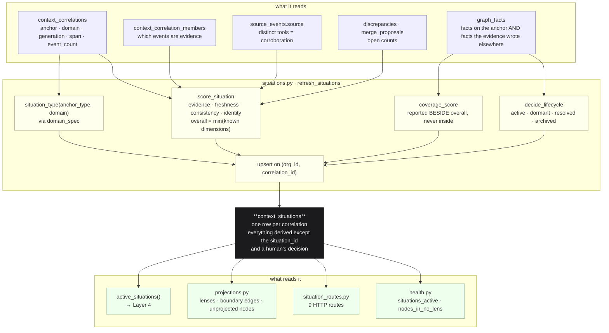

# 05 · The Business Situation Engine

*The object Layer 4 consumes instead of the graph.*

> **The one question this stage answers: "What is going on, and how sure are we?"**
>
> A correlation says *these events are about the same thing*. A situation says **what that
> thing is** — an opportunity, a support case, a relationship — with how sure we are, how
> current it is, and what we still do not know.
>
> It carries **no priority, no risk score and no recommendation.** Those are decisions, and
> decisions belong to a layer that is allowed to have opinions.

---

## §0 · At a glance

| | |
|---|---|
| **Package** | `genios_engine/context/` — `situations.py` · `projections.py` · `domain_spec.py` |
| **Read surface** | `genios_engine/api/situation_routes.py` |
| **Size** | 465 + 236 + 177 + 239 lines |
| **Input** | `context_correlations` + `context_correlation_members` (stage 03) · `graph_facts` · `graph_nodes` · `source_events` · `discrepancies` · `merge_proposals` |
| **Output** | rows in `context_situations`; nine HTTP routes; `active_situations()` for Layer 4 |
| **Tables written** | `context_situations` — **one and only one** |
| **Tables read** | `context_correlations` · `context_correlation_members` · `graph_facts` · `graph_nodes` · `graph_edges` · `source_events` · `discrepancies` · `merge_proposals` |
| **Migrations** | `0038_l2_situations.sql` (the table) · `0040_l2_projection_reads.sql` (the index every read depends on) |
| **LLM calls** | **Zero — test-enforced.** `tests/test_situations.py:test_no_llm_builds_a_situation` fails if the string `llm` appears anywhere in `situations.py`. |
| **Tests** | `tests/test_situations.py` (36 tests) · `tests/test_projections.py` (24 tests) |

---

## §1 · Why a situation is the primary artifact

The Reasoning Engine should never wake up and ask for the graph.

Traversing nodes and edges to rebuild context on every question is not thinking; it is
assembling. **Assembling happens here, once, and is persisted.** That is the entire
argument for this stage existing (`situations.py:1-10`).

### What a situation is *not*

`situations.py:11-20` states it, and `tests/test_situations.py:test_situations_never_carry_priority_or_risk`
enforces it by scanning the module source for `def priority`, `def risk_score`,
`def recommend`, `def urgency`:

> The architecture notes list a Risk Detector and an Opportunity Detector inside this
> stage. That contradicts their own rule that context never decides, and this codebase
> already detects risk in the packs — building it here too would give two layers an
> opinion about the same thing and no way to tell which one was wrong.

> [!IMPORTANT]
> **Spec vs code — the code wins.**
>
> | The Atlas says | The code does |
> |---|---|
> | A *Business Situation Engine* with Risk Detector and Opportunity Detector sub-components | Three modules under `context/`. **No detector is built here.** Risk detection lives in `packs/sales_v1.py` (Layer 4). |
> | Separate Sales / HR / Engineering graphs | **One graph, many derived lenses.** No `node_projections` table exists, and `tests/test_projections.py:test_no_migration_creates_a_projection_membership_table` fails if a migration ever adds one. |
> | A *Pruning Engine* so the graph never grows forever | Pruning is **archival, never deletion** — `STATUS_ARCHIVED` after 180 days, row intact. |
> | A class or service named `SituationEngine` | There is no such class. The stage is four free functions plus a registry: `refresh_situations`, `decide_lifecycle`, `score_situation`, `active_situations`, `spec_for`. |

---

## §2 · The five ideas, and where each is argued

| # | Idea | One line | Argued in |
|---|---|---|---|
| 1 | **One situation per correlation** | The correlation already drew the boundary; two layers drawing it differently is how a graph starts disagreeing with itself. Enforced by `unique (org_id, correlation_id)`. | [01 · Assembly](01-Situation-Assembly.md) |
| 2 | **Confidence is a vector; `overall` is the minimum** | Perfect evidence about an entity we cannot identify is not 60 % confidence, it is unusable. | [01 · Assembly](01-Situation-Assembly.md) |
| 3 | **Coverage sits outside confidence** | Not knowing a deal's close date does not make the stage we *do* know less true. | [01 · Assembly](01-Situation-Assembly.md) |
| 4 | **Two kinds of "done", and they reopen differently** | A fact-resolution self-corrects; a human resolution sticks until new evidence, then reopens. | [02 · Lifecycle](02-Lifecycle.md) |
| 5 | **A lens narrows retrieval, never evaluation** | Showing less is fine. Evaluating less is not — the customer nobody classified is exactly the one nobody would be watching. | [03 · Projections](03-Projections.md) |

---

## §3 · The leaves

| # | Document | Answers |
|---|---|---|
| 01 | [**Situation Assembly**](01-Situation-Assembly.md) | `refresh_situations` end to end — six bulk reads, the per-correlation loop, the upsert column by column. The 1:1 rule. How `situation_type` is resolved. Every confidence formula with its actual constants and worked arithmetic. |
| 02 | [**Lifecycle**](02-Lifecycle.md) | `decide_lifecycle` as an ordered decision table. Why a fact-resolution self-corrects and a human resolution reopens. The archive rule, and the one state it can never reach. What a merge does to a resolved situation. |
| 03 | [**Projections**](03-Projections.md) | `projections.py` — derived not stored, discovered not declared, the constitutional never-gates rule and the test that enforces it, boundary edges, unprojected nodes, and the one place the member count is wrong. |
| 04 | [**Domain Specs**](04-Domain-Specs.md) | `domain_spec.py` — the seam Layer 3 plugs into, why an unregistered domain is a normal case and not an error, and why `spec_version()` is stamped into every situation row. |
| 05 | [**Read Surface**](05-Read-Surface.md) | The nine routes in `situation_routes.py`, exact response shapes, the auth model, and what is deliberately not reachable. |

---

## §4 · The whole stage in one picture

---

## §5 · Every constant in the stage

| Constant | Value | File | Why this value |
|---|---|---|---|
| `STATUS_ACTIVE` | `"active"` | `situations.py:61` | the working set |
| `STATUS_DORMANT` | `"dormant"` | `situations.py:62` | gone quiet — **not** a failure, and never deleted |
| `STATUS_RESOLVED` | `"resolved"` | `situations.py:63` | done, by fact or by a human |
| `STATUS_ARCHIVED` | `"archived"` | `situations.py:64` | resolved and long past — out of the working set, still reopenable |
| `RESOLVED_BY_FACT` | `"fact"` | `situations.py:67` | re-derived every refresh; self-correcting |
| `RESOLVED_BY_HUMAN` | `"human"` | `situations.py:68` | sticks until new evidence, then reopens |
| `DORMANT_AFTER_DAYS` | `45` | `situations.py:70` | **deliberately equal to `correlation.py:CORRELATION_WINDOW_DAYS = 45`.** Past that point the correlation engine opens a new generation, so this one has genuinely ended. |
| `ARCHIVE_AFTER_DAYS` | `180` | `situations.py:72` | six months resolved — out of the working set |
| `_TERMINAL_DEAL_STAGES` | `{"closedwon", "closedlost"}` | `situations.py:80` | the **only** domain vocabulary left in `situations.py`, and it is a *lifecycle* rule, not a statement about what sales means |
| `MEMBER_LIMIT` | `500` | `projections.py:99` | a lens's node ids are serialised to JSON and fed to the boundary-edge query as an array; unbounded, that gets slower as the customer succeeds |
| evidence volume cap | `40` (`8` per event) | `situations.py:115` | volume is the weaker half |
| evidence corroboration cap | `60` (`25` per source) | `situations.py:116` | **60 > 40 on purpose** — cross-tool agreement must be able to outscore a noisy single thread |
| consistency penalty | `34` per open discrepancy | `situations.py:150` | three contradictions take it to zero |
| identity penalty | `100 → 40 → 20` | `situations.py:160-162` | one unresolved duplicate is not a small doubt |

---

## §6 · The rules this stage never breaks

1. **No decisions.** No priority, no risk, no recommendation, no urgency — source-scanned by
   `test_situations_never_carry_priority_or_risk`.
2. **No language model.** Source-scanned by `test_no_llm_builds_a_situation`.
3. **Absence is never negative evidence.** Undated evidence is *excluded* from `overall`,
   not scored zero. A domain with no expected fields is 100 % covered, not 0 % known.
4. **Ordering is not prioritisation.** `active_situations` orders by
   `confidence_overall desc` and says in its own docstring that this is not a ranking —
   `test_ordering_is_by_confidence_and_says_it_is_not_priority` pins both halves.
5. **A lens narrows retrieval, never evaluation.** Nothing under `reason/` may import
   `context.projections` — `test_a_lens_never_narrows_evaluation` walks the tree.
6. **Everything is rebuildable.** The only two things a refresh cannot recreate are the
   `situation_id` and a human's resolution. Everything else is derived
   (`migrations/0038_l2_situations.sql:10-13`).
7. **A failed refresh never blocks ingestion.** `context/runner.py:200-207` wraps
   `refresh_situations` in `except Exception` and logs — a stale situation view must not
   stop events from landing.

---

## §7 · Gaps — what is actually broken

| # | Problem | Severity | Where |
|---|---|---|---|
| 1 | **None of this SQL has ever run against Postgres.** The test suite has no database; every SQL-shaped test asserts on *source text*. | **blocking** | [`Rohit_Updates/Layer 2.md`](../../../Rohit_Updates/Layer%202.md) Part 4 |
| 2 | **`total_members` over-counts when `active_only=False`**, which can flip `truncated` to true on a two-member lens. | high | [03 · Projections §6](03-Projections.md#6--edge-cases-and-one-real-defect) |
| 3 | **A fact-resolved situation can never be archived.** Branch 1 of `decide_lifecycle` fires before the archive branch, and `deal.stage` stays `closedwon` forever. | medium | [02 · Lifecycle §4](02-Lifecycle.md#4--the-archive-rule-and-the-state-it-cannot-reach) |
| 4 | **`first_seen_at` is written once and never corrected.** It is absent from the upsert's `do update set`, so a late-arriving older event widens the correlation's span but not the situation's. | medium | [01 · Assembly §6](01-Situation-Assembly.md#6--the-upsert-column-by-column) |
| 5 | **A human resolve landing between the read pass and the write pass is silently overwritten.** `refresh_situations` reads on one connection and writes on another. | medium | [02 · Lifecycle §6](02-Lifecycle.md#6--edge-cases) |
| 6 | **`test_whatever_falls_through_every_lens_is_findable` passes vacuously.** It asserts `"not exists" in source`; the code uses `not in`, and the string only appears in the docstring. | low | [03 · Projections §7](03-Projections.md#7--the-tests-and-what-two-of-them-do-not-actually-check) |
| 7 | **Nothing calls `register()`.** The Layer 3 seam is built and unused; the four registered specs are Layer 2's own placeholders. | structural | [04 · Domain Specs §5](04-Domain-Specs.md#5--the-layer-3-seam-built-and-not-yet-used) |
| 8 | **Dormant situations are unreachable from the API.** `GET /situations` is hard-filtered to `status = 'active'` with no status parameter. | low | [05 · Read Surface §7](05-Read-Surface.md#7--what-is-deliberately-or-accidentally-unreachable) |

---

## §8 · The one thing to fix first

**Run the migrations.** `0038` and `0040` have never executed. Everything in this folder is
logic that has been reviewed column-by-column against the schema and never once executed by
Postgres — and the failure mode this stage is most exposed to is code that is written,
tested, green, and does nothing.
