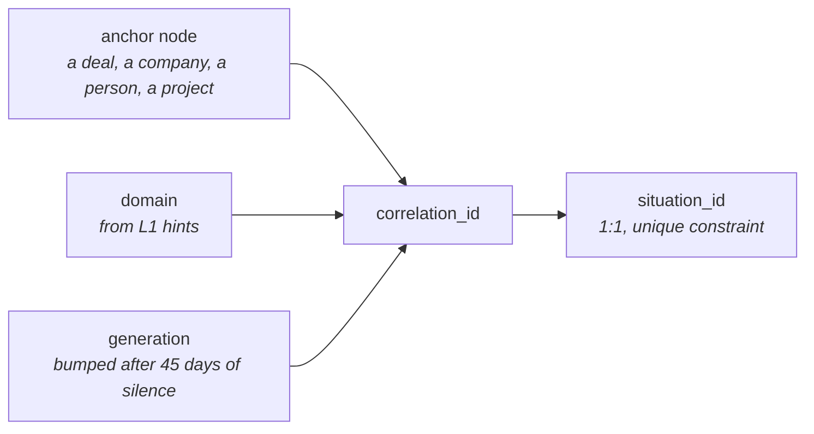
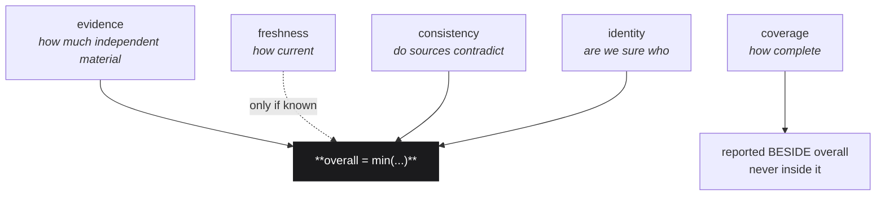
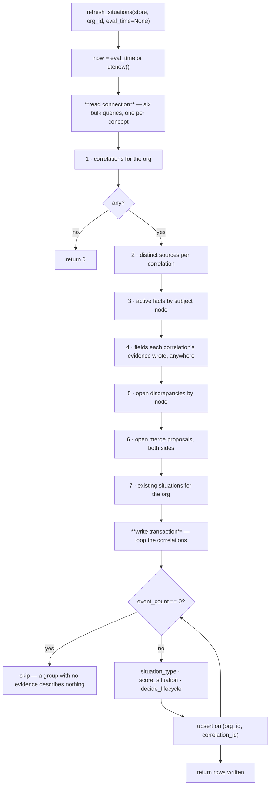

# 01 · Situation Assembly

*`genios_engine/context/situations.py` — how a group of events becomes a described situation.*

> **What this file is for.** One function, `refresh_situations`, rebuilds every situation
> for one org from graph state. It is the only writer of `context_situations`. It reads six
> things in bulk, scores each correlation in memory, and upserts once per row.
>
> **The promise:** running it twice changes nothing. *A situation you cannot rebuild is a
> situation you cannot trust* (`situations.py:287-289`).

---

## §1 · What exists

| Symbol | Kind | Line | Purpose |
|---|---|---|---|
| `situation_type(anchor_type, domain)` | pure fn | `situations.py:83` | anchor node type + domain → the executive's word for it |
| `normalize_stage(value)` | pure fn | `situations.py:93` | a CRM stage string → a comparable token |
| `evidence_score(*, event_count, source_count)` | pure fn | `:102` | how much independent material backs it |
| `freshness_score(*, last_seen_at, now)` | pure fn | `:120` | how current it is — returns `(score, known)` |
| `consistency_score(*, open_discrepancies)` | pure fn | `:143` | do the sources contradict each other |
| `identity_score(*, open_merge_proposals)` | pure fn | `:153` | are we sure *who* it is about |
| `coverage_score(*, present_fields, expected)` | pure fn | `:165` | completeness + plain-language gap names |
| `Confidence` | frozen dataclass | `:178` | the whole vector plus `inputs` |
| `score_situation(...)` | pure fn | `:190` | assembles the vector; `overall = min(known dimensions)` |
| `LifecycleDecision` / `decide_lifecycle(...)` | dataclass + pure fn | `:229` / `:236` | covered in [02 · Lifecycle](02-Lifecycle.md) |
| `_bulk(conn, sql, params)` | helper | `:279` | `conn.execute(text(sql), params).fetchall()` |
| **`refresh_situations(store, org_id, *, eval_time=None)`** | the spine | `:283` | the only writer |
| `resolve_situation(conn, ...)` | writer | `:427` | a human marks one handled — see [02](02-Lifecycle.md) |
| `active_situations(conn, ...)` | reader | `:437` | what Layer 4 asks for instead of the graph |

Everything above `refresh_situations` is **pure**: every input explicit, no clock, no
database. `tests/test_situations.py:test_scoring_is_pure_and_repeatable` and
`test_lifecycle_is_pure_and_repeatable` pin that by calling each twice and comparing.

---

## §2 · The 1:1 rule

```
one correlation  ──────►  exactly one situation
```

It is not a convention. It is a database constraint
(`migrations/0038_l2_situations.sql:51`):

```sql
    -- The 1:1 rule, enforced rather than assumed.
    unique (org_id, correlation_id)
```

### Why the boundary is not redrawn here

The migration header states the argument (`0038_l2_situations.sql:7-9`):

> **ONE SITUATION PER CORRELATION.** The correlation already decided the boundary;
> splitting it further would need judgement nothing deterministic can supply, and two
> layers drawing the same boundary differently is how a graph starts disagreeing with
> itself.

The correlation engine anchors on `(entity, domain)` and versions by `generation`
(`migrations/0037_l2_correlation.sql:32` — `unique (org_id, anchor_node_id, domain, generation)`).
So the identity chain is:



Two consequences that follow directly and are easy to be surprised by:

* **Two generations of the same customer relationship are two situations.** That is
  intended — *the renewal you lost in March is not the renewal you are working in
  September* (`correlation.py:55-58`). `refresh_situations` selects `generation` but never
  branches on it; the correlation id already carries it.
* **A merge that folds two correlations must take one situation with it.** It does:
  `context/merge.py:_merge_correlations` deletes the folded group's situation after
  carrying a human resolution across. Pinned by
  `test_a_folded_correlation_takes_its_situation_with_it`.

### The one thing that is not 1:1

`situation_id` itself. It is `new_id("sit")` — `platform/ids.py:8`, a random
`sit_<24 hex>` — **not** content-addressed. So it cannot be re-derived, which is why
`refresh_situations` reuses `held.situation_id` when a row already exists
(`situations.py:379`) and why the upsert never includes `situation_id` in its
`do update set`. Migration `0038` says so in its header: the exceptions to "everything is
derived" are *the human decision and the identity of the row itself, which must survive a
rebuild or every downstream reference would break.*

---

## §3 · `situation_type` resolution

```python
def situation_type(anchor_type: str, domain: str) -> str:
    return spec_for(domain).type_for(anchor_type)
```
> `situations.py:83-90`

and `type_for` (`domain_spec.py:57-58`):

```python
def type_for(self, anchor_type: str) -> str:
    return self.situation_types.get(anchor_type) or f"{self.domain}_{anchor_type}"
```

Three steps, no branches on any domain name:

1. `spec_for(domain)` lowercases and strips; an empty domain becomes `"general"`; an
   unregistered domain gets `generic_spec(domain)` — **never `None`, never an exception**.
2. The spec's `situation_types` mapping is consulted.
3. A miss falls back to `<domain>_<anchor_type>` — *visibly unmapped rather than silently
   filed as something it is not.*

| `anchor_type` | `domain` | result | why |
|---|---|---|---|
| `deal` | `sales` | `deal` | registered mapping |
| `company` | `sales` | `opportunity` | registered mapping |
| `person` | `sales` | `prospect_relationship` | registered mapping |
| `company` | `support` | `support_case` | registered mapping |
| `company` | `admin` | `account_admin` | registered mapping |
| `company` | `general` | `relationship` | registered mapping |
| `company` | `engineering` | `engineering_company` | **unregistered domain → visible fallback** |
| `deal` | `hiring` | `hiring_deal` | unregistered domain → visible fallback |
| `meeting` | `sales` | `sales_meeting` | registered domain, **unmapped anchor** → same fallback |

Pinned by `test_the_type_decides_what_we_expect_to_know`,
`test_an_unmapped_combination_stays_visibly_unmapped` (both in `test_situations.py`) and
`test_an_unmapped_situation_stays_visibly_unmapped` (`test_projections.py`).

> **Why the fallback is not a generic bucket.** The situation type is what selects the
> *expected fields*. File an unknown thing under a known name and the missing-information
> report starts checking the wrong fields — a report that is confidently wrong. See
> [04 · Domain Specs](04-Domain-Specs.md).

The full registry is documented in [04 · Domain Specs](04-Domain-Specs.md); the important
property here is that `situations.py` names **no domain at all** except in
`_TERMINAL_DEAL_STAGES`, and `test_projections.py:test_domain_names_appear_in_exactly_one_file_in_the_context_layer`
walks every `.py` under `context/` (docstrings and comments stripped by AST) asserting that
`"sales"`, `"support"` and `"admin"` appear only in `domain_spec.py`.

---

## §4 · The confidence vector — the actual arithmetic

Four dimensions describe whether you can **trust** a situation. A fifth, coverage, describes
whether the picture is **complete**, and is deliberately kept out of the trust calculation.



### 4.1 · `evidence_score` — corroboration beats volume

```python
volume        = min(40, max(0, int(event_count)) * 8)
corroboration = min(60, max(0, int(source_count)) * 25)
return max(0, min(100, volume + corroboration))
```
> `situations.py:115-117`

| Constant | Value | Why |
|---|---|---|
| per-event weight | `8` | four events reach the volume cap; more repetition adds nothing |
| volume cap | `40` | the weaker half of the score |
| per-source weight | `25` | three tools reach the corroboration cap |
| corroboration cap | `60` | **must exceed 40**, so cross-tool agreement can always outscore a noisy single thread |

> *Twenty emails in one thread are one person's account of events. An email plus a CRM
> record plus a calendar invite are three systems independently agreeing.*

The docstring records that this was once wrong: *an earlier split (60 volume / 40 sources)
inverted it and made this docstring a lie.*
`test_corroboration_across_tools_beats_volume_in_one` now pins the ordering.

| `event_count` | `source_count` | volume | corroboration | **evidence** |
|---|---|---|---|---|
| 1 | 1 | 8 | 25 | **33** — a single email is weak (`test_a_single_email_is_weak_evidence`) |
| 20 | 1 | 40 | 25 | **65** — one noisy source |
| 3 | 3 | 24 | 60 | **84** — three quiet sources **wins** |
| 4 | 3 | 32 | 60 | **92** |
| 5 | 2 | 40 | 50 | **90** |
| 10 000 | 50 | 40 | 60 | **100** — bounded |
| −5 | −2 | 0 | 0 | **0** — negatives clamped (`test_evidence_is_bounded`) |

`source_count` is *distinct `source_events.source` values across the correlation's members* —
see §5.2. It is not the number of connectors configured, and it is not the number of events.

### 4.2 · `freshness_score` — and the `known` flag

```python
if last_seen_at is None:
    return 0, False
age_days = (now - last_seen_at).total_seconds() / 86400.0
```
> `situations.py:127-140`

| `age_days` | score | reading |
|---|---|---|
| ≤ 3 | **100** | happening now |
| ≤ 7 | **85** | this week |
| ≤ 14 | **70** | last fortnight |
| ≤ 30 | **50** | last month |
| ≤ 45 (`DORMANT_AFTER_DAYS`) | **30** | inside the correlation window, only just |
| > 45 | **10** | past the window — a new generation would open |
| *no date at all* | `0`, **`known=False`** | **not staleness — an absence of information about time** |

The second return value is the whole point of the function. `score_situation` uses it to
*exclude* freshness from the minimum rather than let a `0` masquerade as bad news
(`test_undated_evidence_is_unknown_not_stale`).

### 4.3 · `consistency_score`

```python
return max(0, 100 - min(100, max(0, int(open_discrepancies)) * 34))
```
> `situations.py:150`

| open discrepancies | score |
|---|---|
| 0 | **100** |
| 1 | **66** |
| 2 | **32** |
| ≥ 3 | **0** |

A discrepancy is already a recorded product signal from the graph (`discrepancies` table —
the CRM says closed, Slack says the customer is unhappy). *One is a real dent in trust;
three make the situation something a human must look at before anything acts on it.*
`test_contradicting_sources_cost_confidence` pins `0 → 100`, `1 < 70`, `5 == 0`.

### 4.4 · `identity_score`

```python
if open_merge_proposals <= 0:
    return 100
return 40 if open_merge_proposals == 1 else 20
```
> `situations.py:160-162`

| open proposals | score |
|---|---|
| 0 | **100** |
| 1 | **40** |
| ≥ 2 | **20** |

A step function, not a curve, because *an unresolved duplicate means the evidence may be
split across two nodes — or this situation is about the wrong entity entirely. Neither is a
small doubt, which is why one open proposal costs so much.*

> This is the link that makes the identity review queue a **measurable defect** rather than
> a quiet backlog: every unreviewed merge proposal caps the confidence of every situation
> about that entity at 40.

### 4.5 · `coverage_score` — outside the trust vector

```python
if not expected:
    return 100, []
missing = [label for f, label in sorted(expected.items()) if f not in present_fields]
known   = len(expected) - len(missing)
return int(round(100 * known / len(expected))), missing
```
> `situations.py:170-175`

Three properties worth naming:

* **Empty expectations score 100, not 0.** *We expect nothing, so nothing is missing.*
  Reporting zero would invent a gap that does not exist and make every situation in a newly
  introduced domain look broken on its first day
  (`test_a_type_with_no_expectations_is_fully_covered`,
  `test_projections.py:test_a_new_domain_is_not_reported_as_completely_uncovered`).
* **The gaps are named in plain language**, ordered by *field key* (`sorted(expected.items())`),
  not by label. A reasoner asks for what is missing without knowing field names
  (`test_the_gaps_are_named_in_plain_language`).
* **It never touches `overall`.** `test_missing_information_never_lowers_confidence` builds
  a complete and a sparse situation and asserts `sparse.coverage < complete.coverage` while
  `sparse.overall == complete.overall`.

### 4.6 · `score_situation` — minimum, not average

```python
trust = [evidence, consistency, identity]
if freshness_known:
    trust.append(freshness)
return Confidence(overall=min(trust), ...)
```
> `situations.py:205-224`

**Why minimum.** They are failure modes, not features. Averaging lets one strong dimension
hide a fatal one: *perfect evidence about an entity we cannot identify is not 60 %
confidence, it is unusable.* `test_overall_is_the_minimum_not_the_average` is the central
test of the module.

**`inputs` — the arithmetic, persisted.** Every situation row stores a jsonb `inputs` blob
so a score can be accounted for:

| key | value |
|---|---|
| `event_count`, `source_count` | the evidence inputs |
| `freshness_known` | the flag that decides whether freshness entered the minimum |
| `open_discrepancies`, `open_merge_proposals` | the consistency and identity inputs |
| `last_seen_at` | ISO string or `null` |
| `domain_spec_version` | `spec_version()` — **which registry typed this row** ([04](04-Domain-Specs.md)) |
| `weakest` | the name of the dimension that produced `overall` |

`weakest` is computed by an inline chain (`situations.py:221-224`) evaluated in the order
**freshness → evidence → consistency → identity**; on a tie the first in that order wins.
*A confidence number nobody can account for is a number nobody should act on*
(`test_the_score_explains_itself`).

### 4.7 · Three worked examples

**A — the four-system deal.** Correlation `corr_9f31…`, anchor `node_deal_88`
(`anchor_type = "deal"`, `domain = "sales"`), 4 events from Gmail + Google Calendar +
HubSpot, last event `2026-08-04T16:40Z`, evaluated at `now = 2026-08-06T12:00Z`. No open
discrepancies, no open merge proposals. The deal node holds `deal.stage = "contractsent"`
and `deal.amount`; the correlation's evidence also wrote `thread.ball_in_court` onto a
person.

| step | arithmetic | result |
|---|---|---|
| `situation_type("deal", "sales")` | registered mapping | `"deal"` |
| evidence | `min(40, 4×8=32)=32` + `min(60, 3×25=75)=60` | **92** |
| freshness | age `1.81 d` ≤ 3 | **100**, `known=True` |
| consistency | `100 − 0×34` | **100** |
| identity | 0 proposals | **100** |
| **overall** | `min(92, 100, 100, 100)` | **92** |
| `weakest` | freshness (100) ≠ 92; evidence (92) = 92 | `"evidence"` |
| expected fields | `fields_for("deal")` = 4 | `deal.stage`, `deal.amount`, `deal.close_date`, `commitment.due_at` |
| present fields | `{deal.stage, deal.amount} ∪ {thread.ball_in_court}` | 2 of the 4 expected |
| coverage | `round(100 × 2 / 4)` | **50** |
| missing | sorted by field key | `["agreed next step", "expected close date"]` |
| lifecycle | `normalize_stage("contractsent")` not terminal, age ≤ 45 d | `active` |

**B — the identity trap.** 50 events, 5 sources, **one open merge proposal**.

| dimension | value |
|---|---|
| evidence | `min(40,400)=40 + min(60,125)=60` = **100** |
| freshness | **100** |
| consistency | **100** |
| identity | **40** |
| **overall (minimum)** | **40** |
| *what an average would have said* | *(100+100+100+40)/4 =* **85** |

The average would have reported an unusable situation as fine. This exact case is
`test_overall_is_the_minimum_not_the_average`.

**C — undated evidence.** 5 events, 2 sources, `last_seen_at = None`.

| dimension | value |
|---|---|
| evidence | **90** |
| freshness | `0`, but `known=False` → **excluded from the minimum** |
| consistency | **100** |
| identity | **100** |
| **overall** | `min(90, 100, 100)` = **90** |

> [!WARNING]
> The row still stores `confidence_freshness = 0`. A dashboard that reads that column
> without reading `inputs.freshness_known` will show "0 % fresh, 90 % overall" and look
> broken. The flag is the disambiguator and it lives in `inputs`, not in a column.

---

## §5 · `refresh_situations`, end to end



### 5.1 · The read pass — one query per concept

*Bulk-read the org, score in memory, upsert once per situation. The same shape as
`refresh_attention`, for the same reason: one query per concept beats one query per row the
moment a tenant has real volume* (`situations.py:273-277`).

| # | Line | Reads | Keyed by | Used for |
|---|---|---|---|---|
| 1 | `:293` | `context_correlations` — `correlation_id, anchor_node_id, anchor_type, domain, generation, first_event_at, last_event_at, event_count` | — | the loop itself. Empty ⇒ **return 0 immediately** |
| 2 | `:302` | `count(distinct se.source)` over `context_correlation_members ⋈ source_events` | `correlation_id` | `source_count` — corroboration |
| 3 | `:309` | `graph_facts` where `valid_to is null and status='active'` | `subject_node_id → {field: value}` | `deal.stage` for lifecycle; the anchor's own fields for coverage |
| 4 | `:322` | `distinct m.correlation_id, f.field` over members ⋈ facts on `f.created_by_event_id = m.event_id` | `correlation_id → {field}` | **the fields this situation's evidence established, wherever they landed** |
| 5 | `:331` | `discrepancies` where `status='open'` | `subject_node_id → count` | consistency |
| 6 | `:336` | `merge_proposals` where `status='open'` | **both** `left_node_id` and `right_node_id` → count | identity |
| 7 | `:343` | `context_situations` — `situation_id, status, resolved_by, resolved_at` | `correlation_id` | the held row: identity + human decision |

Query 6 counts an open proposal against **both** nodes: *an open duplicate on EITHER side
means we are unsure who this is about.*

### 5.2 · Query 4 — the bug that made coverage useless

Query 3 alone would have been the obvious implementation, and it was wrong. From
`situations.py:315-321`:

> Checking only the anchor node is wrong and quietly useless: `thread.ball_in_court` and
> `commitment.due_at` are written to **people**, so a company-anchored opportunity would
> report "whose turn it is" missing forever — a detector that is always right and never
> informative.

So coverage asks **what this situation knows**, not what one node holds:

```python
present_fields = set(node_facts) | fields_by_correlation.get(corr.correlation_id, set())
```
> `situations.py:365-366`

Pinned by `test_coverage_looks_at_the_whole_situation_not_just_the_anchor`, which asserts
both `"fields_by_correlation"` and the exact union expression appear in the source.

That join — `context_correlation_members.event_id → graph_facts.created_by_event_id` — is
the reason `migrations/0040_l2_projection_reads.sql` exists. Migration `0004` indexes
`graph_facts` on `(org_id, subject_node_id, field)` and `(org_id, fact_id)` and nothing on
`created_by_event_id`. `0040` adds:

```sql
create index if not exists graph_facts_by_event
    on graph_facts (org_id, created_by_event_id)
    where valid_to is null;
```

Partial on `valid_to is null` because every reader of this join asks only for current facts.

### 5.3 · The write pass

One transaction (`store.engine.begin()`), one upsert per surviving correlation.

```python
if not corr.event_count:
    continue          # a group with no evidence describes nothing
```
> `situations.py:349-350` · pinned by `test_a_correlation_with_no_evidence_produces_no_situation`

Then, per correlation:

```python
stype      = situation_type(corr.anchor_type, corr.domain)
node_facts = facts_by_node.get(corr.anchor_node_id, {})
expected   = spec_for(corr.domain).fields_for(stype)
confidence = score_situation(...)
lifecycle  = decide_lifecycle(..., terminal_by_fact=normalize_stage(
                 node_facts.get("deal.stage")) in _TERMINAL_DEAL_STAGES, ...)
situation_id = held.situation_id if held else new_id("sit")
```

Note the ordering dependency: `expected` is looked up by **situation type**, not by anchor
type — so re-typing a domain in the registry also changes which fields count as missing.
That is exactly why `spec_version()` is stamped into `inputs` ([04](04-Domain-Specs.md)).

### 5.4 · `normalize_stage` — every spelling of a closed deal

```python
raw = str(value or "").strip().strip('"').lower()
return "".join(ch for ch in raw if ch.isalnum())
```
> `situations.py:95-97`

Values arrive **JSON-encoded** out of `graph_facts.value`, so the leading and trailing
quotes are real.

| raw value in `graph_facts.value` | normalised | terminal? |
|---|---|---|
| `"closedwon"` (with quotes) | `closedwon` | ✅ |
| `CLOSED_WON` | `closedwon` | ✅ |
| `Closed Won` | `closedwon` | ✅ |
| `Closed-Lost` | `closedlost` | ✅ |
| `contractsent` | `contractsent` | ❌ |
| `negotiation` | `negotiation` | ❌ |
| `qualifiedtobuy` | `qualifiedtobuy` | ❌ |
| `""` / `None` | `""` | ❌ |

`test_every_spelling_of_a_closed_deal_counts` and
`test_an_open_stage_is_not_mistaken_for_a_closed_one` pin both halves. *Missing one leaves
closed deals sitting in the active list forever.*

---

## §6 · The upsert, column by column

```sql
insert into context_situations (...)
values (:sid, :o, :cid, :anode, :stype, :dom, :status, :rby,
        case when :status in ('resolved', 'archived')
             then coalesce(:rat, :now) end,
        :c_all, :c_ev, :c_fr, :c_co, :c_id, :cov, cast(:missing as jsonb),
        cast(:inputs as jsonb), :first, :last, :now)
on conflict (org_id, correlation_id) do update set ...
```
> `situations.py:380-412`

| Column | On insert | On conflict | Why |
|---|---|---|---|
| `situation_id` | `held.situation_id` or `new_id("sit")` | **not updated** | downstream references (a notification sent last week) must keep resolving |
| `org_id`, `correlation_id` | as read | **not updated** | the conflict key |
| `anchor_node_id` | `corr.anchor_node_id` | **not updated** | a merge repoints it instead — `merge.py:_NODE_REFERENCES` lists `("context_situations", "anchor_node_id")`, pinned by `test_a_repointed_situation_follows_the_surviving_entity` |
| `situation_type` | computed | **updated** | a registry change re-types the row; `inputs.domain_spec_version` records which registry did it |
| `domain` | `corr.domain` | **not updated** | part of the correlation's own unique key — it cannot change |
| `status`, `resolved_by` | from `decide_lifecycle` | **updated** | re-derived every refresh |
| `resolved_at` | `case when status in ('resolved','archived') then coalesce(:rat, :now) end` | **updated** | see the callout below |
| `resolution_note` | (not in the insert list) | `case when excluded.status in ('resolved','archived') then context_situations.resolution_note end` | a **reopened** situation must not keep the note explaining why it was closed — the `case` has no `else`, so it evaluates to `NULL` and the note is dropped |
| `confidence_*` (5), `coverage`, `missing`, `inputs` | computed | **updated** | derived |
| `first_seen_at` | `corr.first_event_at` | **⚠️ not updated** | see the defect below |
| `last_seen_at` | `corr.last_event_at` | **updated** | drives freshness and dormancy |
| `computed_at` | `now` | **updated** | when this row was last rebuilt |

> [!IMPORTANT]
> **Archived counts as resolved for `resolved_at`, and that is load-bearing.**
> `situations.py:387-391` explains it:
>
> > Clearing `resolved_at` on archive would strand the row forever: `decide_lifecycle`
> > needs that timestamp to tell whether new evidence post-dates the resolution, so a null
> > makes an archived situation permanently unable to reopen — the opposite of what the
> > lifecycle rules say, and invisible in a pure test.
>
> This is the seam bug the `Rohit_Updates` log lists as #6: *the logic said "reopens on new
> evidence" and passed its test; the SQL made it impossible.* Pinned textually by
> `test_an_archived_situation_keeps_the_timestamp_it_needs_to_reopen`, which asserts the
> literal string `in ('resolved', 'archived')` is present in the function source.

> [!WARNING]
> **Defect — `first_seen_at` is written once and never corrected.**
> It is in the `values` list and absent from `do update set`. But
> `correlation.py:merged_span` widens a group's span **in both directions**, because *a
> late-arriving old event legitimately moves the start of a situation backwards*. So a
> connector recovering from an outage can move `context_correlations.first_event_at`
> earlier while `context_situations.first_seen_at` keeps the older, wrong value. Every
> other derived column is re-derived; this one silently is not. No test covers it.

---

## §7 · Idempotency, and the two places it leaks

The claim (`situations.py:287-289`): *Idempotent: running it twice changes nothing, because
every value is derived from graph state plus a stored human decision.*

It holds for the confidence vector, the type, the coverage, the missing list and the
lifecycle status. It leaks in two places:

1. **`first_seen_at`** — §6 above.
2. **`computed_at`** — always `:now`, so a second run does change one column. Harmless, and
   intended: it is the "when was this last rebuilt" stamp.

And one **race**, because the read pass and the write pass are on different connections
(`store.engine.connect()` at `:292`, then `store.engine.begin()` at `:348`):

```
t0   refresh reads existing → situation S is {status: active, resolved_by: null}
t1   a human POSTs .../resolve → S becomes {resolved, human, resolved_at: t1}
t2   refresh writes → decide_lifecycle(current_status="active", ...) → active
                   → resolved_at case yields NULL
```

The human's resolution is lost. The window is the duration of the loop over the org's
correlations. See [02 · Lifecycle §6](02-Lifecycle.md#6--edge-cases).

---

## §8 · `active_situations` — what Layer 4 reads

```sql
select s.situation_id, s.situation_type, s.domain, s.status,
       s.confidence_overall, s.confidence_evidence, s.confidence_freshness,
       s.confidence_consistency, s.confidence_identity, s.coverage, s.missing,
       s.first_seen_at, s.last_seen_at, s.anchor_node_id,
       n.display_name as anchor_name, n.node_type as anchor_type,
       c.event_count
from context_situations s
join context_correlations c on c.org_id = s.org_id
     and c.correlation_id = s.correlation_id
left join graph_nodes n on n.org_id = s.org_id and n.node_id = s.anchor_node_id
     and n.valid_to is null
where s.org_id = :o and s.status = 'active' [and s.domain = :dom]
order by s.confidence_overall desc, s.last_seen_at desc nulls last limit :lim
```
> `situations.py:449-463` · default `limit = 100`

Four things to know about this query:

* **The join to `context_correlations` is inner.** An orphaned situation whose correlation
  was deleted disappears from the list rather than describing nothing. Merge deletes both
  together, so this should never fire — it is a backstop.
* **The join to `graph_nodes` is left, with `valid_to is null`.** A situation anchored on a
  node that was closed by a merge still lists, with `anchor_name = NULL`. `health.py`
  counts these separately as an integrity issue.
* **The ordering is `confidence_overall desc`.** The docstring is explicit that this is not
  a ranking:

  > *Ordered by confidence: a situation we are sure about is worth more thought than one
  > assembled from a single unverified email. **Ordering is NOT prioritisation** — which
  > situation matters most is a decision, and this layer does not make decisions.*

  `test_ordering_is_by_confidence_and_says_it_is_not_priority` asserts **both** the
  `order by` clause and the phrase `not prioritisation` are present. Deleting the comment
  fails the test — deliberately.
* **`status = 'active'` is hard-coded.** There is no way to list dormant situations through
  this function or the route that wraps it. See
  [05 · Read Surface §7](05-Read-Surface.md#7--what-is-deliberately-or-accidentally-unreachable).

---

## §9 · Who calls `refresh_situations`

| Caller | File | When | Failure behaviour |
|---|---|---|---|
| the L2 drain | `context/runner.py:200-207` | after every drain that processed anything, **after** the attention refresh | wrapped in `except Exception`, logged via `genios.l2`, **never fatal** |
| the backfill | `context/backfill.py:143` | last of the three backfill stages | propagates |
| `POST /situations/backfill` | `api/situation_routes.py:133` | on demand | propagates as a 500 |

The runner's ordering comment (`runner.py:195-198`) is the rule:

> Situations are rebuilt AFTER attention, from correlations the drain just extended. Every
> value is derived, so a failure here costs a refresh cycle, not data — the next drain
> recomputes it. **Never fatal: a situation view being briefly stale must not stop events
> from landing.**

`test_a_failed_refresh_never_blocks_ingestion` locates `refresh_situations` in the runner's
source and asserts `except Exception` appears within the following 400 characters.

**Scope.** `refresh_situations` rebuilds **the whole org** on every drain. `Rohit_Updates`
Part 4 lists this as a known performance item: *same shape as the existing attention
refresh. Fine now; needs incremental scoping at scale.*

---

## §10 · Tests

| Test | Pins |
|---|---|
| `test_the_type_decides_what_we_expect_to_know` | the three registered mappings |
| `test_an_unmapped_combination_stays_visibly_unmapped` | `engineering_company`, not a bucket |
| `test_corroboration_across_tools_beats_volume_in_one` | 60 > 40, the whole evidence design |
| `test_a_single_email_is_weak_evidence` · `test_evidence_is_bounded` | 33 < 50; clamps |
| `test_freshness_decays_with_age` | monotonic decay, `known=True` at both ends |
| `test_undated_evidence_is_unknown_not_stale` | `(0, False)` |
| `test_contradicting_sources_cost_confidence` | 100 / <70 / 0 |
| `test_an_unresolved_duplicate_is_a_large_doubt` | 100 / ≤40 / lower still |
| **`test_overall_is_the_minimum_not_the_average`** | **the central rule** |
| `test_an_unknown_dimension_is_excluded_not_zeroed` | freshness excluded, `overall > 0` |
| `test_a_stale_but_known_date_does_lower_confidence` | the converse — 300 days old *does* drive `overall` |
| `test_missing_information_never_lowers_confidence` | coverage is outside `overall` |
| `test_the_gaps_are_named_in_plain_language` | plain-language `missing` list |
| `test_a_type_with_no_expectations_is_fully_covered` | 100, not 0 |
| `test_the_score_explains_itself` | `inputs.weakest` |
| `test_scoring_is_pure_and_repeatable` | purity |
| `test_every_spelling_of_a_closed_deal_counts` | four CRM spellings collapse to one |
| `test_an_open_stage_is_not_mistaken_for_a_closed_one` | no false terminals |
| `test_situations_never_carry_priority_or_risk` · `test_no_llm_builds_a_situation` | the boundaries |
| `test_a_correlation_with_no_evidence_produces_no_situation` | the `event_count` guard |
| `test_an_archived_situation_keeps_the_timestamp_it_needs_to_reopen` | the `resolved_at` seam |
| `test_coverage_looks_at_the_whole_situation_not_just_the_anchor` | `fields_by_correlation` |
| `test_a_reopened_situation_drops_its_resolution_note` | the `resolution_note` case |
| `test_a_folded_correlation_takes_its_situation_with_it` | merge deletes the orphan |
| `test_folding_never_loses_a_human_resolution` | merge carries `resolved_by='human'` |
| `test_a_repointed_situation_follows_the_surviving_entity` | `_NODE_REFERENCES` |
| `test_a_failed_refresh_never_blocks_ingestion` | the runner's `except` |
| `test_ordering_is_by_confidence_and_says_it_is_not_priority` | the read ordering |

> [!NOTE]
> Nine of these assert on **source text** (`inspect.getsource(...)` + `in`), not behaviour,
> because the test suite has no database and cannot execute the SQL. They pin the prose as
> much as the logic. `Rohit_Updates/Layer 2.md` Part 4 flags this as systemic and names the
> fix: a test Postgres in CI.
